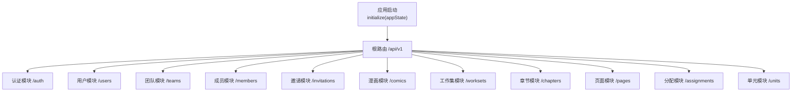
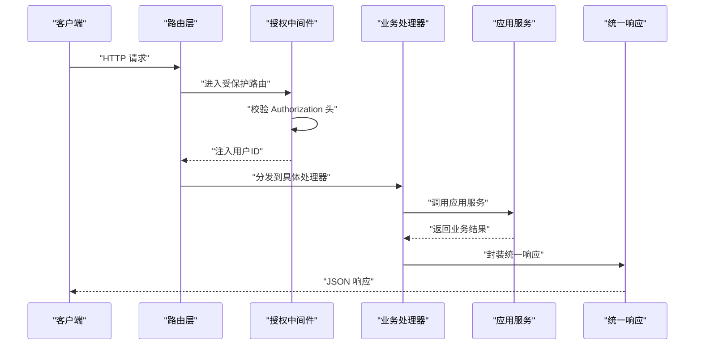
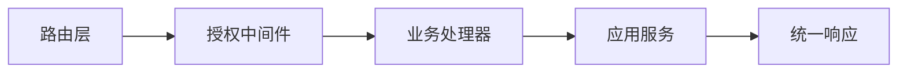

# API 接口文档

<cite>
**本文档引用的文件**
- [http.go](file://internal/api/http/http.go)
- [auth.go](file://internal/api/http/auth.go)
- [user.go](file://internal/api/http/user.go)
- [team.go](file://internal/api/http/team.go)
- [member.go](file://internal/api/http/member.go)
- [invitation.go](file://internal/api/http/invitation.go)
- [comic.go](file://internal/api/http/comic.go)
- [workset.go](file://internal/api/http/workset.go)
- [chapter.go](file://internal/api/http/chapter.go)
- [page.go](file://internal/api/http/page.go)
- [assignment.go](file://internal/api/http/assignment.go)
- [unit.go](file://internal/api/http/unit.go)
- [middleware.go](file://internal/api/http/middleware.go)
- [types.go](file://internal/api/http/types.go)
- [swagger.yaml](file://docs/swagger.yaml)
</cite>

## 目录
1. [简介](#简介)
2. [项目结构](#项目结构)
3. [核心组件](#核心组件)
4. [架构总览](#架构总览)
5. [详细组件分析](#详细组件分析)
6. [依赖分析](#依赖分析)
7. [性能考虑](#性能考虑)
8. [故障排除指南](#故障排除指南)
9. [结论](#结论)
10. [附录](#附录)

## 简介
本项目为 poprako-web-ms 的后端服务，提供 RESTful API 接口，覆盖认证、用户管理、团队管理、内容管理、任务分配等功能模块。接口采用 Iris 框架构建，基于版本化的基础路径 `/api/v1`，统一使用 JSON 数据格式，支持 Swagger 文档自动生成与调试。

## 项目结构
后端 API 路由组织遵循按功能域划分的层次结构，主要分为认证、用户、团队、成员、邀请、漫画、工作集、章节、页面、分配、单元等模块。所有受保护接口均需通过授权中间件校验。

**图表来源**
- [http.go:26-151](file://internal/api/http/http.go#L26-L151)

**章节来源**
- [http.go:38-151](file://internal/api/http/http.go#L38-L151)

## 核心组件
- 路由初始化与版本控制：所有路由挂载在 `/api/v1` 下，便于未来版本演进与向后兼容。
- 授权中间件：统一校验 `Authorization: Bearer <token>`，解析 JWT 并注入用户上下文。
- 统一响应格式：所有接口返回统一结构体，包含状态码、消息与业务数据。
- Swagger 文档：非生产环境自动暴露 `/swagger` 路径，便于调试与联调。

**章节来源**
- [http.go:38-151](file://internal/api/http/http.go#L38-L151)
- [middleware.go:47-79](file://internal/api/http/middleware.go#L47-L79)
- [types.go:3-9](file://internal/api/http/types.go#L3-L9)

## 架构总览
下图展示请求从客户端到具体业务处理的流转过程，以及授权中间件与各模块处理器之间的关系。

**图表来源**
- [middleware.go:47-79](file://internal/api/http/middleware.go#L47-L79)
- [http.go:26-151](file://internal/api/http/http.go#L26-L151)

## 详细组件分析

### 认证接口
- 登录
  - 方法与路径：POST `/api/v1/auth/login`
  - 请求体参数：qq、password
  - 成功响应：access_token、user_id
  - 失败响应：错误信息
- 注册
  - 方法与路径：POST `/api/v1/auth/register`
  - 请求体参数：invitation_code、name、password、qq
  - 成功响应：access_token、user_id
  - 失败响应：错误信息

请求头要求
- Content-Type: application/json

响应示例
- 成功：{"code":200,"message":"注册成功","data":{"access_token":"...","user_id":"..."}}
- 失败：{"code":400,"message":"请求体格式错误: ...","data":null}

**章节来源**
- [auth.go:10-72](file://internal/api/http/auth.go#L10-L72)
- [swagger.yaml:789-840](file://docs/swagger.yaml#L789-L840)

### 用户管理接口
- 获取当前用户信息
  - 方法与路径：GET `/api/v1/users/mine`
  - 成功响应：UserInfo 对象
- 根据 ID 获取用户
  - 方法与路径：GET `/api/v1/users/{user_id}`
  - 路径参数：user_id
  - 查询参数：includes（可选）
  - 成功响应：UserInfo 对象
- 更新用户
  - 方法与路径：PUT `/api/v1/users/{user_id}`
  - 路径参数：user_id
  - 请求体参数：name、password、qq
  - 成功响应：空对象
- 删除用户
  - 方法与路径：DELETE `/api/v1/users/{user_id}`
  - 路径参数：user_id
  - 成功响应：空对象
- 预留用户头像上传
  - 方法与路径：POST `/api/v1/users/{user_id}/avatar`
  - 路径参数：user_id
  - 成功响应：ReserveUserAvatarResult
- 确认用户头像上传
  - 方法与路径：POST `/api/v1/users/{user_id}/avatar/confirm`
  - 路径参数：user_id
  - 成功响应：空对象

请求头要求
- Authorization: Bearer <token>
- Content-Type: application/json

**章节来源**
- [user.go:10-291](file://internal/api/http/user.go#L10-L291)
- [swagger.yaml:19-291](file://docs/swagger.yaml#L19-L291)

### 团队管理接口
- 创建团队
  - 方法与路径：POST `/api/v1/teams`
  - 请求体参数：name、description
  - 成功响应：CreateTeamResult
- 获取所有团队列表
  - 方法与路径：GET `/api/v1/teams`
  - 查询参数：offset、limit
  - 成功响应：TeamInfo 数组
- 获取我的团队列表
  - 方法与路径：GET `/api/v1/teams/mine`
  - 查询参数：offset、limit
  - 成功响应：TeamInfo 数组
- 更新团队
  - 方法与路径：PUT `/api/v1/teams/{team_id}`
  - 路径参数：team_id
  - 请求体参数：name、description
  - 成功响应：空对象
- 删除团队
  - 方法与路径：DELETE `/api/v1/teams/{team_id}`
  - 路径参数：team_id
  - 成功响应：空对象
- 预留团队头像上传
  - 方法与路径：POST `/api/v1/teams/{team_id}/avatar`
  - 路径参数：team_id
  - 成功响应：ReserveTeamAvatarResult
- 确认团队头像上传
  - 方法与路径：POST `/api/v1/teams/{team_id}/avatar/confirm`
  - 路径参数：team_id
  - 成功响应：空对象

请求头要求
- Authorization: Bearer <token>
- Content-Type: application/json

**章节来源**
- [team.go:10-288](file://internal/api/http/team.go#L10-L288)
- [swagger.yaml:375-391](file://docs/swagger.yaml#L375-L391)

### 成员管理接口
- 创建成员
  - 方法与路径：POST `/api/v1/members`
  - 请求体参数：user_id、team_id、roles
  - 成功响应：CreateMemberResult
- 加入团队
  - 方法与路径：POST `/api/v1/members/join`
  - 请求体参数：invitation_code
  - 成功响应：空对象
- 获取指定团队成员列表
  - 方法与路径：GET `/api/v1/members`
  - 查询参数：team_id、includes、offset、limit
  - 成功响应：MemberInfo 数组
- 获取我的成员身份列表
  - 方法与路径：GET `/api/v1/members/mine`
  - 查询参数：includes、offset、limit
  - 成功响应：MemberInfo 数组
- 更新成员角色
  - 方法与路径：PUT `/api/v1/members/{member_id}`
  - 路径参数：member_id
  - 请求体参数：id、roles
  - 成功响应：空对象
- 移除成员
  - 方法与路径：DELETE `/api/v1/members/{member_id}`
  - 路径参数：member_id
  - 成功响应：空对象

请求头要求
- Authorization: Bearer <token>
- Content-Type: application/json

**章节来源**
- [member.go:10-271](file://internal/api/http/member.go#L10-L271)
- [swagger.yaml:259-291](file://docs/swagger.yaml#L259-L291)

### 邀请管理接口
- 获取邀请列表
  - 方法与路径：GET `/api/v1/invitations`
  - 查询参数：team_id、offset、limit、includes
  - 成功响应：InvitationInfo 数组
- 创建邀请
  - 方法与路径：POST `/api/v1/invitations`
  - 请求体参数：team_id、invitee_qq、roles
  - 成功响应：InvitationInfo
- 更新未使用邀请
  - 方法与路径：PATCH `/api/v1/invitations/{invitation_id}`
  - 路径参数：invitation_id
  - 请求体参数：id、team_id、roles
  - 成功响应：空对象
- 删除邀请
  - 方法与路径：DELETE `/api/v1/invitations/{invitation_id}`
  - 路径参数：invitation_id
  - 成功响应：空对象

请求头要求
- Authorization: Bearer <token>
- Content-Type: application/json

**章节来源**
- [invitation.go:10-184](file://internal/api/http/invitation.go#L10-L184)
- [swagger.yaml:221-239](file://docs/swagger.yaml#L221-L239)

### 内容管理接口（漫画/工作集）
- 获取工作集列表
  - 方法与路径：GET `/api/v1/worksets`
  - 查询参数：team_id、includes、offset、limit
  - 成功响应：WorksetInfo 数组
- 创建工作集
  - 方法与路径：POST `/api/v1/worksets`
  - 请求体参数：team_id、name、description
  - 成功响应：CreateWorksetResult
- 更新工作集
  - 方法与路径：PUT `/api/v1/worksets/{workset_id}`
  - 路径参数：workset_id
  - 请求体参数：id、name、description
  - 成功响应：空对象
- 删除工作集
  - 方法与路径：DELETE `/api/v1/worksets/{workset_id}`
  - 路径参数：workset_id
  - 成功响应：空对象

- 获取漫画列表
  - 方法与路径：GET `/api/v1/comics`
  - 查询参数：workset_id、includes、offset、limit
  - 成功响应：ComicInfo 数组
- 创建漫画
  - 方法与路径：POST `/api/v1/comics`
  - 请求体参数：workset_id、title、author、description
  - 成功响应：CreateComicResult
- 更新漫画
  - 方法与路径：PATCH `/api/v1/comics/{comic_id}`
  - 路径参数：comic_id
  - 请求体参数：id、title、author、description
  - 成功响应：空对象
- 删除漫画
  - 方法与路径：DELETE `/api/v1/comics/{comic_id}`
  - 路径参数：comic_id
  - 成功响应：空对象

请求头要求
- Authorization: Bearer <token>
- Content-Type: application/json

**章节来源**
- [workset.go:10-188](file://internal/api/http/workset.go#L10-L188)
- [comic.go:10-188](file://internal/api/http/comic.go#L10-L188)
- [swagger.yaml:99-129](file://docs/swagger.yaml#L99-L129)
- [swagger.yaml:216-220](file://docs/swagger.yaml#L216-L220)

### 章节管理接口
- 获取漫画章节列表
  - 方法与路径：GET `/api/v1/chapters`
  - 查询参数：comic_id、includes、offset、limit
  - 成功响应：ChapterInfo 数组
- 创建漫画章节
  - 方法与路径：POST `/api/v1/chapters`
  - 请求体参数：comic_id、chapter_no
  - 成功响应：CreateChapterResult
- 更新章节
  - 方法与路径：PATCH `/api/v1/chapters/{chapter_id}`
  - 路径参数：chapter_id
  - 请求体参数：chapter_id、chapter_no、translate_status、proofread_status、review_status、publish_status、typeset_status、upload_status
  - 成功响应：空对象
- 删除章节
  - 方法与路径：DELETE `/api/v1/chapters/{chapter_id}`
  - 路径参数：chapter_id
  - 成功响应：空对象

请求头要求
- Authorization: Bearer <token>
- Content-Type: application/json

**章节来源**
- [chapter.go:10-184](file://internal/api/http/chapter.go#L10-L184)
- [swagger.yaml:52-98](file://docs/swagger.yaml#L52-L98)

### 页面管理接口
- 获取章节页面列表
  - 方法与路径：GET `/api/v1/pages`
  - 查询参数：chapter_id、includes、offset、limit
  - 成功响应：PageInfo 数组
- 预留章节页面并生成上传地址
  - 方法与路径：POST `/api/v1/pages`
  - 请求体参数：chapter_id、page_count
  - 成功响应：ReserveChapterPagesResult
- 更新页面
  - 方法与路径：PUT `/api/v1/pages/{page_id}`
  - 路径参数：page_id
  - 请求体参数：id、is_uploaded
  - 成功响应：空对象
- 删除章节所有页面
  - 方法与路径：DELETE `/api/v1/pages/{chapter_id}`
  - 路径参数：chapter_id
  - 成功响应：空对象

请求头要求
- Authorization: Bearer <token>
- Content-Type: application/json

**章节来源**
- [page.go:10-188](file://internal/api/http/page.go#L10-L188)
- [swagger.yaml:299-323](file://docs/swagger.yaml#L299-L323)
- [swagger.yaml:342-355](file://docs/swagger.yaml#L342-L355)

### 任务分配接口
- 获取章节分配列表
  - 方法与路径：GET `/api/v1/assignments`
  - 查询参数：chapter_id、includes、offset、limit
  - 成功响应：AssignmentInfo 数组
- 获取我的分配列表
  - 方法与路径：GET `/api/v1/assignments/mine`
  - 查询参数：includes、offset、limit
  - 成功响应：AssignmentInfo 数组
- 创建章节分配
  - 方法与路径：POST `/api/v1/assignments`
  - 请求体参数：chapter_id、user_id、role
  - 成功响应：CreateChapterAssignmentResult
- 更新分配角色
  - 方法与路径：PUT `/api/v1/assignments/{assignment_id}`
  - 路径参数：assignment_id
  - 请求体参数：id、role
  - 成功响应：空对象
- 删除分配
  - 方法与路径：DELETE `/api/v1/assignments/{assignment_id}`
  - 路径参数：assignment_id
  - 成功响应：空对象

请求头要求
- Authorization: Bearer <token>
- Content-Type: application/json

**章节来源**
- [assignment.go:10-227](file://internal/api/http/assignment.go#L10-L227)
- [swagger.yaml:19-51](file://docs/swagger.yaml#L19-L51)

### 单元管理接口
- 获取页面 unit 列表
  - 方法与路径：GET `/api/v1/units`
  - 查询参数：page_id
  - 成功响应：UnitInfo 数组
- 保存页面 unit diff
  - 方法与路径：PUT `/api/v1/units`
  - 请求体参数：page_id、unit_diff（包含 insert、patch、delete）
  - 成功响应：空对象

请求头要求
- Authorization: Bearer <token>
- Content-Type: application/json

**章节来源**
- [unit.go:10-90](file://internal/api/http/unit.go#L10-L90)
- [swagger.yaml:421-494](file://docs/swagger.yaml#L421-L494)

## 依赖分析
- 路由与中间件
  - 路由在 `/api/v1` 下按模块划分，受授权中间件保护。
  - 授权中间件从请求头提取 Bearer Token，解析失败或缺失将拒绝请求。
- 统一响应
  - 所有处理器通过统一的 accept/reject 封装响应，保证一致性。
- Swagger
  - 非生产环境自动暴露 Swagger UI 与文档 JSON，便于前后端联调。

**图表来源**
- [http.go:26-151](file://internal/api/http/http.go#L26-L151)
- [middleware.go:47-79](file://internal/api/http/middleware.go#L47-L79)
- [types.go:3-9](file://internal/api/http/types.go#L3-L9)

**章节来源**
- [http.go:26-151](file://internal/api/http/http.go#L26-L151)
- [middleware.go:47-79](file://internal/api/http/middleware.go#L47-L79)
- [types.go:3-9](file://internal/api/http/types.go#L3-L9)

## 性能考虑
- 中间件链路短：仅包含日志、恢复与授权，避免额外开销。
- 分页查询：列表接口统一支持 offset/limit，建议前端按需分页，减少单次传输。
- includes 参数：按需选择关联信息，避免不必要的数据加载。
- 预签名上传：页面与头像上传采用预签名 URL，降低服务端压力。

## 故障排除指南
- 401 未授权
  - 检查 Authorization 头是否为 `Bearer <token>` 格式。
  - 确认 token 未过期且签名正确。
- 400 请求错误
  - 检查请求体 JSON 格式与必填字段。
  - 路径参数与请求体 ID 是否一致。
- 403 禁止访问
  - 当前用户无相应权限（如非团队管理员操作团队资源）。
- 404 未找到
  - 资源不存在或已被删除。
- 500 服务器内部错误
  - 查看服务端日志定位异常。

**章节来源**
- [middleware.go:52-73](file://internal/api/http/middleware.go#L52-L73)
- [user.go:207-221](file://internal/api/http/user.go#L207-L221)
- [team.go:157-167](file://internal/api/http/team.go#L157-L167)
- [member.go:168-185](file://internal/api/http/member.go#L168-L185)
- [page.go:127-144](file://internal/api/http/page.go#L127-L144)

## 结论
本项目 API 设计清晰、模块化程度高，统一的授权与响应机制提升了可维护性与安全性。通过 Swagger 文档与版本化路由，便于前后端协作与后续演进。建议在生产环境强化鉴权与限流策略，并持续完善错误日志与监控指标。

## 附录

### 请求头规范
- Authorization: Bearer <access_token>
- Content-Type: application/json

### 统一响应结构
- code: 状态码（200 表示成功）
- message: 提示信息
- data: 业务数据（成功时返回）

**章节来源**
- [types.go:3-9](file://internal/api/http/types.go#L3-L9)

### API 版本管理与兼容性
- 版本策略：所有接口位于 `/api/v1`，未来升级可在新版本路径下新增接口，旧接口保持不变以确保向后兼容。
- 迁移建议：变更现有接口时，优先新增兼容接口，逐步引导客户端迁移。

**章节来源**
- [http.go:38-48](file://internal/api/http/http.go#L38-L48)