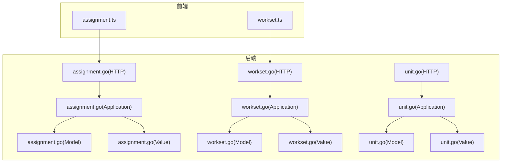
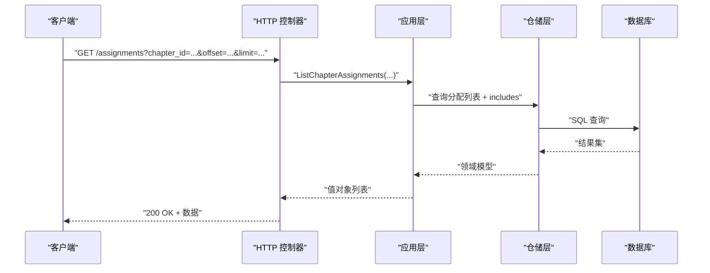
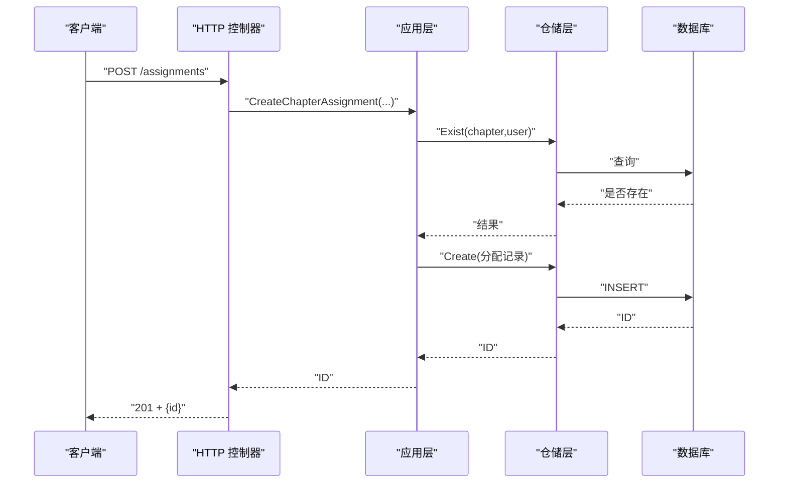
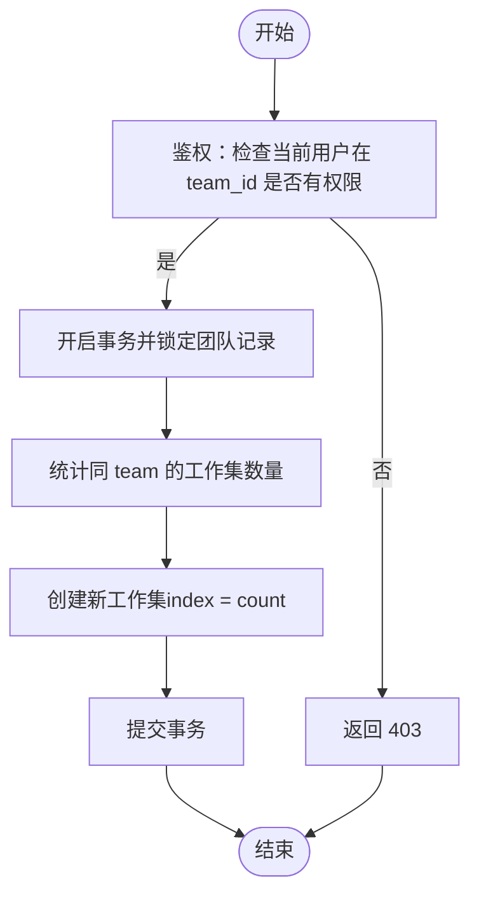
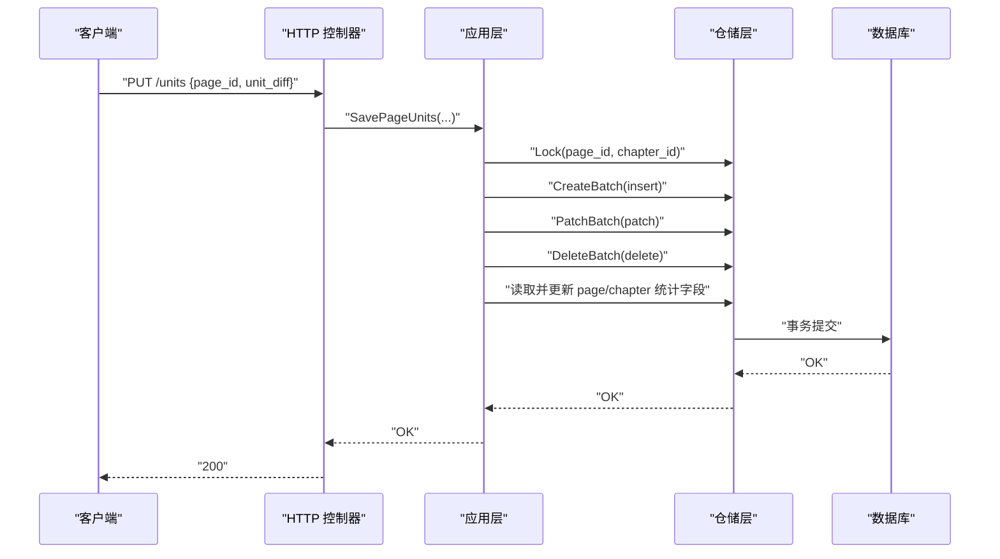
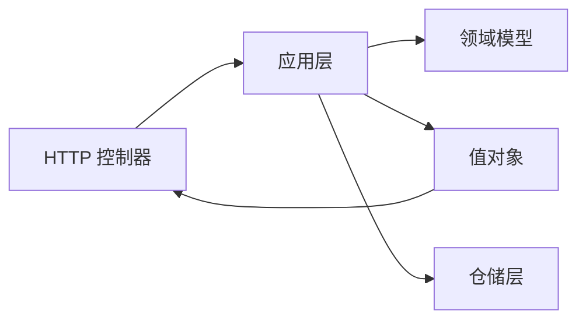

# 任务分配接口

<cite>
**本文档引用的文件**
- [assignment.go](file://internal/api/http/assignment.go)
- [workset.go](file://internal/api/http/workset.go)
- [unit.go](file://internal/api/http/unit.go)
- [assignment.go](file://internal/application/assignment.go)
- [workset.go](file://internal/application/workset.go)
- [unit.go](file://internal/application/unit.go)
- [assignment.go](file://internal/domain/model/assignment.go)
- [workset.go](file://internal/domain/model/workset.go)
- [unit.go](file://internal/domain/model/unit.go)
- [assignment.go](file://internal/value/assignment.go)
- [workset.go](file://internal/value/workset.go)
- [unit.go](file://internal/value/unit.go)
- [assignment.ts](file://frontend/src/api/modules/assignment.ts)
- [workset.ts](file://frontend/src/api/modules/workset.ts)
- [workset-include-internal-logic.md](file://docs/workset-include-internal-logic.md)
</cite>

## 目录
1. [简介](#简介)
2. [项目结构](#项目结构)
3. [核心组件](#核心组件)
4. [架构总览](#架构总览)
5. [详细组件分析](#详细组件分析)
6. [依赖关系分析](#依赖关系分析)
7. [性能考虑](#性能考虑)
8. [故障排除指南](#故障排除指南)
9. [结论](#结论)
10. [附录](#附录)

## 简介
本文件为 poprako-web-ms 项目的任务分配接口文档，覆盖以下能力：
- 任务分配管理：章节级分配的 CRUD，以及“我的任务”列表
- 工作集管理：按汉化组维度的工作集 CRUD
- 页面单元管理：页面级翻校单元的查询与批量 diff 保存
- 任务状态与进度：基于分配角色与单元完成度的统计联动
- 多人协作：悲观锁与事务保障，支持并发安全的 diff 合并

## 项目结构
后端采用分层架构：
- API 层：HTTP 控制器，负责参数解析、鉴权与响应包装
- 应用层：业务编排，执行权限校验、参数校验与事务控制
- 领域层：模型与领域服务，表达业务概念与规则
- 值对象层：API 输入输出结构，确保接口契约稳定
- 前端模块：封装 HTTP 请求，对接后端接口

图表来源
- [assignment.go:1-228](file://internal/api/http/assignment.go#L1-L228)
- [workset.go:1-189](file://internal/api/http/workset.go#L1-L189)
- [unit.go:1-91](file://internal/api/http/unit.go#L1-L91)
- [assignment.go:1-358](file://internal/application/assignment.go#L1-L358)
- [workset.go:1-310](file://internal/application/workset.go#L1-L310)
- [unit.go:1-416](file://internal/application/unit.go#L1-L416)
- [assignment.go:1-190](file://internal/domain/model/assignment.go#L1-L190)
- [workset.go:1-82](file://internal/domain/model/workset.go#L1-L82)
- [unit.go:1-149](file://internal/domain/model/unit.go#L1-L149)
- [assignment.go:1-131](file://internal/value/assignment.go#L1-L131)
- [workset.go:1-89](file://internal/value/workset.go#L1-L89)
- [unit.go:1-59](file://internal/value/unit.go#L1-L59)

章节来源
- [assignment.go:1-228](file://internal/api/http/assignment.go#L1-L228)
- [workset.go:1-189](file://internal/api/http/workset.go#L1-L189)
- [unit.go:1-91](file://internal/api/http/unit.go#L1-L91)

## 核心组件
- 任务分配控制器：提供章节分配列表、我的分配列表、创建分配、更新分配、删除分配
- 工作集控制器：提供工作集列表、创建工作集、更新工作集、删除工作集
- 页面单元控制器：提供页面单元列表、保存页面单元 diff
- 应用层编排：统一处理鉴权、参数校验、事务与统计字段更新
- 领域模型：分配角色掩码、工作集索引与统计、单元的创建/补丁/删除
- 值对象：API 输入输出结构，含 includes 解析与序列化

章节来源
- [assignment.go:1-358](file://internal/application/assignment.go#L1-L358)
- [workset.go:1-310](file://internal/application/workset.go#L1-L310)
- [unit.go:1-416](file://internal/application/unit.go#L1-L416)
- [assignment.go:1-190](file://internal/domain/model/assignment.go#L1-L190)
- [workset.go:1-82](file://internal/domain/model/workset.go#L1-L82)
- [unit.go:1-149](file://internal/domain/model/unit.go#L1-L149)
- [assignment.go:1-131](file://internal/value/assignment.go#L1-L131)
- [workset.go:1-89](file://internal/value/workset.go#L1-L89)
- [unit.go:1-59](file://internal/value/unit.go#L1-L59)

## 架构总览
接口遵循 REST 风格，使用 JSON 作为请求/响应格式；鉴权采用 ApiKeyAuth；支持 includes 参数进行关联信息的按需加载。

图表来源
- [assignment.go:10-52](file://internal/api/http/assignment.go#L10-L52)
- [assignment.go:92-157](file://internal/application/assignment.go#L92-L157)

## 详细组件分析

### 任务分配接口
- 章节分配列表
  - 方法与路径：GET /assignments
  - 查询参数：chapter_id（必填）、includes[]（可选：user, chapter, chapter.comic, chapter.creator）、offset、limit
  - 权限：仅汉化组成员可访问
  - 响应：分配信息数组（可包含关联信息）
- 我的分配列表
  - 方法与路径：GET /assignments/mine
  - 查询参数：includes[]（可选：chapter, chapter.comic, chapter.creator）、offset、limit
  - 响应：当前用户的所有分配记录
- 创建章节分配
  - 方法与路径：POST /assignments
  - 请求体：chapter_id、user_id、role（角色掩码）
  - 权限：当前用户在该章节中拥有 reviewer 角色
  - 响应：创建成功的分配 ID
- 更新分配角色（PUT）
  - 方法与路径：PUT /assignments/{assignment_id}
  - 请求体：id、role（全量替换）
  - 权限：当前用户在该章节中拥有 reviewer 角色
  - 语义：保留已有角色的时间戳，新增角色写入当前时间，移除角色置空
- 删除分配
  - 方法与路径：DELETE /assignments/{assignment_id}
  - 权限：当前用户在该章节中拥有 reviewer 角色

图表来源
- [assignment.go:97-138](file://internal/api/http/assignment.go#L97-L138)
- [assignment.go:214-265](file://internal/application/assignment.go#L214-L265)

章节来源
- [assignment.go:10-228](file://internal/api/http/assignment.go#L10-L228)
- [assignment.go:92-358](file://internal/application/assignment.go#L92-L358)
- [assignment.go:33-131](file://internal/value/assignment.go#L33-L131)
- [assignment.go:113-189](file://internal/domain/model/assignment.go#L113-L189)

### 工作集接口
- 工作集列表
  - 方法与路径：GET /worksets
  - 查询参数：team_id（必填）、includes[]（可选：team）、offset、limit
  - 权限：当前用户在指定汉化组有权限
  - 响应：按 index 升序排列的工作集列表（可包含 team 信息）
- 创建工作集
  - 方法与路径：POST /worksets
  - 请求体：team_id、name、description（可选）
  - 权限：当前用户在指定汉化组有创建权限
  - 语义：自动计算 index（基于同组现有数量），开启事务保证一致性
- 更新工作集
  - 方法与路径：PUT /worksets/{workset_id}
  - 请求体：id、name、description（可选）
  - 权限：当前用户在目标工作集所属汉化组有更新权限
- 删除工作集
  - 方法与路径：DELETE /worksets/{workset_id}
  - 权限：当前用户在目标工作集所属汉化组有删除权限

图表来源
- [workset.go:54-95](file://internal/api/http/workset.go#L54-L95)
- [workset.go:128-213](file://internal/application/workset.go#L128-L213)

章节来源
- [workset.go:10-189](file://internal/api/http/workset.go#L10-L189)
- [workset.go:72-310](file://internal/application/workset.go#L72-L310)
- [workset.go:22-89](file://internal/value/workset.go#L22-L89)
- [workset.go:44-82](file://internal/domain/model/workset.go#L44-L82)
- [workset-include-internal-logic.md:1-87](file://docs/workset-include-internal-logic.md#L1-L87)

### 页面单元接口
- 页面单元列表
  - 方法与路径：GET /units?page_id=...
  - 查询参数：page_id（必填）
  - 权限：当前用户在页面所属章节有译者或校对者角色
  - 响应：按 index 升序排列的单元列表
- 保存页面单元 diff
  - 方法与路径：PUT /units
  - 请求体：page_id、unit_diff（包含 insert、patch、delete）
  - 权限：当前用户在页面所属章节有译者或校对者角色
  - 语义：以 diff 语义合并，事务内更新页面与章节的统计字段（总数、已翻译数、已校对数）

图表来源
- [unit.go:51-91](file://internal/api/http/unit.go#L51-L91)
- [unit.go:125-415](file://internal/application/unit.go#L125-L415)

章节来源
- [unit.go:10-91](file://internal/api/http/unit.go#L10-L91)
- [unit.go:81-416](file://internal/application/unit.go#L81-L416)
- [unit.go:49-59](file://internal/value/unit.go#L49-L59)
- [unit.go:61-149](file://internal/domain/model/unit.go#L61-L149)

### 前端对接
- 任务分配模块
  - 接口：getAssignmentList、getMyAssignments、createAssignment
  - 类型：AssignmentListQuery、GetMyAssignmentsRequest、CreateAssignmentArgs
- 工作集模块
  - 接口：getWorksetList、createWorkset
  - 类型：WorksetListQuery、CreateWorksetArgs

章节来源
- [assignment.ts:1-99](file://frontend/src/api/modules/assignment.ts#L1-L99)
- [workset.ts:1-72](file://frontend/src/api/modules/workset.ts#L1-L72)

## 依赖关系分析
- API 层依赖应用层提供的服务接口
- 应用层依赖仓储层抽象，组合领域模型与值对象
- includes 解析职责下沉至服务层，应用层仅做编排
- 工作集列表支持按需包含关联信息，避免过度返回

图表来源
- [assignment.go:1-228](file://internal/api/http/assignment.go#L1-L228)
- [workset.go:1-189](file://internal/api/http/workset.go#L1-L189)
- [unit.go:1-91](file://internal/api/http/unit.go#L1-L91)
- [assignment.go:1-358](file://internal/application/assignment.go#L1-L358)
- [workset.go:1-310](file://internal/application/workset.go#L1-L310)
- [unit.go:1-416](file://internal/application/unit.go#L1-L416)

章节来源
- [workset-include-internal-logic.md:24-51](file://docs/workset-include-internal-logic.md#L24-L51)

## 性能考虑
- includes 按需加载：通过 includes[] 减少不必要的 JOIN 与序列化开销
- 分页查询：offset/limit 控制单页大小，避免一次性返回大量数据
- 事务与锁：工作集创建与单元保存均使用悲观锁与事务，降低并发冲突概率
- 统计字段更新：在事务内批量更新页面与章节统计，减少多次往返

## 故障排除指南
- 400 错误
  - 查询参数格式错误或缺失（如缺少 chapter_id/page_id/workset_id）
  - 请求体格式错误或字段校验失败
- 403 错误
  - 权限不足：当前用户无相应角色或不在目标资源所属团队
- 404 错误
  - 资源不存在（如分配、工作集、页面）
- 事务异常
  - 创建/更新/保存过程中出现数据库错误，系统会回滚并返回通用错误

章节来源
- [assignment.go:34-50](file://internal/api/http/assignment.go#L34-L50)
- [workset.go:34-51](file://internal/api/http/workset.go#L34-L51)
- [unit.go:31-48](file://internal/api/http/unit.go#L31-L48)
- [assignment.go:234-241](file://internal/application/assignment.go#L234-L241)
- [workset.go:148-156](file://internal/application/workset.go#L148-L156)
- [unit.go:140-150](file://internal/application/unit.go#L140-L150)

## 结论
本接口体系围绕“章节-分配-单元”的创作流程设计，提供完整的任务分配、工作集组织与页面单元协作能力。通过 includes 按需加载、事务与锁保障、统计字段联动，既满足多角色协作需求，又兼顾性能与一致性。

## 附录

### 接口一览表
- 任务分配
  - GET /assignments
  - GET /assignments/mine
  - POST /assignments
  - PUT /assignments/{assignment_id}
  - DELETE /assignments/{assignment_id}
- 工作集
  - GET /worksets
  - POST /worksets
  - PUT /worksets/{workset_id}
  - DELETE /worksets/{workset_id}
- 页面单元
  - GET /units
  - PUT /units

### 最佳实践
- 使用 includes[] 仅加载必要关联，减少网络与序列化开销
- 在批量保存单元时，尽量合并 insert/patch/delete，降低事务时间
- 为工作集命名与描述提供清晰信息，便于团队协作与审计
- 严格控制角色变更权限，避免越权操作