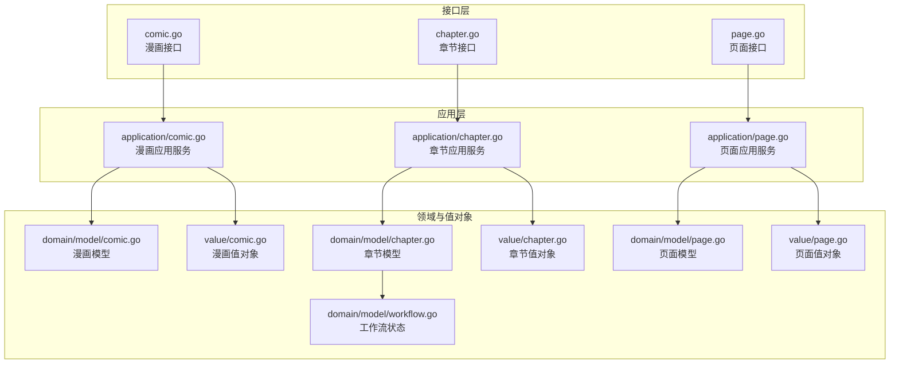
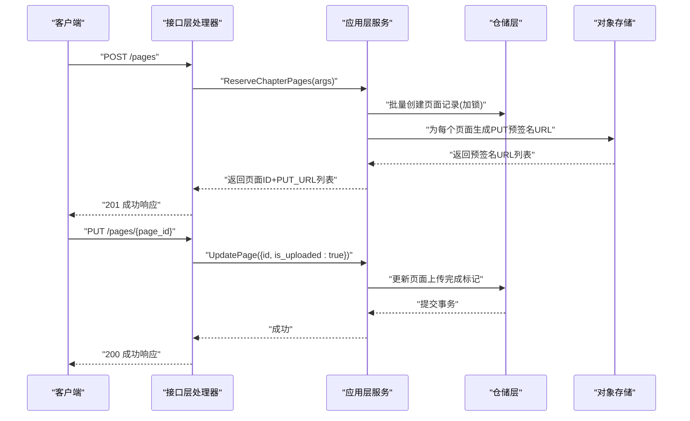
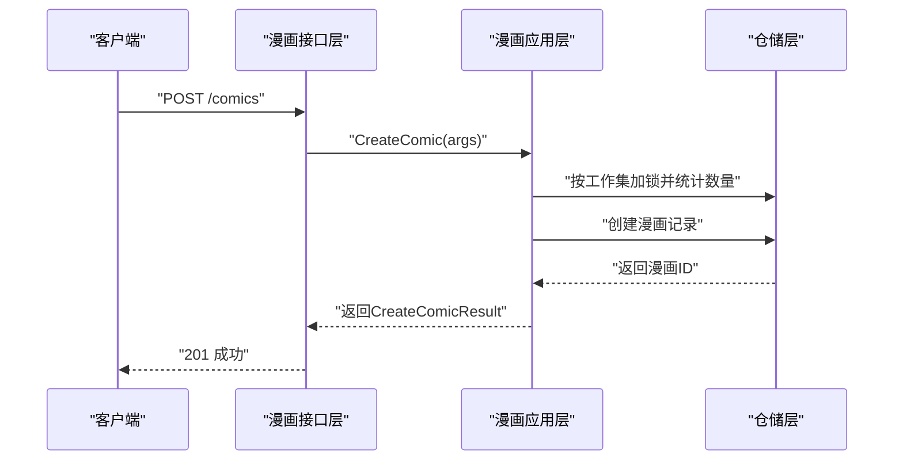
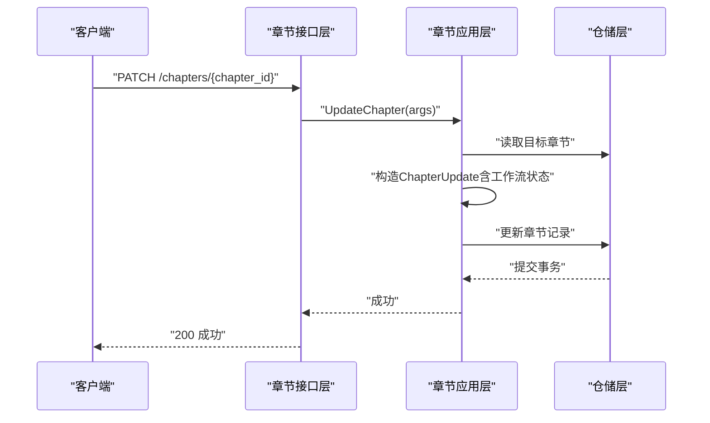
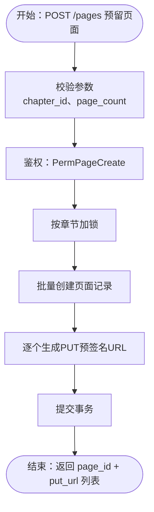
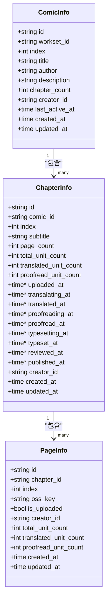
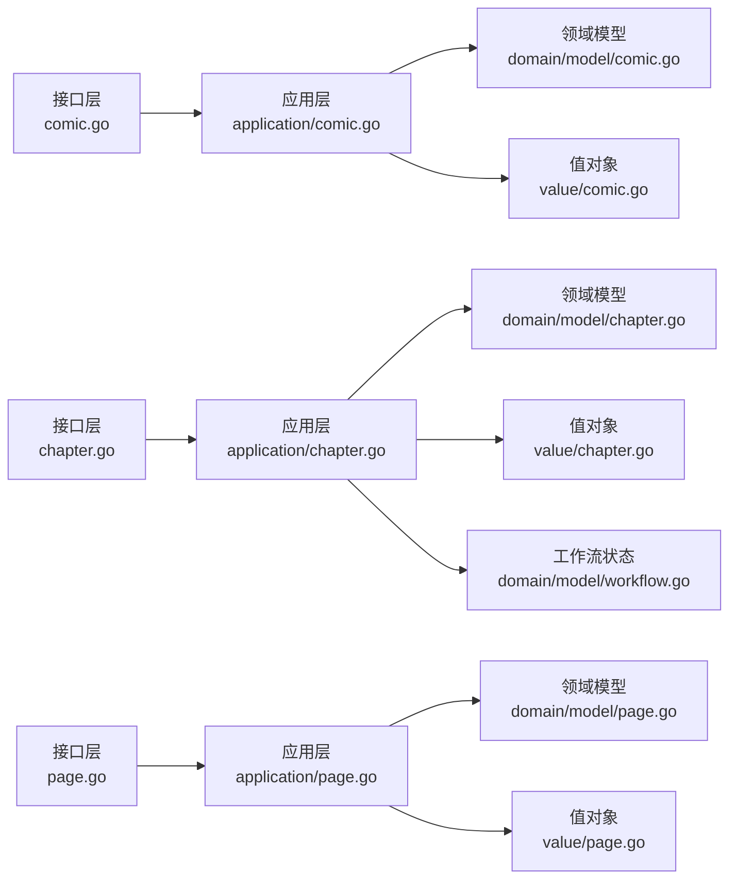

# 内容管理接口

<cite>
**本文引用的文件**
- [internal/api/http/comic.go](file://internal/api/http/comic.go)
- [internal/api/http/chapter.go](file://internal/api/http/chapter.go)
- [internal/api/http/page.go](file://internal/api/http/page.go)
- [internal/domain/model/comic.go](file://internal/domain/model/comic.go)
- [internal/domain/model/chapter.go](file://internal/domain/model/chapter.go)
- [internal/domain/model/page.go](file://internal/domain/model/page.go)
- [internal/domain/model/workflow.go](file://internal/domain/model/workflow.go)
- [internal/value/comic.go](file://internal/value/comic.go)
- [internal/value/chapter.go](file://internal/value/chapter.go)
- [internal/value/page.go](file://internal/value/page.go)
- [internal/value/common.go](file://internal/value/common.go)
- [internal/application/comic.go](file://internal/application/comic.go)
- [internal/application/chapter.go](file://internal/application/chapter.go)
- [internal/application/page.go](file://internal/application/page.go)
- [internal/api/http/types.go](file://internal/api/http/types.go)
</cite>

## 目录
1. [简介](#简介)
2. [项目结构](#项目结构)
3. [核心组件](#核心组件)
4. [架构总览](#架构总览)
5. [详细组件分析](#详细组件分析)
6. [依赖分析](#依赖分析)
7. [性能考虑](#性能考虑)
8. [故障排查指南](#故障排查指南)
9. [结论](#结论)
10. [附录](#附录)

## 简介
本文件为 poprako-web-ms 的内容管理接口文档，覆盖漫画（/api/v1/comics/）、章节（/api/v1/chapters/）、页面（/api/v1/pages/）三层内容的完整 CRUD 接口规范。文档从接口契约、数据模型、处理流程、权限控制、错误处理与性能建议等维度进行系统化说明，并提供关键流程的时序图与类图，帮助前后端协同开发与集成。

## 项目结构
- 接口层（HTTP Handlers）：位于 internal/api/http，负责路由注册、参数解析、鉴权提取、统一响应封装。
- 应用层（Application）：位于 internal/application，负责业务编排、权限校验、事务控制、跨仓储协作。
- 领域模型与值对象：位于 internal/domain/model 与 internal/value，分别定义领域实体与对外传输结构。
- 类型与通用参数：位于 internal/value/common.go，提供分页参数校验等通用能力。

图表来源
- [internal/api/http/comic.go:1-189](file://internal/api/http/comic.go#L1-L189)
- [internal/api/http/chapter.go:1-185](file://internal/api/http/chapter.go#L1-L185)
- [internal/api/http/page.go:1-189](file://internal/api/http/page.go#L1-L189)
- [internal/application/comic.go:1-354](file://internal/application/comic.go#L1-L354)
- [internal/application/chapter.go:1-330](file://internal/application/chapter.go#L1-L330)
- [internal/application/page.go:1-402](file://internal/application/page.go#L1-L402)
- [internal/domain/model/comic.go:1-107](file://internal/domain/model/comic.go#L1-L107)
- [internal/domain/model/chapter.go:1-260](file://internal/domain/model/chapter.go#L1-L260)
- [internal/domain/model/page.go:1-134](file://internal/domain/model/page.go#L1-L134)
- [internal/domain/model/workflow.go:1-36](file://internal/domain/model/workflow.go#L1-L36)
- [internal/value/comic.go:1-124](file://internal/value/comic.go#L1-L124)
- [internal/value/chapter.go:1-148](file://internal/value/chapter.go#L1-L148)
- [internal/value/page.go:1-95](file://internal/value/page.go#L1-L95)

章节来源
- [internal/api/http/comic.go:1-189](file://internal/api/http/comic.go#L1-L189)
- [internal/api/http/chapter.go:1-185](file://internal/api/http/chapter.go#L1-L185)
- [internal/api/http/page.go:1-189](file://internal/api/http/page.go#L1-L189)
- [internal/application/comic.go:1-354](file://internal/application/comic.go#L1-L354)
- [internal/application/chapter.go:1-330](file://internal/application/chapter.go#L1-L330)
- [internal/application/page.go:1-402](file://internal/application/page.go#L1-L402)
- [internal/domain/model/comic.go:1-107](file://internal/domain/model/comic.go#L1-L107)
- [internal/domain/model/chapter.go:1-260](file://internal/domain/model/chapter.go#L1-L260)
- [internal/domain/model/page.go:1-134](file://internal/domain/model/page.go#L1-L134)
- [internal/domain/model/workflow.go:1-36](file://internal/domain/model/workflow.go#L1-L36)
- [internal/value/comic.go:1-124](file://internal/value/comic.go#L1-L124)
- [internal/value/chapter.go:1-148](file://internal/value/chapter.go#L1-L148)
- [internal/value/page.go:1-95](file://internal/value/page.go#L1-L95)
- [internal/value/common.go:1-24](file://internal/value/common.go#L1-L24)

## 核心组件
- 漫画接口层：提供列表、创建、更新、删除四个端点，支持 includes 工作集与创建者信息嵌套。
- 章节接口层：提供列表、创建、更新、删除四个端点，支持 includes 创建者信息嵌套，并支持工作流状态字段的局部更新。
- 页面接口层：提供列表、预留页面并生成预签名上传地址、更新页面状态、按章节批量删除页面四个端点。
- 应用层：封装鉴权、事务、权限校验、跨仓储组合逻辑，确保业务一致性。
- 领域模型与值对象：定义漫画、章节、页面的数据结构与约束，以及工作流状态枚举与校验规则。

章节来源
- [internal/api/http/comic.go:10-189](file://internal/api/http/comic.go#L10-L189)
- [internal/api/http/chapter.go:10-185](file://internal/api/http/chapter.go#L10-L185)
- [internal/api/http/page.go:10-189](file://internal/api/http/page.go#L10-L189)
- [internal/application/comic.go:19-40](file://internal/application/comic.go#L19-L40)
- [internal/application/chapter.go:20-41](file://internal/application/chapter.go#L20-L41)
- [internal/application/page.go:21-42](file://internal/application/page.go#L21-L42)
- [internal/domain/model/workflow.go:1-36](file://internal/domain/model/workflow.go#L1-L36)

## 架构总览
接口层通过统一响应结构返回结果，应用层负责权限与事务，仓储层负责数据持久化。页面上传采用“预留记录+预签名上传”的异步确认模式，确保数据一致性与并发安全。

图表来源
- [internal/api/http/page.go:54-148](file://internal/api/http/page.go#L54-L148)
- [internal/application/page.go:93-187](file://internal/application/page.go#L93-L187)
- [internal/application/page.go:250-311](file://internal/application/page.go#L250-L311)

## 详细组件分析

### 漫画接口规范（/api/v1/comics/）
- 列表查询
  - 方法与路径：GET /comics
  - 查询参数：
    - workset_id：工作集 ID（必填）
    - offset、limit：分页参数（必填，见通用校验）
    - includes[]：可选嵌套信息，支持 workset、creator
  - 返回：漫画信息数组（含可选嵌套）
  - 权限：需要 PermComicList
- 创建漫画
  - 方法与路径：POST /comics
  - 请求体：CreateComicArgs（workset_id、title、author、description）
  - 返回：CreateComicResult（id）
  - 权限：需要 PermComicCreate
  - 并发：按工作集加锁，保证索引连续性
- 更新漫画
  - 方法与路径：PUT /comics/{comic_id}
  - 路径参数：comic_id（必填）
  - 请求体：UpdateComicArgs（id 与可更新字段）
  - 权限：需要 PermComicUpdate
- 删除漫画
  - 方法与路径：DELETE /comics/{comic_id}
  - 路径参数：comic_id（必填）
  - 权限：需要 PermComicDelete

图表来源
- [internal/api/http/comic.go:54-95](file://internal/api/http/comic.go#L54-L95)
- [internal/application/comic.go:149-246](file://internal/application/comic.go#L149-L246)

章节来源
- [internal/api/http/comic.go:10-189](file://internal/api/http/comic.go#L10-L189)
- [internal/application/comic.go:76-147](file://internal/application/comic.go#L76-L147)
- [internal/application/comic.go:248-303](file://internal/application/comic.go#L248-L303)
- [internal/application/comic.go:305-353](file://internal/application/comic.go#L305-L353)
- [internal/value/comic.go:30-124](file://internal/value/comic.go#L30-L124)
- [internal/domain/model/comic.go:5-107](file://internal/domain/model/comic.go#L5-L107)

### 章节接口规范（/api/v1/chapters/）
- 列表查询
  - 方法与路径：GET /chapters
  - 查询参数：
    - comic_id：漫画 ID（必填）
    - offset、limit：分页参数（必填）
    - includes[]：可选嵌套信息，支持 creator
  - 返回：章节信息数组（含可选嵌套）
  - 权限：需要 PermChapterList
- 创建章节
  - 方法与路径：POST /chapters
  - 请求体：CreateChapterArgs（comic_id、subtitle）
  - 返回：CreateChapterResult（id）
  - 权限：需要 PermChapterCreate
  - 并发：按漫画加锁，保证索引连续性
- 更新章节
  - 方法与路径：PATCH /chapters/{chapter_id}
  - 路径参数：chapter_id（必填）
  - 请求体：UpdateChapterArgs（可选 subtitle 与多类工作流状态）
  - 权限：需要 PermChapterUpdate
  - 工作流状态规则：不同工作流支持的状态集合不同，详见工作流状态校验
- 删除章节
  - 方法与路径：DELETE /chapters/{chapter_id}
  - 路径参数：chapter_id（必填）
  - 权限：需要 PermChapterDelete

图表来源
- [internal/api/http/chapter.go:97-144](file://internal/api/http/chapter.go#L97-L144)
- [internal/application/chapter.go:223-281](file://internal/application/chapter.go#L223-L281)
- [internal/domain/model/workflow.go:24-35](file://internal/domain/model/workflow.go#L24-L35)

章节来源
- [internal/api/http/chapter.go:10-185](file://internal/api/http/chapter.go#L10-L185)
- [internal/application/chapter.go:167-221](file://internal/application/chapter.go#L167-L221)
- [internal/application/chapter.go:223-281](file://internal/application/chapter.go#L223-L281)
- [internal/application/chapter.go:283-329](file://internal/application/chapter.go#L283-L329)
- [internal/value/chapter.go:41-148](file://internal/value/chapter.go#L41-L148)
- [internal/domain/model/chapter.go:5-260](file://internal/domain/model/chapter.go#L5-L260)
- [internal/domain/model/workflow.go:1-36](file://internal/domain/model/workflow.go#L1-L36)

### 页面接口规范（/api/v1/pages/）
- 列表查询
  - 方法与路径：GET /pages
  - 查询参数：
    - chapter_id：章节 ID（必填）
    - offset、limit：分页参数（必填）
    - includes[]：可选嵌套信息，支持 creator
  - 返回：页面信息数组（含可选嵌套）
  - 权限：需要 PermPageList
- 预留页面并生成预签名上传地址
  - 方法与路径：POST /pages
  - 请求体：ReserveChapterPagesArgs（chapter_id、page_count）
  - 返回：ReserveChapterPagesResult（每页的 page_id 与 put_url）
  - 权限：需要 PermPageCreate
  - 流程：先创建页面记录并加锁，再逐个生成预签名 PUT URL，最后提交事务
- 更新页面
  - 方法与路径：PUT /pages/{page_id}
  - 路径参数：page_id（必填）
  - 请求体：UpdatePageArgs（id、is_uploaded=true）
  - 权限：需要 PermPageUpdate
- 按章节批量删除页面
  - 方法与路径：DELETE /pages/{chapter_id}
  - 路径参数：chapter_id（必填）
  - 权限：需要 PermPageCreate（按章节维度）
  - 流程：查询章节下所有页面，删除记录并批量删除 OSS 对象，最后提交事务

图表来源
- [internal/api/http/page.go:54-95](file://internal/api/http/page.go#L54-L95)
- [internal/application/page.go:93-187](file://internal/application/page.go#L93-L187)

章节来源
- [internal/api/http/page.go:10-189](file://internal/api/http/page.go#L10-L189)
- [internal/application/page.go:189-248](file://internal/application/page.go#L189-L248)
- [internal/application/page.go:250-311](file://internal/application/page.go#L250-L311)
- [internal/application/page.go:313-401](file://internal/application/page.go#L313-L401)
- [internal/value/page.go:74-95](file://internal/value/page.go#L74-L95)
- [internal/domain/model/page.go:5-134](file://internal/domain/model/page.go#L5-L134)

### 数据模型与关系
- 漫画（ComicInfo）：包含工作集、索引、标题、作者、描述、章节计数、创建者、活跃时间与时间戳。
- 章节（ChapterInfo）：包含漫画、索引、副标题、页面计数与工作单元统计，以及多阶段工作流时间戳。
- 页面（PageInfo）：包含章节、索引、OSS Key、是否上传完成、创建者与工作单元统计，以及时间戳。
- 工作流状态（WorkflowStatus）：uploading/translating/proofreading/typesetting/reviewing/publishing 对应 pending/in_progress/completed 的组合规则。

图表来源
- [internal/domain/model/comic.go:5-107](file://internal/domain/model/comic.go#L5-L107)
- [internal/domain/model/chapter.go:5-35](file://internal/domain/model/chapter.go#L5-L35)
- [internal/domain/model/page.go:5-22](file://internal/domain/model/page.go#L5-L22)

章节来源
- [internal/domain/model/comic.go:1-107](file://internal/domain/model/comic.go#L1-L107)
- [internal/domain/model/chapter.go:1-260](file://internal/domain/model/chapter.go#L1-L260)
- [internal/domain/model/page.go:1-134](file://internal/domain/model/page.go#L1-L134)
- [internal/domain/model/workflow.go:1-36](file://internal/domain/model/workflow.go#L1-L36)

## 依赖分析
- 接口层依赖应用层提供的服务方法，统一处理鉴权、参数校验与响应封装。
- 应用层依赖仓储层进行数据访问，使用事务执行多步操作，确保一致性。
- 值对象与领域模型分离，值对象用于 API 传输，领域模型用于业务语义与状态机。
- 页面上传依赖外部对象存储客户端，生成预签名 URL 实现客户端直传。

图表来源
- [internal/api/http/comic.go:1-189](file://internal/api/http/comic.go#L1-L189)
- [internal/api/http/chapter.go:1-185](file://internal/api/http/chapter.go#L1-L185)
- [internal/api/http/page.go:1-189](file://internal/api/http/page.go#L1-L189)
- [internal/application/comic.go:1-354](file://internal/application/comic.go#L1-L354)
- [internal/application/chapter.go:1-330](file://internal/application/chapter.go#L1-L330)
- [internal/application/page.go:1-402](file://internal/application/page.go#L1-L402)
- [internal/domain/model/workflow.go:1-36](file://internal/domain/model/workflow.go#L1-L36)

章节来源
- [internal/api/http/comic.go:1-189](file://internal/api/http/comic.go#L1-L189)
- [internal/api/http/chapter.go:1-185](file://internal/api/http/chapter.go#L1-L185)
- [internal/api/http/page.go:1-189](file://internal/api/http/page.go#L1-L189)
- [internal/application/comic.go:1-354](file://internal/application/comic.go#L1-L354)
- [internal/application/chapter.go:1-330](file://internal/application/chapter.go#L1-L330)
- [internal/application/page.go:1-402](file://internal/application/page.go#L1-L402)

## 性能考虑
- 分页参数校验：确保 offset 非负、limit 正数，避免无效查询。
- 批量操作：页面预留与删除采用批量接口，减少往返次数。
- 事务边界：创建/更新/删除涉及多步写入时使用事务，失败快速回滚。
- 预签名上传：客户端直传降低服务端带宽压力，提升吞吐。
- 加锁策略：在高并发场景下按工作集或章节加锁，避免索引冲突。

章节来源
- [internal/value/common.go:5-24](file://internal/value/common.go#L5-L24)
- [internal/application/page.go:93-187](file://internal/application/page.go#L93-L187)
- [internal/application/page.go:313-401](file://internal/application/page.go#L313-L401)
- [internal/application/comic.go:189-246](file://internal/application/comic.go#L189-L246)
- [internal/application/chapter.go:113-165](file://internal/application/chapter.go#L113-L165)

## 故障排查指南
- 参数校验失败：检查请求体与查询参数格式，参考各值对象的 Validate 方法。
- 权限不足：确认当前用户在目标工作集/漫画/章节/章节分配中具备相应权限。
- 事务失败：关注应用层日志中的事务开启/回滚/提交记录，定位具体步骤。
- 预签名上传失败：检查对象存储客户端配置与 OSS Key 规则。
- 并发冲突：索引加锁失败通常由并发创建引起，重试或等待锁释放。

章节来源
- [internal/value/comic.go:37-85](file://internal/value/comic.go#L37-L85)
- [internal/value/chapter.go:68-147](file://internal/value/chapter.go#L68-L147)
- [internal/value/page.go:12-54](file://internal/value/page.go#L12-L54)
- [internal/application/comic.go:76-147](file://internal/application/comic.go#L76-L147)
- [internal/application/chapter.go:167-221](file://internal/application/chapter.go#L167-L221)
- [internal/application/page.go:189-248](file://internal/application/page.go#L189-L248)

## 结论
本接口文档系统化梳理了漫画、章节、页面三层内容的 CRUD 能力，明确了数据模型、权限控制、工作流状态与上传流程。通过预签名上传与事务保障，实现了高并发下的数据一致性与高性能。建议在前后端联调时严格遵循参数校验与权限规则，并结合日志与监控进行问题定位。

## 附录
- 统一响应结构：包含 code、message、data 字段，便于前端统一处理。
- 分页参数：offset（非负）、limit（正整数），超出范围将触发校验错误。
- 工作流状态：不同工作流支持的状态集合不同，需遵循 IsValidWorkflowCombination 的规则。

章节来源
- [internal/api/http/types.go:3-9](file://internal/api/http/types.go#L3-L9)
- [internal/value/common.go:10-23](file://internal/value/common.go#L10-L23)
- [internal/domain/model/workflow.go:24-35](file://internal/domain/model/workflow.go#L24-L35)