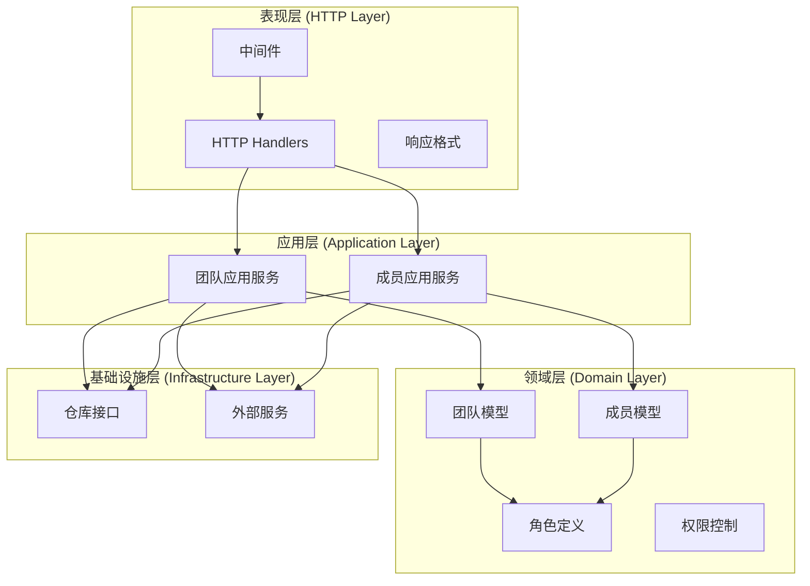
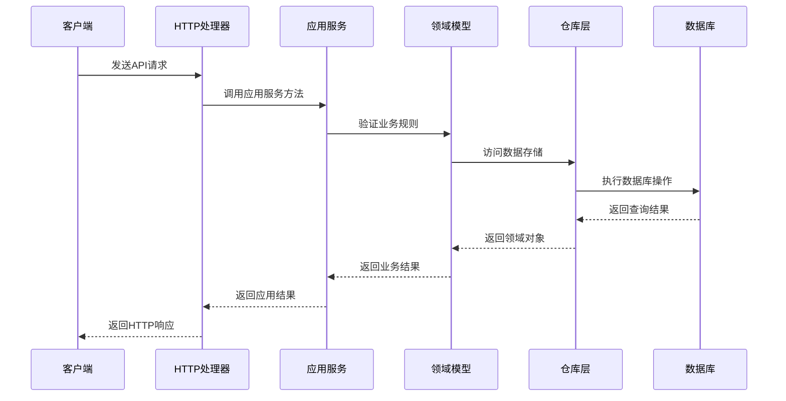
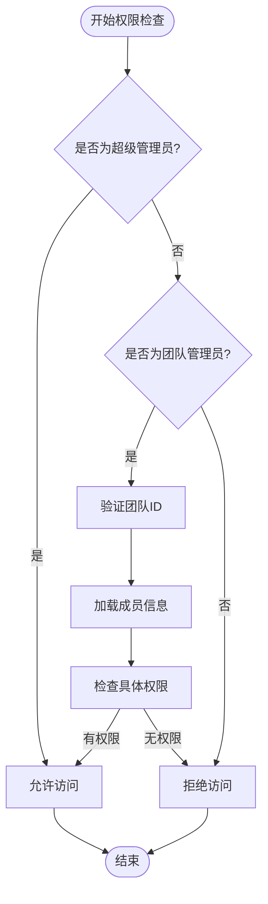
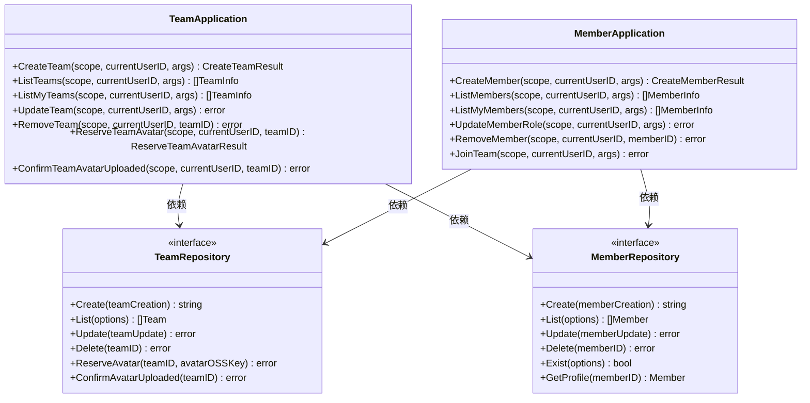

# 团队管理接口

<cite>
**本文档引用的文件**
- [team.go](file://internal/api/http/team.go)
- [member.go](file://internal/api/http/member.go)
- [team.go](file://internal/application/team.go)
- [member.go](file://internal/application/member.go)
- [team.go](file://internal/domain/model/team.go)
- [member.go](file://internal/domain/model/member.go)
- [role.go](file://internal/domain/model/role.go)
- [permission.go](file://internal/domain/model/permission.go)
- [team.go](file://internal/value/team.go)
- [member.go](file://internal/value/member.go)
- [middleware.go](file://internal/api/http/middleware.go)
- [types.go](file://internal/api/http/types.go)
</cite>

## 目录
1. [简介](#简介)
2. [项目结构](#项目结构)
3. [核心组件](#核心组件)
4. [架构概览](#架构概览)
5. [详细组件分析](#详细组件分析)
6. [依赖关系分析](#依赖关系分析)
7. [性能考虑](#性能考虑)
8. [故障排除指南](#故障排除指南)
9. [结论](#结论)

## 简介

poprako-web-ms 项目是一个基于 Go 语言开发的 Web 应用程序，专门用于管理漫画汉化团队。本文档详细介绍了团队管理相关的 API 接口，包括团队管理、成员管理以及权限控制机制。

该系统采用分层架构设计，包含 HTTP 层、应用层、领域层和基础设施层，确保了代码的可维护性和可扩展性。系统支持团队头像上传功能，提供了完整的团队生命周期管理能力。

## 项目结构

项目采用典型的分层架构模式，主要分为以下几个层次：

**图表来源**
- [team.go:1-289](file://internal/api/http/team.go#L1-L289)
- [member.go:1-272](file://internal/api/http/member.go#L1-L272)
- [team.go:1-415](file://internal/application/team.go#L1-L415)
- [member.go:1-448](file://internal/application/member.go#L1-L448)

**章节来源**
- [team.go:1-289](file://internal/api/http/team.go#L1-L289)
- [member.go:1-272](file://internal/api/http/member.go#L1-L272)
- [team.go:1-415](file://internal/application/team.go#L1-L415)

## 核心组件

### 团队管理组件

团队管理组件负责汉化团队的完整生命周期管理，包括创建、查询、更新和删除操作。系统支持头像上传功能，提供完整的团队信息管理能力。

### 成员管理组件

成员管理组件处理团队成员的添加、移除、角色变更和权限管理。系统支持多种分工角色，包括原始提供者、翻译者、校对者、排版工、审核员、发布者和管理员。

### 权限控制系统

权限控制系统基于角色和团队级别的权限检查，确保只有授权用户才能执行相应的操作。系统支持超级管理员和团队管理员的不同权限级别。

**章节来源**
- [team.go:1-63](file://internal/domain/model/team.go#L1-L63)
- [member.go:1-205](file://internal/domain/model/member.go#L1-L205)
- [role.go:1-56](file://internal/domain/model/role.go#L1-L56)
- [permission.go:1-845](file://internal/domain/model/permission.go#L1-L845)

## 架构概览

系统采用 Clean Architecture 设计模式，实现了关注点分离和依赖倒置原则：

**图表来源**
- [team.go:92-130](file://internal/application/team.go#L92-L130)
- [member.go:84-139](file://internal/application/member.go#L84-L139)

**章节来源**
- [middleware.go:1-80](file://internal/api/http/middleware.go#L1-L80)
- [types.go:1-10](file://internal/api/http/types.go#L1-L10)

## 详细组件分析

### 团队管理 API

#### 创建团队
- **端点**: `POST /api/v1/teams/`
- **权限**: 超级管理员
- **功能**: 创建新的汉化团队
- **请求参数**: 团队名称、描述
- **响应**: 新团队的ID

#### 列出团队
- **端点**: `GET /api/v1/teams/`
- **权限**: 超级管理员
- **功能**: 获取所有汉化团队列表
- **查询参数**: 偏移量、限制数量
- **响应**: 团队信息数组

#### 获取我的团队
- **端点**: `GET /api/v1/teams/mine`
- **权限**: 已认证用户
- **功能**: 获取当前用户所属的汉化团队列表
- **查询参数**: 偏移量、限制数量
- **响应**: 团队信息数组

#### 更新团队
- **端点**: `PUT /api/v1/teams/{team_id}`
- **权限**: 超级管理员或团队管理员
- **功能**: 更新指定汉化团队信息
- **路径参数**: team_id
- **请求参数**: 团队名称、描述
- **响应**: 空响应

#### 删除团队
- **端点**: `DELETE /api/v1/teams/{team_id}`
- **权限**: 超级管理员
- **功能**: 删除指定汉化团队
- **路径参数**: team_id
- **响应**: 空响应

#### 团队头像上传预留
- **端点**: `POST /api/v1/teams/{team_id}/avatar`
- **权限**: 超级管理员或团队管理员
- **功能**: 为团队头像上传预留临时URL
- **路径参数**: team_id
- **响应**: OSS Key和PUT URL

#### 确认上传
- **端点**: `POST /api/v1/teams/{team_id}/avatar/confirm`
- **权限**: 超级管理员或团队管理员
- **功能**: 确认头像上传完成
- **路径参数**: team_id
- **响应**: 空响应

**章节来源**
- [team.go:10-289](file://internal/api/http/team.go#L10-L289)
- [team.go:92-415](file://internal/application/team.go#L92-L415)
- [team.go:1-112](file://internal/value/team.go#L1-L112)

### 成员管理 API

#### 创建成员
- **端点**: `POST /api/v1/members/`
- **权限**: 超级管理员
- **功能**: 由超级管理员直接创建成员记录
- **请求参数**: 用户ID、团队ID、角色掩码
- **响应**: 成员ID

#### 加入团队
- **端点**: `POST /api/v1/members/join`
- **权限**: 已认证用户
- **功能**: 通过邀请码加入汉化团队
- **请求参数**: 邀请码
- **响应**: 空响应

#### 列出成员
- **端点**: `GET /api/v1/members/`
- **权限**: 团队管理员
- **功能**: 获取指定汉化团队的成员列表
- **查询参数**: team_id、includes、偏移量、限制数量
- **响应**: 成员信息数组

#### 更新成员角色
- **端点**: `PUT /api/v1/members/{member_id}`
- **权限**: 团队管理员
- **功能**: 更新指定成员的分工角色
- **路径参数**: member_id
- **请求参数**: 角色掩码
- **响应**: 空响应

#### 删除成员
- **端点**: `DELETE /api/v1/members/{member_id}`
- **权限**: 团队管理员
- **功能**: 从汉化团队中移除指定成员
- **路径参数**: member_id
- **响应**: 空响应

**章节来源**
- [member.go:10-272](file://internal/api/http/member.go#L10-L272)
- [member.go:84-448](file://internal/application/member.go#L84-L448)
- [member.go:1-139](file://internal/value/member.go#L1-L139)

### 权限控制机制

系统实现了多层次的权限控制机制：

#### 角色定义
系统支持以下分工角色：
- 原始提供者 (Raw Provider)
- 翻译者 (Translator)
- 校对者 (Proofreader)
- 排版工 (Typesetter)
- 审核员 (Reviewer)
- 发布者 (Publisher)
- 管理员 (Admin)

#### 权限检查流程

**图表来源**
- [permission.go:15-80](file://internal/domain/model/permission.go#L15-L80)

#### 权限类型
- **超级管理员权限**: 系统最高权限，可执行所有操作
- **团队管理员权限**: 仅限于其管理的团队内操作
- **普通成员权限**: 仅限于查看和基本操作

**章节来源**
- [role.go:1-56](file://internal/domain/model/role.go#L1-L56)
- [permission.go:1-845](file://internal/domain/model/permission.go#L1-L845)

## 依赖关系分析

系统采用依赖注入和接口隔离的设计原则：

**图表来源**
- [team.go:20-90](file://internal/application/team.go#L20-L90)
- [member.go:20-82](file://internal/application/member.go#L20-L82)

**章节来源**
- [team.go:1-415](file://internal/application/team.go#L1-L415)
- [member.go:1-448](file://internal/application/member.go#L1-L448)

## 性能考虑

### 缓存策略
- 团队头像URL采用预签名URL缓存机制
- 成员信息查询支持按需包含关联数据
- 分页查询优化，避免一次性加载大量数据

### 数据库优化
- 使用索引优化常用查询条件
- N+1 查询问题通过批量查询解决
- 事务处理确保数据一致性

### 并发控制
- HTTP 请求处理采用并发安全设计
- 数据库连接池管理
- 错误重试机制

## 故障排除指南

### 常见错误及解决方案

#### 权限错误
- **现象**: 返回 403 Forbidden
- **原因**: 用户权限不足
- **解决方案**: 确认用户角色和团队关系

#### 参数验证错误
- **现象**: 返回 400 Bad Request
- **原因**: 请求参数格式或内容不正确
- **解决方案**: 检查请求体格式和必填字段

#### 资源不存在
- **现象**: 返回 404 Not Found
- **原因**: 指定的团队或成员不存在
- **解决方案**: 验证ID的有效性

#### 业务逻辑错误
- **现象**: 返回 400 Bad Request
- **原因**: 违反业务规则
- **解决方案**: 检查业务约束条件

**章节来源**
- [middleware.go:47-80](file://internal/api/http/middleware.go#L47-L80)
- [team.go:92-130](file://internal/application/team.go#L92-L130)
- [member.go:84-139](file://internal/application/member.go#L84-L139)

## 结论

poprako-web-ms 项目的团队管理接口设计合理，实现了完整的团队生命周期管理功能。系统采用清晰的分层架构和严格的权限控制机制，确保了系统的安全性、可维护性和可扩展性。

主要特点包括：
- 完整的团队管理功能
- 灵活的成员角色管理系统
- 严格的安全权限控制
- 可扩展的架构设计
- 良好的错误处理机制

该系统为漫画汉化团队提供了高效、可靠的管理工具，支持团队协作和项目管理工作。