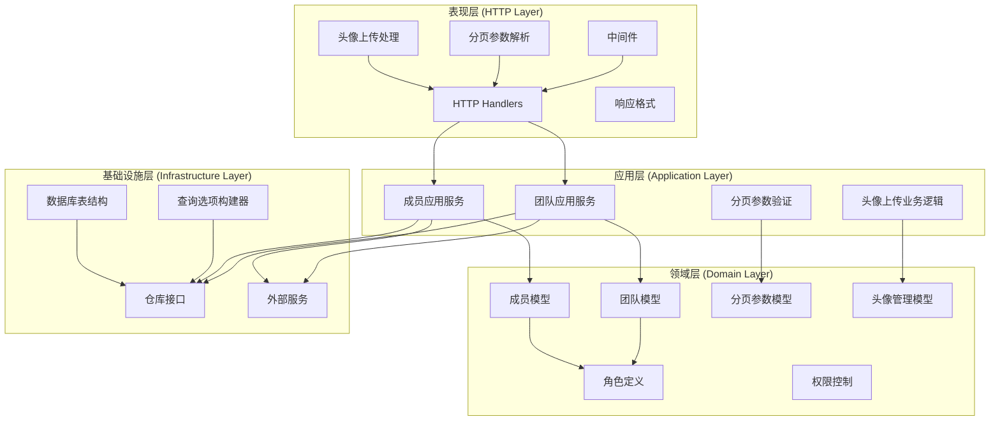
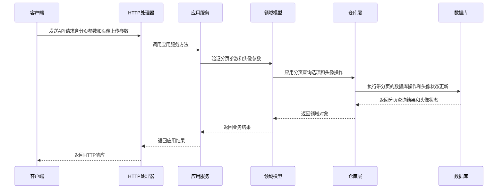
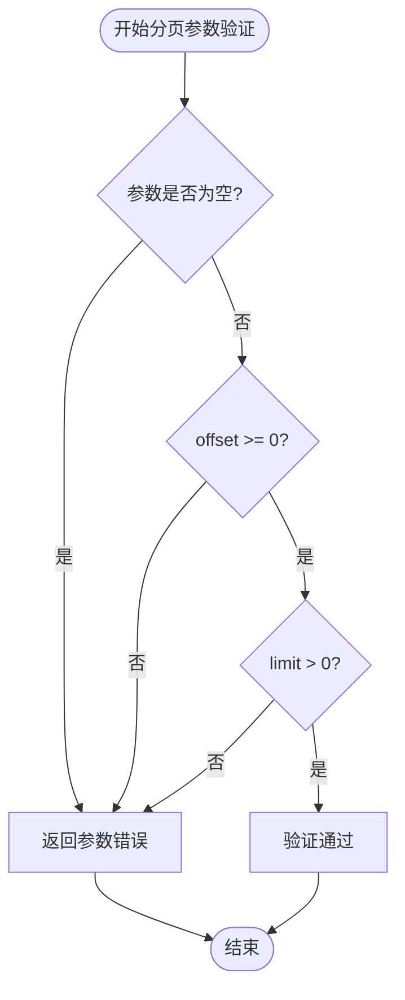
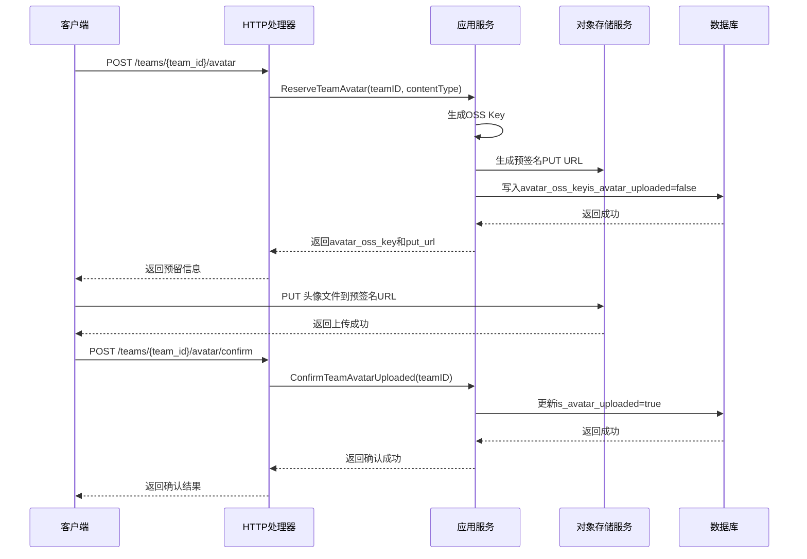
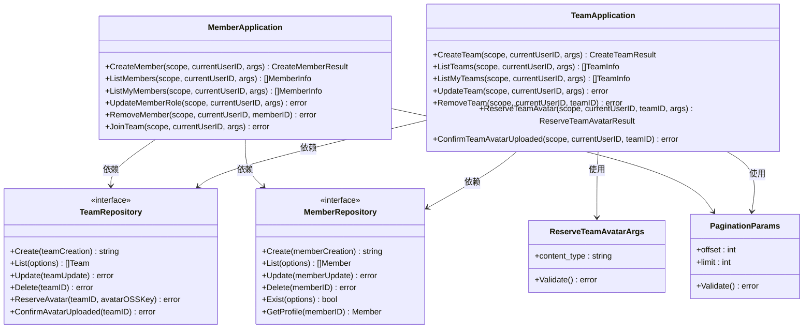

# 团队管理接口

<cite>
**本文档引用的文件**
- [team.go](file://internal/api/http/team.go)
- [member.go](file://internal/api/http/member.go)
- [team.go](file://internal/application/team.go)
- [member.go](file://internal/application/member.go)
- [team.go](file://internal/domain/model/team.go)
- [member.go](file://internal/domain/model/member.go)
- [role.go](file://internal/domain/model/role.go)
- [permission.go](file://internal/domain/model/permission.go)
- [team.go](file://internal/value/team.go)
- [member.go](file://internal/value/member.go)
- [common.go](file://internal/value/common.go)
- [middleware.go](file://internal/api/http/middleware.go)
- [types.go](file://internal/api/http/types.go)
- [team.ts](file://frontend/src/api/modules/team.ts)
- [common.ts](file://frontend/src/types/common.ts)
- [domain.ts](file://frontend/src/types/domain.ts)
- [query_option.go](file://internal/infrastructure/repository/query_option/common.go)
- [team.go](file://internal/infrastructure/repository/team.go)
- [20260301065012_team-table.up.sql](file://migrations/20260301065012_team-table.up.sql)
</cite>

## 更新摘要
**变更内容**
- 新增团队头像上传功能：reserveTeamAvatar和confirmTeamAvatarUploaded接口
- 更新getMyTeams函数的数组验证增强，确保返回值类型安全
- 添加团队头像相关数据库字段和存储过程
- 更新团队信息结构，包含头像URL和上传状态字段

## 目录
1. [简介](#简介)
2. [项目结构](#项目结构)
3. [核心组件](#核心组件)
4. [架构概览](#架构概览)
5. [详细组件分析](#详细组件分析)
6. [分页支持机制](#分页支持机制)
7. [团队头像管理功能](#团队头像管理功能)
8. [依赖关系分析](#依赖关系分析)
9. [性能考虑](#性能考虑)
10. [故障排除指南](#故障排除指南)
11. [结论](#结论)

## 简介

poprako-web-ms 项目是一个基于 Go 语言开发的 Web 应用程序，专门用于管理漫画汉化团队。本文档详细介绍了团队管理相关的 API 接口，包括团队管理、成员管理以及权限控制机制。

该系统采用分层架构设计，包含 HTTP 层、应用层、领域层和基础设施层，确保了代码的可维护性和可扩展性。系统支持团队头像上传功能，提供了完整的团队生命周期管理能力，并新增了分页查询支持，优化了大数据量场景下的性能表现。最新的更新增加了完整的团队头像管理功能，包括头像预留、上传确认等操作，与用户头像上传功能形成完整的头像管理体系。

## 项目结构

项目采用典型的分层架构模式，主要分为以下几个层次：



**图表来源**
- [team.go:1-298](file://internal/api/http/team.go#L1-L298)
- [member.go:1-272](file://internal/api/http/member.go#L1-L272)
- [team.go:1-422](file://internal/application/team.go#L1-L422)
- [member.go:1-448](file://internal/application/member.go#L1-L448)
- [common.go:1-24](file://internal/value/common.go#L1-L24)

**章节来源**
- [team.go:1-298](file://internal/api/http/team.go#L1-L298)
- [member.go:1-272](file://internal/api/http/member.go#L1-L272)
- [team.go:1-422](file://internal/application/team.go#L1-L422)

## 核心组件

### 团队管理组件

团队管理组件负责汉化团队的完整生命周期管理，包括创建、查询、更新和删除操作。系统支持头像上传功能，提供完整的团队信息管理能力，并新增了分页查询支持，优化了大数据量场景下的性能表现。最新的更新增加了团队头像管理功能，包括头像预留和上传确认机制。

### 成员管理组件

成员管理组件处理团队成员的添加、移除、角色变更和权限管理。系统支持多种分工角色，包括原始提供者、翻译者、校对者、排版工、审核员、发布者和管理员。

### 权限控制系统

权限控制系统基于角色和团队级别的权限检查，确保只有授权用户才能执行相应的操作。系统支持超级管理员和团队管理员的不同权限级别。

### 分页支持组件

分页支持组件提供了统一的分页参数处理机制，包括offset和limit参数的解析、验证和应用。该组件确保了API在处理大量数据时的性能和稳定性。

### 团队头像管理组件

团队头像管理组件提供了完整的头像上传生命周期管理，包括头像预留、上传确认和状态跟踪。该组件与用户头像上传功能相呼应，形成了完整的头像管理体系。

**章节来源**
- [team.go:1-63](file://internal/domain/model/team.go#L1-L63)
- [member.go:1-205](file://internal/domain/model/member.go#L1-L205)
- [role.go:1-56](file://internal/domain/model/role.go#L1-L56)
- [permission.go:1-845](file://internal/domain/model/permission.go#L1-L845)
- [common.go:1-24](file://internal/value/common.go#L1-L24)

## 架构概览

系统采用 Clean Architecture 设计模式，实现了关注点分离和依赖倒置原则：



**图表来源**
- [team.go:186-260](file://internal/application/team.go#L186-L260)
- [member.go:84-139](file://internal/application/member.go#L84-L139)
- [query_option.go:45-50](file://internal/infrastructure/repository/query_option/common.go#L45-L50)

**章节来源**
- [middleware.go:1-80](file://internal/api/http/middleware.go#L1-L80)
- [types.go:1-10](file://internal/api/http/types.go#L1-L10)

## 详细组件分析

### 团队管理 API

#### 创建团队
- **端点**: `POST /api/v1/teams/`
- **权限**: 超级管理员
- **功能**: 创建新的汉化团队
- **请求参数**: 团队名称、描述
- **响应**: 新团队的ID

#### 列出团队
- **端点**: `GET /api/v1/teams/`
- **权限**: 超级管理员
- **功能**: 获取所有汉化团队列表
- **查询参数**: 
  - offset: 偏移量（默认: 0）
  - limit: 每页数量（默认: 20）
- **响应**: 团队信息数组

#### 获取我的团队
- **端点**: `GET /api/v1/teams/mine`
- **权限**: 已认证用户
- **功能**: 获取当前用户所属的汉化团队列表
- **查询参数**: 
  - offset: 偏移量（默认: 0）
  - limit: 每页数量（默认: 20）
- **响应**: 团队信息数组
- **更新**: 增加数组验证确保返回值类型安全

#### 更新团队
- **端点**: `PUT /api/v1/teams/{team_id}`
- **权限**: 超级管理员或团队管理员
- **功能**: 更新指定汉化团队信息
- **路径参数**: team_id
- **请求参数**: 团队名称、描述
- **响应**: 空响应

#### 删除团队
- **端点**: `DELETE /api/v1/teams/{team_id}`
- **权限**: 超级管理员
- **功能**: 删除指定汉化团队
- **路径参数**: team_id
- **响应**: 空响应

#### 团队头像上传预留
- **端点**: `POST /api/v1/teams/{team_id}/avatar`
- **权限**: 超级管理员或团队管理员
- **功能**: 为团队头像上传预留临时URL
- **路径参数**: team_id
- **请求参数**: content_type（内容类型）
- **响应**: avatar_oss_key 和 put_url

#### 确认上传
- **端点**: `POST /api/v1/teams/{team_id}/avatar/confirm`
- **权限**: 超级管理员或团队管理员
- **功能**: 确认头像上传完成
- **路径参数**: team_id
- **响应**: 空响应

**章节来源**
- [team.go:10-298](file://internal/api/http/team.go#L10-L298)
- [team.go:186-422](file://internal/application/team.go#L186-L422)
- [team.go:1-128](file://internal/value/team.go#L1-L128)

### 成员管理 API

#### 创建成员
- **端点**: `POST /api/v1/members/`
- **权限**: 超级管理员
- **功能**: 由超级管理员直接创建成员记录
- **请求参数**: 用户ID、团队ID、角色掩码
- **响应**: 成员ID

#### 加入团队
- **端点**: `POST /api/v1/members/join`
- **权限**: 已认证用户
- **功能**: 通过邀请码加入汉化团队
- **请求参数**: 邀请码
- **响应**: 空响应

#### 列出成员
- **端点**: `GET /api/v1/members/`
- **权限**: 团队管理员
- **功能**: 获取指定汉化团队的成员列表
- **查询参数**: team_id、includes、偏移量、限制数量
- **响应**: 成员信息数组

#### 更新成员角色
- **端点**: `PUT /api/v1/members/{member_id}`
- **权限**: 团队管理员
- **功能**: 更新指定成员的分工角色
- **路径参数**: member_id
- **请求参数**: 角色掩码
- **响应**: 空响应

#### 删除成员
- **端点**: `DELETE /api/v1/members/{member_id}`
- **权限**: 团队管理员
- **功能**: 从汉化团队中移除指定成员
- **路径参数**: member_id
- **响应**: 空响应

**章节来源**
- [member.go:10-272](file://internal/api/http/member.go#L10-L272)
- [member.go:84-448](file://internal/application/member.go#L84-L448)
- [member.go:1-139](file://internal/value/member.go#L1-L139)

### 权限控制机制

系统实现了多层次的权限控制机制：

#### 角色定义
系统支持以下分工角色：
- 原始提供者 (Raw Provider)
- 翻译者 (Translator)
- 校对者 (Proofreader)
- 排版工 (Typesetter)
- 审核员 (Reviewer)
- 发布者 (Publisher)
- 管理员 (Admin)

#### 权限检查流程


**图表来源**
- [permission.go:15-80](file://internal/domain/model/permission.go#L15-L80)

#### 权限类型
- **超级管理员权限**: 系统最高权限，可执行所有操作
- **团队管理员权限**: 仅限于其管理的团队内操作
- **普通成员权限**: 仅限于查看和基本操作

**章节来源**
- [role.go:1-56](file://internal/domain/model/role.go#L1-L56)
- [permission.go:1-845](file://internal/domain/model/permission.go#L1-L845)

## 分页支持机制

### 分页参数定义

系统提供了统一的分页参数处理机制，支持所有需要分页查询的API接口：

#### PaginationParams 结构
- **offset**: 分页偏移量，表示从第几条记录开始读取
- **limit**: 单页条数，表示本次请求最多返回多少条记录

#### 默认分页配置
- **默认offset**: 0（从第一条记录开始）
- **默认limit**: 20（每页20条记录）
- **最大limit**: 100（单页最多100条记录）

### 分页参数验证

系统在应用层对分页参数进行严格验证：



**图表来源**
- [common.go:10-23](file://internal/value/common.go#L10-L23)

### 分页查询实现

#### 应用层分页处理
应用层通过查询选项构建器实现分页查询：

```go
// 应用层示例：分页查询实现
teams, err := ta.teamRepository.List(
    nil,
    query_option.UpdatedAtDesc(repository_infra.TeamTable),
    query_option.Paginate(args.Offset, args.Limit),
)
```

#### 查询选项构建
查询选项构建器提供了标准的分页查询实现：

```go
// 分页查询选项
func Paginate(offset, limit int) intf.QueryOption {
    return func(executor intf.Executor) intf.Executor {
        return executor.Offset(offset).Limit(limit)
    }
}
```

### 前端分页配置

前端提供了统一的分页参数类型定义：

#### TeamListQuery 类型
- **offset**: number（分页偏移量）
- **limit**: number（每页条数）

#### 默认分页设置
```typescript
// getMyTeams() 函数默认参数
teamListQuery: GetTeamListRequest = {
    offset: 0,
    limit: 20,
}
```

**更新**: getMyTeams函数增加数组验证，确保返回值始终为数组类型

**章节来源**
- [common.go:1-24](file://internal/value/common.go#L1-L24)
- [team.go:241-306](file://internal/application/team.go#L241-L306)
- [team.go:289-350](file://internal/application/team.go#L289-L350)
- [team.ts:78-89](file://frontend/src/api/modules/team.ts#L78-L89)
- [common.ts:7-16](file://frontend/src/types/common.ts#L7-L16)
- [query_option.go:45-50](file://internal/infrastructure/repository/query_option/common.go#L45-L50)

## 团队头像管理功能

### 头像上传流程

团队头像管理提供了完整的上传生命周期管理：



**图表来源**
- [team.go:186-260](file://internal/application/team.go#L186-L260)
- [team.go:352-387](file://internal/application/team.go#L352-L387)

### 数据库结构支持

团队表新增了头像相关字段：

- **avatar_oss_key**: 存储头像在对象存储中的键值
- **is_avatar_uploaded**: 标记头像是否已上传完成

### API 接口详细说明

#### 预留团队头像上传
- **端点**: `POST /api/v1/teams/{team_id}/avatar`
- **权限**: 超级管理员或团队管理员
- **功能**: 为团队头像上传预留临时URL
- **请求参数**: 
  - content_type: 上传文件的内容类型
- **响应**: 
  - avatar_oss_key: 用于头像存储的OSS键
  - put_url: 预签名的PUT上传URL

#### 确认团队头像上传完成
- **端点**: `POST /api/v1/teams/{team_id}/avatar/confirm`
- **权限**: 超级管理员或团队管理员
- **功能**: 确认头像上传完成并标记状态
- **响应**: 空响应

### 前端集成

前端提供了对应的TypeScript接口：

#### ReserveTeamAvatarArgs
- **content_type**: string（上传文件的内容类型）

#### ReserveTeamAvatarResponse
- **avatar_oss_key**: string（OSS存储键）
- **put_url**: string（预签名上传URL）

**章节来源**
- [team.go:173-260](file://internal/api/http/team.go#L173-L260)
- [team.go:186-387](file://internal/application/team.go#L186-L387)
- [team.go:47-66](file://internal/value/team.go#L47-L66)
- [team.ts:61-71](file://frontend/src/api/modules/team.ts#L61-L71)
- [team.ts:119-134](file://frontend/src/api/modules/team.ts#L119-L134)
- [20260301065012_team-table.up.sql:1-16](file://migrations/20260301065012_team-table.up.sql#L1-L16)

## 依赖关系分析

系统采用依赖注入和接口隔离的设计原则：



**图表来源**
- [team.go:20-90](file://internal/application/team.go#L20-L90)
- [member.go:20-82](file://internal/application/member.go#L20-L82)
- [common.go:5-23](file://internal/value/common.go#L5-L23)
- [team.go:52-66](file://internal/value/team.go#L52-L66)

**章节来源**
- [team.go:1-422](file://internal/application/team.go#L1-L422)
- [member.go:1-448](file://internal/application/member.go#L1-L448)

## 性能考虑

### 缓存策略
- 团队头像URL采用预签名URL缓存机制
- 成员信息查询支持按需包含关联数据
- 分页查询优化，避免一次性加载大量数据
- **新增**: 头像状态缓存，避免重复查询上传状态

### 数据库优化
- 使用索引优化常用查询条件
- N+1 查询问题通过批量查询解决
- 事务处理确保数据一致性
- **新增**: 头像相关字段建立索引优化查询性能

### 并发控制
- HTTP 请求处理采用并发安全设计
- 数据库连接池管理
- 错误重试机制
- **新增**: 头像上传并发控制，避免同一团队同时上传多个头像

### 分页性能优化
- **分页参数验证**: 在应用层进行参数验证，避免无效查询
- **查询选项构建**: 使用标准化的查询选项，确保查询效率
- **默认分页大小**: 默认每页20条记录，平衡性能和用户体验
- **最大分页限制**: 限制最大分页大小，防止资源滥用

### 头像上传性能优化
- **预签名URL**: 使用短期有效的预签名URL，减少服务器压力
- **异步确认**: 上传完成后异步确认，提高响应速度
- **状态检查**: 通过数据库状态字段快速判断头像是否可用

## 故障排除指南

### 常见错误及解决方案

#### 权限错误
- **现象**: 返回 403 Forbidden
- **原因**: 用户权限不足
- **解决方案**: 确认用户角色和团队关系

#### 参数验证错误
- **现象**: 返回 400 Bad Request
- **原因**: 请求参数格式或内容不正确
- **解决方案**: 检查请求体格式和必填字段

#### 分页参数错误
- **现象**: 返回 400 Bad Request
- **原因**: 分页参数无效（offset为负数或limit小于等于0）
- **解决方案**: 确保offset >= 0且limit > 0

#### 资源不存在
- **现象**: 返回 404 Not Found
- **原因**: 指定的团队或成员不存在
- **解决方案**: 验证ID的有效性

#### 业务逻辑错误
- **现象**: 返回 400 Bad Request
- **原因**: 违反业务规则
- **解决方案**: 检查业务约束条件

#### 头像上传错误
- **现象**: 返回 400 Bad Request
- **原因**: 头像上传参数错误或权限不足
- **解决方案**: 检查content_type参数和用户权限

#### 头像状态错误
- **现象**: 返回 400 Bad Request
- **原因**: 头像状态不匹配或数据库更新失败
- **解决方案**: 检查头像预留状态和数据库连接

**章节来源**
- [middleware.go:47-80](file://internal/api/http/middleware.go#L47-L80)
- [team.go:186-260](file://internal/application/team.go#L186-L260)
- [member.go:84-139](file://internal/application/member.go#L84-L139)
- [common.go:10-23](file://internal/value/common.go#L10-L23)

## 结论

poprako-web-ms 项目的团队管理接口设计合理，实现了完整的团队生命周期管理功能。系统采用清晰的分层架构和严格的权限控制机制，确保了系统的安全性、可维护性和可扩展性。

**主要特点包括**：
- 完整的团队管理功能
- 灵活的成员角色管理系统
- 严格的安全权限控制
- 可扩展的架构设计
- 良好的错误处理机制
- **新增分页支持机制**，优化大数据量场景下的性能表现
- **新增团队头像管理功能**，提供完整的头像上传生命周期管理

**分页支持的主要优势**：
- **性能优化**: 通过分页减少单次请求的数据量
- **用户体验**: 提供可控的加载速度和响应时间
- **资源保护**: 限制单次查询的最大数据量，防止资源滥用
- **默认配置**: 提供合理的默认分页大小（每页20项）

**团队头像管理的主要优势**：
- **安全上传**: 使用预签名URL确保上传安全
- **状态跟踪**: 完整的头像状态管理机制
- **权限控制**: 严格的团队管理员权限验证
- **性能优化**: 异步确认机制提高响应速度
- **类型安全**: 前端数组验证确保返回值类型安全

**getMyTeams函数的改进**：
- **类型安全保障**: 增加数组验证，确保返回值始终为数组类型
- **错误容错**: 当API返回非数组数据时，自动降级为空数组
- **向后兼容**: 保持现有接口行为不变，仅增强类型安全性

该系统为漫画汉化团队提供了高效、可靠的管理工具，支持团队协作和项目管理工作，在保证功能完整性的同时，也注重了性能和用户体验的优化。新增的团队头像管理功能进一步完善了系统的功能完整性，与用户头像上传功能形成了完整的头像管理体系。