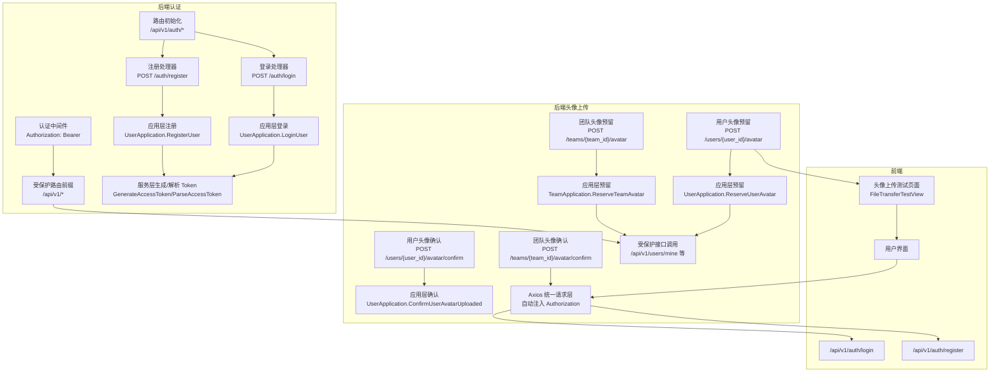
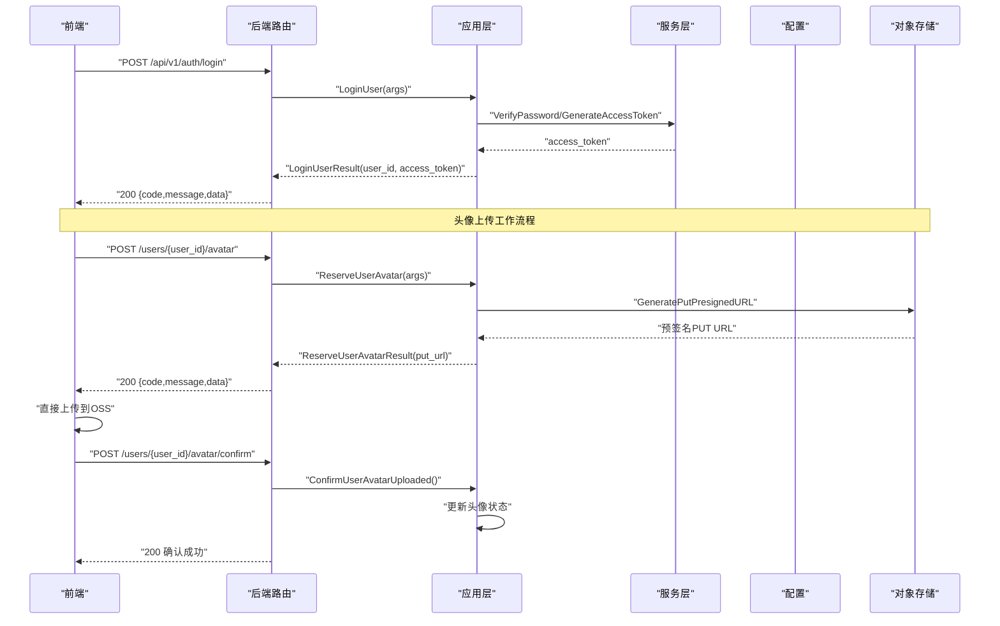
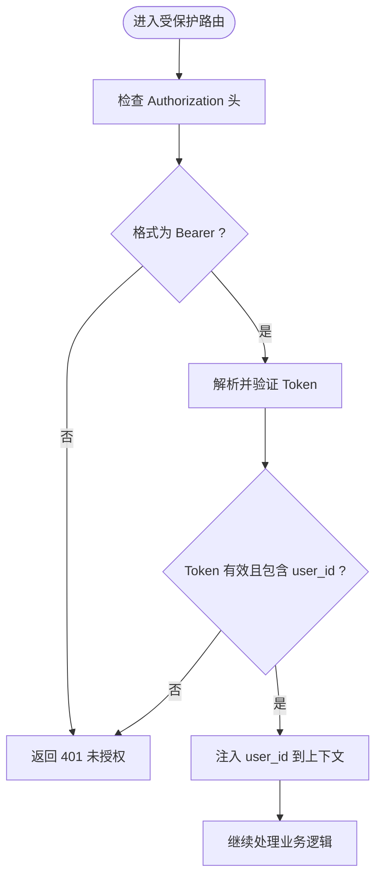
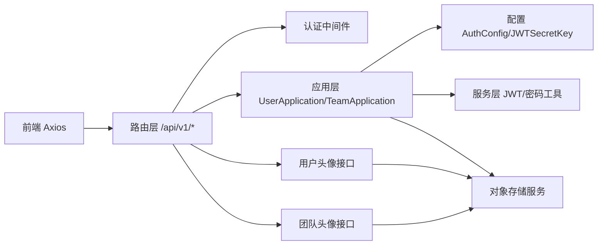

# 认证接口

<cite>
**本文引用的文件**
- [internal/api/http/auth.go](file://internal/api/http/auth.go)
- [internal/api/http/middleware.go](file://internal/api/http/middleware.go)
- [internal/api/http/http.go](file://internal/api/http/http.go)
- [internal/api/http/util.go](file://internal/api/http/util.go)
- [internal/api/http/user.go](file://internal/api/http/user.go)
- [internal/api/http/team.go](file://internal/api/http/team.go)
- [internal/domain/model/token.go](file://internal/domain/model/token.go)
- [internal/domain/service/user.go](file://internal/domain/service/user.go)
- [internal/config/config.go](file://internal/config/config.go)
- [internal/value/user.go](file://internal/value/user.go)
- [internal/value/team.go](file://internal/value/team.go)
- [internal/application/user.go](file://internal/application/user.go)
- [internal/application/team.go](file://internal/application/team.go)
- [frontend/src/api/modules/auth.ts](file://frontend/src/api/modules/auth.ts)
- [frontend/src/api/modules/team.ts](file://frontend/src/api/modules/team.ts)
- [frontend/src/stores/auth.ts](file://frontend/src/stores/auth.ts)
- [frontend/src/api/http.ts](file://frontend/src/api/http.ts)
</cite>

## 更新摘要
**变更内容**
- 新增完整的用户头像上传工作流程：reserveUserAvatar 和 confirmUserAvatarUploaded 接口
- 新增团队头像上传工作流程：reserveTeamAvatar 和 confirmTeamAvatarUploaded 接口
- 增强 getCurrentUserProfile 接口，返回包含头像信息的完整用户详情
- 更新响应格式，支持头像上传状态和URL
- 新增头像上传的预签名URL生成机制

## 目录
1. [简介](#简介)
2. [项目结构](#项目结构)
3. [核心组件](#核心组件)
4. [架构总览](#架构总览)
5. [详细组件分析](#详细组件分析)
6. [依赖关系分析](#依赖关系分析)
7. [性能考虑](#性能考虑)
8. [故障排查指南](#故障排查指南)
9. [结论](#结论)
10. [附录](#附录)

## 简介
本文件面向 poprako-web-ms 项目的认证接口，系统性说明用户登录与注册两个核心端点，覆盖请求参数、响应结构、状态码、JWT 认证机制、认证中间件工作原理、Token 生成与验证流程，并提供请求与响应示例及安全最佳实践。

**更新** 本版本重点介绍了认证接口响应格式的优化：从完整的用户对象简化为 user_id + access_token 组合，提升了安全性并减少了响应负载。同时新增了完整的头像上传工作流程，支持用户和团队头像的预签名URL上传机制。

## 项目结构
后端采用 Iris 框架，认证相关路由位于 /api/v1/auth 下，认证中间件统一拦截受保护路由；前端通过 Axios 封装统一注入 Authorization 头并处理 401 场景。新增的头像上传接口位于 /users/{user_id}/avatar 和 /teams/{team_id}/avatar 路径。

**图表来源**
- [internal/api/http/http.go:38-60](file://internal/api/http/http.go#L38-L60)
- [internal/api/http/auth.go:22-72](file://internal/api/http/auth.go#L22-L72)
- [internal/api/http/middleware.go:47-79](file://internal/api/http/middleware.go#L47-L79)
- [internal/api/http/user.go:98-184](file://internal/api/http/user.go#L98-L184)
- [internal/api/http/team.go:173-261](file://internal/api/http/team.go#L173-L261)
- [frontend/src/api/http.ts:38-62](file://frontend/src/api/http.ts#L38-L62)

**章节来源**
- [internal/api/http/http.go:38-60](file://internal/api/http/http.go#L38-L60)
- [internal/api/http/auth.go:22-72](file://internal/api/http/auth.go#L22-L72)
- [internal/api/http/user.go:98-184](file://internal/api/http/user.go#L98-L184)
- [internal/api/http/team.go:173-261](file://internal/api/http/team.go#L173-L261)
- [frontend/src/api/http.ts:38-62](file://frontend/src/api/http.ts#L38-L62)

## 核心组件
- 登录端点：POST /api/v1/auth/login
- 注册端点：POST /api/v1/auth/register
- 当前用户资料：GET /api/v1/users/mine
- 用户头像预留：POST /api/v1/users/{user_id}/avatar
- 用户头像确认：POST /api/v1/users/{user_id}/avatar/confirm
- 团队头像预留：POST /api/v1/teams/{team_id}/avatar
- 团队头像确认：POST /api/v1/teams/{team_id}/avatar/confirm
- 认证中间件：Authorization 头校验与 Token 解析
- JWT Claims：包含用户标识与标准字段
- 应用层：登录/注册/头像上传业务逻辑与事务控制
- 前端：Axios 自动注入 Bearer Token，401 统一跳转登录

**更新** 响应格式已优化为最小化暴露，仅包含必要的认证信息。新增的头像上传接口支持完整的预签名URL上传工作流程。

**章节来源**
- [internal/api/http/auth.go:10-72](file://internal/api/http/auth.go#L10-L72)
- [internal/api/http/middleware.go:47-79](file://internal/api/http/middleware.go#L47-L79)
- [internal/api/http/user.go:98-184](file://internal/api/http/user.go#L98-L184)
- [internal/api/http/team.go:173-261](file://internal/api/http/team.go#L173-L261)
- [internal/domain/model/token.go:5-8](file://internal/domain/model/token.go#L5-L8)
- [internal/application/user.go:106-278](file://internal/application/user.go#L106-L278)
- [frontend/src/api/modules/auth.ts:79-156](file://frontend/src/api/modules/auth.ts#L79-L156)

## 架构总览
下图展示认证端到端流程：前端发起登录/注册请求，后端校验参数与凭据，签发 JWT；后续请求由中间件解析并注入用户上下文。新增的头像上传流程通过预签名URL实现安全的直接文件上传。

**图表来源**
- [internal/api/http/auth.go:22-40](file://internal/api/http/auth.go#L22-L40)
- [internal/application/user.go:106-154](file://internal/application/user.go#L106-L154)
- [internal/domain/service/user.go:15-41](file://internal/domain/service/user.go#L15-L41)
- [internal/api/http/middleware.go:47-79](file://internal/api/http/middleware.go#L47-L79)
- [internal/config/config.go:69-83](file://internal/config/config.go#L69-L83)
- [internal/application/user.go:427-475](file://internal/application/user.go#L427-L475)

## 详细组件分析

### 登录接口 /api/v1/auth/login
- 方法与路径
  - POST /api/v1/auth/login
- 功能描述
  - 使用 QQ 与密码登录，成功返回访问令牌与用户标识
- 请求体参数
  - qq: string（必填）
  - password: string（必填）
- 响应体结构
  - code: number（统一 200）
  - message: string（例如"登录成功"）
  - data: object
    - user_id: string
    - access_token: string
- 状态码
  - 200 成功
  - 400 请求体格式错误或参数校验失败
  - 401 凭据无效或未授权
- 参数校验
  - QQ 与密码均不能为空
- 典型场景
  - 成功登录：返回 access_token 与 user_id
  - 参数缺失：返回 400
  - 凭据错误：返回 401

**更新** 响应格式已简化为最小化结构，仅包含 user_id 和 access_token，避免暴露额外的用户信息。

**章节来源**
- [internal/api/http/auth.go:10-40](file://internal/api/http/auth.go#L10-L40)
- [internal/value/user.go:8-27](file://internal/value/user.go#L8-L27)
- [internal/application/user.go:106-154](file://internal/application/user.go#L106-L154)
- [internal/api/http/util.go:11-39](file://internal/api/http/util.go#L11-L39)

### 注册接口 /api/v1/auth/register
- 方法与路径
  - POST /api/v1/auth/register
- 功能描述
  - 使用 QQ、密码、姓名与邀请码注册，成功返回访问令牌与用户标识
- 请求体参数
  - name: string（必填）
  - qq: string（必填，长度 5~20）
  - password: string（必填，长度 6~30）
  - invitation_code: string（必填）
- 响应体结构
  - code: number（统一 200）
  - message: string（例如"注册成功"）
  - data: object
    - user_id: string
    - access_token: string
- 状态码
  - 200 成功
  - 400 请求体格式错误或参数校验失败
  - 401 未授权（一般不会出现）
- 参数校验
  - 名字长度 2~20 字
  - QQ 长度 5~20
  - 密码长度 6~30
  - 邀请码必填
- 典型场景
  - 成功注册：返回 access_token 与 user_id
  - 邀请信息缺失：返回 400
  - 参数不合法：返回 400

**更新** 注册接口同样采用简化的响应格式，保持与登录接口一致的安全性原则。

**章节来源**
- [internal/api/http/auth.go:42-72](file://internal/api/http/auth.go#L42-L72)
- [internal/value/user.go:34-69](file://internal/value/user.go#L34-L69)
- [internal/application/user.go:156-278](file://internal/application/user.go#L156-L278)
- [internal/api/http/util.go:11-39](file://internal/api/http/util.go#L11-L39)

### 当前用户资料接口 /api/v1/users/mine
- 方法与路径
  - GET /api/v1/users/mine
- 功能描述
  - 获取当前登录用户的详细信息，包含头像状态和URL
- 请求参数
  - 无
- 响应体结构
  - code: number（统一 200）
  - message: string（例如"获取当前用户信息成功"）
  - data: object
    - id: string
    - name: string
    - qq: string
    - avatar_url: string
    - is_avatar_uploaded: boolean
    - is_super_admin: boolean
    - created_at: number
    - updated_at: number
- 状态码
  - 200 成功
  - 401 未授权
  - 403 权限不足
- 权限要求
  - 需要有效的认证令牌
  - 用户只能查看自己的信息
- 典型场景
  - 成功获取：返回完整的用户信息，包含头像状态
  - 未认证：返回 401

**更新** 新增的用户资料接口现在包含头像相关信息，支持头像上传状态的查询。

**章节来源**
- [internal/api/http/user.go:272-301](file://internal/api/http/user.go#L272-L301)
- [internal/value/user.go:76-89](file://internal/value/user.go#L76-L89)
- [internal/application/user.go:322-362](file://internal/application/user.go#L322-L362)

### 用户头像上传预留接口 /api/v1/users/{user_id}/avatar
- 方法与路径
  - POST /api/v1/users/{user_id}/avatar
- 功能描述
  - 为指定用户头像生成预签名 PUT URL，并预留 avatar_oss_key
- 路径参数
  - user_id: string（必填）- 目标用户ID
- 请求体参数
  - content_type: string（必填）- 文件内容类型
- 响应体结构
  - code: number（统一 200）
  - message: string（例如"预留用户头像成功"）
  - data: object
    - put_url: string - 预签名的PUT上传URL
- 状态码
  - 200 成功
  - 400 请求体格式错误或参数校验失败
  - 401 未授权
  - 403 权限不足
- 权限要求
  - 需要有效的认证令牌
  - 用户只能更新自己的头像
- 参数校验
  - content_type 不能为空
  - user_id 不能为空
- 典型场景
  - 成功预留：返回可直接上传的预签名URL
  - 权限不足：返回 403
  - 参数错误：返回 400

**更新** 新增的用户头像上传预留接口，支持通过预签名URL进行安全的直接文件上传。

**章节来源**
- [internal/api/http/user.go:98-144](file://internal/api/http/user.go#L98-L144)
- [internal/value/user.go:91-109](file://internal/value/user.go#L91-L109)
- [internal/application/user.go:427-475](file://internal/application/user.go#L427-L475)

### 用户头像上传确认接口 /api/v1/users/{user_id}/avatar/confirm
- 方法与路径
  - POST /api/v1/users/{user_id}/avatar/confirm
- 功能描述
  - 在客户端上传头像后，确认用户头像上传状态
- 路径参数
  - user_id: string（必填）- 目标用户ID
- 请求参数
  - 无
- 响应体结构
  - code: number（统一 200）
  - message: string（例如"确认用户头像上传成功"）
  - data: null
- 状态码
  - 200 成功
  - 400 请求参数错误
  - 401 未授权
  - 403 权限不足
- 权限要求
  - 需要有效的认证令牌
  - 用户只能更新自己的头像
- 典型场景
  - 成功确认：更新头像上传状态为已完成
  - 权限不足：返回 403
  - 参数错误：返回 400

**更新** 新增的用户头像上传确认接口，确保头像上传流程的完整性。

**章节来源**
- [internal/api/http/user.go:146-184](file://internal/api/http/user.go#L146-L184)
- [internal/application/user.go:476-520](file://internal/application/user.go#L476-L520)

### 团队头像上传预留接口 /api/v1/teams/{team_id}/avatar
- 方法与路径
  - POST /api/v1/teams/{team_id}/avatar
- 功能描述
  - 为指定团队头像生成预签名 PUT URL，并预留 avatar_oss_key
- 路径参数
  - team_id: string（必填）- 目标团队ID
- 请求体参数
  - content_type: string（必填）- 文件内容类型
- 响应体结构
  - code: number（统一 200）
  - message: string（例如"预留汉化组头像成功"）
  - data: object
    - avatar_oss_key: string - 头像在对象存储中的键名
    - put_url: string - 预签名的PUT上传URL
- 状态码
  - 200 成功
  - 400 请求体格式错误或参数校验失败
  - 401 未授权
  - 403 权限不足
- 权限要求
  - 需要有效的认证令牌
  - 需要团队管理权限
- 参数校验
  - content_type 不能为空
  - team_id 不能为空
- 典型场景
  - 成功预留：返回头像OSS键名和可直接上传的预签名URL
  - 权限不足：返回 403
  - 参数错误：返回 400

**更新** 新增的团队头像上传预留接口，支持团队头像的预签名URL上传机制。

**章节来源**
- [internal/api/http/team.go:173-221](file://internal/api/http/team.go#L173-L221)
- [internal/value/team.go:47-66](file://internal/value/team.go#L47-L66)
- [internal/application/team.go:187-239](file://internal/application/team.go#L187-L239)

### 团队头像上传确认接口 /api/v1/teams/{team_id}/avatar/confirm
- 方法与路径
  - POST /api/v1/teams/{team_id}/avatar/confirm
- 功能描述
  - 在客户端上传团队头像后，确认团队头像上传状态
- 路径参数
  - team_id: string（必填）- 目标团队ID
- 请求参数
  - 无
- 响应体结构
  - code: number（统一 200）
  - message: string（例如"确认汉化组头像上传成功"）
  - data: null
- 状态码
  - 200 成功
  - 400 请求参数错误
  - 401 未授权
  - 403 权限不足
- 权限要求
  - 需要有效的认证令牌
  - 需要团队管理权限
- 典型场景
  - 成功确认：更新团队头像上传状态为已完成
  - 权限不足：返回 403
  - 参数错误：返回 400

**更新** 新增的团队头像上传确认接口，确保团队头像上传流程的完整性。

**章节来源**
- [internal/api/http/team.go:223-261](file://internal/api/http/team.go#L223-L261)
- [internal/application/team.go:352-387](file://internal/application/team.go#L352-L387)

### 认证中间件与 JWT 机制
- 中间件职责
  - 校验 Authorization 头是否为 Bearer <token>
  - 解析并验证 JWT，提取用户标识注入上下文
- Token 结构
  - 标准声明：过期时间、签发时间、发行者、主题
  - 自定义声明：user_id
- Token 生成与解析
  - 生成：基于密钥与过期时长签发 HS256
  - 解析：校验签名与有效期，返回 Claims
- 配置来源
  - JWT 密钥来自环境变量
  - 过期时长来自配置

**图表来源**
- [internal/api/http/middleware.go:47-79](file://internal/api/http/middleware.go#L47-L79)
- [internal/domain/model/token.go:5-8](file://internal/domain/model/token.go#L5-L8)
- [internal/domain/service/user.go:43-68](file://internal/domain/service/user.go#L43-L68)
- [internal/config/config.go:69-83](file://internal/config/config.go#L69-L83)

**章节来源**
- [internal/api/http/middleware.go:47-79](file://internal/api/http/middleware.go#L47-L79)
- [internal/domain/model/token.go:5-8](file://internal/domain/model/token.go#L5-L8)
- [internal/domain/service/user.go:15-41](file://internal/domain/service/user.go#L15-L41)
- [internal/config/config.go:69-83](file://internal/config/config.go#L69-L83)

### 前端集成与安全实践
- Axios 统一请求层
  - 自动从本地存储读取 access_token 并注入 Authorization: Bearer
  - 401 时清理本地 token 并跳转登录页
- 登录/注册调用
  - 前端模块导出 login 与 register 方法，分别映射到后端 /auth/login 与 /auth/register
- 头像上传前端实现
  - reserveUserAvatar 和 reserveTeamAvatar 函数用于获取预签名URL
  - confirmUserAvatarUploaded 和 confirmTeamAvatarUploaded 函数用于确认上传完成
  - 支持直接向对象存储上传文件，无需经过服务器中转
- 安全建议
  - 仅在 HTTPS 环境部署，避免明文传输
  - 合理设置 Token 过期时间，必要时引入刷新 Token 流程
  - 前端避免在日志或错误堆栈中泄露敏感信息
  - 后端严格校验参数与权限，避免用户枚举
  - 预签名URL具有时效性，防止长期有效的上传通道被滥用

**更新** 前端已适配简化的响应格式，LoginUserResult 和 RegisterUserResult 现在只包含 user_id 和 access_token 字段。新增了头像上传相关的前端API调用。

**章节来源**
- [frontend/src/api/http.ts:38-82](file://frontend/src/api/http.ts#L38-L82)
- [frontend/src/api/modules/auth.ts:79-156](file://frontend/src/api/modules/auth.ts#L79-L156)
- [frontend/src/api/modules/team.ts:105-134](file://frontend/src/api/modules/team.ts#L105-L134)
- [frontend/src/stores/auth.ts:15-50](file://frontend/src/stores/auth.ts#L15-L50)

## 依赖关系分析
- 路由层依赖应用层；应用层依赖服务层与配置；前端依赖路由层并通过 Axios 统一处理认证头。
- 关键耦合点
  - 认证中间件依赖配置中的密钥与过期时长
  - 应用层依赖仓库与邀请信息以完成注册事务
  - 头像上传功能依赖对象存储服务生成预签名URL
  - 头像上传确认功能依赖数据库事务保证状态一致性

**图表来源**
- [internal/api/http/http.go:38-60](file://internal/api/http/http.go#L38-L60)
- [internal/api/http/middleware.go:47-79](file://internal/api/http/middleware.go#L47-L79)
- [internal/application/user.go:106-278](file://internal/application/user.go#L106-L278)
- [internal/application/team.go:187-239](file://internal/application/team.go#L187-L239)
- [internal/config/config.go:69-83](file://internal/config/config.go#L69-L83)
- [internal/domain/service/user.go:15-41](file://internal/domain/service/user.go#L15-L41)

**章节来源**
- [internal/api/http/http.go:38-60](file://internal/api/http/http.go#L38-L60)
- [internal/application/user.go:106-278](file://internal/application/user.go#L106-L278)
- [internal/application/team.go:187-239](file://internal/application/team.go#L187-L239)
- [internal/config/config.go:69-83](file://internal/config/config.go#L69-L83)

## 性能考虑
- Token 生成与解析为轻量操作，主要开销在数据库查询与密码哈希
- 响应格式优化带来的收益
  - 减少网络传输数据量，提升响应速度
  - 降低前端解析复杂度
  - 减少内存占用
- 头像上传的性能优势
  - 预签名URL允许直接上传到对象存储，绕过应用服务器
  - 减少服务器带宽压力和CPU开销
  - 提升用户体验，支持大文件快速上传
- 建议
  - 缓存常用用户信息，减少重复查询
  - 对高频接口使用更短过期时间并结合刷新策略
  - 合理设置日志级别，避免在生产环境输出敏感数据
  - 为预签名URL设置合理的过期时间，平衡安全性和性能

**更新** 响应格式的简化显著减少了网络传输的数据量，提升了整体性能。头像上传通过预签名URL机制实现了更好的性能表现。

## 故障排查指南
- 400 请求体格式错误
  - 检查请求体 JSON 格式与字段类型
- 400 参数校验失败
  - 登录：QQ 或密码为空
  - 注册：名字/QQ/密码长度或邀请码为空
  - 头像上传：content_type 为空或 user_id/team_id 为空
- 401 未授权
  - 未提供 Authorization 头或格式不正确
  - Token 无效、过期或缺少 user_id
  - 前端 401 会自动清除本地 token 并跳转登录
- 403 权限不足
  - 尝试访问其他用户的头像或团队管理功能
  - 需要适当的权限才能进行头像上传操作
- 500 服务器内部错误
  - Token 生成失败、数据库异常、事务回滚失败
  - 对象存储服务连接失败
  - 预签名URL生成失败

**更新** 新增了头像上传相关的错误场景，包括权限不足和对象存储服务问题。

**章节来源**
- [internal/api/http/util.go:11-39](file://internal/api/http/util.go#L11-L39)
- [internal/api/http/middleware.go:50-78](file://internal/api/http/middleware.go#L50-L78)
- [frontend/src/api/http.ts:67-82](file://frontend/src/api/http.ts#L67-L82)

## 结论
本项目采用简洁可靠的 JWT 认证方案：登录/注册端点负责签发访问令牌，认证中间件统一校验并注入用户上下文。通过将响应格式从完整用户对象简化为 user_id + access_token 组合，进一步提升了安全性并减少了网络开销。新增的头像上传工作流程通过预签名URL机制实现了高效、安全的文件上传，绕过了应用服务器，显著提升了性能。前后端配合通过 Axios 自动注入 Authorization 头，提升开发效率与安全性。建议在生产环境强化密钥管理与 Token 过期策略，并持续监控与优化认证链路性能。

**更新** 响应格式的优化体现了现代 API 设计的最佳实践：最小化暴露敏感信息，最大化安全性与性能。头像上传功能的引入完善了用户资料管理能力，提供了更好的用户体验。

## 附录

### 接口定义与示例

- 登录
  - 请求
    - POST /api/v1/auth/login
    - Content-Type: application/json
    - Body:
      - qq: string
      - password: string
  - 响应
    - 200
    - Body: { code: 200, message: "登录成功", data: { user_id: string, access_token: string } }

- 注册
  - 请求
    - POST /api/v1/auth/register
    - Content-Type: application/json
    - Body:
      - name: string
      - qq: string
      - password: string
      - invitation_code: string
  - 响应
    - 200
    - Body: { code: 200, message: "注册成功", data: { user_id: string, access_token: string } }

- 当前用户资料
  - 请求
    - GET /api/v1/users/mine
    - Header: Authorization: Bearer <access_token>
  - 响应
    - 200
    - Body: { code: 200, message: "获取当前用户信息成功", data: { id: string, name: string, qq: string, avatar_url: string, is_avatar_uploaded: boolean, is_super_admin: boolean, created_at: number, updated_at: number } }

- 用户头像上传预留
  - 请求
    - POST /api/v1/users/{user_id}/avatar
    - Header: Authorization: Bearer <access_token>
    - Body:
      - content_type: string
  - 响应
    - 200
    - Body: { code: 200, message: "预留用户头像成功", data: { put_url: string } }

- 用户头像上传确认
  - 请求
    - POST /api/v1/users/{user_id}/avatar/confirm
    - Header: Authorization: Bearer <access_token>
  - 响应
    - 200
    - Body: { code: 200, message: "确认用户头像上传成功", data: null }

- 团队头像上传预留
  - 请求
    - POST /api/v1/teams/{team_id}/avatar
    - Header: Authorization: Bearer <access_token>
    - Body:
      - content_type: string
  - 响应
    - 200
    - Body: { code: 200, message: "预留汉化组头像成功", data: { avatar_oss_key: string, put_url: string } }

- 团队头像上传确认
  - 请求
    - POST /api/v1/teams/{team_id}/avatar/confirm
    - Header: Authorization: Bearer <access_token>
  - 响应
    - 200
    - Body: { code: 200, message: "确认汉化组头像上传成功", data: null }

- 受保护接口（示例）
  - GET /api/v1/users/mine
  - Header: Authorization: Bearer <access_token>
  - 响应：200 返回用户信息

**更新** 所有响应示例都反映了简化的 user_id + access_token 结构。新增了头像上传相关的接口示例。

**章节来源**
- [internal/api/http/auth.go:10-72](file://internal/api/http/auth.go#L10-L72)
- [internal/api/http/user.go:98-184](file://internal/api/http/user.go#L98-L184)
- [internal/api/http/team.go:173-261](file://internal/api/http/team.go#L173-L261)
- [internal/api/http/http.go:40-60](file://internal/api/http/http.go#L40-L60)
- [frontend/src/api/modules/auth.ts:79-156](file://frontend/src/api/modules/auth.ts#L79-L156)
- [frontend/src/api/modules/team.ts:105-134](file://frontend/src/api/modules/team.ts#L105-L134)
- [frontend/src/api/http.ts:38-62](file://frontend/src/api/http.ts#L38-L62)