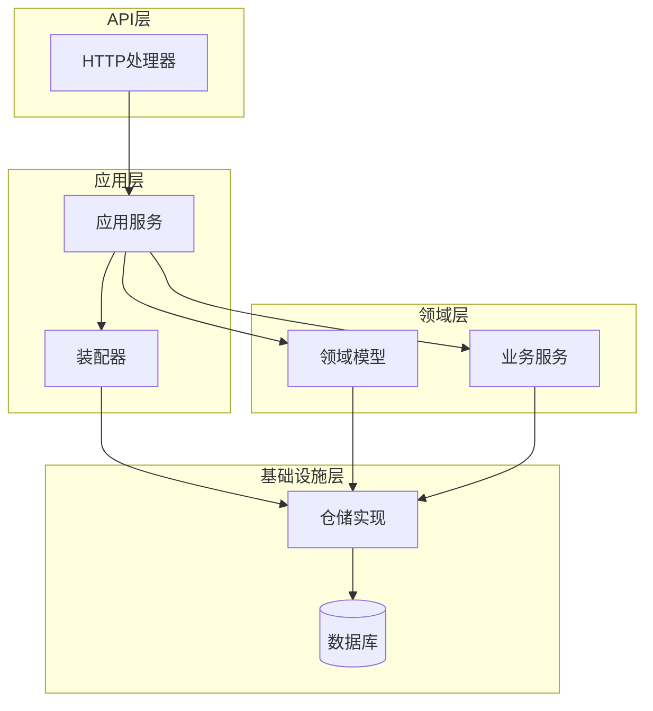
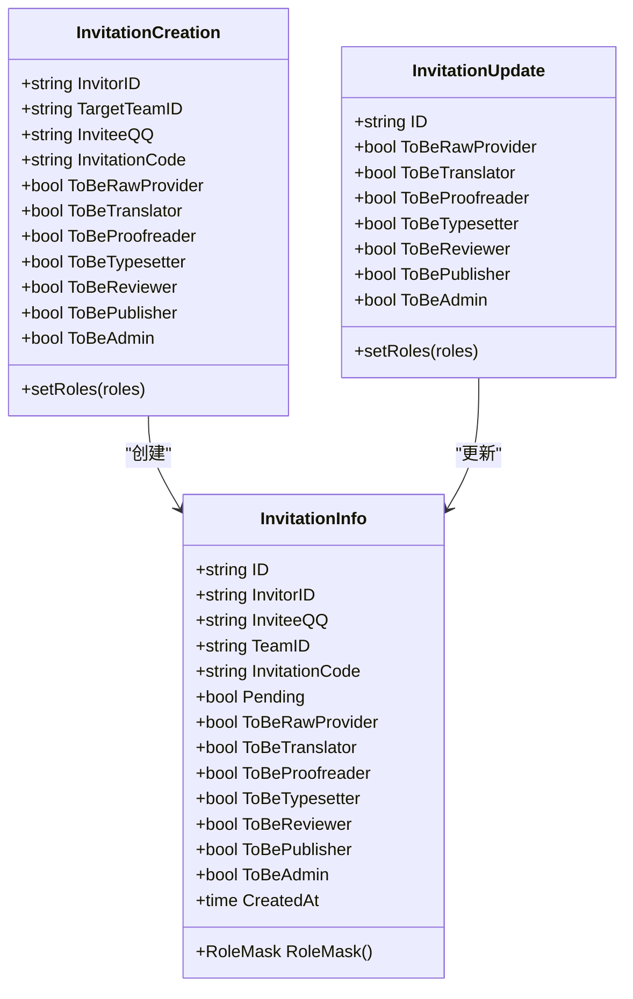
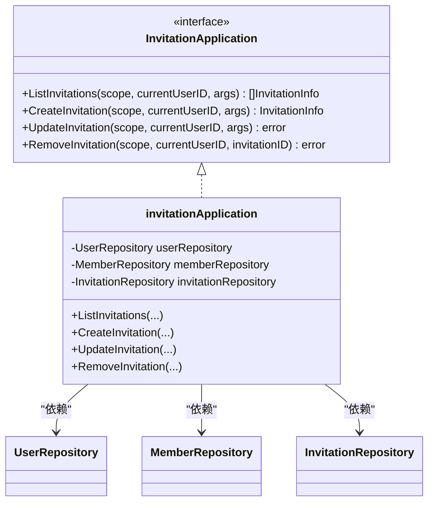
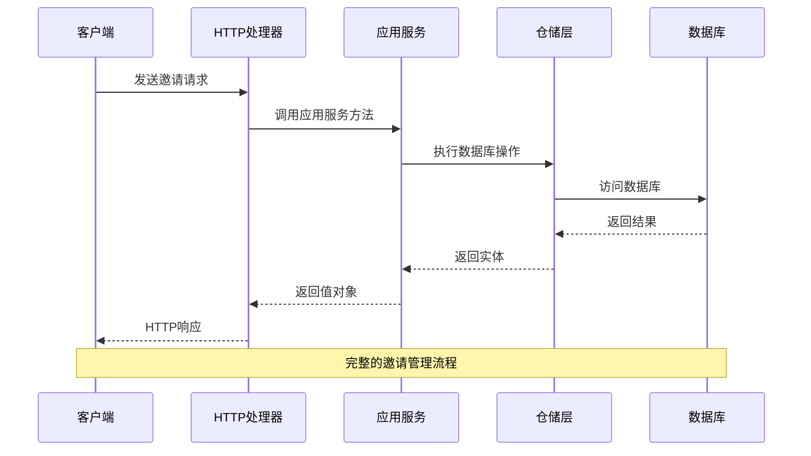
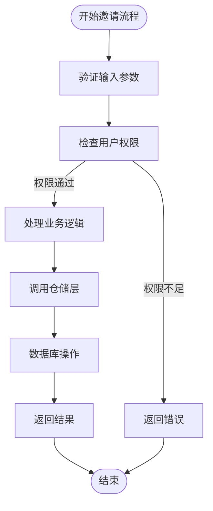
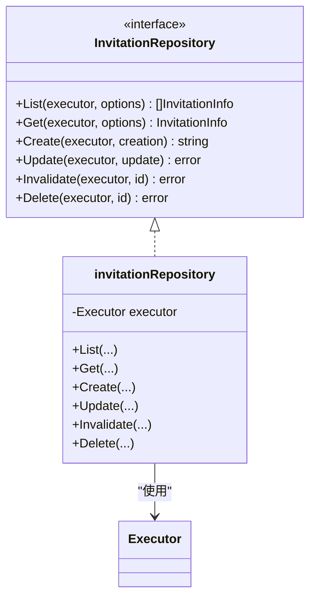
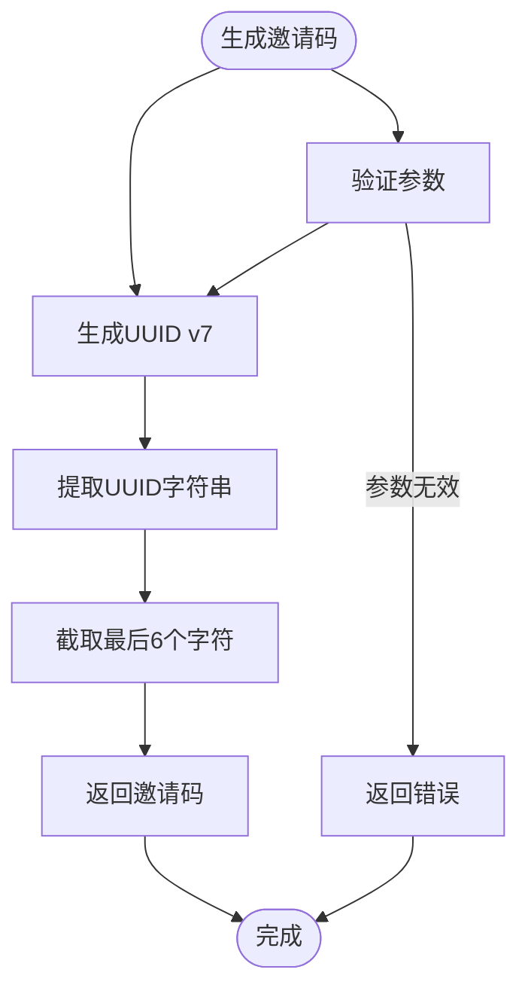
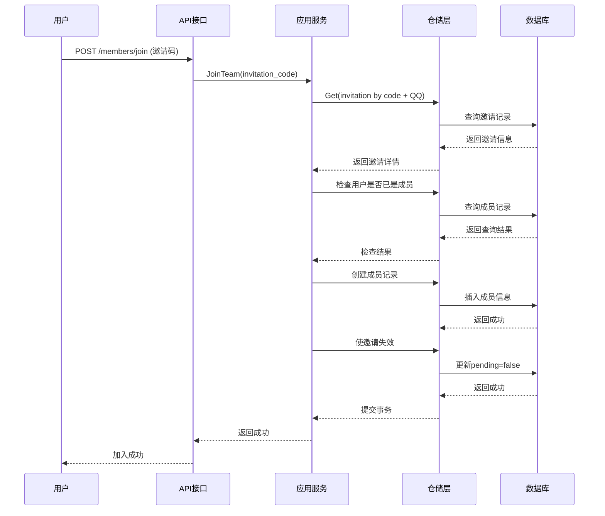
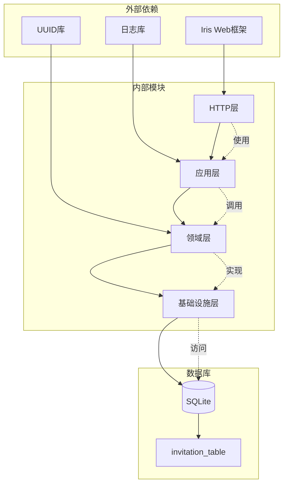

# 邀请管理接口

<cite>
**本文档引用的文件**
- [internal/api/http/invitation.go](file://internal/api/http/invitation.go)
- [internal/application/invitation.go](file://internal/application/invitation.go)
- [internal/domain/model/invitation.go](file://internal/domain/model/invitation.go)
- [internal/domain/repository/invitation.go](file://internal/domain/repository/invitation.go)
- [internal/infrastructure/repository/invitation.go](file://internal/infrastructure/repository/invitation.go)
- [internal/domain/service/invitation.go](file://internal/domain/service/invitation.go)
- [internal/value/invitation.go](file://internal/value/invitation.go)
- [internal/application/assembler/invitation.go](file://internal/application/assembler/invitation.go)
- [migrations/20260301075642_invitation-table.up.sql](file://migrations/20260301075642_invitation-table.up.sql)
- [internal/application/member.go](file://internal/application/member.go)
- [internal/api/http/member.go](file://internal/api/http/member.go)
- [internal/domain/model/member.go](file://internal/domain/model/member.go)
- [docs/swagger.json](file://docs/swagger.json)
</cite>

## 目录
1. [简介](#简介)
2. [项目结构](#项目结构)
3. [核心组件](#核心组件)
4. [架构概览](#架构概览)
5. [详细组件分析](#详细组件分析)
6. [依赖关系分析](#依赖关系分析)
7. [性能考虑](#性能考虑)
8. [故障排除指南](#故障排除指南)
9. [结论](#结论)

## 简介

poprako-web-ms 项目的邀请管理接口提供了完整的团队邀请生命周期管理功能。该系统支持创建、查询、更新和删除团队邀请，以及基于邀请码的成员加入功能。邀请机制采用基于角色的权限控制，确保只有授权用户才能执行相应的操作。

系统的核心特性包括：
- 基于角色的邀请管理（原始提供者、翻译者、校对者、排版工、审核员、发布者、管理员）
- 完整的邀请生命周期管理
- 安全的邀请码生成和验证机制
- 事务性操作确保数据一致性
- 支持邀请信息的关联查询

## 项目结构

邀请管理系统在整体项目架构中位于以下层次：

**图表来源**
- [internal/api/http/invitation.go:1-185](file://internal/api/http/invitation.go#L1-L185)
- [internal/application/invitation.go:1-304](file://internal/application/invitation.go#L1-L304)

**章节来源**
- [internal/api/http/invitation.go:1-185](file://internal/api/http/invitation.go#L1-L185)
- [internal/application/invitation.go:1-304](file://internal/application/invitation.go#L1-L304)

## 核心组件

### 数据模型组件

邀请系统的核心数据模型包括三个主要组件：

**图表来源**
- [internal/domain/model/invitation.go:7-158](file://internal/domain/model/invitation.go#L7-L158)

### 应用服务组件

应用层负责协调各个组件之间的交互：

**图表来源**
- [internal/application/invitation.go:19-69](file://internal/application/invitation.go#L19-L69)

**章节来源**
- [internal/domain/model/invitation.go:1-158](file://internal/domain/model/invitation.go#L1-L158)
- [internal/application/invitation.go:1-304](file://internal/application/invitation.go#L1-L304)

## 架构概览

邀请管理系统采用分层架构设计，确保关注点分离和代码的可维护性：

**图表来源**
- [internal/api/http/invitation.go:25-53](file://internal/api/http/invitation.go#L25-L53)
- [internal/application/invitation.go:71-131](file://internal/application/invitation.go#L71-L131)

## 详细组件分析

### HTTP处理器组件

HTTP层负责处理REST API请求，提供标准的HTTP接口：

| 组件 | 方法 | 路径 | 功能描述 |
|------|------|------|----------|
| ListInvitations | GET | `/api/v1/invitations` | 获取指定汉化组的邀请列表 |
| CreateInvitation | POST | `/api/v1/invitations` | 创建新的邀请 |
| PatchInvitation | PUT | `/api/v1/invitations/{invitation_id}` | 更新未使用的邀请 |
| DeleteInvitation | DELETE | `/api/v1/invitations/{invitation_id}` | 删除指定邀请 |

每个HTTP处理器都包含完整的错误处理和参数验证逻辑，确保系统的健壮性。

**章节来源**
- [internal/api/http/invitation.go:10-185](file://internal/api/http/invitation.go#L10-L185)

### 应用服务组件

应用层实现了业务逻辑的核心处理：

**图表来源**
- [internal/application/invitation.go:71-131](file://internal/application/invitation.go#L71-L131)

### 仓储层组件

仓储层负责数据持久化操作：

**图表来源**
- [internal/domain/repository/invitation.go:5-14](file://internal/domain/repository/invitation.go#L5-L14)

**章节来源**
- [internal/infrastructure/repository/invitation.go:1-124](file://internal/infrastructure/repository/invitation.go#L1-L124)

### 邀请码生成机制

系统使用基于UUID v7的邀请码生成算法：

**图表来源**
- [internal/domain/service/invitation.go:5-15](file://internal/domain/service/invitation.go#L5-L15)

**章节来源**
- [internal/domain/service/invitation.go:1-16](file://internal/domain/service/invitation.go#L1-L16)

### 邀请状态管理

邀请状态采用布尔标志字段管理：

| 状态 | 字段 | 描述 | 默认值 |
|------|------|------|--------|
| 待处理 | `pending` | 邀请是否有效 | `true` |
| 已使用 | `pending` | 成员加入后变为 `false` | `false` |
| 有效 | `pending` | 可用于成员加入 | `true` |
| 无效 | `pending` | 已被使用或删除 | `false` |

**章节来源**
- [migrations/20260301075642_invitation-table.up.sql:18-18](file://migrations/20260301075642_invitation-table.up.sql#L18-L18)

### 邀请接受流程

成员通过邀请码加入团队的完整流程：

**图表来源**
- [internal/application/member.go:340-447](file://internal/application/member.go#L340-L447)

**章节来源**
- [internal/application/member.go:340-447](file://internal/application/member.go#L340-L447)

## 依赖关系分析

邀请管理系统的关键依赖关系如下：

**图表来源**
- [internal/api/http/invitation.go:3-8](file://internal/api/http/invitation.go#L3-L8)
- [internal/domain/service/invitation.go:3-4](file://internal/domain/service/invitation.go#L3-L4)

**章节来源**
- [internal/api/http/invitation.go:1-185](file://internal/api/http/invitation.go#L1-L185)
- [internal/application/invitation.go:1-304](file://internal/application/invitation.go#L1-L304)

## 性能考虑

### 数据库优化

1. **索引策略**
   - 复合索引 `idx_invitation_target_team_created_at_desc` 优化查询性能
   - 按团队ID和创建时间排序的索引支持高效分页

2. **查询优化**
   - 使用条件过滤减少不必要的数据传输
   - 支持选择性字段加载避免N+1查询问题

3. **缓存策略**
   - 邀请码的唯一性约束防止重复创建
   - 状态字段索引支持快速状态查询

### 并发控制

1. **事务管理**
   - 成员加入采用事务确保原子性
   - 同时创建成员和使邀请失效保证数据一致性

2. **并发安全**
   - 邀请码生成使用UUID v7确保全局唯一性
   - 数据库层面的唯一约束防止竞态条件

## 故障排除指南

### 常见错误类型

| 错误类型 | HTTP状态码 | 错误原因 | 解决方案 |
|----------|------------|----------|----------|
| 参数验证失败 | 400 | 请求参数格式错误 | 检查请求体格式和必填字段 |
| 权限不足 | 403 | 用户无相应权限 | 确认用户在目标团队的权限级别 |
| 邀请不存在 | 400 | 邀请码无效或已使用 | 验证邀请码有效性并确认状态 |
| 成员已存在 | 400 | 用户已是团队成员 | 检查用户当前的团队状态 |
| 数据库错误 | 500 | 数据库操作失败 | 检查数据库连接和约束条件 |

### 调试建议

1. **启用详细日志**
   - 检查应用层的日志输出获取详细的错误信息
   - 使用追踪ID定位具体的请求处理流程

2. **数据库检查**
   - 验证邀请表的数据完整性
   - 检查外键约束和索引状态

3. **API测试**
   - 使用Swagger UI测试接口功能
   - 验证各种边界条件和异常场景

**章节来源**
- [internal/application/invitation.go:78-81](file://internal/application/invitation.go#L78-L81)
- [internal/application/member.go:377-385](file://internal/application/member.go#L377-L385)

## 结论

poprako-web-ms 项目的邀请管理接口提供了完整、安全且高效的团队邀请解决方案。系统采用清晰的分层架构设计，确保了良好的可维护性和扩展性。

### 主要优势

1. **安全性**：基于角色的权限控制确保只有授权用户才能执行相应操作
2. **完整性**：完整的邀请生命周期管理支持从创建到删除的全过程
3. **可靠性**：事务性操作和严格的错误处理保证数据一致性
4. **性能**：合理的数据库设计和索引策略优化查询性能

### 最佳实践建议

1. **权限管理**
   - 严格遵循RBAC权限模型
   - 定期审查用户权限配置

2. **监控和日志**
   - 实施全面的监控和告警机制
   - 保持详细的审计日志

3. **安全加固**
   - 定期轮换邀请码
   - 实施速率限制防止滥用
   - 加强API访问控制

4. **性能优化**
   - 监控数据库性能指标
   - 定期分析慢查询日志
   - 优化索引和查询计划

该邀请管理系统为团队协作提供了坚实的技术基础，能够满足现代Web应用对团队管理的各种需求。