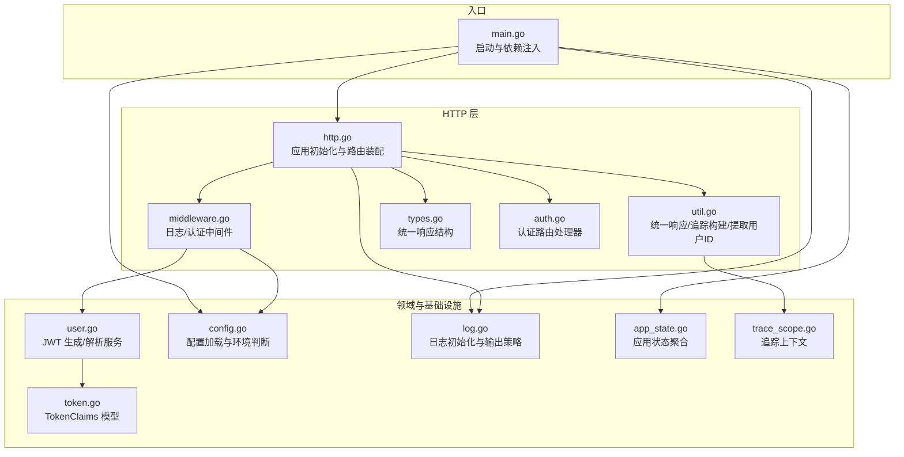
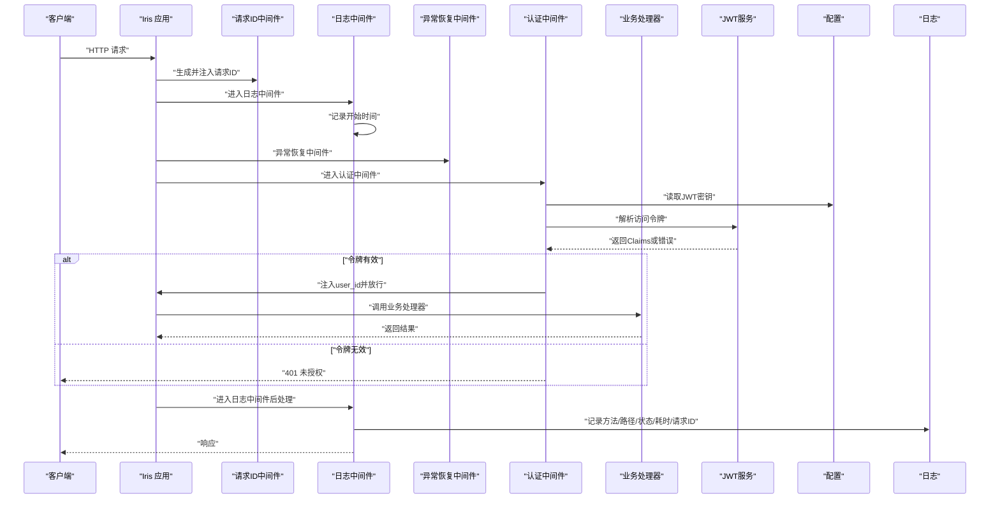
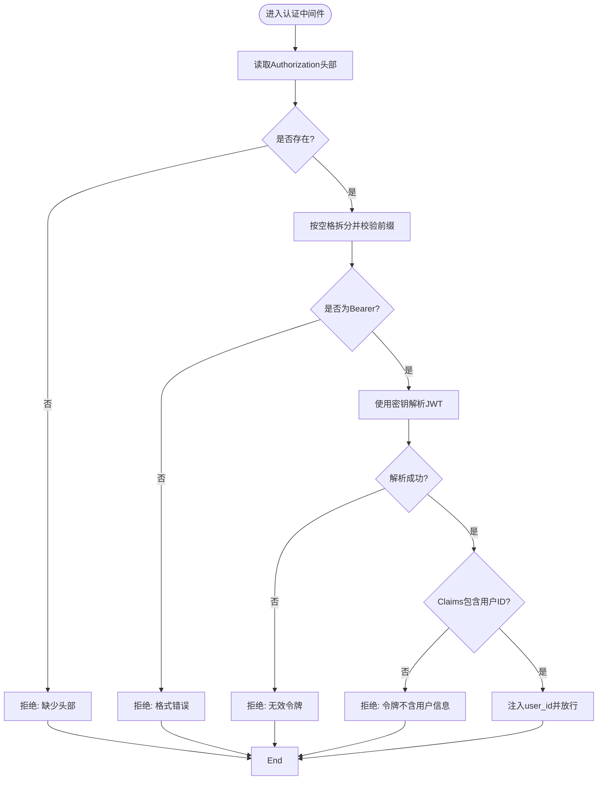
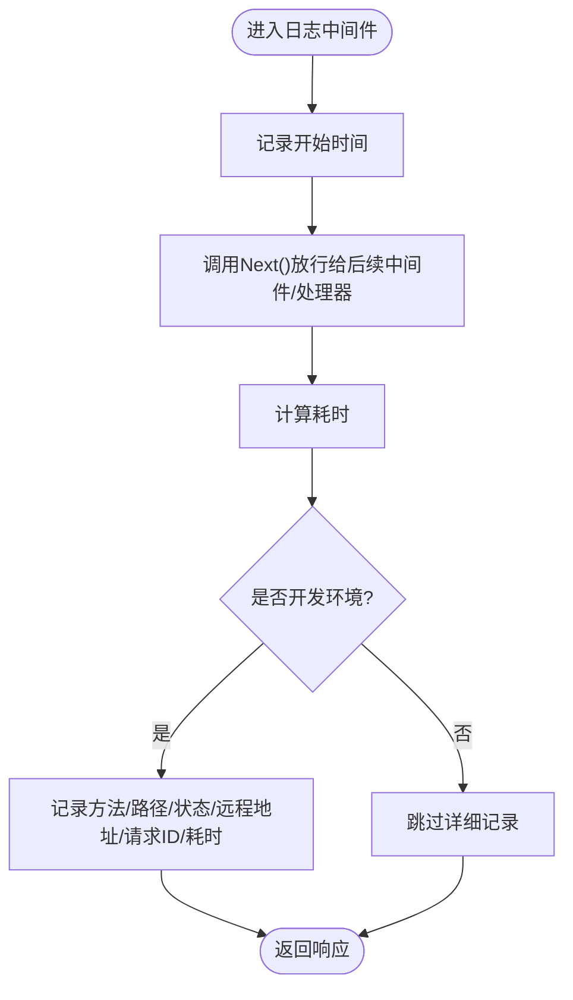
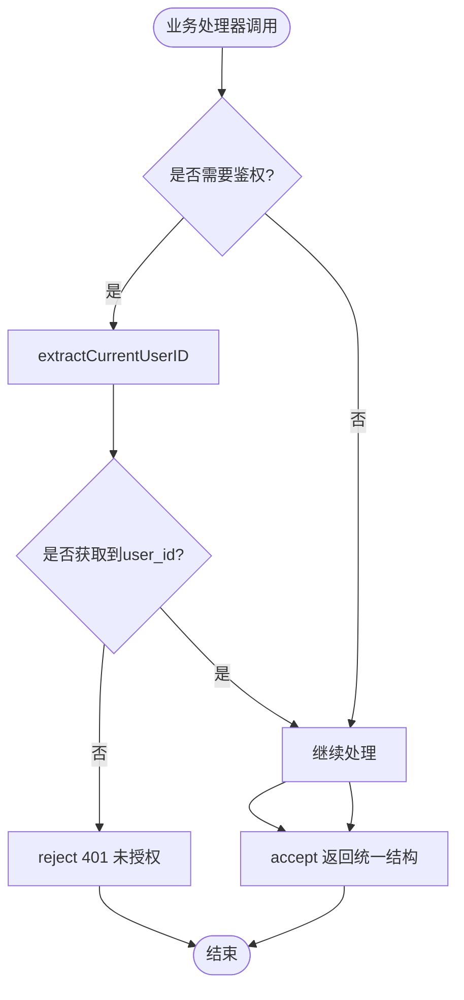
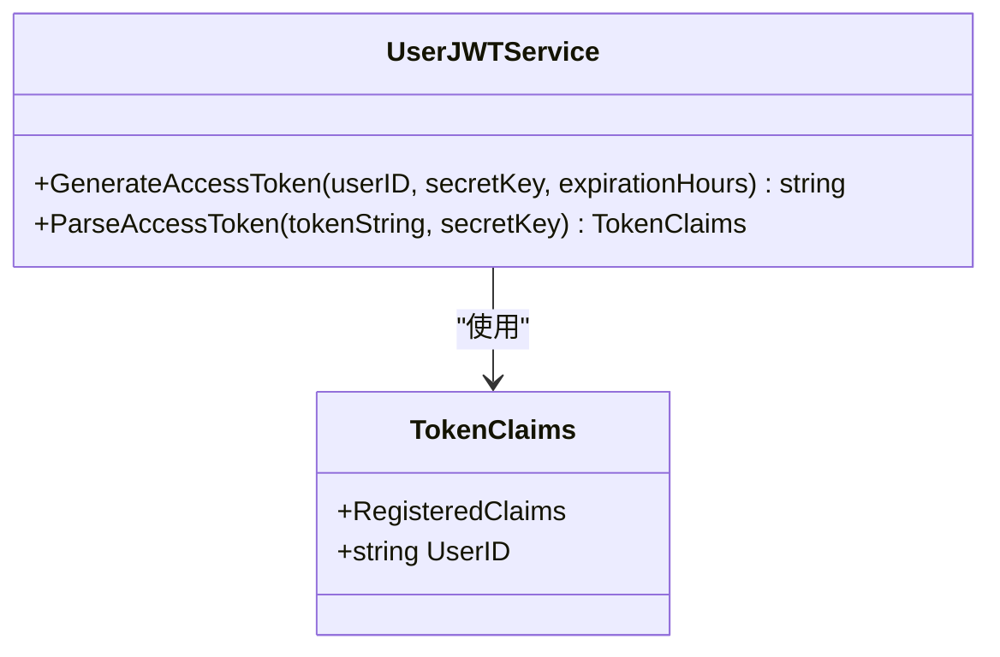
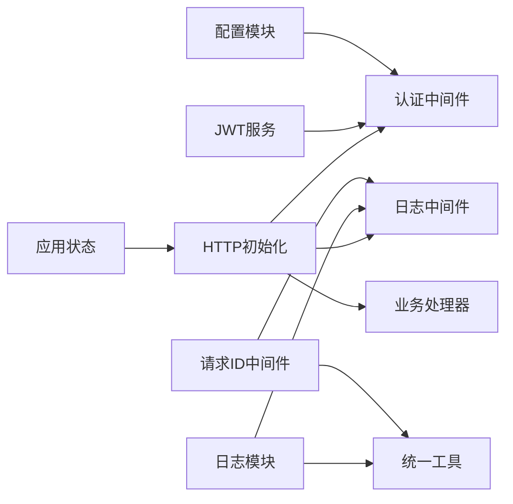

# 中间件和拦截器

<cite>
**本文引用的文件**
- [middleware.go](file://internal/api/http/middleware.go)
- [http.go](file://internal/api/http/http.go)
- [token.go](file://internal/domain/model/token.go)
- [log.go](file://internal/log/log.go)
- [config.go](file://internal/config/config.go)
- [app_state.go](file://internal/state/app_state.go)
- [user.go](file://internal/domain/service/user.go)
- [auth.go](file://internal/api/http/auth.go)
- [util.go](file://internal/api/http/util.go)
- [types.go](file://internal/api/http/types.go)
- [trace_scope.go](file://internal/util/trace_scope.go)
- [error.go](file://internal/application/error.go)
- [main.go](file://main.go)
</cite>

## 目录
1. [简介](#简介)
2. [项目结构](#项目结构)
3. [核心组件](#核心组件)
4. [架构总览](#架构总览)
5. [详细组件分析](#详细组件分析)
6. [依赖分析](#依赖分析)
7. [性能考虑](#性能考虑)
8. [故障排查指南](#故障排查指南)
9. [结论](#结论)
10. [附录](#附录)

## 简介
本文件系统性梳理漫画翻译协作平台的中间件与拦截器实现，重点覆盖以下方面：
- JWT 认证中间件：实现原理、令牌验证流程与权限检查机制
- 日志记录中间件：设计思路、请求追踪策略与错误监控
- 统一处理机制：请求预处理、响应后处理与异常捕获
- 执行顺序、配置选项与可扩展点
- 性能监控、安全防护与调试工具
- 常见需求扩展：跨域处理、CORS 配置与请求限流

## 项目结构
中间件与拦截器相关代码集中在 HTTP 层与领域服务层，配合配置与日志模块共同构成请求处理流水线。

图表来源
- [http.go:26-151](file://internal/api/http/http.go#L26-L151)
- [middleware.go:15-79](file://internal/api/http/middleware.go#L15-L79)
- [util.go:11-58](file://internal/api/http/util.go#L11-L58)
- [types.go:3-9](file://internal/api/http/types.go#L3-L9)
- [auth.go:22-72](file://internal/api/http/auth.go#L22-L72)
- [user.go:15-68](file://internal/domain/service/user.go#L15-L68)
- [token.go:5-8](file://internal/domain/model/token.go#L5-L8)
- [config.go:21-83](file://internal/config/config.go#L21-L83)
- [log.go:13-83](file://internal/log/log.go#L13-L83)
- [app_state.go:8-21](file://internal/state/app_state.go#L8-L21)
- [trace_scope.go:7-31](file://internal/util/trace_scope.go#L7-L31)
- [main.go:25-145](file://main.go#L25-L145)

章节来源
- [http.go:26-151](file://internal/api/http/http.go#L26-L151)
- [middleware.go:15-79](file://internal/api/http/middleware.go#L15-L79)
- [util.go:11-58](file://internal/api/http/util.go#L11-L58)
- [types.go:3-9](file://internal/api/http/types.go#L3-L9)
- [auth.go:22-72](file://internal/api/http/auth.go#L22-L72)
- [user.go:15-68](file://internal/domain/service/user.go#L15-L68)
- [token.go:5-8](file://internal/domain/model/token.go#L5-L8)
- [config.go:21-83](file://internal/config/config.go#L21-L83)
- [log.go:13-83](file://internal/log/log.go#L13-L83)
- [app_state.go:8-21](file://internal/state/app_state.go#L8-L21)
- [trace_scope.go:7-31](file://internal/util/trace_scope.go#L7-L31)
- [main.go:25-145](file://main.go#L25-L145)

## 核心组件
- 认证中间件（AuthorizeMiddleware）：校验 Authorization 头部格式与 Bearer 令牌有效性，解析并注入用户标识
- 日志中间件（LogMiddleware）：统计请求耗时、记录开发环境下的关键指标，结合请求 ID 进行追踪
- 统一响应与错误处理：reject/accept 统一输出结构；extractCurrentUserID 提供便捷的鉴权提取
- JWT 服务：GenerateAccessToken 与 ParseAccessToken 完成令牌签发与解析
- 配置与日志：配置加载、环境判断、日志初始化与输出策略
- 应用状态：集中持有各应用层实例，供中间件与处理器使用

章节来源
- [middleware.go:47-79](file://internal/api/http/middleware.go#L47-L79)
- [middleware.go:15-45](file://internal/api/http/middleware.go#L15-L45)
- [util.go:11-58](file://internal/api/http/util.go#L11-L58)
- [user.go:15-68](file://internal/domain/service/user.go#L15-L68)
- [config.go:21-83](file://internal/config/config.go#L21-L83)
- [log.go:13-83](file://internal/log/log.go#L13-L83)
- [app_state.go:8-21](file://internal/state/app_state.go#L8-L21)

## 架构总览
下图展示了中间件在请求生命周期中的位置与职责分工，以及与配置、日志、JWT 服务的交互关系。

图表来源
- [http.go:26-34](file://internal/api/http/http.go#L26-L34)
- [http.go:48](file://internal/api/http/http.go#L48)
- [middleware.go:15-45](file://internal/api/http/middleware.go#L15-L45)
- [middleware.go:47-79](file://internal/api/http/middleware.go#L47-L79)
- [user.go:43-68](file://internal/domain/service/user.go#L43-L68)
- [config.go:69-83](file://internal/config/config.go#L69-L83)
- [log.go:13-83](file://internal/log/log.go#L13-L83)

## 详细组件分析

### 认证中间件（AuthorizeMiddleware）
- 功能定位：对受保护路由进行统一鉴权，确保请求携带合法 Bearer 令牌
- 关键流程
  - 读取 Authorization 头并校验格式
  - 使用配置中的密钥解析 JWT，校验签名与有效期
  - 将用户标识写入请求上下文，继续后续处理
- 权限检查：通过 ctx.Values() 注入 user_id，业务处理器可直接提取使用
- 错误处理：任一步失败均返回 401 并终止后续处理

图表来源
- [middleware.go:50-78](file://internal/api/http/middleware.go#L50-L78)
- [user.go:43-68](file://internal/domain/service/user.go#L43-L68)
- [config.go:74-83](file://internal/config/config.go#L74-L83)

章节来源
- [middleware.go:47-79](file://internal/api/http/middleware.go#L47-L79)
- [user.go:43-68](file://internal/domain/service/user.go#L43-L68)
- [config.go:69-83](file://internal/config/config.go#L69-L83)

### 日志中间件（LogMiddleware）
- 设计思路：在请求进入与离开时分别记录时间戳，计算耗时；开发环境下输出详细字段
- 请求追踪：依赖请求 ID 中间件，将 request_id 写入日志，便于跨服务串联
- 错误监控：开发环境记录状态码、远程地址、路径等，辅助问题定位

图表来源
- [middleware.go:15-45](file://internal/api/http/middleware.go#L15-L45)
- [log.go:13-83](file://internal/log/log.go#L13-L83)

章节来源
- [middleware.go:15-45](file://internal/api/http/middleware.go#L15-L45)
- [log.go:13-83](file://internal/log/log.go#L13-L83)

### 统一响应与错误处理
- accept/reject：统一响应结构，HTTP 状态码在部分场景下统一为 200，业务状态通过 code 字段表达
- buildTraceScope：基于请求 ID 构建追踪上下文，便于日志与审计
- extractCurrentUserID：从请求上下文提取 user_id，未授权时自动拒绝

图表来源
- [util.go:24-39](file://internal/api/http/util.go#L24-L39)
- [util.go:41-58](file://internal/api/http/util.go#L41-L58)
- [types.go:3-9](file://internal/api/http/types.go#L3-L9)

章节来源
- [util.go:11-58](file://internal/api/http/util.go#L11-L58)
- [types.go:3-9](file://internal/api/http/types.go#L3-L9)

### JWT 服务与模型
- TokenClaims：扩展标准声明，增加用户标识字段
- GenerateAccessToken：签发带过期时间的 JWT
- ParseAccessToken：验证签名与有效性，返回 Claims

图表来源
- [token.go:5-8](file://internal/domain/model/token.go#L5-L8)
- [user.go:15-68](file://internal/domain/service/user.go#L15-L68)

章节来源
- [token.go:5-8](file://internal/domain/model/token.go#L5-L8)
- [user.go:15-68](file://internal/domain/service/user.go#L15-L68)

### 配置与日志初始化
- 配置加载：支持环境变量与 JSON 配置文件，区分开发/生产环境
- 日志初始化：开发环境彩色控制台输出，生产环境 JSON 输出并落盘轮转

章节来源
- [config.go:21-83](file://internal/config/config.go#L21-L83)
- [log.go:13-83](file://internal/log/log.go#L13-L83)

### 应用状态与启动流程
- 应用状态聚合：集中持有各应用层实例，供中间件与处理器使用
- 启动流程：加载环境变量与配置、初始化日志、构建依赖注入图、启动 HTTP 服务器

章节来源
- [app_state.go:8-21](file://internal/state/app_state.go#L8-L21)
- [main.go:25-145](file://main.go#L25-L145)

## 依赖分析
中间件与拦截器之间的耦合度低，职责清晰，主要依赖关系如下：
- 认证中间件依赖配置模块获取密钥，并依赖 JWT 服务解析令牌
- 日志中间件依赖请求 ID 中间件与日志模块
- 统一响应与追踪依赖请求 ID 中间件与日志模块
- 入口模块负责装配中间件与路由，并注入应用状态

图表来源
- [http.go:26-34](file://internal/api/http/http.go#L26-L34)
- [middleware.go:15-45](file://internal/api/http/middleware.go#L15-L45)
- [middleware.go:47-79](file://internal/api/http/middleware.go#L47-L79)
- [util.go:41-46](file://internal/api/http/util.go#L41-L46)
- [config.go:69-83](file://internal/config/config.go#L69-L83)
- [log.go:13-83](file://internal/log/log.go#L13-L83)
- [app_state.go:8-21](file://internal/state/app_state.go#L8-L21)

章节来源
- [http.go:26-34](file://internal/api/http/http.go#L26-L34)
- [middleware.go:15-79](file://internal/api/http/middleware.go#L15-L79)
- [util.go:41-58](file://internal/api/http/util.go#L41-L58)
- [config.go:69-83](file://internal/config/config.go#L69-L83)
- [log.go:13-83](file://internal/log/log.go#L13-L83)
- [app_state.go:8-21](file://internal/state/app_state.go#L8-L21)

## 性能考虑
- 中间件顺序优化：请求 ID → 日志 → 异常恢复 → 认证，避免重复计算与多余 IO
- 日志输出策略：生产环境采用 JSON 与文件轮转，降低控制台压力并提升稳定性
- 令牌解析成本：JWT 解析为 CPU 密集型操作，建议合理设置过期时间与缓存策略（可在应用层引入轻量缓存）
- 统一响应：减少状态码分支，简化客户端处理逻辑，间接提升前端渲染与网络传输效率

## 故障排查指南
- 401 未授权
  - 检查 Authorization 头是否为 Bearer 格式
  - 校验 JWT 是否过期或签名无效
  - 确认密钥一致且未被修改
- 日志缺失
  - 确认处于开发环境或日志级别配置正确
  - 检查请求 ID 中间件是否正确注入
- 统一响应异常
  - 确认 accept/reject 的调用时机与参数
  - 检查业务处理器是否提前返回状态码

章节来源
- [middleware.go:50-78](file://internal/api/http/middleware.go#L50-L78)
- [util.go:11-39](file://internal/api/http/util.go#L11-L39)
- [log.go:13-83](file://internal/log/log.go#L13-L83)

## 结论
该中间件体系以“最小职责”原则实现认证、日志与统一响应，配合配置与日志模块形成完整的请求处理闭环。通过明确的执行顺序与可扩展接口，能够平滑地接入 CORS、限流等常见需求，并具备良好的性能与可观测性基础。

## 附录

### 执行顺序与装配
- 中间件装配顺序
  - 请求 ID 中间件
  - 日志中间件
  - 异常恢复中间件
  - 认证中间件（受保护路由）
- 受保护路由示例
  - /api/v1/users、/api/v1/teams 等均在 AuthorizeMiddleware 下

章节来源
- [http.go:26-34](file://internal/api/http/http.go#L26-L34)
- [http.go:48](file://internal/api/http/http.go#L48)

### 配置选项
- 环境变量
  - APP_ENVIRONMENT：development 或 production
  - JWT_SECRET_KEY：JWT 签名密钥
  - DATABASE_URL：数据库连接地址
- 配置文件
  - server_address：监听地址
  - auth.expiration_hours：令牌过期小时数
  - database.min/max_open_connections：连接池参数

章节来源
- [config.go:44-83](file://internal/config/config.go#L44-L83)

### 自定义扩展方法
- 跨域与 CORS
  - 在日志与异常恢复中间件之后、认证中间件之前插入 CORS 中间件
  - 针对不同路由设置允许的方法、头与来源
- 请求限流
  - 在认证中间件之前插入限流中间件，基于 IP 或用户 ID 维度进行配额控制
- 安全增强
  - 在认证中间件中加入速率限制与黑名单检查
  - 对敏感路由增加额外的权限校验

### 调试工具与最佳实践
- 调试工具
  - 使用请求 ID 在日志中快速定位请求链路
  - 在开发环境开启详细日志，生产环境关注关键告警级别
- 最佳实践
  - 统一使用 accept/reject 输出结构
  - 在业务处理器中优先使用 extractCurrentUserID 获取用户上下文
  - 对外暴露的认证路由不使用 AuthorizeMiddleware

章节来源
- [util.go:41-58](file://internal/api/http/util.go#L41-L58)
- [log.go:13-83](file://internal/log/log.go#L13-L83)
- [http.go:40-48](file://internal/api/http/http.go#L40-L48)