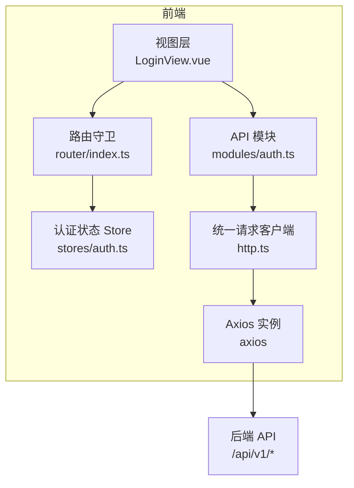
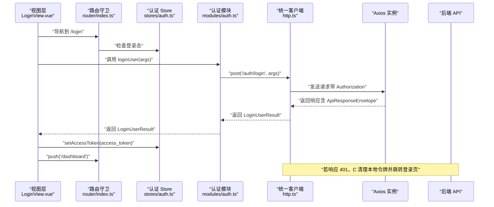
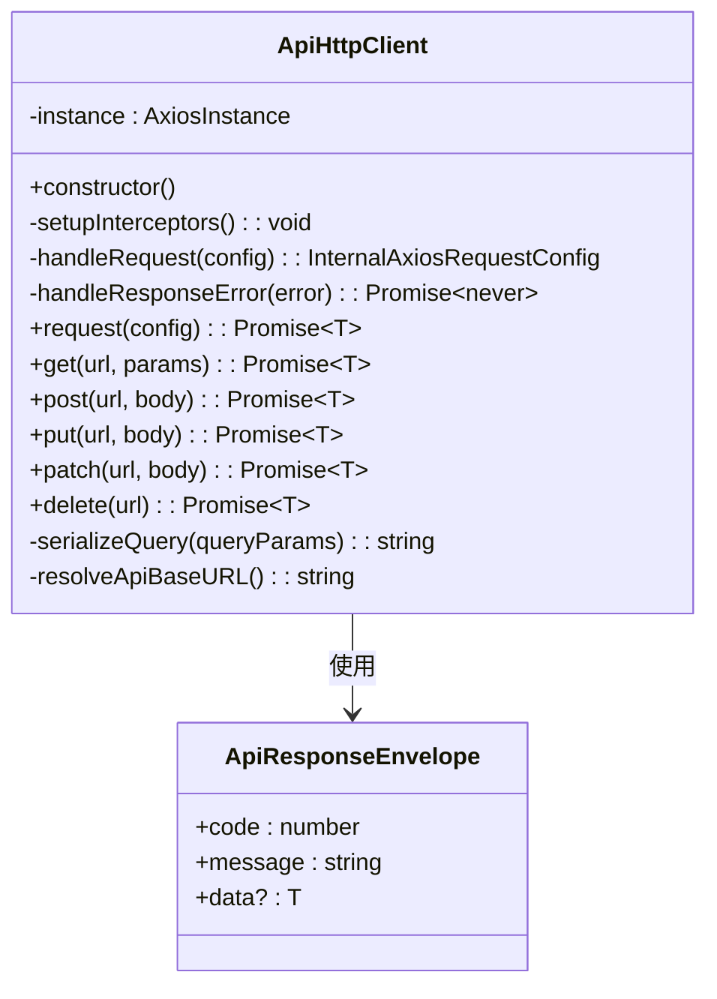
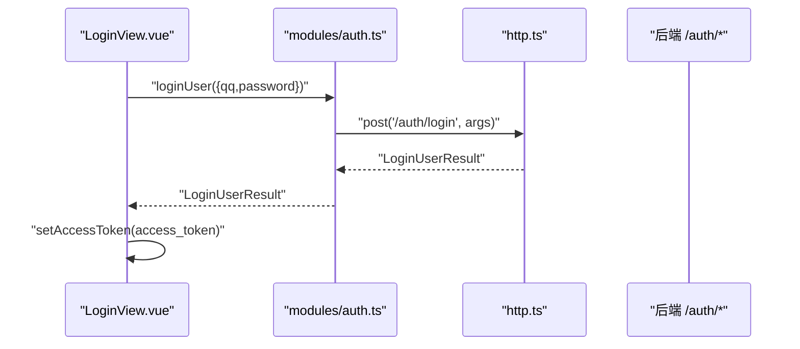
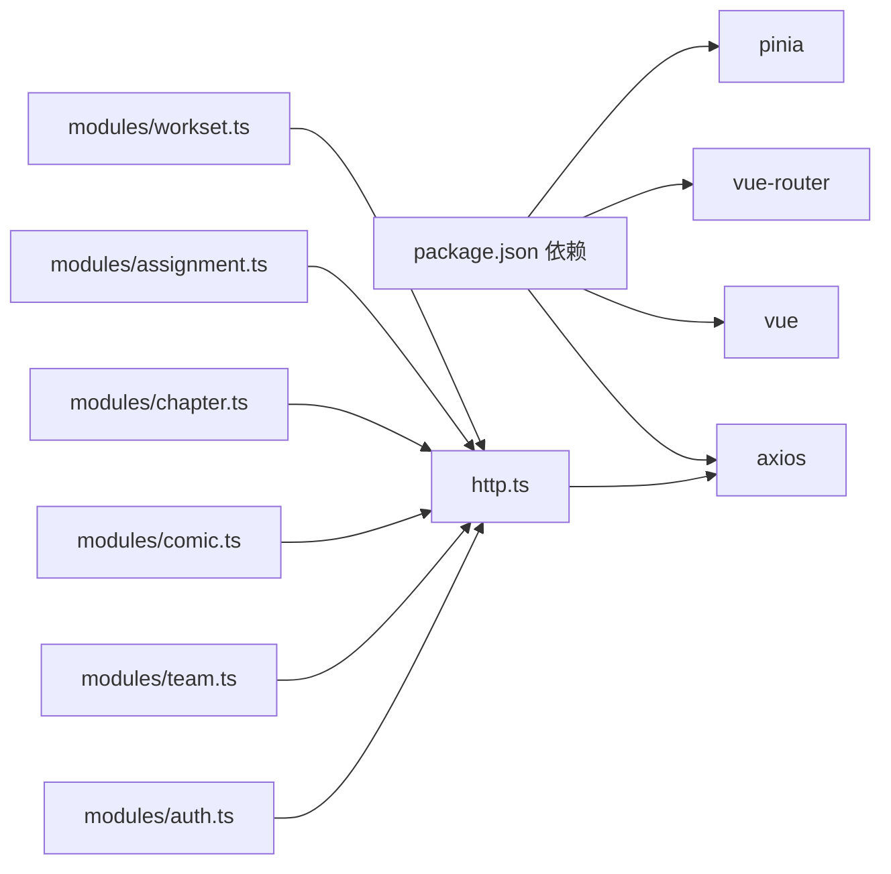

# API 客户端

<cite>
**本文引用的文件**
- [frontend/src/api/http.ts](file://frontend/src/api/http.ts)
- [frontend/src/api/modules/index.ts](file://frontend/src/api/modules/index.ts)
- [frontend/src/api/modules/auth.ts](file://frontend/src/api/modules/auth.ts)
- [frontend/src/api/modules/team.ts](file://frontend/src/api/modules/team.ts)
- [frontend/src/api/modules/comic.ts](file://frontend/src/api/modules/comic.ts)
- [frontend/src/api/modules/chapter.ts](file://frontend/src/api/modules/chapter.ts)
- [frontend/src/api/modules/assignment.ts](file://frontend/src/api/modules/assignment.ts)
- [frontend/src/api/modules/workset.ts](file://frontend/src/api/modules/workset.ts)
- [frontend/src/stores/auth.ts](file://frontend/src/stores/auth.ts)
- [frontend/src/types/common.ts](file://frontend/src/types/common.ts)
- [frontend/src/types/domain.ts](file://frontend/src/types/domain.ts)
- [frontend/src/router/index.ts](file://frontend/src/router/index.ts)
- [frontend/src/views/LoginView.vue](file://frontend/src/views/LoginView.vue)
- [frontend/package.json](file://frontend/package.json)
</cite>

## 目录
1. [引言](#引言)
2. [项目结构](#项目结构)
3. [核心组件](#核心组件)
4. [架构总览](#架构总览)
5. [详细组件分析](#详细组件分析)
6. [依赖分析](#依赖分析)
7. [性能考虑](#性能考虑)
8. [故障排查指南](#故障排查指南)
9. [结论](#结论)
10. [附录](#附录)

## 引言
本文件面向 poprako-web-ms 前端工程的 API 客户端，系统性说明基于 Axios 的 HTTP 客户端封装、API 模块化设计与认证令牌管理。内容覆盖请求配置、响应拦截器、错误处理、模块化 API 设计（用户、团队、漫画、章节、分配、工作集）、调用示例、重试与超时策略建议、调试技巧与最佳实践，帮助开发者高效、稳定地与后端交互。

## 项目结构
前端 API 客户端采用"统一请求层 + 模块化 API 层"的分层设计：
- 统一请求层：集中处理 baseURL、超时、请求头注入、响应错误标准化与通用 HTTP 方法封装。
- 模块化 API 层：按领域拆分模块（认证、团队、漫画、章节、分配、工作集），每个模块暴露清晰的函数式接口与类型约束。
- 类型体系：通过 domain.ts 与 common.ts 提供领域模型与通用类型（分页、includes[] 查询、统一错误结构）。
- 认证状态：通过 Pinia Store 管理访问令牌与登录态，配合路由守卫实现登录态控制。
- 使用示例：LoginView.vue 展示了登录流程中如何调用 API 并更新认证状态。

图表来源
- [frontend/src/views/LoginView.vue:50-82](file://frontend/src/views/LoginView.vue#L50-L82)
- [frontend/src/router/index.ts:42-51](file://frontend/src/router/index.ts#L42-L51)
- [frontend/src/stores/auth.ts:15-49](file://frontend/src/stores/auth.ts#L15-L49)
- [frontend/src/api/modules/auth.ts:79-109](file://frontend/src/api/modules/auth.ts#L79-L109)
- [frontend/src/api/http.ts:27-33](file://frontend/src/api/http.ts#L27-L33)

章节来源
- [frontend/src/api/http.ts:1-196](file://frontend/src/api/http.ts#L1-L196)
- [frontend/src/api/modules/index.ts:1-10](file://frontend/src/api/modules/index.ts#L1-L10)
- [frontend/src/types/common.ts:1-41](file://frontend/src/types/common.ts#L1-L41)
- [frontend/src/types/domain.ts:1-89](file://frontend/src/types/domain.ts#L1-L89)
- [frontend/src/stores/auth.ts:1-52](file://frontend/src/stores/auth.ts#L1-L52)
- [frontend/src/router/index.ts:1-59](file://frontend/src/router/index.ts#L1-L59)
- [frontend/src/views/LoginView.vue:1-157](file://frontend/src/views/LoginView.vue#L1-L157)

## 核心组件
- 统一请求客户端（ApiHttpClient）
  - 负责创建 Axios 实例、安装请求/响应拦截器、统一请求入口与常用 HTTP 方法封装。
  - 请求拦截：自动从本地存储读取访问令牌并注入 Authorization 头。
  - 响应拦截：标准化错误消息，401 时清理本地令牌并跳转登录页。
  - 查询参数序列化：支持 includes[] 等数组查询参数格式。
  - **新增** 响应包装器：使用 ApiResponseEnvelope 统一包装后端响应，实现标准化的数据提取与错误处理。
  - **新增** 动态基础URL：支持通过 VITE_API_BASE_URL 环境变量动态配置 API 基础地址。
- API 模块（modules）
  - 每个模块聚焦一个领域资源，提供函数式 API 与明确的请求/响应类型。
  - 模块统一通过 httpClient 进行网络请求，保持一致的错误处理与认证行为。
- 类型体系（types）
  - common.ts：分页、includes[] 查询、统一错误结构。
  - domain.ts：用户、团队、工作集、漫画、章节、分配等核心领域模型。
- 认证状态（stores/auth.ts）
  - 维护访问令牌与登录态，提供设置与清除方法，供路由守卫与视图使用。
- 路由守卫（router/index.ts）
  - 在非登录路径且未登录时强制跳转登录页；在登录路径且已登录时跳转仪表盘。

章节来源
- [frontend/src/api/http.ts:14-196](file://frontend/src/api/http.ts#L14-L196)
- [frontend/src/api/modules/index.ts:1-10](file://frontend/src/api/modules/index.ts#L1-L10)
- [frontend/src/types/common.ts:1-41](file://frontend/src/types/common.ts#L1-L41)
- [frontend/src/types/domain.ts:1-89](file://frontend/src/types/domain.ts#L1-L89)
- [frontend/src/stores/auth.ts:15-52](file://frontend/src/stores/auth.ts#L15-L52)
- [frontend/src/router/index.ts:44-56](file://frontend/src/router/index.ts#L44-L56)

## 架构总览
下图展示了从前端视图到后端 API 的完整调用链路，以及认证与错误处理的关键节点。

图表来源
- [frontend/src/views/LoginView.vue:69-82](file://frontend/src/views/LoginView.vue#L69-L82)
- [frontend/src/router/index.ts:44-56](file://frontend/src/router/index.ts#L44-L56)
- [frontend/src/stores/auth.ts:31-42](file://frontend/src/stores/auth.ts#L31-L42)
- [frontend/src/api/modules/auth.ts:92-122](file://frontend/src/api/modules/auth.ts#L92-L122)
- [frontend/src/api/http.ts:102-112](file://frontend/src/api/http.ts#L102-L112)

## 详细组件分析

### 统一请求客户端（ApiHttpClient）
- 初始化与拦截器
  - 创建 Axios 实例，设置 baseURL 与超时。
  - 安装请求拦截器：自动注入 Authorization 头（若存在访问令牌）。
  - 安装响应拦截器：标准化错误消息；401 时清理本地令牌并跳转登录页。
- **新增** 响应包装器（ApiResponseEnvelope）
  - 统一响应结构：{ code, message, data? }，实现标准化的数据提取与错误处理。
  - 数据提取：当 code === 200 时返回 data 字段，否则抛出错误。
  - 兼容性：支持后端不同响应格式，确保前端统一处理逻辑。
- **新增** 动态基础URL解析
  - 优先使用 VITE_API_BASE_URL 环境变量配置。
  - 未配置时默认使用 "/api/v1"。
  - 支持开发、测试、生产环境的不同 API 地址配置。
- HTTP 方法封装
  - request：统一入口，返回响应数据。
  - get/post/put/patch/delete：对常见方法进行封装，支持查询参数序列化与请求体。
- 查询参数序列化
  - 支持 includes[] 等数组参数格式，兼容 Swagger 约定。
- 认证令牌管理
  - 通过请求拦截器自动附加令牌；响应拦截器处理 401 场景。

图表来源
- [frontend/src/api/http.ts:14-196](file://frontend/src/api/http.ts#L14-L196)

章节来源
- [frontend/src/api/http.ts:20-196](file://frontend/src/api/http.ts#L20-L196)

### 认证模块（auth）
- 接口职责
  - 登录：POST /auth/login，返回 access_token 与用户信息。
  - 注册：POST /auth/register，返回 access_token 与新用户信息。
  - 获取当前用户：GET /users/mine，返回用户信息。
- 类型约束
  - LoginUserArgs/LoginUserResult/RegisterUserArgs/RegisterUserResult 等类型与后端 Swagger 对齐。
- 使用示例
  - 视图层 LoginView.vue 展示了登录流程：调用 loginUser -> 更新认证 Store -> 跳转仪表盘。

图表来源
- [frontend/src/views/LoginView.vue:69-82](file://frontend/src/views/LoginView.vue#L69-L82)
- [frontend/src/api/modules/auth.ts:92-122](file://frontend/src/api/modules/auth.ts#L92-L122)
- [frontend/src/api/http.ts:129-135](file://frontend/src/api/http.ts#L129-L135)

章节来源
- [frontend/src/api/modules/auth.ts:1-143](file://frontend/src/api/modules/auth.ts#L1-L143)
- [frontend/src/views/LoginView.vue:50-82](file://frontend/src/views/LoginView.vue#L50-L82)

### 团队模块（team）
- 接口职责
  - 获取当前用户团队列表：GET /teams/mine。
  - 获取团队列表：GET /teams，支持分页查询。
  - 创建团队：POST /teams，返回团队信息。
- 类型约束
  - TeamListQuery 继承分页查询；TeamInfo 为领域模型。

章节来源
- [frontend/src/api/modules/team.ts:1-121](file://frontend/src/api/modules/team.ts#L1-L121)
- [frontend/src/types/common.ts:7-16](file://frontend/src/types/common.ts#L7-L16)
- [frontend/src/types/domain.ts:21-32](file://frontend/src/types/domain.ts#L21-L32)

### 漫画模块（comic）
- 接口职责
  - 获取漫画列表：GET /comics，需传入 workset_id。
  - 创建漫画：POST /comics，返回漫画信息。
- 类型约束
  - ComicListQuery 扩展分页查询并包含 workset_id；ComicInfo 为领域模型。

章节来源
- [frontend/src/api/modules/comic.ts:1-70](file://frontend/src/api/modules/comic.ts#L1-L70)
- [frontend/src/types/common.ts:7-16](file://frontend/src/types/common.ts#L7-L16)
- [frontend/src/types/domain.ts:51-60](file://frontend/src/types/domain.ts#L51-L60)

### 章节模块（chapter）
- 接口职责
  - 获取章节列表：GET /chapters，支持分页与 includes[]。
  - 创建章节：POST /chapters，返回章节信息。
- 类型约束
  - ChapterListQuery 同时继承分页与 includes 查询；ChapterInfo 为领域模型。

章节来源
- [frontend/src/api/modules/chapter.ts:1-72](file://frontend/src/api/modules/chapter.ts#L1-L72)
- [frontend/src/types/common.ts:7-26](file://frontend/src/types/common.ts#L7-L26)
- [frontend/src/types/domain.ts:65-74](file://frontend/src/types/domain.ts#L65-L74)

### 分配模块（assignment）
- 接口职责
  - 获取章节分配列表：GET /assignments，支持分页与 includes[]。
  - 获取我的分配列表：GET /assignments/mine，支持分页。
  - 创建分配：POST /assignments，返回分配信息。
- 类型约束
  - AssignmentListQuery 同时继承分页与 includes 查询；AssignmentInfo 为领域模型。

章节来源
- [frontend/src/api/modules/assignment.ts:1-101](file://frontend/src/api/modules/assignment.ts#L1-L101)
- [frontend/src/types/common.ts:7-26](file://frontend/src/types/common.ts#L7-L26)
- [frontend/src/types/domain.ts:79-88](file://frontend/src/types/domain.ts#L79-L88)

### 工作集模块（workset）
- 接口职责
  - 获取工作集列表：GET /worksets，需传入 team_id。
  - 创建工作集：POST /worksets，返回工作集信息。
- 类型约束
  - WorksetListQuery 扩展分页查询并包含 team_id；WorksetInfo 为领域模型。

章节来源
- [frontend/src/api/modules/workset.ts:1-72](file://frontend/src/api/modules/workset.ts#L1-L72)
- [frontend/src/types/common.ts:7-16](file://frontend/src/types/common.ts#L7-L16)
- [frontend/src/types/domain.ts:37-46](file://frontend/src/types/domain.ts#L37-L46)

### 统一导出入口（modules/index）
- 作用：提供单一导入入口，便于上层按需引入各模块 API。

章节来源
- [frontend/src/api/modules/index.ts:1-10](file://frontend/src/api/modules/index.ts#L1-L10)

## 依赖分析
- 外部依赖
  - axios：HTTP 客户端，提供请求/响应拦截器与超时控制。
  - vue 与 vue-router：视图与路由框架。
  - pinia：状态管理，用于认证状态。
- 内部依赖
  - http.ts 为所有模块的唯一网络出口，模块间低耦合，高内聚。
  - 类型文件 domain.ts 与 common.ts 为模块与视图共享契约。

图表来源
- [frontend/package.json:13-19](file://frontend/package.json#L13-L19)
- [frontend/src/api/http.ts:4-11](file://frontend/src/api/http.ts#L4-L11)
- [frontend/src/api/modules/index.ts:1-10](file://frontend/src/api/modules/index.ts#L1-L10)

章节来源
- [frontend/package.json:1-36](file://frontend/package.json#L1-L36)
- [frontend/src/api/http.ts:4-11](file://frontend/src/api/http.ts#L4-L11)
- [frontend/src/api/modules/index.ts:1-10](file://frontend/src/api/modules/index.ts#L1-L10)

## 性能考虑
- 超时与重试
  - 默认超时 15 秒，适用于大多数场景；对于长耗时操作（如上传、批量导出），可在调用侧根据需要调整或增加重试策略。
  - 建议：对幂等请求（GET/DELETE/PATCH）可考虑指数退避重试；对非幂等请求谨慎重试。
- 请求合并与缓存
  - 对频繁读取的列表接口（如 /teams、/comics、/chapters），可在视图层或 Store 层加入轻量缓存，避免重复请求。
- 网络抖动处理
  - 利用统一错误处理与路由守卫，确保 401 时能快速引导用户重新登录，减少无效重试。
- **新增** 动态基础URL优化
  - 通过环境变量配置 API 地址，支持多环境部署与测试隔离。
  - 减少硬编码，提高部署灵活性。

## 故障排查指南
- 401 未授权
  - 现象：出现未授权提示并跳转登录页。
  - 原因：响应拦截器检测到 401，清理本地令牌并跳转。
  - 处理：确认令牌是否过期或被撤销；重新登录获取新令牌。
- 网络超时
  - 现象：请求在 15 秒后失败。
  - 原因：默认超时设置；网络环境较差或后端处理较慢。
  - 处理：延长超时或优化后端性能；对长任务使用轮询或 WebSocket。
- 查询参数异常
  - 现象：includes[] 未生效或参数格式不正确。
  - 原因：未使用统一序列化。
  - 处理：使用模块提供的查询参数类型与 httpClient.get，确保 includes[] 正确序列化。
- 登录后仍提示未登录
  - 现象：登录成功但立即跳转登录页。
  - 原因：路由守卫检查未登录态。
  - 处理：确认登录成功后已调用 setAccessToken 并更新路由。
- **新增** 响应包装器相关问题
  - 现象：API 调用返回 undefined 或类型不匹配。
  - 原因：后端响应格式不符合 ApiResponseEnvelope 规范。
  - 处理：检查后端响应结构，确保包含 code、message 字段；data 字段在成功时存在。
- **新增** 动态基础URL问题
  - 现象：API 请求地址不正确或 404。
  - 原因：VITE_API_BASE_URL 环境变量配置错误。
  - 处理：检查 .env 文件中的 VITE_API_BASE_URL 配置；确认路径以 /api/v1 开头。

章节来源
- [frontend/src/api/http.ts:82-97](file://frontend/src/api/http.ts#L82-L97)
- [frontend/src/router/index.ts:44-56](file://frontend/src/router/index.ts#L44-L56)
- [frontend/src/stores/auth.ts:31-42](file://frontend/src/stores/auth.ts#L31-L42)

## 结论
本 API 客户端以统一请求层为核心，结合模块化 API 设计与完善的类型体系，实现了认证、错误处理与请求规范化的统一。通过 Pinia Store 与路由守卫保障登录态一致性，配合清晰的模块边界与类型约束，开发者可以高效、安全地扩展新的业务接口。

**新增功能总结**：
- 统一响应包装器：实现标准化的数据提取与错误处理，提升前后端协作效率。
- 动态基础URL解析：支持环境变量配置，增强部署灵活性与多环境支持能力。

## 附录

### API 调用示例（步骤说明）
- 登录流程
  - 步骤：填写账号密码 -> 调用 loginUser -> 成功后 setAccessToken -> 跳转仪表盘。
  - 参考：[frontend/src/views/LoginView.vue:69-82](file://frontend/src/views/LoginView.vue#L69-L82)
- 获取当前用户团队列表
  - 步骤：调用 getMyTeams -> 渲染团队列表。
  - 参考：[frontend/src/api/modules/team.ts:68-79](file://frontend/src/api/modules/team.ts#L68-L79)
- 获取漫画列表
  - 步骤：构造 ComicListQuery（包含 workset_id 与分页）-> 调用 getComicList。
  - 参考：[frontend/src/api/modules/comic.ts:51-55](file://frontend/src/api/modules/comic.ts#L51-L55)
- 创建章节
  - 步骤：准备 CreateChapterArgs -> 调用 createChapter -> 成功后刷新列表。
  - 参考：[frontend/src/api/modules/chapter.ts:64-71](file://frontend/src/api/modules/chapter.ts#L64-L71)

### 调试技巧
- 开启浏览器网络面板，观察 Authorization 头是否正确注入。
- 在统一错误处理处打点，记录错误码与消息，辅助定位问题。
- 使用 Vue DevTools 检查 Pinia 中的访问令牌状态与 isLoggedIn。
- 对于 includes[] 查询，确认序列化后的 URL 参数格式是否符合后端预期。
- **新增** 检查响应包装器：确认后端响应包含 code、message 字段，data 字段在成功时存在。
- **新增** 验证基础URL配置：检查 VITE_API_BASE_URL 环境变量是否正确设置，确保 API 请求路径正确。