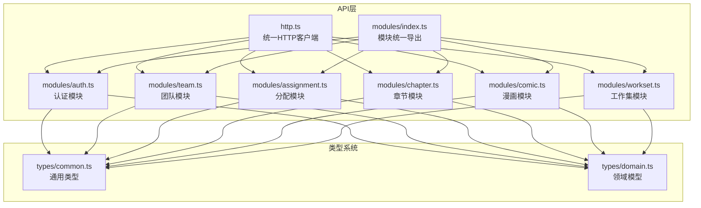
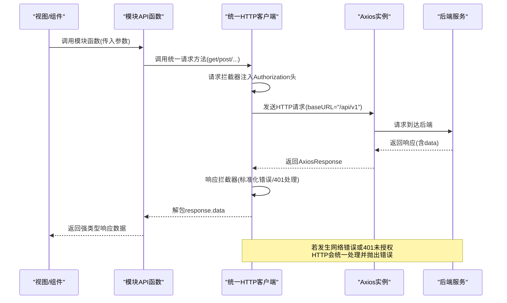
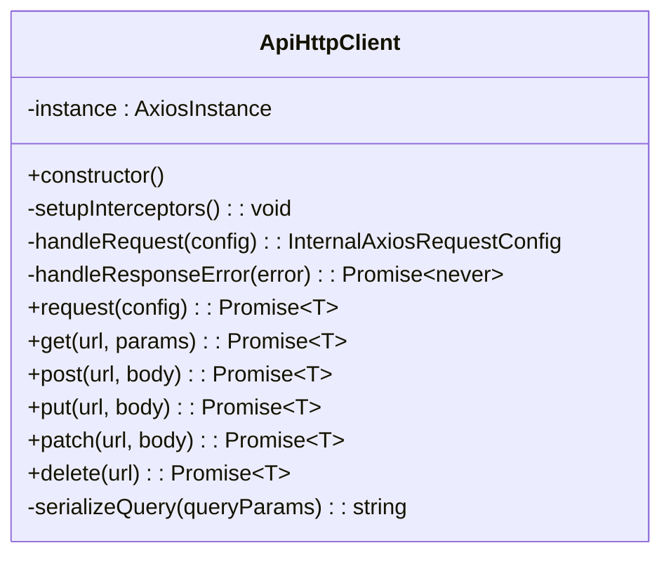
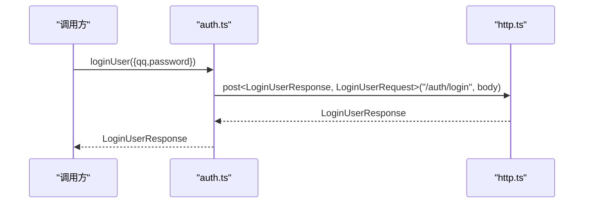
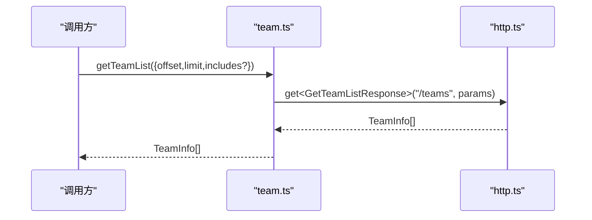
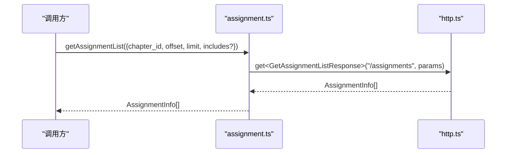
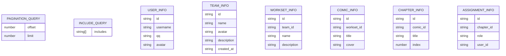
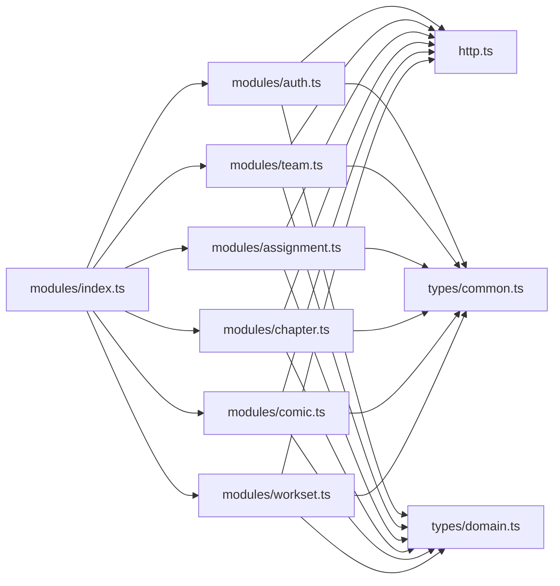

# API客户端

<cite>
**本文引用的文件**
- [http.ts](file://frontend/src/api/http.ts)
- [index.ts](file://frontend/src/api/modules/index.ts)
- [auth.ts](file://frontend/src/api/modules/auth.ts)
- [team.ts](file://frontend/src/api/modules/team.ts)
- [assignment.ts](file://frontend/src/api/modules/assignment.ts)
- [chapter.ts](file://frontend/src/api/modules/chapter.ts)
- [comic.ts](file://frontend/src/api/modules/comic.ts)
- [workset.ts](file://frontend/src/api/modules/workset.ts)
- [common.ts](file://frontend/src/types/common.ts)
- [domain.ts](file://frontend/src/types/domain.ts)
</cite>

## 目录
1. [引言](#引言)
2. [项目结构](#项目结构)
3. [核心组件](#核心组件)
4. [架构总览](#架构总览)
5. [详细组件分析](#详细组件分析)
6. [依赖关系分析](#依赖关系分析)
7. [性能考量](#性能考量)
8. [故障排查指南](#故障排查指南)
9. [结论](#结论)
10. [附录](#附录)

## 引言
本文件系统性梳理前端API客户端的设计与实现，重点覆盖以下方面：
- Axios实例的配置、请求与响应拦截器策略
- 按功能模块化的API设计（auth、team、assignment、chapter、comic、workset）
- 统一请求方法封装与类型安全
- 错误处理机制与认证token自动注入
- 查询参数序列化、响应数据解包与类型转换
- API版本管理策略与最佳实践
- 请求重试、超时处理与性能优化建议
- 完整的数据获取与状态更新流程

## 项目结构
前端API层采用“统一HTTP客户端 + 功能模块API”的分层设计：
- 统一HTTP客户端：集中处理Axios实例、拦截器、通用请求方法与错误处理
- 功能模块API：按领域模型拆分，每个模块导出与后端接口一一对应的函数，并声明严格的输入输出类型
- 类型系统：在types目录下定义通用类型与领域模型类型，确保请求参数与响应数据的类型安全

图表来源
- [http.ts:1-174](file://frontend/src/api/http.ts#L1-L174)
- [index.ts:1-10](file://frontend/src/api/modules/index.ts#L1-L10)
- [auth.ts:1-110](file://frontend/src/api/modules/auth.ts#L1-L110)
- [team.ts:1-81](file://frontend/src/api/modules/team.ts#L1-L81)
- [assignment.ts:1-99](file://frontend/src/api/modules/assignment.ts#L1-L99)
- [chapter.ts:1-72](file://frontend/src/api/modules/chapter.ts#L1-L72)
- [comic.ts:1-70](file://frontend/src/api/modules/comic.ts#L1-L70)
- [workset.ts:1-72](file://frontend/src/api/modules/workset.ts#L1-L72)
- [common.ts:1-41](file://frontend/src/types/common.ts#L1-L41)
- [domain.ts:1-89](file://frontend/src/types/domain.ts#L1-L89)

章节来源
- [http.ts:1-174](file://frontend/src/api/http.ts#L1-L174)
- [index.ts:1-10](file://frontend/src/api/modules/index.ts#L1-L10)

## 核心组件
- 统一HTTP客户端
  - Axios实例：基础URL指向“/api/v1”，默认超时15秒
  - 请求拦截器：自动从localStorage读取访问令牌并注入到Authorization头
  - 响应拦截器：标准化错误消息；对401未授权进行登出清理并跳转登录页
  - 统一请求入口与HTTP方法封装：request/get/post/put/patch/delete
  - 查询参数序列化：兼容includes[]数组格式与undefined/null过滤
- 功能模块API
  - 每个模块以领域命名，导出与后端接口一一对应的函数
  - 明确输入参数类型与返回值类型，使用httpClient完成实际请求
  - 通过types目录的通用类型与领域模型类型保证类型安全

章节来源
- [http.ts:27-33](file://frontend/src/api/http.ts#L27-L33)
- [http.ts:38-46](file://frontend/src/api/http.ts#L38-L46)
- [http.ts:51-62](file://frontend/src/api/http.ts#L51-L62)
- [http.ts:67-82](file://frontend/src/api/http.ts#L67-L82)
- [http.ts:87-167](file://frontend/src/api/http.ts#L87-L167)
- [auth.ts:79-109](file://frontend/src/api/modules/auth.ts#L79-L109)
- [team.ts:53-80](file://frontend/src/api/modules/team.ts#L53-L80)
- [assignment.ts:63-98](file://frontend/src/api/modules/assignment.ts#L63-L98)
- [chapter.ts:53-71](file://frontend/src/api/modules/chapter.ts#L53-L71)
- [comic.ts:51-69](file://frontend/src/api/modules/comic.ts#L51-L69)
- [workset.ts:53-71](file://frontend/src/api/modules/workset.ts#L53-L71)

## 架构总览
下图展示了从视图层到后端服务的完整调用链路，以及错误处理与认证流程的关键节点。

图表来源
- [http.ts:38-46](file://frontend/src/api/http.ts#L38-L46)
- [http.ts:51-62](file://frontend/src/api/http.ts#L51-L62)
- [http.ts:67-82](file://frontend/src/api/http.ts#L67-L82)
- [http.ts:87-90](file://frontend/src/api/http.ts#L87-L90)
- [auth.ts:79-109](file://frontend/src/api/modules/auth.ts#L79-L109)

## 详细组件分析

### 统一HTTP客户端（http.ts）
- Axios实例配置
  - 基础URL：/api/v1，便于未来版本迁移与多版本共存
  - 默认超时：15秒，避免请求悬挂
- 拦截器策略
  - 请求拦截器：从localStorage读取access_token，若存在则注入到Authorization头
  - 响应拦截器：提取状态码与错误消息，401时清除本地token并跳转登录页
- 统一请求方法
  - request：通用入口，返回response.data
  - get/post/put/patch/delete：封装常用HTTP动词，支持泛型约束返回类型
- 查询参数序列化
  - 支持includes[]数组格式，兼容后端Swagger风格
  - 过滤undefined与null，避免无效查询参数

图表来源
- [http.ts:18-168](file://frontend/src/api/http.ts#L18-L168)

章节来源
- [http.ts:27-33](file://frontend/src/api/http.ts#L27-L33)
- [http.ts:38-46](file://frontend/src/api/http.ts#L38-L46)
- [http.ts:51-62](file://frontend/src/api/http.ts#L51-L62)
- [http.ts:67-82](file://frontend/src/api/http.ts#L67-L82)
- [http.ts:87-167](file://frontend/src/api/http.ts#L87-L167)

### 认证模块（modules/auth.ts）
- 输入输出类型
  - 登录/注册参数与结果均声明明确类型，与后端Swagger结构对应
  - 当前用户信息类型来自领域模型
- 接口映射
  - 登录：POST /auth/login
  - 注册：POST /auth/register
  - 获取当前用户：GET /users/mine
- 类型安全
  - 所有函数均使用httpClient的get/post泛型，确保返回值类型正确

图表来源
- [auth.ts:79-109](file://frontend/src/api/modules/auth.ts#L79-L109)
- [http.ts:107-113](file://frontend/src/api/http.ts#L107-L113)

章节来源
- [auth.ts:1-110](file://frontend/src/api/modules/auth.ts#L1-L110)

### 团队模块（modules/team.ts）
- 查询参数
  - 使用PaginationQuery进行分页
- 接口映射
  - 获取当前用户团队列表：GET /teams/mine
  - 获取团队列表：GET /teams
  - 创建团队：POST /teams
- 类型安全
  - 请求参数与响应类型均明确标注

图表来源
- [team.ts:62-66](file://frontend/src/api/modules/team.ts#L62-L66)
- [http.ts:95-102](file://frontend/src/api/http.ts#L95-L102)

章节来源
- [team.ts:1-81](file://frontend/src/api/modules/team.ts#L1-L81)

### 分配模块（modules/assignment.ts）
- 查询参数
  - AssignmentListQuery组合PaginationQuery与IncludeQuery，并限定chapter_id必填
- 接口映射
  - 获取分配列表：GET /assignments
  - 获取我的分配：GET /assignments/mine
  - 创建分配：POST /assignments
- 类型安全
  - 所有函数返回类型均为AssignmentInfo[]或单个AssignmentInfo

图表来源
- [assignment.ts:63-70](file://frontend/src/api/modules/assignment.ts#L63-L70)
- [http.ts:95-102](file://frontend/src/api/http.ts#L95-L102)

章节来源
- [assignment.ts:1-99](file://frontend/src/api/modules/assignment.ts#L1-L99)

### 章节模块（modules/chapter.ts）
- 查询参数
  - ChapterListQuery组合PaginationQuery与IncludeQuery，并限定comic_id必填
- 接口映射
  - 获取章节列表：GET /chapters
  - 创建章节：POST /chapters
- 类型安全
  - 返回类型为ChapterInfo[]或单个ChapterInfo

章节来源
- [chapter.ts:1-72](file://frontend/src/api/modules/chapter.ts#L1-L72)

### 漫画模块（modules/comic.ts）
- 查询参数
  - ComicListQuery继承PaginationQuery，并限定workset_id必填
- 接口映射
  - 获取漫画列表：GET /comics
  - 创建漫画：POST /comics
- 类型安全
  - 返回类型为ComicInfo[]或单个ComicInfo

章节来源
- [comic.ts:1-70](file://frontend/src/api/modules/comic.ts#L1-L70)

### 工作集模块（modules/workset.ts）
- 查询参数
  - WorksetListQuery继承PaginationQuery，并限定team_id必填
- 接口映射
  - 获取工作集列表：GET /worksets
  - 创建工作集：POST /worksets
- 类型安全
  - 返回类型为WorksetInfo[]或单个WorksetInfo

章节来源
- [workset.ts:1-72](file://frontend/src/api/modules/workset.ts#L1-L72)

### 类型系统（types）
- 通用类型
  - PaginationQuery：offset与limit
  - IncludeQuery：includes数组
  - ApiErrorPayload：统一错误结构（code可选，message必填）
- 领域模型
  - UserInfo、TeamInfo、WorksetInfo、ComicInfo、ChapterInfo、AssignmentInfo
  - 所有类型与后端Swagger结构保持一致，便于跨模块复用

图表来源
- [common.ts:7-26](file://frontend/src/types/common.ts#L7-L26)
- [common.ts:31-40](file://frontend/src/types/common.ts#L31-L40)
- [domain.ts:7-16](file://frontend/src/types/domain.ts#L7-L16)
- [domain.ts:21-32](file://frontend/src/types/domain.ts#L21-L32)
- [domain.ts:37-46](file://frontend/src/types/domain.ts#L37-L46)
- [domain.ts:51-60](file://frontend/src/types/domain.ts#L51-L60)
- [domain.ts:65-74](file://frontend/src/types/domain.ts#L65-L74)
- [domain.ts:79-88](file://frontend/src/types/domain.ts#L79-L88)

章节来源
- [common.ts:1-41](file://frontend/src/types/common.ts#L1-L41)
- [domain.ts:1-89](file://frontend/src/types/domain.ts#L1-L89)

## 依赖关系分析
- 模块导出
  - modules/index.ts统一导出各模块，便于上层按需引入
- 模块内部依赖
  - 各模块均依赖http.ts中的httpClient
  - 各模块依赖types目录下的通用类型与领域模型
- 类型依赖
  - 通用类型与领域模型被多个模块复用，形成稳定的类型契约

图表来源
- [index.ts:1-10](file://frontend/src/api/modules/index.ts#L1-L10)
- [auth.ts:4](file://frontend/src/api/modules/auth.ts#L4)
- [team.ts:4](file://frontend/src/api/modules/team.ts#L4)
- [assignment.ts:4](file://frontend/src/api/modules/assignment.ts#L4)
- [chapter.ts:4](file://frontend/src/api/modules/chapter.ts#L4)
- [comic.ts:4](file://frontend/src/api/modules/comic.ts#L4)
- [workset.ts:4](file://frontend/src/api/modules/workset.ts#L4)

章节来源
- [index.ts:1-10](file://frontend/src/api/modules/index.ts#L1-L10)

## 性能考量
- 超时控制
  - Axios默认超时15秒，避免长时间阻塞UI线程
- 查询参数序列化
  - 仅传递有效参数，减少无效请求负载
- 请求头注入
  - 仅在存在token时添加Authorization头，避免不必要的头部开销
- 并发与缓存
  - 建议在视图层或状态管理层实现请求去重与结果缓存，降低重复请求频率
- 错误快速失败
  - 对4xx/5xx错误快速拒绝，避免后续处理链浪费资源

## 故障排查指南
- 401未授权
  - 现象：收到401后自动清除本地token并跳转登录页
  - 处理：检查后端签发的token是否过期或被撤销；确认localStorage中access_token是否正确
- 网络错误
  - 现象：Promise.reject(new Error(message))，message来自后端data.message或axios错误信息
  - 处理：检查网络连通性、代理与CORS配置；确认后端服务可用
- 参数类型不匹配
  - 现象：编译时报错或运行时类型断言失败
  - 处理：对照types/common.ts与types/domain.ts修正参数类型；确保模块函数签名与后端接口一致
- 查询参数异常
  - 现象：includes[]未生效或出现undefined/null
  - 处理：使用模块提供的查询参数类型，避免手动拼接；确认序列化逻辑已过滤无效值

章节来源
- [http.ts:67-82](file://frontend/src/api/http.ts#L67-L82)
- [http.ts:150-167](file://frontend/src/api/http.ts#L150-L167)

## 结论
本API客户端通过统一HTTP客户端与模块化API设计，实现了：
- 明确的认证与错误处理策略
- 严格的类型安全与清晰的接口契约
- 可扩展的功能模块与稳定的类型系统
- 良好的可维护性与可测试性

建议在后续迭代中持续完善：
- 在http.ts中增加可配置的重试策略与指数退避
- 在模块层增加请求去重与结果缓存
- 为关键接口补充单元测试与集成测试

## 附录
- API版本管理策略
  - 基于baseURL的版本隔离（/api/v1），便于平滑升级与灰度发布
- 最佳实践清单
  - 统一使用模块函数而非直接调用httpClient
  - 明确区分查询参数与请求体，避免混用
  - 在视图层捕获错误并提供友好的用户提示
  - 对高频接口实施缓存与去重策略