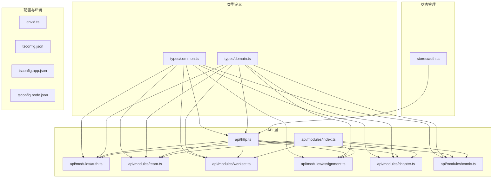
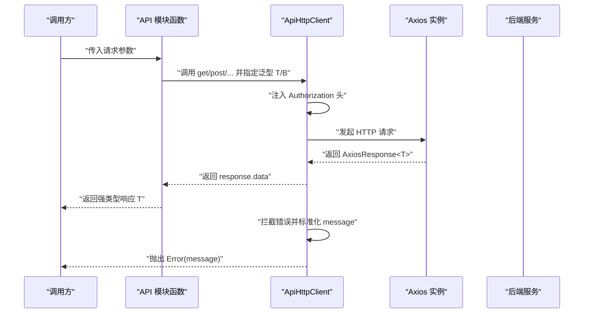
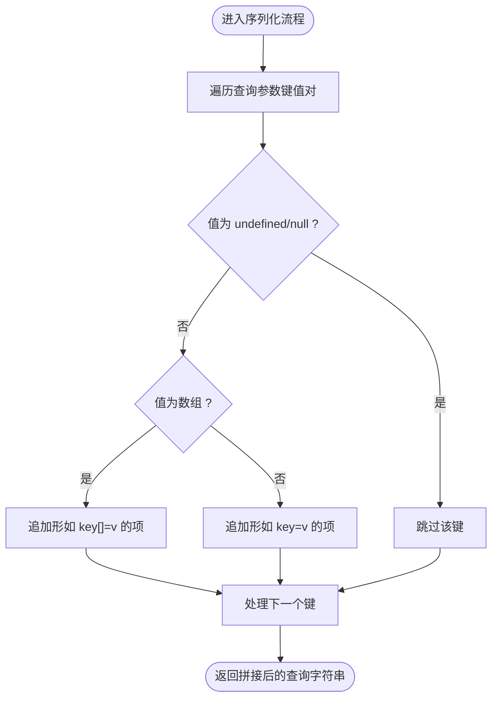
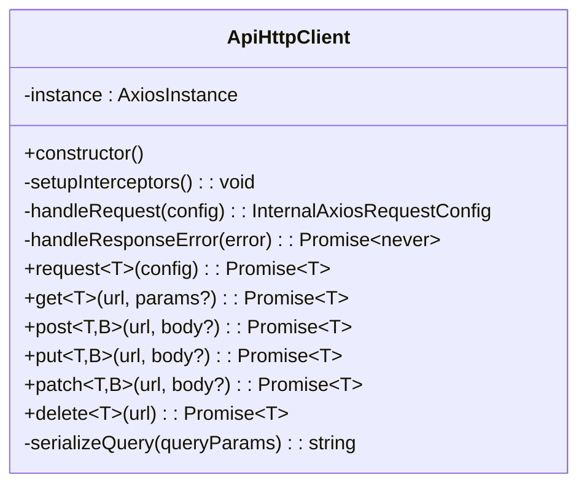
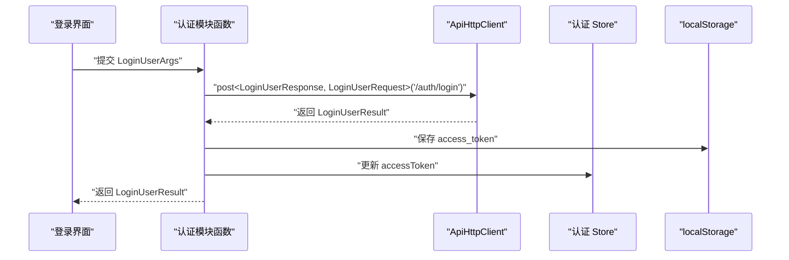
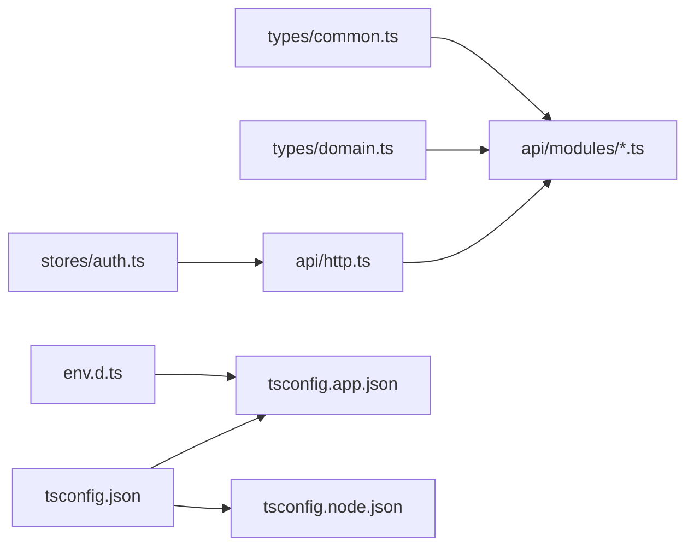

# TypeScript 类型定义

<cite>
**本文引用的文件**
- [common.ts](file://frontend/src/types/common.ts)
- [domain.ts](file://frontend/src/types/domain.ts)
- [http.ts](file://frontend/src/api/http.ts)
- [auth.ts](file://frontend/src/api/modules/auth.ts)
- [team.ts](file://frontend/src/api/modules/team.ts)
- [workset.ts](file://frontend/src/api/modules/workset.ts)
- [assignment.ts](file://frontend/src/api/modules/assignment.ts)
- [chapter.ts](file://frontend/src/api/modules/chapter.ts)
- [comic.ts](file://frontend/src/api/modules/comic.ts)
- [index.ts](file://frontend/src/api/modules/index.ts)
- [auth-store.ts](file://frontend/src/stores/auth.ts)
- [env.d.ts](file://frontend/src/env.d.ts)
- [tsconfig.json](file://frontend/tsconfig.json)
- [tsconfig.app.json](file://frontend/tsconfig.app.json)
- [tsconfig.node.json](file://frontend/tsconfig.node.json)
</cite>

## 目录
1. [引言](#引言)
2. [项目结构](#项目结构)
3. [核心组件](#核心组件)
4. [架构总览](#架构总览)
5. [详细组件分析](#详细组件分析)
6. [依赖分析](#依赖分析)
7. [性能考虑](#性能考虑)
8. [故障排查指南](#故障排查指南)
9. [结论](#结论)
10. [附录](#附录)

## 引言
本文件面向 poprako-web-ms 前端 TypeScript 类型系统，系统性梳理通用类型、领域模型类型与 API 响应类型的定义与设计原则，总结类型安全检查、接口约束与类型推导的最佳实践，并给出类型设计指南与维护建议，帮助开发者编写更健壮、可维护的 TypeScript 代码。

## 项目结构
前端类型定义主要分布在以下位置：
- 通用类型：frontend/src/types/common.ts
- 领域模型类型：frontend/src/types/domain.ts
- API 请求封装：frontend/src/api/http.ts
- 各模块 API 类型与实现：frontend/src/api/modules/*.ts
- 全局认证状态：frontend/src/stores/auth.ts
- 环境类型声明：frontend/src/env.d.ts
- TypeScript 编译配置：frontend/tsconfig*.json

图表来源
- [common.ts:1-41](file://frontend/src/types/common.ts#L1-L41)
- [domain.ts:1-89](file://frontend/src/types/domain.ts#L1-L89)
- [http.ts:1-174](file://frontend/src/api/http.ts#L1-L174)
- [auth.ts:1-110](file://frontend/src/api/modules/auth.ts#L1-L110)
- [team.ts:1-81](file://frontend/src/api/modules/team.ts#L1-L81)
- [workset.ts:1-72](file://frontend/src/api/modules/workset.ts#L1-L72)
- [assignment.ts:1-99](file://frontend/src/api/modules/assignment.ts#L1-L99)
- [chapter.ts:1-72](file://frontend/src/api/modules/chapter.ts#L1-L72)
- [comic.ts:1-70](file://frontend/src/api/modules/comic.ts#L1-L70)
- [index.ts:1-10](file://frontend/src/api/modules/index.ts#L1-L10)
- [auth-store.ts:1-51](file://frontend/src/stores/auth.ts#L1-L51)
- [env.d.ts:1-5](file://frontend/src/env.d.ts#L1-L5)
- [tsconfig.json:1-12](file://frontend/tsconfig.json#L1-L12)
- [tsconfig.app.json:1-9](file://frontend/tsconfig.app.json#L1-L9)
- [tsconfig.node.json:1-20](file://frontend/tsconfig.node.json#L1-L20)

章节来源
- [common.ts:1-41](file://frontend/src/types/common.ts#L1-L41)
- [domain.ts:1-89](file://frontend/src/types/domain.ts#L1-L89)
- [http.ts:1-174](file://frontend/src/api/http.ts#L1-L174)
- [auth.ts:1-110](file://frontend/src/api/modules/auth.ts#L1-L110)
- [team.ts:1-81](file://frontend/src/api/modules/team.ts#L1-L81)
- [workset.ts:1-72](file://frontend/src/api/modules/workset.ts#L1-L72)
- [assignment.ts:1-99](file://frontend/src/api/modules/assignment.ts#L1-L99)
- [chapter.ts:1-72](file://frontend/src/api/modules/chapter.ts#L1-L72)
- [comic.ts:1-70](file://frontend/src/api/modules/comic.ts#L1-L70)
- [index.ts:1-10](file://frontend/src/api/modules/index.ts#L1-L10)
- [auth-store.ts:1-51](file://frontend/src/stores/auth.ts#L1-L51)
- [env.d.ts:1-5](file://frontend/src/env.d.ts#L1-L5)
- [tsconfig.json:1-12](file://frontend/tsconfig.json#L1-L12)
- [tsconfig.app.json:1-9](file://frontend/tsconfig.app.json#L1-L9)
- [tsconfig.node.json:1-20](file://frontend/tsconfig.node.json#L1-L20)

## 核心组件
本节聚焦类型系统的三大支柱：通用类型、领域模型类型与 API 响应类型。

- 通用类型
  - 分页查询参数：用于统一 offset/limit 的分页约定，便于各模块复用。
  - 包含查询参数：用于 Swagger 中 includes[] 的数组查询参数序列化。
  - 统一错误结构：承载后端返回的 code/message，便于前端统一处理与展示。

- 领域模型类型
  - 用户信息、团队信息、工作集信息、漫画信息、章节信息、分配信息等，均与后端 Swagger 领域对象一一对应，确保前后端契约一致。

- API 响应类型
  - 每个模块的请求/响应类型清晰分离，通过 httpClient 的泛型方法进行强类型约束，避免运行期类型不匹配。

章节来源
- [common.ts:1-41](file://frontend/src/types/common.ts#L1-L41)
- [domain.ts:1-89](file://frontend/src/types/domain.ts#L1-L89)
- [http.ts:87-173](file://frontend/src/api/http.ts#L87-L173)

## 架构总览
下图展示了类型系统在请求链路中的作用：模块 API 将请求参数与响应类型传递给 httpClient，httpClient 在运行时对响应数据进行解包与错误处理，同时利用 TypeScript 泛型确保编译期类型安全。

图表来源
- [http.ts:38-82](file://frontend/src/api/http.ts#L38-L82)
- [auth.ts:79-109](file://frontend/src/api/modules/auth.ts#L79-L109)
- [team.ts:53-80](file://frontend/src/api/modules/team.ts#L53-L80)
- [workset.ts:53-71](file://frontend/src/api/modules/workset.ts#L53-L71)
- [assignment.ts:63-98](file://frontend/src/api/modules/assignment.ts#L63-L98)
- [chapter.ts:53-71](file://frontend/src/api/modules/chapter.ts#L53-L71)
- [comic.ts:51-69](file://frontend/src/api/modules/comic.ts#L51-L69)

## 详细组件分析

### 通用类型与查询参数
- 设计要点
  - 通过组合接口实现“可复用”的查询参数，如 AssignmentListQuery 组合了分页与包含查询。
  - includes[] 的序列化遵循 Swagger 约定，保证与后端解析一致。
- 推荐实践
  - 对于可选字段使用可选属性，避免强制传参。
  - 使用类型别名简化重复定义，如 GetMyTeamsResponse = TeamInfo[]。

图表来源
- [http.ts:150-167](file://frontend/src/api/http.ts#L150-L167)

章节来源
- [common.ts:7-26](file://frontend/src/types/common.ts#L7-L26)
- [assignment.ts:11-14](file://frontend/src/api/modules/assignment.ts#L11-L14)
- [chapter.ts:11-14](file://frontend/src/api/modules/chapter.ts#L11-L14)
- [workset.ts:11-14](file://frontend/src/api/modules/workset.ts#L11-L14)
- [team.ts:11-11](file://frontend/src/api/modules/team.ts#L11-L11)
- [http.ts:150-167](file://frontend/src/api/http.ts#L150-L167)

### 领域模型类型
- 设计要点
  - 字段命名与后端 Swagger 保持一致，便于对接与维护。
  - 可选字段明确标注，体现后端可空语义。
- 推荐实践
  - 优先使用只读与字面量联合类型表达枚举值（如角色），减少运行期错误。
  - 对时间戳字段统一使用字符串类型，避免时区与解析差异。

章节来源
- [domain.ts:7-88](file://frontend/src/types/domain.ts#L7-L88)

### API 请求封装与类型安全
- 设计要点
  - ApiHttpClient 以单例形式提供统一请求入口，内置请求头注入与错误拦截。
  - request/get/post/put/patch/delete 均支持泛型 T（响应类型）与 B（请求体类型），确保编译期类型约束。
  - handleResponseError 标准化错误 message，并在 401 时清理本地 token 并重定向登录页。
- 推荐实践
  - 在模块函数中显式指定泛型参数，避免默认推导导致的宽泛类型。
  - 对复杂查询参数使用组合接口，减少重复定义。

图表来源
- [http.ts:18-173](file://frontend/src/api/http.ts#L18-L173)

章节来源
- [http.ts:18-173](file://frontend/src/api/http.ts#L18-L173)

### 认证模块类型与流程
- 设计要点
  - LoginUserArgs/RegisterUserArgs 与后端 Swagger 参数一致，便于对接。
  - LoginUserResult/RegisterUserResult 明确 access_token 与用户信息结构。
  - 模块函数 loginUser/registerUser/getCurrentUserProfile 显式声明请求/响应类型。
- 推荐实践
  - 在调用登录成功后，将 access_token 写入本地存储，并更新全局认证状态。
  - 对于需要鉴权的请求，确保 httpClient 已注入 Authorization 头。

图表来源
- [auth.ts:79-109](file://frontend/src/api/modules/auth.ts#L79-L109)
- [http.ts:51-62](file://frontend/src/api/http.ts#L51-L62)
- [auth-store.ts:15-49](file://frontend/src/stores/auth.ts#L15-L49)

章节来源
- [auth.ts:10-72](file://frontend/src/api/modules/auth.ts#L10-L72)
- [auth.ts:79-109](file://frontend/src/api/modules/auth.ts#L79-L109)
- [auth-store.ts:15-49](file://frontend/src/stores/auth.ts#L15-L49)
- [http.ts:51-62](file://frontend/src/api/http.ts#L51-L62)

### 团队、工作集、漫画、章节与分配模块
- 设计要点
  - 各模块均采用“查询参数接口 + 请求/响应类型别名”的模式，保持一致性。
  - AssignmentListQuery/ChapterListQuery 通过组合接口引入 includes 支持。
  - CreateXxxArgs 与后端 Swagger 参数一致，CreateXxxResponse 为单个实体类型。
- 推荐实践
  - 列表查询优先使用组合接口，减少重复字段。
  - 对于分页与包含查询，统一通过序列化器处理，避免手写字符串。

章节来源
- [team.ts:11-46](file://frontend/src/api/modules/team.ts#L11-L46)
- [team.ts:53-80](file://frontend/src/api/modules/team.ts#L53-L80)
- [workset.ts:11-46](file://frontend/src/api/modules/workset.ts#L11-L46)
- [workset.ts:53-71](file://frontend/src/api/modules/workset.ts#L53-L71)
- [assignment.ts:11-56](file://frontend/src/api/modules/assignment.ts#L11-L56)
- [assignment.ts:63-98](file://frontend/src/api/modules/assignment.ts#L63-L98)
- [chapter.ts:11-46](file://frontend/src/api/modules/chapter.ts#L11-L46)
- [chapter.ts:53-71](file://frontend/src/api/modules/chapter.ts#L53-L71)
- [comic.ts:11-44](file://frontend/src/api/modules/comic.ts#L11-L44)
- [comic.ts:51-69](file://frontend/src/api/modules/comic.ts#L51-L69)

### 模块聚合导出
- 设计要点
  - modules/index.ts 统一导出各模块，便于上层按需导入。
- 推荐实践
  - 上层组件仅通过 index.ts 导入，避免直接引用具体模块路径，降低耦合。

章节来源
- [index.ts:1-10](file://frontend/src/api/modules/index.ts#L1-L10)

### 全局认证状态 Store
- 设计要点
  - 使用 Pinia defineStore 管理 accessToken 与登录态，自动同步至 localStorage。
  - 提供 setAccessToken/clearAccessToken 以配合登录/登出流程。
- 推荐实践
  - 在路由守卫中读取 isLoggedIn 进行权限控制。
  - 在 httpClient 请求拦截器中读取本地 token，确保全局一致性。

章节来源
- [auth-store.ts:15-49](file://frontend/src/stores/auth.ts#L15-L49)
- [http.ts:51-62](file://frontend/src/api/http.ts#L51-L62)

## 依赖分析
- 类型依赖
  - 所有模块 API 类型依赖 common.ts 与 domain.ts，形成稳定的契约层。
- 运行时依赖
  - 模块函数依赖 httpClient 单例，统一处理鉴权与错误。
  - 认证 Store 与 httpClient 协同，保证访问令牌的一致性。
- 配置依赖
  - tsconfig.app.json 与 tsconfig.node.json 控制编译严格度与类型检查范围。

图表来源
- [common.ts:1-41](file://frontend/src/types/common.ts#L1-L41)
- [domain.ts:1-89](file://frontend/src/types/domain.ts#L1-L89)
- [http.ts:1-174](file://frontend/src/api/http.ts#L1-L174)
- [auth-store.ts:1-51](file://frontend/src/stores/auth.ts#L1-L51)
- [env.d.ts:1-5](file://frontend/src/env.d.ts#L1-L5)
- [tsconfig.json:1-12](file://frontend/tsconfig.json#L1-L12)
- [tsconfig.app.json:1-9](file://frontend/tsconfig.app.json#L1-L9)
- [tsconfig.node.json:1-20](file://frontend/tsconfig.node.json#L1-L20)

章节来源
- [common.ts:1-41](file://frontend/src/types/common.ts#L1-L41)
- [domain.ts:1-89](file://frontend/src/types/domain.ts#L1-L89)
- [http.ts:1-174](file://frontend/src/api/http.ts#L1-L174)
- [auth-store.ts:1-51](file://frontend/src/stores/auth.ts#L1-L51)
- [env.d.ts:1-5](file://frontend/src/env.d.ts#L1-L5)
- [tsconfig.json:1-12](file://frontend/tsconfig.json#L1-L12)
- [tsconfig.app.json:1-9](file://frontend/tsconfig.app.json#L1-L9)
- [tsconfig.node.json:1-20](file://frontend/tsconfig.node.json#L1-L20)

## 性能考虑
- 类型检查成本
  - 严格模式与复合类型会增加编译时间，建议在开发阶段启用严格模式，在 CI 中开启 noUnusedLocals/noUnusedParameters 等规则。
- 运行时开销
  - httpClient 的序列化与拦截器为常量级开销，对整体性能影响可忽略。
- 内存占用
  - Store 中仅保存必要状态（如 accessToken），避免冗余数据驻留内存。

## 故障排查指南
- 常见问题
  - 401 未授权：检查本地是否保存 access_token，确认 httpClient 是否正确注入 Authorization 头。
  - 类型推断异常：确认模块函数调用时显式指定了泛型参数，避免默认推导导致的宽泛类型。
  - 查询参数无效：确认 includes[] 是否按数组格式序列化，避免后端解析失败。
- 排查步骤
  - 在浏览器网络面板查看请求头与响应体，核对 message 与 code。
  - 在控制台打印 store 中的 accessToken 与 localStorage 中的值，确认一致性。
  - 检查 tsconfig 严格模式下的 noUnusedLocals/noUnusedParameters 报错，修复未使用变量。

章节来源
- [http.ts:67-82](file://frontend/src/api/http.ts#L67-L82)
- [http.ts:150-167](file://frontend/src/api/http.ts#L150-L167)
- [auth-store.ts:19-42](file://frontend/src/stores/auth.ts#L19-L42)

## 结论
本类型系统通过“通用类型 + 领域模型 + API 类型”的分层设计，结合 httpClient 的泛型封装与统一错误处理，实现了前后端契约的强约束与运行时的类型安全。遵循本文的设计原则与最佳实践，可显著提升代码质量与可维护性。

## 附录

### 类型设计指南
- 字段设计
  - 必填字段使用必需属性，可选字段使用可选属性，避免强制传参。
  - 对枚举值使用字面量联合类型，减少运行期错误。
- 接口组合
  - 使用组合接口复用公共查询参数，如 PaginationQuery 与 IncludeQuery。
  - 对复杂查询参数，优先通过组合接口而非重复字段定义。
- 泛型使用
  - 在 httpClient 的 get/post/put/patch/delete 中显式指定泛型参数，确保响应类型安全。
  - 对请求体类型 B 使用默认泛型参数，避免不必要的复杂性。
- 类型断言
  - 避免使用非必要的类型断言，优先通过接口与工具类型实现类型约束。
  - 对外部数据（如 localStorage、后端响应）进行运行时校验后再进入业务逻辑。

### 维护建议
- 版本对齐
  - 与后端 Swagger 文档保持字段与类型一致，避免因版本不同导致的对接问题。
- 规范化
  - 统一命名风格（如 XxxQuery/XxxRequest/XxxResponse），提升可读性。
- 测试
  - 为关键模块编写类型测试，确保类型定义与实际使用一致。
- 文档
  - 在每个模块文件顶部添加简要说明，解释与 Swagger 的对应关系与设计意图。