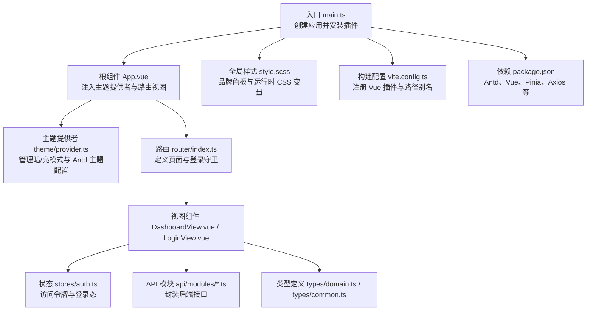
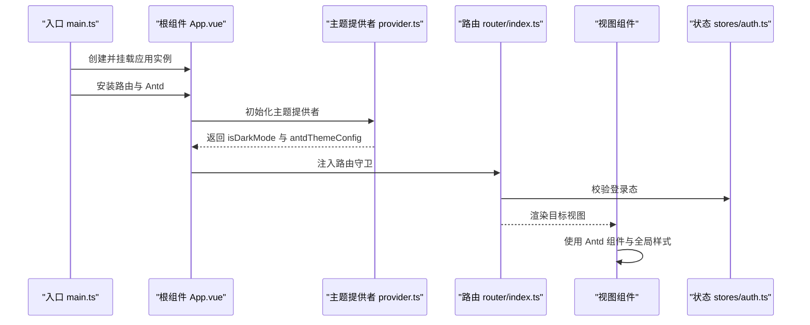
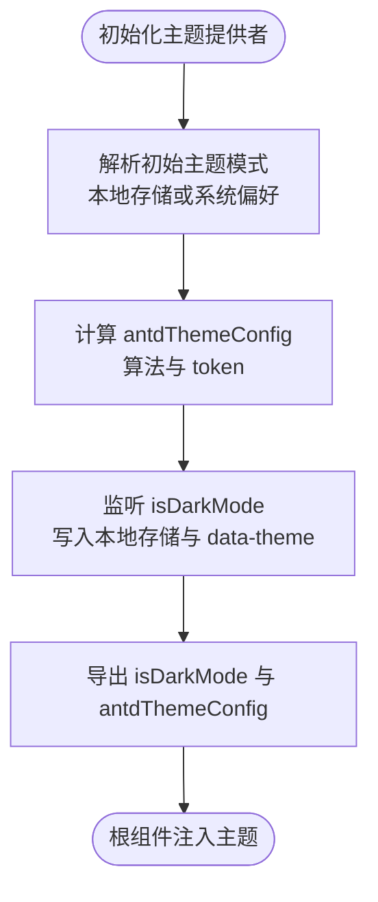
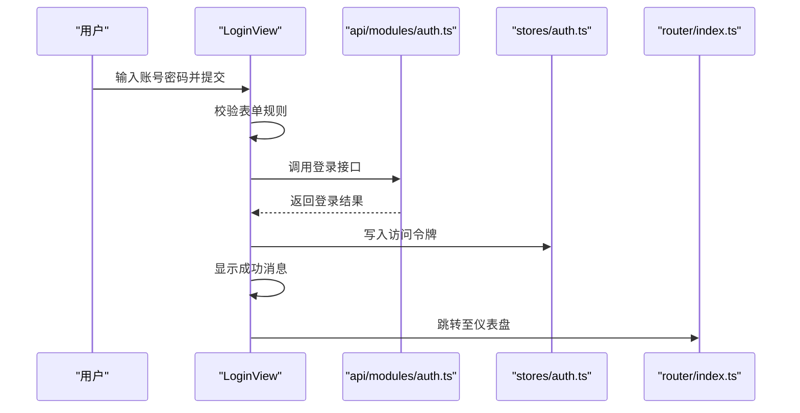
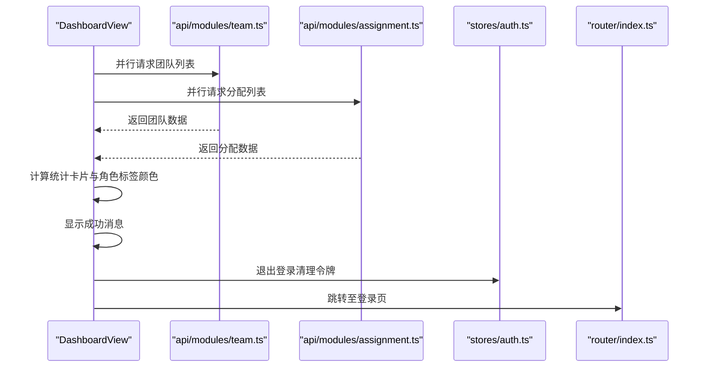
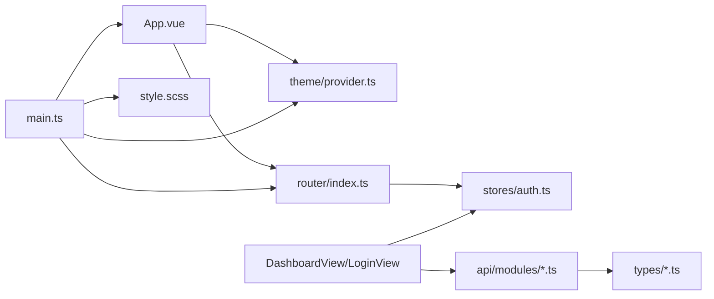

# UI 组件

<cite>
**本文引用的文件**
- [frontend/src/main.ts](file://frontend/src/main.ts)
- [frontend/src/App.vue](file://frontend/src/App.vue)
- [frontend/src/theme/provider.ts](file://frontend/src/theme/provider.ts)
- [frontend/src/style.scss](file://frontend/src/style.scss)
- [frontend/src/views/DashboardView.vue](file://frontend/src/views/DashboardView.vue)
- [frontend/src/views/LoginView.vue](file://frontend/src/views/LoginView.vue)
- [frontend/src/router/index.ts](file://frontend/src/router/index.ts)
- [frontend/src/stores/auth.ts](file://frontend/src/stores/auth.ts)
- [frontend/src/api/modules/auth.ts](file://frontend/src/api/modules/auth.ts)
- [frontend/src/types/domain.ts](file://frontend/src/types/domain.ts)
- [frontend/src/types/common.ts](file://frontend/src/types/common.ts)
- [frontend/vite.config.ts](file://frontend/vite.config.ts)
- [frontend/package.json](file://frontend/package.json)
</cite>

## 目录
1. [简介](#简介)
2. [项目结构](#项目结构)
3. [核心组件](#核心组件)
4. [架构总览](#架构总览)
5. [详细组件分析](#详细组件分析)
6. [依赖分析](#依赖分析)
7. [性能考虑](#性能考虑)
8. [故障排查指南](#故障排查指南)
9. [结论](#结论)
10. [附录](#附录)

## 简介
本文件面向 poprako-web-ms 前端的 UI 组件体系，围绕基于 Ant Design Vue 的组件库使用与自定义主题配置进行系统化说明。内容涵盖页面视图组件的设计模式、组件复用与样式管理策略、主题提供者配置、全局样式与响应式布局实现、常用组件使用范式、表单验证与交互反馈机制，并给出组件开发规范、样式命名约定与视觉设计建议，帮助团队构建一致且可用的用户界面。

## 项目结构
前端采用 Vue 3 + TypeScript + Vite 架构，Ant Design Vue 作为主要 UI 组件库，配合 Pinia 进行状态管理，Vue Router 实现页面路由与守卫。样式以 SCSS 全局变量与运行时 CSS 变量为核心，结合暗/亮两套主题 token，通过主题提供者在根组件集中注入。

图表来源
- [frontend/src/main.ts:1-26](file://frontend/src/main.ts#L1-L26)
- [frontend/src/App.vue:1-45](file://frontend/src/App.vue#L1-L45)
- [frontend/src/theme/provider.ts:1-97](file://frontend/src/theme/provider.ts#L1-L97)
- [frontend/src/router/index.ts:1-54](file://frontend/src/router/index.ts#L1-L54)
- [frontend/src/stores/auth.ts:1-51](file://frontend/src/stores/auth.ts#L1-L51)
- [frontend/src/style.scss:1-147](file://frontend/src/style.scss#L1-L147)
- [frontend/vite.config.ts:1-20](file://frontend/vite.config.ts#L1-L20)
- [frontend/package.json:1-36](file://frontend/package.json#L1-L36)

章节来源
- [frontend/src/main.ts:1-26](file://frontend/src/main.ts#L1-L26)
- [frontend/src/router/index.ts:1-54](file://frontend/src/router/index.ts#L1-L54)
- [frontend/src/style.scss:1-147](file://frontend/src/style.scss#L1-L147)
- [frontend/vite.config.ts:1-20](file://frontend/vite.config.ts#L1-L20)
- [frontend/package.json:1-36](file://frontend/package.json#L1-L36)

## 核心组件
- 主题提供者：集中管理暗/亮模式、Ant Design Vue 主题配置、本地持久化与 DOM 数据集标记。
- 根组件：通过 Ant Design Vue 的 ConfigProvider 注入主题配置，渲染路由视图，并提供主题切换控件。
- 视图组件：仪表盘与登录页，演示布局、表格、列表、表单、按钮、消息反馈等常用 UI 组件组合。
- 路由与守卫：定义页面入口与登录态校验，保障受保护页面的安全访问。
- 状态管理：Pinia Store 维护访问令牌与登录态，支撑路由守卫与 API 请求拦截。
- 全局样式：SCSS 变量与运行时 CSS 变量构成品牌色板与主题 token，支持暗/亮模式切换。

章节来源
- [frontend/src/theme/provider.ts:1-97](file://frontend/src/theme/provider.ts#L1-L97)
- [frontend/src/App.vue:1-45](file://frontend/src/App.vue#L1-L45)
- [frontend/src/views/DashboardView.vue:1-348](file://frontend/src/views/DashboardView.vue#L1-L348)
- [frontend/src/views/LoginView.vue:1-157](file://frontend/src/views/LoginView.vue#L1-L157)
- [frontend/src/router/index.ts:1-54](file://frontend/src/router/index.ts#L1-L54)
- [frontend/src/stores/auth.ts:1-51](file://frontend/src/stores/auth.ts#L1-L51)
- [frontend/src/style.scss:1-147](file://frontend/src/style.scss#L1-L147)

## 架构总览
以下序列图展示了从应用启动到主题注入与页面渲染的关键流程：

图表来源
- [frontend/src/main.ts:16-23](file://frontend/src/main.ts#L16-L23)
- [frontend/src/App.vue:19-28](file://frontend/src/App.vue#L19-L28)
- [frontend/src/theme/provider.ts:53-96](file://frontend/src/theme/provider.ts#L53-L96)
- [frontend/src/router/index.ts:42-51](file://frontend/src/router/index.ts#L42-L51)
- [frontend/src/stores/auth.ts:15-50](file://frontend/src/stores/auth.ts#L15-L50)

## 详细组件分析

### 主题提供者与全局样式
- 主题提供者职责
  - 解析初始主题模式（本地存储优先，其次系统偏好）。
  - 基于 Ant Design Vue 的 ConfigProvider 主题算法与 token 自定义主色与圆角。
  - 提供显式设置与切换函数，并持久化到本地存储与 DOM 数据集。
- 全局样式策略
  - SCSS 变量定义品牌色与明/暗两套主题 token。
  - 运行时 CSS 变量在 :root 与 html[data-theme="dark"] 下切换。
  - 根组件通过 a-config-provider 注入主题配置，视图组件使用 CSS 变量与 Antd 组件完成统一风格。

图表来源
- [frontend/src/theme/provider.ts:39-48](file://frontend/src/theme/provider.ts#L39-L48)
- [frontend/src/theme/provider.ts:56-64](file://frontend/src/theme/provider.ts#L56-L64)
- [frontend/src/theme/provider.ts:80-88](file://frontend/src/theme/provider.ts#L80-L88)
- [frontend/src/App.vue:21-28](file://frontend/src/App.vue#L21-L28)

章节来源
- [frontend/src/theme/provider.ts:1-97](file://frontend/src/theme/provider.ts#L1-L97)
- [frontend/src/App.vue:1-45](file://frontend/src/App.vue#L1-L45)
- [frontend/src/style.scss:1-147](file://frontend/src/style.scss#L1-L147)

### 登录视图组件（LoginView）
- 设计要点
  - 使用 a-card 作为容器，a-form 垂直布局，a-form-item 与 a-input/a-input-password 实现表单输入。
  - 表单规则通过 Ant Design Vue 的内置校验实现必填提示。
  - 提交按钮带 loading 状态，成功后通过消息反馈与路由跳转。
- 交互反馈
  - 成功与失败分别通过消息反馈提示。
  - 加载态避免重复提交。
- 样式管理
  - 使用 CSS 变量统一背景渐变、发光效果与卡片阴影。
  - 暗/亮模式下通过全局变量自动适配。

图表来源
- [frontend/src/views/LoginView.vue:69-82](file://frontend/src/views/LoginView.vue#L69-L82)
- [frontend/src/api/modules/auth.ts:79-86](file://frontend/src/api/modules/auth.ts#L79-L86)
- [frontend/src/stores/auth.ts:31-34](file://frontend/src/stores/auth.ts#L31-L34)
- [frontend/src/router/index.ts:42-51](file://frontend/src/router/index.ts#L42-L51)

章节来源
- [frontend/src/views/LoginView.vue:1-157](file://frontend/src/views/LoginView.vue#L1-L157)
- [frontend/src/api/modules/auth.ts:1-110](file://frontend/src/api/modules/auth.ts#L1-L110)
- [frontend/src/stores/auth.ts:1-51](file://frontend/src/stores/auth.ts#L1-L51)

### 仪表盘视图组件（DashboardView）
- 设计要点
  - 使用 a-layout、a-layout-sider、a-layout-header、a-layout-content 构建三段式布局。
  - 菜单使用 a-menu，图标通过 @ant-design/icons-vue 注入。
  - 统计卡片使用 a-row/a-col/a-card/a-statistic，响应式断点 xs/md/xl 控制列宽。
  - 数据面板使用 a-table 与 a-list 展示团队与任务分配，支持自定义渲染。
- 交互反馈
  - 刷新按钮加载态与消息反馈。
  - 菜单项点击提供提示，说明其他页面可按同样模式扩展。
  - 退出登录清理令牌并跳转登录页。
- 样式管理
  - 侧边栏、头部、卡片背景统一使用 CSS 变量，暗/亮模式自动适配。
  - 暗黑模式下通过全局选择器覆盖局部颜色。

图表来源
- [frontend/src/views/DashboardView.vue:206-225](file://frontend/src/views/DashboardView.vue#L206-L225)
- [frontend/src/views/DashboardView.vue:230-233](file://frontend/src/views/DashboardView.vue#L230-L233)
- [frontend/src/stores/auth.ts:39-42](file://frontend/src/stores/auth.ts#L39-L42)
- [frontend/src/router/index.ts:42-51](file://frontend/src/router/index.ts#L42-L51)

章节来源
- [frontend/src/views/DashboardView.vue:1-348](file://frontend/src/views/DashboardView.vue#L1-L348)
- [frontend/src/types/domain.ts:1-89](file://frontend/src/types/domain.ts#L1-L89)
- [frontend/src/types/common.ts:1-41](file://frontend/src/types/common.ts#L1-L41)

### 路由与守卫
- 路由表定义了登录页与仪表盘页的懒加载组件。
- 前置守卫根据登录态重定向，防止未登录访问受保护页面，已登录用户访问登录页时自动跳转仪表盘。

章节来源
- [frontend/src/router/index.ts:14-51](file://frontend/src/router/index.ts#L14-L51)

### 状态管理（认证 Store）
- 维护访问令牌与登录态，提供设置与清除方法，并与本地存储保持同步。
- 为路由守卫与 API 请求拦截提供依据。

章节来源
- [frontend/src/stores/auth.ts:15-50](file://frontend/src/stores/auth.ts#L15-L50)

### 类型与 API 模块
- 类型模块定义了用户、团队、工作集、漫画、章节、分配等核心领域对象。
- API 模块封装了登录、注册、获取当前用户信息等接口，统一请求与响应类型。

章节来源
- [frontend/src/types/domain.ts:1-89](file://frontend/src/types/domain.ts#L1-L89)
- [frontend/src/types/common.ts:1-41](file://frontend/src/types/common.ts#L1-L41)
- [frontend/src/api/modules/auth.ts:1-110](file://frontend/src/api/modules/auth.ts#L1-L110)

## 依赖分析
- 组件耦合与内聚
  - 根组件对主题提供者强依赖，通过 ConfigProvider 注入主题；对路由视图弱依赖，便于扩展新页面。
  - 视图组件对状态与 API 模块存在功能级依赖，但通过类型约束降低编译期风险。
- 外部依赖与集成
  - Ant Design Vue 提供 UI 组件与主题算法；@ant-design/icons-vue 提供图标。
  - Axios 作为 HTTP 客户端，统一在 API 模块中封装。
  - Pinia 提供轻量状态管理；Vue Router 提供页面导航与守卫。
- 潜在循环依赖
  - 未发现直接循环依赖；主题提供者与根组件形成单向依赖链。

图表来源
- [frontend/src/main.ts:16-23](file://frontend/src/main.ts#L16-L23)
- [frontend/src/App.vue:19-28](file://frontend/src/App.vue#L19-L28)
- [frontend/src/theme/provider.ts:53-96](file://frontend/src/theme/provider.ts#L53-L96)
- [frontend/src/router/index.ts:42-51](file://frontend/src/router/index.ts#L42-L51)
- [frontend/src/stores/auth.ts:15-50](file://frontend/src/stores/auth.ts#L15-L50)
- [frontend/src/views/DashboardView.vue:108-110](file://frontend/src/views/DashboardView.vue#L108-L110)
- [frontend/src/views/LoginView.vue:54-55](file://frontend/src/views/LoginView.vue#L54-L55)
- [frontend/src/api/modules/auth.ts:79-86](file://frontend/src/api/modules/auth.ts#L79-L86)
- [frontend/src/types/domain.ts:1-89](file://frontend/src/types/domain.ts#L1-L89)
- [frontend/src/style.scss:56-85](file://frontend/src/style.scss#L56-L85)

章节来源
- [frontend/src/main.ts:1-26](file://frontend/src/main.ts#L1-L26)
- [frontend/src/package.json:13-20](file://frontend/package.json#L13-L20)

## 性能考虑
- 组件渲染
  - 使用 v-model 与响应式引用减少不必要的重渲染；在仪表盘中对统计卡片与角色标签颜色进行计算属性缓存。
- 网络请求
  - 仪表盘采用 Promise.all 并行请求团队与分配数据，缩短首屏等待时间。
- 样式体积
  - 全局变量与 CSS 变量减少重复样式定义，提升维护效率与打包体积可控性。
- 主题切换
  - 通过 data-theme 与 CSS 变量切换，避免动态引入样式文件，降低切换抖动。

章节来源
- [frontend/src/views/DashboardView.vue:209-215](file://frontend/src/views/DashboardView.vue#L209-L215)
- [frontend/src/style.scss:90-113](file://frontend/src/style.scss#L90-L113)

## 故障排查指南
- 主题不生效
  - 检查根组件是否正确注入 antdThemeConfig；确认 data-theme 是否随切换更新。
  - 确认全局样式变量已在 :root 与 html[data-theme="dark"] 中定义。
- 登录失败或无法跳转
  - 检查登录接口返回与错误消息；确认访问令牌写入与本地存储同步。
  - 校验路由守卫逻辑与登录态判断。
- 表单校验无效
  - 确认表单项的 name 与 rules 配置正确；检查 Ant Design Vue 版本兼容性。
- 响应式布局异常
  - 检查栅格断点配置与列宽设置；确认容器宽度与视口尺寸。

章节来源
- [frontend/src/App.vue:21-28](file://frontend/src/App.vue#L21-L28)
- [frontend/src/style.scss:56-113](file://frontend/src/style.scss#L56-L113)
- [frontend/src/views/LoginView.vue:69-82](file://frontend/src/views/LoginView.vue#L69-L82)
- [frontend/src/router/index.ts:42-51](file://frontend/src/router/index.ts#L42-L51)

## 结论
本项目以 Ant Design Vue 为基础，结合自定义主题提供者与全局样式变量，实现了统一的视觉语言与良好的暗/亮主题体验。视图组件遵循“布局 + 表单/表格 + 反馈”的常见模式，配合 Pinia 与路由守卫，形成清晰的页面与状态管理边界。建议在后续迭代中持续完善组件库的可复用性与可测试性，同时保持样式与主题的一致性。

## 附录

### 组件开发规范与最佳实践
- 组件复用
  - 将通用布局与交互抽离为可复用的子组件或组合式函数，减少重复代码。
- 样式命名约定
  - 使用语义化类名，如 .dashboard-header、.login-card；避免过度层级嵌套。
  - 优先使用 CSS 变量与 Antd 组件的内置样式，减少自定义样式的数量。
- 视觉设计指南
  - 严格遵循品牌色板与主题 token；在暗/亮模式下保持对比度与可读性。
  - 控制圆角、阴影与间距的一致性，确保整体风格统一。
- 表单与交互
  - 使用 Ant Design Vue 的表单校验与消息反馈，提供即时明确的用户引导。
  - 对关键操作添加加载态与禁用态，避免重复提交与误操作。

### 常用组件使用示例（路径指引）
- 登录表单与按钮
  - [frontend/src/views/LoginView.vue:11-45](file://frontend/src/views/LoginView.vue#L11-L45)
- 仪表盘布局与卡片
  - [frontend/src/views/DashboardView.vue:2-94](file://frontend/src/views/DashboardView.vue#L2-L94)
- 表格与列表
  - [frontend/src/views/DashboardView.vue:59-89](file://frontend/src/views/DashboardView.vue#L59-L89)
- 主题切换控件
  - [frontend/src/App.vue:4-11](file://frontend/src/App.vue#L4-L11)