# Vue 应用结构

<cite>
**本文档引用的文件**
- [main.ts](file://frontend/src/main.ts)
- [App.vue](file://frontend/src/App.vue)
- [env.d.ts](file://frontend/src/env.d.ts)
- [package.json](file://frontend/package.json)
- [vite.config.ts](file://frontend/vite.config.ts)
- [provider.ts](file://frontend/src/theme/provider.ts)
- [index.ts](file://frontend/src/router/index.ts)
- [auth.ts](file://frontend/src/stores/auth.ts)
- [style.scss](file://frontend/src/style.scss)
- [DashboardView.vue](file://frontend/src/views/DashboardView.vue)
- [LoginView.vue](file://frontend/src/views/LoginView.vue)
- [FileTransferTestView.vue](file://frontend/src/views/FileTransferTestView.vue)
- [domain.ts](file://frontend/src/types/domain.ts)
- [tsconfig.app.json](file://frontend/tsconfig.app.json)
- [index.html](file://frontend/index.html)
- [team.ts](file://frontend/src/api/modules/team.ts)
- [auth.ts](file://frontend/src/api/modules/auth.ts)
</cite>

## 更新摘要
**变更内容**
- 新增FileTransferTestView测试界面组件，提供头像上传下载功能
- 更新路由系统，添加文件测试路由和菜单入口
- 扩展API模块，新增用户和团队头像相关接口
- 更新仪表盘菜单，增加文件测试入口

## 目录
1. [简介](#简介)
2. [项目结构](#项目结构)
3. [核心组件](#核心组件)
4. [架构总览](#架构总览)
5. [详细组件分析](#详细组件分析)
6. [依赖关系分析](#依赖关系分析)
7. [性能考虑](#性能考虑)
8. [故障排除指南](#故障排除指南)
9. [结论](#结论)

## 简介

poprako-web-ms 项目是一个基于 Vue 3 的前端管理系统，采用现代化的前端技术栈构建。该项目展示了如何在 Vue 3 应用中集成 Pinia 状态管理、Vue Router 路由系统、Ant Design Vue 组件库，以及完整的主题切换机制。

本项目的核心目标是为用户提供一个功能完整、界面美观、交互流畅的管理平台，支持用户登录、团队管理、任务分配等核心业务功能。**新增的FileTransferTestView测试界面进一步增强了应用的文件传输测试能力**。

## 项目结构

前端项目采用模块化的组织方式，主要目录结构如下：

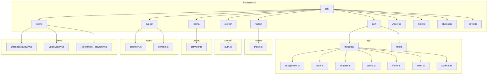

**图表来源**
- [main.ts:1-26](file://frontend/src/main.ts#L1-L26)
- [App.vue:1-45](file://frontend/src/App.vue#L1-L45)
- [index.ts:1-59](file://frontend/src/router/index.ts#L1-L59)

**章节来源**
- [main.ts:1-26](file://frontend/src/main.ts#L1-L26)
- [package.json:1-36](file://frontend/package.json#L1-L36)
- [vite.config.ts:1-20](file://frontend/vite.config.ts#L1-L20)

## 核心组件

### 应用入口配置

应用入口文件 `main.ts` 是整个 Vue 应用的启动点，负责初始化所有必要的依赖和服务。

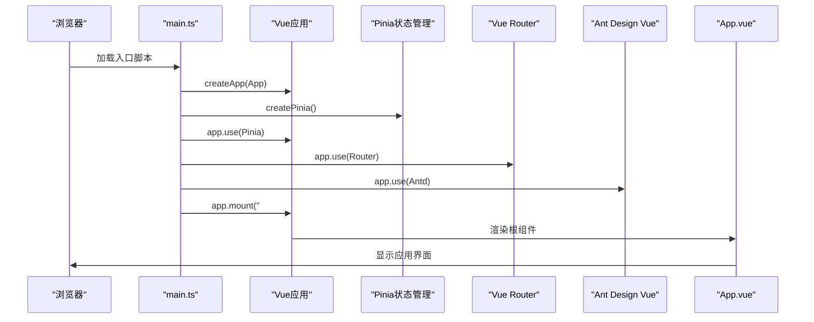

**图表来源**
- [main.ts:16-23](file://frontend/src/main.ts#L16-L23)

应用入口的主要职责包括：
- 创建 Vue 应用实例
- 注册 Pinia 状态管理
- 注册 Vue Router 路由系统
- 注册 Ant Design Vue 组件库
- 挂载到 DOM 元素

**章节来源**
- [main.ts:1-26](file://frontend/src/main.ts#L1-L26)

### 根组件设计

`App.vue` 作为应用的根组件，承担着全局主题提供者和路由容器的角色。

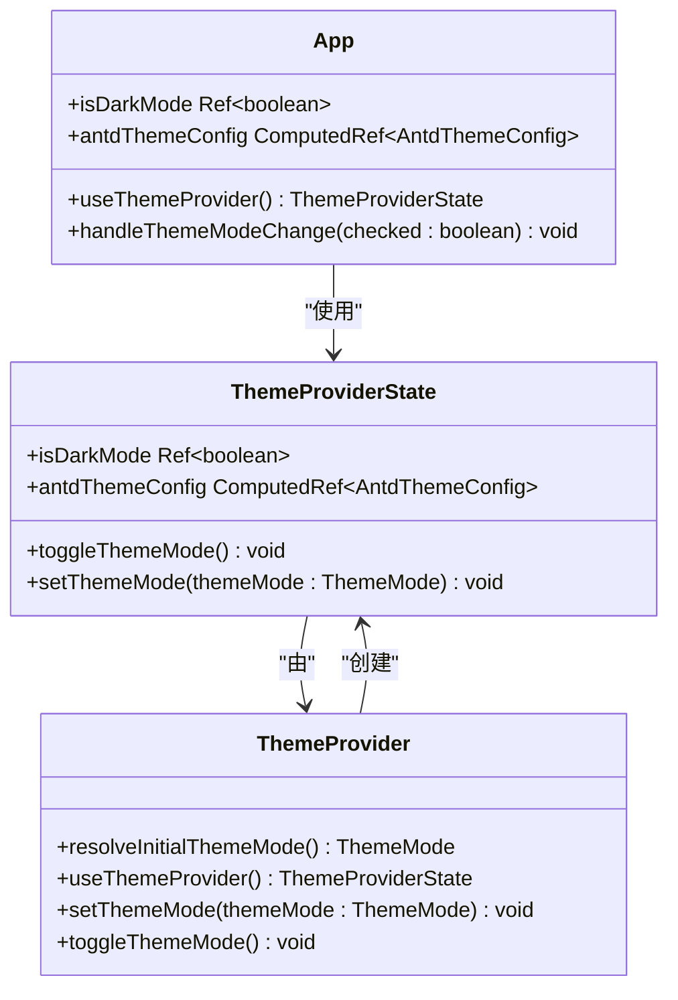

**图表来源**
- [App.vue:15-28](file://frontend/src/App.vue#L15-L28)
- [provider.ts:53-96](file://frontend/src/theme/provider.ts#L53-L96)

**章节来源**
- [App.vue:1-45](file://frontend/src/App.vue#L1-L45)
- [provider.ts:1-97](file://frontend/src/theme/provider.ts#L1-L97)

### 环境变量配置

项目使用 TypeScript 的环境声明文件来提供 Vite 客户端环境的类型支持。

**章节来源**
- [env.d.ts:1-5](file://frontend/src/env.d.ts#L1-L5)
- [tsconfig.app.json:1-9](file://frontend/tsconfig.app.json#L1-L9)

## 架构总览

### 技术栈架构

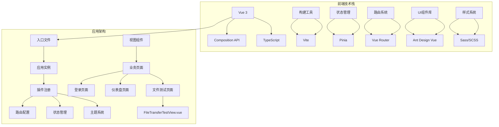

**图表来源**
- [package.json:13-20](file://frontend/package.json#L13-L20)
- [main.ts:4-10](file://frontend/src/main.ts#L4-L10)

### 应用启动流程

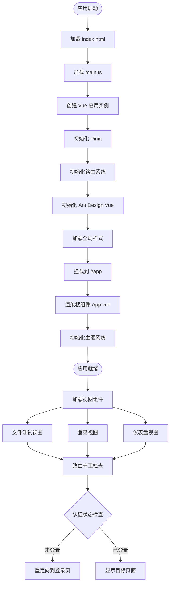

**图表来源**
- [index.html:10-12](file://frontend/index.html#L10-L12)
- [main.ts:16-23](file://frontend/src/main.ts#L16-L23)
- [App.vue:1-13](file://frontend/src/App.vue#L1-L13)

## 详细组件分析

### 路由系统

路由系统采用 Vue Router 4.x，实现了基本的页面导航和登录态保护。**新增的文件测试路由为开发者提供了专门的文件传输测试入口**。

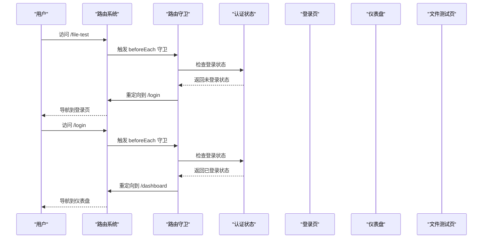

**图表来源**
- [index.ts:47-56](file://frontend/src/router/index.ts#L47-L56)

**章节来源**
- [index.ts:1-59](file://frontend/src/router/index.ts#L1-L59)

### 状态管理

认证状态管理使用 Pinia，提供了简洁的响应式状态管理方案。

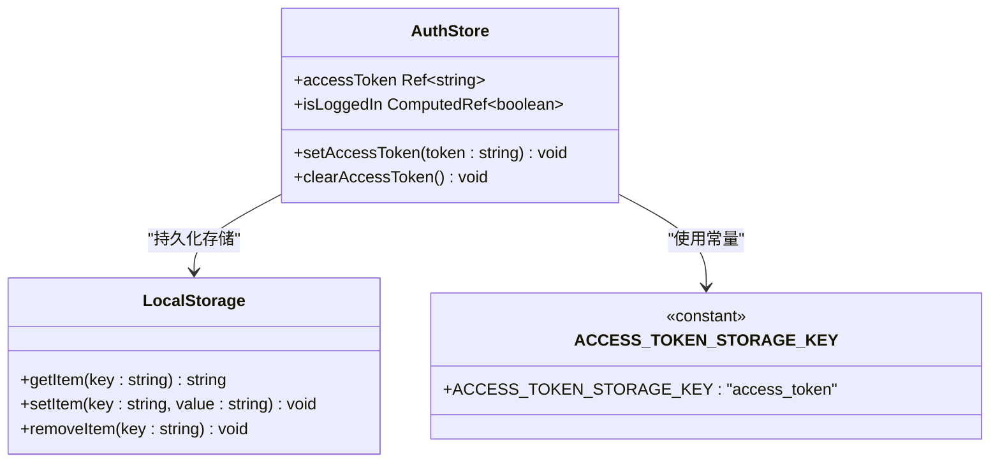

**图表来源**
- [auth.ts:15-50](file://frontend/src/stores/auth.ts#L15-L50)

**章节来源**
- [auth.ts:1-51](file://frontend/src/stores/auth.ts#L1-L51)

### 主题系统

主题系统提供了完整的亮色/暗黑模式切换功能，支持本地存储记忆和系统偏好检测。

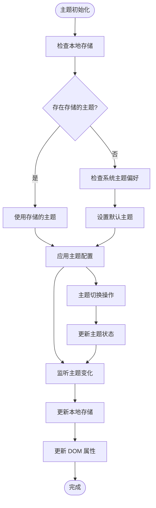

**图表来源**
- [provider.ts:39-48](file://frontend/src/theme/provider.ts#L39-L48)
- [provider.ts:80-88](file://frontend/src/theme/provider.ts#L80-L88)

**章节来源**
- [provider.ts:1-97](file://frontend/src/theme/provider.ts#L1-L97)

### 视图组件

#### 登录页面

登录页面提供了用户身份验证功能，集成了表单验证和错误处理。

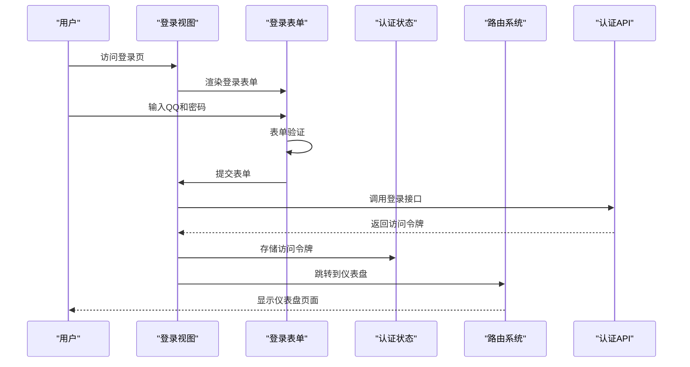

**图表来源**
- [LoginView.vue:69-82](file://frontend/src/views/LoginView.vue#L69-L82)

**章节来源**
- [LoginView.vue:1-157](file://frontend/src/views/LoginView.vue#L1-L157)

#### 仪表盘页面

仪表盘页面展示了用户的核心工作界面，包含团队管理、任务分配等功能。**新增的文件测试菜单项为开发者提供了便捷的文件传输测试入口**。

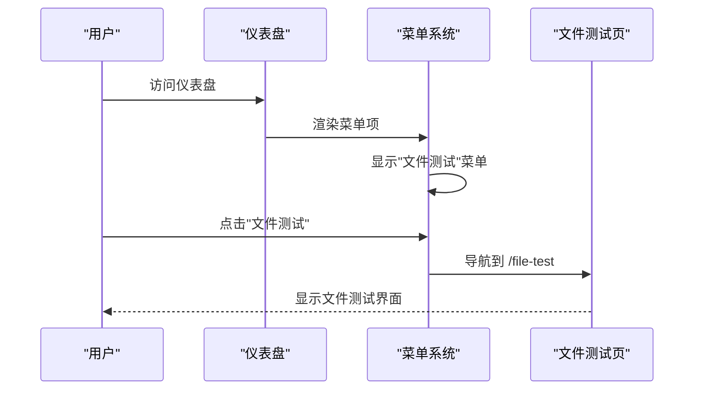

**图表来源**
- [DashboardView.vue:138-142](file://frontend/src/views/DashboardView.vue#L138-L142)

**章节来源**
- [DashboardView.vue:1-363](file://frontend/src/views/DashboardView.vue#L1-L363)

#### 文件测试页面

**新增** FileTransferTestView组件提供了完整的头像上传下载测试功能，包含响应式的两列布局设计。

```mermaid
classDiagram
class FileTransferTestView {
+targetType Ref~"user"|"team"~
+selectedTeamID Ref~string~
+uploadUrl Ref~string~
+downloadUrl Ref~string~
+selectedFile Ref~File|null~
+uploadFileList Ref~UploadFile[]~
+reserving Ref~boolean~
+uploading Ref~boolean~
+downloading Ref~boolean~
+refreshing Ref~boolean~
+reserveUploadUrl() Promise~void~
+uploadAndConfirm() Promise~void~
+downloadFile() Promise~void~
+refreshTargetData() Promise~void~
+syncDownloadUrl() void
}
class UploadTargetType {
<<enumeration>>
"user"
"team"
}
class TeamOption {
+label string
+value string
}
FileTransferTestView --> UploadTargetType : "使用"
FileTransferTestView --> TeamOption : "生成选项"
```

**图表来源**
- [FileTransferTestView.vue:128-177](file://frontend/src/views/FileTransferTestView.vue#L128-L177)

**章节来源**
- [FileTransferTestView.vue:1-405](file://frontend/src/views/FileTransferTestView.vue#L1-L405)

### API模块扩展

**新增** 用户和团队头像相关的API函数，支持完整的头像上传下载流程。

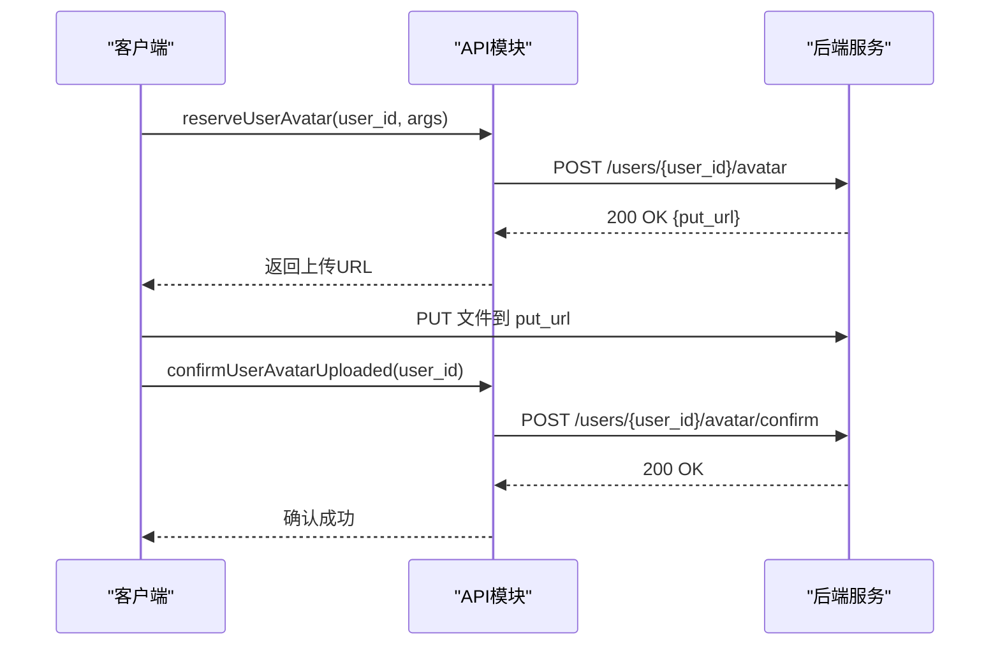

**图表来源**
- [auth.ts:139-156](file://frontend/src/api/modules/auth.ts#L139-L156)
- [team.ts:119-134](file://frontend/src/api/modules/team.ts#L119-L134)

**章节来源**
- [auth.ts:1-157](file://frontend/src/api/modules/auth.ts#L1-L157)
- [team.ts:1-135](file://frontend/src/api/modules/team.ts#L1-L135)

### 样式系统

全局样式系统采用了 Sass/SCSS 预处理器，提供了完整的主题变量体系。

**章节来源**
- [style.scss:1-147](file://frontend/src/style.scss#L1-L147)

## 依赖关系分析

### 包依赖关系

```mermaid
graph TB
subgraph "运行时依赖"
A[vue@^3.5.13] --> B[Vue 3 核心框架]
C[ant-design-vue@^4.2.6] --> D[Ant Design Vue 组件库]
E[axios@^1.8.4] --> F[HTTP 请求库]
G[pinia@^3.0.3] --> H[状态管理]
I[vue-router@^4.5.0] --> J[路由管理]
K[@ant-design/icons-vue@^7.0.1] --> L[图标库]
end
subgraph "开发时依赖"
M[vite@^6.2.2] --> N[构建工具]
O[@vitejs/plugin-vue@^5.2.1] --> P[Vue 插件]
Q[sass@^1.83.4] --> R[Sass 编译器]
S[typescript@^5.8.2] --> T[TypeScript 支持]
U[eslint@^9.22.0] --> V[Lint 规则]
W[vue-tsc@^2.2.8] --> X[类型检查]
end
subgraph "应用入口"
Y[main.ts] --> A
Y --> C
Y --> G
Y --> I
end
```

**图表来源**
- [package.json:13-34](file://frontend/package.json#L13-L34)

### 内部模块依赖

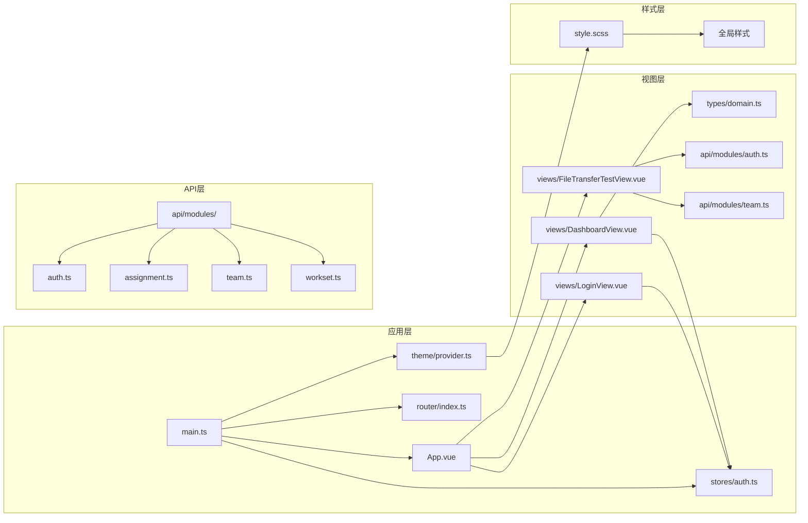

**图表来源**
- [main.ts:4-10](file://frontend/src/main.ts#L4-L10)
- [App.vue:19-21](file://frontend/src/App.vue#L19-L21)

**章节来源**
- [package.json:1-36](file://frontend/package.json#L1-L36)

## 性能考虑

### 代码分割和懒加载

项目采用了动态导入的方式实现路由级别的代码分割，优化了首屏加载性能。**文件测试页面也采用了懒加载策略，只有在访问时才加载组件代码**。

**章节来源**
- [index.ts:22-32](file://frontend/src/router/index.ts#L22-L32)

### 样式优化

全局样式系统通过 CSS 变量实现了主题的动态切换，避免了重复的样式计算。

**章节来源**
- [style.scss:56-113](file://frontend/src/style.scss#L56-L113)

### 状态管理优化

Pinia 的响应式状态管理提供了高效的更新机制，减少了不必要的重新渲染。

**章节来源**
- [auth.ts:26-26](file://frontend/src/stores/auth.ts#L26-L26)

## 故障排除指南

### 常见问题诊断

1. **应用无法启动**
   - 检查 main.ts 中的依赖导入是否正确
   - 确认 index.html 中的脚本引用路径
   - 验证 Vite 配置文件的正确性

2. **路由跳转异常**
   - 检查路由守卫的逻辑实现
   - 验证认证状态的存储和读取
   - 确认路由表的配置正确性

3. **主题切换失效**
   - 检查本地存储的读写权限
   - 验证 CSS 变量的更新机制
   - 确认 DOM 属性的设置逻辑

4. **文件测试功能异常**
   - 检查CORS配置是否正确
   - 验证上传URL的有效性
   - 确认文件类型和大小限制

**章节来源**
- [main.ts:16-23](file://frontend/src/main.ts#L16-L23)
- [index.ts:47-56](file://frontend/src/router/index.ts#L47-L56)
- [provider.ts:80-88](file://frontend/src/theme/provider.ts#L80-L88)

## 结论

poprako-web-ms 项目展示了现代 Vue 3 应用的最佳实践，包括：

1. **清晰的架构分层**：入口文件、根组件、路由系统、状态管理、主题系统各司其职
2. **完善的依赖管理**：合理的包依赖和内部模块依赖关系
3. **优秀的用户体验**：主题切换、路由守卫、表单验证等特性
4. **良好的代码组织**：模块化的设计和清晰的文件结构
5. **增强的测试能力**：新增的FileTransferTestView提供了专业的文件传输测试功能

**新增的FileTransferTestView组件为开发者提供了便捷的头像上传下载测试入口，支持用户和团队两种头像类型的测试，包含完整的CORS配置提示和错误处理机制**。该项目为后续的功能扩展提供了坚实的基础，开发者可以在此基础上继续完善业务功能和用户体验。