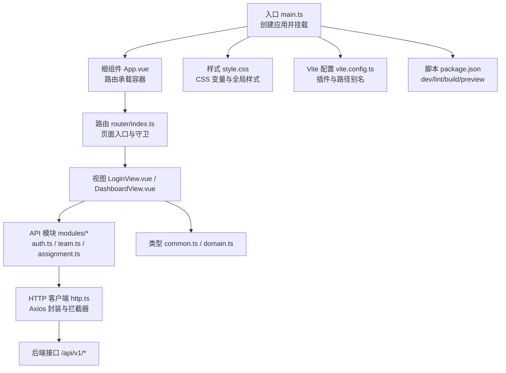
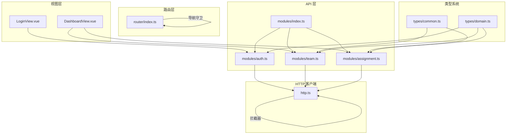
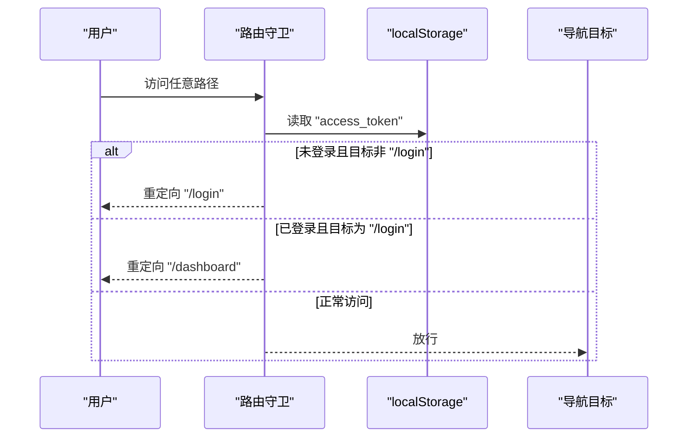
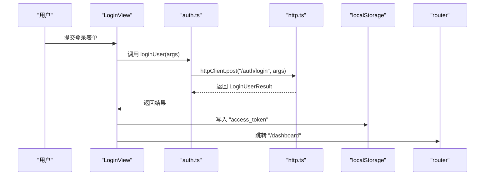
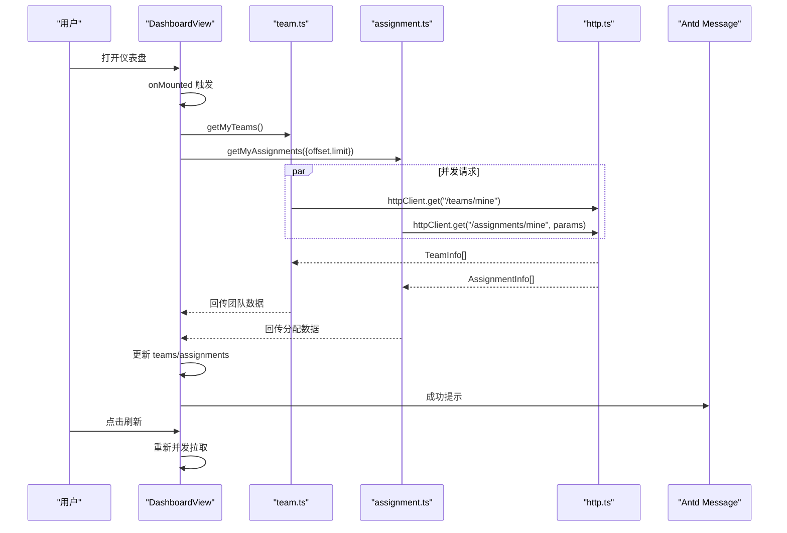
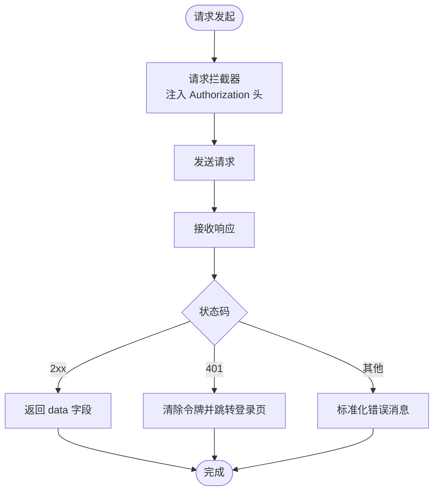
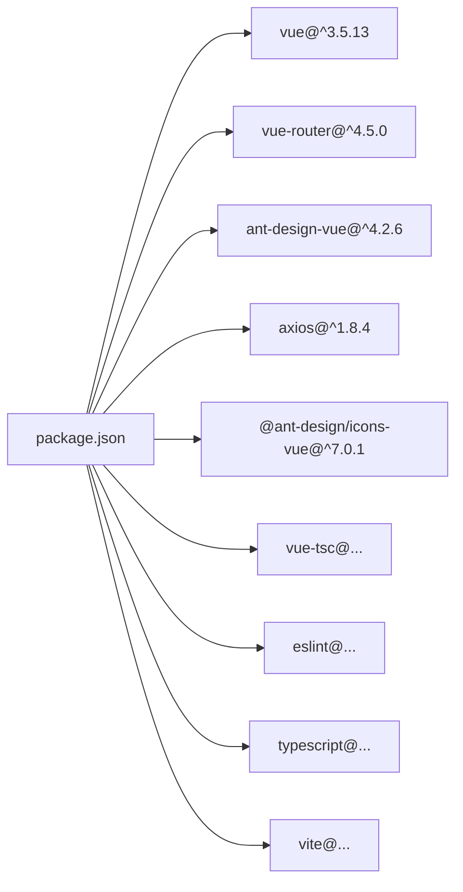

# 前端应用架构

<cite>
**本文引用的文件**
- [frontend/src/main.ts](file://frontend/src/main.ts)
- [frontend/src/App.vue](file://frontend/src/App.vue)
- [frontend/src/router/index.ts](file://frontend/src/router/index.ts)
- [frontend/package.json](file://frontend/package.json)
- [frontend/vite.config.ts](file://frontend/vite.config.ts)
- [frontend/src/style.css](file://frontend/src/style.css)
- [frontend/tsconfig.app.json](file://frontend/tsconfig.app.json)
- [frontend/eslint.config.mjs](file://frontend/eslint.config.mjs)
- [frontend/src/api/http.ts](file://frontend/src/api/http.ts)
- [frontend/src/api/modules/index.ts](file://frontend/src/api/modules/index.ts)
- [frontend/src/api/modules/auth.ts](file://frontend/src/api/modules/auth.ts)
- [frontend/src/api/modules/team.ts](file://frontend/src/api/modules/team.ts)
- [frontend/src/api/modules/assignment.ts](file://frontend/src/api/modules/assignment.ts)
- [frontend/src/types/common.ts](file://frontend/src/types/common.ts)
- [frontend/src/types/domain.ts](file://frontend/src/types/domain.ts)
- [frontend/src/views/DashboardView.vue](file://frontend/src/views/DashboardView.vue)
- [frontend/src/views/LoginView.vue](file://frontend/src/views/LoginView.vue)
</cite>

## 目录
1. [引言](#引言)
2. [项目结构](#项目结构)
3. [核心组件](#核心组件)
4. [架构总览](#架构总览)
5. [详细组件分析](#详细组件分析)
6. [依赖关系分析](#依赖关系分析)
7. [性能考虑](#性能考虑)
8. [故障排查指南](#故障排查指南)
9. [结论](#结论)
10. [附录](#附录)

## 引言
本文件面向希望深入理解并维护该 Vue 3 单页应用的工程师与产品同学，系统性梳理前端架构设计与实现要点，包括目录结构、组件与路由模式、组合式 API 使用、状态管理与通信机制、TypeScript 类型体系、API 客户端设计与错误处理策略、UI 组件库选择与样式管理、响应式设计、开发规范与性能优化，以及从用户交互到数据获取的完整数据流。

## 项目结构
前端采用“功能域+层次”混合组织方式：
- 入口与根组件：在入口文件中初始化应用、挂载路由与 UI 库；根组件作为路由承载容器。
- 视图层：按页面维度拆分视图组件，如登录页与仪表盘页。
- 路由层：集中定义页面入口与登录态守卫。
- API 层：以模块化方式封装各领域接口，统一通过 HTTP 客户端发起请求。
- 类型层：分别定义通用类型与领域模型类型，贯穿 API 与视图层。
- 构建与工具链：Vite 提供开发与构建能力，ESLint 与 TypeScript 提供静态检查与类型保障。

图表来源
- [frontend/src/main.ts:1-23](file://frontend/src/main.ts#L1-L23)
- [frontend/src/App.vue:1-11](file://frontend/src/App.vue#L1-L11)
- [frontend/src/router/index.ts:1-53](file://frontend/src/router/index.ts#L1-L53)
- [frontend/src/api/http.ts:1-171](file://frontend/src/api/http.ts#L1-L171)
- [frontend/src/api/modules/index.ts:1-10](file://frontend/src/api/modules/index.ts#L1-L10)
- [frontend/src/types/common.ts:1-26](file://frontend/src/types/common.ts#L1-L26)
- [frontend/src/types/domain.ts:1-64](file://frontend/src/types/domain.ts#L1-L64)
- [frontend/src/style.css:1-46](file://frontend/src/style.css#L1-L46)
- [frontend/vite.config.ts:1-20](file://frontend/vite.config.ts#L1-L20)
- [frontend/package.json:1-34](file://frontend/package.json#L1-L34)

章节来源
- [frontend/src/main.ts:1-23](file://frontend/src/main.ts#L1-L23)
- [frontend/src/App.vue:1-11](file://frontend/src/App.vue#L1-L11)
- [frontend/src/router/index.ts:1-53](file://frontend/src/router/index.ts#L1-L53)
- [frontend/vite.config.ts:1-20](file://frontend/vite.config.ts#L1-L20)
- [frontend/package.json:1-34](file://frontend/package.json#L1-L34)

## 核心组件
- 应用入口与挂载：创建 Vue 实例，注入路由与 UI 组件库，挂载到 DOM。
- 根组件：最简容器，承载路由视图。
- 路由：定义登录页与仪表盘页，设置登录态前置守卫。
- 视图组件：登录页与仪表盘页，分别承担认证与数据展示职责。
- API 客户端：统一 Axios 实例，集中处理鉴权头、错误标准化与 HTTP 方法封装。
- 类型系统：通用类型（分页、包含项、统一错误）与领域模型（用户、团队、分配等）。
- 样式：CSS 变量驱动的主题与全局样式，视图内样式通过 scoped 管理作用域。

章节来源
- [frontend/src/main.ts:1-23](file://frontend/src/main.ts#L1-L23)
- [frontend/src/App.vue:1-11](file://frontend/src/App.vue#L1-L11)
- [frontend/src/router/index.ts:1-53](file://frontend/src/router/index.ts#L1-L53)
- [frontend/src/api/http.ts:1-171](file://frontend/src/api/http.ts#L1-L171)
- [frontend/src/types/common.ts:1-26](file://frontend/src/types/common.ts#L1-L26)
- [frontend/src/types/domain.ts:1-64](file://frontend/src/types/domain.ts#L1-L64)
- [frontend/src/style.css:1-46](file://frontend/src/style.css#L1-L46)

## 架构总览
整体采用“视图-模块化 API-统一 HTTP 客户端”的分层架构。视图通过 API 模块调用 HTTP 客户端，HTTP 客户端通过拦截器统一注入鉴权头与错误处理，路由负责登录态控制与页面切换。

图表来源
- [frontend/src/views/LoginView.vue:1-143](file://frontend/src/views/LoginView.vue#L1-L143)
- [frontend/src/views/DashboardView.vue:1-327](file://frontend/src/views/DashboardView.vue#L1-L327)
- [frontend/src/router/index.ts:1-53](file://frontend/src/router/index.ts#L1-L53)
- [frontend/src/api/modules/index.ts:1-10](file://frontend/src/api/modules/index.ts#L1-L10)
- [frontend/src/api/modules/auth.ts:1-110](file://frontend/src/api/modules/auth.ts#L1-L110)
- [frontend/src/api/modules/team.ts:1-81](file://frontend/src/api/modules/team.ts#L1-L81)
- [frontend/src/api/modules/assignment.ts:1-99](file://frontend/src/api/modules/assignment.ts#L1-L99)
- [frontend/src/api/http.ts:1-171](file://frontend/src/api/http.ts#L1-L171)
- [frontend/src/types/common.ts:1-26](file://frontend/src/types/common.ts#L1-L26)
- [frontend/src/types/domain.ts:1-64](file://frontend/src/types/domain.ts#L1-L64)

## 详细组件分析

### 路由与导航守卫
- 路由表：定义根路径重定向、登录页与仪表盘页懒加载。
- 导航守卫：在进入任意路由前检查本地存储中的访问令牌，未登录时强制跳转至登录页，已登录访问登录页时跳转至仪表盘。

图表来源
- [frontend/src/router/index.ts:41-50](file://frontend/src/router/index.ts#L41-L50)

章节来源
- [frontend/src/router/index.ts:1-53](file://frontend/src/router/index.ts#L1-L53)

### 登录视图与认证流程
- 表单与校验：使用表单组件进行字段校验，提交时触发登录函数。
- 登录调用：调用认证模块的登录接口，成功后写入访问令牌并跳转至仪表盘。
- 错误处理：捕获异常并提示用户。

图表来源
- [frontend/src/views/LoginView.vue:68-81](file://frontend/src/views/LoginView.vue#L68-L81)
- [frontend/src/api/modules/auth.ts:79-86](file://frontend/src/api/modules/auth.ts#L79-L86)
- [frontend/src/api/http.ts:84-87](file://frontend/src/api/http.ts#L84-L87)

章节来源
- [frontend/src/views/LoginView.vue:1-143](file://frontend/src/views/LoginView.vue#L1-L143)
- [frontend/src/api/modules/auth.ts:1-110](file://frontend/src/api/modules/auth.ts#L1-L110)
- [frontend/src/api/http.ts:1-171](file://frontend/src/api/http.ts#L1-L171)

### 仪表盘视图与数据流
- 数据聚合：进入页面后并发拉取“我的团队”和“我的分配”，保证统计一致性。
- 统计计算：基于响应数据计算摘要卡片值。
- 交互行为：支持刷新、退出登录、侧边栏折叠与菜单点击（其余菜单为占位提示）。
- 时间格式化与标签颜色：根据角色映射标签颜色，格式化时间显示。

图表来源
- [frontend/src/views/DashboardView.vue:204-223](file://frontend/src/views/DashboardView.vue#L204-L223)
- [frontend/src/api/modules/team.ts:53-55](file://frontend/src/api/modules/team.ts#L53-L55)
- [frontend/src/api/modules/assignment.ts:77-84](file://frontend/src/api/modules/assignment.ts#L77-L84)
- [frontend/src/api/http.ts:84-87](file://frontend/src/api/http.ts#L84-L87)

章节来源
- [frontend/src/views/DashboardView.vue:1-327](file://frontend/src/views/DashboardView.vue#L1-L327)
- [frontend/src/api/modules/team.ts:1-81](file://frontend/src/api/modules/team.ts#L1-L81)
- [frontend/src/api/modules/assignment.ts:1-99](file://frontend/src/api/modules/assignment.ts#L1-L99)

### API 客户端与错误处理
- 统一基地址与超时：基础 URL 指向 /api/v1，统一超时时间。
- 请求拦截：自动从本地存储读取访问令牌并注入 Authorization 头。
- 响应拦截：标准化错误消息；当状态码为 401 时清除令牌并跳转登录页。
- HTTP 方法封装：提供 get/post/put/patch/delete 与查询参数序列化（兼容 includes[]）。

图表来源
- [frontend/src/api/http.ts:35-79](file://frontend/src/api/http.ts#L35-L79)
- [frontend/src/api/http.ts:84-164](file://frontend/src/api/http.ts#L84-L164)

章节来源
- [frontend/src/api/http.ts:1-171](file://frontend/src/api/http.ts#L1-L171)

### 组合式 API 使用模式
- 登录视图：使用 ref/reactive 管理表单与提交状态，使用 useRouter 导航。
- 仪表盘视图：使用 ref 管理布局与数据，computed 计算摘要卡片，onMounted 生命周期拉取初始数据，异步函数处理业务逻辑。

章节来源
- [frontend/src/views/LoginView.vue:51-81](file://frontend/src/views/LoginView.vue#L51-L81)
- [frontend/src/views/DashboardView.vue:97-265](file://frontend/src/views/DashboardView.vue#L97-L265)

### 状态管理与组件通信
- 本地状态：视图内部使用 ref/computed/reactive 管理 UI 状态与业务数据。
- 路由状态：通过路由守卫与导航控制页面可见性与登录态。
- 组件间通信：当前项目以自上而下 props 与事件为主，未引入集中式状态库。

章节来源
- [frontend/src/router/index.ts:41-50](file://frontend/src/router/index.ts#L41-L50)
- [frontend/src/views/DashboardView.vue:112-116](file://frontend/src/views/DashboardView.vue#L112-L116)
- [frontend/src/views/LoginView.vue:57-62](file://frontend/src/views/LoginView.vue#L57-L62)

### TypeScript 类型系统应用
- 通用类型：分页参数、包含项查询、统一错误结构。
- 领域模型：用户、团队、工作集、漫画、章节、分配等。
- API 参数与响应：每个模块导出对应的请求/响应类型，确保调用时的类型安全。

章节来源
- [frontend/src/types/common.ts:1-26](file://frontend/src/types/common.ts#L1-L26)
- [frontend/src/types/domain.ts:1-64](file://frontend/src/types/domain.ts#L1-L64)
- [frontend/src/api/modules/auth.ts:10-72](file://frontend/src/api/modules/auth.ts#L10-L72)
- [frontend/src/api/modules/team.ts:9-46](file://frontend/src/api/modules/team.ts#L9-L46)
- [frontend/src/api/modules/assignment.ts:9-56](file://frontend/src/api/modules/assignment.ts#L9-L56)

### UI 组件库与样式管理
- UI 库：Ant Design Vue，提供布局、表单、表格、按钮、消息等组件。
- 图标：Ant Design Icons Vue。
- 样式：全局 CSS 变量定义主题色与阴影；视图内使用 scoped 样式避免污染。

章节来源
- [frontend/src/main.ts:4-6](file://frontend/src/main.ts#L4-L6)
- [frontend/src/views/DashboardView.vue:100](file://frontend/src/views/DashboardView.vue#L100)
- [frontend/src/style.css:1-46](file://frontend/src/style.css#L1-L46)

### 响应式设计实现
- 布局：使用栅格系统与卡片布局适配不同屏幕尺寸。
- 交互反馈：使用消息组件与加载状态提升可用性。
- 视觉：通过 CSS 变量与模糊背景增强视觉层次。

章节来源
- [frontend/src/views/DashboardView.vue:38-94](file://frontend/src/views/DashboardView.vue#L38-L94)
- [frontend/src/views/LoginView.vue:84-141](file://frontend/src/views/LoginView.vue#L84-L141)

### 开发规范与代码组织最佳实践
- 脚本命令：提供 dev、lint、type-check、build、preview 等标准流程。
- ESLint：启用 TypeScript 与 Vue 插件，关闭多词组件名限制，放宽 any 类型规则以兼顾效率与质量。
- TypeScript：通过 tsconfig 控制编译环境与类型检查范围。
- 路径别名：Vite 配置 @ 指向 src，便于模块导入。
- API 模块化：统一导出模块入口，便于按需引入。

章节来源
- [frontend/package.json:6-12](file://frontend/package.json#L6-L12)
- [frontend/eslint.config.mjs:1-40](file://frontend/eslint.config.mjs#L1-L40)
- [frontend/tsconfig.app.json:1-9](file://frontend/tsconfig.app.json#L1-L9)
- [frontend/vite.config.ts:12-19](file://frontend/vite.config.ts#L12-L19)
- [frontend/src/api/modules/index.ts:1-10](file://frontend/src/api/modules/index.ts#L1-L10)

## 依赖关系分析
- 运行时依赖：Vue 3、Vue Router、Ant Design Vue、Axios、图标库。
- 开发依赖：Vite、ESLint、TypeScript、Vue ESLint 插件与解析器。
- 构建与脚本：通过 package.json 脚本串联 lint、类型检查与构建流程。

图表来源
- [frontend/package.json:13-32](file://frontend/package.json#L13-L32)

章节来源
- [frontend/package.json:1-34](file://frontend/package.json#L1-L34)

## 性能考虑
- 路由懒加载：视图组件采用动态导入，减少首屏体积。
- 并发请求：仪表盘在初始化时并发拉取多个数据源，缩短等待时间。
- 请求拦截：统一注入令牌与错误处理，减少重复代码与分支判断。
- 样式作用域：使用 scoped 样式避免全局污染，降低样式冲突成本。
- 构建优化：Vite 快速冷启动与热更新，配合 ESLint 与类型检查保障质量。

章节来源
- [frontend/src/router/index.ts:21,26](file://frontend/src/router/index.ts#L21,L26)
- [frontend/src/views/DashboardView.vue:207-213](file://frontend/src/views/DashboardView.vue#L207-L213)
- [frontend/src/api/http.ts:35-42](file://frontend/src/api/http.ts#L35-L42)
- [frontend/vite.config.ts:12-19](file://frontend/vite.config.ts#L12-L19)

## 故障排查指南
- 登录失败或无法进入仪表盘
  - 检查登录接口返回与本地存储令牌是否正确写入。
  - 确认路由守卫逻辑与访问令牌存在性。
- 401 未授权
  - 客户端拦截器会自动清除令牌并跳转登录页；确认服务端签发与刷新策略。
- 请求超时或网络异常
  - 检查基础 URL 与超时配置，确认代理与跨域设置。
- 类型报错
  - 使用模块导出的请求/响应类型，确保调用签名一致。
- 样式冲突
  - 确保视图内样式使用 scoped，避免全局污染。

章节来源
- [frontend/src/views/LoginView.vue:68-81](file://frontend/src/views/LoginView.vue#L68-L81)
- [frontend/src/router/index.ts:41-50](file://frontend/src/router/index.ts#L41-L50)
- [frontend/src/api/http.ts:64-79](file://frontend/src/api/http.ts#L64-L79)
- [frontend/src/api/modules/index.ts:1-10](file://frontend/src/api/modules/index.ts#L1-L10)

## 结论
该前端应用以 Vue 3 为核心，结合模块化 API 设计与统一 HTTP 客户端，实现了清晰的职责分离与良好的可维护性。通过路由守卫保障登录态，组合式 API 管理状态与生命周期，TypeScript 类型系统贯穿前后端契约，Ant Design Vue 提供丰富的 UI 能力。建议后续在复杂场景引入集中式状态管理与更细粒度的组件拆分，持续完善测试与可观测性。

## 附录
- 关键实现路径参考
  - 应用入口与挂载：[frontend/src/main.ts:15-20](file://frontend/src/main.ts#L15-L20)
  - 根组件承载：[frontend/src/App.vue:1-3](file://frontend/src/App.vue#L1-L3)
  - 路由守卫：[frontend/src/router/index.ts:41-50](file://frontend/src/router/index.ts#L41-L50)
  - 登录流程：[frontend/src/views/LoginView.vue:68-81](file://frontend/src/views/LoginView.vue#L68-L81)
  - 仪表盘数据流：[frontend/src/views/DashboardView.vue:204-223](file://frontend/src/views/DashboardView.vue#L204-L223)
  - API 客户端：[frontend/src/api/http.ts:18-171](file://frontend/src/api/http.ts#L18-L171)
  - 类型定义：[frontend/src/types/common.ts:1-26](file://frontend/src/types/common.ts#L1-L26), [frontend/src/types/domain.ts:1-64](file://frontend/src/types/domain.ts#L1-L64)
  - 构建与脚本：[frontend/package.json:6-12](file://frontend/package.json#L6-L12), [frontend/vite.config.ts:12-19](file://frontend/vite.config.ts#L12-L19)
  - ESLint 配置：[frontend/eslint.config.mjs:1-40](file://frontend/eslint.config.mjs#L1-L40)