# 前端应用架构

<cite>
**本文引用的文件**
- [frontend/src/main.ts](file://frontend/src/main.ts)
- [frontend/src/App.vue](file://frontend/src/App.vue)
- [frontend/src/router/index.ts](file://frontend/src/router/index.ts)
- [frontend/src/stores/auth.ts](file://frontend/src/stores/auth.ts)
- [frontend/src/theme/provider.ts](file://frontend/src/theme/provider.ts)
- [frontend/src/api/http.ts](file://frontend/src/api/http.ts)
- [frontend/src/api/modules/auth.ts](file://frontend/src/api/modules/auth.ts)
- [frontend/src/views/LoginView.vue](file://frontend/src/views/LoginView.vue)
- [frontend/src/views/DashboardView.vue](file://frontend/src/views/DashboardView.vue)
- [frontend/src/types/common.ts](file://frontend/src/types/common.ts)
- [frontend/src/types/domain.ts](file://frontend/src/types/domain.ts)
- [frontend/src/style.scss](file://frontend/src/style.scss)
- [frontend/vite.config.ts](file://frontend/vite.config.ts)
- [frontend/package.json](file://frontend/package.json)
- [frontend/tsconfig.json](file://frontend/tsconfig.json)
- [frontend/tsconfig.app.json](file://frontend/tsconfig.app.json)
- [frontend/tsconfig.node.json](file://frontend/tsconfig.node.json)
</cite>

## 目录
1. [简介](#简介)
2. [项目结构](#项目结构)
3. [核心组件](#核心组件)
4. [架构总览](#架构总览)
5. [详细组件分析](#详细组件分析)
6. [依赖关系分析](#依赖关系分析)
7. [性能考虑](#性能考虑)
8. [故障排查指南](#故障排查指南)
9. [结论](#结论)
10. [附录](#附录)

## 简介
本文件面向 poprako-web-ms 项目的前端团队，系统性阐述基于 Vue 3 + TypeScript 的前端架构设计与实现要点。内容涵盖应用结构、路由与认证、状态管理、API 客户端、主题系统、组件设计原则、样式与响应式布局、错误处理与用户体验优化，并给出构建配置、开发工具链与部署流程建议，以及组件开发最佳实践，帮助新成员快速上手并高质量交付。

## 项目结构
前端工程位于 frontend 目录，采用“功能域 + 层次化”组织方式：
- 入口与根组件：main.ts、App.vue
- 路由：router/index.ts
- 状态管理：stores/auth.ts
- 主题系统：theme/provider.ts
- API 层：api/http.ts 与 api/modules 下各领域模块
- 视图：views 下的页面组件
- 类型：types 下的通用与领域模型
- 样式：style.scss
- 构建与类型：vite.config.ts、package.json、tsconfig.*.json

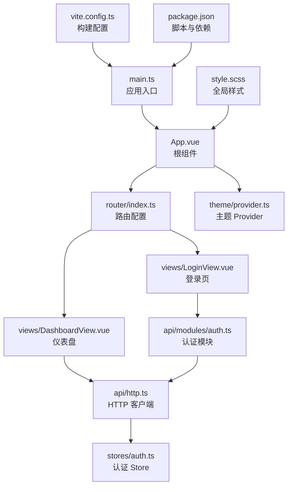

图表来源
- [frontend/src/main.ts:1-26](file://frontend/src/main.ts#L1-L26)
- [frontend/src/App.vue:1-45](file://frontend/src/App.vue#L1-L45)
- [frontend/src/router/index.ts:1-54](file://frontend/src/router/index.ts#L1-L54)
- [frontend/src/theme/provider.ts:1-97](file://frontend/src/theme/provider.ts#L1-L97)
- [frontend/src/api/http.ts:1-174](file://frontend/src/api/http.ts#L1-L174)
- [frontend/src/api/modules/auth.ts:1-110](file://frontend/src/api/modules/auth.ts#L1-L110)
- [frontend/src/views/LoginView.vue:1-157](file://frontend/src/views/LoginView.vue#L1-L157)
- [frontend/src/views/DashboardView.vue:1-348](file://frontend/src/views/DashboardView.vue#L1-L348)
- [frontend/src/style.scss:1-147](file://frontend/src/style.scss#L1-L147)
- [frontend/vite.config.ts:1-20](file://frontend/vite.config.ts#L1-L20)
- [frontend/package.json:1-36](file://frontend/package.json#L1-L36)

章节来源
- [frontend/src/main.ts:1-26](file://frontend/src/main.ts#L1-L26)
- [frontend/src/App.vue:1-45](file://frontend/src/App.vue#L1-L45)
- [frontend/src/router/index.ts:1-54](file://frontend/src/router/index.ts#L1-L54)
- [frontend/src/theme/provider.ts:1-97](file://frontend/src/theme/provider.ts#L1-L97)
- [frontend/src/api/http.ts:1-174](file://frontend/src/api/http.ts#L1-L174)
- [frontend/src/api/modules/auth.ts:1-110](file://frontend/src/api/modules/auth.ts#L1-L110)
- [frontend/src/views/LoginView.vue:1-157](file://frontend/src/views/LoginView.vue#L1-L157)
- [frontend/src/views/DashboardView.vue:1-348](file://frontend/src/views/DashboardView.vue#L1-L348)
- [frontend/src/style.scss:1-147](file://frontend/src/style.scss#L1-L147)
- [frontend/vite.config.ts:1-20](file://frontend/vite.config.ts#L1-L20)
- [frontend/package.json:1-36](file://frontend/package.json#L1-L36)
- [frontend/tsconfig.json:1-12](file://frontend/tsconfig.json#L1-L12)

## 核心组件
- 应用入口与挂载：main.ts 统一创建 Vue 实例、注入 Pinia、路由与 Ant Design Vue，并挂载根组件。
- 根组件：App.vue 通过 Ant Design Vue 的 ConfigProvider 包裹，注入全局主题配置，并提供主题切换浮层。
- 路由与导航：router/index.ts 定义登录与仪表盘路由，并通过前置守卫进行登录态校验。
- 认证状态：stores/auth.ts 使用 Pinia 管理访问令牌与登录态，持久化至 localStorage。
- 主题系统：theme/provider.ts 提供亮/暗模式切换、ANTD 主题算法与 CSS 变量联动。
- API 客户端：api/http.ts 封装 Axios，统一注入 Authorization 头、错误处理与 HTTP 方法。
- 视图组件：views/LoginView.vue 与 views/DashboardView.vue 分别实现登录与仪表盘功能。
- 类型体系：types/common.ts 与 types/domain.ts 定义通用与领域模型，保障前后端契约一致。
- 样式体系：style.scss 以 SCSS 变量与 CSS 变量实现品牌色与明暗主题切换。

章节来源
- [frontend/src/main.ts:1-26](file://frontend/src/main.ts#L1-L26)
- [frontend/src/App.vue:1-45](file://frontend/src/App.vue#L1-L45)
- [frontend/src/router/index.ts:1-54](file://frontend/src/router/index.ts#L1-L54)
- [frontend/src/stores/auth.ts:1-51](file://frontend/src/stores/auth.ts#L1-L51)
- [frontend/src/theme/provider.ts:1-97](file://frontend/src/theme/provider.ts#L1-L97)
- [frontend/src/api/http.ts:1-174](file://frontend/src/api/http.ts#L1-L174)
- [frontend/src/api/modules/auth.ts:1-110](file://frontend/src/api/modules/auth.ts#L1-L110)
- [frontend/src/views/LoginView.vue:1-157](file://frontend/src/views/LoginView.vue#L1-L157)
- [frontend/src/views/DashboardView.vue:1-348](file://frontend/src/views/DashboardView.vue#L1-L348)
- [frontend/src/types/common.ts:1-41](file://frontend/src/types/common.ts#L1-L41)
- [frontend/src/types/domain.ts:1-89](file://frontend/src/types/domain.ts#L1-L89)
- [frontend/src/style.scss:1-147](file://frontend/src/style.scss#L1-L147)

## 架构总览
前端采用“入口 -> 路由 -> 视图 -> API -> 状态”的单向数据流，结合主题 Provider 与全局样式，形成统一的视觉与交互体验。

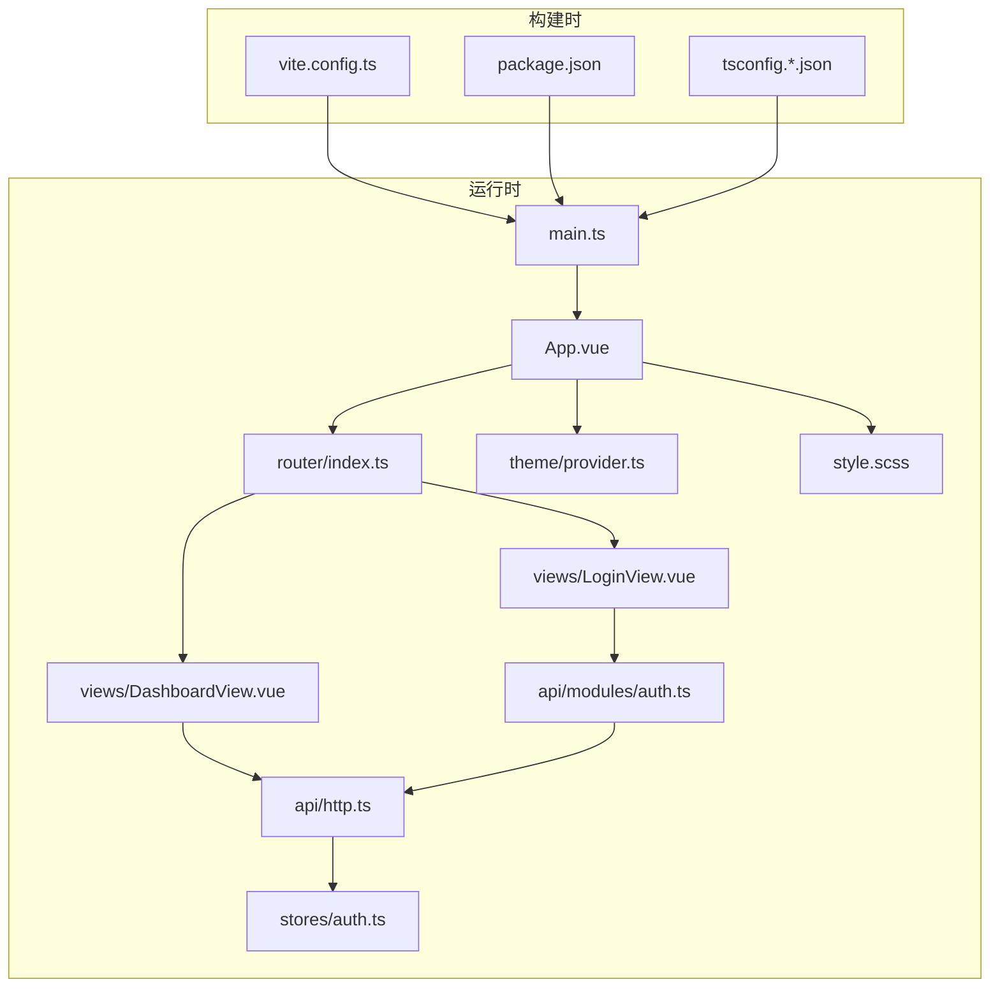

图表来源
- [frontend/src/main.ts:1-26](file://frontend/src/main.ts#L1-L26)
- [frontend/src/App.vue:1-45](file://frontend/src/App.vue#L1-L45)
- [frontend/src/router/index.ts:1-54](file://frontend/src/router/index.ts#L1-L54)
- [frontend/src/api/http.ts:1-174](file://frontend/src/api/http.ts#L1-L174)
- [frontend/src/api/modules/auth.ts:1-110](file://frontend/src/api/modules/auth.ts#L1-L110)
- [frontend/src/stores/auth.ts:1-51](file://frontend/src/stores/auth.ts#L1-L51)
- [frontend/src/theme/provider.ts:1-97](file://frontend/src/theme/provider.ts#L1-L97)
- [frontend/src/style.scss:1-147](file://frontend/src/style.scss#L1-L147)
- [frontend/vite.config.ts:1-20](file://frontend/vite.config.ts#L1-L20)
- [frontend/package.json:1-36](file://frontend/package.json#L1-L36)
- [frontend/tsconfig.json:1-12](file://frontend/tsconfig.json#L1-L12)

## 详细组件分析

### 应用入口与根组件
- 入口职责：创建 Vue 实例、安装插件（Pinia、Router、Antd）、引入全局样式并挂载。
- 根组件职责：提供 ConfigProvider 主题上下文，暴露主题切换控件，作为路由视图容器。

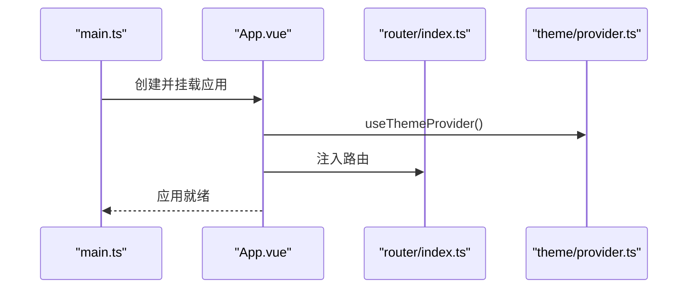

图表来源
- [frontend/src/main.ts:16-23](file://frontend/src/main.ts#L16-L23)
- [frontend/src/App.vue:19-28](file://frontend/src/App.vue#L19-L28)
- [frontend/src/router/index.ts:34-37](file://frontend/src/router/index.ts#L34-L37)
- [frontend/src/theme/provider.ts:53-96](file://frontend/src/theme/provider.ts#L53-L96)

章节来源
- [frontend/src/main.ts:1-26](file://frontend/src/main.ts#L1-L26)
- [frontend/src/App.vue:1-45](file://frontend/src/App.vue#L1-L45)

### 路由与认证守卫
- 路由表：包含重定向、登录与仪表盘三个页面，均采用异步加载。
- 登录守卫：非登录态访问受保护路由将重定向至登录；已登录访问登录页将重定向至仪表盘。

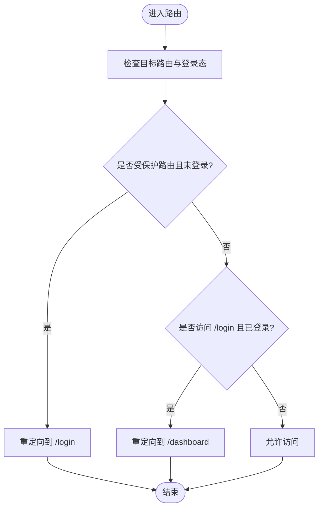

图表来源
- [frontend/src/router/index.ts:42-51](file://frontend/src/router/index.ts#L42-L51)

章节来源
- [frontend/src/router/index.ts:1-54](file://frontend/src/router/index.ts#L1-L54)

### 认证状态管理（Pinia）
- 数据：访问令牌与登录态计算属性。
- 行为：设置令牌（写入 localStorage）、清除令牌（删除 localStorage）。
- 与路由守卫配合，实现自动登出与页面跳转。

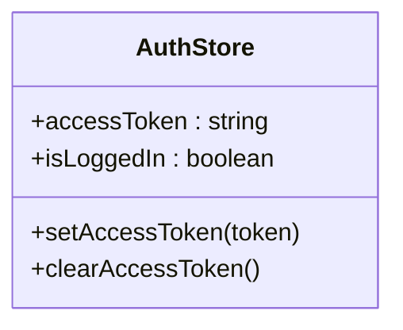

图表来源
- [frontend/src/stores/auth.ts:15-50](file://frontend/src/stores/auth.ts#L15-L50)

章节来源
- [frontend/src/stores/auth.ts:1-51](file://frontend/src/stores/auth.ts#L1-L51)

### 主题系统（Provider + CSS 变量）
- 功能：根据用户选择与系统偏好确定初始主题；切换亮/暗模式；持久化主题；通过 ANT Design Vue 主题算法与 CSS 变量联动。
- 根组件通过 ConfigProvider 注入主题配置，页面样式统一使用 CSS 变量。

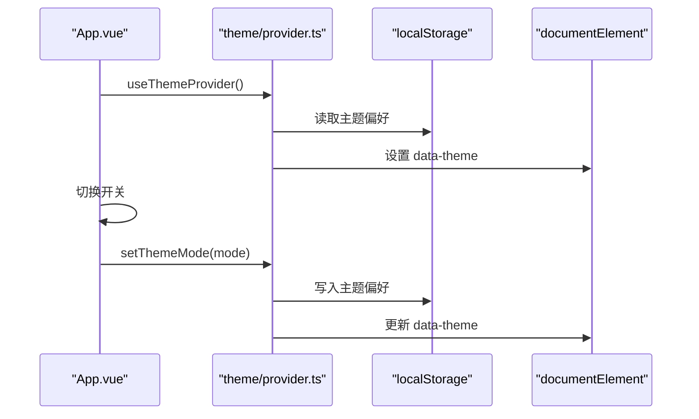

图表来源
- [frontend/src/App.vue:26-28](file://frontend/src/App.vue#L26-L28)
- [frontend/src/theme/provider.ts:39-48](file://frontend/src/theme/provider.ts#L39-L48)
- [frontend/src/theme/provider.ts:69-88](file://frontend/src/theme/provider.ts#L69-L88)

章节来源
- [frontend/src/theme/provider.ts:1-97](file://frontend/src/theme/provider.ts#L1-L97)
- [frontend/src/style.scss:56-113](file://frontend/src/style.scss#L56-L113)

### API 客户端（Axios 封装）
- 统一基地址与超时；自动注入 Authorization 头；统一错误处理（401 自动清空令牌并跳转登录）；提供 get/post/put/patch/delete 便捷方法；查询参数序列化支持 includes[]。
- 作为各领域模块的唯一请求出口，保证一致性与可测试性。

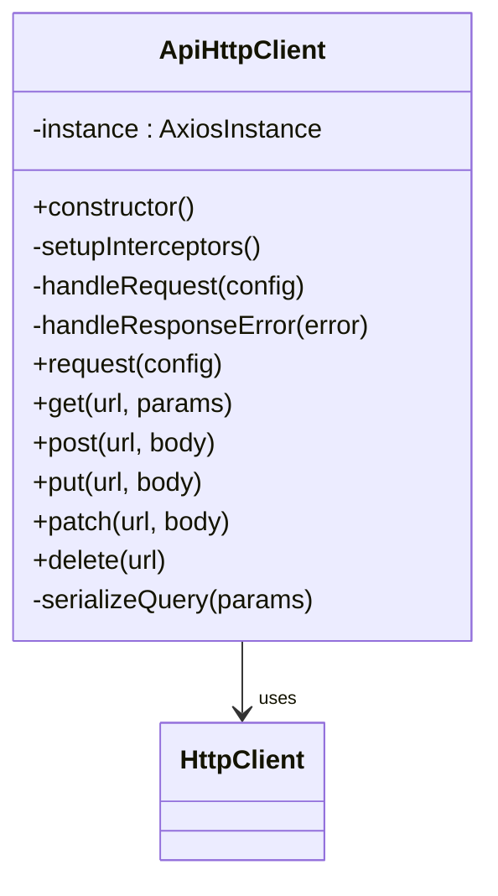

图表来源
- [frontend/src/api/http.ts:18-173](file://frontend/src/api/http.ts#L18-L173)

章节来源
- [frontend/src/api/http.ts:1-174](file://frontend/src/api/http.ts#L1-L174)

### 认证模块（登录/注册/当前用户）
- 定义登录与注册的请求/响应类型，封装调用后端接口的方法。
- 登录成功后将 access_token 写入认证 Store 并跳转仪表盘。

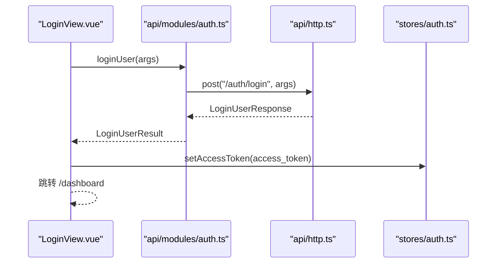

图表来源
- [frontend/src/views/LoginView.vue:69-82](file://frontend/src/views/LoginView.vue#L69-L82)
- [frontend/src/api/modules/auth.ts:79-86](file://frontend/src/api/modules/auth.ts#L79-L86)
- [frontend/src/api/http.ts:87-90](file://frontend/src/api/http.ts#L87-L90)
- [frontend/src/stores/auth.ts:31-42](file://frontend/src/stores/auth.ts#L31-L42)

章节来源
- [frontend/src/api/modules/auth.ts:1-110](file://frontend/src/api/modules/auth.ts#L1-L110)
- [frontend/src/views/LoginView.vue:1-157](file://frontend/src/views/LoginView.vue#L1-L157)

### 仪表盘视图（数据拉取与展示）
- 结构：侧边栏 + 头部 + 内容区，使用响应式栅格与卡片布局。
- 数据：使用 Promise.all 并行拉取团队与分配数据，计算统计卡片。
- 交互：刷新按钮、退出登录、菜单点击提示（后续扩展）。

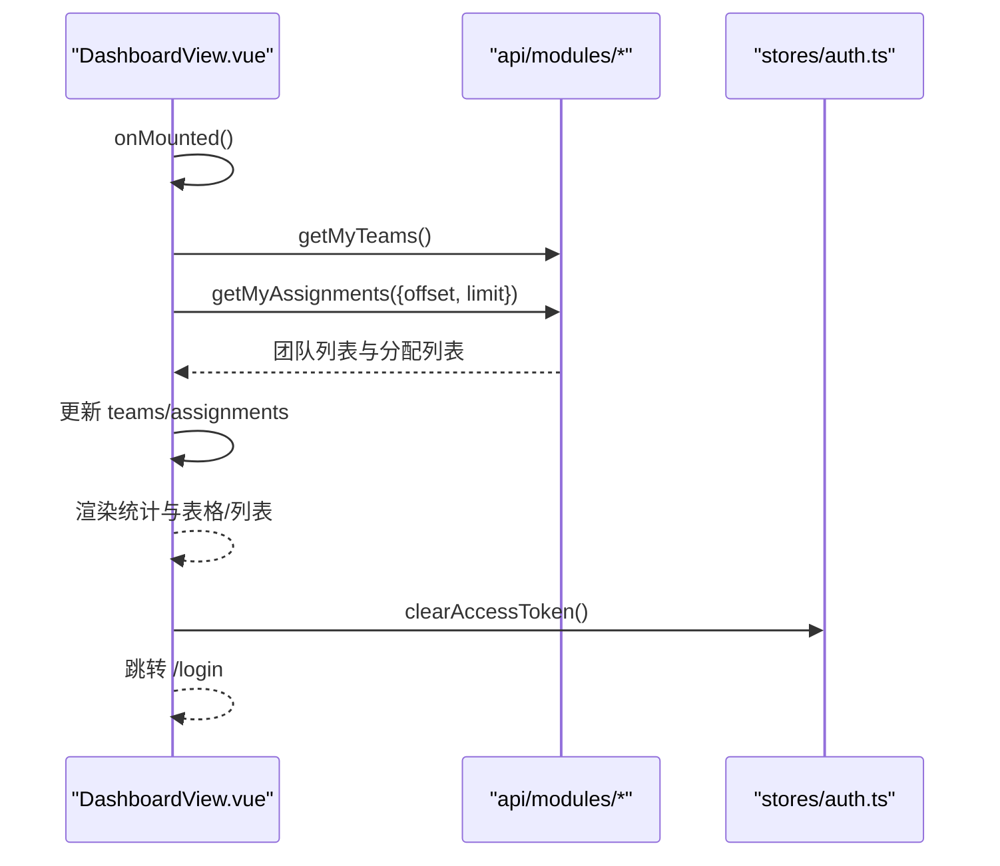

图表来源
- [frontend/src/views/DashboardView.vue:206-225](file://frontend/src/views/DashboardView.vue#L206-L225)
- [frontend/src/views/DashboardView.vue:230-233](file://frontend/src/views/DashboardView.vue#L230-L233)
- [frontend/src/stores/auth.ts:39-42](file://frontend/src/stores/auth.ts#L39-L42)

章节来源
- [frontend/src/views/DashboardView.vue:1-348](file://frontend/src/views/DashboardView.vue#L1-L348)

### 类型体系（通用与领域）
- 通用类型：分页参数、includes 查询、统一错误结构。
- 领域模型：用户、团队、工作集、漫画、章节、分配等。

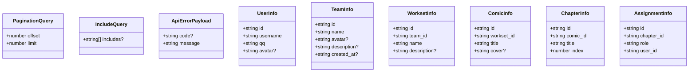

图表来源
- [frontend/src/types/common.ts:7-40](file://frontend/src/types/common.ts#L7-L40)
- [frontend/src/types/domain.ts:7-88](file://frontend/src/types/domain.ts#L7-L88)

章节来源
- [frontend/src/types/common.ts:1-41](file://frontend/src/types/common.ts#L1-L41)
- [frontend/src/types/domain.ts:1-89](file://frontend/src/types/domain.ts#L1-L89)

### 样式与响应式布局
- 品牌色与明暗主题：通过 SCSS 变量与 CSS 变量映射，根元素 data-theme 控制主题切换。
- 登录页与仪表盘：使用 CSS Grid、Flex 与响应式断点，适配移动端与桌面端。
- 抽象阴影、渐变与模糊效果：统一通过变量控制，便于主题一致性。

章节来源
- [frontend/src/style.scss:1-147](file://frontend/src/style.scss#L1-L147)
- [frontend/src/views/LoginView.vue:85-156](file://frontend/src/views/LoginView.vue#L85-L156)
- [frontend/src/views/DashboardView.vue:270-347](file://frontend/src/views/DashboardView.vue#L270-L347)

## 依赖关系分析
- 运行时依赖：Vue 3、Pinia、Vue Router、Ant Design Vue、Axios。
- 开发依赖：Vite、TypeScript、ESLint、Vue ESLint Parser、Sass、Vue TSC。
- 构建与脚本：dev、build、lint、type-check、preview。

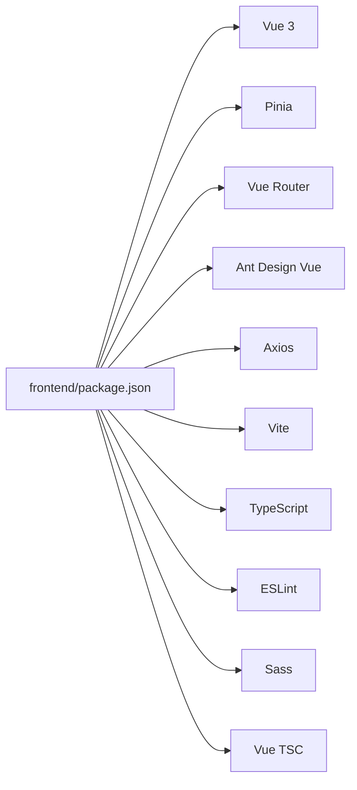

图表来源
- [frontend/package.json:13-34](file://frontend/package.json#L13-L34)

章节来源
- [frontend/package.json:1-36](file://frontend/package.json#L1-L36)
- [frontend/tsconfig.json:1-12](file://frontend/tsconfig.json#L1-L12)

## 性能考虑
- 资源加载：路由视图采用异步加载，减少首屏体积。
- 并行请求：仪表盘使用 Promise.all 并行拉取数据，缩短首屏等待。
- 缓存策略：认证令牌本地持久化，避免重复登录；主题偏好本地持久化，减少重复计算。
- 样式体积：CSS 变量集中管理，避免重复定义；按需引入 ANT Design Vue 组件样式。
- 构建优化：Vite 快速冷启动与热更新；TypeScript 类型检查与 ESLint 在构建阶段执行，提前发现潜在问题。

## 故障排查指南
- 登录后跳转异常
  - 检查路由守卫逻辑与认证 Store 的 isLoggedIn 状态。
  - 章节来源
    - [frontend/src/router/index.ts:42-51](file://frontend/src/router/index.ts#L42-L51)
    - [frontend/src/stores/auth.ts:26](file://frontend/src/stores/auth.ts#L26)
- 401 未授权
  - 检查请求头是否正确注入 Authorization；确认本地令牌存在；确认自动跳转逻辑。
  - 章节来源
    - [frontend/src/api/http.ts:54-62](file://frontend/src/api/http.ts#L54-L62)
    - [frontend/src/api/http.ts:74-79](file://frontend/src/api/http.ts#L74-L79)
- 主题切换无效
  - 检查 data-theme 是否更新；确认 CSS 变量覆盖顺序。
  - 章节来源
    - [frontend/src/theme/provider.ts:80-88](file://frontend/src/theme/provider.ts#L80-L88)
    - [frontend/src/style.scss:90-113](file://frontend/src/style.scss#L90-L113)
- 构建报错
  - 检查类型检查与 ESLint 警告阈值；确认 Vite 配置与路径别名。
  - 章节来源
    - [frontend/package.json:8-11](file://frontend/package.json#L8-L11)
    - [frontend/vite.config.ts:12-19](file://frontend/vite.config.ts#L12-L19)

## 结论
本前端架构以 Vue 3 + TypeScript 为基础，结合 Pinia、Vue Router、Ant Design Vue 与 Axios，构建了清晰的分层与职责边界：入口与根组件负责初始化与主题上下文；路由与守卫保障安全访问；状态管理聚焦认证；API 客户端统一处理鉴权与错误；视图组件承载业务；类型体系与样式体系保障一致性与可维护性。整体方案具备良好的扩展性与可演进空间，适合持续迭代。

## 附录
- 开发工具链
  - 构建：Vite
  - 类型：TypeScript
  - 代码规范：ESLint + Vue ESLint Parser
  - 样式：Sass
  - 类型检查：Vue TSC
- 构建与预览
  - 开发：pnpm dev
  - 构建：pnpm build（含 lint 与类型检查）
  - 预览：pnpm preview
- 部署建议
  - 将 dist 目录部署至静态服务器或反向代理；确保 /api/v1 前缀代理到后端服务；保持路由 history 模式与服务端回退配置一致。

章节来源
- [frontend/package.json:6-11](file://frontend/package.json#L6-L11)
- [frontend/vite.config.ts:12-19](file://frontend/vite.config.ts#L12-L19)
- [frontend/tsconfig.app.json](file://frontend/tsconfig.app.json)
- [frontend/tsconfig.node.json](file://frontend/tsconfig.node.json)