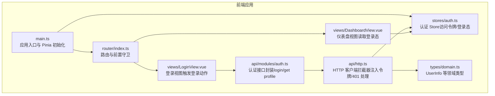
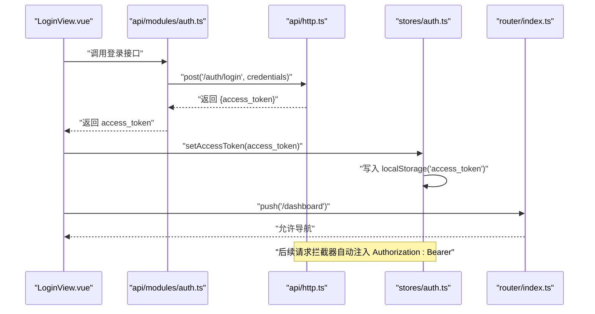
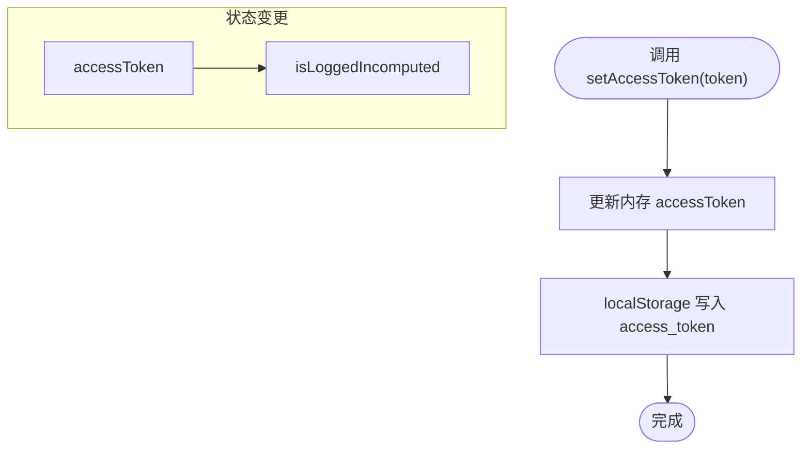
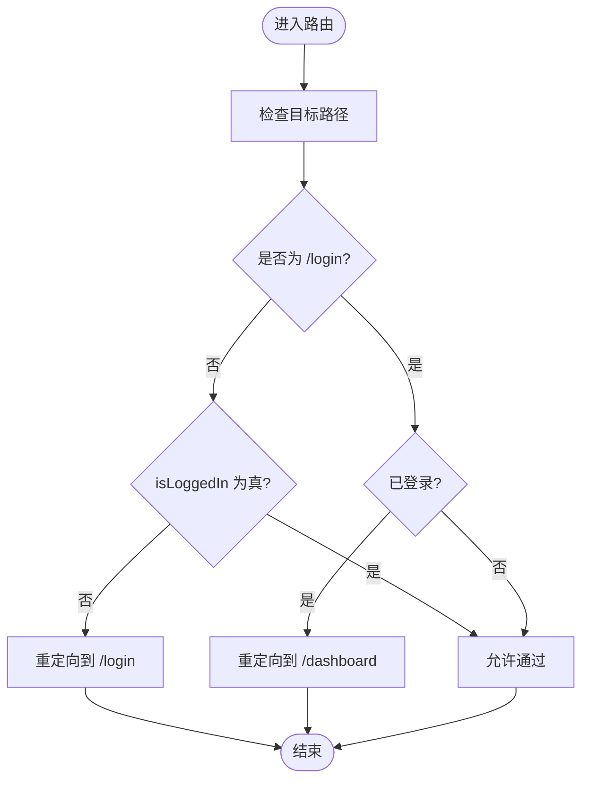
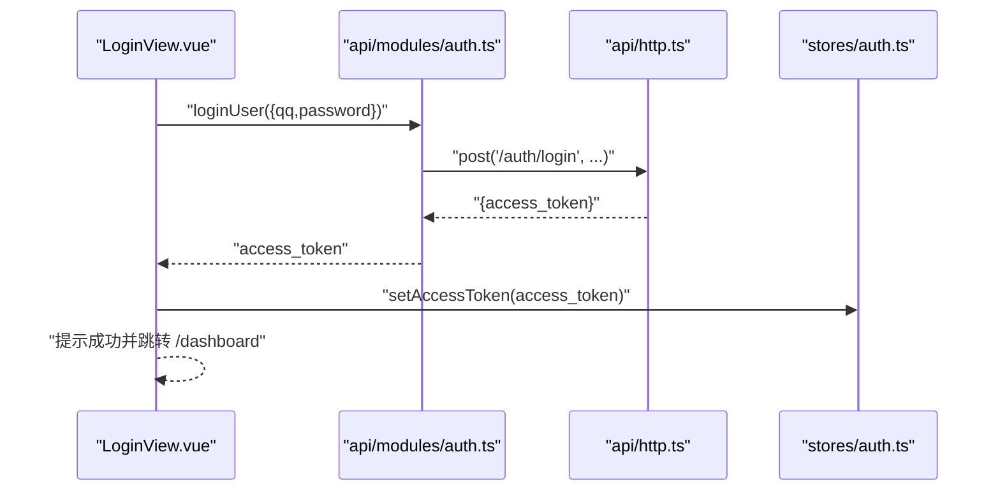
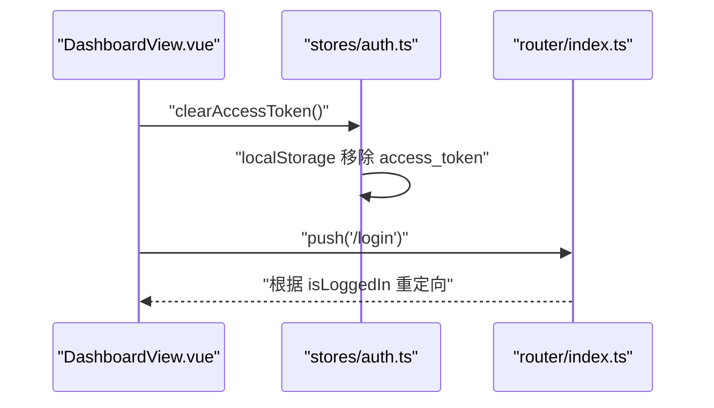
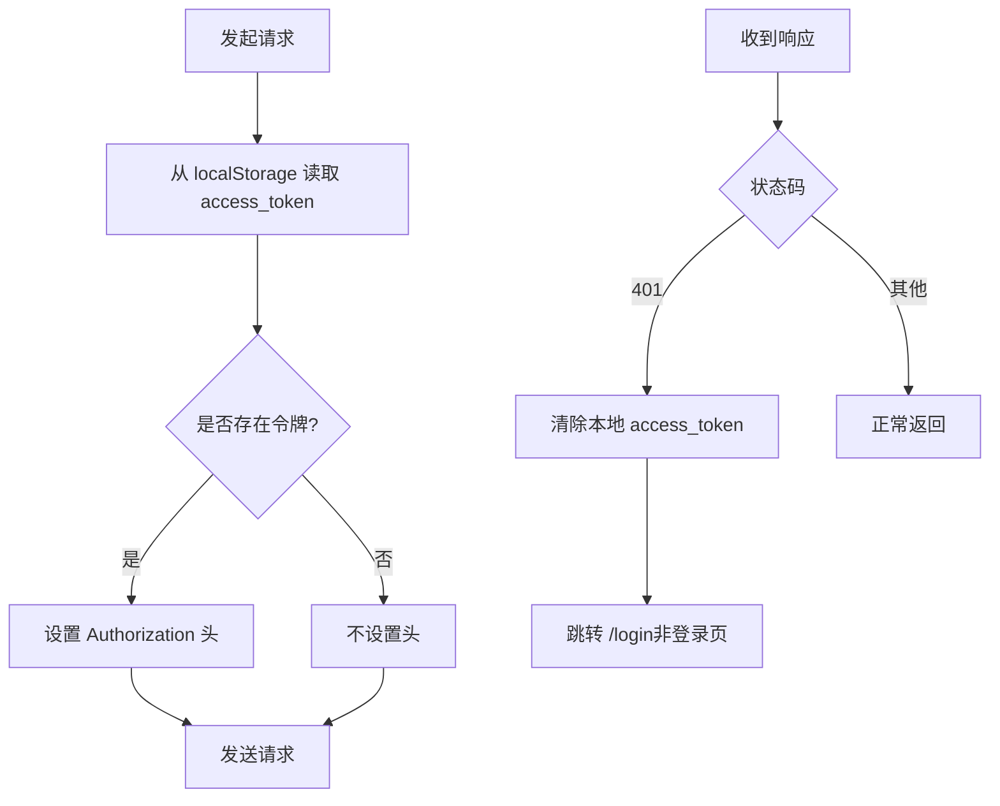
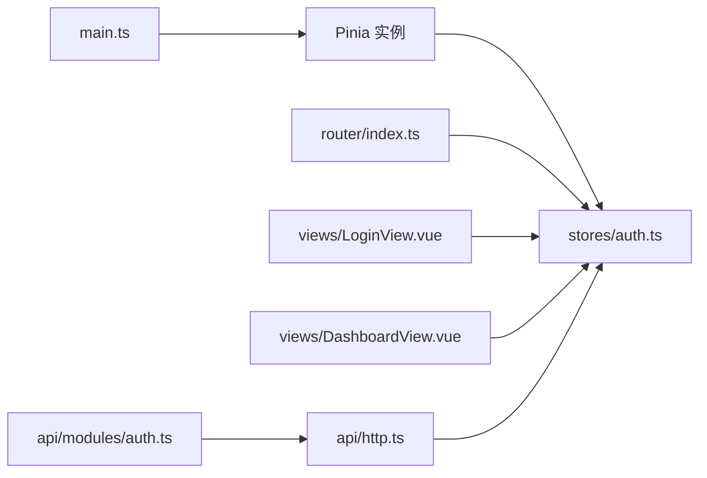

# 状态管理

<cite>
**本文引用的文件**
- [frontend/src/stores/auth.ts](file://frontend/src/stores/auth.ts)
- [frontend/src/main.ts](file://frontend/src/main.ts)
- [frontend/src/router/index.ts](file://frontend/src/router/index.ts)
- [frontend/src/views/LoginView.vue](file://frontend/src/views/LoginView.vue)
- [frontend/src/views/DashboardView.vue](file://frontend/src/views/DashboardView.vue)
- [frontend/src/api/http.ts](file://frontend/src/api/http.ts)
- [frontend/src/api/modules/auth.ts](file://frontend/src/api/modules/auth.ts)
- [frontend/src/types/domain.ts](file://frontend/src/types/domain.ts)
- [frontend/package.json](file://frontend/package.json)
</cite>

## 目录
1. [简介](#简介)
2. [项目结构](#项目结构)
3. [核心组件](#核心组件)
4. [架构总览](#架构总览)
5. [详细组件分析](#详细组件分析)
6. [依赖关系分析](#依赖关系分析)
7. [性能考量](#性能考量)
8. [故障排查指南](#故障排查指南)
9. [结论](#结论)
10. [附录](#附录)

## 简介
本文件面向 poprako-web-ms 前端（Vue 3 + Pinia）的状态管理设计，聚焦于基于组合式 Store 的认证状态管理与全局状态同步机制。文档围绕以下目标展开：
- 解释认证状态管理（访问令牌与登录态）
- 说明用户信息类型模型与 API 接口
- 展示状态持久化、状态重置与状态监听的最佳实践
- 提供状态管理流程图与代码示例路径，帮助开发者快速理解与落地

## 项目结构
前端采用模块化组织，状态管理集中在 stores 目录；路由守卫与视图组件共同驱动登录态控制；HTTP 层通过拦截器统一注入令牌与处理 401 场景。

图表来源
- [frontend/src/main.ts:16-23](file://frontend/src/main.ts#L16-L23)
- [frontend/src/router/index.ts:42-51](file://frontend/src/router/index.ts#L42-L51)
- [frontend/src/stores/auth.ts:15-50](file://frontend/src/stores/auth.ts#L15-L50)
- [frontend/src/views/LoginView.vue:69-82](file://frontend/src/views/LoginView.vue#L69-L82)
- [frontend/src/views/DashboardView.vue:230-233](file://frontend/src/views/DashboardView.vue#L230-L233)
- [frontend/src/api/http.ts:38-82](file://frontend/src/api/http.ts#L38-L82)
- [frontend/src/api/modules/auth.ts:79-109](file://frontend/src/api/modules/auth.ts#L79-L109)
- [frontend/src/types/domain.ts:7-16](file://frontend/src/types/domain.ts#L7-L16)

章节来源
- [frontend/src/main.ts:16-23](file://frontend/src/main.ts#L16-L23)
- [frontend/src/router/index.ts:42-51](file://frontend/src/router/index.ts#L42-L51)
- [frontend/src/stores/auth.ts:15-50](file://frontend/src/stores/auth.ts#L15-L50)

## 核心组件
- 认证 Store（useAuthStore）
  - 状态：accessToken（ref）、isLoggedIn（computed）
  - 动作：setAccessToken、clearAccessToken
  - 持久化：通过 localStorage 同步访问令牌
- 路由守卫
  - 在导航到非登录页且未登录时重定向至登录页
  - 在访问登录页且已登录时重定向至仪表盘
- 视图组件
  - 登录视图：调用登录接口，成功后写入访问令牌并跳转
  - 仪表盘视图：读取登录态，提供退出登录动作
- HTTP 客户端
  - 请求拦截：从 localStorage 读取令牌并注入 Authorization 头
  - 响应拦截：401 时清理本地令牌并跳转登录页

章节来源
- [frontend/src/stores/auth.ts:15-50](file://frontend/src/stores/auth.ts#L15-L50)
- [frontend/src/router/index.ts:42-51](file://frontend/src/router/index.ts#L42-L51)
- [frontend/src/views/LoginView.vue:69-82](file://frontend/src/views/LoginView.vue#L69-L82)
- [frontend/src/views/DashboardView.vue:230-233](file://frontend/src/views/DashboardView.vue#L230-L233)
- [frontend/src/api/http.ts:38-82](file://frontend/src/api/http.ts#L38-L82)

## 架构总览
下面的序列图展示了“登录—令牌持久化—路由守卫—后续请求”的完整链路。

图表来源
- [frontend/src/views/LoginView.vue:69-82](file://frontend/src/views/LoginView.vue#L69-L82)
- [frontend/src/api/modules/auth.ts:79-86](file://frontend/src/api/modules/auth.ts#L79-L86)
- [frontend/src/api/http.ts:38-62](file://frontend/src/api/http.ts#L38-L62)
- [frontend/src/stores/auth.ts:31-42](file://frontend/src/stores/auth.ts#L31-L42)
- [frontend/src/router/index.ts:42-51](file://frontend/src/router/index.ts#L42-L51)

## 详细组件分析

### 认证 Store（useAuthStore）
- 设计要点
  - 使用组合式 API 定义 Store，便于与 Vue 响应式系统无缝集成
  - 将访问令牌与登录态分离：accessToken 为 ref，isLoggedIn 为 computed
  - 通过 localStorage 实现跨会话持久化
- 状态
  - accessToken：当前访问令牌
  - isLoggedIn：基于 accessToken 长度判断是否已登录
- 动作
  - setAccessToken：更新内存值并同步到 localStorage
  - clearAccessToken：清空内存值并移除 localStorage 中的令牌
- 最佳实践
  - 在应用入口初始化 Pinia，确保 Store 可用
  - 在路由守卫中读取 isLoggedIn 进行权限控制
  - 在退出登录时调用 clearAccessToken 并重定向

图表来源
- [frontend/src/stores/auth.ts:19-21](file://frontend/src/stores/auth.ts#L19-L21)
- [frontend/src/stores/auth.ts:26](file://frontend/src/stores/auth.ts#L26)
- [frontend/src/stores/auth.ts:31-42](file://frontend/src/stores/auth.ts#L31-L42)

章节来源
- [frontend/src/stores/auth.ts:15-50](file://frontend/src/stores/auth.ts#L15-L50)

### 路由守卫与登录态控制
- 控制逻辑
  - 非登录页且未登录：重定向到 /login
  - 登录页且已登录：重定向到 /dashboard
- 实现位置
  - 路由前置守卫在 router/index.ts 中定义
  - 登录态来源于 useAuthStore().isLoggedIn

图表来源
- [frontend/src/router/index.ts:42-51](file://frontend/src/router/index.ts#L42-L51)
- [frontend/src/stores/auth.ts:26](file://frontend/src/stores/auth.ts#L26)

章节来源
- [frontend/src/router/index.ts:42-51](file://frontend/src/router/index.ts#L42-L51)

### 登录视图与认证流程
- 流程说明
  - 用户输入凭据并提交
  - 调用登录接口获取 access_token
  - 写入 Store 并持久化
  - 成功提示后跳转到仪表盘
- 关键点
  - 登录成功后立即写入 Store，使 isLoggedIn 即刻生效
  - 路由守卫会根据 isLoggedIn 自动放行

图表来源
- [frontend/src/views/LoginView.vue:69-82](file://frontend/src/views/LoginView.vue#L69-L82)
- [frontend/src/api/modules/auth.ts:79-86](file://frontend/src/api/modules/auth.ts#L79-L86)
- [frontend/src/api/http.ts:87-90](file://frontend/src/api/http.ts#L87-L90)
- [frontend/src/stores/auth.ts:31-42](file://frontend/src/stores/auth.ts#L31-L42)

章节来源
- [frontend/src/views/LoginView.vue:69-82](file://frontend/src/views/LoginView.vue#L69-L82)
- [frontend/src/api/modules/auth.ts:79-86](file://frontend/src/api/modules/auth.ts#L79-L86)

### 仪表盘视图与退出登录
- 仪表盘读取登录态并展示内容
- 退出登录时调用 clearAccessToken 并跳转回登录页
- 由于 isLoggedIn 依赖 accessToken，清空后路由守卫会将其重定向到登录页

图表来源
- [frontend/src/views/DashboardView.vue:230-233](file://frontend/src/views/DashboardView.vue#L230-L233)
- [frontend/src/stores/auth.ts:39-42](file://frontend/src/stores/auth.ts#L39-L42)
- [frontend/src/router/index.ts:42-51](file://frontend/src/router/index.ts#L42-L51)

章节来源
- [frontend/src/views/DashboardView.vue:230-233](file://frontend/src/views/DashboardView.vue#L230-L233)

### HTTP 客户端与令牌注入
- 请求拦截
  - 从 localStorage 读取 access_token
  - 若存在则在请求头添加 Authorization: Bearer
- 响应拦截
  - 对 401 错误清理本地令牌并跳转到登录页
- 作用
  - 保证后续请求自动携带令牌
  - 统一处理未授权场景，避免各处重复逻辑

图表来源
- [frontend/src/api/http.ts:38-82](file://frontend/src/api/http.ts#L38-L82)

章节来源
- [frontend/src/api/http.ts:38-82](file://frontend/src/api/http.ts#L38-L82)

### 用户信息类型模型
- UserInfo
  - 字段：id、username、qq、avatar?
  - 用途：登录成功后服务端返回的用户信息
- 其他领域类型（TeamInfo、WorksetInfo、ComicInfo、ChapterInfo、AssignmentInfo）在同文件中定义，用于仪表盘等页面的数据展示与交互

章节来源
- [frontend/src/types/domain.ts:7-16](file://frontend/src/types/domain.ts#L7-L16)

## 依赖关系分析
- 应用入口
  - main.ts 初始化 Pinia 并注入应用，确保 Store 可用
- 认证 Store
  - 被路由守卫与视图组件共同依赖
  - 与 localStorage 交互实现持久化
- HTTP 客户端
  - 与 Store 解耦，通过拦截器自动注入令牌
  - 401 时清理令牌，间接影响 Store 的 isLoggedIn
- 路由守卫
  - 依赖 Store 的 isLoggedIn 进行导航控制

图表来源
- [frontend/src/main.ts:16-23](file://frontend/src/main.ts#L16-L23)
- [frontend/src/stores/auth.ts:15-50](file://frontend/src/stores/auth.ts#L15-L50)
- [frontend/src/router/index.ts:42-51](file://frontend/src/router/index.ts#L42-L51)
- [frontend/src/views/LoginView.vue:54-58](file://frontend/src/views/LoginView.vue#L54-L58)
- [frontend/src/views/DashboardView.vue:109](file://frontend/src/views/DashboardView.vue#L109)
- [frontend/src/api/modules/auth.ts:79-86](file://frontend/src/api/modules/auth.ts#L79-L86)
- [frontend/src/api/http.ts:38-62](file://frontend/src/api/http.ts#L38-L62)

章节来源
- [frontend/src/main.ts:16-23](file://frontend/src/main.ts#L16-L23)
- [frontend/src/stores/auth.ts:15-50](file://frontend/src/stores/auth.ts#L15-L50)
- [frontend/src/router/index.ts:42-51](file://frontend/src/router/index.ts#L42-L51)
- [frontend/src/api/modules/auth.ts:79-86](file://frontend/src/api/modules/auth.ts#L79-L86)
- [frontend/src/api/http.ts:38-62](file://frontend/src/api/http.ts#L38-L62)

## 性能考量
- Store 粒度
  - 认证 Store 仅包含访问令牌与登录态，保持轻量，避免不必要的响应式开销
- 持久化策略
  - 令牌持久化使用 localStorage，读写成本低，适合高频访问
- 请求拦截
  - 令牌注入在请求拦截器中完成，避免在每个 API 调用中重复设置
- 导航守卫
  - 仅进行简单布尔判断，性能开销极小

## 故障排查指南
- 登录后仍被重定向到登录页
  - 检查登录接口是否正确返回 access_token
  - 确认 Store 的 setAccessToken 是否被调用
  - 核对 localStorage 中是否存在 access_token
- 401 未授权频繁出现
  - 检查请求头是否包含正确的 Authorization 头
  - 确认服务端令牌有效期与刷新策略
  - 查看响应拦截器是否在 401 时清理了本地令牌
- 退出登录后仍显示登录态
  - 确认 clearAccessToken 是否被调用
  - 检查路由守卫是否正确读取 isLoggedIn

章节来源
- [frontend/src/api/http.ts:74-82](file://frontend/src/api/http.ts#L74-L82)
- [frontend/src/stores/auth.ts:39-42](file://frontend/src/stores/auth.ts#L39-L42)
- [frontend/src/router/index.ts:42-51](file://frontend/src/router/index.ts#L42-L51)

## 结论
本项目采用 Pinia 组合式 Store 管理认证状态，结合路由守卫与 HTTP 拦截器实现了简洁可靠的登录态控制与令牌持久化。通过将登录态与令牌解耦、在拦截器中统一处理鉴权与 401 场景，整体架构具备良好的可维护性与扩展性。建议后续在用户信息与团队/任务等全局状态上复用相同模式，逐步完善 Store 的分层与职责边界。

## 附录
- 依赖版本（摘自 package.json）
  - vue: ^3.5.13
  - pinia: ^3.0.3
  - axios: ^1.8.4
  - vue-router: ^4.5.0

章节来源
- [frontend/package.json:13-19](file://frontend/package.json#L13-L19)