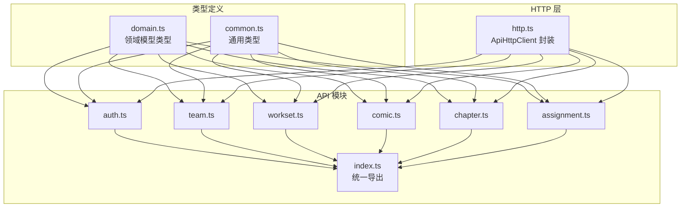
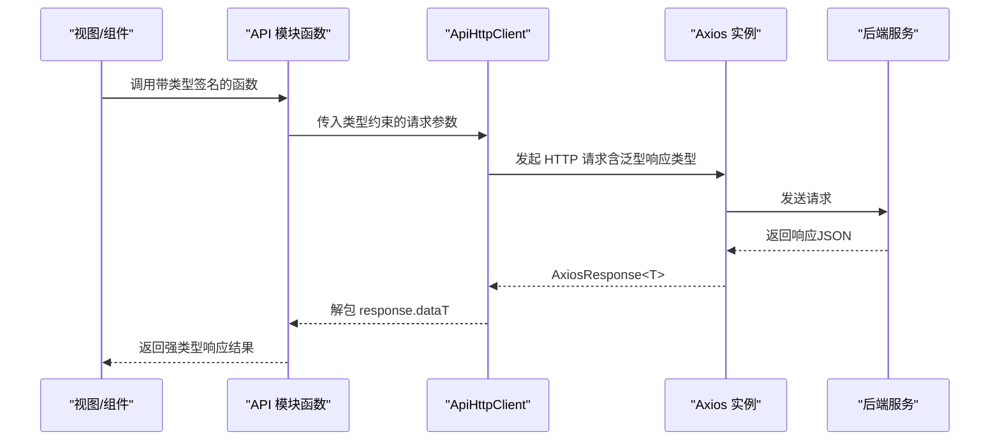
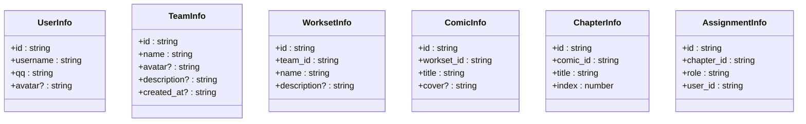
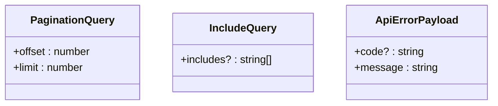
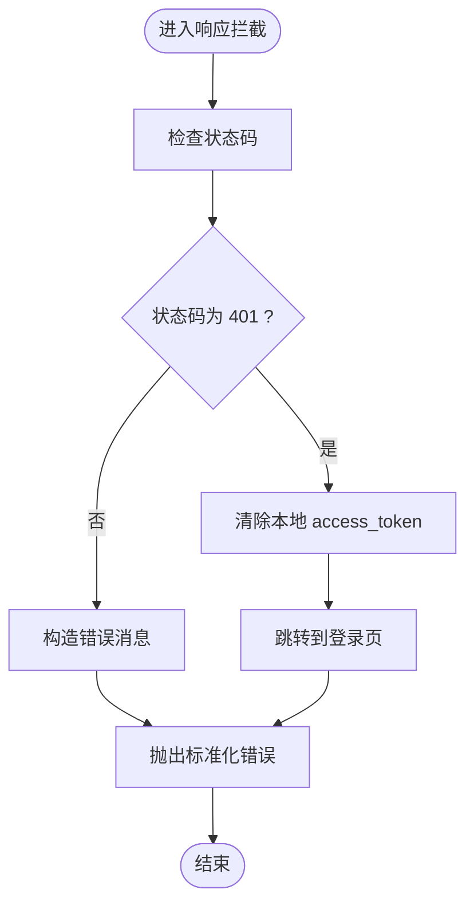
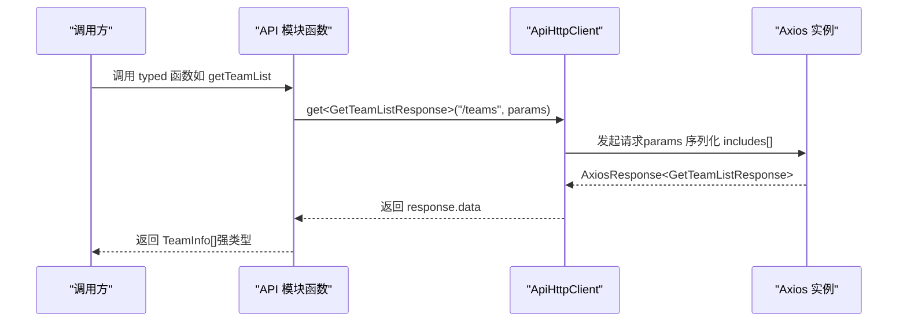
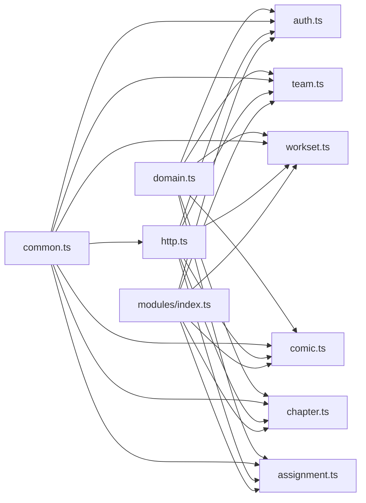

# 类型系统

<cite>
**本文引用的文件**
- [frontend/src/types/domain.ts](file://frontend/src/types/domain.ts)
- [frontend/src/types/common.ts](file://frontend/src/types/common.ts)
- [frontend/src/api/http.ts](file://frontend/src/api/http.ts)
- [frontend/src/api/modules/index.ts](file://frontend/src/api/modules/index.ts)
- [frontend/src/api/modules/auth.ts](file://frontend/src/api/modules/auth.ts)
- [frontend/src/api/modules/team.ts](file://frontend/src/api/modules/team.ts)
- [frontend/src/api/modules/workset.ts](file://frontend/src/api/modules/workset.ts)
- [frontend/src/api/modules/comic.ts](file://frontend/src/api/modules/comic.ts)
- [frontend/src/api/modules/chapter.ts](file://frontend/src/api/modules/chapter.ts)
- [frontend/src/api/modules/assignment.ts](file://frontend/src/api/modules/assignment.ts)
- [frontend/tsconfig.json](file://frontend/tsconfig.json)
- [frontend/package.json](file://frontend/package.json)
- [frontend/src/env.d.ts](file://frontend/src/env.d.ts)
</cite>

## 目录
1. [引言](#引言)
2. [项目结构](#项目结构)
3. [核心组件](#核心组件)
4. [架构总览](#架构总览)
5. [详细组件分析](#详细组件分析)
6. [依赖分析](#依赖分析)
7. [性能考虑](#性能考虑)
8. [故障排查指南](#故障排查指南)
9. [结论](#结论)
10. [附录](#附录)

## 引言
本文件系统性梳理前端类型系统的设计与实践，聚焦于 TypeScript 在项目中的应用策略与类型设计原则。重点覆盖以下方面：
- 领域模型类型：domain.ts 中的 UserInfo、TeamInfo、WorksetInfo、ComicInfo、ChapterInfo、AssignmentInfo 等。
- 通用类型声明：common.ts 中的分页参数、关联展开参数、统一错误结构等。
- API 模块类型：各模块中请求/响应类型、查询参数类型、返回值类型与接口函数签名。
- 设计模式与最佳实践：接口设计模式、类型别名、泛型约束、类型推导、类型断言与类型守卫。
- 前后端类型映射：基于 Swagger 的领域对象映射与 API 响应类型的严格定义。
- 错误处理与统一策略：统一错误结构、拦截器中的错误处理与未授权处理。
- 性能与可维护性：类型系统的性能影响、重构策略与维护指南。

## 项目结构
前端类型系统主要分布在如下位置：
- 类型定义：frontend/src/types/domain.ts、frontend/src/types/common.ts
- HTTP 请求与拦截器：frontend/src/api/http.ts
- API 模块：frontend/src/api/modules/*.ts（auth、team、workset、comic、chapter、assignment）
- 统一导出入口：frontend/src/api/modules/index.ts
- TypeScript 配置：frontend/tsconfig.json、frontend/src/env.d.ts
- 依赖与脚本：frontend/package.json

图表来源
- [frontend/src/types/domain.ts:1-89](file://frontend/src/types/domain.ts#L1-L89)
- [frontend/src/types/common.ts:1-41](file://frontend/src/types/common.ts#L1-L41)
- [frontend/src/api/http.ts:1-174](file://frontend/src/api/http.ts#L1-L174)
- [frontend/src/api/modules/index.ts:1-10](file://frontend/src/api/modules/index.ts#L1-L10)
- [frontend/src/api/modules/auth.ts:1-110](file://frontend/src/api/modules/auth.ts#L1-L110)
- [frontend/src/api/modules/team.ts:1-81](file://frontend/src/api/modules/team.ts#L1-L81)
- [frontend/src/api/modules/workset.ts:1-72](file://frontend/src/api/modules/workset.ts#L1-L72)
- [frontend/src/api/modules/comic.ts:1-70](file://frontend/src/api/modules/comic.ts#L1-L70)
- [frontend/src/api/modules/chapter.ts:1-72](file://frontend/src/api/modules/chapter.ts#L1-L72)
- [frontend/src/api/modules/assignment.ts:1-99](file://frontend/src/api/modules/assignment.ts#L1-L99)

章节来源
- [frontend/src/types/domain.ts:1-89](file://frontend/src/types/domain.ts#L1-L89)
- [frontend/src/types/common.ts:1-41](file://frontend/src/types/common.ts#L1-L41)
- [frontend/src/api/http.ts:1-174](file://frontend/src/api/http.ts#L1-L174)
- [frontend/src/api/modules/index.ts:1-10](file://frontend/src/api/modules/index.ts#L1-L10)

## 核心组件
- 领域模型类型（domain.ts）
  - UserInfo：用户信息，包含唯一标识、用户名、QQ、头像等字段。
  - TeamInfo：团队信息，包含唯一标识、名称、头像、描述、创建时间等。
  - WorksetInfo：工作集信息，包含唯一标识、所属团队、名称、描述等。
  - ComicInfo：漫画信息，包含唯一标识、所属工作集、标题、封面等。
  - ChapterInfo：章节信息，包含唯一标识、所属漫画、标题、序号等。
  - AssignmentInfo：分配信息，包含唯一标识、所属章节、角色、被分配用户等。
- 通用类型（common.ts）
  - PaginationQuery：分页查询参数，包含 offset 与 limit。
  - IncludeQuery：Swagger 中 includes[] 查询参数，包含可选的 includes 字符串数组。
  - ApiErrorPayload：统一 API 错误结构，包含可选 code 与必填 message。
- HTTP 请求层（http.ts）
  - ApiHttpClient：Axios 封装，负责基础配置、请求头注入、错误标准化与通用方法封装。
  - 泛型方法：request、get、post、put、patch、delete，支持对响应类型进行约束。
  - 查询参数序列化：兼容 includes[] 数组格式。
- API 模块类型与函数
  - 各模块均以“请求参数类型”+“响应类型”的方式明确定义，便于调用方按类型安全地使用。
  - 使用类型别名简化重复结构，如 GetXxxListRequest = XxxListQuery。
  - 通过 extends 组合通用类型，如 ChapterListQuery extends PaginationQuery & IncludeQuery。

章节来源
- [frontend/src/types/domain.ts:1-89](file://frontend/src/types/domain.ts#L1-L89)
- [frontend/src/types/common.ts:1-41](file://frontend/src/types/common.ts#L1-L41)
- [frontend/src/api/http.ts:1-174](file://frontend/src/api/http.ts#L1-L174)
- [frontend/src/api/modules/auth.ts:1-110](file://frontend/src/api/modules/auth.ts#L1-L110)
- [frontend/src/api/modules/team.ts:1-81](file://frontend/src/api/modules/team.ts#L1-L81)
- [frontend/src/api/modules/workset.ts:1-72](file://frontend/src/api/modules/workset.ts#L1-L72)
- [frontend/src/api/modules/comic.ts:1-70](file://frontend/src/api/modules/comic.ts#L1-L70)
- [frontend/src/api/modules/chapter.ts:1-72](file://frontend/src/api/modules/chapter.ts#L1-L72)
- [frontend/src/api/modules/assignment.ts:1-99](file://frontend/src/api/modules/assignment.ts#L1-L99)

## 架构总览
类型系统在前端的职责是：
- 为领域模型提供稳定的数据契约，确保跨模块一致理解。
- 为 API 层提供严格的请求/响应类型约束，减少运行时错误。
- 通过统一错误结构与拦截器，保证错误处理的一致性与可追踪性。

图表来源
- [frontend/src/api/http.ts:87-90](file://frontend/src/api/http.ts#L87-L90)
- [frontend/src/api/modules/auth.ts:79-86](file://frontend/src/api/modules/auth.ts#L79-L86)
- [frontend/src/api/modules/team.ts:53-66](file://frontend/src/api/modules/team.ts#L53-L66)
- [frontend/src/api/modules/workset.ts:53-71](file://frontend/src/api/modules/workset.ts#L53-L71)
- [frontend/src/api/modules/comic.ts:51-69](file://frontend/src/api/modules/comic.ts#L51-L69)
- [frontend/src/api/modules/chapter.ts:53-71](file://frontend/src/api/modules/chapter.ts#L53-L71)
- [frontend/src/api/modules/assignment.ts:63-98](file://frontend/src/api/modules/assignment.ts#L63-L98)

## 详细组件分析

### 领域模型类型（domain.ts）
- 设计要点
  - 使用接口定义不可变的领域对象，字段命名与后端 Swagger 对齐。
  - 可选字段用于表达“未设置/可空”的语义，避免使用联合类型造成不必要的复杂度。
  - 保持字段粒度与后端 value.* 对象一一对应，便于序列化/反序列化。
- 典型关系
  - 用户与团队：一对多（用户属于团队），在领域模型层面不直接建模外键，通过业务逻辑保证一致性。
  - 工作集与团队：一对多（工作集属于团队）。
  - 漫画与工作集：一对多（漫画属于工作集）。
  - 章节与漫画：一对多（章节属于漫画）。
  - 分配与章节/用户：多对一（分配属于章节与用户）。

图表来源
- [frontend/src/types/domain.ts:7-88](file://frontend/src/types/domain.ts#L7-L88)

章节来源
- [frontend/src/types/domain.ts:1-89](file://frontend/src/types/domain.ts#L1-L89)

### 通用类型（common.ts）
- PaginationQuery：用于分页查询，避免重复定义 offset/limit。
- IncludeQuery：用于 Swagger includes[] 参数，支持可选数组。
- ApiErrorPayload：统一错误结构，便于拦截器与调用方一致处理。

图表来源
- [frontend/src/types/common.ts:7-40](file://frontend/src/types/common.ts#L7-L40)

章节来源
- [frontend/src/types/common.ts:1-41](file://frontend/src/types/common.ts#L1-L41)

### HTTP 请求层（http.ts）
- 设计要点
  - 单例 ApiHttpClient，集中管理 baseURL、超时、拦截器。
  - 请求拦截：自动注入 Authorization 头（若存在 access_token）。
  - 响应拦截：标准化错误，处理 401 场景（清理本地 token 并跳转登录）。
  - 泛型约束：request/get/post/put/patch/delete 明确响应类型 T，确保调用方获得强类型结果。
  - 查询参数序列化：兼容 includes[] 数组格式，避免后端解析问题。
- 错误处理流程

图表来源
- [frontend/src/api/http.ts:67-82](file://frontend/src/api/http.ts#L67-L82)

章节来源
- [frontend/src/api/http.ts:1-174](file://frontend/src/api/http.ts#L1-L174)

### API 模块类型与函数
- 统一模式
  - 请求参数类型：XxxArgs（与 Swagger 参数一致）。
  - 请求体类型：XxxRequest = XxxArgs（类型别名，便于复用）。
  - 响应类型：XxxResponse（与 Swagger 返回一致）。
  - 列表查询：XxxListQuery extends PaginationQuery（或组合 IncludeQuery）。
  - 列表请求/响应：GetXxxListRequest = XxxListQuery；GetXxxListResponse = XxxInfo[]。
- 示例：认证模块（auth.ts）
  - 登录/注册：LoginUserArgs/RegisterUserArgs → LoginUserResponse/RegisterUserResponse。
  - 获取当前用户：GetCurrentUserProfileResponse = UserInfo。
- 示例：团队模块（team.ts）
  - 列表查询：TeamListQuery = PaginationQuery。
  - 创建团队：CreateTeamArgs → CreateTeamResponse = TeamInfo。
  - 我的团队/全部团队：GetMyTeamsResponse = TeamInfo[]；GetTeamListResponse = TeamInfo[]。
- 示例：工作集模块（workset.ts）
  - 列表查询：WorksetListQuery extends PaginationQuery 且包含 team_id。
  - 创建工作集：CreateWorksetArgs → CreateWorksetResponse = WorksetInfo。
- 示例：漫画模块（comic.ts）
  - 列表查询：ComicListQuery extends PaginationQuery 且包含 workset_id。
  - 创建漫画：CreateComicArgs → CreateComicResponse = ComicInfo。
- 示例：章节模块（chapter.ts）
  - 列表查询：ChapterListQuery extends PaginationQuery & IncludeQuery 且包含 comic_id。
  - 创建章节：CreateChapterArgs → CreateChapterResponse = ChapterInfo。
- 示例：分配模块（assignment.ts）
  - 列表查询：AssignmentListQuery extends PaginationQuery & IncludeQuery 且包含 chapter_id。
  - 我的分配：GetMyAssignmentsRequest = PaginationQuery。
  - 创建分配：CreateAssignmentArgs → CreateAssignmentResponse = AssignmentInfo。

图表来源
- [frontend/src/api/modules/team.ts:62-66](file://frontend/src/api/modules/team.ts#L62-L66)
- [frontend/src/api/http.ts:95-102](file://frontend/src/api/http.ts#L95-L102)

章节来源
- [frontend/src/api/modules/auth.ts:1-110](file://frontend/src/api/modules/auth.ts#L1-L110)
- [frontend/src/api/modules/team.ts:1-81](file://frontend/src/api/modules/team.ts#L1-L81)
- [frontend/src/api/modules/workset.ts:1-72](file://frontend/src/api/modules/workset.ts#L1-L72)
- [frontend/src/api/modules/comic.ts:1-70](file://frontend/src/api/modules/comic.ts#L1-L70)
- [frontend/src/api/modules/chapter.ts:1-72](file://frontend/src/api/modules/chapter.ts#L1-L72)
- [frontend/src/api/modules/assignment.ts:1-99](file://frontend/src/api/modules/assignment.ts#L1-L99)

## 依赖分析
- 类型依赖
  - 各 API 模块依赖 domain.ts 中的领域模型类型与 common.ts 中的通用类型。
  - http.ts 依赖 common.ts 的 ApiErrorPayload 以统一错误处理。
- 模块导出
  - modules/index.ts 统一导出各模块，便于上层按需引入。
- 配置与工具链
  - tsconfig.json 采用引用式配置，分别指向 app 与 node 配置。
  - package.json 提供 type-check 脚本，结合 vue-tsc 进行类型检查。

图表来源
- [frontend/src/types/domain.ts:1-89](file://frontend/src/types/domain.ts#L1-L89)
- [frontend/src/types/common.ts:1-41](file://frontend/src/types/common.ts#L1-L41)
- [frontend/src/api/http.ts:1-174](file://frontend/src/api/http.ts#L1-L174)
- [frontend/src/api/modules/index.ts:1-10](file://frontend/src/api/modules/index.ts#L1-L10)
- [frontend/src/api/modules/auth.ts:1-110](file://frontend/src/api/modules/auth.ts#L1-L110)
- [frontend/src/api/modules/team.ts:1-81](file://frontend/src/api/modules/team.ts#L1-L81)
- [frontend/src/api/modules/workset.ts:1-72](file://frontend/src/api/modules/workset.ts#L1-L72)
- [frontend/src/api/modules/comic.ts:1-70](file://frontend/src/api/modules/comic.ts#L1-L70)
- [frontend/src/api/modules/chapter.ts:1-72](file://frontend/src/api/modules/chapter.ts#L1-L72)
- [frontend/src/api/modules/assignment.ts:1-99](file://frontend/src/api/modules/assignment.ts#L1-L99)

章节来源
- [frontend/tsconfig.json:1-12](file://frontend/tsconfig.json#L1-L12)
- [frontend/package.json:1-36](file://frontend/package.json#L1-L36)

## 性能考虑
- 类型检查成本
  - 使用 vue-tsc 进行增量类型检查，避免全量编译带来的开销。
  - 将大型类型拆分为独立模块（domain.ts、common.ts），降低交叉引用复杂度。
- 运行时性能
  - ApiHttpClient 的序列化逻辑对 includes[] 进行显式处理，避免深层嵌套导致的解析负担。
  - 泛型约束在编译期完成，运行时不引入额外开销。
- 开发体验
  - 统一的类型别名与接口组合，减少样板代码，提高可读性与可维护性。

## 故障排查指南
- 常见问题
  - 类型不匹配：当后端返回结构变更时，需同步更新 domain.ts 与各模块响应类型。
  - 查询参数异常：includes[] 未正确序列化会导致后端解析失败，需检查 http.ts 的序列化逻辑。
  - 未授权错误：401 时会自动清理本地 token 并跳转登录，确认本地存储与路由逻辑。
- 排查步骤
  - 使用 type-check 脚本快速定位类型错误。
  - 在 API 模块函数处核对请求/响应类型是否与 Swagger 文档一致。
  - 在 http.ts 的响应拦截器中观察错误消息来源与状态码。

章节来源
- [frontend/src/api/http.ts:67-82](file://frontend/src/api/http.ts#L67-L82)
- [frontend/package.json:8-10](file://frontend/package.json#L8-L10)

## 结论
本项目的类型系统通过清晰的领域模型、通用类型与严格的 API 类型约束，实现了前后端数据模型的强一致映射。配合统一的错误结构与拦截器，显著提升了类型安全与开发体验。建议持续遵循“类型优先”的设计原则，保持类型定义与后端接口的同步演进，并通过模块化组织与工具链优化，确保类型系统的长期可维护性。

## 附录
- 最佳实践清单
  - 以接口定义领域模型，字段尽量与后端 Swagger 对齐。
  - 使用类型别名简化重复结构，避免过度复杂的条件类型。
  - 通过 extends 组合通用类型，减少重复字段。
  - 在 API 层使用泛型约束明确响应类型，确保调用方获得强类型结果。
  - 统一错误结构与拦截器处理，保证错误处理的一致性。
  - 保持类型定义与后端接口文档同步，定期进行类型回归检查。
- 重构策略
  - 当后端接口变更时，优先更新 domain.ts 与 common.ts，再逐步更新各模块类型与函数签名。
  - 对大型类型进行拆分与合并，保持模块边界清晰。
  - 引入类型守卫与类型断言时，确保断言范围可控并提供充分的运行时校验。
- 维护指南
  - 在 CI 中启用 type-check 脚本，防止类型错误进入主干。
  - 使用 ESLint 与 TypeScript 插件，规范类型注解与命名风格。
  - 对公共类型进行文档化注释，便于跨模块协作与知识传递。