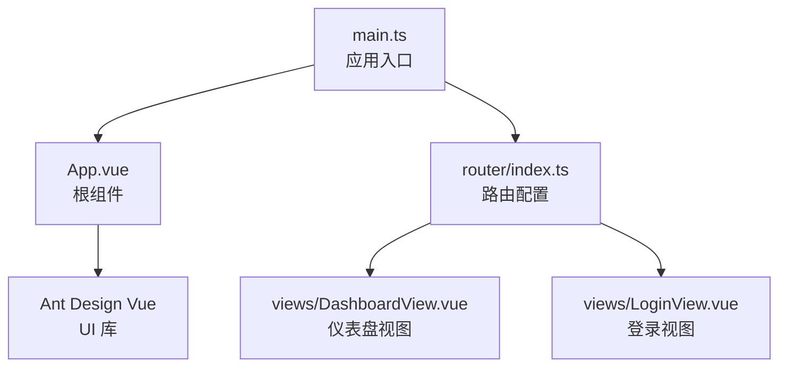
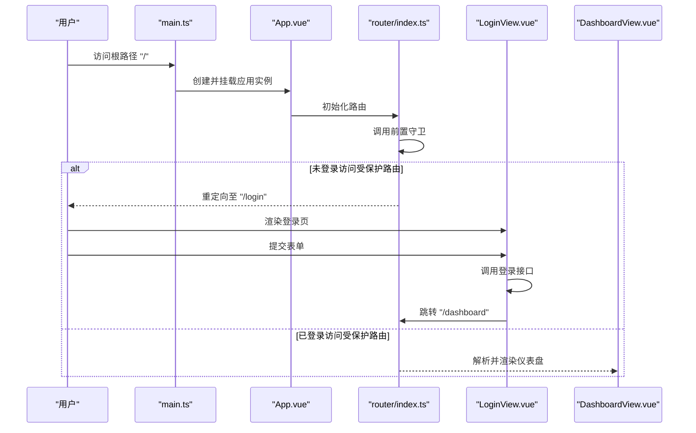
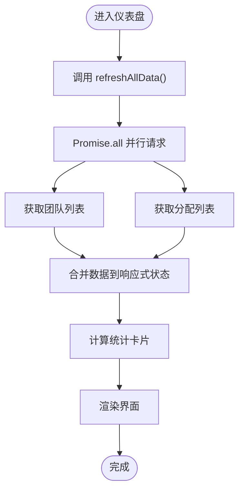
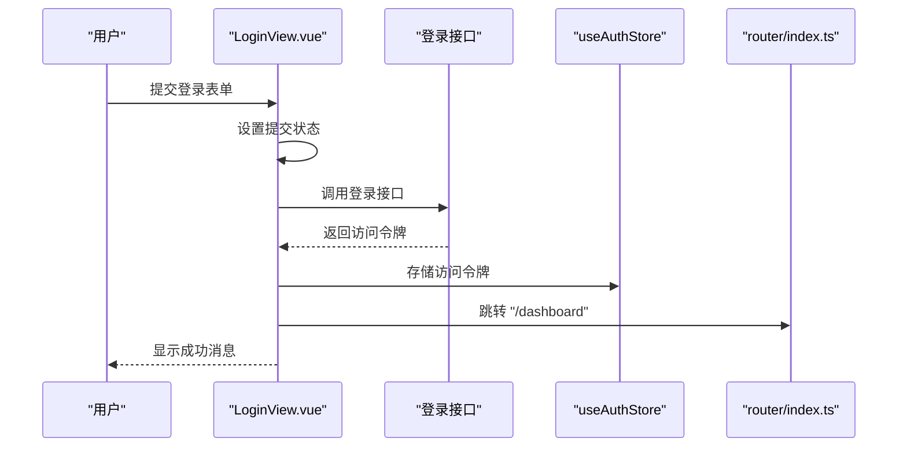
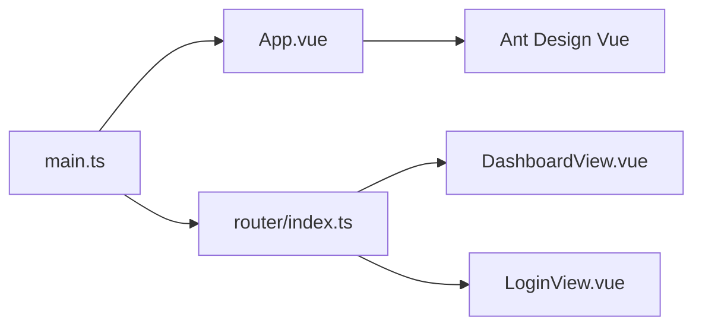

# 组件架构

<cite>
**本文引用的文件**
- [App.vue](file://frontend/src/App.vue)
- [main.ts](file://frontend/src/main.ts)
- [router/index.ts](file://frontend/src/router/index.ts)
- [views/DashboardView.vue](file://frontend/src/views/DashboardView.vue)
- [views/LoginView.vue](file://frontend/src/views/LoginView.vue)
</cite>

## 目录
1. [引言](#引言)
2. [项目结构](#项目结构)
3. [核心组件](#核心组件)
4. [架构总览](#架构总览)
5. [组件详解](#组件详解)
6. [依赖关系分析](#依赖关系分析)
7. [性能考量](#性能考量)
8. [故障排查指南](#故障排查指南)
9. [结论](#结论)
10. [附录](#附录)

## 引言
本文件系统性梳理前端组件架构，围绕 Vue 3 组合式 API 的设计模式与组织策略展开，重点覆盖：
- 根组件 App.vue 的职责与生命周期管理
- 页面级组件 DashboardView、LoginView 的结构设计与数据流
- 组件间通信机制、props 与事件、插槽与动态组件
- 复用策略、命名约定与样式管理
- 测试策略、性能优化与错误边界处理
- 从用户交互到组件渲染的完整数据流

## 项目结构
前端采用“入口引导 + 路由驱动 + 视图组件”的分层组织方式：
- 入口文件负责创建应用实例、注册插件与挂载根组件
- 路由模块集中定义页面入口与登录态守卫
- 视图组件以页面为单位拆分，遵循“视图即页面”的职责边界

图表来源
- [main.ts:16-23](file://frontend/src/main.ts#L16-L23)
- [App.vue:15-29](file://frontend/src/App.vue#L15-L29)
- [router/index.ts:14-37](file://frontend/src/router/index.ts#L14-L37)
- [views/DashboardView.vue:1-348](file://frontend/src/views/DashboardView.vue#L1-L348)
- [views/LoginView.vue:1-157](file://frontend/src/views/LoginView.vue#L1-L157)

章节来源
- [main.ts:1-26](file://frontend/src/main.ts#L1-L26)
- [router/index.ts:1-54](file://frontend/src/router/index.ts#L1-L54)

## 核心组件
- 根组件 App.vue
  - 职责：作为全局主题 Provider 容器与路由承载容器，提供主题切换能力与全局样式入口
  - 生命周期：在模板中挂载 router-view，通过组合式 API 管理主题状态
- 页面级组件
  - DashboardView：仪表盘页面，负责布局、菜单导航、数据聚合与交互
  - LoginView：登录页面，负责表单校验、认证流程与路由跳转

章节来源
- [App.vue:1-45](file://frontend/src/App.vue#L1-L45)
- [views/DashboardView.vue:1-348](file://frontend/src/views/DashboardView.vue#L1-L348)
- [views/LoginView.vue:1-157](file://frontend/src/views/LoginView.vue#L1-L157)

## 架构总览
应用启动流程与组件交互如下：

图表来源
- [main.ts:16-23](file://frontend/src/main.ts#L16-L23)
- [App.vue:1-45](file://frontend/src/App.vue#L1-L45)
- [router/index.ts:42-51](file://frontend/src/router/index.ts#L42-L51)
- [views/LoginView.vue:69-82](file://frontend/src/views/LoginView.vue#L69-L82)
- [views/DashboardView.vue:230-233](file://frontend/src/views/DashboardView.vue#L230-L233)

## 组件详解

### 根组件 App.vue
- 设计要点
  - 使用 Ant Design Vue 的 ConfigProvider 包裹，统一注入主题配置
  - 内置主题切换开关，通过组合式 API 管理明/暗主题状态
  - 作为路由承载容器，内部仅包含 router-view 与主题切换控件
- 生命周期管理
  - 在模板阶段完成挂载；主题切换事件在脚本区域处理
- 样式管理
  - 使用 scoped 与 CSS 变量，结合全局主题变量实现主题一致性

章节来源
- [App.vue:1-45](file://frontend/src/App.vue#L1-L45)

### 页面级组件：DashboardView
- 结构设计
  - 布局：Layout/Sider/Header/Content 组合，支持响应式与折叠交互
  - 导航：Menu 组件绑定选中项与点击事件，当前示例仅保留仪表盘入口
  - 数据面板：统计卡片、团队表格、任务列表等
- 组合式 API 使用
  - 响应式状态：ref 管理折叠状态、加载状态、数据集合
  - 计算属性：基于数据派生统计卡片
  - 生命周期钩子：onMounted 首次加载数据
- 组件通信
  - 与路由：通过 useRouter 进行页面跳转
  - 与全局状态：通过 useAuthStore 清除令牌并触发路由跳转
  - 与 UI 库：使用 message 提示与 Ant Design Vue 组件
- 数据流
  - 并行请求团队与分配数据，统一更新状态并反馈消息
  - 时间格式化与角色标签颜色映射在本地处理

图表来源
- [views/DashboardView.vue:206-225](file://frontend/src/views/DashboardView.vue#L206-L225)
- [views/DashboardView.vue:161-182](file://frontend/src/views/DashboardView.vue#L161-L182)
- [views/DashboardView.vue:265-267](file://frontend/src/views/DashboardView.vue#L265-L267)

章节来源
- [views/DashboardView.vue:1-348](file://frontend/src/views/DashboardView.vue#L1-L348)

### 页面级组件：LoginView
- 表单设计
  - 垂直布局、必填规则、大尺寸输入框与按钮
  - 提交时进行异步登录调用
- 组合式 API 使用
  - 响应式表单对象与提交状态
  - 提交函数封装登录流程与错误处理
- 组件通信
  - 通过 useRouter 跳转到仪表盘
  - 通过 useAuthStore 缓存访问令牌

图表来源
- [views/LoginView.vue:69-82](file://frontend/src/views/LoginView.vue#L69-L82)
- [views/LoginView.vue:72-75](file://frontend/src/views/LoginView.vue#L72-L75)
- [router/index.ts:42-51](file://frontend/src/router/index.ts#L42-L51)

章节来源
- [views/LoginView.vue:1-157](file://frontend/src/views/LoginView.vue#L1-L157)

### 组件间通信机制
- 路由驱动的页面切换
  - 通过路由懒加载与导航守卫实现页面级隔离与登录态控制
- 全局状态共享
  - 使用 Pinia Store 管理认证状态，跨组件共享与同步
- UI 库集成
  - 通过 Ant Design Vue 提供统一的组件生态与主题能力

章节来源
- [router/index.ts:14-29](file://frontend/src/router/index.ts#L14-L29)
- [router/index.ts:42-51](file://frontend/src/router/index.ts#L42-L51)
- [main.ts:16-23](file://frontend/src/main.ts#L16-L23)

### props 传递与事件发射
- 本项目中 props 传递与事件发射主要体现在：
  - Ant Design Vue 组件的属性与事件（如 v-model:collapsed、v-model:selectedKeys、@click）
  - 自定义事件通过 emits 或回调参数在组件间传递
- 实践建议
  - 对外暴露明确的 props 接口，保持向后兼容
  - 使用组合式 API 的 defineEmits 声明事件，提升类型安全

章节来源
- [views/DashboardView.vue:3-16](file://frontend/src/views/DashboardView.vue#L3-L16)
- [views/DashboardView.vue:114-118](file://frontend/src/views/DashboardView.vue#L114-L118)

### 插槽与动态组件
- 插槽使用
  - Ant Design Vue 的具名插槽与图标插槽用于增强可定制性
- 动态组件
  - 路由层面通过异步组件实现按需加载与代码分割

章节来源
- [views/DashboardView.vue:23-27](file://frontend/src/views/DashboardView.vue#L23-L27)
- [router/index.ts:22-28](file://frontend/src/router/index.ts#L22-L28)

### 复用策略
- 组件复用
  - 将通用 UI 片段抽象为可复用的小组件（如按钮、标签、图标）
- 组合式 API 复用
  - 将状态逻辑与副作用抽离为可复用的 Composables（如 useThemeProvider、useAuthStore）
- 样式复用
  - 通过 CSS 变量与 SCSS 变量统一主题与间距

章节来源
- [App.vue:19-21](file://frontend/src/App.vue#L19-L21)
- [views/DashboardView.vue:98-110](file://frontend/src/views/DashboardView.vue#L98-L110)

### 命名约定与样式管理
- 命名约定
  - 文件与组件：PascalCase（如 DashboardView.vue、LoginView.vue）
  - 路由与页面：小驼峰或短横线（如 dashboard、login）
- 样式管理
  - 使用 scoped 作用域与 CSS 变量，结合全局主题变量实现主题一致性
  - 暗黑模式通过全局选择器与变量映射实现

章节来源
- [App.vue:31-44](file://frontend/src/App.vue#L31-L44)
- [views/DashboardView.vue:270-347](file://frontend/src/views/DashboardView.vue#L270-L347)
- [views/LoginView.vue:85-156](file://frontend/src/views/LoginView.vue#L85-L156)

## 依赖关系分析
- 入口引导
  - main.ts 注入路由、状态与 UI 库，创建并挂载应用
- 路由与页面
  - router/index.ts 定义路由表与前置守卫，控制页面访问权限
- 视图组件
  - DashboardView 与 LoginView 分别承担业务页面职责，依赖全局状态与 UI 组件

图表来源
- [main.ts:16-23](file://frontend/src/main.ts#L16-L23)
- [router/index.ts:14-29](file://frontend/src/router/index.ts#L14-L29)
- [views/DashboardView.vue:1-348](file://frontend/src/views/DashboardView.vue#L1-L348)
- [views/LoginView.vue:1-157](file://frontend/src/views/LoginView.vue#L1-L157)

章节来源
- [main.ts:1-26](file://frontend/src/main.ts#L1-L26)
- [router/index.ts:1-54](file://frontend/src/router/index.ts#L1-L54)

## 性能考量
- 资源加载
  - 路由级异步组件按需加载，减少首屏体积
- 渲染优化
  - 合理使用计算属性与响应式状态，避免不必要的重渲染
- 请求策略
  - 并行请求多个数据源，缩短首屏等待时间
- UI 体验
  - 使用加载态与消息提示，提升用户感知

章节来源
- [router/index.ts:22-28](file://frontend/src/router/index.ts#L22-L28)
- [views/DashboardView.vue:209-215](file://frontend/src/views/DashboardView.vue#L209-L215)

## 故障排查指南
- 登录失败
  - 检查登录接口返回与错误消息提示，确认表单校验与提交状态
- 数据加载异常
  - 捕获 Promise.all 中任一请求失败，确保最终状态恢复与错误提示
- 权限拦截
  - 确认前置守卫逻辑与认证状态，避免未授权访问

章节来源
- [views/LoginView.vue:76-82](file://frontend/src/views/LoginView.vue#L76-L82)
- [views/DashboardView.vue:219-225](file://frontend/src/views/DashboardView.vue#L219-L225)
- [router/index.ts:42-51](file://frontend/src/router/index.ts#L42-L51)

## 结论
本项目以“入口引导 + 路由驱动 + 视图组件”为核心架构，结合组合式 API 与 UI 库，实现了清晰的页面职责划分与良好的主题一致性。通过路由守卫与全局状态管理，保障了访问控制与跨组件数据共享。建议在后续迭代中进一步完善组件抽象、测试覆盖与性能监控，持续提升可维护性与用户体验。

## 附录
- 开发规范建议
  - 统一使用组合式 API，将状态与副作用逻辑抽离为可复用模块
  - 严格区分页面组件与通用组件，避免页面逻辑泄漏
  - 使用 TypeScript 与 ESLint 规范约束，提升类型安全与代码质量
- 测试策略建议
  - 单元测试：针对组合式逻辑与工具函数
  - 集成测试：针对路由守卫与页面交互流程
  - 端到端测试：覆盖关键用户路径（登录、数据刷新、导航）