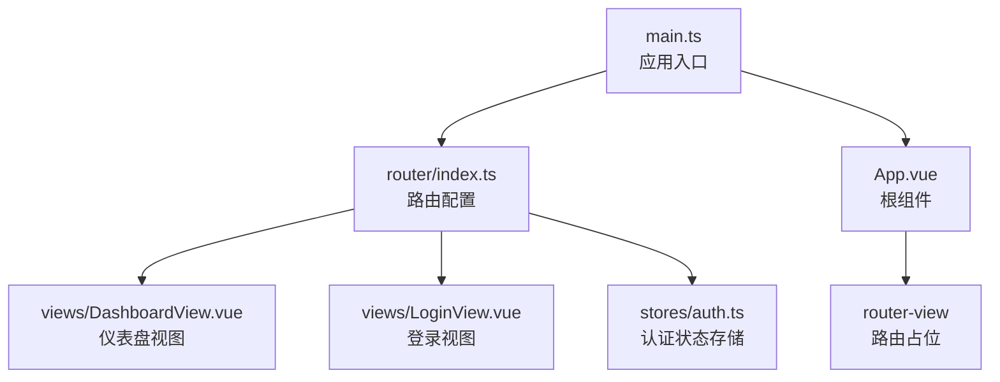
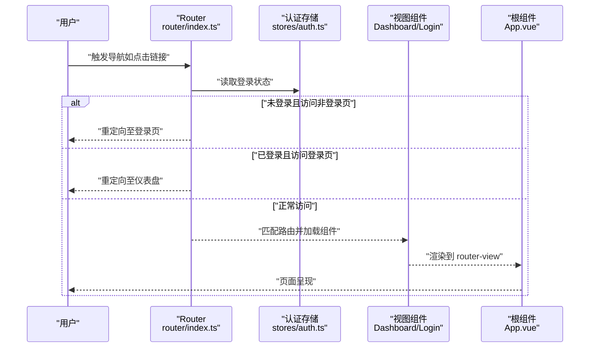
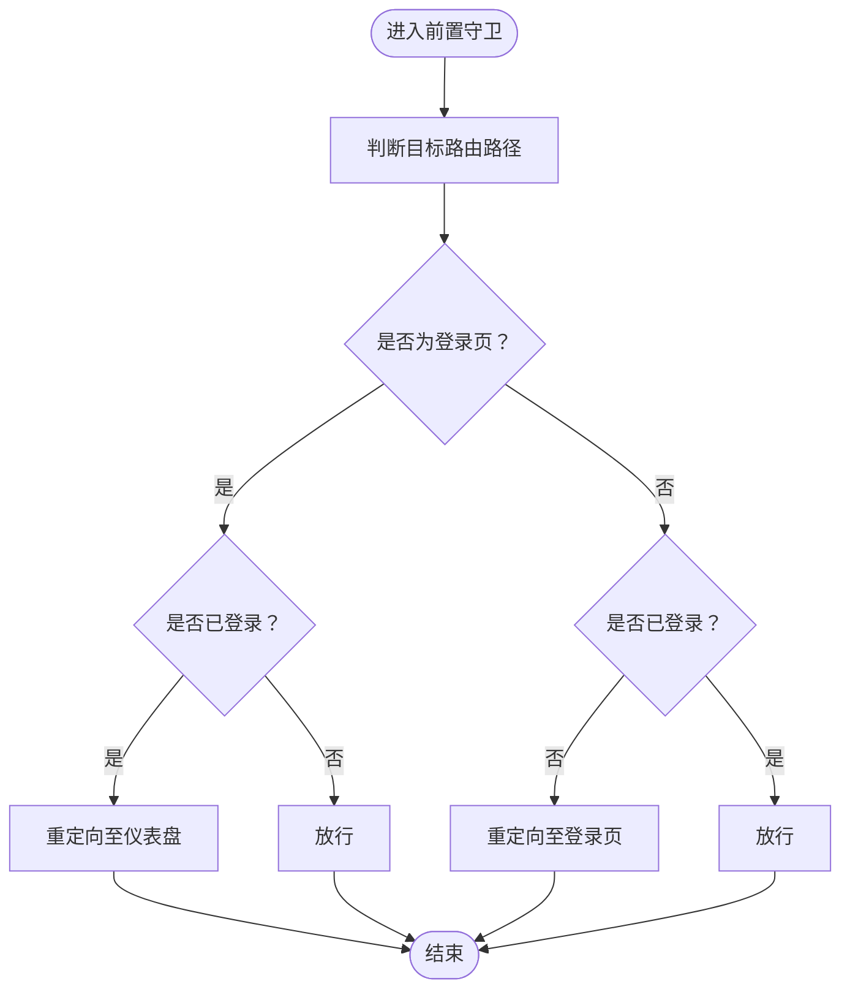
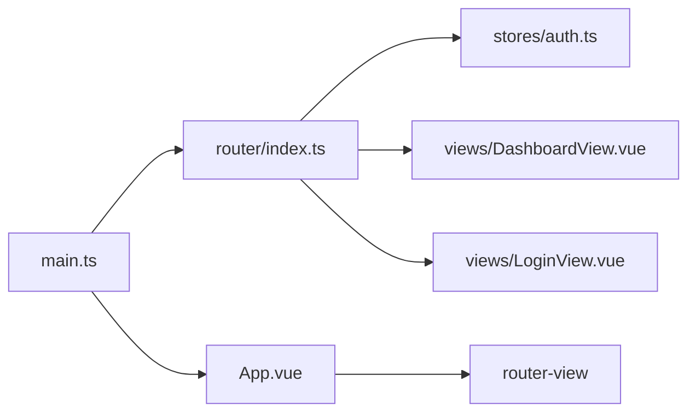

# 路由导航

<cite>
**本文引用的文件**
- [frontend/src/router/index.ts](file://frontend/src/router/index.ts)
- [frontend/src/main.ts](file://frontend/src/main.ts)
- [frontend/src/App.vue](file://frontend/src/App.vue)
- [frontend/src/stores/auth.ts](file://frontend/src/stores/auth.ts)
- [frontend/src/views/DashboardView.vue](file://frontend/src/views/DashboardView.vue)
- [frontend/src/views/LoginView.vue](file://frontend/src/views/LoginView.vue)
</cite>

## 目录
1. [简介](#简介)
2. [项目结构](#项目结构)
3. [核心组件](#核心组件)
4. [架构总览](#架构总览)
5. [详细组件分析](#详细组件分析)
6. [依赖关系分析](#依赖关系分析)
7. [性能考量](#性能考量)
8. [故障排查指南](#故障排查指南)
9. [结论](#结论)
10. [附录](#附录)

## 简介
本文件围绕前端路由导航进行系统性说明，重点覆盖以下方面：
- Vue Router 的配置与模块化设计
- 导航守卫的实现机制（前置守卫）
- 动态路由的处理方式
- 页面组件的懒加载策略
- 路由参数与查询字符串的处理
- 导航权限控制与路由元信息使用
- 面包屑导航的实现思路
- 路由过渡动画、页面缓存策略与历史记录管理
- 路由设计最佳实践、SEO 优化与用户体验优化
- 从用户点击到页面渲染的完整导航流程

## 项目结构
前端路由相关的核心文件位于 frontend/src 目录下，采用“入口 -> 路由 -> 视图”的分层组织：
- 入口文件负责初始化应用、注册路由与状态管理
- 路由文件集中定义路由表与导航守卫
- 视图文件作为页面级组件，通过懒加载按需加载
- 根组件负责全局主题 Provider 与路由承载容器

图表来源
- [frontend/src/main.ts:1-26](file://frontend/src/main.ts#L1-L26)
- [frontend/src/router/index.ts:1-54](file://frontend/src/router/index.ts#L1-L54)
- [frontend/src/App.vue:1-45](file://frontend/src/App.vue#L1-L45)

章节来源
- [frontend/src/main.ts:1-26](file://frontend/src/main.ts#L1-L26)
- [frontend/src/router/index.ts:1-54](file://frontend/src/router/index.ts#L1-L54)
- [frontend/src/App.vue:1-45](file://frontend/src/App.vue#L1-L45)

## 核心组件
- 应用入口 main.ts：创建并挂载 Vue 实例，注册 Pinia、Ant Design Vue 与路由
- 根组件 App.vue：提供全局主题 Provider，并承载 router-view
- 路由配置 router/index.ts：定义路由表、历史模式与前置守卫
- 认证存储 stores/auth.ts：提供登录状态以供守卫判断
- 视图组件 views/DashboardView.vue 与 views/LoginView.vue：页面级组件，采用懒加载

章节来源
- [frontend/src/main.ts:1-26](file://frontend/src/main.ts#L1-L26)
- [frontend/src/App.vue:1-45](file://frontend/src/App.vue#L1-L45)
- [frontend/src/router/index.ts:1-54](file://frontend/src/router/index.ts#L1-L54)
- [frontend/src/stores/auth.ts](file://frontend/src/stores/auth.ts)
- [frontend/src/views/DashboardView.vue](file://frontend/src/views/DashboardView.vue)
- [frontend/src/views/LoginView.vue](file://frontend/src/views/LoginView.vue)

## 架构总览
下图展示了从用户交互到页面渲染的关键路径，包括路由守卫、状态存储与视图渲染：

图表来源
- [frontend/src/router/index.ts:42-51](file://frontend/src/router/index.ts#L42-L51)
- [frontend/src/stores/auth.ts](file://frontend/src/stores/auth.ts)
- [frontend/src/views/DashboardView.vue](file://frontend/src/views/DashboardView.vue)
- [frontend/src/views/LoginView.vue](file://frontend/src/views/LoginView.vue)
- [frontend/src/App.vue:3](file://frontend/src/App.vue#L3)

## 详细组件分析

### 路由配置与模块化设计
- 历史模式：使用 HTML5 History 模式，适合单页应用的平滑导航
- 路由表：集中定义基础路由（登录、仪表盘），支持重定向与懒加载
- 模块化：路由配置独立于视图与状态，便于扩展与维护
- 懒加载：视图组件通过函数返回动态 import，按需加载，降低首屏体积

章节来源
- [frontend/src/router/index.ts:14-29](file://frontend/src/router/index.ts#L14-L29)
- [frontend/src/router/index.ts:34-37](file://frontend/src/router/index.ts#L34-L37)

### 导航守卫实现机制
- 前置守卫：在每次导航前执行，根据登录状态决定是否放行或重定向
- 登录态判断：通过认证存储读取登录状态
- 重定向策略：
  - 未登录访问非登录页 → 重定向至登录页
  - 已登录访问登录页 → 重定向至仪表盘
  - 正常访问 → 放行

图表来源
- [frontend/src/router/index.ts:42-51](file://frontend/src/router/index.ts#L42-L51)

章节来源
- [frontend/src/router/index.ts:42-51](file://frontend/src/router/index.ts#L42-L51)

### 动态路由处理
- 当前实现：路由表为静态定义，未见动态路由添加逻辑
- 扩展建议：
  - 在运行时根据用户权限动态生成路由项
  - 使用 router.addRoute 或基于路由表的条件渲染
  - 注意与导航守卫配合，确保动态路由的权限校验一致

章节来源
- [frontend/src/router/index.ts:14-29](file://frontend/src/router/index.ts#L14-L29)

### 页面组件懒加载策略
- 懒加载实现：视图组件通过函数返回动态 import，仅在访问对应路由时加载
- 性能收益：减少初始包体，提升首屏加载速度
- 最佳实践：
  - 将大型页面或不常用页面拆分为异步组件
  - 结合路由级别的错误边界与加载指示器

章节来源
- [frontend/src/router/index.ts:20-28](file://frontend/src/router/index.ts#L20-L28)

### 路由参数与查询字符串处理
- 路由参数：可通过路由表中的动态段定义（例如 /user/:id），在组件中通过 $route.params 获取
- 查询字符串：通过 $route.query 获取查询参数对象
- 建议：
  - 在组件内统一解析与校验参数
  - 对非法参数进行兜底或跳转
  - 使用类型声明增强可维护性

章节来源
- [frontend/src/router/index.ts:14-29](file://frontend/src/router/index.ts#L14-L29)

### 导航权限控制与路由元信息
- 权限控制：当前通过前置守卫结合登录状态实现基础权限
- 路由元信息：可在路由记录上扩展 meta 字段（如 requireAuth、roles），在守卫中读取以细化权限判断
- 建议：
  - 将权限规则集中管理，避免散落在多处守卫
  - 结合角色与资源权限，实现细粒度控制

章节来源
- [frontend/src/router/index.ts:42-51](file://frontend/src/router/index.ts#L42-L51)

### 面包屑导航实现
- 数据来源：可从路由元信息中提取标题与层级关系
- 实现思路：
  - 遍历当前路由路径，收集 meta.title
  - 生成面包屑数组，渲染为导航链路
- 建议：
  - 在路由表中为每个可见路由设置 meta.title
  - 支持动态标题（如根据参数拼接）

章节来源
- [frontend/src/router/index.ts:14-29](file://frontend/src/router/index.ts#L14-L29)

### 路由过渡动画与页面缓存
- 过渡动画：可在路由视图外层包裹过渡组件，结合路由切换事件实现页面切换动效
- 页面缓存：可使用 keep-alive 包裹 router-view，结合 include/exclude 控制缓存范围
- 建议：
  - 对频繁切换但数据稳定的页面启用缓存
  - 对需要实时刷新的页面排除缓存

章节来源
- [frontend/src/App.vue:3](file://frontend/src/App.vue#L3)

### 历史记录管理
- 历史模式：使用 HTML5 History API，支持浏览器前进后退
- 建议：
  - 合理使用 replace 与 push，避免历史栈冗余
  - 对登录成功后的重定向使用 replace，防止回退到登录页

章节来源
- [frontend/src/router/index.ts:34-37](file://frontend/src/router/index.ts#L34-L37)

## 依赖关系分析
- main.ts 依赖 router/index.ts 与 App.vue
- router/index.ts 依赖 stores/auth.ts 与视图组件
- App.vue 依赖 router-view 以承载视图
- 视图组件依赖路由表与守卫逻辑

图表来源
- [frontend/src/main.ts:1-26](file://frontend/src/main.ts#L1-L26)
- [frontend/src/router/index.ts:1-54](file://frontend/src/router/index.ts#L1-L54)
- [frontend/src/App.vue:1-45](file://frontend/src/App.vue#L1-L45)

章节来源
- [frontend/src/main.ts:1-26](file://frontend/src/main.ts#L1-L26)
- [frontend/src/router/index.ts:1-54](file://frontend/src/router/index.ts#L1-L54)
- [frontend/src/App.vue:1-45](file://frontend/src/App.vue#L1-L45)

## 性能考量
- 懒加载：视图组件按需加载，降低首屏资源压力
- 路由守卫：尽量保持轻量，避免在守卫中做重型计算
- 缓存策略：对稳定页面启用 keep-alive，减少重复渲染
- 资源预加载：对关键路由的依赖进行预加载，改善切换体验

## 故障排查指南
- 无法进入受保护页面
  - 检查登录状态存储是否正确更新
  - 确认前置守卫逻辑与路径判断
- 登录后未跳转至仪表盘
  - 排查登录页重定向逻辑
  - 确认守卫返回值与路径一致性
- 路由切换无效果
  - 检查路由表是否正确匹配
  - 确认组件懒加载是否成功

章节来源
- [frontend/src/router/index.ts:42-51](file://frontend/src/router/index.ts#L42-L51)
- [frontend/src/stores/auth.ts](file://frontend/src/stores/auth.ts)

## 结论
本项目采用简洁清晰的路由架构：入口统一注册、路由集中配置、守卫统一拦截、视图懒加载。在此基础上，可进一步引入动态路由、元信息权限、面包屑与缓存策略，以满足更复杂的业务场景。同时，结合过渡动画与历史记录管理，可显著提升用户体验。

## 附录
- 从用户点击到页面渲染的完整导航流程
  1) 用户点击导航链接
  2) 浏览器触发 History API 导航
  3) 路由器执行前置守卫，读取登录状态
  4) 守卫根据状态决定放行或重定向
  5) 匹配到目标路由，按需加载视图组件
  6) 渲染到根组件的 router-view 中

章节来源
- [frontend/src/router/index.ts:42-51](file://frontend/src/router/index.ts#L42-L51)
- [frontend/src/App.vue:3](file://frontend/src/App.vue#L3)