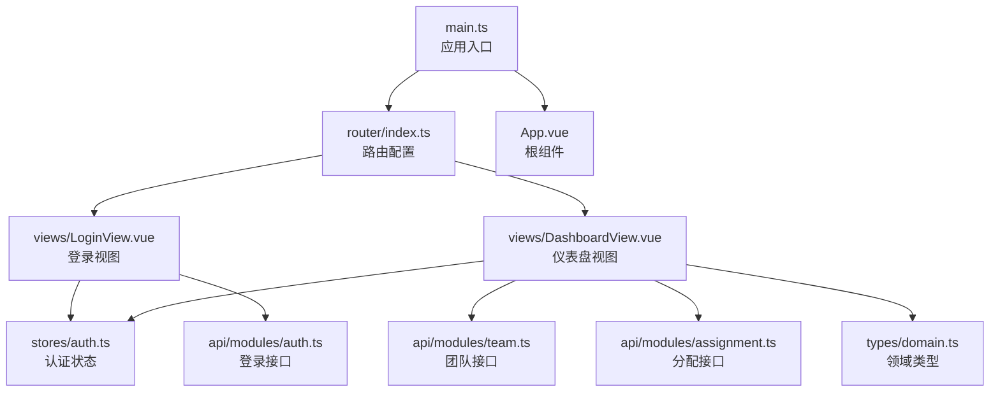
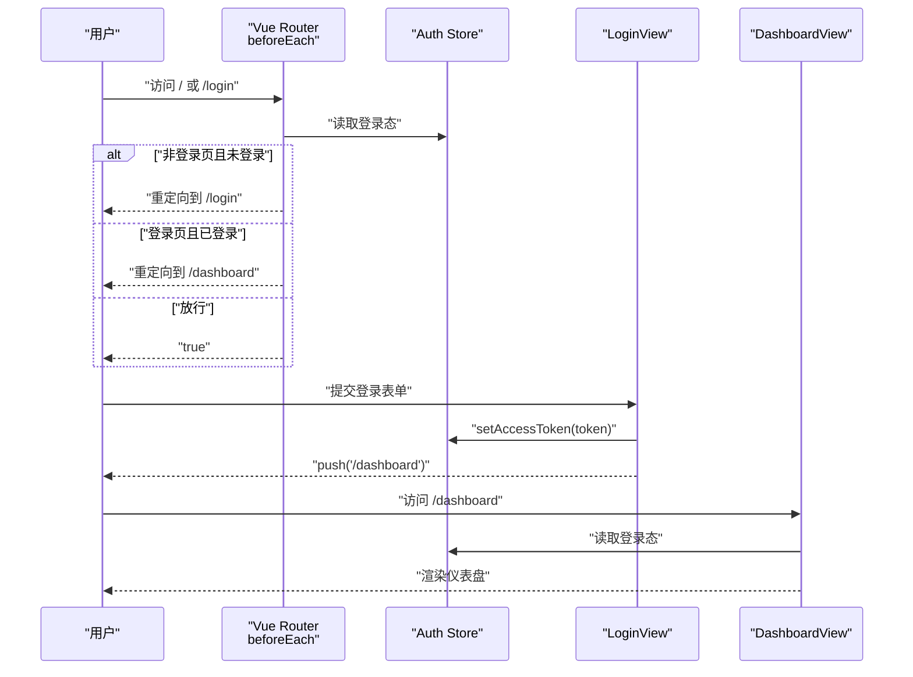
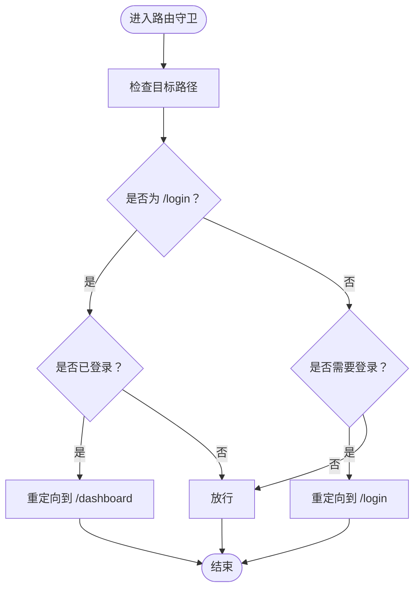
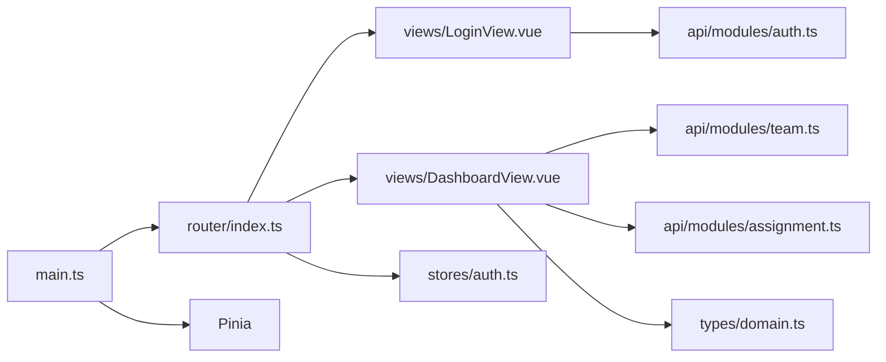

# 路由系统

<cite>
**本文引用的文件**
- [frontend/src/router/index.ts](file://frontend/src/router/index.ts)
- [frontend/src/main.ts](file://frontend/src/main.ts)
- [frontend/src/stores/auth.ts](file://frontend/src/stores/auth.ts)
- [frontend/src/views/LoginView.vue](file://frontend/src/views/LoginView.vue)
- [frontend/src/views/DashboardView.vue](file://frontend/src/views/DashboardView.vue)
- [frontend/src/App.vue](file://frontend/src/App.vue)
- [frontend/src/api/modules/auth.ts](file://frontend/src/api/modules/auth.ts)
- [frontend/src/api/modules/team.ts](file://frontend/src/api/modules/team.ts)
- [frontend/src/api/modules/assignment.ts](file://frontend/src/api/modules/assignment.ts)
- [frontend/src/types/domain.ts](file://frontend/src/types/domain.ts)
- [frontend/package.json](file://frontend/package.json)
- [frontend/vite.config.ts](file://frontend/vite.config.ts)
</cite>

## 目录
1. [引言](#引言)
2. [项目结构](#项目结构)
3. [核心组件](#核心组件)
4. [架构总览](#架构总览)
5. [详细组件分析](#详细组件分析)
6. [依赖分析](#依赖分析)
7. [性能考虑](#性能考虑)
8. [故障排查指南](#故障排查指南)
9. [结论](#结论)
10. [附录](#附录)

## 引言
本文件面向 poprako-web-ms 前端的路由系统，围绕 Vue Router 的路由配置与导航机制进行系统性说明。内容涵盖路由定义、路由守卫、动态路由匹配与嵌套路由的实现方式；解释路由元信息配置、权限控制与导航拦截机制；并结合现有代码给出懒加载、预加载与性能优化策略建议，以及最佳实践与示例路径，帮助开发者快速理解并扩展前端路由设计模式与实现细节。

## 项目结构
前端路由系统位于 frontend/src/router/index.ts，配合 Pinia 全局状态管理与视图组件协同工作。应用入口 main.ts 注入路由与 UI 组件库；根组件 App.vue 提供主题切换与路由视图容器；认证状态由 stores/auth.ts 维护；视图层 LoginView.vue 与 DashboardView.vue 分别承担登录与仪表盘功能；API 层通过模块化封装与领域类型对接后端服务。

图表来源
- [frontend/src/main.ts:16-23](file://frontend/src/main.ts#L16-L23)
- [frontend/src/router/index.ts:14-29](file://frontend/src/router/index.ts#L14-L29)
- [frontend/src/App.vue:1-13](file://frontend/src/App.vue#L1-L13)
- [frontend/src/views/LoginView.vue:50-82](file://frontend/src/views/LoginView.vue#L50-L82)
- [frontend/src/views/DashboardView.vue:97-233](file://frontend/src/views/DashboardView.vue#L97-L233)
- [frontend/src/stores/auth.ts:15-50](file://frontend/src/stores/auth.ts#L15-L50)
- [frontend/src/api/modules/auth.ts:79-110](file://frontend/src/api/modules/auth.ts#L79-L110)
- [frontend/src/api/modules/team.ts:53-80](file://frontend/src/api/modules/team.ts#L53-L80)
- [frontend/src/api/modules/assignment.ts:77-98](file://frontend/src/api/modules/assignment.ts#L77-L98)
- [frontend/src/types/domain.ts:7-88](file://frontend/src/types/domain.ts#L7-L88)

章节来源
- [frontend/src/main.ts:16-23](file://frontend/src/main.ts#L16-L23)
- [frontend/src/router/index.ts:14-29](file://frontend/src/router/index.ts#L14-L29)
- [frontend/src/App.vue:1-13](file://frontend/src/App.vue#L1-L13)

## 核心组件
- 路由配置与导航
  - 路由表定义包含根路径重定向、登录页与仪表盘页，并采用函数式组件懒加载以提升首屏性能。
  - 使用 History 模式，结合 beforeEach 守卫实现登录态校验与导航拦截。
- 全局认证状态
  - 通过 Pinia Store 统一维护访问令牌与登录态，支持设置与清除令牌，并持久化到本地存储。
- 视图组件
  - 登录视图负责表单校验、调用登录接口、写入令牌并跳转至仪表盘。
  - 仪表盘视图负责菜单导航、数据刷新、退出登录等交互，并与团队与分配接口联动。
- 应用入口与根组件
  - 入口文件统一注入路由与 UI 组件库；根组件提供主题切换与路由视图容器。

章节来源
- [frontend/src/router/index.ts:14-51](file://frontend/src/router/index.ts#L14-L51)
- [frontend/src/stores/auth.ts:15-50](file://frontend/src/stores/auth.ts#L15-L50)
- [frontend/src/views/LoginView.vue:50-82](file://frontend/src/views/LoginView.vue#L50-L82)
- [frontend/src/views/DashboardView.vue:97-233](file://frontend/src/views/DashboardView.vue#L97-L233)
- [frontend/src/main.ts:16-23](file://frontend/src/main.ts#L16-L23)
- [frontend/src/App.vue:19-28](file://frontend/src/App.vue#L19-L28)

## 架构总览
下图展示从用户访问到页面渲染的关键流程，包括路由守卫、状态管理与视图加载：

图表来源
- [frontend/src/router/index.ts:42-51](file://frontend/src/router/index.ts#L42-L51)
- [frontend/src/stores/auth.ts:31-42](file://frontend/src/stores/auth.ts#L31-L42)
- [frontend/src/views/LoginView.vue:69-82](file://frontend/src/views/LoginView.vue#L69-L82)
- [frontend/src/views/DashboardView.vue:112-118](file://frontend/src/views/DashboardView.vue#L112-L118)

## 详细组件分析

### 路由配置与导航
- 路由表
  - 根路径重定向至仪表盘，避免空白页。
  - 登录页与仪表盘页均采用异步组件加载，减少初始包体积。
- 导航守卫
  - 在 beforeEach 中判断目标路径与登录态，实现未登录访问受保护路由时跳转登录，已登录访问登录页时跳转仪表盘。
- 历史模式
  - 使用 createWebHistory，结合后端静态资源部署策略，确保刷新与分享链接可用。

章节来源
- [frontend/src/router/index.ts:14-29](file://frontend/src/router/index.ts#L14-L29)
- [frontend/src/router/index.ts:34-37](file://frontend/src/router/index.ts#L34-L37)
- [frontend/src/router/index.ts:42-51](file://frontend/src/router/index.ts#L42-L51)

### 权限控制与导航拦截
- 基于登录态的拦截
  - 通过守卫在进入路由前判断是否需要登录，若未登录则强制跳转登录页；若已登录却访问登录页，则跳转仪表盘。
- 令牌与状态
  - 登录成功后将访问令牌写入 Store 并持久化；退出登录时清除令牌并跳转登录页。
- 可扩展点
  - 可在守卫中引入更细粒度的角色/权限字段，结合路由元信息实现页面级权限控制。

章节来源
- [frontend/src/router/index.ts:42-51](file://frontend/src/router/index.ts#L42-L51)
- [frontend/src/stores/auth.ts:31-42](file://frontend/src/stores/auth.ts#L31-L42)
- [frontend/src/views/DashboardView.vue:230-233](file://frontend/src/views/DashboardView.vue#L230-L233)

### 动态路由匹配与嵌套路由
- 动态路由匹配
  - 当前路由表未显式定义动态段参数；如需支持动态 ID 或层级路径，可在路由表中添加动态段并在组件中通过 $route.params 读取。
- 嵌套路由
  - 当前路由表为扁平结构；如需实现侧边栏菜单与子页面的嵌套布局，可在仪表盘视图内使用嵌套路由，并在菜单点击时更新子路由视图。
- 实施建议
  - 对于团队/漫画/章节等层级资源，建议在路由表中增加动态段与嵌套路由配置，配合 keep-alive 缓存提升切换体验。

章节来源
- [frontend/src/router/index.ts:14-29](file://frontend/src/router/index.ts#L14-L29)
- [frontend/src/views/DashboardView.vue:120-136](file://frontend/src/views/DashboardView.vue#L120-L136)

### 路由懒加载与预加载
- 懒加载
  - 登录页与仪表盘页均采用异步组件加载，降低首屏 JavaScript 体积，提升首次渲染速度。
- 预加载
  - 可在用户空闲时对高频访问的后续页面进行预加载，或在导航前对关键数据进行预取，以缩短白屏时间。
- 性能优化
  - 结合分包策略与路由级代码分割，进一步拆分第三方库与业务模块，配合 CDN 与缓存策略提升整体性能。

章节来源
- [frontend/src/router/index.ts:22-27](file://frontend/src/router/index.ts#L22-L27)
- [frontend/src/views/DashboardView.vue:206-225](file://frontend/src/views/DashboardView.vue#L206-L225)

### 视图组件与路由交互
- 登录视图
  - 表单提交后调用登录接口，成功后写入令牌并跳转仪表盘；异常时提示错误信息。
- 仪表盘视图
  - 初始化时拉取团队与分配数据；提供菜单导航、刷新数据与退出登录能力；菜单点击时根据键值执行相应动作。
- 类型与 API
  - 领域类型定义了用户、团队、分配等实体；API 模块封装了登录、获取我的团队与分配等接口。

章节来源
- [frontend/src/views/LoginView.vue:50-82](file://frontend/src/views/LoginView.vue#L50-L82)
- [frontend/src/views/DashboardView.vue:97-233](file://frontend/src/views/DashboardView.vue#L97-L233)
- [frontend/src/api/modules/auth.ts:79-110](file://frontend/src/api/modules/auth.ts#L79-L110)
- [frontend/src/api/modules/team.ts:53-80](file://frontend/src/api/modules/team.ts#L53-L80)
- [frontend/src/api/modules/assignment.ts:77-98](file://frontend/src/api/modules/assignment.ts#L77-L98)
- [frontend/src/types/domain.ts:7-88](file://frontend/src/types/domain.ts#L7-L88)

### 路由守卫流程图

图表来源
- [frontend/src/router/index.ts:42-51](file://frontend/src/router/index.ts#L42-L51)

## 依赖分析
- 框架与工具
  - Vue 3、Vue Router 4、Pinia、Ant Design Vue、Vite。
- 关键依赖关系
  - main.ts 注入 router 与 Pinia；App.vue 提供路由视图容器；路由守卫依赖 auth store；视图组件依赖 API 模块与领域类型。

图表来源
- [frontend/src/main.ts:16-23](file://frontend/src/main.ts#L16-L23)
- [frontend/src/router/index.ts:14-29](file://frontend/src/router/index.ts#L14-L29)
- [frontend/src/stores/auth.ts:15-50](file://frontend/src/stores/auth.ts#L15-L50)
- [frontend/src/views/LoginView.vue:50-82](file://frontend/src/views/LoginView.vue#L50-L82)
- [frontend/src/views/DashboardView.vue:97-233](file://frontend/src/views/DashboardView.vue#L97-L233)
- [frontend/src/api/modules/auth.ts:79-110](file://frontend/src/api/modules/auth.ts#L79-L110)
- [frontend/src/api/modules/team.ts:53-80](file://frontend/src/api/modules/team.ts#L53-L80)
- [frontend/src/api/modules/assignment.ts:77-98](file://frontend/src/api/modules/assignment.ts#L77-L98)
- [frontend/src/types/domain.ts:7-88](file://frontend/src/types/domain.ts#L7-L88)

章节来源
- [frontend/package.json:13-19](file://frontend/package.json#L13-L19)
- [frontend/vite.config.ts:12-19](file://frontend/vite.config.ts#L12-L19)

## 性能考虑
- 代码分割与懒加载
  - 将大型视图组件改为异步组件，减少首屏 JS 体积。
- 预取与预加载
  - 在用户空闲时预取下一页所需数据，或在导航前触发 API 请求，缩短等待时间。
- 路由级缓存
  - 对不频繁变动的页面启用 keep-alive 缓存，避免重复渲染。
- 构建与打包
  - 合理配置 Vite 别名与插件，利用 Tree Shaking 与压缩策略降低产物体积。
- 主题与样式
  - 使用 CSS 变量与暗色模式切换，减少运行时计算开销。

## 故障排查指南
- 登录后无法进入仪表盘
  - 检查登录接口返回的访问令牌是否正确写入 Store 并持久化；确认守卫逻辑未阻断导航。
- 已登录仍被重定向到登录页
  - 检查 Store 中登录态是否为真；确认守卫对登录页的拦截逻辑。
- 刷新页面后路由丢失
  - 确认使用 History 模式并正确配置后端静态资源托管；检查路由回退策略。
- 菜单点击无效或报错
  - 检查菜单键值与路由配置是否一致；确认 API 接口返回的数据结构与类型定义匹配。

章节来源
- [frontend/src/router/index.ts:42-51](file://frontend/src/router/index.ts#L42-L51)
- [frontend/src/stores/auth.ts:31-42](file://frontend/src/stores/auth.ts#L31-L42)
- [frontend/src/views/LoginView.vue:69-82](file://frontend/src/views/LoginView.vue#L69-L82)
- [frontend/src/views/DashboardView.vue:195-200](file://frontend/src/views/DashboardView.vue#L195-L200)

## 结论
poprako-web-ms 的前端路由系统以 Vue Router 为核心，结合 Pinia 状态管理与异步组件懒加载，实现了简洁高效的导航与权限控制。通过 beforeEach 守卫统一拦截未登录访问，配合登录/登出流程完成令牌生命周期管理。未来可在路由表中引入动态段与嵌套路由，结合预取与缓存策略进一步提升用户体验与性能表现。

## 附录
- 最佳实践清单
  - 使用异步组件实现懒加载；在守卫中集中处理登录态校验；将令牌持久化到本地存储；为高频页面提供预加载策略；合理组织路由表与视图组件；保持类型定义与 API 返回一致。
- 示例路径参考
  - 路由配置与守卫：[frontend/src/router/index.ts:14-51](file://frontend/src/router/index.ts#L14-L51)
  - 应用入口与注入：[frontend/src/main.ts:16-23](file://frontend/src/main.ts#L16-L23)
  - 认证状态管理：[frontend/src/stores/auth.ts:15-50](file://frontend/src/stores/auth.ts#L15-L50)
  - 登录视图与登录流程：[frontend/src/views/LoginView.vue:50-82](file://frontend/src/views/LoginView.vue#L50-82)
  - 仪表盘视图与数据加载：[frontend/src/views/DashboardView.vue:97-233](file://frontend/src/views/DashboardView.vue#L97-233)
  - 登录接口封装：[frontend/src/api/modules/auth.ts:79-110](file://frontend/src/api/modules/auth.ts#L79-110)
  - 团队与分配接口封装：[frontend/src/api/modules/team.ts:53-80](file://frontend/src/api/modules/team.ts#L53-80)、[frontend/src/api/modules/assignment.ts:77-98](file://frontend/src/api/modules/assignment.ts#L77-98)
  - 领域类型定义：[frontend/src/types/domain.ts:7-88](file://frontend/src/types/domain.ts#L7-88)
  - 依赖与构建配置：[frontend/package.json:13-19](file://frontend/package.json#L13-L19)、[frontend/vite.config.ts:12-19](file://frontend/vite.config.ts#L12-L19)