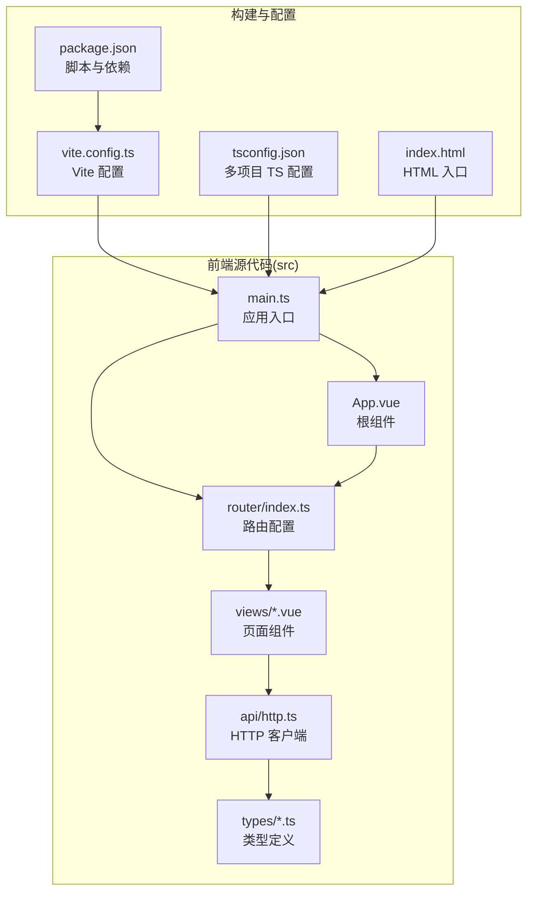
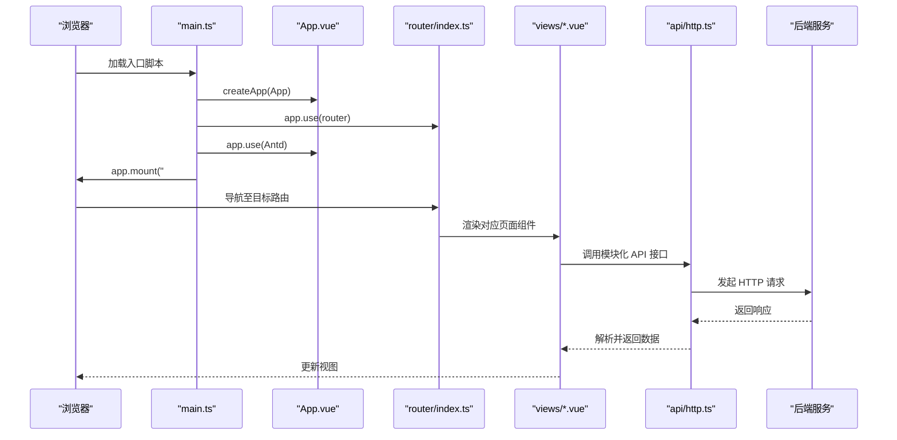
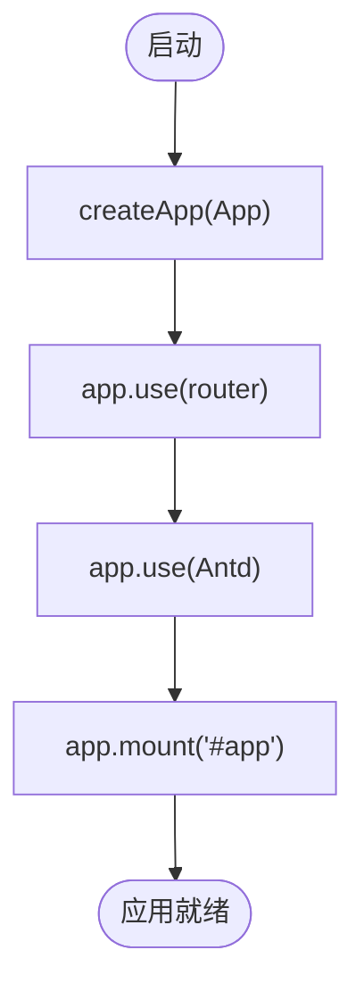
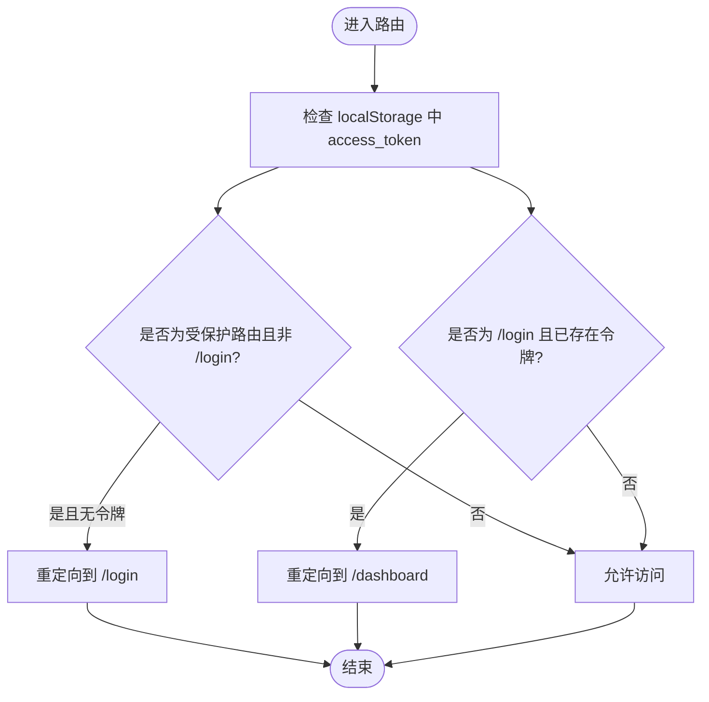
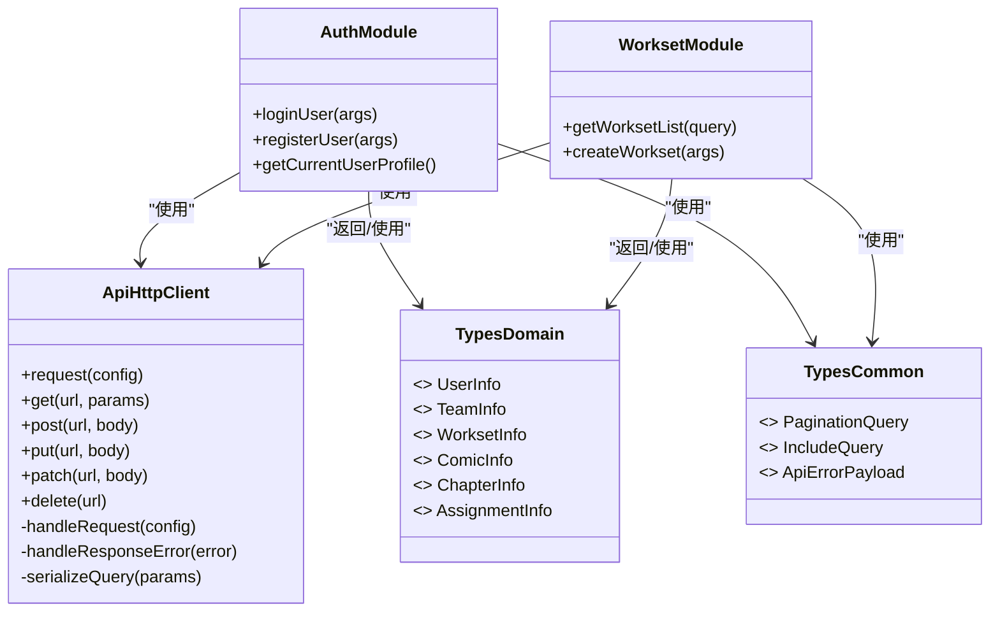
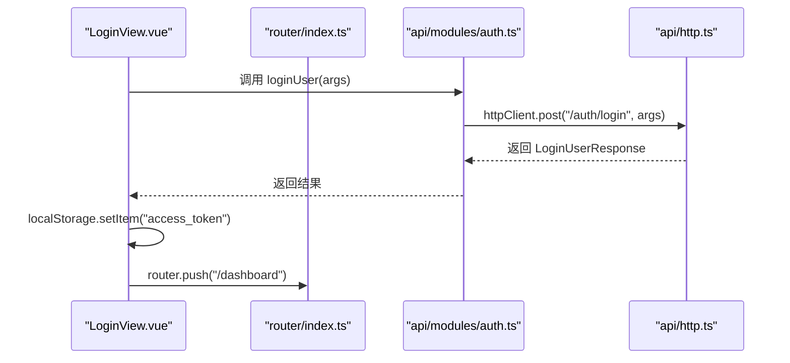
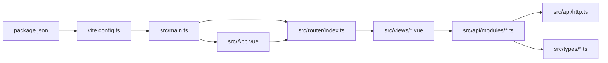

# 项目结构

<cite>
**本文引用的文件**
- [frontend/src/main.ts](file://frontend/src/main.ts)
- [frontend/src/App.vue](file://frontend/src/App.vue)
- [frontend/src/router/index.ts](file://frontend/src/router/index.ts)
- [frontend/vite.config.ts](file://frontend/vite.config.ts)
- [frontend/package.json](file://frontend/package.json)
- [frontend/src/api/http.ts](file://frontend/src/api/http.ts)
- [frontend/src/api/modules/auth.ts](file://frontend/src/api/modules/auth.ts)
- [frontend/src/api/modules/workset.ts](file://frontend/src/api/modules/workset.ts)
- [frontend/src/types/common.ts](file://frontend/src/types/common.ts)
- [frontend/src/types/domain.ts](file://frontend/src/types/domain.ts)
- [frontend/src/views/DashboardView.vue](file://frontend/src/views/DashboardView.vue)
- [frontend/src/views/LoginView.vue](file://frontend/src/views/LoginView.vue)
- [frontend/tsconfig.json](file://frontend/tsconfig.json)
- [frontend/index.html](file://frontend/index.html)
</cite>

## 目录
1. [简介](#简介)
2. [项目结构](#项目结构)
3. [核心组件](#核心组件)
4. [架构总览](#架构总览)
5. [详细组件分析](#详细组件分析)
6. [依赖关系分析](#依赖关系分析)
7. [性能考量](#性能考量)
8. [故障排查指南](#故障排查指南)
9. [结论](#结论)
10. [附录](#附录)

## 简介
本文件系统性梳理前端工程的目录组织原则与文件布局设计，聚焦 Vue 3 + TypeScript + Vite 技术栈在本项目中的落地方式。重点覆盖以下方面：
- src 目录下的职责划分：api、router、types、views、assets 等
- 入口文件 main.ts 的初始化流程与插件注入
- 根组件 App.vue 的结构设计与主题 Provider 使用
- 路由配置的模块化策略与登录态守卫
- 构建配置 vite.config.ts 的作用与路径别名
- 包管理配置 package.json 的脚本与依赖管理
- 目录命名规范、文件组织原则与开发工作流最佳实践

## 项目结构
前端工程位于 frontend 目录，采用“功能域 + 层次化”混合组织方式：
- src/api：统一 HTTP 客户端与按领域模块化的接口层
- src/router：路由表与前置守卫
- src/types：公共类型与领域模型类型
- src/views：页面级组件
- src：根组件、入口、样式等
- 根目录：构建配置、包管理、类型配置、HTML 入口模板

图表来源
- [frontend/src/main.ts:1-23](file://frontend/src/main.ts#L1-L23)
- [frontend/src/App.vue:1-46](file://frontend/src/App.vue#L1-L46)
- [frontend/src/router/index.ts:1-53](file://frontend/src/router/index.ts#L1-L53)
- [frontend/src/api/http.ts:1-174](file://frontend/src/api/http.ts#L1-L174)
- [frontend/src/types/common.ts:1-41](file://frontend/src/types/common.ts#L1-L41)
- [frontend/src/types/domain.ts:1-89](file://frontend/src/types/domain.ts#L1-L89)
- [frontend/src/views/DashboardView.vue:1-346](file://frontend/src/views/DashboardView.vue#L1-L346)
- [frontend/src/views/LoginView.vue:1-157](file://frontend/src/views/LoginView.vue#L1-L157)
- [frontend/vite.config.ts:1-20](file://frontend/vite.config.ts#L1-L20)
- [frontend/package.json:1-35](file://frontend/package.json#L1-L35)
- [frontend/tsconfig.json:1-12](file://frontend/tsconfig.json#L1-L12)
- [frontend/index.html:1-15](file://frontend/index.html#L1-L15)

章节来源
- [frontend/src/main.ts:1-23](file://frontend/src/main.ts#L1-L23)
- [frontend/src/router/index.ts:1-53](file://frontend/src/router/index.ts#L1-L53)
- [frontend/vite.config.ts:1-20](file://frontend/vite.config.ts#L1-L20)
- [frontend/package.json:1-35](file://frontend/package.json#L1-L35)
- [frontend/tsconfig.json:1-12](file://frontend/tsconfig.json#L1-L12)
- [frontend/index.html:1-15](file://frontend/index.html#L1-L15)

## 核心组件
- 应用入口 main.ts：创建 Vue 应用实例，注入路由与 Ant Design Vue，并挂载到 DOM
- 根组件 App.vue：提供全局主题 Provider 与路由视图容器，内置主题切换
- 路由配置 router/index.ts：定义路由表、历史模式与前置守卫
- HTTP 客户端 api/http.ts：Axios 封装，统一请求头、错误处理与通用方法
- 类型系统 types：common.ts 提供通用类型，domain.ts 提供领域模型
- 页面组件 views：DashboardView.vue 与 LoginView.vue 分别承担仪表盘与登录页

章节来源
- [frontend/src/main.ts:1-23](file://frontend/src/main.ts#L1-L23)
- [frontend/src/App.vue:1-46](file://frontend/src/App.vue#L1-L46)
- [frontend/src/router/index.ts:1-53](file://frontend/src/router/index.ts#L1-L53)
- [frontend/src/api/http.ts:1-174](file://frontend/src/api/http.ts#L1-L174)
- [frontend/src/types/common.ts:1-41](file://frontend/src/types/common.ts#L1-L41)
- [frontend/src/types/domain.ts:1-89](file://frontend/src/types/domain.ts#L1-L89)
- [frontend/src/views/DashboardView.vue:1-346](file://frontend/src/views/DashboardView.vue#L1-L346)
- [frontend/src/views/LoginView.vue:1-157](file://frontend/src/views/LoginView.vue#L1-L157)

## 架构总览
前端采用“入口 -> 根组件 -> 路由 -> 页面 -> API”的线性调用链路，配合统一 HTTP 客户端与类型系统，形成清晰的职责边界。

图表来源
- [frontend/src/main.ts:1-23](file://frontend/src/main.ts#L1-L23)
- [frontend/src/App.vue:1-46](file://frontend/src/App.vue#L1-L46)
- [frontend/src/router/index.ts:1-53](file://frontend/src/router/index.ts#L1-L53)
- [frontend/src/api/http.ts:1-174](file://frontend/src/api/http.ts#L1-L174)
- [frontend/src/views/DashboardView.vue:1-346](file://frontend/src/views/DashboardView.vue#L1-L346)
- [frontend/src/views/LoginView.vue:1-157](file://frontend/src/views/LoginView.vue#L1-L157)

## 详细组件分析

### 入口与根组件
- 入口 main.ts：创建应用、注入路由与 Ant Design Vue、挂载 DOM
- 根组件 App.vue：提供全局主题 Provider，内嵌路由视图与主题切换控件

图表来源
- [frontend/src/main.ts:15-20](file://frontend/src/main.ts#L15-L20)

章节来源
- [frontend/src/main.ts:1-23](file://frontend/src/main.ts#L1-L23)
- [frontend/src/App.vue:1-46](file://frontend/src/App.vue#L1-L46)

### 路由与导航
- 路由表：包含重定向、登录页与仪表盘页
- 历史模式：使用 HTML5 History API
- 前置守卫：校验访问令牌，未登录禁止访问受保护路由，已登录禁止访问登录页

图表来源
- [frontend/src/router/index.ts:41-50](file://frontend/src/router/index.ts#L41-L50)

章节来源
- [frontend/src/router/index.ts:1-53](file://frontend/src/router/index.ts#L1-L53)

### API 层与模块化接口
- HTTP 客户端：统一 baseURL、超时、请求头注入、错误处理与通用方法封装
- 模块化接口：按领域拆分（如 auth、workset），每个模块导出 typed 函数与请求/响应类型
- 类型体系：common.ts 提供通用类型（分页、包含项、统一错误），domain.ts 提供领域模型

图表来源
- [frontend/src/api/http.ts:18-174](file://frontend/src/api/http.ts#L18-L174)
- [frontend/src/api/modules/auth.ts:79-110](file://frontend/src/api/modules/auth.ts#L79-L110)
- [frontend/src/api/modules/workset.ts:53-72](file://frontend/src/api/modules/workset.ts#L53-L72)
- [frontend/src/types/common.ts:7-41](file://frontend/src/types/common.ts#L7-L41)
- [frontend/src/types/domain.ts:7-89](file://frontend/src/types/domain.ts#L7-L89)

章节来源
- [frontend/src/api/http.ts:1-174](file://frontend/src/api/http.ts#L1-L174)
- [frontend/src/api/modules/auth.ts:1-110](file://frontend/src/api/modules/auth.ts#L1-L110)
- [frontend/src/api/modules/workset.ts:1-72](file://frontend/src/api/modules/workset.ts#L1-L72)
- [frontend/src/types/common.ts:1-41](file://frontend/src/types/common.ts#L1-L41)
- [frontend/src/types/domain.ts:1-89](file://frontend/src/types/domain.ts#L1-L89)

### 页面组件与交互
- 登录页 LoginView.vue：表单校验、提交、错误提示、成功后写入令牌并跳转
- 仪表盘 DashboardView.vue：侧边栏、头部操作区、统计卡片、表格与列表、并发数据拉取、角色标签与时间格式化

图表来源
- [frontend/src/views/LoginView.vue:68-81](file://frontend/src/views/LoginView.vue#L68-L81)
- [frontend/src/api/modules/auth.ts:79-86](file://frontend/src/api/modules/auth.ts#L79-L86)
- [frontend/src/api/http.ts:87-90](file://frontend/src/api/http.ts#L87-L90)
- [frontend/src/router/index.ts:1-53](file://frontend/src/router/index.ts#L1-L53)

章节来源
- [frontend/src/views/LoginView.vue:1-157](file://frontend/src/views/LoginView.vue#L1-L157)
- [frontend/src/views/DashboardView.vue:1-346](file://frontend/src/views/DashboardView.vue#L1-L346)

### 构建与配置
- vite.config.ts：注册 Vue 插件、配置路径别名 @ 指向 src
- package.json：定义 dev/build/preview/lint/type-check 脚本，声明运行时与开发时依赖
- tsconfig.json：聚合 tsconfig.app.json 与 tsconfig.node.json
- index.html：应用入口模板，挂载 #app 并引入 /src/main.ts

章节来源
- [frontend/vite.config.ts:1-20](file://frontend/vite.config.ts#L1-L20)
- [frontend/package.json:1-35](file://frontend/package.json#L1-L35)
- [frontend/tsconfig.json:1-12](file://frontend/tsconfig.json#L1-L12)
- [frontend/index.html:1-15](file://frontend/index.html#L1-L15)

## 依赖关系分析
- 入口 main.ts 依赖 App.vue、router/index.ts 与 Ant Design Vue
- 根组件 App.vue 依赖路由视图与主题 Provider
- 页面组件依赖路由、UI 组件库与 API 模块
- API 模块依赖统一 HTTP 客户端与类型定义
- 构建配置影响模块解析与插件注入

图表来源
- [frontend/package.json:1-35](file://frontend/package.json#L1-L35)
- [frontend/vite.config.ts:1-20](file://frontend/vite.config.ts#L1-L20)
- [frontend/src/main.ts:1-23](file://frontend/src/main.ts#L1-L23)
- [frontend/src/App.vue:1-46](file://frontend/src/App.vue#L1-L46)
- [frontend/src/router/index.ts:1-53](file://frontend/src/router/index.ts#L1-L53)
- [frontend/src/views/DashboardView.vue:1-346](file://frontend/src/views/DashboardView.vue#L1-L346)
- [frontend/src/views/LoginView.vue:1-157](file://frontend/src/views/LoginView.vue#L1-L157)
- [frontend/src/api/http.ts:1-174](file://frontend/src/api/http.ts#L1-L174)
- [frontend/src/api/modules/auth.ts:1-110](file://frontend/src/api/modules/auth.ts#L1-L110)
- [frontend/src/api/modules/workset.ts:1-72](file://frontend/src/api/modules/workset.ts#L1-L72)
- [frontend/src/types/common.ts:1-41](file://frontend/src/types/common.ts#L1-L41)
- [frontend/src/types/domain.ts:1-89](file://frontend/src/types/domain.ts#L1-L89)

章节来源
- [frontend/package.json:1-35](file://frontend/package.json#L1-L35)
- [frontend/vite.config.ts:1-20](file://frontend/vite.config.ts#L1-L20)
- [frontend/src/main.ts:1-23](file://frontend/src/main.ts#L1-L23)
- [frontend/src/router/index.ts:1-53](file://frontend/src/router/index.ts#L1-L53)
- [frontend/src/api/http.ts:1-174](file://frontend/src/api/http.ts#L1-L174)
- [frontend/src/api/modules/auth.ts:1-110](file://frontend/src/api/modules/auth.ts#L1-L110)
- [frontend/src/api/modules/workset.ts:1-72](file://frontend/src/api/modules/workset.ts#L1-L72)
- [frontend/src/types/common.ts:1-41](file://frontend/src/types/common.ts#L1-L41)
- [frontend/src/types/domain.ts:1-89](file://frontend/src/types/domain.ts#L1-L89)
- [frontend/src/views/DashboardView.vue:1-346](file://frontend/src/views/DashboardView.vue#L1-L346)
- [frontend/src/views/LoginView.vue:1-157](file://frontend/src/views/LoginView.vue#L1-L157)

## 性能考量
- 路由懒加载：页面组件通过动态导入实现按需加载，减少首屏体积
- 并发数据拉取：仪表盘中对多个接口使用 Promise.all 并发请求，提升加载效率
- 统一错误处理：HTTP 客户端集中处理 401 等错误，避免重复逻辑
- 构建优化：Vite 插件与路径别名减少解析成本，生产构建压缩资源

章节来源
- [frontend/src/router/index.ts:21-26](file://frontend/src/router/index.ts#L21-L26)
- [frontend/src/views/DashboardView.vue:207-213](file://frontend/src/views/DashboardView.vue#L207-L213)
- [frontend/src/api/http.ts:67-82](file://frontend/src/api/http.ts#L67-L82)

## 故障排查指南
- 登录失败或无法进入仪表盘
  - 检查登录页提交流程与令牌写入
  - 确认路由前置守卫逻辑与令牌状态
- 401 未授权
  - 查看 HTTP 客户端错误处理是否清除本地令牌并跳转登录
- 构建或运行异常
  - 确认 package.json 脚本顺序与依赖版本
  - 检查 Vite 配置与路径别名是否正确
- 类型报错
  - 使用 tsconfig.json 聚合配置，确保编译器正确解析引用

章节来源
- [frontend/src/views/LoginView.vue:68-81](file://frontend/src/views/LoginView.vue#L68-L81)
- [frontend/src/router/index.ts:41-50](file://frontend/src/router/index.ts#L41-L50)
- [frontend/src/api/http.ts:74-82](file://frontend/src/api/http.ts#L74-L82)
- [frontend/package.json:6-11](file://frontend/package.json#L6-L11)
- [frontend/vite.config.ts:12-19](file://frontend/vite.config.ts#L12-L19)
- [frontend/tsconfig.json:3-10](file://frontend/tsconfig.json#L3-L10)

## 结论
本项目以 Vue 3 + TypeScript + Vite 为基础，结合统一 HTTP 客户端与模块化 API 设计，实现了清晰的职责分离与良好的可维护性。入口、根组件、路由与页面组件之间的调用链简洁明确，配合类型系统与构建配置，形成了高效的开发与交付流水线。建议在后续迭代中持续完善 API 模块与类型定义，保持模块边界清晰，强化单元测试与 E2E 测试，进一步提升质量与稳定性。

## 附录

### 目录命名规范与文件组织原则
- 目录命名：采用小写与短横线风格，语义明确（如 api、router、types、views）
- 文件命名：模块化 API 使用领域名（如 auth.ts、workset.ts），页面组件使用视图名（如 DashboardView.vue、LoginView.vue）
- 类型文件：公共类型置于 common.ts，领域模型置于 domain.ts
- 入口与模板：入口文件 main.ts 放 src 根目录，HTML 模板 index.html 放根目录

章节来源
- [frontend/src/api/modules/auth.ts:1-110](file://frontend/src/api/modules/auth.ts#L1-L110)
- [frontend/src/api/modules/workset.ts:1-72](file://frontend/src/api/modules/workset.ts#L1-L72)
- [frontend/src/types/common.ts:1-41](file://frontend/src/types/common.ts#L1-L41)
- [frontend/src/types/domain.ts:1-89](file://frontend/src/types/domain.ts#L1-L89)
- [frontend/src/views/DashboardView.vue:1-346](file://frontend/src/views/DashboardView.vue#L1-L346)
- [frontend/src/views/LoginView.vue:1-157](file://frontend/src/views/LoginView.vue#L1-L157)
- [frontend/src/main.ts:1-23](file://frontend/src/main.ts#L1-L23)
- [frontend/index.html:1-15](file://frontend/index.html#L1-L15)

### 开发工作流最佳实践
- 使用 Vite 快速开发与热更新，遵循“先类型检查再构建”的脚本顺序
- 页面组件通过动态导入实现路由懒加载，提升首屏性能
- API 模块统一通过 httpClient 调用，避免分散的请求逻辑
- 在路由层统一处理登录态守卫，保障受保护路由的安全性
- 使用 Ant Design Vue 组件库与全局主题 Provider，统一 UI 体验

章节来源
- [frontend/package.json:6-11](file://frontend/package.json#L6-L11)
- [frontend/src/router/index.ts:21-26](file://frontend/src/router/index.ts#L21-L26)
- [frontend/src/api/http.ts:1-174](file://frontend/src/api/http.ts#L1-L174)
- [frontend/src/App.vue:1-46](file://frontend/src/App.vue#L1-L46)