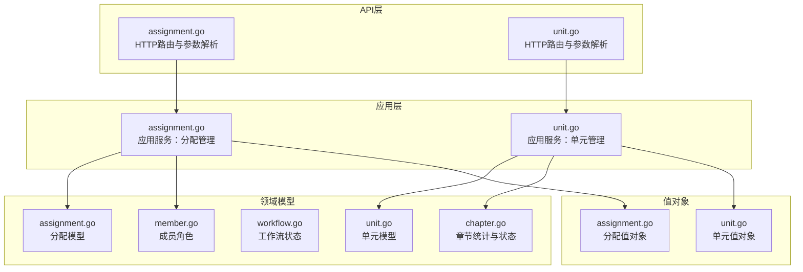
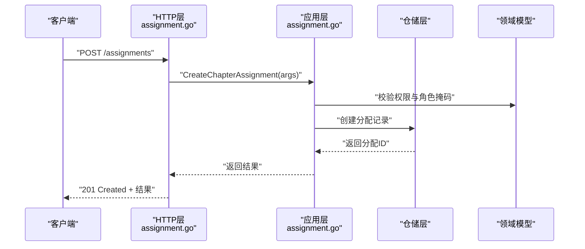
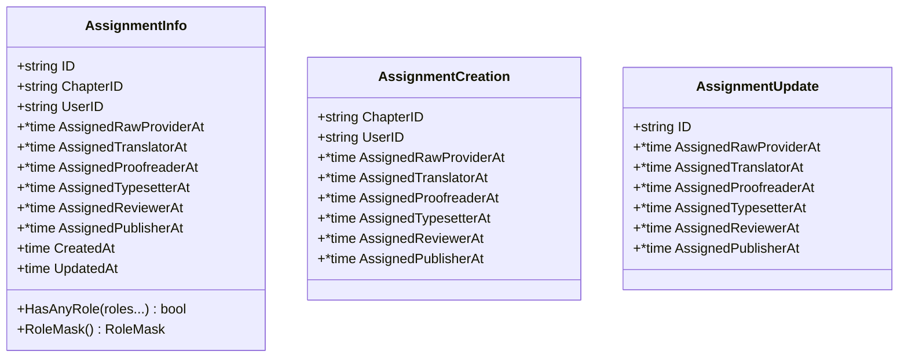
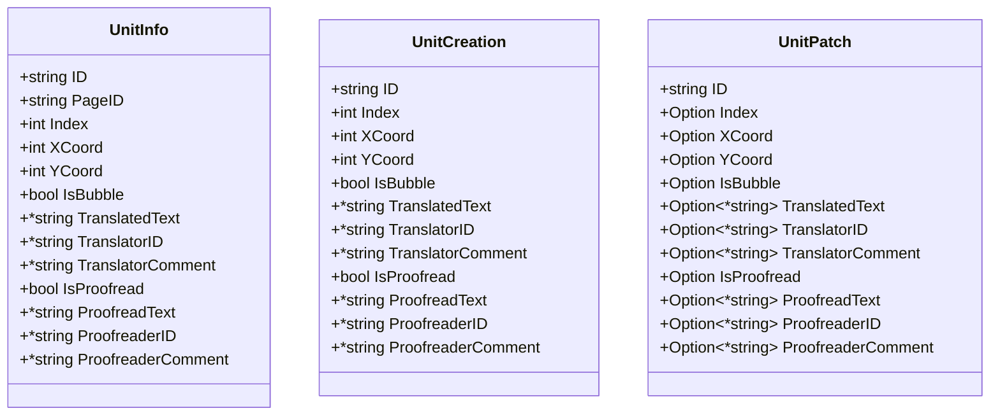
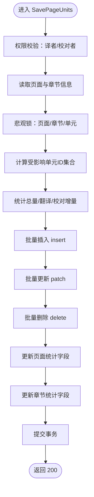
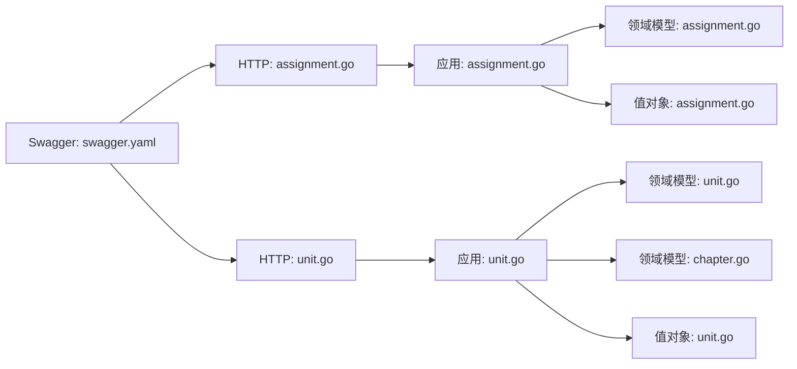

# 任务分配与单元API

<cite>
**本文引用的文件**
- [assignment.go](file://internal/api/http/assignment.go)
- [unit.go](file://internal/api/http/unit.go)
- [assignment.go](file://internal/application/assignment.go)
- [unit.go](file://internal/application/unit.go)
- [assignment.go](file://internal/domain/model/assignment.go)
- [unit.go](file://internal/domain/model/unit.go)
- [assignment.go](file://internal/value/assignment.go)
- [unit.go](file://internal/value/unit.go)
- [workflow.go](file://internal/domain/model/workflow.go)
- [chapter.go](file://internal/domain/model/chapter.go)
- [member.go](file://internal/domain/model/member.go)
- [swagger.yaml](file://docs/swagger.yaml)
- [assignment.ts](file://frontend/src/api/modules/assignment.ts)
</cite>

## 目录
1. [简介](#简介)
2. [项目结构](#项目结构)
3. [核心组件](#核心组件)
4. [架构总览](#架构总览)
5. [详细组件分析](#详细组件分析)
6. [依赖分析](#依赖分析)
7. [性能考虑](#性能考虑)
8. [故障排查指南](#故障排查指南)
9. [结论](#结论)
10. [附录](#附录)

## 简介
本文件为“任务分配与单元管理”子系统的API文档，覆盖以下能力：
- 任务分配：创建、查询（章节/我的）、更新（全量替换角色）、删除
- 单元管理：获取页面单元列表、保存单元diff（insert/patch/delete）
- 权限模型：基于章节/页面/成员角色的细粒度控制
- 工作流与状态：章节工作流状态（上传/翻译/校对/排版/审阅/发布）及状态转换规则
- 统计与进度：页面/章节单元统计字段的增量更新与一致性保障
- 错误码与响应格式：统一的HTTP状态码与错误消息约定
- 使用场景与集成：前端SDK对接、项目管理集成建议

## 项目结构
后端采用分层架构：
- API层：定义HTTP路由与参数解析
- 应用层：编排业务逻辑、权限校验、事务控制
- 领域模型：数据结构与状态机
- 值对象：对外API的数据契约
- Swagger：OpenAPI规范与示例

**图表来源**
- [assignment.go:1-228](file://internal/api/http/assignment.go#L1-L228)
- [unit.go:1-91](file://internal/api/http/unit.go#L1-L91)
- [assignment.go:1-358](file://internal/application/assignment.go#L1-L358)
- [unit.go:1-416](file://internal/application/unit.go#L1-L416)
- [assignment.go:1-190](file://internal/domain/model/assignment.go#L1-L190)
- [unit.go:1-149](file://internal/domain/model/unit.go#L1-L149)
- [workflow.go:1-36](file://internal/domain/model/workflow.go#L1-L36)
- [chapter.go:1-260](file://internal/domain/model/chapter.go#L1-L260)
- [member.go:1-205](file://internal/domain/model/member.go#L1-L205)
- [assignment.go:1-131](file://internal/value/assignment.go#L1-L131)
- [unit.go:1-59](file://internal/value/unit.go#L1-L59)

**章节来源**
- [assignment.go:1-228](file://internal/api/http/assignment.go#L1-L228)
- [unit.go:1-91](file://internal/api/http/unit.go#L1-L91)
- [assignment.go:1-358](file://internal/application/assignment.go#L1-L358)
- [unit.go:1-416](file://internal/application/unit.go#L1-L416)
- [assignment.go:1-190](file://internal/domain/model/assignment.go#L1-L190)
- [unit.go:1-149](file://internal/domain/model/unit.go#L1-L149)
- [workflow.go:1-36](file://internal/domain/model/workflow.go#L1-L36)
- [chapter.go:1-260](file://internal/domain/model/chapter.go#L1-L260)
- [member.go:1-205](file://internal/domain/model/member.go#L1-L205)
- [assignment.go:1-131](file://internal/value/assignment.go#L1-L131)
- [unit.go:1-59](file://internal/value/unit.go#L1-L59)

## 核心组件
- 任务分配API
  - 列表查询（章节/我的）
  - 创建分配
  - 更新分配（全量替换角色）
  - 删除分配
- 单元管理API
  - 获取页面单元列表
  - 保存页面单元diff（insert/patch/delete）

**章节来源**
- [assignment.go:10-228](file://internal/api/http/assignment.go#L10-L228)
- [unit.go:10-91](file://internal/api/http/unit.go#L10-L91)
- [assignment.go:20-46](file://internal/application/assignment.go#L20-L46)
- [unit.go:18-35](file://internal/application/unit.go#L18-L35)

## 架构总览
API请求从HTTP层进入，经应用层执行业务逻辑与权限校验，最终通过仓储层持久化。单元保存涉及悲观锁与事务，确保统计字段一致性。

**图表来源**
- [assignment.go:97-138](file://internal/api/http/assignment.go#L97-L138)
- [assignment.go:214-265](file://internal/application/assignment.go#L214-L265)

**章节来源**
- [assignment.go:97-138](file://internal/api/http/assignment.go#L97-L138)
- [assignment.go:214-265](file://internal/application/assignment.go#L214-L265)

## 详细组件分析

### 任务分配API

#### 1) 获取章节分配列表
- 方法与路径
  - GET /assignments
- 权限
  - 需要ApiKey鉴权；仅章节成员可访问
- 查询参数
  - chapter_id: 章节ID（必填）
  - includes[]: 关联包含（可选值：user, chapter, chapter.comic, chapter.creator）
  - offset: 偏移量（必填）
  - limit: 每页数量（必填）
- 响应
  - 200: 返回 AssignmentInfo 数组
- 错误
  - 400: 查询参数格式错误
  - 403: 权限不足

请求示例
- GET /api/v1/assignments?chapter_id=CH001&includes[]=user&includes[]=chapter&offset=0&limit=20

响应示例
- 200 [{id: "...", user_id: "...", chapter_id: "...", assigned_translator_at: 1700000000, created_at: 1700000000, updated_at: 1700000000}]

错误示例
- 400 {"error": "查询参数格式错误: ..."}
- 403 {"error": "权限不足"}

**章节来源**
- [assignment.go:10-52](file://internal/api/http/assignment.go#L10-L52)
- [assignment.go:92-157](file://internal/application/assignment.go#L92-L157)
- [swagger.yaml:646-685](file://docs/swagger.yaml#L646-L685)

#### 2) 获取我的分配列表
- 方法与路径
  - GET /assignments/mine
- 权限
  - 需要ApiKey鉴权
- 查询参数
  - includes[]: 关联包含（可选值：chapter, chapter.comic, chapter.creator）
  - offset: 偏移量（必填）
  - limit: 每页数量（必填）
- 响应
  - 200: 返回 AssignmentInfo 数组
- 错误
  - 400: 查询参数格式错误

请求示例
- GET /api/v1/assignments/mine?offset=0&limit=20

响应示例
- 200 [{id: "...", user_id: "...", chapter_id: "...", assigned_reviewer_at: 1700000000, created_at: 1700000000, updated_at: 1700000000}]

**章节来源**
- [assignment.go:54-95](file://internal/api/http/assignment.go#L54-L95)
- [assignment.go:159-212](file://internal/application/assignment.go#L159-L212)
- [swagger.yaml:754-788](file://docs/swagger.yaml#L754-L788)

#### 3) 创建章节分配
- 方法与路径
  - POST /assignments
- 权限
  - 需要ApiKey鉴权；当前用户在该章节需拥有 reviewer 角色
- 请求体
  - chapter_id: 章节ID（必填）
  - user_id: 用户ID（必填）
  - role: 角色掩码（必填，见“角色与掩码”）
- 响应
  - 201: 返回 CreateChapterAssignmentResult
- 错误
  - 400: 请求体格式错误或参数校验失败
  - 403: 权限不足

请求示例
- POST /api/v1/assignments
- Body: {"chapter_id":"CH001","user_id":"U001","role":3}

响应示例
- 201 {"id": "ASSIGN001"}

**章节来源**
- [assignment.go:97-138](file://internal/api/http/assignment.go#L97-L138)
- [assignment.go:214-265](file://internal/application/assignment.go#L214-L265)
- [assignment.go:57-85](file://internal/value/assignment.go#L57-L85)
- [swagger.yaml:686-708](file://docs/swagger.yaml#L686-L708)

#### 4) 更新分配角色（全量替换）
- 方法与路径
  - PUT /assignments/{assignment_id}
- 权限
  - 需要ApiKey鉴权；当前用户在该章节需拥有 reviewer 角色
- 路径参数
  - assignment_id: 分配ID（必填）
- 请求体
  - id: 分配ID（必填）
  - role: 新角色掩码（必填）
- 响应
  - 200: 成功
- 错误
  - 400: 请求体格式错误或参数校验失败

请求示例
- PUT /api/v1/assignments/ASSIGN001
- Body: {"id":"ASSIGN001","role":5}

响应示例
- 200

**章节来源**
- [assignment.go:140-187](file://internal/api/http/assignment.go#L140-L187)
- [assignment.go:267-315](file://internal/application/assignment.go#L267-L315)
- [assignment.go:87-107](file://internal/value/assignment.go#L87-L107)
- [swagger.yaml:728-753](file://docs/swagger.yaml#L728-L753)

#### 5) 删除分配
- 方法与路径
  - DELETE /assignments/{assignment_id}
- 权限
  - 需要ApiKey鉴权；当前用户在该章节需拥有 reviewer 角色
- 路径参数
  - assignment_id: 分配ID（必填）
- 响应
  - 200: 成功
- 错误
  - 400: 缺少路径参数或操作失败

请求示例
- DELETE /api/v1/assignments/ASSIGN001

响应示例
- 200

**章节来源**
- [assignment.go:189-227](file://internal/api/http/assignment.go#L189-L227)
- [assignment.go:317-357](file://internal/application/assignment.go#L317-L357)
- [swagger.yaml:709-727](file://docs/swagger.yaml#L709-L727)

### 单元管理API

#### 1) 获取页面单元列表
- 方法与路径
  - GET /units
- 权限
  - 需要ApiKey鉴权；译者或校对者可访问
- 查询参数
  - page_id: 页面ID（必填）
- 响应
  - 200: 返回 UnitInfo 数组（空列表返回null而非空数组）
- 错误
  - 400: 缺少page_id或参数错误
  - 403: 权限不足

请求示例
- GET /api/v1/units?page_id=PAGE001

响应示例
- 200 [{"id":"U001","page_id":"PAGE001","index":1,"x_coord":100,"y_coord":200,"is_bubble":true,"translated_text":"...","translator_id":"U001","is_proofread":true,"proofread_text":"...","proofreader_id":"U002"}]

**章节来源**
- [unit.go:10-49](file://internal/api/http/unit.go#L10-L49)
- [unit.go:81-123](file://internal/application/unit.go#L81-L123)
- [unit.go:5-24](file://internal/value/unit.go#L5-L24)
- [swagger.yaml:1-800](file://docs/swagger.yaml#L1-L800)

#### 2) 保存页面单元diff
- 方法与路径
  - PUT /units
- 权限
  - 需要ApiKey鉴权；译者或校对者可访问
- 请求体
  - page_id: 页面ID（必填）
  - unit_diff: 包含 insert/patch/delete
    - insert: UnitCreation 数组
    - patch: UnitPatch 数组
    - delete: ID字符串数组
- 响应
  - 200: 成功
- 错误
  - 400: 请求体格式错误或参数校验失败
  - 403: 权限不足

请求示例
- PUT /api/v1/units
- Body: {"page_id":"PAGE001","unit_diff":{"insert":[{"id":"U001","index":1,"x_coord":100,"y_coord":200,"is_bubble":true,"translated_text":"...","translator_id":"U001","is_proofread":false}],"patch":[{"id":"U002","is_proofread":true}],"delete":["U003"]}}

响应示例
- 200

**章节来源**
- [unit.go:51-90](file://internal/api/http/unit.go#L51-L90)
- [unit.go:125-415](file://internal/application/unit.go#L125-L415)
- [unit.go:26-59](file://internal/value/unit.go#L26-L59)
- [swagger.yaml:368-494](file://docs/swagger.yaml#L368-L494)

### 数据模型与序列图

#### 分配模型类图

**图表来源**
- [assignment.go:5-190](file://internal/domain/model/assignment.go#L5-L190)

**章节来源**
- [assignment.go:5-190](file://internal/domain/model/assignment.go#L5-L190)

#### 单元模型类图

**图表来源**
- [unit.go:7-149](file://internal/domain/model/unit.go#L7-L149)

**章节来源**
- [unit.go:7-149](file://internal/domain/model/unit.go#L7-L149)

#### 单元保存流程图（diff语义）

**图表来源**
- [unit.go:125-415](file://internal/application/unit.go#L125-L415)

**章节来源**
- [unit.go:125-415](file://internal/application/unit.go#L125-L415)

### 角色与掩码
- 角色位掩码（RoleMask）用于表示多角色分配，支持如下角色位：
  - RawProvider
  - Translator
  - Proofreader
  - Typesetter
  - Reviewer
  - Publisher
- PUT更新采用全量替换策略：保留已有角色的时间戳，新增角色写入当前时间，移除角色置空。

**章节来源**
- [assignment.go:127-189](file://internal/domain/model/assignment.go#L127-L189)
- [assignment.go:57-107](file://internal/value/assignment.go#L57-L107)

### 工作流与状态
- 工作流类型（Workflow）
  - uploading, translating, proofreading, typesetting, reviewing, publishing
- 工作流状态（WorkflowStatus）
  - pending, in_progress, completed, unset
- 状态有效性规则
  - uploading/reviewing/publishing：仅允许 pending/completed
  - translating/proofreading/typesetting：允许 pending/in_progress/completed

**章节来源**
- [workflow.go:1-36](file://internal/domain/model/workflow.go#L1-L36)
- [chapter.go:126-259](file://internal/domain/model/chapter.go#L126-L259)

### 统计字段与进度监控
- 页面统计字段
  - total_unit_count
  - translated_unit_count
  - proofread_unit_count
- 章节统计字段
  - total_unit_count
  - translated_unit_count
  - proofread_unit_count
- 计算规则
  - insert：总量+1，若包含翻译文本则翻译数+1，若标记校对则校对数+1
  - patch：根据翻译/校对状态变化增减
  - delete：总量-1，若原单元有翻译则翻译数-1，若原单元已校对则校对数-1
- 事务保证
  - 保存单元与更新统计在同一事务内完成，失败自动回滚

**章节来源**
- [unit.go:268-414](file://internal/application/unit.go#L268-L414)
- [chapter.go:83-103](file://internal/domain/model/chapter.go#L83-L103)

### 错误码与响应格式
- 通用约定
  - 成功：200/201
  - 参数错误：400
  - 权限不足：403
  - 服务器内部错误：500
- 响应体
  - 成功：accept(ctx, message, data)
  - 失败：reject(ctx, statusCode, message)

**章节来源**
- [assignment.go:28-51](file://internal/api/http/assignment.go#L28-L51)
- [assignment.go:71-94](file://internal/api/http/assignment.go#L71-L94)
- [unit.go:25-48](file://internal/api/http/unit.go#L25-L48)
- [unit.go:67-89](file://internal/api/http/unit.go#L67-L89)

## 依赖分析
- API层依赖应用层提供的服务接口
- 应用层依赖仓储层与领域模型
- 值对象作为API契约，驱动序列化/反序列化
- Swagger定义了OpenAPI规范与示例

**图表来源**
- [assignment.go:1-228](file://internal/api/http/assignment.go#L1-L228)
- [unit.go:1-91](file://internal/api/http/unit.go#L1-L91)
- [assignment.go:1-358](file://internal/application/assignment.go#L1-L358)
- [unit.go:1-416](file://internal/application/unit.go#L1-L416)
- [assignment.go:1-190](file://internal/domain/model/assignment.go#L1-L190)
- [unit.go:1-149](file://internal/domain/model/unit.go#L1-L149)
- [chapter.go:1-260](file://internal/domain/model/chapter.go#L1-L260)
- [assignment.go:1-131](file://internal/value/assignment.go#L1-L131)
- [unit.go:1-59](file://internal/value/unit.go#L1-L59)
- [swagger.yaml:1-800](file://docs/swagger.yaml#L1-L800)

**章节来源**
- [assignment.go:1-228](file://internal/api/http/assignment.go#L1-L228)
- [unit.go:1-91](file://internal/api/http/unit.go#L1-L91)
- [assignment.go:1-358](file://internal/application/assignment.go#L1-L358)
- [unit.go:1-416](file://internal/application/unit.go#L1-L416)
- [swagger.yaml:1-800](file://docs/swagger.yaml#L1-L800)

## 性能考虑
- 分页查询：通过offset/limit限制单次返回量，避免大列表传输
- 关联包含：按需使用includes，减少不必要的JOIN与序列化开销
- 事务批处理：insert/patch/delete采用批量操作，降低数据库往返
- 悲观锁：在事务内锁定页面/章节/单元，避免并发写冲突
- 统计字段增量：仅计算差量并原子更新，避免全量扫描

[本节为通用指导，无需列出具体文件来源]

## 故障排查指南
- 400 参数错误
  - 检查请求体JSON格式与必填字段
  - 章节/页面ID是否为空
- 403 权限不足
  - 当前用户是否具备reviewer角色
  - 是否属于目标章节/页面
- 500 服务器错误
  - 查看应用日志定位事务回滚原因
  - 检查统计字段负值保护逻辑

**章节来源**
- [assignment.go:34-51](file://internal/api/http/assignment.go#L34-L51)
- [assignment.go:77-94](file://internal/api/http/assignment.go#L77-L94)
- [unit.go:31-48](file://internal/api/http/unit.go#L31-L48)
- [unit.go:73-89](file://internal/api/http/unit.go#L73-L89)
- [unit.go:206-223](file://internal/application/unit.go#L206-L223)
- [unit.go:362-370](file://internal/application/unit.go#L362-L370)

## 结论
本API体系以清晰的分层架构实现了任务分配与单元管理的核心能力，结合严格的权限模型、工作流状态机与事务性统计更新，能够支撑漫画翻译项目的高效协作。建议在前端集成时遵循OpenAPI规范与值对象契约，确保请求参数与响应格式一致。

[本节为总结性内容，无需列出具体文件来源]

## 附录

### 使用场景与项目管理集成
- 场景一：创建章节分配
  - 触发时机：新章节建立后指派译者/校对者
  - 前端对接：调用创建分配接口，传入chapter_id、user_id、role
- 场景二：单元编辑与进度追踪
  - 触发时机：译者/校对者在页面上编辑单元
  - 前端对接：先GET单元列表，再PUT保存diff，最后轮询统计字段更新
- 场景三：工作流推进
  - 触发时机：章节状态变更（如翻译完成）
  - 后端对接：调用章节更新接口，设置translate_status为completed

**章节来源**
- [assignment.ts:63-98](file://frontend/src/api/modules/assignment.ts#L63-L98)
- [swagger.yaml:646-788](file://docs/swagger.yaml#L646-L788)