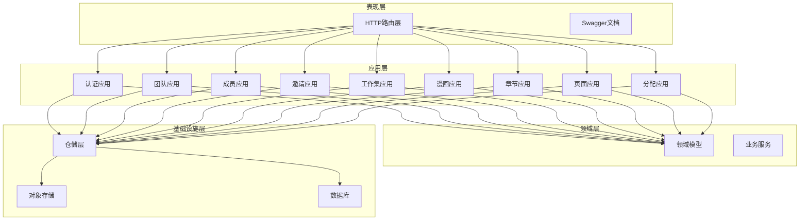
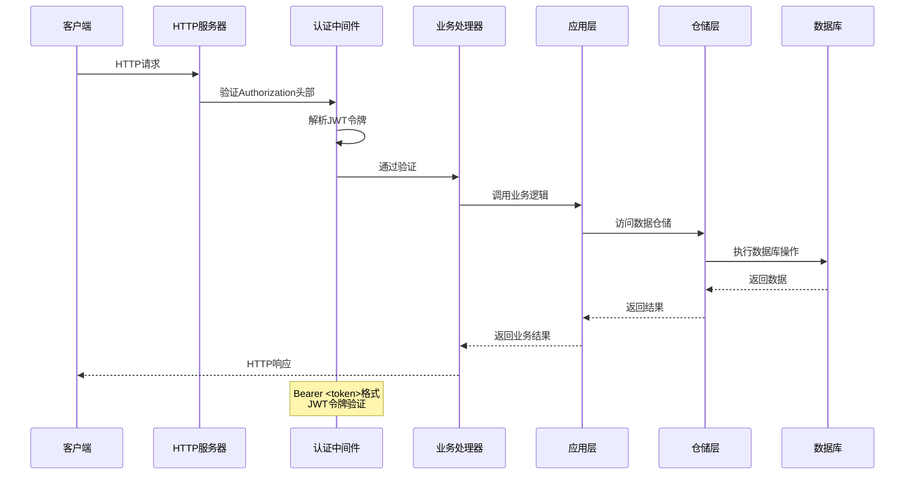
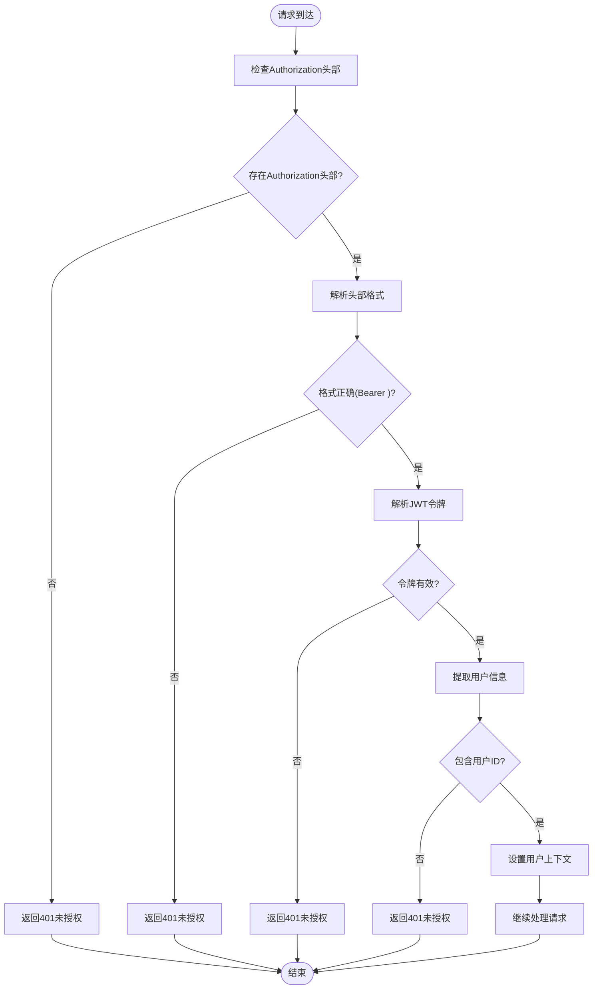
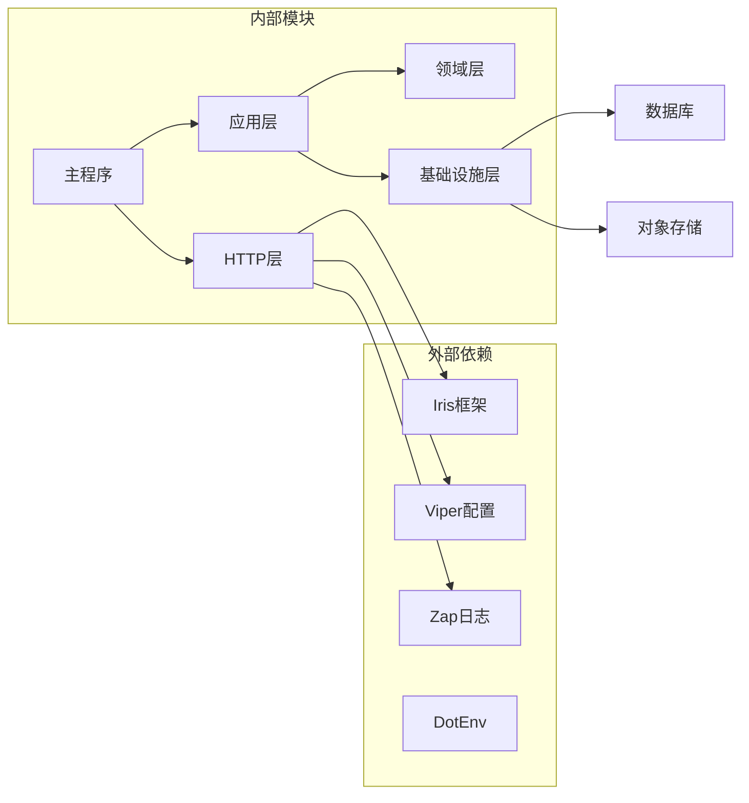

# 后端API文档

<cite>
**本文档引用的文件**
- [main.go](file://main.go)
- [http.go](file://internal/api/http/http.go)
- [middleware.go](file://internal/api/http/middleware.go)
- [auth.go](file://internal/api/http/auth.go)
- [user.go](file://internal/api/http/user.go)
- [team.go](file://internal/api/http/team.go)
- [member.go](file://internal/api/http/member.go)
- [invitation.go](file://internal/api/http/invitation.go)
- [comic.go](file://internal/api/http/comic.go)
- [workset.go](file://internal/api/http/workset.go)
- [chapter.go](file://internal/api/http/chapter.go)
- [page.go](file://internal/api/http/page.go)
- [assignment.go](file://internal/api/http/assignment.go)
- [config.go](file://internal/config/config.go)
- [swagger.yaml](file://docs/swagger.yaml)
</cite>

## 目录
1. [简介](#简介)
2. [项目结构](#项目结构)
3. [核心组件](#核心组件)
4. [架构概览](#架构概览)
5. [详细组件分析](#详细组件分析)
6. [依赖关系分析](#依赖关系分析)
7. [性能考虑](#性能考虑)
8. [故障排除指南](#故障排除指南)
9. [结论](#结论)
10. [附录](#附录)

## 简介
本项目是一个漫画翻译协作平台的后端服务，基于Go语言和Iris框架构建。系统采用RESTful API设计，提供完整的漫画翻译工作流管理功能，包括用户管理、团队协作、章节管理、页面标注和分配管理等核心业务模块。

## 项目结构
后端服务采用分层架构设计，主要分为以下几个层次：

**图表来源**
- [main.go:12-136](file://main.go#L12-L136)
- [http.go:16-151](file://internal/api/http/http.go#L16-L151)

**章节来源**
- [main.go:25-145](file://main.go#L25-L145)
- [http.go:16-151](file://internal/api/http/http.go#L16-L151)

## 核心组件
系统的核心组件包括认证中间件、路由管理器和各个业务应用层。所有API都遵循统一的错误处理和响应格式规范。

**章节来源**
- [middleware.go:47-79](file://internal/api/http/middleware.go#L47-L79)
- [http.go:16-151](file://internal/api/http/http.go#L16-L151)

## 架构概览

**图表来源**
- [middleware.go:47-79](file://internal/api/http/middleware.go#L47-L79)
- [http.go:47-151](file://internal/api/http/http.go#L47-L151)

## 详细组件分析

### 认证与授权

#### JWT令牌认证机制
系统采用JWT（JSON Web Token）进行用户身份认证，所有受保护的API端点都需要有效的访问令牌。

**图表来源**
- [middleware.go:47-79](file://internal/api/http/middleware.go#L47-L79)

**章节来源**
- [middleware.go:47-79](file://internal/api/http/middleware.go#L47-L79)
- [config.go:69-83](file://internal/config/config.go#L69-L83)

### 用户管理API

#### 用户认证端点
系统提供完整的用户认证功能，包括登录和注册两个核心端点。

**登录端点**
- 方法: POST
- 路径: `/api/v1/auth/login`
- 功能: 使用QQ号和密码进行用户登录
- 请求参数: QQ号、密码
- 响应: 访问令牌和用户ID

**注册端点**
- 方法: POST
- 路径: `/api/v1/auth/register`
- 功能: 新用户注册，需要有效的邀请码
- 请求参数: QQ号、密码、用户名、邀请码
- 响应: 访问令牌和用户ID

**章节来源**
- [auth.go:10-72](file://internal/api/http/auth.go#L10-L72)
- [swagger.yaml:789-850](file://docs/swagger.yaml#L789-L850)

#### 用户信息管理
系统提供全面的用户信息管理功能，支持头像上传、信息更新和删除操作。

**获取用户信息**
- 方法: GET
- 路径: `/api/v1/users/{user_id}`
- 权限: 需要认证
- 参数: 用户ID
- 响应: 用户详细信息

**更新用户信息**
- 方法: PUT
- 路径: `/api/v1/users/{user_id}`
- 权限: 需要认证
- 参数: 用户ID、更新参数
- 响应: 操作结果

**删除用户**
- 方法: DELETE
- 路径: `/api/v1/users/{user_id}`
- 权限: 需要认证
- 参数: 用户ID
- 响应: 操作结果

**章节来源**
- [user.go:10-292](file://internal/api/http/user.go#L10-L292)
- [swagger.yaml:100-180](file://docs/swagger.yaml#L100-L180)

### 团队管理API

#### 汉化组管理
系统提供完整的汉化组管理功能，支持创建、查询、更新和删除操作。

**创建汉化组**
- 方法: POST
- 路径: `/api/v1/teams`
- 权限: 需要认证
- 参数: 汉化组名称、描述
- 响应: 创建结果

**获取汉化组列表**
- 方法: GET
- 路径: `/api/v1/teams`
- 权限: 需要认证
- 参数: 分页参数
- 响应: 汉化组列表

**更新汉化组信息**
- 方法: PUT
- 路径: `/api/v1/teams/{team_id}`
- 权限: 需要认证
- 参数: 汉化组ID、更新参数
- 响应: 操作结果

**删除汉化组**
- 方法: DELETE
- 路径: `/api/v1/teams/{team_id}`
- 权限: 需要认证
- 参数: 汉化组ID
- 响应: 操作结果

**章节来源**
- [team.go:10-289](file://internal/api/http/team.go#L10-L289)
- [swagger.yaml:375-450](file://docs/swagger.yaml#L375-L450)

### 成员管理API

#### 成员关系管理
系统提供成员关系的完整生命周期管理，包括创建、查询、角色更新和移除。

**创建成员**
- 方法: POST
- 路径: `/api/v1/members`
- 权限: 需要认证
- 参数: 用户ID、汉化组ID、角色
- 响应: 成员ID

**获取成员列表**
- 方法: GET
- 路径: `/api/v1/members`
- 权限: 需要认证
- 参数: 汉化组ID、分页参数
- 响应: 成员列表

**更新成员角色**
- 方法: PUT
- 路径: `/api/v1/members/{member_id}`
- 权限: 需要认证
- 参数: 成员ID、角色
- 响应: 操作结果

**移除成员**
- 方法: DELETE
- 路径: `/api/v1/members/{member_id}`
- 权限: 需要认证
- 参数: 成员ID
- 响应: 操作结果

**章节来源**
- [member.go:10-272](file://internal/api/http/member.go#L10-L272)
- [swagger.yaml:259-340](file://docs/swagger.yaml#L259-L340)

### 邀请管理API

#### 邀请机制
系统提供基于邀请码的团队加入机制，支持邀请的创建、查询、更新和删除。

**创建邀请**
- 方法: POST
- 路径: `/api/v1/invitations`
- 权限: 需要认证
- 参数: 汉化组ID、被邀请人QQ、角色
- 响应: 邀请信息

**获取邀请列表**
- 方法: GET
- 路径: `/api/v1/invitations`
- 权限: 需要认证
- 参数: 汉化组ID、分页参数
- 响应: 邀请列表

**更新邀请**
- 方法: PUT
- 路径: `/api/v1/invitations/{invitation_id}`
- 权限: 需要认证
- 参数: 邀请ID、更新参数
- 响应: 操作结果

**删除邀请**
- 方法: DELETE
- 路径: `/api/v1/invitations/{invitation_id}`
- 权限: 需要认证
- 参数: 邀请ID
- 响应: 操作结果

**章节来源**
- [invitation.go:10-185](file://internal/api/http/invitation.go#L10-L185)
- [swagger.yaml:221-280](file://docs/swagger.yaml#L221-L280)

### 漫画管理API

#### 漫画作品管理
系统提供漫画作品的完整管理功能，支持创建、查询、更新和删除操作。

**获取漫画列表**
- 方法: GET
- 路径: `/api/v1/comics`
- 权限: 需要认证
- 参数: 工作集ID、分页参数
- 响应: 漫画列表

**创建漫画**
- 方法: POST
- 路径: `/api/v1/comics`
- 权限: 需要认证
- 参数: 标题、作者、描述、工作集ID
- 响应: 漫画ID

**更新漫画信息**
- 方法: PUT
- 路径: `/api/v1/comics/{comic_id}`
- 权限: 需要认证
- 参数: 漫画ID、更新参数
- 响应: 操作结果

**删除漫画**
- 方法: DELETE
- 路径: `/api/v1/comics/{comic_id}`
- 权限: 需要认证
- 参数: 漫画ID
- 响应: 操作结果

**章节来源**
- [comic.go:10-189](file://internal/api/http/comic.go#L10-L189)
- [swagger.yaml:99-170](file://docs/swagger.yaml#L99-L170)

### 工作集管理API

#### 工作集管理
系统提供工作集的管理功能，支持创建、查询、更新和删除操作。

**获取工作集列表**
- 方法: GET
- 路径: `/api/v1/worksets`
- 权限: 需要认证
- 参数: 汉化组ID、分页参数
- 响应: 工作集列表

**创建工作集**
- 方法: POST
- 路径: `/api/v1/worksets`
- 权限: 需要认证
- 参数: 名称、描述、汉化组ID
- 响应: 工作集ID

**更新工作集信息**
- 方法: PUT
- 路径: `/api/v1/worksets/{workset_id}`
- 权限: 需要认证
- 参数: 工作集ID、更新参数
- 响应: 操作结果

**删除工作集**
- 方法: DELETE
- 路径: `/api/v1/worksets/{workset_id}`
- 权限: 需要认证
- 参数: 工作集ID
- 响应: 操作结果

**章节来源**
- [workset.go:10-189](file://internal/api/http/workset.go#L10-L189)
- [swagger.yaml:619-680](file://docs/swagger.yaml#L619-L680)

### 章节管理API

#### 章节管理
系统提供漫画章节的管理功能，支持创建、查询、更新和删除操作。

**获取章节列表**
- 方法: GET
- 路径: `/api/v1/chapters`
- 权限: 需要认证
- 参数: 漫画ID、分页参数
- 响应: 章节列表

**创建章节**
- 方法: POST
- 路径: `/api/v1/chapters`
- 权限: 需要认证
- 参数: 漫画ID、章节编号
- 响应: 章节ID

**更新章节信息**
- 方法: PATCH
- 路径: `/api/v1/chapters/{chapter_id}`
- 权限: 需要认证
- 参数: 章节ID、更新参数
- 响应: 操作结果

**删除章节**
- 方法: DELETE
- 路径: `/api/v1/chapters/{chapter_id}`
- 权限: 需要认证
- 参数: 章节ID
- 响应: 操作结果

**章节来源**
- [chapter.go:10-185](file://internal/api/http/chapter.go#L10-L185)
- [swagger.yaml:52-120](file://docs/swagger.yaml#L52-L120)

### 页面管理API

#### 页面管理
系统提供页面的管理功能，支持批量创建、查询、更新和删除操作。

**获取页面列表**
- 方法: GET
- 路径: `/api/v1/pages`
- 权限: 需要认证
- 参数: 章节ID、分页参数
- 响应: 页面列表

**预留页面并生成上传URL**
- 方法: POST
- 路径: `/api/v1/pages`
- 权限: 需要认证
- 参数: 章节ID、页面数量
- 响应: 页面创建结果（包含预签名URL）

**更新页面信息**
- 方法: PUT
- 路径: `/api/v1/pages/{page_id}`
- 权限: 需要认证
- 参数: 页面ID、更新参数
- 响应: 操作结果

**删除章节所有页面**
- 方法: DELETE
- 路径: `/api/v1/pages/{chapter_id}`
- 权限: 需要认证
- 参数: 章节ID
- 响应: 操作结果

**章节来源**
- [page.go:10-189](file://internal/api/http/page.go#L10-L189)
- [swagger.yaml:299-360](file://docs/swagger.yaml#L299-L360)

### 分配管理API

#### 分配管理
系统提供工作分配的管理功能，支持创建、查询、更新和删除操作。

**获取章节分配列表**
- 方法: GET
- 路径: `/api/v1/assignments`
- 权限: 需要认证
- 参数: 章节ID、分页参数
- 响应: 分配列表

**获取我的分配列表**
- 方法: GET
- 路径: `/api/v1/assignments/mine`
- 权限: 需要认证
- 参数: 分页参数
- 响应: 分配列表

**创建章节分配**
- 方法: POST
- 路径: `/api/v1/assignments`
- 权限: 需要认证
- 参数: 章节ID、用户ID、角色
- 响应: 分配ID

**更新分配角色**
- 方法: PUT
- 路径: `/api/v1/assignments/{assignment_id}`
- 权限: 需要认证
- 参数: 分配ID、更新参数
- 响应: 操作结果

**删除分配**
- 方法: DELETE
- 路径: `/api/v1/assignments/{assignment_id}`
- 权限: 需要认证
- 参数: 分配ID
- 响应: 操作结果

**章节来源**
- [assignment.go:10-228](file://internal/api/http/assignment.go#L10-L228)
- [swagger.yaml:19-80](file://docs/swagger.yaml#L19-L80)

## 依赖关系分析

**图表来源**
- [main.go:12-23](file://main.go#L12-L23)
- [http.go:3-14](file://internal/api/http/http.go#L3-L14)

**章节来源**
- [main.go:12-23](file://main.go#L12-L23)
- [http.go:3-14](file://internal/api/http/http.go#L3-L14)

## 性能考虑
系统在设计时充分考虑了性能优化和扩展性需求：

1. **连接池管理**: 数据库连接采用连接池配置，支持最小空闲连接数和最大打开连接数的动态调整
2. **中间件优化**: 启用了请求ID追踪、日志记录和异常恢复中间件，确保系统的稳定性和可观测性
3. **缓存策略**: 对于频繁访问的数据（如用户信息、团队信息）建议实现适当的缓存机制
4. **分页查询**: 所有列表查询都支持分页，避免一次性返回大量数据
5. **批量操作**: 支持批量创建页面等操作，减少网络往返次数

## 故障排除指南

### 常见错误类型及处理

**认证相关错误**
- 401 未授权: 检查Authorization头部格式是否为"Bearer <token>"
- 403 禁止访问: 检查用户权限和团队成员身份

**请求参数错误**
- 400 请求参数错误: 检查请求体格式和必填参数
- 404 资源不存在: 检查资源ID的有效性

**服务器错误**
- 500 服务器内部错误: 查看服务器日志获取详细错误信息

**章节来源**
- [middleware.go:47-79](file://internal/api/http/middleware.go#L47-L79)
- [http.go:16-24](file://internal/api/http/http.go#L16-L24)

## 结论
本漫画翻译协作平台后端API提供了完整的RESTful接口，涵盖了从用户认证到漫画翻译全流程的各个业务环节。系统采用清晰的分层架构设计，具备良好的可扩展性和维护性。通过JWT认证机制和完善的权限控制，确保了系统的安全性。Swagger文档的集成使得API的使用和测试变得更加便捷。

## 附录

### API版本控制策略
- 版本号: 0.1.0
- 基础路径: `/api/v1`
- 版本升级策略: 向后兼容的变更通过新增字段实现，破坏性变更创建新版本

### 速率限制
系统当前未实现全局速率限制，建议在生产环境中根据业务需求添加适当的速率限制策略。

### 安全考虑
- JWT令牌有效期: 通过配置文件设置（小时）
- HTTPS传输: 建议在生产环境中启用HTTPS
- 输入验证: 所有API端点都包含输入参数验证
- 权限控制: 基于用户角色的细粒度权限控制

### 在线Swagger文档使用指南
1. 启动服务后访问: `http://localhost:port/swagger/index.html`
2. 在Swagger界面中可以查看所有API文档
3. 可以直接在界面中测试API调用
4. 支持导出API文档为多种格式

### API测试工具推荐
1. **Postman**: 功能完整的API测试工具
2. **Insomnia**: 现代化的API客户端
3. **curl**: 命令行测试工具
4. **Swagger UI**: 内置的在线测试界面

**章节来源**
- [config.go:69-83](file://internal/config/config.go#L69-L83)
- [http.go:153-166](file://internal/api/http/http.go#L153-L166)