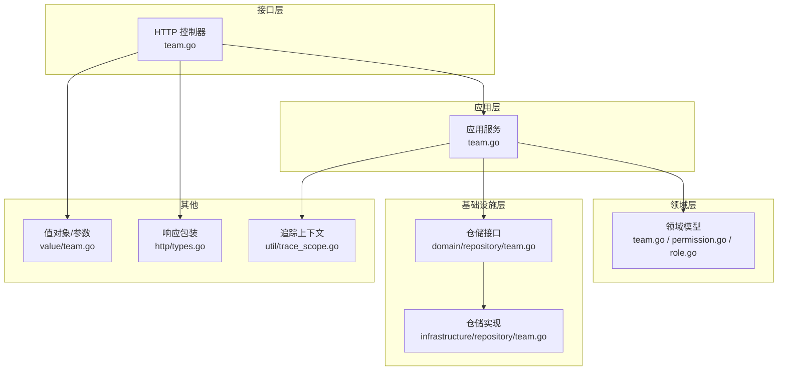
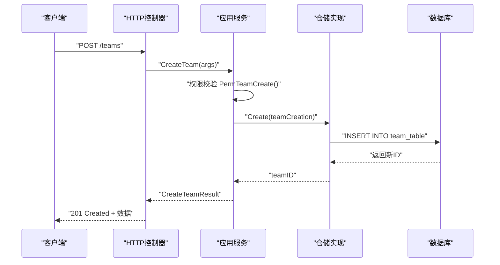
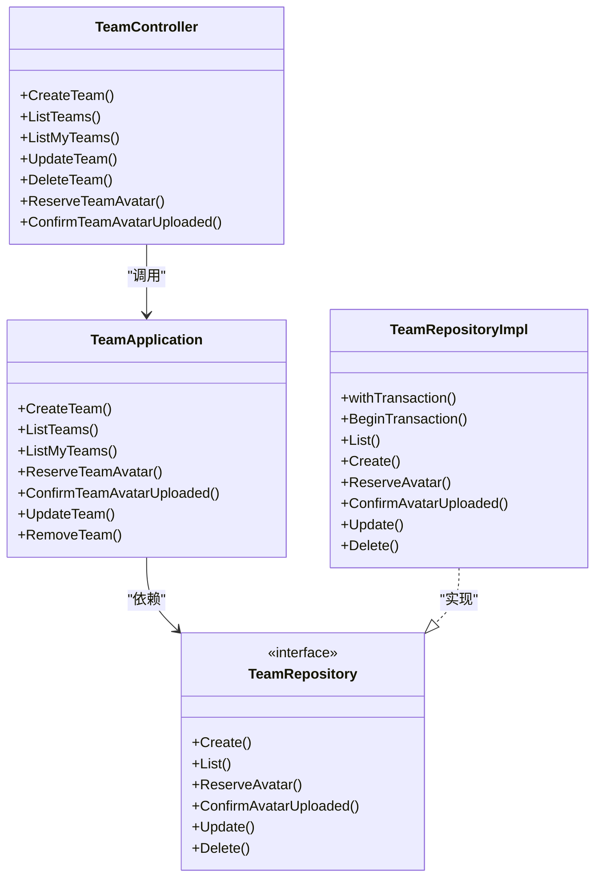

# 团队管理API

<cite>
**本文引用的文件**
- [internal/api/http/team.go](file://internal/api/http/team.go)
- [internal/application/team.go](file://internal/application/team.go)
- [internal/value/team.go](file://internal/value/team.go)
- [internal/domain/model/team.go](file://internal/domain/model/team.go)
- [internal/domain/model/permission.go](file://internal/domain/model/permission.go)
- [internal/domain/model/role.go](file://internal/domain/model/role.go)
- [internal/domain/repository/team.go](file://internal/domain/repository/team.go)
- [internal/infrastructure/repository/team.go](file://internal/infrastructure/repository/team.go)
- [internal/api/http/types.go](file://internal/api/http/types.go)
- [internal/domain/repository/types.go](file://internal/domain/repository/types.go)
- [internal/util/trace_scope.go](file://internal/util/trace_scope.go)
- [migrations/20260301065012_team-table.up.sql](file://migrations/20260301065012_team-table.up.sql)
- [frontend/src/api/modules/team.ts](file://frontend/src/api/modules/team.ts)
</cite>

## 目录
1. [引言](#引言)
2. [项目结构](#项目结构)
3. [核心组件](#核心组件)
4. [架构总览](#架构总览)
5. [详细组件分析](#详细组件分析)
6. [依赖分析](#依赖分析)
7. [性能考虑](#性能考虑)
8. [故障排除指南](#故障排除指南)
9. [结论](#结论)
10. [附录](#附录)

## 引言
本文件为团队管理API的完整技术文档，覆盖团队创建、查询、更新、删除以及头像上传的全流程。文档从接口定义、权限模型、数据模型、错误码到前端集成示例进行系统性说明，并提供流程图与时序图帮助理解端到端交互。

## 项目结构
团队管理API位于后端Go服务的多层架构中，按职责划分为：
- 接口层：负责HTTP路由、参数解析、鉴权与响应包装
- 应用层：编排业务逻辑，执行权限校验与领域模型操作
- 领域层：定义团队、成员、角色、权限等核心模型
- 基础设施层：数据库仓储与实体映射
- 前端模块：封装HTTP调用与类型定义

图表来源
- [internal/api/http/team.go:1-289](file://internal/api/http/team.go#L1-L289)
- [internal/application/team.go:1-415](file://internal/application/team.go#L1-L415)
- [internal/domain/model/team.go:1-63](file://internal/domain/model/team.go#L1-L63)
- [internal/domain/model/permission.go:302-349](file://internal/domain/model/permission.go#L302-L349)
- [internal/domain/model/role.go:1-56](file://internal/domain/model/role.go#L1-L56)
- [internal/domain/repository/team.go:1-14](file://internal/domain/repository/team.go#L1-L14)
- [internal/infrastructure/repository/team.go:1-110](file://internal/infrastructure/repository/team.go#L1-L110)
- [internal/value/team.go:1-112](file://internal/value/team.go#L1-L112)
- [internal/api/http/types.go:1-10](file://internal/api/http/types.go#L1-L10)
- [internal/util/trace_scope.go:1-30](file://internal/util/trace_scope.go#L1-L30)

章节来源
- [internal/api/http/team.go:1-289](file://internal/api/http/team.go#L1-L289)
- [internal/application/team.go:1-415](file://internal/application/team.go#L1-L415)
- [internal/domain/model/team.go:1-63](file://internal/domain/model/team.go#L1-L63)
- [internal/domain/model/permission.go:302-349](file://internal/domain/model/permission.go#L302-L349)
- [internal/domain/model/role.go:1-56](file://internal/domain/model/role.go#L1-L56)
- [internal/domain/repository/team.go:1-14](file://internal/domain/repository/team.go#L1-L14)
- [internal/infrastructure/repository/team.go:1-110](file://internal/infrastructure/repository/team.go#L1-L110)
- [internal/value/team.go:1-112](file://internal/value/team.go#L1-L112)
- [internal/api/http/types.go:1-10](file://internal/api/http/types.go#L1-L10)
- [internal/util/trace_scope.go:1-30](file://internal/util/trace_scope.go#L1-L30)

## 核心组件
- HTTP控制器：暴露REST端点，解析请求参数，调用应用服务，封装统一响应
- 应用服务：执行权限校验、参数校验、调用仓储与外部服务（如OSS）
- 领域模型：TeamInfo/TeamCreation/TeamUpdate；权限模型PermTeam*；角色枚举与掩码
- 仓储接口与实现：抽象数据库操作，实现事务、分页、过滤
- 响应包装：统一返回格式，包含状态码、消息与数据
- 前端模块：封装HTTP调用与类型定义，便于集成

章节来源
- [internal/api/http/team.go:10-289](file://internal/api/http/team.go#L10-L289)
- [internal/application/team.go:20-90](file://internal/application/team.go#L20-L90)
- [internal/domain/model/team.go:5-62](file://internal/domain/model/team.go#L5-L62)
- [internal/domain/model/permission.go:302-349](file://internal/domain/model/permission.go#L302-L349)
- [internal/domain/model/role.go:9-17](file://internal/domain/model/role.go#L9-L17)
- [internal/domain/repository/team.go:5-13](file://internal/domain/repository/team.go#L5-L13)
- [internal/infrastructure/repository/team.go:12-110](file://internal/infrastructure/repository/team.go#L12-L110)
- [internal/api/http/types.go:3-9](file://internal/api/http/types.go#L3-L9)
- [frontend/src/api/modules/team.ts:1-81](file://frontend/src/api/modules/team.ts#L1-L81)

## 架构总览
团队管理API遵循“接口层-应用层-领域层-基础设施层”的分层设计，通过应用服务编排业务，结合权限模型与角色体系实现细粒度的访问控制。

图表来源
- [internal/api/http/team.go:10-47](file://internal/api/http/team.go#L10-L47)
- [internal/application/team.go:92-130](file://internal/application/team.go#L92-L130)
- [internal/infrastructure/repository/team.go:53-67](file://internal/infrastructure/repository/team.go#L53-L67)

## 详细组件分析

### 团队创建
- HTTP方法与路径：POST /teams
- 认证：需要ApiKeyAuth
- 请求体参数：CreateTeamArgs（名称、简介）
- 成功响应：201 Created，返回CreateTeamResult（包含团队ID）
- 失败响应：400 Bad Request（参数错误/权限不足/创建失败）

业务规则与约束
- 名称长度1~20字符
- 简介长度不超过100字符
- 仅超级管理员可创建团队
- 创建时头像字段初始化为空，未上传状态

章节来源
- [internal/api/http/team.go:10-47](file://internal/api/http/team.go#L10-L47)
- [internal/application/team.go:92-130](file://internal/application/team.go#L92-L130)
- [internal/value/team.go:8-29](file://internal/value/team.go#L8-L29)
- [internal/domain/model/permission.go:321-326](file://internal/domain/model/permission.go#L321-L326)
- [internal/infrastructure/repository/team.go:53-67](file://internal/infrastructure/repository/team.go#L53-L67)

### 团队列表查询（全量）
- HTTP方法与路径：GET /teams
- 查询参数：offset、limit（分页）
- 认证：需要ApiKeyAuth
- 成功响应：200 OK，返回TeamInfo数组（可能为null而非空数组）
- 失败响应：403 Forbidden（权限不足）

章节来源
- [internal/api/http/team.go:49-86](file://internal/api/http/team.go#L49-L86)
- [internal/application/team.go:132-184](file://internal/application/team.go#L132-L184)
- [internal/value/team.go:35-45](file://internal/value/team.go#L35-L45)
- [internal/domain/model/permission.go:314-319](file://internal/domain/model/permission.go#L314-L319)

### 我的团队列表
- HTTP方法与路径：GET /teams/mine
- 查询参数：offset、limit（分页）
- 认证：需要ApiKeyAuth
- 成功响应：200 OK，返回TeamInfo数组（可能为null）
- 失败响应：403 Forbidden（权限不足）

章节来源
- [internal/api/http/team.go:88-125](file://internal/api/http/team.go#L88-L125)
- [internal/application/team.go:234-299](file://internal/application/team.go#L234-L299)
- [internal/value/team.go:35-45](file://internal/value/team.go#L35-L45)

### 团队信息更新
- HTTP方法与路径：PUT /teams/{team_id}
- 路径参数：team_id
- 请求体参数：UpdateTeamArgs（名称、简介）
- 认证：需要ApiKeyAuth
- 成功响应：200 OK（无数据）
- 失败响应：400 Bad Request（参数错误/权限不足/更新失败）

权限模型
- 超级管理员或团队管理员可更新团队信息

章节来源
- [internal/api/http/team.go:127-171](file://internal/api/http/team.go#L127-L171)
- [internal/application/team.go:301-343](file://internal/application/team.go#L301-L343)
- [internal/value/team.go:52-79](file://internal/value/team.go#L52-L79)
- [internal/domain/model/permission.go:328-340](file://internal/domain/model/permission.go#L328-L340)

### 团队删除
- HTTP方法与路径：DELETE /teams/{team_id}
- 路径参数：team_id
- 认证：需要ApiKeyAuth
- 成功响应：200 OK（无数据）
- 失败响应：403 Forbidden（权限不足/删除失败）

章节来源
- [internal/api/http/team.go:254-289](file://internal/api/http/team.go#L254-L289)
- [internal/application/team.go:382-414](file://internal/application/team.go#L382-L414)
- [internal/domain/model/permission.go:342-349](file://internal/domain/model/permission.go#L342-L349)

### 团队头像上传（两阶段）
- 预留上传通道
  - HTTP方法与路径：POST /teams/{team_id}/avatar
  - 功能：生成预签名PUT URL并预留avatar_oss_key
  - 成功响应：200 OK，返回ReserveTeamAvatarResult（包含avatar_oss_key与put_url）
  - 失败响应：400 Bad Request（权限不足/预留失败）
- 确认上传完成
  - HTTP方法与路径：POST /teams/{team_id}/avatar/confirm
  - 功能：标记头像已上传
  - 成功响应：200 OK（无数据）
  - 失败响应：400 Bad Request（权限不足/确认失败）

权限模型
- 仅超级管理员或团队管理员可操作头像

章节来源
- [internal/api/http/team.go:173-252](file://internal/api/http/team.go#L173-L252)
- [internal/application/team.go:186-232](file://internal/application/team.go#L186-L232)
- [internal/application/team.go:345-380](file://internal/application/team.go#L345-L380)
- [internal/domain/model/permission.go:328-340](file://internal/domain/model/permission.go#L328-L340)

### 统一响应格式
- 字段：code（状态码）、message（消息）、data（业务数据，成功时返回）
- 用于所有团队管理端点的成功与错误响应

章节来源
- [internal/api/http/types.go:3-9](file://internal/api/http/types.go#L3-L9)

### 前端集成示例
- 列表查询：getTeamList(query)
- 我的团队：getMyTeams()
- 创建团队：createTeam({ name, description? })
- 返回类型：TeamInfo[] 或 TeamInfo（视端点而定）

章节来源
- [frontend/src/api/modules/team.ts:48-80](file://frontend/src/api/modules/team.ts#L48-L80)

## 依赖分析

图表来源
- [internal/api/http/team.go:10-289](file://internal/api/http/team.go#L10-L289)
- [internal/application/team.go:20-90](file://internal/application/team.go#L20-L90)
- [internal/domain/repository/team.go:5-13](file://internal/domain/repository/team.go#L5-L13)
- [internal/infrastructure/repository/team.go:12-110](file://internal/infrastructure/repository/team.go#L12-L110)

## 性能考虑
- 分页查询：列表接口支持offset/limit，避免一次性加载过多数据
- N+1查询优化：我的团队列表在用户成员记录较少时采用直接查询，减少复杂关联
- 预签名URL：头像上传通过OSS直传，降低服务端负载与延迟
- 日志与追踪：应用层使用TraceScope记录关键事件，便于定位性能瓶颈

## 故障排除指南
常见错误与处理建议
- 400 参数错误
  - 检查请求体格式与必填字段
  - 校验名称长度与简介长度
- 400 预留头像失败/确认失败
  - 检查OSS客户端可用性与权限
  - 确认团队ID有效且未被删除
- 403 权限不足
  - 确认当前用户是否为超级管理员或团队管理员
  - 检查成员角色与团队归属

章节来源
- [internal/api/http/team.go:32-41](file://internal/api/http/team.go#L32-L41)
- [internal/application/team.go:112-118](file://internal/application/team.go#L112-L118)
- [internal/application/team.go:186-232](file://internal/application/team.go#L186-L232)
- [internal/application/team.go:345-380](file://internal/application/team.go#L345-L380)
- [internal/domain/model/permission.go:314-349](file://internal/domain/model/permission.go#L314-L349)

## 结论
团队管理API以清晰的分层架构与严格的权限模型保障安全性与可维护性。通过两阶段头像上传流程与统一响应格式，提升了用户体验与集成便利性。建议在生产环境中配合日志监控与限流策略，确保高并发下的稳定性。

## 附录

### 数据模型与字段说明
- TeamInfo：id、name、description、avatar_url、is_avatar_uploaded、created_at、updated_at
- TeamCreation：name、description
- TeamUpdate：id、name、description
- ReserveTeamAvatarResult：avatar_oss_key、put_url

章节来源
- [internal/domain/model/team.go:5-62](file://internal/domain/model/team.go#L5-L62)
- [internal/value/team.go:31-50](file://internal/value/team.go#L31-L50)

### 数据库表结构
- 表名：team_table
- 关键列：id、name、description、avatar_oss_key、is_avatar_uploaded、created_at、updated_at、deleted_at
- 约束：唯一索引（name，未删除）

章节来源
- [migrations/20260301065012_team-table.up.sql:1-16](file://migrations/20260301065012_team-table.up.sql#L1-L16)

### 权限模型与角色
- 权限类型：PermTeamListAll、PermTeamCreate、PermTeamUpdate、PermTeamRemove
- 角色常量：RawProvider、Translator、Proofreader、Typesetter、Reviewer、Publisher、Admin
- 权限判定：超级管理员拥有最高权限；团队管理员可管理所属团队

章节来源
- [internal/domain/model/permission.go:302-349](file://internal/domain/model/permission.go#L302-L349)
- [internal/domain/model/role.go:9-17](file://internal/domain/model/role.go#L9-L17)

### 错误码与响应
- 200：成功（部分端点无数据）
- 201：创建成功
- 400：参数错误、权限不足、操作失败
- 403：权限不足

章节来源
- [internal/api/http/team.go:32-41](file://internal/api/http/team.go#L32-L41)
- [internal/application/team.go:112-118](file://internal/application/team.go#L112-L118)
- [internal/api/http/types.go:3-9](file://internal/api/http/types.go#L3-L9)