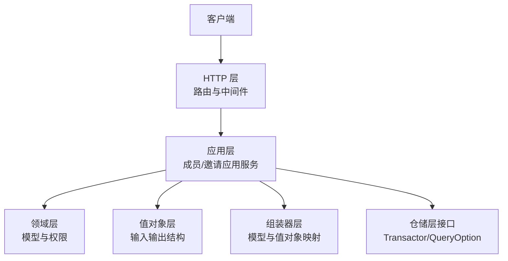
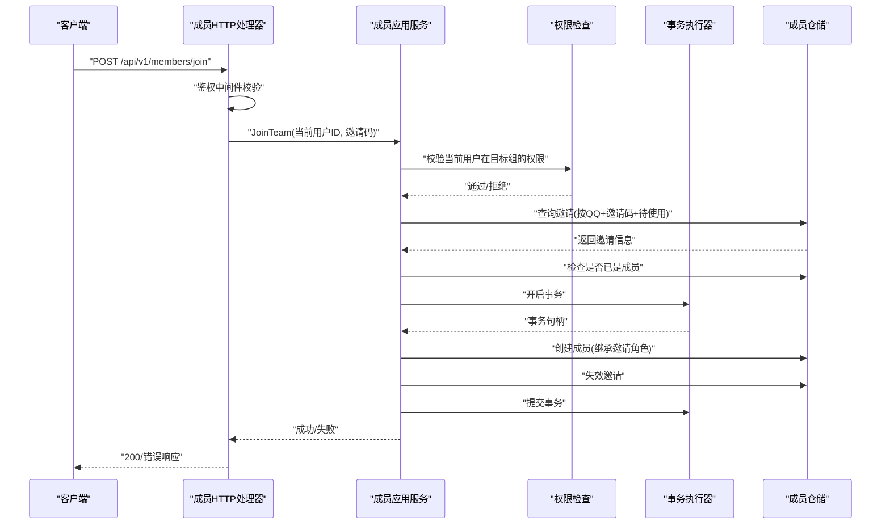
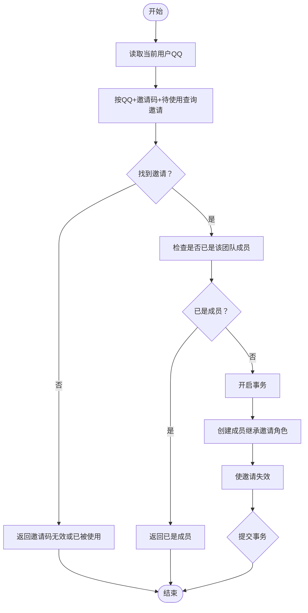
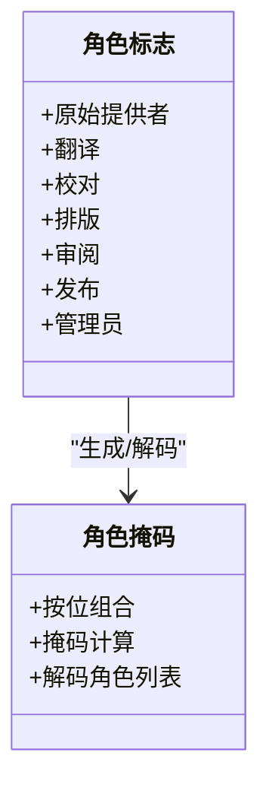
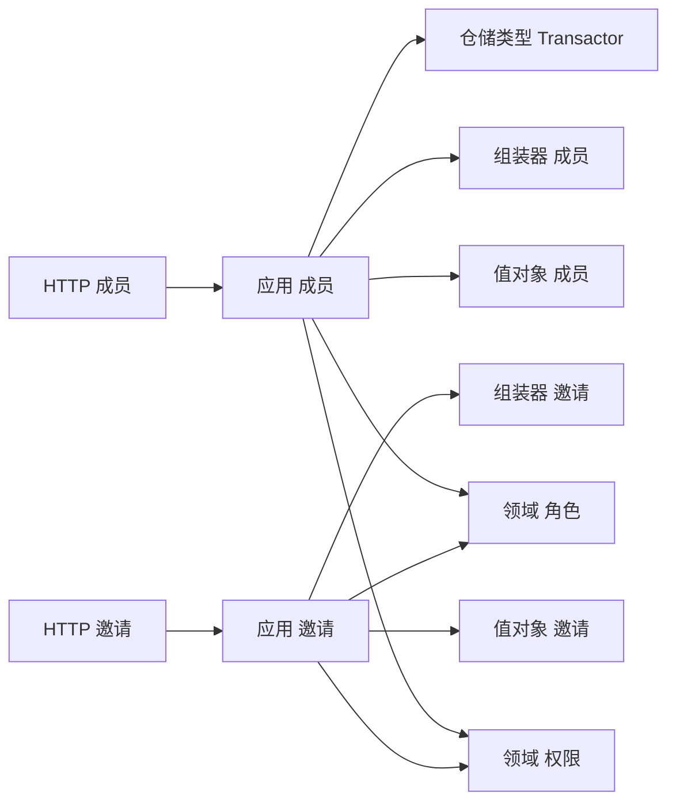

# 成员与邀请API

<cite>
**本文引用的文件**
- [internal/api/http/member.go](file://internal/api/http/member.go)
- [internal/api/http/invitation.go](file://internal/api/http/invitation.go)
- [internal/api/http/http.go](file://internal/api/http/http.go)
- [internal/api/http/middleware.go](file://internal/api/http/middleware.go)
- [internal/application/member.go](file://internal/application/member.go)
- [internal/application/invitation.go](file://internal/application/invitation.go)
- [internal/application/assembler/member.go](file://internal/application/assembler/member.go)
- [internal/application/assembler/invitation.go](file://internal/application/assembler/invitation.go)
- [internal/domain/model/member.go](file://internal/domain/model/member.go)
- [internal/domain/model/invitation.go](file://internal/domain/model/invitation.go)
- [internal/domain/model/permission.go](file://internal/domain/model/permission.go)
- [internal/domain/model/role.go](file://internal/domain/model/role.go)
- [internal/domain/service/invitation.go](file://internal/domain/service/invitation.go)
- [internal/value/member.go](file://internal/value/member.go)
- [internal/value/invitation.go](file://internal/value/invitation.go)
- [internal/domain/repository/types.go](file://internal/domain/repository/types.go)
</cite>

## 目录
1. [简介](#简介)
2. [项目结构](#项目结构)
3. [核心组件](#核心组件)
4. [架构总览](#架构总览)
5. [详细组件分析](#详细组件分析)
6. [依赖分析](#依赖分析)
7. [性能考虑](#性能考虑)
8. [故障排查指南](#故障排查指南)
9. [结论](#结论)
10. [附录](#附录)

## 简介
本文件为成员管理与邀请系统的完整API文档，覆盖成员邀请、加入、退出与角色管理的全部接口，包括：
- HTTP方法、URL模式、请求参数、响应格式与错误码
- 邀请码生成算法、邀请状态管理与成员权限继承机制
- 邀请流程的业务逻辑、成员角色转换与权限传递规则
- 邀请链接安全机制、过期策略与重复邀请处理
- 成员管理API的集成示例与最佳实践

## 项目结构
后端基于 Iris 框架，采用分层架构：
- HTTP 层：定义路由与中间件，负责鉴权、参数解析与响应封装
- 应用层：编排业务流程，执行权限校验与事务控制
- 领域层：模型与权限规则，定义角色掩码与权限检查
- 值对象层：输入输出数据结构与校验
- 组装器层：领域模型与应用值对象之间的映射

图表来源
- [internal/api/http/http.go:38-92](file://internal/api/http/http.go#L38-L92)
- [internal/api/http/member.go:23-271](file://internal/api/http/member.go#L23-L271)
- [internal/api/http/invitation.go:26-184](file://internal/api/http/invitation.go#L26-L184)
- [internal/application/member.go:53-82](file://internal/application/member.go#L53-L82)
- [internal/application/invitation.go:42-68](file://internal/application/invitation.go#L42-L68)
- [internal/domain/model/permission.go:200-246](file://internal/domain/model/permission.go#L200-L246)
- [internal/domain/repository/types.go:5-11](file://internal/domain/repository/types.go#L5-L11)

章节来源
- [internal/api/http/http.go:26-151](file://internal/api/http/http.go#L26-L151)
- [internal/api/http/member.go:10-271](file://internal/api/http/member.go#L10-L271)
- [internal/api/http/invitation.go:10-184](file://internal/api/http/invitation.go#L10-L184)

## 核心组件
- HTTP 路由与中间件
  - 鉴权中间件：校验 Bearer Token 并注入用户ID
  - 日志中间件：记录请求耗时与状态
  - Swagger UI：非生产环境暴露接口文档
- 成员应用服务
  - 创建成员、列出成员、列出我的成员、更新成员角色、移除成员、加入团队
- 邀请应用服务
  - 列出邀请、创建邀请、更新邀请、删除邀请
- 领域模型与权限
  - 角色掩码与角色标志，权限检查（邀请/成员操作）
- 值对象与组装器
  - 输入参数校验、输出结构映射

章节来源
- [internal/api/http/middleware.go:47-79](file://internal/api/http/middleware.go#L47-L79)
- [internal/application/member.go:20-51](file://internal/application/member.go#L20-L51)
- [internal/application/invitation.go:19-40](file://internal/application/invitation.go#L19-L40)
- [internal/domain/model/role.go:9-55](file://internal/domain/model/role.go#L9-L55)
- [internal/domain/model/permission.go:200-246](file://internal/domain/model/permission.go#L200-L246)
- [internal/application/assembler/member.go:9-37](file://internal/application/assembler/member.go#L9-L37)
- [internal/application/assembler/invitation.go:8-24](file://internal/application/assembler/invitation.go#L8-L24)

## 架构总览
成员与邀请API遵循“鉴权 -> 应用层校验 -> 领域层权限 -> 仓储/事务”的调用链路。

图表来源
- [internal/api/http/member.go:191-231](file://internal/api/http/member.go#L191-L231)
- [internal/application/member.go:340-447](file://internal/application/member.go#L340-L447)
- [internal/domain/model/permission.go:379-395](file://internal/domain/model/permission.go#L379-L395)
- [internal/domain/repository/types.go:9-11](file://internal/domain/repository/types.go#L9-L11)

## 详细组件分析

### 成员管理API

- 路由与鉴权
  - 所有成员相关接口均需通过鉴权中间件，使用 Bearer Token 注入当前用户ID
  - 接口前缀：/api/v1/members

- 接口清单
  - POST /members
    - 功能：超级管理员直接创建成员
    - 鉴权：仅超级管理员
    - 请求体：CreateMemberArgs
    - 响应：201 + CreateMemberResult
    - 错误：400 参数错误/权限不足；403 权限不足
  - GET /members
    - 功能：列出指定汉化组成员
    - 查询参数：team_id, includes[], offset, limit
    - 鉴权：汉化组管理员
    - 响应：200 + []MemberInfo
    - 错误：400 参数错误；403 权限不足
  - GET /members/mine
    - 功能：列出当前用户的成员身份
    - 查询参数：includes[], offset, limit
    - 鉴权：已登录
    - 响应：200 + []MemberInfo
    - 错误：400 参数错误
  - PUT /members/{member_id}
    - 功能：更新成员角色（全量替换）
    - 路径参数：member_id
    - 请求体：UpdateMemberRoleArgs
    - 鉴权：汉化组管理员
    - 响应：200
    - 错误：400 参数错误/权限不足；403 权限不足
  - DELETE /members/{member_id}
    - 功能：移除成员
    - 路径参数：member_id
    - 鉴权：汉化组管理员
    - 响应：200
    - 错误：403 权限不足

- 数据模型与映射
  - MemberInfo：包含成员ID、用户ID、团队ID、角色掩码与各角色分配时间戳
  - MemberInfo 映射：AssembleMemberInfo 将领域模型转换为应用值对象

- 业务逻辑要点
  - 更新角色：PUT 语义为全量替换；已存在角色保留原时间，新增角色记录当前时间
  - 加入团队：通过邀请码与当前用户QQ匹配邀请，事务内创建成员并使邀请失效

章节来源
- [internal/api/http/member.go:10-271](file://internal/api/http/member.go#L10-L271)
- [internal/application/member.go:20-51](file://internal/application/member.go#L20-L51)
- [internal/application/member.go:245-338](file://internal/application/member.go#L245-L338)
- [internal/application/member.go:340-447](file://internal/application/member.go#L340-L447)
- [internal/application/assembler/member.go:9-37](file://internal/application/assembler/member.go#L9-L37)
- [internal/domain/model/member.go:48-205](file://internal/domain/model/member.go#L48-L205)
- [internal/value/member.go:31-139](file://internal/value/member.go#L31-L139)

### 邀请管理API

- 路由与鉴权
  - 所有邀请相关接口均需通过鉴权中间件
  - 接口前缀：/api/v1/invitations

- 接口清单
  - GET /invitations
    - 功能：列出指定汉化组邀请
    - 查询参数：team_id, includes[], offset, limit
    - 鉴权：汉化组管理员
    - 响应：200 + []InvitationInfo
    - 错误：400 参数错误；403 权限不足
  - POST /invitations
    - 功能：创建邀请
    - 请求体：CreateInvitationArgs（team_id, invitee_qq, roles）
    - 鉴权：汉化组管理员
    - 响应：201 + InvitationInfo（包含邀请码）
    - 错误：400 参数错误；403 权限不足
  - PUT /invitations/{invitation_id}
    - 功能：更新未使用邀请的角色
    - 路径参数：invitation_id
    - 请求体：UpdateInvitationArgs（id, team_id, roles）
    - 鉴权：汉化组管理员
    - 响应：200
    - 错误：400 参数错误；403 权限不足
  - DELETE /invitations/{invitation_id}
    - 功能：删除邀请
    - 路径参数：invitation_id
    - 鉴权：汉化组管理员
    - 响应：200
    - 错误：403 权限不足

- 邀请码生成与状态
  - 邀请码生成：基于 UUID v7，取末尾固定长度片段
  - 邀请状态：创建时标记为“待使用”，加入后由应用层使邀请失效

- 业务逻辑要点
  - 创建邀请：校验目标QQ未在同组成为成员；生成邀请码并持久化
  - 更新邀请：仅允许更新“待使用”邀请的角色
  - 删除邀请：鉴权后删除

章节来源
- [internal/api/http/invitation.go:10-184](file://internal/api/http/invitation.go#L10-L184)
- [internal/application/invitation.go:71-303](file://internal/application/invitation.go#L71-L303)
- [internal/domain/service/invitation.go:5-15](file://internal/domain/service/invitation.go#L5-L15)
- [internal/domain/model/invitation.go:63-158](file://internal/domain/model/invitation.go#L63-L158)
- [internal/value/invitation.go:15-93](file://internal/value/invitation.go#L15-L93)
- [internal/application/assembler/invitation.go:8-24](file://internal/application/assembler/invitation.go#L8-L24)

### 邀请流程与权限继承

图表来源
- [internal/application/member.go:340-447](file://internal/application/member.go#L340-L447)
- [internal/domain/model/invitation.go:63-112](file://internal/domain/model/invitation.go#L63-L112)
- [internal/domain/model/member.go:177-204](file://internal/domain/model/member.go#L177-L204)

章节来源
- [internal/application/member.go:340-447](file://internal/application/member.go#L340-L447)
- [internal/domain/model/invitation.go:63-112](file://internal/domain/model/invitation.go#L63-L112)
- [internal/domain/model/member.go:177-204](file://internal/domain/model/member.go#L177-L204)

### 角色与权限模型

图表来源
- [internal/domain/model/role.go:9-55](file://internal/domain/model/role.go#L9-L55)

章节来源
- [internal/domain/model/role.go:9-55](file://internal/domain/model/role.go#L9-L55)
- [internal/domain/model/permission.go:200-246](file://internal/domain/model/permission.go#L200-L246)

## 依赖分析

图表来源
- [internal/api/http/member.go:23-271](file://internal/api/http/member.go#L23-L271)
- [internal/api/http/invitation.go:26-184](file://internal/api/http/invitation.go#L26-L184)
- [internal/application/member.go:53-82](file://internal/application/member.go#L53-L82)
- [internal/application/invitation.go:42-68](file://internal/application/invitation.go#L42-L68)
- [internal/domain/model/permission.go:200-246](file://internal/domain/model/permission.go#L200-L246)
- [internal/domain/model/role.go:9-55](file://internal/domain/model/role.go#L9-L55)
- [internal/application/assembler/member.go:9-37](file://internal/application/assembler/member.go#L9-L37)
- [internal/application/assembler/invitation.go:8-24](file://internal/application/assembler/invitation.go#L8-L24)
- [internal/domain/repository/types.go:5-11](file://internal/domain/repository/types.go#L5-L11)

章节来源
- [internal/api/http/http.go:38-92](file://internal/api/http/http.go#L38-L92)
- [internal/application/member.go:53-82](file://internal/application/member.go#L53-L82)
- [internal/application/invitation.go:42-68](file://internal/application/invitation.go#L42-L68)

## 性能考虑
- 分页与排序
  - 成员与邀请列表均支持 offset/limit 与排序选项，建议前端按需分页，避免一次性拉取大量数据
- 关联加载
  - includes 参数仅在必要时加载关联信息（如 user/team/invitor），减少不必要的查询
- 事务边界
  - 加入团队与创建邀请等关键流程使用事务，确保一致性；尽量缩短事务持有时间
- 缓存与预签名URL
  - 组装器可结合预签名URL生成策略，减少后续访问开销（具体实现由 OSS 客户端决定）

## 故障排查指南
- 常见错误码
  - 400：请求参数格式错误、缺少必填字段、角色掩码为空
  - 401：未提供或无效的 Authorization 头部
  - 403：权限不足（非管理员/非超级管理员）
  - 500：内部错误（通常由应用层捕获并转换为友好错误消息）
- 常见问题定位
  - 鉴权失败：确认 Bearer Token 是否正确、是否过期、是否携带用户ID
  - 权限不足：确认当前用户在目标团队是否具备相应角色
  - 邀请相关错误：邀请码无效/已使用、邀请已被使用或已失效、重复邀请
  - 加入失败：确认邀请状态为“待使用”、当前用户未在该团队中、事务是否成功提交
- 日志与追踪
  - 开发环境可通过日志中间件查看请求耗时与状态码；生产环境建议通过请求ID串联日志

章节来源
- [internal/api/http/middleware.go:15-79](file://internal/api/http/middleware.go#L15-L79)
- [internal/application/member.go:85-139](file://internal/application/member.go#L85-L139)
- [internal/application/invitation.go:133-213](file://internal/application/invitation.go#L133-L213)

## 结论
成员与邀请API以清晰的鉴权与权限模型为基础，围绕邀请码驱动的加入流程实现了可审计、可扩展的团队协作能力。通过角色掩码与全量替换更新机制，系统在保证一致性的同时提供了灵活的权限管理。建议在集成时严格遵循鉴权与参数校验要求，并结合分页与关联加载策略优化性能。

## 附录

### 邀请码生成算法
- 使用 UUID v7 生成全局唯一标识
- 截取字符串末尾固定长度作为邀请码
- 算法实现参考：[GenerateInvitationCode:5-15](file://internal/domain/service/invitation.go#L5-L15)

章节来源
- [internal/domain/service/invitation.go:5-15](file://internal/domain/service/invitation.go#L5-L15)

### 邀请状态管理
- 创建邀请时标记为“待使用”
- 成功加入团队后由应用层使邀请失效
- 更新邀请仅允许对“待使用”邀请进行角色变更

章节来源
- [internal/application/invitation.go:133-213](file://internal/application/invitation.go#L133-L213)
- [internal/application/member.go:402-447](file://internal/application/member.go#L402-L447)

### 成员权限继承机制
- 加入团队时，成员角色继承自邀请的角色掩码
- 更新成员角色采用全量替换：保留已有角色的时间戳，新增角色记录当前时间

章节来源
- [internal/domain/model/member.go:177-204](file://internal/domain/model/member.go#L177-L204)
- [internal/application/member.go:245-294](file://internal/application/member.go#L245-L294)

### 集成示例与最佳实践
- 集成步骤
  - 登录获取 Bearer Token，并在后续请求头中携带 Authorization: Bearer <token>
  - 创建邀请：POST /api/v1/invitations，传入 team_id、invitee_qq、roles
  - 发送邀请码给被邀请人
  - 被邀请人使用邀请码加入：POST /api/v1/members/join
  - 管理员可在 /api/v1/invitations 与 /api/v1/members 查看与管理
- 最佳实践
  - 严格校验角色掩码与团队ID，避免越权
  - 对列表接口使用分页参数，避免超大数据量返回
  - 对更新邀请与成员角色采用幂等设计，避免重复提交导致的状态异常
  - 对事务性操作做好回滚处理，确保一致性

章节来源
- [internal/api/http/http.go:38-92](file://internal/api/http/http.go#L38-L92)
- [internal/api/http/middleware.go:47-79](file://internal/api/http/middleware.go#L47-L79)
- [internal/application/invitation.go:133-213](file://internal/application/invitation.go#L133-L213)
- [internal/application/member.go:340-447](file://internal/application/member.go#L340-L447)