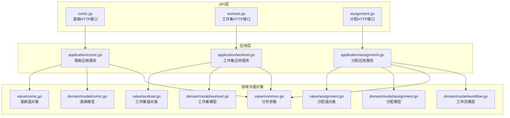
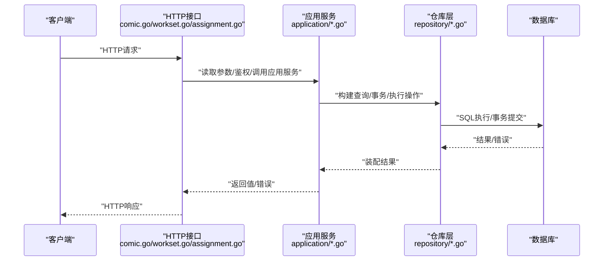
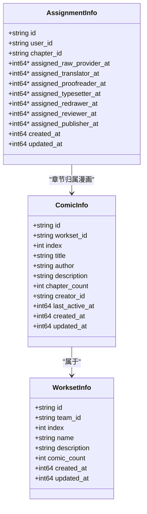
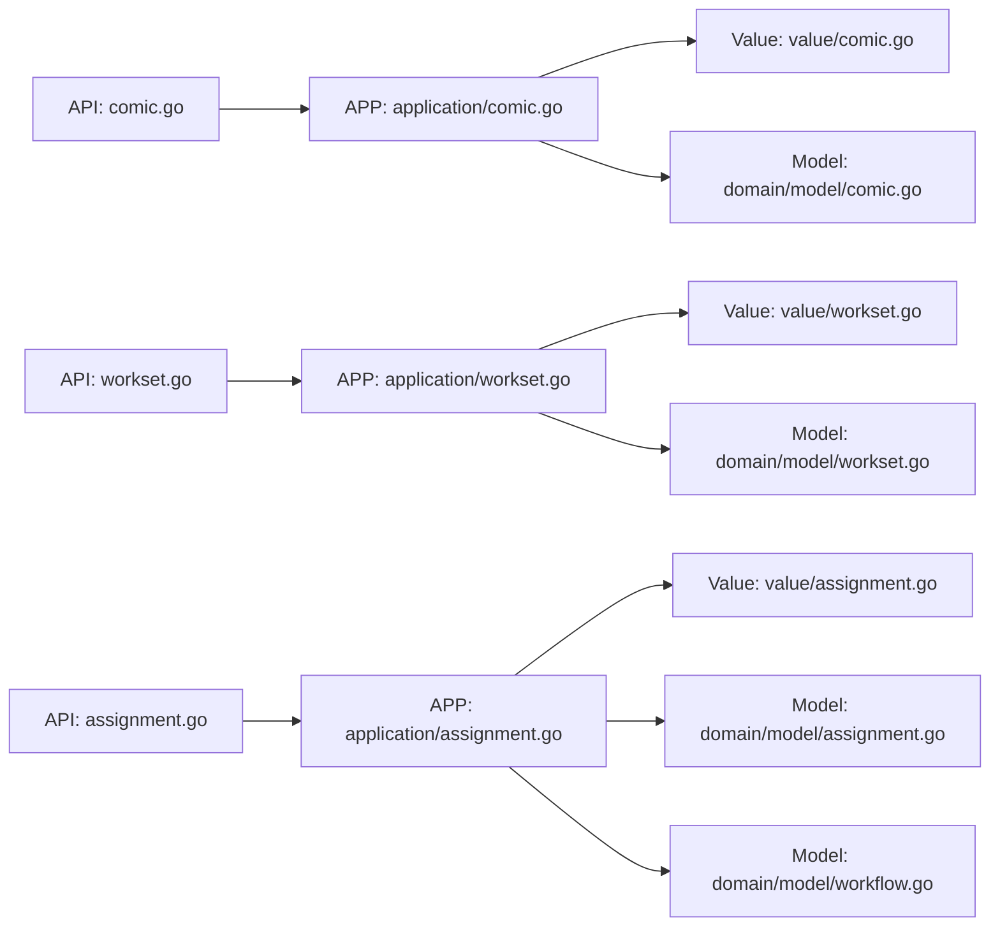

# 漫画与工作集API

<cite>
**本文引用的文件**
- [internal/api/http/comic.go](file://internal/api/http/comic.go)
- [internal/api/http/workset.go](file://internal/api/http/workset.go)
- [internal/api/http/assignment.go](file://internal/api/http/assignment.go)
- [internal/application/comic.go](file://internal/application/comic.go)
- [internal/application/workset.go](file://internal/application/workset.go)
- [internal/application/assignment.go](file://internal/application/assignment.go)
- [internal/value/comic.go](file://internal/value/comic.go)
- [internal/value/workset.go](file://internal/value/workset.go)
- [internal/value/assignment.go](file://internal/value/assignment.go)
- [internal/value/common.go](file://internal/value/common.go)
- [internal/domain/model/comic.go](file://internal/domain/model/comic.go)
- [internal/domain/model/workset.go](file://internal/domain/model/workset.go)
- [internal/domain/model/assignment.go](file://internal/domain/model/assignment.go)
- [internal/domain/model/workflow.go](file://internal/domain/model/workflow.go)
- [frontend/src/api/modules/comic.ts](file://frontend/src/api/modules/comic.ts)
</cite>

## 目录
1. [简介](#简介)
2. [项目结构](#项目结构)
3. [核心组件](#核心组件)
4. [架构总览](#架构总览)
5. [详细组件分析](#详细组件分析)
6. [依赖分析](#依赖分析)
7. [性能考虑](#性能考虑)
8. [故障排查指南](#故障排查指南)
9. [结论](#结论)
10. [附录](#附录)

## 简介
本文件为“漫画作品与工作集管理系统”的后端API文档，覆盖漫画与工作集的创建、查询、更新、删除等操作，以及章节分配相关的接口。文档详细说明：
- HTTP方法、URL模式、请求参数、响应格式与错误码
- 漫画状态与工作流模型、工作集分配策略
- 内容版本控制与一致性保障机制
- 每个端点的请求示例、响应示例与错误处理说明
- 漫画生命周期管理、工作集优先级排序与资源分配算法
- 数据完整性校验、备份恢复与性能优化策略
- API使用场景与前后端集成方案

## 项目结构
后端采用分层架构：
- API层：定义HTTP路由与参数解析
- 应用层：编排业务流程、鉴权与事务控制
- 领域模型与值对象：承载数据结构与规则
- 基础设施与仓库：数据持久化与查询选项
- 前端模块：对API的封装与类型约束

图表来源
- [internal/api/http/comic.go:1-189](file://internal/api/http/comic.go#L1-L189)
- [internal/api/http/workset.go:1-189](file://internal/api/http/workset.go#L1-L189)
- [internal/api/http/assignment.go:1-228](file://internal/api/http/assignment.go#L1-L228)
- [internal/application/comic.go:1-354](file://internal/application/comic.go#L1-L354)
- [internal/application/workset.go:1-310](file://internal/application/workset.go#L1-L310)
- [internal/application/assignment.go:1-358](file://internal/application/assignment.go#L1-L358)
- [internal/value/comic.go:1-124](file://internal/value/comic.go#L1-L124)
- [internal/value/workset.go:1-89](file://internal/value/workset.go#L1-L89)
- [internal/value/assignment.go:1-131](file://internal/value/assignment.go#L1-L131)
- [internal/value/common.go:1-24](file://internal/value/common.go#L1-L24)
- [internal/domain/model/comic.go:1-107](file://internal/domain/model/comic.go#L1-L107)
- [internal/domain/model/workset.go:1-82](file://internal/domain/model/workset.go#L1-L82)
- [internal/domain/model/assignment.go:1-190](file://internal/domain/model/assignment.go#L1-L190)
- [internal/domain/model/workflow.go:1-36](file://internal/domain/model/workflow.go#L1-L36)

章节来源
- [internal/api/http/comic.go:1-189](file://internal/api/http/comic.go#L1-L189)
- [internal/api/http/workset.go:1-189](file://internal/api/http/workset.go#L1-L189)
- [internal/api/http/assignment.go:1-228](file://internal/api/http/assignment.go#L1-L228)
- [internal/application/comic.go:1-354](file://internal/application/comic.go#L1-L354)
- [internal/application/workset.go:1-310](file://internal/application/workset.go#L1-L310)
- [internal/application/assignment.go:1-358](file://internal/application/assignment.go#L1-L358)
- [internal/value/comic.go:1-124](file://internal/value/comic.go#L1-L124)
- [internal/value/workset.go:1-89](file://internal/value/workset.go#L1-L89)
- [internal/value/assignment.go:1-131](file://internal/value/assignment.go#L1-L131)
- [internal/value/common.go:1-24](file://internal/value/common.go#L1-L24)
- [internal/domain/model/comic.go:1-107](file://internal/domain/model/comic.go#L1-L107)
- [internal/domain/model/workset.go:1-82](file://internal/domain/model/workset.go#L1-L82)
- [internal/domain/model/assignment.go:1-190](file://internal/domain/model/assignment.go#L1-L190)
- [internal/domain/model/workflow.go:1-36](file://internal/domain/model/workflow.go#L1-L36)

## 核心组件
- 漫画（Comic）
  - 列表查询、创建、更新、删除
  - 支持 includes：workset、creator
- 工作集（Workset）
  - 列表查询、创建、更新、删除
  - 支持 includes：team
- 分配（Assignment）
  - 列表查询（按章节、按用户）、创建、更新（PUT全量替换）、删除
  - 角色位掩码与时间戳管理

章节来源
- [internal/api/http/comic.go:10-189](file://internal/api/http/comic.go#L10-L189)
- [internal/api/http/workset.go:10-189](file://internal/api/http/workset.go#L10-L189)
- [internal/api/http/assignment.go:10-228](file://internal/api/http/assignment.go#L10-L228)
- [internal/application/comic.go:19-40](file://internal/application/comic.go#L19-L40)
- [internal/application/workset.go:20-41](file://internal/application/workset.go#L20-L41)
- [internal/application/assignment.go:20-46](file://internal/application/assignment.go#L20-L46)

## 架构总览
以下序列图展示典型请求从API到应用层再到仓库层的调用链路。

图表来源
- [internal/api/http/comic.go:25-52](file://internal/api/http/comic.go#L25-L52)
- [internal/api/http/workset.go:25-52](file://internal/api/http/workset.go#L25-L52)
- [internal/api/http/assignment.go:25-52](file://internal/api/http/assignment.go#L25-L52)
- [internal/application/comic.go:76-147](file://internal/application/comic.go#L76-L147)
- [internal/application/workset.go:72-126](file://internal/application/workset.go#L72-L126)
- [internal/application/assignment.go:92-157](file://internal/application/assignment.go#L92-L157)

## 详细组件分析

### 漫画API（/comics）
- 方法与路由
  - GET /comics：查询指定工作集的漫画列表
  - POST /comics：在指定工作集中创建漫画
  - PUT /comics/{comic_id}：更新指定漫画
  - DELETE /comics/{comic_id}：删除指定漫画
- 认证与鉴权
  - 需要 ApiKeyAuth
  - 按工作集所属团队进行权限校验
- 查询参数
  - workset_id：必填
  - offset、limit：必填，分页参数
  - includes[]：可选，支持 workset、creator
- 请求体参数
  - 创建：workset_id、title、author、description
  - 更新：id、title、author、description
- 成功响应
  - GET：返回 value.ComicInfo 数组
  - POST：返回创建结果（含 id）
  - PUT/DELETE：返回空
- 错误码
  - 400：参数错误、请求体格式错误、角色不匹配
  - 403：权限不足
  - 500：内部错误

请求示例（GET）
- 请求
  - GET /comics?workset_id=ws_xxx&offset=0&limit=20
  - 可选：includes[]=workset&includes[]=creator
- 响应
  - 200：[]value.ComicInfo

请求示例（POST）
- 请求
  - POST /comics
  - Body：{workset_id, title, author, description}
- 响应
  - 201：{id}

请求示例（PUT）
- 请求
  - PUT /comics/{comic_id}
  - Body：{id, title, author, description}
- 响应
  - 200：空

请求示例（DELETE）
- 请求
  - DELETE /comics/{comic_id}
- 响应
  - 200：空

错误处理
- 参数校验失败：返回 400
- 权限不足：返回 403
- 业务异常（如创建失败、更新失败、删除失败）：返回 400 或 500

章节来源
- [internal/api/http/comic.go:10-189](file://internal/api/http/comic.go#L10-L189)
- [internal/value/comic.go:30-124](file://internal/value/comic.go#L30-L124)
- [internal/application/comic.go:76-354](file://internal/application/comic.go#L76-L354)
- [internal/domain/model/comic.go:5-107](file://internal/domain/model/comic.go#L5-L107)

### 工作集API（/worksets）
- 方法与路由
  - GET /worksets：查询指定团队的工作集列表
  - POST /worksets：在指定团队中创建工作集
  - PUT /worksets/{workset_id}：更新指定工作集
  - DELETE /worksets/{workset_id}：删除指定工作集
- 认证与鉴权
  - 需要 ApiKeyAuth
  - 按团队进行权限校验
- 查询参数
  - team_id：必填
  - offset、limit：必填，分页参数
  - includes[]：可选，支持 team
- 请求体参数
  - 创建：team_id、name、description（可选）
  - 更新：id、name、description（可选，PUT语义）
- 成功响应
  - GET：返回 value.WorksetInfo 数组（注意：空列表返回 null）
  - POST：返回创建结果（含 id）
  - PUT/DELETE：返回空
- 错误码
  - 400：参数错误、请求体格式错误
  - 403：权限不足
  - 500：内部错误

请求示例（GET）
- 请求
  - GET /worksets?team_id=t_xxx&offset=0&limit=50
  - 可选：includes[]=team
- 响应
  - 200：null 或 []value.WorksetInfo

请求示例（POST）
- 请求
  - POST /worksets
  - Body：{team_id, name, description?}
- 响应
  - 201：{id}

请求示例（PUT）
- 请求
  - PUT /worksets/{workset_id}
  - Body：{id, name, description?}
- 响应
  - 200：空

请求示例（DELETE）
- 请求
  - DELETE /worksets/{workset_id}
- 响应
  - 200：空

错误处理
- 参数校验失败：返回 400
- 权限不足：返回 403
- 业务异常：返回 400 或 500

章节来源
- [internal/api/http/workset.go:10-189](file://internal/api/http/workset.go#L10-L189)
- [internal/value/workset.go:22-89](file://internal/value/workset.go#L22-L89)
- [internal/application/workset.go:72-310](file://internal/application/workset.go#L72-L310)
- [internal/domain/model/workset.go:5-82](file://internal/domain/model/workset.go#L5-L82)

### 分配API（/assignments）
- 方法与路由
  - GET /assignments：查询指定章节的分配列表
  - GET /assignments/mine：查询当前用户的分配列表
  - POST /assignments：为指定章节创建分配
  - PUT /assignments/{assignment_id}：更新分配角色（PUT全量替换）
  - DELETE /assignments/{assignment_id}：删除指定分配
- 认证与鉴权
  - 需要 ApiKeyAuth
  - 按章节所属团队进行权限校验（创建/更新/删除需具备 reviewer 角色）
- 查询参数
  - 列表（按章节）：chapter_id、offset、limit、includes[]
  - 列表（我的）：offset、limit、includes[]
- 请求体参数
  - 创建：chapter_id、user_id、role（位掩码）
  - 更新：id、role（位掩码）
- 成功响应
  - GET：返回 value.AssignmentInfo 数组
  - POST：返回创建结果（含 id）
  - PUT/DELETE：返回空
- 错误码
  - 400：参数错误、请求体格式错误、角色冲突
  - 403：权限不足
  - 500：内部错误

请求示例（GET /assignments）
- 请求
  - GET /assignments?chapter_id=c_xxx&offset=0&limit=50
  - 可选：includes[]=user&includes[]=chapter&includes[]=chapter.comic&includes[]=chapter.creator
- 响应
  - 200：[]value.AssignmentInfo

请求示例（GET /assignments/mine）
- 请求
  - GET /assignments/mine?offset=0&limit=50
  - 可选：includes[]=chapter&includes[]=chapter.comic&includes[]=chapter.creator
- 响应
  - 200：[]value.AssignmentInfo

请求示例（POST）
- 请求
  - POST /assignments
  - Body：{chapter_id, user_id, role}
- 响应
  - 201：{id}

请求示例（PUT）
- 请求
  - PUT /assignments/{assignment_id}
  - Body：{id, role}
- 响应
  - 200：空

请求示例（DELETE）
- 请求
  - DELETE /assignments/{assignment_id}
- 响应
  - 200：空

错误处理
- 参数校验失败：返回 400
- 权限不足：返回 403
- 业务异常：返回 400 或 500

章节来源
- [internal/api/http/assignment.go:10-228](file://internal/api/http/assignment.go#L10-L228)
- [internal/value/assignment.go:33-131](file://internal/value/assignment.go#L33-L131)
- [internal/application/assignment.go:92-358](file://internal/application/assignment.go#L92-L358)
- [internal/domain/model/assignment.go:5-190](file://internal/domain/model/assignment.go#L5-L190)

### 数据模型与值对象

图表来源
- [internal/domain/model/comic.go:5-107](file://internal/domain/model/comic.go#L5-L107)
- [internal/domain/model/workset.go:5-82](file://internal/domain/model/workset.go#L5-L82)
- [internal/domain/model/assignment.go:5-190](file://internal/domain/model/assignment.go#L5-L190)

章节来源
- [internal/domain/model/comic.go:5-107](file://internal/domain/model/comic.go#L5-L107)
- [internal/domain/model/workset.go:5-82](file://internal/domain/model/workset.go#L5-L82)
- [internal/domain/model/assignment.go:5-190](file://internal/domain/model/assignment.go#L5-L190)

### 工作流与状态管理
- 工作流类型与状态
  - Workflow：uploading、translating、proofreading、typesetting、reviewing、publishing
  - WorkflowStatus：pending、in_progress、completed、unset
- 状态有效性
  - uploading、reviewing、publishing：仅允许 pending、completed
  - translating、proofreading、typesetting：允许 pending、in_progress、completed
- 角色与时间戳
  - 分配模型以时间戳记录各角色的分配时间，支持角色位掩码与全量替换更新

章节来源
- [internal/domain/model/workflow.go:1-36](file://internal/domain/model/workflow.go#L1-L36)
- [internal/domain/model/assignment.go:90-111](file://internal/domain/model/assignment.go#L90-L111)

### 分配策略与优先级排序
- 分配创建
  - 需要当前用户在章节中具备 reviewer 角色
  - 同一章节同一用户仅允许存在一条分配记录
- 分配更新（PUT）
  - 全量替换角色位掩码，保留已有角色的时间戳，新增角色写入当前时间，移除角色置空
- 排序
  - 默认按更新时间倒序排列

章节来源
- [internal/application/assignment.go:214-265](file://internal/application/assignment.go#L214-L265)
- [internal/application/assignment.go:267-315](file://internal/application/assignment.go#L267-L315)
- [internal/domain/model/assignment.go:164-189](file://internal/domain/model/assignment.go#L164-L189)

### 内容版本控制与一致性
- 并发创建保护
  - 漫画与工作集创建时通过数据库锁与计数实现并发安全
- 事务保证
  - 创建/更新/删除均在事务中执行，失败自动回滚
- 时间戳与排序
  - 漫画按最后活跃时间倒序；工作集按 index 升序；分配按更新时间倒序

章节来源
- [internal/application/comic.go:189-246](file://internal/application/comic.go#L189-L246)
- [internal/application/workset.go:158-213](file://internal/application/workset.go#L158-L213)
- [internal/application/assignment.go:92-157](file://internal/application/assignment.go#L92-L157)

### 前后端集成示例
- 前端封装（TypeScript）
  - GET /comics：传入 workset_id、offset、limit
  - POST /comics：传入 workset_id、title、author、description
- 类型约束
  - 响应类型与请求类型在前端模块中明确声明

章节来源
- [frontend/src/api/modules/comic.ts:1-70](file://frontend/src/api/modules/comic.ts#L1-L70)

## 依赖分析
- API层依赖应用层提供的接口
- 应用层依赖仓库层进行数据访问与事务控制
- 值对象与领域模型解耦，便于测试与演进
- 权限校验贯穿应用层，确保按团队与资源边界访问

图表来源
- [internal/api/http/comic.go:25-52](file://internal/api/http/comic.go#L25-L52)
- [internal/api/http/workset.go:25-52](file://internal/api/http/workset.go#L25-L52)
- [internal/api/http/assignment.go:25-52](file://internal/api/http/assignment.go#L25-L52)
- [internal/application/comic.go:76-147](file://internal/application/comic.go#L76-L147)
- [internal/application/workset.go:72-126](file://internal/application/workset.go#L72-L126)
- [internal/application/assignment.go:92-157](file://internal/application/assignment.go#L92-L157)
- [internal/value/comic.go:30-124](file://internal/value/comic.go#L30-L124)
- [internal/value/workset.go:22-89](file://internal/value/workset.go#L22-L89)
- [internal/value/assignment.go:33-131](file://internal/value/assignment.go#L33-L131)
- [internal/domain/model/comic.go:5-107](file://internal/domain/model/comic.go#L5-L107)
- [internal/domain/model/workset.go:5-82](file://internal/domain/model/workset.go#L5-L82)
- [internal/domain/model/assignment.go:5-190](file://internal/domain/model/assignment.go#L5-L190)
- [internal/domain/model/workflow.go:1-36](file://internal/domain/model/workflow.go#L1-L36)

## 性能考虑
- 分页参数校验与限制，避免超大 limit 导致性能问题
- 列表查询支持 includes 控制关联信息加载，减少不必要的 JOIN
- 默认排序字段选择合理索引列（如最后活跃时间、索引、更新时间）
- 事务范围最小化，避免长事务阻塞
- 对高并发创建场景使用数据库锁与唯一约束，降低冲突概率

章节来源
- [internal/value/common.go:5-24](file://internal/value/common.go#L5-L24)
- [internal/application/comic.go:116-131](file://internal/application/comic.go#L116-L131)
- [internal/application/workset.go:102-113](file://internal/application/workset.go#L102-L113)
- [internal/application/assignment.go:124-144](file://internal/application/assignment.go#L124-L144)

## 故障排查指南
- 参数错误
  - 检查分页参数 offset>=0、limit>0
  - 检查必填字段是否缺失或格式不正确
- 权限不足
  - 确认当前用户在目标团队/资源上具备相应权限
  - 分配相关操作需具备 reviewer 角色
- 业务异常
  - 创建/更新/删除失败通常伴随事务回滚
  - 检查日志中的错误上下文与堆栈

章节来源
- [internal/value/common.go:10-23](file://internal/value/common.go#L10-L23)
- [internal/application/comic.go:83-86](file://internal/application/comic.go#L83-L86)
- [internal/application/workset.go:79-82](file://internal/application/workset.go#L79-L82)
- [internal/application/assignment.go:99-102](file://internal/application/assignment.go#L99-L102)

## 结论
本API体系围绕“团队—工作集—漫画—章节—分配”完整闭环，提供清晰的鉴权边界、严格的参数校验与事务保障，满足漫画管理与工作集分配的核心需求。通过合理的排序、分页与 includes 控制，兼顾易用性与性能。建议在生产环境中结合监控与日志，持续优化热点查询与并发冲突场景。

## 附录
- 使用场景
  - 团队管理员：创建工作集、维护漫画列表、查看分配情况
  - 编辑/译者：查看我的分配、更新角色状态
  - 前端集成：通过封装模块发起请求，统一处理响应与错误
- 集成方案
  - 前端通过模块化API封装调用后端接口
  - 后端通过应用层统一编排业务逻辑与权限校验

章节来源
- [frontend/src/api/modules/comic.ts:1-70](file://frontend/src/api/modules/comic.ts#L1-L70)