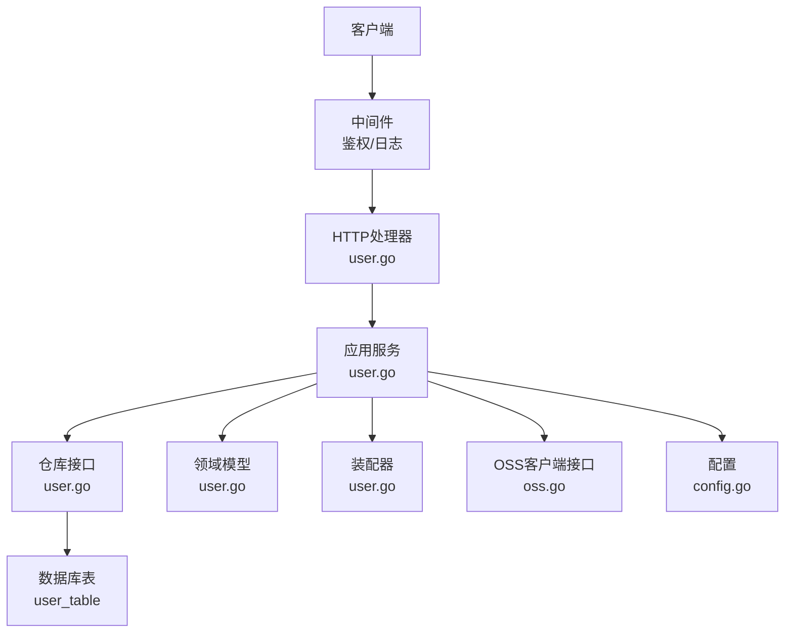
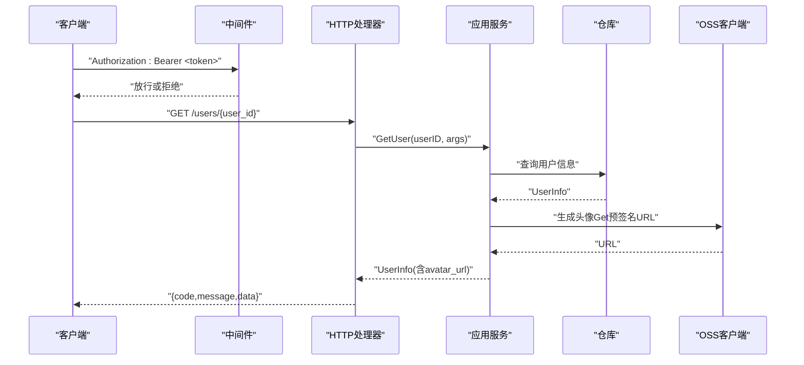
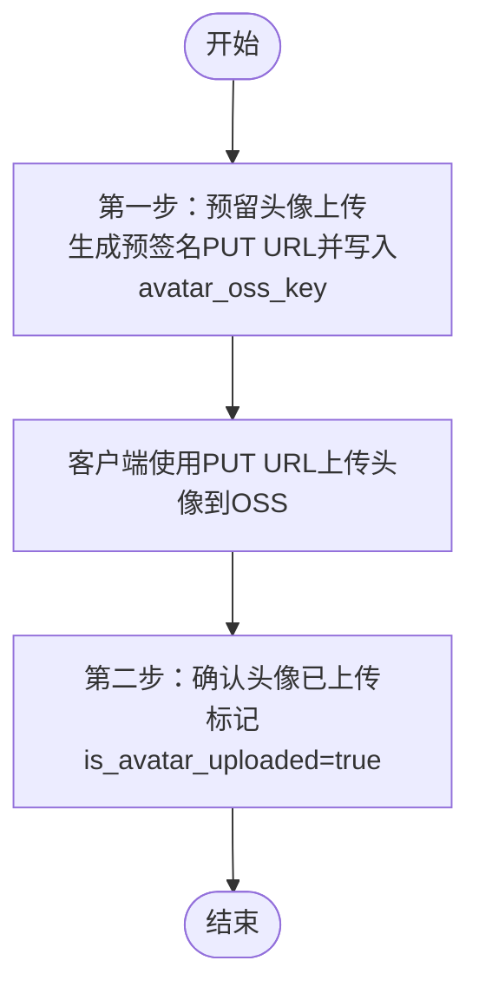
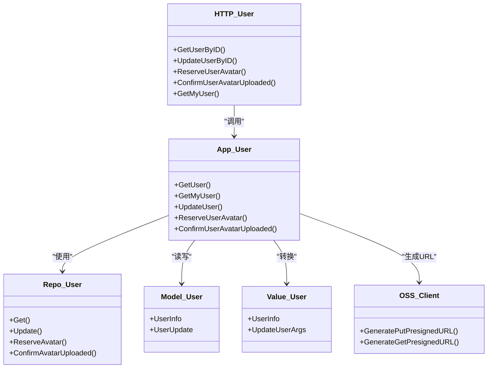

# 用户管理API

<cite>
**本文引用的文件**
- [internal/api/http/user.go](file://internal/api/http/user.go)
- [internal/application/user.go](file://internal/application/user.go)
- [internal/domain/model/user.go](file://internal/domain/model/user.go)
- [internal/domain/repository/user.go](file://internal/domain/repository/user.go)
- [internal/application/assembler/user.go](file://internal/application/assembler/user.go)
- [internal/value/user.go](file://internal/value/user.go)
- [internal/domain/service/user.go](file://internal/domain/service/user.go)
- [internal/api/http/middleware.go](file://internal/api/http/middleware.go)
- [internal/domain/external/oss.go](file://internal/domain/external/oss.go)
- [internal/domain/model/permission.go](file://internal/domain/model/permission.go)
- [internal/config/config.go](file://internal/config/config.go)
- [internal/api/http/types.go](file://internal/api/http/types.go)
- [migrations/20260301065022_user-table.up.sql](file://migrations/20260301065022_user-table.up.sql)
</cite>

## 目录
1. [简介](#简介)
2. [项目结构](#项目结构)
3. [核心组件](#核心组件)
4. [架构总览](#架构总览)
5. [详细组件分析](#详细组件分析)
6. [依赖分析](#依赖分析)
7. [性能考虑](#性能考虑)
8. [故障排查指南](#故障排查指南)
9. [结论](#结论)
10. [附录](#附录)

## 简介
本文件为用户管理API的完整技术文档，覆盖以下端点：
- 用户信息查询（按ID）
- 用户信息更新（PUT）
- 头像上传（预留URL + 确认上传）
- 当前登录用户信息查询

文档内容包括：HTTP方法、URL模式、请求参数、响应格式、错误码、数据验证规则、字段约束、权限控制、隐私保护、并发与一致性、性能优化建议及常见问题。

## 项目结构
用户管理API位于后端Go服务的HTTP层，采用分层架构：
- HTTP层：路由与请求/响应封装
- 应用层：业务编排与权限校验
- 领域模型与仓库：数据模型与持久化接口
- 值对象：对外暴露的数据结构与校验
- 外部服务：对象存储（OSS）客户端接口
- 中间件：鉴权与日志

图表来源
- [internal/api/http/user.go:1-292](file://internal/api/http/user.go#L1-L292)
- [internal/application/user.go:1-594](file://internal/application/user.go#L1-L594)
- [internal/domain/repository/user.go:1-16](file://internal/domain/repository/user.go#L1-L16)
- [internal/domain/model/user.go:1-100](file://internal/domain/model/user.go#L1-L100)
- [internal/application/assembler/user.go:1-34](file://internal/application/assembler/user.go#L1-L34)
- [internal/domain/external/oss.go:1-9](file://internal/domain/external/oss.go#L1-L9)
- [internal/config/config.go:1-101](file://internal/config/config.go#L1-L101)
- [migrations/20260301065022_user-table.up.sql:1-52](file://migrations/20260301065022_user-table.up.sql#L1-L52)

章节来源
- [internal/api/http/user.go:1-292](file://internal/api/http/user.go#L1-L292)
- [internal/application/user.go:1-594](file://internal/application/user.go#L1-L594)

## 核心组件
- HTTP处理器：负责参数提取、鉴权、调用应用服务、统一响应包装
- 应用服务：执行业务规则、权限校验、事务处理、调用仓库与外部服务
- 领域模型：用户信息、凭证、更新/注册结构
- 值对象：对外暴露的用户信息DTO、参数DTO与校验
- 仓库接口：抽象用户数据访问
- 装配器：将领域模型转换为对外DTO，处理头像URL生成
- OSS接口：生成预签名URL（上传/下载）
- 中间件：鉴权（Bearer Token）、日志
- 配置：JWT密钥、过期时长等

章节来源
- [internal/api/http/user.go:1-292](file://internal/api/http/user.go#L1-L292)
- [internal/application/user.go:1-594](file://internal/application/user.go#L1-L594)
- [internal/domain/model/user.go:1-100](file://internal/domain/model/user.go#L1-L100)
- [internal/value/user.go:1-171](file://internal/value/user.go#L1-L171)
- [internal/application/assembler/user.go:1-34](file://internal/application/assembler/user.go#L1-L34)
- [internal/domain/external/oss.go:1-9](file://internal/domain/external/oss.go#L1-L9)
- [internal/api/http/middleware.go:1-80](file://internal/api/http/middleware.go#L1-L80)
- [internal/config/config.go:1-101](file://internal/config/config.go#L1-L101)

## 架构总览
用户管理API遵循“请求 → 中间件 → HTTP处理器 → 应用服务 → 仓库/外部服务”的调用链路。鉴权中间件要求请求携带有效的Bearer Token；应用服务负责权限校验与业务规则，如头像上传采用“预留+确认”两步流程，保障一致性。

图表来源
- [internal/api/http/user.go:10-49](file://internal/api/http/user.go#L10-L49)
- [internal/application/user.go:280-319](file://internal/application/user.go#L280-L319)
- [internal/application/assembler/user.go:10-33](file://internal/application/assembler/user.go#L10-L33)
- [internal/domain/external/oss.go:3-8](file://internal/domain/external/oss.go#L3-L8)

## 详细组件分析

### 1) 用户信息查询（按ID）
- 方法与路径
  - GET /users/{user_id}
- 安全与鉴权
  - 需要ApiKeyAuth（由中间件解析Authorization头部并校验）
- 请求参数
  - 路径参数：user_id（必填）
  - 查询参数：无
- 成功响应
  - 结构：统一响应包装，data为UserInfo
  - 字段：id、name、qq、avatar_url、is_avatar_uploaded、is_super_admin、created_at、updated_at
- 错误码
  - 400：缺少user_id或查询参数格式错误
  - 500：内部错误
- 数据验证
  - user_id非空校验在HTTP层完成
  - 应用层进一步校验用户存在性与权限（见权限章节）

请求示例
- curl -H "Authorization: Bearer <token>" https://example.com/users/123e4567-e89b-12d3-a456-426614174000

响应示例
- {
  "code": 0,
  "message": "获取用户信息成功",
  "data": {
    "id": "123e4567-e89b-12d3-a456-426614174000",
    "name": "张三",
    "qq": "12345",
    "avatar_url": "https://cdn.example.com/user-avatar-...",
    "is_avatar_uploaded": true,
    "is_super_admin": false,
    "created_at": 1700000000000,
    "updated_at": 1700000000000
  }
}

错误处理
- 缺少user_id：400
- 用户不存在：应用层返回错误消息
- 权限不足：应用层返回错误消息

章节来源
- [internal/api/http/user.go:10-49](file://internal/api/http/user.go#L10-L49)
- [internal/application/user.go:280-319](file://internal/application/user.go#L280-L319)
- [internal/application/assembler/user.go:10-33](file://internal/application/assembler/user.go#L10-L33)
- [internal/value/user.go:76-89](file://internal/value/user.go#L76-L89)

### 2) 当前登录用户信息查询
- 方法与路径
  - GET /users/mine
- 安全与鉴权
  - 需要有效Bearer Token（中间件解析并注入user_id）
- 请求参数
  - 无
- 成功响应
  - 结构：统一响应包装，data为UserInfo
- 错误码
  - 403：无权限或用户不存在

请求示例
- curl -H "Authorization: Bearer <token>" https://example.com/users/mine

响应示例
- {
  "code": 0,
  "message": "获取当前用户信息成功",
  "data": { ... }
}

章节来源
- [internal/api/http/user.go:263-291](file://internal/api/http/user.go#L263-L291)
- [internal/application/user.go:321-361](file://internal/application/user.go#L321-L361)

### 3) 用户信息更新（PUT）
- 方法与路径
  - PUT /users/{user_id}
- 安全与鉴权
  - 需要有效Bearer Token
  - 权限：仅本人或超级管理员可更新
- 请求参数
  - 路径参数：user_id（必填）
  - 请求体：UpdateUserArgs（name、qq、password）
- 成功响应
  - 结构：统一响应包装，无data
- 错误码
  - 400：参数校验失败或业务错误
  - 403：权限不足

请求示例
- curl -X PUT -H "Authorization: Bearer <token>" -H "Content-Type: application/json" -d '{"name":"新昵称","qq":"99999","password":"NewPass123"}' https://example.com/users/123e4567-e89b-12d3-a456-426614174000

响应示例
- {
  "code": 0,
  "message": "更新用户成功"
}

数据验证规则
- user_id非空
- name长度2~20字
- qq长度5~20字符
- password长度6~30字符

章节来源
- [internal/api/http/user.go:177-225](file://internal/api/http/user.go#L177-L225)
- [internal/application/user.go:470-519](file://internal/application/user.go#L470-L519)
- [internal/value/user.go:122-171](file://internal/value/user.go#L122-L171)

### 4) 头像上传（预留URL + 确认上传）
- 方法与路径
  - POST /users/{user_id}/avatar
  - POST /users/{user_id}/avatar/confirm
- 安全与鉴权
  - 需要有效Bearer Token
  - 权限：仅本人或超级管理员可操作
- 请求参数
  - 路径参数：user_id（必填）
  - 第一步POST：无请求体
  - 第二步POST：无请求体
- 成功响应
  - 预留URL：{
    "code": 0,
    "message": "预留用户头像成功",
    "data": {"put_url": "https://cdn.example.com/..."}
  }
  - 确认上传：{
    "code": 0,
    "message": "确认用户头像上传成功"
  }
- 错误码
  - 400：参数错误或业务错误
  - 403：权限不足

流程图

图表来源
- [internal/api/http/user.go:96-175](file://internal/api/http/user.go#L96-L175)
- [internal/application/user.go:426-468](file://internal/application/user.go#L426-L468)
- [internal/application/user.go:521-555](file://internal/application/user.go#L521-L555)
- [internal/domain/service/user.go:86-88](file://internal/domain/service/user.go#L86-L88)

章节来源
- [internal/api/http/user.go:96-175](file://internal/api/http/user.go#L96-L175)
- [internal/application/user.go:426-468](file://internal/application/user.go#L426-L468)
- [internal/application/user.go:521-555](file://internal/application/user.go#L521-L555)
- [internal/domain/service/user.go:86-88](file://internal/domain/service/user.go#L86-L88)

### 5) 用户删除（DELETE）
- 方法与路径
  - DELETE /users/{user_id}
- 安全与鉴权
  - 需要有效Bearer Token
  - 权限：仅超级管理员可删除，且不可删除自己
- 请求参数
  - 路径参数：user_id（必填）
- 成功响应
  - 结构：统一响应包装，无data
- 错误码
  - 403：权限不足或禁止删除自己

请求示例
- curl -X DELETE -H "Authorization: Bearer <token>" https://example.com/users/123e4567-e89b-12d3-a456-426614174000

响应示例
- {
  "code": 0,
  "message": "删除用户成功"
}

章节来源
- [internal/api/http/user.go:227-261](file://internal/api/http/user.go#L227-L261)
- [internal/application/user.go:557-593](file://internal/application/user.go#L557-L593)

## 依赖分析
- HTTP层依赖应用服务与状态对象
- 应用服务依赖仓库接口、装配器、OSS客户端、配置与领域服务
- 仓库接口对接数据库实体
- 值对象与领域模型解耦对外契约与内部不变量

图表来源
- [internal/api/http/user.go:1-292](file://internal/api/http/user.go#L1-L292)
- [internal/application/user.go:1-594](file://internal/application/user.go#L1-L594)
- [internal/domain/repository/user.go:1-16](file://internal/domain/repository/user.go#L1-L16)
- [internal/domain/model/user.go:1-100](file://internal/domain/model/user.go#L1-L100)
- [internal/value/user.go:1-171](file://internal/value/user.go#L1-L171)
- [internal/domain/external/oss.go:1-9](file://internal/domain/external/oss.go#L1-L9)

章节来源
- [internal/api/http/user.go:1-292](file://internal/api/http/user.go#L1-L292)
- [internal/application/user.go:1-594](file://internal/application/user.go#L1-L594)

## 性能考虑
- 头像URL延迟生成：装配阶段尝试生成头像URL，失败仅记录日志并返回空URL，避免阻塞用户信息加载
- 预签名URL直传：头像上传走OSS直传，减少服务端带宽与CPU占用
- 索引优化：数据库表对name、qq、created_at、updated_at建立索引，提升查询效率
- JWT短时长：配置中可设置过期时长，平衡安全与频繁刷新成本

章节来源
- [internal/application/assembler/user.go:10-33](file://internal/application/assembler/user.go#L10-L33)
- [migrations/20260301065022_user-table.up.sql:19-34](file://migrations/20260301065022_user-table.up.sql#L19-L34)
- [internal/config/config.go:69-83](file://internal/config/config.go#L69-L83)

## 故障排查指南
- 鉴权失败
  - 现象：401 未提供或无效的Authorization头部
  - 排查：确认Bearer Token格式与有效期；检查JWT密钥环境变量
- 权限不足
  - 现象：403 权限不足
  - 排查：确认当前用户是否为本人或超级管理员；检查权限函数实现
- 参数校验失败
  - 现象：400 参数错误
  - 排查：核对请求体字段长度与格式；参考各Args的Validate规则
- 头像上传异常
  - 现象：预留URL失败或确认上传失败
  - 排查：检查OSS客户端可用性与权限；确认avatar_oss_key写入成功；确认客户端PUT成功

章节来源
- [internal/api/http/middleware.go:47-79](file://internal/api/http/middleware.go#L47-L79)
- [internal/application/user.go:426-468](file://internal/application/user.go#L426-L468)
- [internal/application/user.go:521-555](file://internal/application/user.go#L521-L555)
- [internal/value/user.go:130-171](file://internal/value/user.go#L130-L171)

## 结论
用户管理API采用清晰的分层设计与严格的权限控制，结合预签名URL实现高效、安全的头像上传流程。通过参数校验、事务与一致性策略保障数据完整性，配合数据库索引与延迟头像URL生成提升性能。建议在生产环境中严格管理JWT密钥与OSS权限，并持续监控鉴权与业务错误日志。

## 附录

### A. 统一响应格式
- 字段
  - code：整数，0表示成功，非0为错误码
  - message：字符串，成功提示或错误描述
  - data：任意类型，成功时返回业务数据，可选

章节来源
- [internal/api/http/types.go:1-10](file://internal/api/http/types.go#L1-L10)

### B. 数据模型与字段约束
- 表结构（user_table）
  - id：主键
  - name：文本，NOT NULL
  - qq：文本，唯一，NOT NULL
  - avatar_oss_key：文本，NOT NULL
  - is_avatar_uploaded：布尔，默认false
  - password_hash：文本，NOT NULL
  - is_super_admin：布尔，默认false
  - created_at/updated_at：时间戳，默认NOW()

章节来源
- [migrations/20260301065022_user-table.up.sql:1-52](file://migrations/20260301065022_user-table.up.sql#L1-L52)

### C. 权限控制与隐私保护
- 权限要点
  - 查看：当前用户可查看自己的信息；超级管理员可查看所有
  - 更新：本人或超级管理员可更新
  - 删除：仅超级管理员可删除，且不可删除自己
- 隐私保护
  - 登录仅返回必要字段，不暴露敏感信息
  - 头像URL通过预签名生成，避免直接暴露存储凭证

章节来源
- [internal/domain/model/permission.go:267-300](file://internal/domain/model/permission.go#L267-L300)
- [internal/domain/model/user.go:43-54](file://internal/domain/model/user.go#L43-L54)

### D. 并发处理与一致性
- 头像上传
  - 预留阶段写入avatar_oss_key，客户端直传OSS
  - 确认阶段标记is_avatar_uploaded=true，保证最终一致性
- 用户更新
  - 应用层对密码进行哈希后再写入，避免明文存储
- 事务
  - 注册流程在单事务中完成用户、成员与邀请状态变更，确保原子性

章节来源
- [internal/application/user.go:426-468](file://internal/application/user.go#L426-L468)
- [internal/application/user.go:521-555](file://internal/application/user.go#L521-L555)
- [internal/application/user.go:470-519](file://internal/application/user.go#L470-L519)
- [internal/domain/service/user.go:76-84](file://internal/domain/service/user.go#L76-L84)