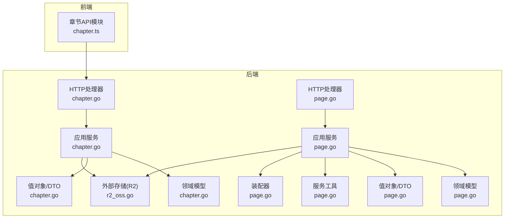
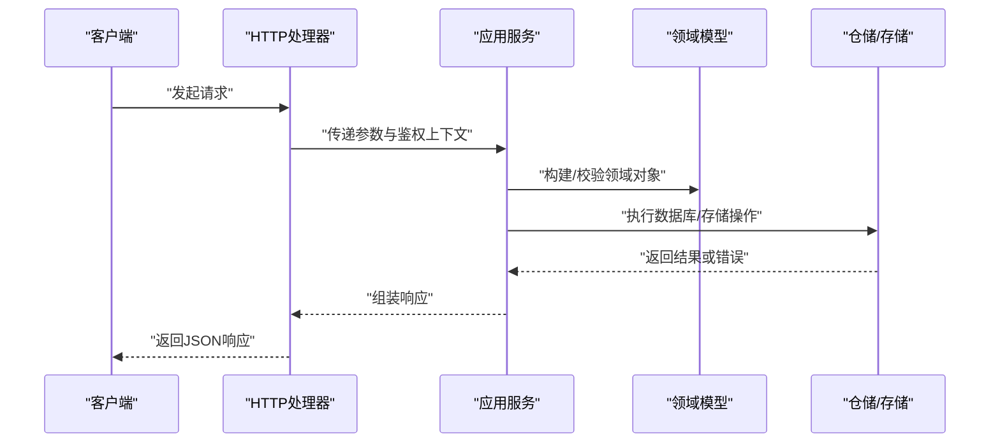
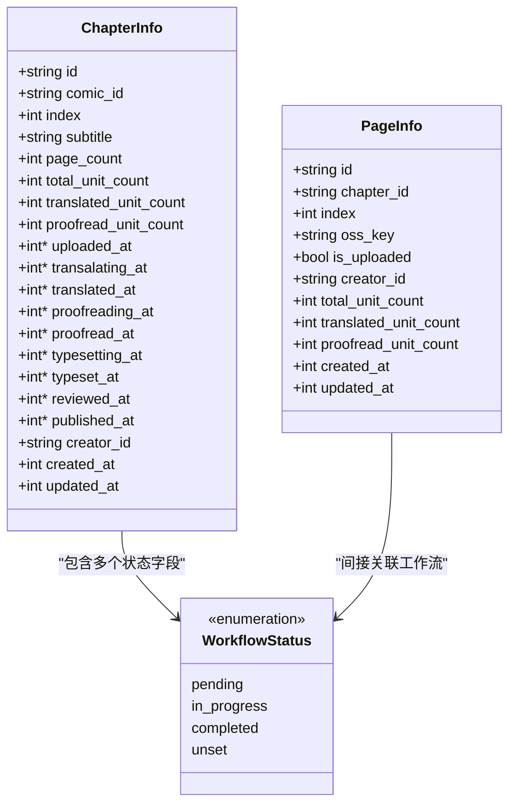
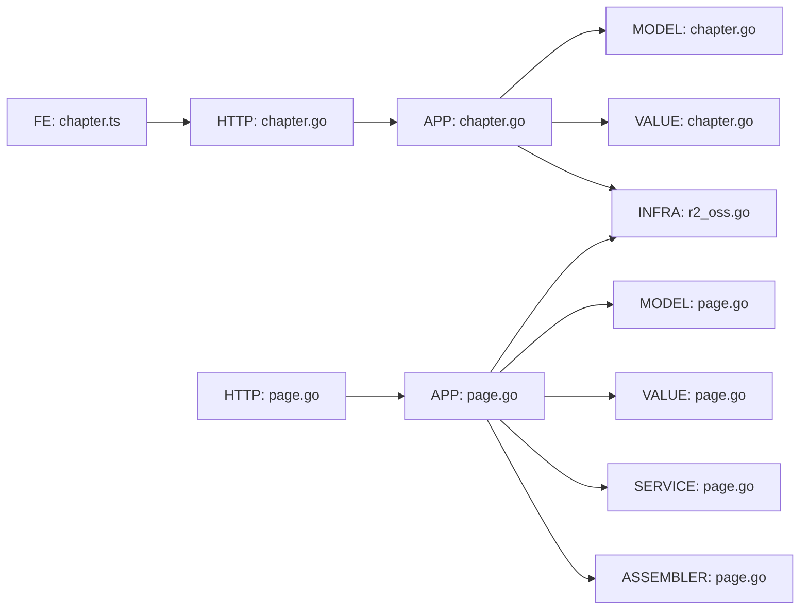

# 章节与页面API

<cite>
**本文引用的文件**
- [chapter.go](file://internal/api/http/chapter.go)
- [page.go](file://internal/api/http/page.go)
- [chapter.go](file://internal/application/chapter.go)
- [page.go](file://internal/application/page.go)
- [chapter.go](file://internal/domain/model/chapter.go)
- [page.go](file://internal/domain/model/page.go)
- [chapter.go](file://internal/value/chapter.go)
- [page.go](file://internal/value/page.go)
- [workflow.go](file://internal/domain/model/workflow.go)
- [permission.go](file://internal/domain/model/permission.go)
- [page.go](file://internal/domain/service/page.go)
- [page.go](file://internal/application/assembler/page.go)
- [r2_oss.go](file://internal/infrastructure/external/r2_oss.go)
- [chapter.ts](file://frontend/src/api/modules/chapter.ts)
</cite>

## 目录
1. [简介](#简介)
2. [项目结构](#项目结构)
3. [核心组件](#核心组件)
4. [架构总览](#架构总览)
5. [详细组件分析](#详细组件分析)
6. [依赖分析](#依赖分析)
7. [性能考虑](#性能考虑)
8. [故障排查指南](#故障排查指南)
9. [结论](#结论)
10. [附录](#附录)

## 简介
本文件为“章节与页面管理”子系统的完整API文档，覆盖章节与页面的创建、查询、更新、删除等全生命周期接口，以及章节编号规则、页面顺序管理、内容同步机制、权限模型、数据模型、存储与缓存策略、并发控制与错误处理等。文档同时提供面向前端的调用示例与开发指南，帮助开发者快速集成。

## 项目结构
- 后端采用Go语言，按职责分层组织：
  - API层：负责路由、鉴权、参数解析与响应封装
  - 应用层：编排业务流程，执行权限校验与事务控制
  - 领域层：模型与工作流状态定义
  - 值层：对外传输的数据结构与校验
  - 基础设施：外部服务（如R2 OSS）接入
- 前端提供章节API模块，便于统一调用

图表来源
- [chapter.go:10-185](file://internal/api/http/chapter.go#L10-L185)
- [page.go:10-189](file://internal/api/http/page.go#L10-L189)
- [chapter.go:20-330](file://internal/application/chapter.go#L20-L330)
- [page.go:21-402](file://internal/application/page.go#L21-L402)
- [chapter.go:5-260](file://internal/domain/model/chapter.go#L5-L260)
- [page.go:5-134](file://internal/domain/model/page.go#L5-L134)
- [chapter.go:10-148](file://internal/value/chapter.go#L10-L148)
- [page.go:7-95](file://internal/value/page.go#L7-L95)
- [page.go:5-7](file://internal/domain/service/page.go#L5-L7)
- [page.go:8-33](file://internal/application/assembler/page.go#L8-L33)
- [r2_oss.go:21-244](file://internal/infrastructure/external/r2_oss.go#L21-L244)

章节来源
- [chapter.go:10-185](file://internal/api/http/chapter.go#L10-L185)
- [page.go:10-189](file://internal/api/http/page.go#L10-L189)
- [chapter.go:20-330](file://internal/application/chapter.go#L20-L330)
- [page.go:21-402](file://internal/application/page.go#L21-L402)

## 核心组件
- HTTP处理器：暴露REST接口，解析参数、执行鉴权、调用应用层、封装响应
- 应用服务：实现业务逻辑，含权限校验、事务控制、工作流状态推进
- 领域模型：章节与页面的数据结构、工作流状态枚举与状态转换规则
- 值对象：对外传输的DTO，含序列化与参数校验
- 存储与缓存：通过R2 OSS提供预签名上传与直链读取能力
- 前端模块：提供章节API调用封装

章节来源
- [chapter.go:20-41](file://internal/application/chapter.go#L20-L41)
- [page.go:21-42](file://internal/application/page.go#L21-L42)
- [chapter.go:5-260](file://internal/domain/model/chapter.go#L5-L260)
- [page.go:5-134](file://internal/domain/model/page.go#L5-L134)
- [chapter.go:10-148](file://internal/value/chapter.go#L10-L148)
- [page.go:7-95](file://internal/value/page.go#L7-L95)
- [r2_oss.go:21-244](file://internal/infrastructure/external/r2_oss.go#L21-L244)
- [chapter.ts:1-72](file://frontend/src/api/modules/chapter.ts#L1-L72)

## 架构总览
- 章节与页面均采用“HTTP处理器 → 应用服务 → 领域模型/仓储”的分层设计
- 权限模型以角色与分工为核心，结合漫画/工作集/团队维度进行校验
- 工作流状态通过统一枚举与组合规则控制，确保状态迁移合法
- 页面上传采用预签名URL，提升上传效率与安全性

图表来源
- [chapter.go:25-51](file://internal/api/http/chapter.go#L25-L51)
- [page.go:25-51](file://internal/api/http/page.go#L25-L51)
- [chapter.go:82-165](file://internal/application/chapter.go#L82-L165)
- [page.go:93-187](file://internal/application/page.go#L93-L187)

## 详细组件分析

### 章节API

#### 接口一览
- 获取章节列表
  - 方法：GET
  - 路径：/chapters
  - 查询参数：comic_id（漫画ID）、offset、limit、includes[]
  - 成功响应：章节信息数组
  - 权限：所属团队成员
- 创建章节
  - 方法：POST
  - 路径：/chapters
  - 请求体：comic_id、subtitle
  - 成功响应：创建结果（包含章节ID）
  - 权限：团队管理员
- 更新章节
  - 方法：PATCH
  - 路径：/chapters/{chapter_id}
  - 请求体：可选字段（subtitle、各工作流状态）
  - 成功响应：无
  - 权限：团队管理员
- 删除章节
  - 方法：DELETE
  - 路径：/chapters/{chapter_id}
  - 成功响应：无
  - 权限：团队管理员

章节来源
- [chapter.go:10-185](file://internal/api/http/chapter.go#L10-L185)
- [chapter.go:20-41](file://internal/application/chapter.go#L20-L41)
- [chapter.go:41-148](file://internal/value/chapter.go#L41-L148)
- [chapter.go:5-260](file://internal/domain/model/chapter.go#L5-L260)
- [permission.go:463-539](file://internal/domain/model/permission.go#L463-L539)

#### 章节编号规则
- 章节索引为0-based，创建时根据漫画现有章节数量自动递增
- 数据库存在唯一约束（comic_id, index），避免并发重复

章节来源
- [chapter.go:136-151](file://internal/application/chapter.go#L136-L151)

#### 工作流状态与时间戳
- 支持的流程：上传、翻译、校对、排版、审阅、发布
- 状态取值：pending、in_progress、completed、unset
- 状态变更将影响对应时间戳字段（如上传完成写入上传时间）

章节来源
- [workflow.go:14-35](file://internal/domain/model/workflow.go#L14-L35)
- [chapter.go:126-259](file://internal/domain/model/chapter.go#L126-L259)

#### 请求与响应示例（路径参考）
- 获取章节列表
  - 请求：GET /chapters?comic_id={}&offset={}&limit={}
  - 响应：[]value.ChapterInfo
  - 参考：[chapter.go:10-52](file://internal/api/http/chapter.go#L10-L52)
- 创建章节
  - 请求体：{ comic_id, subtitle }
  - 响应：{ id }
  - 参考：[chapter.go:54-95](file://internal/api/http/chapter.go#L54-L95)
- 更新章节
  - 请求体：{ chapter_id, subtitle?, upload_status?, ... }
  - 参考：[chapter.go:97-144](file://internal/api/http/chapter.go#L97-L144)
- 删除章节
  - 路径参数：chapter_id
  - 参考：[chapter.go:146-185](file://internal/api/http/chapter.go#L146-L185)

#### 错误处理
- 参数校验失败：返回400
- 权限不足：返回403
- 业务异常（如创建失败、提交事务失败）：返回400并提示具体原因

章节来源
- [chapter.go:82-165](file://internal/application/chapter.go#L82-L165)
- [chapter.go:223-329](file://internal/application/chapter.go#L223-L329)

### 页面API

#### 接口一览
- 获取页面列表
  - 方法：GET
  - 路径：/pages
  - 查询参数：chapter_id、offset、limit、includes[]
  - 成功响应：页面信息数组（空列表返回null而非[]）
  - 权限：所属团队成员
- 预留页面并生成上传URL
  - 方法：POST
  - 路径：/pages
  - 请求体：chapter_id、page_count
  - 成功响应：每个页面的预签名PUT URL与页面ID
  - 权限：分配角色（reviewer/raw_provider）
- 更新页面
  - 方法：PUT
  - 路径：/pages/{page_id}
  - 请求体：id（与路径一致）、is_uploaded=true
  - 成功响应：无
  - 权限：分配角色（reviewer/raw_provider）
- 删除章节所有页面
  - 方法：DELETE
  - 路径：/pages/{chapter_id}
  - 成功响应：无
  - 权限：分配角色（reviewer/raw_provider）

章节来源
- [page.go:10-189](file://internal/api/http/page.go#L10-L189)
- [page.go:21-42](file://internal/application/page.go#L21-L42)
- [page.go:7-95](file://internal/value/page.go#L7-L95)
- [page.go:5-134](file://internal/domain/model/page.go#L5-L134)
- [permission.go:635-727](file://internal/domain/model/permission.go#L635-L727)

#### 页面顺序管理
- 页面索引为0-based，按创建顺序递增
- 列表默认按索引升序排列

章节来源
- [page.go:189-248](file://internal/application/page.go#L189-L248)
- [page.go:76-99](file://internal/domain/model/page.go#L76-L99)

#### 内容同步机制
- 采用预签名上传：先在数据库创建页面记录，再生成PUT预签名URL，客户端直传R2
- 上传完成后需调用更新接口标记is_uploaded=true，以便后端同步状态

章节来源
- [page.go:93-187](file://internal/application/page.go#L93-L187)
- [page.go:250-311](file://internal/application/page.go#L250-L311)
- [r2_oss.go:93-112](file://internal/infrastructure/external/r2_oss.go#L93-L112)

#### 请求与响应示例（路径参考）
- 获取页面列表
  - 请求：GET /pages?chapter_id={}&offset={}&limit={}
  - 响应：[]value.PageInfo 或 null
  - 参考：[page.go:10-52](file://internal/api/http/page.go#L10-L52)
- 预留页面
  - 请求体：{ chapter_id, page_count }
  - 响应：{ creations: [{ page_id, put_url }] }
  - 参考：[page.go:54-95](file://internal/api/http/page.go#L54-L95)
- 更新页面
  - 请求体：{ id, is_uploaded: true }
  - 参考：[page.go:97-148](file://internal/api/http/page.go#L97-L148)
- 删除章节所有页面
  - 路径参数：chapter_id
  - 参考：[page.go:150-189](file://internal/api/http/page.go#L150-L189)

#### 错误处理
- 参数校验失败：返回400
- 权限不足：返回403
- 业务异常（如事务失败、生成URL失败、删除失败）：返回400并提示具体原因

章节来源
- [page.go:93-187](file://internal/application/page.go#L93-L187)
- [page.go:313-401](file://internal/application/page.go#L313-L401)

### 权限模型与并发控制

#### 权限模型
- 章节：团队管理员可创建/更新/删除；成员可查看列表
- 页面：分配角色（reviewer/raw_provider）可创建/更新/删除；成员可查看列表
- 权限校验贯穿应用层，基于用户、漫画、工作集、团队与分配信息综合判断

章节来源
- [permission.go:463-539](file://internal/domain/model/permission.go#L463-L539)
- [permission.go:635-727](file://internal/domain/model/permission.go#L635-L727)

#### 并发控制
- 章节创建：对漫画加锁，统计数量后创建，数据库唯一约束保证索引唯一性
- 页面创建：对章节加锁，批量创建记录，再批量生成预签名URL
- 删除页面：对章节加锁，批量删除记录与对应OSS对象

章节来源
- [chapter.go:129-162](file://internal/application/chapter.go#L129-L162)
- [page.go:139-187](file://internal/application/page.go#L139-L187)
- [page.go:359-401](file://internal/application/page.go#L359-L401)

### 数据模型与序列化

图表来源
- [chapter.go:5-35](file://internal/domain/model/chapter.go#L5-L35)
- [page.go:5-22](file://internal/domain/model/page.go#L5-L22)
- [workflow.go:14-22](file://internal/domain/model/workflow.go#L14-L22)

章节来源
- [chapter.go:5-260](file://internal/domain/model/chapter.go#L5-L260)
- [page.go:5-134](file://internal/domain/model/page.go#L5-L134)
- [workflow.go:14-35](file://internal/domain/model/workflow.go#L14-L35)

### 存储优化与缓存策略

- 预签名上传
  - 上传：生成PUT预签名URL，客户端直传R2，缩短后端带宽压力
  - 下载：优先使用自定义域名直链，减少签名开销
- 批量操作
  - 页面创建：先数据库批量写入，再批量生成URL，降低往返次数
  - 页面删除：批量删除记录与OSS对象，减少IO次数
- 重试与幂等
  - 删除接口对不存在的对象进行幂等处理，内部重试多次以提高成功率

章节来源
- [page.go:122-187](file://internal/application/page.go#L122-L187)
- [page.go:359-401](file://internal/application/page.go#L359-L401)
- [r2_oss.go:93-123](file://internal/infrastructure/external/r2_oss.go#L93-L123)
- [r2_oss.go:159-216](file://internal/infrastructure/external/r2_oss.go#L159-L216)

### 前端调用示例与开发指南

- 章节列表
  - 使用模块：chapter.ts
  - 接口：getChapterList
  - 示例：调用 httpClient.get("/chapters", { comic_id, offset, limit, includes[] })
- 创建章节
  - 使用模块：chapter.ts
  - 接口：createChapter
  - 示例：调用 httpClient.post("/chapters", { comic_id, title, index })

章节来源
- [chapter.ts:53-71](file://frontend/src/api/modules/chapter.ts#L53-L71)

## 依赖分析

图表来源
- [chapter.go:25-51](file://internal/api/http/chapter.go#L25-L51)
- [page.go:25-51](file://internal/api/http/page.go#L25-L51)
- [chapter.go:82-165](file://internal/application/chapter.go#L82-L165)
- [page.go:93-187](file://internal/application/page.go#L93-L187)
- [chapter.go:41-148](file://internal/value/chapter.go#L41-L148)
- [page.go:7-95](file://internal/value/page.go#L7-L95)
- [page.go:5-7](file://internal/domain/service/page.go#L5-L7)
- [page.go:8-33](file://internal/application/assembler/page.go#L8-L33)
- [r2_oss.go:21-91](file://internal/infrastructure/external/r2_oss.go#L21-L91)
- [chapter.ts:53-71](file://frontend/src/api/modules/chapter.ts#L53-L71)

章节来源
- [chapter.go:25-51](file://internal/api/http/chapter.go#L25-L51)
- [page.go:25-51](file://internal/api/http/page.go#L25-L51)
- [chapter.go:82-165](file://internal/application/chapter.go#L82-L165)
- [page.go:93-187](file://internal/application/page.go#L93-L187)

## 性能考虑
- 预签名上传：减少后端转发，提升上传吞吐
- 批量操作：数据库与存储批量写入/删除，降低网络与IO开销
- 分页查询：合理设置offset/limit，避免一次性拉取过多数据
- 缓存策略：建议在网关或CDN层对静态图片直链进行缓存，结合自定义域名使用

## 故障排查指南
- 400 参数错误
  - 检查请求体字段是否符合校验规则（如章节副标题长度、页面数量>0等）
  - 参考：章节参数校验、页面参数校验
- 403 权限不足
  - 确认用户在所属团队/漫画/工作集中的角色与分工
  - 参考：权限模型
- 404/400 删除失败
  - 检查章节ID或页面ID是否有效；确认OSS对象是否存在
  - 参考：页面删除流程
- 上传失败
  - 检查预签名URL是否过期；确认客户端已调用更新接口标记上传完成
  - 参考：页面上传流程

章节来源
- [chapter.go:68-147](file://internal/value/chapter.go#L68-L147)
- [page.go:12-54](file://internal/value/page.go#L12-L54)
- [permission.go:463-539](file://internal/domain/model/permission.go#L463-L539)
- [page.go:313-401](file://internal/application/page.go#L313-L401)
- [page.go:93-187](file://internal/application/page.go#L93-L187)

## 结论
本API体系围绕“章节与页面”的核心业务，提供了清晰的接口边界、严格的权限控制、可靠的工作流状态管理与高效的存储上传机制。通过预签名上传与批量操作，显著提升了性能与可靠性；通过分层设计与事务控制，保障了数据一致性。建议在生产环境中配合CDN缓存与监控告警，持续优化用户体验与系统稳定性。

## 附录

### API定义速查

- 章节
  - GET /chapters
    - 查询参数：comic_id, offset, limit, includes[]
    - 成功：[]ChapterInfo
    - 权限：团队成员
  - POST /chapters
    - 请求体：{ comic_id, subtitle }
    - 成功：{ id }
    - 权限：团队管理员
  - PATCH /chapters/{chapter_id}
    - 请求体：{ chapter_id, subtitle?, upload_status?, translate_status?, proofread_status?, typeset_status?, review_status?, publish_status? }
    - 成功：200
    - 权限：团队管理员
  - DELETE /chapters/{chapter_id}
    - 成功：200
    - 权限：团队管理员

- 页面
  - GET /pages
    - 查询参数：chapter_id, offset, limit, includes[]
    - 成功：[]PageInfo 或 null
    - 权限：团队成员
  - POST /pages
    - 请求体：{ chapter_id, page_count }
    - 成功：{ creations: [{ page_id, put_url }] }
    - 权限：reviewer/raw_provider
  - PUT /pages/{page_id}
    - 请求体：{ id, is_uploaded: true }
    - 成功：200
    - 权限：reviewer/raw_provider
  - DELETE /pages/{chapter_id}
    - 成功：200
    - 权限：reviewer/raw_provider

章节来源
- [chapter.go:10-185](file://internal/api/http/chapter.go#L10-L185)
- [page.go:10-189](file://internal/api/http/page.go#L10-L189)