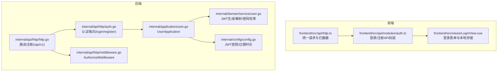
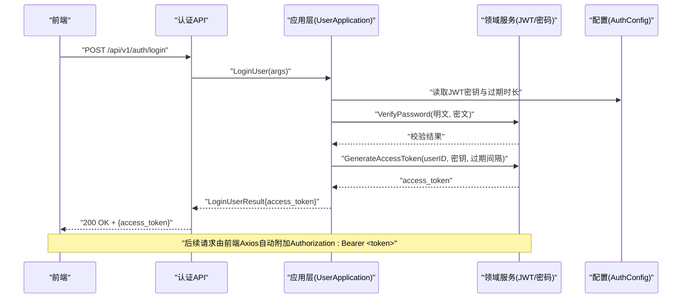
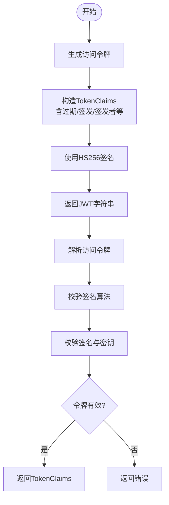
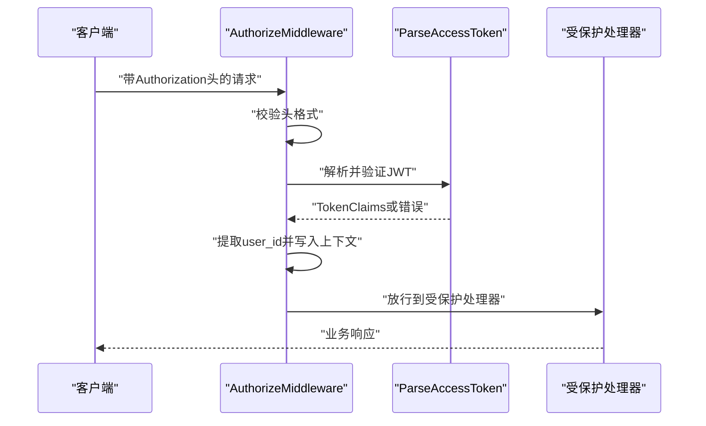
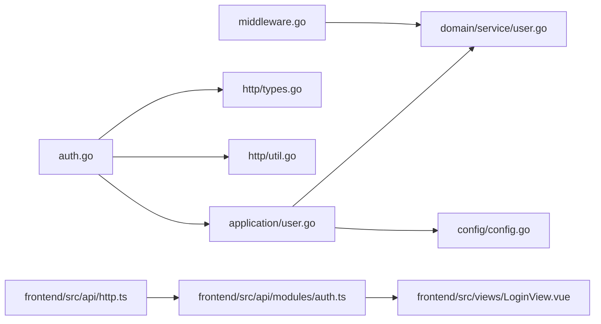

# 认证系统API

<cite>
**本文引用的文件**
- [internal/api/http/auth.go](file://internal/api/http/auth.go)
- [internal/api/http/http.go](file://internal/api/http/http.go)
- [internal/api/http/middleware.go](file://internal/api/http/middleware.go)
- [internal/api/http/types.go](file://internal/api/http/types.go)
- [internal/api/http/util.go](file://internal/api/http/util.go)
- [internal/application/user.go](file://internal/application/user.go)
- [internal/application/error.go](file://internal/application/error.go)
- [internal/domain/service/user.go](file://internal/domain/service/user.go)
- [internal/domain/model/token.go](file://internal/domain/model/token.go)
- [internal/domain/model/user.go](file://internal/domain/model/user.go)
- [internal/config/config.go](file://internal/config/config.go)
- [frontend/src/api/modules/auth.ts](file://frontend/src/api/modules/auth.ts)
- [frontend/src/api/http.ts](file://frontend/src/api/http.ts)
- [frontend/src/views/LoginView.vue](file://frontend/src/views/LoginView.vue)
</cite>

## 目录
1. [简介](#简介)
2. [项目结构](#项目结构)
3. [核心组件](#核心组件)
4. [架构总览](#架构总览)
5. [详细组件分析](#详细组件分析)
6. [依赖分析](#依赖分析)
7. [性能考量](#性能考量)
8. [故障排查指南](#故障排查指南)
9. [结论](#结论)
10. [附录](#附录)

## 简介
本文件为认证系统的API文档，覆盖用户登录与注册接口的HTTP方法、URL模式、请求参数、响应格式与错误码；说明JWT访问令牌的生成与验证机制、请求头格式与令牌刷新策略；提供每个认证端点的请求与响应示例路径、错误处理说明；阐述认证中间件的工作原理、权限检查流程与安全考虑；给出认证失败的常见原因、重试策略与最佳实践；并提供认证API的测试方法与调试技巧。

## 项目结构
后端采用Go语言与Iris框架，按领域驱动设计组织代码；前端使用Vue + TypeScript，通过Axios统一请求层与拦截器实现认证态管理。认证相关的关键位置如下：
- 后端路由与认证端点：/api/v1/auth/login、/api/v1/auth/register
- 认证中间件：Authorization头校验与JWT解析
- 应用层：登录与注册业务逻辑
- 领域服务：JWT生成与解析、密码哈希与校验
- 配置：JWT密钥与过期时长
- 前端：Axios拦截器自动注入Authorization头，401自动登出

图表来源
- [internal/api/http/http.go:38-45](file://internal/api/http/http.go#L38-L45)
- [internal/api/http/auth.go:22-40](file://internal/api/http/auth.go#L22-L40)
- [internal/api/http/middleware.go:47-79](file://internal/api/http/middleware.go#L47-L79)
- [internal/application/user.go:106-154](file://internal/application/user.go#L106-L154)
- [internal/domain/service/user.go:15-41](file://internal/domain/service/user.go#L15-L41)
- [internal/config/config.go:69-83](file://internal/config/config.go#L69-L83)
- [frontend/src/api/http.ts:38-82](file://frontend/src/api/http.ts#L38-L82)
- [frontend/src/api/modules/auth.ts:79-100](file://frontend/src/api/modules/auth.ts#L79-L100)

章节来源
- [internal/api/http/http.go:38-45](file://internal/api/http/http.go#L38-L45)
- [internal/api/http/auth.go:22-40](file://internal/api/http/auth.go#L22-L40)
- [internal/api/http/middleware.go:47-79](file://internal/api/http/middleware.go#L47-L79)
- [internal/application/user.go:106-154](file://internal/application/user.go#L106-L154)
- [internal/domain/service/user.go:15-41](file://internal/domain/service/user.go#L15-L41)
- [internal/config/config.go:69-83](file://internal/config/config.go#L69-L83)
- [frontend/src/api/http.ts:38-82](file://frontend/src/api/http.ts#L38-L82)
- [frontend/src/api/modules/auth.ts:79-100](file://frontend/src/api/modules/auth.ts#L79-L100)

## 核心组件
- 认证端点
  - 登录：POST /api/v1/auth/login
  - 注册：POST /api/v1/auth/register
- 认证中间件
  - 校验Authorization头格式与Bearer令牌有效性
  - 将用户ID写入请求上下文供后续处理器使用
- JWT服务
  - 生成访问令牌（含过期时间与签发者）
  - 解析并验证访问令牌
  - 密码哈希与校验
- 配置
  - JWT密钥（从环境变量读取）
  - 令牌过期间隔（小时）

章节来源
- [internal/api/http/auth.go:10-21](file://internal/api/http/auth.go#L10-L21)
- [internal/api/http/auth.go:42-53](file://internal/api/http/auth.go#L42-L53)
- [internal/api/http/middleware.go:47-79](file://internal/api/http/middleware.go#L47-L79)
- [internal/domain/service/user.go:15-41](file://internal/domain/service/user.go#L15-L41)
- [internal/config/config.go:69-83](file://internal/config/config.go#L69-L83)

## 架构总览
认证流程概览：前端发起登录/注册请求，后端应用层执行业务逻辑（校验凭据/生成用户、哈希密码、生成JWT），返回访问令牌；后续请求由中间件解析JWT并注入用户ID，供受保护资源使用。

图表来源
- [internal/api/http/auth.go:22-40](file://internal/api/http/auth.go#L22-L40)
- [internal/application/user.go:106-154](file://internal/application/user.go#L106-L154)
- [internal/domain/service/user.go:15-41](file://internal/domain/service/user.go#L15-L41)
- [internal/config/config.go:69-83](file://internal/config/config.go#L69-L83)
- [frontend/src/api/http.ts:54-62](file://frontend/src/api/http.ts#L54-L62)

## 详细组件分析

### 认证端点：登录
- HTTP方法与URL
  - POST /api/v1/auth/login
- 请求体参数
  - qq: string（必填）
  - password: string（必填）
- 成功响应
  - code: 200
  - message: "登录成功"
  - data.access_token: string（JWT访问令牌）
- 错误码与说明
  - 400：请求体格式错误
  - 401：用户不存在或密码错误（不区分账户不存在与密码错误，避免用户枚举攻击）
- 请求示例（路径）
  - [frontend/src/api/modules/auth.ts:79-86](file://frontend/src/api/modules/auth.ts#L79-L86)
- 响应示例（路径）
  - [frontend/src/api/modules/auth.ts:42-52](file://frontend/src/api/modules/auth.ts#L42-L52)
- 错误处理说明
  - 后端在参数校验失败或凭据校验失败时返回相应错误消息
  - 前端收到401时清除本地令牌并跳转至登录页

章节来源
- [internal/api/http/auth.go:10-21](file://internal/api/http/auth.go#L10-L21)
- [internal/api/http/auth.go:22-40](file://internal/api/http/auth.go#L22-L40)
- [internal/application/user.go:106-154](file://internal/application/user.go#L106-L154)
- [frontend/src/api/modules/auth.ts:79-86](file://frontend/src/api/modules/auth.ts#L79-L86)
- [frontend/src/api/modules/auth.ts:42-52](file://frontend/src/api/modules/auth.ts#L42-L52)
- [frontend/src/api/http.ts:74-82](file://frontend/src/api/http.ts#L74-L82)

### 认证端点：注册
- HTTP方法与URL
  - POST /api/v1/auth/register
- 请求体参数
  - username: string（必填）
  - qq: string（必填）
  - password: string（必填）
- 成功响应
  - code: 200
  - message: "注册成功"
  - data.access_token: string（JWT访问令牌）
- 错误码与说明
  - 400：请求体格式错误或参数校验失败
  - 400：邀请信息不存在或已失效
  - 400：创建用户失败（数据库事务回滚或提交失败）
- 请求示例（路径）
  - [frontend/src/api/modules/auth.ts:93-100](file://frontend/src/api/modules/auth.ts#L93-L100)
- 响应示例（路径）
  - [frontend/src/api/modules/auth.ts:57-67](file://frontend/src/api/modules/auth.ts#L57-L67)
- 错误处理说明
  - 后端在参数校验失败、邀请查询失败或事务执行失败时返回相应错误消息
  - 前端收到401时清除本地令牌并跳转至登录页

章节来源
- [internal/api/http/auth.go:42-53](file://internal/api/http/auth.go#L42-L53)
- [internal/application/user.go:156-278](file://internal/application/user.go#L156-L278)
- [frontend/src/api/modules/auth.ts:93-100](file://frontend/src/api/modules/auth.ts#L93-L100)
- [frontend/src/api/modules/auth.ts:57-67](file://frontend/src/api/modules/auth.ts#L57-L67)
- [frontend/src/api/http.ts:74-82](file://frontend/src/api/http.ts#L74-L82)

### JWT令牌生成与验证机制
- 生成访问令牌
  - 输入：用户ID、JWT密钥、过期时长（小时）
  - 输出：签名后的JWT字符串
  - 包含声明：过期时间、签发时间、签发者、主题等
- 解析访问令牌
  - 输入：JWT字符串、JWT密钥
  - 输出：TokenClaims（包含用户ID与标准声明）
  - 校验：签名算法、签名有效性、过期时间
- 密码处理
  - 注册/登录时使用bcrypt进行密码哈希与校验

图表来源
- [internal/domain/service/user.go:15-41](file://internal/domain/service/user.go#L15-L41)
- [internal/domain/model/token.go:5-8](file://internal/domain/model/token.go#L5-L8)

章节来源
- [internal/domain/service/user.go:15-41](file://internal/domain/service/user.go#L15-L41)
- [internal/domain/model/token.go:5-8](file://internal/domain/model/token.go#L5-L8)

### 请求头格式与令牌刷新策略
- 请求头格式
  - Authorization: Bearer <access_token>
  - 前端Axios在请求拦截器中自动注入该头
- 令牌刷新策略
  - 当前实现未提供刷新令牌端点；建议在后端新增刷新端点或采用短期访问令牌+刷新令牌方案
  - 前端在收到401时清除本地令牌并跳转登录页

章节来源
- [frontend/src/api/http.ts:54-62](file://frontend/src/api/http.ts#L54-L62)
- [frontend/src/api/http.ts:74-82](file://frontend/src/api/http.ts#L74-L82)
- [internal/api/http/middleware.go:50-78](file://internal/api/http/middleware.go#L50-L78)

### 认证中间件与权限检查
- 中间件职责
  - 校验Authorization头是否存在且格式为Bearer <token>
  - 解析并验证JWT令牌
  - 将用户ID写入请求上下文，供后续处理器使用
- 权限检查
  - 受保护路由均需通过AuthorizeMiddleware
  - 具体业务权限（如查看/编辑用户）在应用层进行检查

图表来源
- [internal/api/http/middleware.go:47-79](file://internal/api/http/middleware.go#L47-L79)
- [internal/domain/service/user.go:43-68](file://internal/domain/service/user.go#L43-L68)

章节来源
- [internal/api/http/middleware.go:47-79](file://internal/api/http/middleware.go#L47-L79)
- [internal/domain/service/user.go:43-68](file://internal/domain/service/user.go#L43-L68)

### 响应格式与错误码
- 统一响应结构
  - code: 数字（HTTP状态码或业务状态码）
  - message: 字符串（错误信息或成功提示）
  - data: 对象（成功时返回业务数据）
- 错误码
  - 400：请求体格式错误、参数校验失败、邀请信息不存在、创建用户失败
  - 401：未提供Authorization头、Authorization头格式错误、无效的访问令牌、访问令牌不包含用户信息、用户不存在或密码错误
  - 200：成功（code字段仍为200，业务状态通过data承载）

章节来源
- [internal/api/http/types.go:3-9](file://internal/api/http/types.go#L3-L9)
- [internal/api/http/util.go:11-39](file://internal/api/http/util.go#L11-L39)
- [internal/application/error.go:3-7](file://internal/application/error.go#L3-L7)
- [internal/application/user.go:106-154](file://internal/application/user.go#L106-L154)
- [internal/application/user.go:156-278](file://internal/application/user.go#L156-L278)

## 依赖分析
- 认证端点依赖应用层执行业务逻辑
- 应用层依赖领域服务进行JWT与密码处理
- 中间件依赖配置中的JWT密钥与过期时长
- 前端依赖Axios拦截器自动注入Authorization头

图表来源
- [internal/api/http/auth.go:22-40](file://internal/api/http/auth.go#L22-L40)
- [internal/application/user.go:106-154](file://internal/application/user.go#L106-L154)
- [internal/domain/service/user.go:15-41](file://internal/domain/service/user.go#L15-L41)
- [internal/config/config.go:69-83](file://internal/config/config.go#L69-L83)
- [internal/api/http/types.go:3-9](file://internal/api/http/types.go#L3-L9)
- [internal/api/http/util.go:11-39](file://internal/api/http/util.go#L11-L39)
- [internal/api/http/middleware.go:47-79](file://internal/api/http/middleware.go#L47-L79)
- [frontend/src/api/http.ts:38-82](file://frontend/src/api/http.ts#L38-L82)
- [frontend/src/api/modules/auth.ts:79-100](file://frontend/src/api/modules/auth.ts#L79-L100)
- [frontend/src/views/LoginView.vue:68-81](file://frontend/src/views/LoginView.vue#L68-L81)

章节来源
- [internal/api/http/auth.go:22-40](file://internal/api/http/auth.go#L22-L40)
- [internal/application/user.go:106-154](file://internal/application/user.go#L106-L154)
- [internal/domain/service/user.go:15-41](file://internal/domain/service/user.go#L15-L41)
- [internal/config/config.go:69-83](file://internal/config/config.go#L69-L83)
- [internal/api/http/types.go:3-9](file://internal/api/http/types.go#L3-L9)
- [internal/api/http/util.go:11-39](file://internal/api/http/util.go#L11-L39)
- [internal/api/http/middleware.go:47-79](file://internal/api/http/middleware.go#L47-L79)
- [frontend/src/api/http.ts:38-82](file://frontend/src/api/http.ts#L38-L82)
- [frontend/src/api/modules/auth.ts:79-100](file://frontend/src/api/modules/auth.ts#L79-L100)
- [frontend/src/views/LoginView.vue:68-81](file://frontend/src/views/LoginView.vue#L68-L81)

## 性能考量
- JWT生成与解析为轻量操作，性能开销主要来自数据库查询与密码哈希
- 建议：
  - 优化数据库索引（按QQ查询用户凭据）
  - 使用连接池与合理的超时配置
  - 密码哈希成本参数保持默认或根据硬件能力调整
  - 对频繁失败的登录尝试实施速率限制

## 故障排查指南
- 常见失败原因
  - 缺少Authorization头或格式错误（Bearer）
  - 令牌无效或过期
  - 用户不存在或密码错误
  - 邀请信息不存在或已失效（注册）
  - 数据库事务失败（注册）
- 重试策略
  - 登录/注册失败时，前端应提示具体错误并允许用户重试
  - 401时自动清除本地令牌并跳转登录页
- 最佳实践
  - 严格区分“账户不存在”与“密码错误”，避免用户枚举
  - 使用HTTPS传输，保护Authorization头与令牌
  - 合理设置过期时长，避免长期有效令牌带来的风险
  - 对敏感操作增加二次验证或更严格的权限检查
- 测试与调试
  - 使用Swagger UI访问认证端点，观察统一响应结构
  - 检查后端日志中的请求ID与错误信息
  - 前端断点调试Axios拦截器是否正确注入Authorization头
  - 使用浏览器开发者工具Network面板查看请求头与响应体

章节来源
- [internal/api/http/middleware.go:50-78](file://internal/api/http/middleware.go#L50-L78)
- [internal/application/user.go:106-154](file://internal/application/user.go#L106-L154)
- [internal/application/user.go:156-278](file://internal/application/user.go#L156-L278)
- [frontend/src/api/http.ts:74-82](file://frontend/src/api/http.ts#L74-L82)

## 结论
本认证系统通过简洁的登录/注册端点与JWT中间件实现了基础的身份认证与权限控制。建议后续补充刷新令牌机制、速率限制与更细粒度的权限模型，以提升安全性与可用性。前端已具备完善的令牌注入与401处理逻辑，便于快速集成与扩展。

## 附录
- 配置项
  - JWT_SECRET_KEY：JWT密钥（必需）
  - auth.expiration_hours：访问令牌过期间隔（小时）
- 关键类型
  - TokenClaims：包含用户ID与标准声明
  - UserInfo：用户信息（不含敏感字段）
- 前端交互
  - 登录成功后将access_token写入localStorage
  - 请求拦截器自动附加Authorization头
  - 401时自动清理令牌并跳转登录页

章节来源
- [internal/config/config.go:69-83](file://internal/config/config.go#L69-L83)
- [internal/domain/model/token.go:5-8](file://internal/domain/model/token.go#L5-L8)
- [internal/domain/model/user.go:7-19](file://internal/domain/model/user.go#L7-L19)
- [frontend/src/api/http.ts:54-62](file://frontend/src/api/http.ts#L54-L62)
- [frontend/src/views/LoginView.vue:68-81](file://frontend/src/views/LoginView.vue#L68-L81)