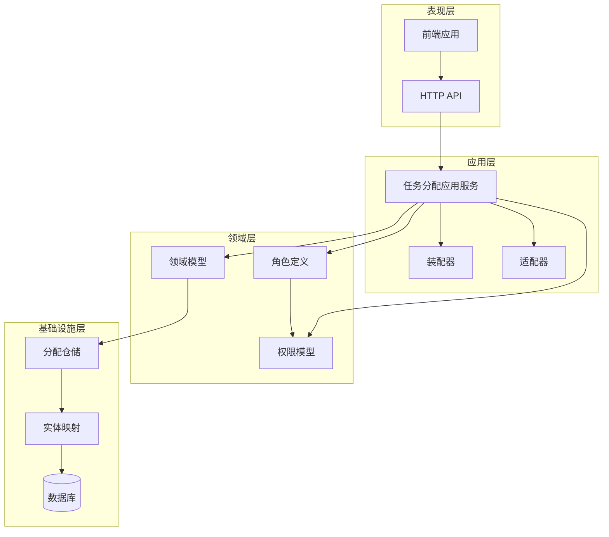
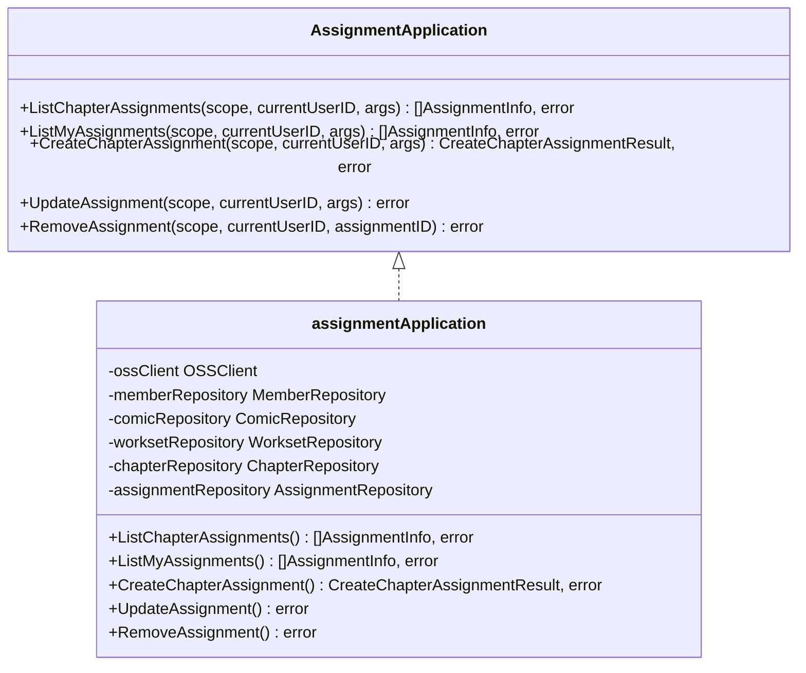
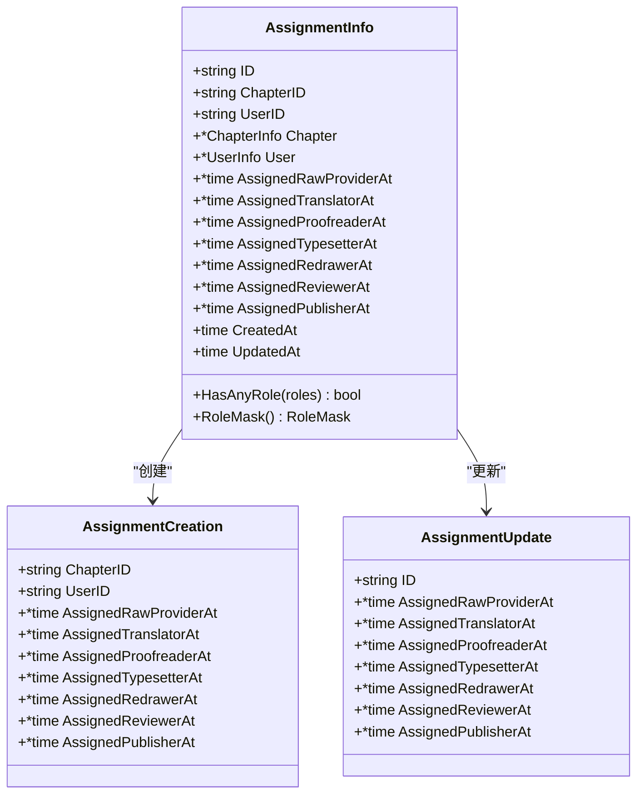
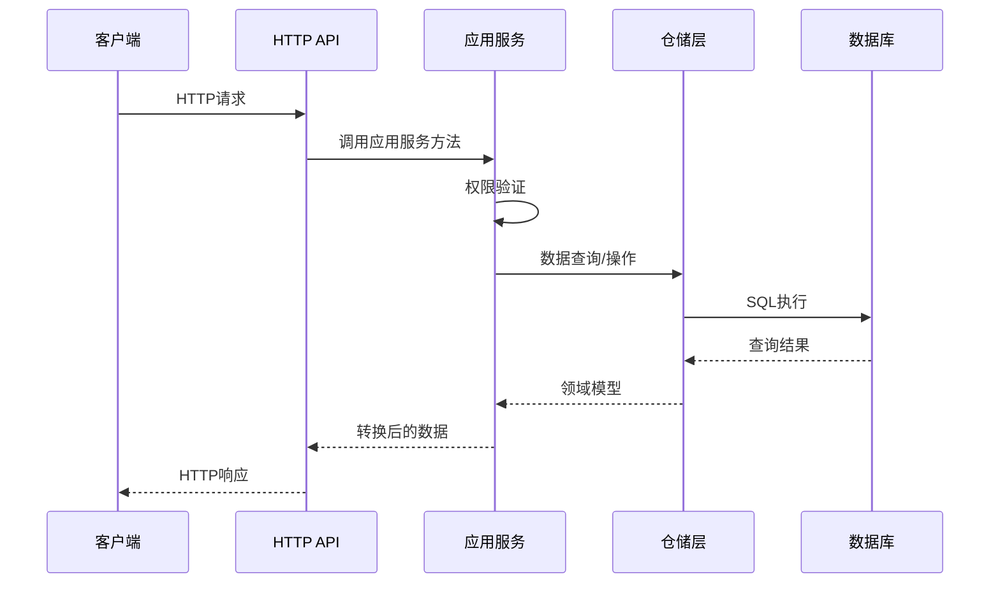
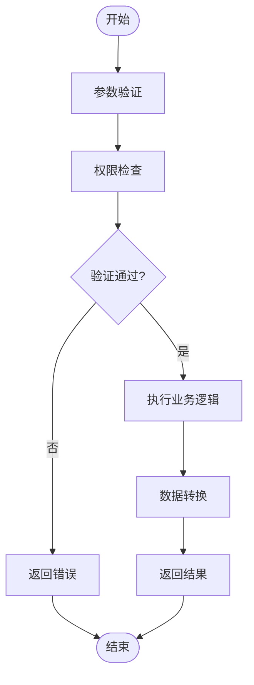
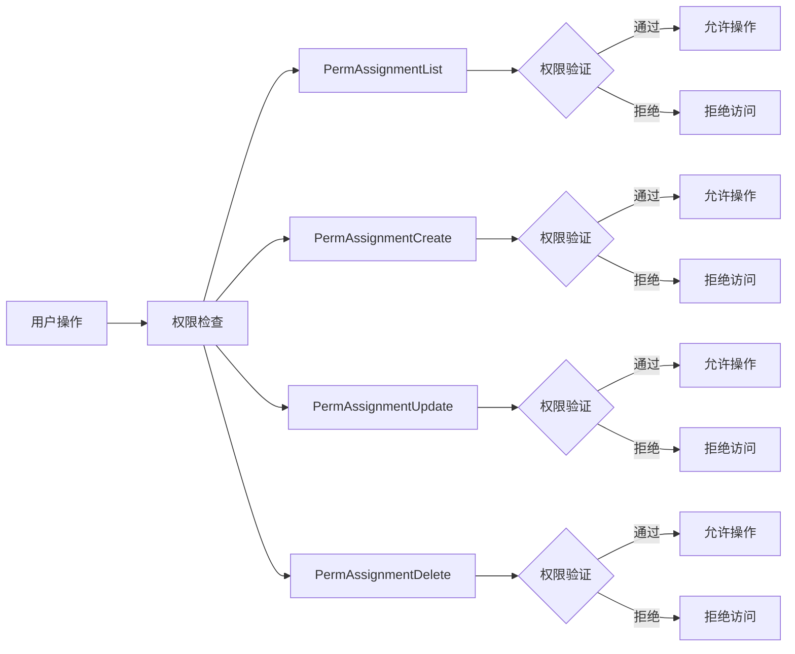
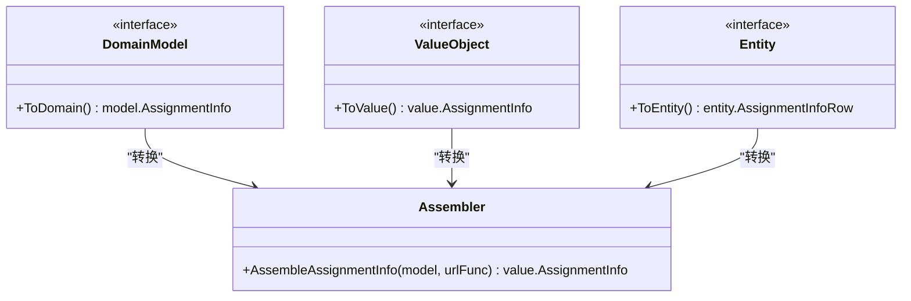
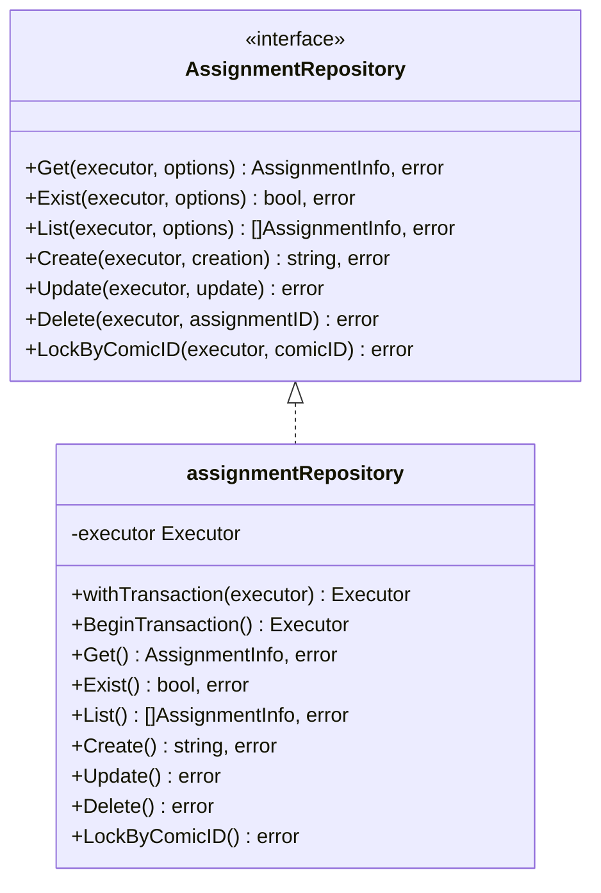
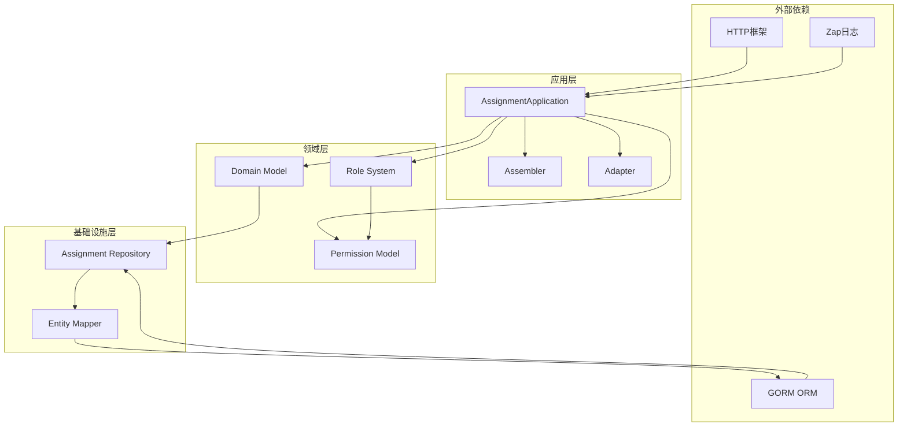
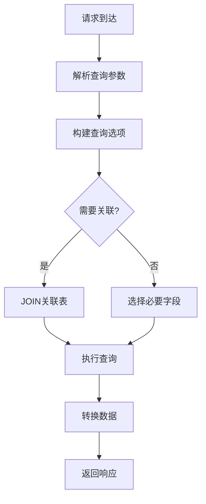

# 任务分配应用服务

<cite>
**本文档引用的文件**
- [internal/application/assignment.go](file://internal/application/assignment.go)
- [internal/api/http/assignment.go](file://internal/api/http/assignment.go)
- [internal/application/assembler/assignment.go](file://internal/application/assembler/assignment.go)
- [internal/application/adapter/loader.go](file://internal/application/adapter/loader.go)
- [internal/domain/model/assignment.go](file://internal/domain/model/assignment.go)
- [internal/domain/model/role.go](file://internal/domain/model/role.go)
- [internal/domain/model/permission.go](file://internal/domain/model/permission.go)
- [internal/domain/repository/assignment.go](file://internal/domain/repository/assignment.go)
- [internal/infrastructure/repository/assignment.go](file://internal/infrastructure/repository/assignment.go)
- [internal/infrastructure/repository/entity/assignment.go](file://internal/infrastructure/repository/entity/assignment.go)
- [internal/domain/service/assignment_include.go](file://internal/domain/service/assignment_include.go)
- [internal/value/assignment.go](file://internal/value/assignment.go)
- [frontend/src/api/modules/assignment.ts](file://frontend/src/api/modules/assignment.ts)
</cite>

## 目录
1. [简介](#简介)
2. [项目结构](#项目结构)
3. [核心组件](#核心组件)
4. [架构概览](#架构概览)
5. [详细组件分析](#详细组件分析)
6. [依赖关系分析](#依赖关系分析)
7. [性能考虑](#性能考虑)
8. [故障排除指南](#故障排除指南)
9. [结论](#结论)
10. [附录](#附录)

## 简介

任务分配应用服务是本项目中的核心业务服务之一，负责管理漫画制作过程中的任务分配工作流。该服务实现了完整的任务生命周期管理，包括任务创建、分配、执行、审核等环节，并提供了灵活的权限控制和状态跟踪机制。

该服务基于清晰的分层架构设计，采用DDD（领域驱动设计）原则，将业务逻辑与基础设施分离，确保了系统的可维护性和可扩展性。通过角色掩码机制，系统能够灵活处理多种分工角色，如原画师、翻译、校对、排版、审核、发布等职位。

## 项目结构

任务分配应用服务在整个项目架构中位于应用层，承担着业务协调和数据转换的重要职责。下图展示了该服务在整体架构中的位置：



**图表来源**
- [internal/application/assignment.go:1-358](file://internal/application/assignment.go#L1-L358)
- [internal/api/http/assignment.go:1-228](file://internal/api/http/assignment.go#L1-L228)
- [internal/domain/model/assignment.go:1-190](file://internal/domain/model/assignment.go#L1-L190)

**章节来源**
- [internal/application/assignment.go:1-358](file://internal/application/assignment.go#L1-L358)
- [internal/api/http/assignment.go:1-228](file://internal/api/http/assignment.go#L1-L228)

## 核心组件

### 应用服务接口

任务分配应用服务的核心是一个清晰定义的接口，提供了完整的任务管理能力：



**图表来源**
- [internal/application/assignment.go:20-90](file://internal/application/assignment.go#L20-L90)

### 数据模型

系统使用强类型的数据模型来确保数据的一致性和完整性：



**图表来源**
- [internal/domain/model/assignment.go:5-190](file://internal/domain/model/assignment.go#L5-L190)

**章节来源**
- [internal/domain/model/assignment.go:1-190](file://internal/domain/model/assignment.go#L1-L190)
- [internal/application/assignment.go:48-90](file://internal/application/assignment.go#L48-L90)

## 架构概览

任务分配应用服务遵循Clean Architecture原则，实现了清晰的职责分离：



**图表来源**
- [internal/api/http/assignment.go:25-52](file://internal/api/http/assignment.go#L25-L52)
- [internal/application/assignment.go:92-157](file://internal/application/assignment.go#L92-L157)

### 工作流管理

系统实现了完整的任务工作流管理，包括以下关键流程：



**图表来源**
- [internal/application/assignment.go:92-157](file://internal/application/assignment.go#L92-L157)

**章节来源**
- [internal/application/assignment.go:92-358](file://internal/application/assignment.go#L92-L358)

## 详细组件分析

### HTTP API 层

HTTP API 层提供了RESTful接口，支持标准的CRUD操作：

| 接口 | 方法 | 路径 | 功能描述 |
|------|------|------|----------|
| 获取章节分配列表 | GET | `/assignments` | 获取指定章节的所有分配记录 |
| 获取我的分配列表 | GET | `/assignments/mine` | 获取当前用户的分配记录 |
| 创建章节分配 | POST | `/assignments` | 为指定章节创建分配记录 |
| 更新分配角色 | PUT | `/assignments/{assignment_id}` | 全量替换分配角色 |
| 删除分配 | DELETE | `/assignments/{assignment_id}` | 删除指定分配记录 |

**章节来源**
- [internal/api/http/assignment.go:10-228](file://internal/api/http/assignment.go#L10-L228)

### 应用服务层

应用服务层是业务逻辑的核心，实现了完整的权限控制和数据处理：

#### 权限控制系统

系统采用基于角色的权限控制（RBAC），通过权限检查函数确保操作的安全性：



**图表来源**
- [internal/application/assignment.go:112-122](file://internal/application/assignment.go#L112-L122)
- [internal/application/assignment.go:234-241](file://internal/application/assignment.go#L234-L241)

#### 任务分配策略

系统支持灵活的任务分配策略，通过角色掩码实现多角色管理：

| 角色 | 掩码值 | 描述 |
|------|--------|------|
| RawProvider | 1 | 原画师 |
| Translator | 2 | 翻译 |
| Proofreader | 4 | 校对 |
| Typesetter | 8 | 排版 |
| Reviewer | 16 | 审核 |
| Publisher | 32 | 发布 |
| Admin | 64 | 管理员 |

**章节来源**
- [internal/domain/model/role.go:9-17](file://internal/domain/model/role.go#L9-L17)
- [internal/application/assignment.go:127-149](file://internal/application/assignment.go#L127-L149)

### 数据转换层

数据转换层负责在不同层次间进行数据格式转换：



**图表来源**
- [internal/application/assembler/assignment.go:9-38](file://internal/application/assembler/assignment.go#L9-L38)

**章节来源**
- [internal/application/assembler/assignment.go:1-39](file://internal/application/assembler/assignment.go#L1-L39)

### 仓储层

仓储层提供了数据持久化的抽象接口：



**图表来源**
- [internal/domain/repository/assignment.go:5-14](file://internal/domain/repository/assignment.go#L5-L14)

**章节来源**
- [internal/domain/repository/assignment.go:1-15](file://internal/domain/repository/assignment.go#L1-L15)
- [internal/infrastructure/repository/assignment.go:1-143](file://internal/infrastructure/repository/assignment.go#L1-L143)

## 依赖关系分析

任务分配应用服务的依赖关系体现了清晰的分层架构：



**图表来源**
- [internal/application/assignment.go:3-18](file://internal/application/assignment.go#L3-L18)
- [internal/infrastructure/repository/assignment.go:3-8](file://internal/infrastructure/repository/assignment.go#L3-L8)

### 组件耦合度分析

系统采用了松耦合的设计模式：

- **低耦合**: 应用服务通过接口依赖领域模型，避免了对具体实现的依赖
- **高内聚**: 每个组件专注于特定的业务职责
- **依赖注入**: 通过构造函数注入依赖，便于测试和维护

**章节来源**
- [internal/application/assignment.go:57-90](file://internal/application/assignment.go#L57-L90)

## 性能考虑

### 查询优化

系统通过智能的查询选项和关联加载机制优化性能：



**图表来源**
- [internal/application/assignment.go:124-143](file://internal/application/assignment.go#L124-L143)

### 缓存策略

系统支持按需缓存机制，通过includes参数控制关联数据的加载：

- **延迟加载**: 默认不加载关联数据，减少不必要的数据库查询
- **批量加载**: 支持一次性加载多个关联实体
- **条件加载**: 根据includes参数动态决定查询策略

**章节来源**
- [internal/domain/service/assignment_include.go:13-39](file://internal/domain/service/assignment_include.go#L13-L39)

## 故障排除指南

### 常见问题及解决方案

#### 权限相关错误

| 错误类型 | 可能原因 | 解决方案 |
|----------|----------|----------|
| 权限不足 | 用户没有相应角色 | 检查用户在目标章节的角色权限 |
| 参数验证失败 | 请求参数格式错误 | 验证请求参数的完整性和正确性 |
| 数据不存在 | 目标分配记录不存在 | 确认分配ID的有效性 |

#### 数据一致性问题

- **并发冲突**: 使用事务确保数据一致性
- **脏读问题**: 通过适当的隔离级别防止数据污染
- **死锁预防**: 合理设计事务顺序避免循环等待

**章节来源**
- [internal/application/assignment.go:99-102](file://internal/application/assignment.go#L99-L102)
- [internal/application/assignment.go:287-295](file://internal/application/assignment.go#L287-L295)

### 日志和监控

系统提供了完善的日志记录机制：

- **请求日志**: 记录所有HTTP请求的详细信息
- **业务日志**: 跟踪关键业务操作的状态变化
- **错误日志**: 记录异常情况和错误堆栈信息

**章节来源**
- [internal/application/assignment.go:97-110](file://internal/application/assignment.go#L97-L110)

## 结论

任务分配应用服务通过精心设计的架构和实现，为漫画制作团队提供了强大而灵活的任务管理能力。该服务的主要优势包括：

1. **清晰的架构设计**: 采用分层架构确保了代码的可维护性和可扩展性
2. **强大的权限控制**: 基于角色的细粒度权限管理保证了系统的安全性
3. **灵活的数据模型**: 支持多种角色组合和复杂的工作流程
4. **高性能实现**: 通过智能查询和缓存机制优化了系统性能
5. **完善的错误处理**: 提供了全面的错误处理和日志记录机制

该服务不仅满足了当前的业务需求，还为未来的功能扩展奠定了坚实的基础。

## 附录

### API 使用示例

#### 获取章节分配列表
```typescript
// TypeScript 示例
const assignments = await getAssignmentList({
  chapter_id: 'chapter-123',
  includes: ['user', 'chapter'],
  offset: 0,
  limit: 50
});
```

#### 创建任务分配
```typescript
// TypeScript 示例
const newAssignment = await createAssignment({
  chapter_id: 'chapter-123',
  user_id: 'user-456',
  role: 'translator,reviewer'
});
```

**章节来源**
- [frontend/src/api/modules/assignment.ts:63-99](file://frontend/src/api/modules/assignment.ts#L63-L99)

### 最佳实践建议

1. **权限验证**: 始终在执行敏感操作前进行权限验证
2. **参数验证**: 对所有外部输入进行严格的参数验证
3. **错误处理**: 实现统一的错误处理机制
4. **日志记录**: 保持详细的日志记录以便问题排查
5. **性能监控**: 定期监控系统性能指标