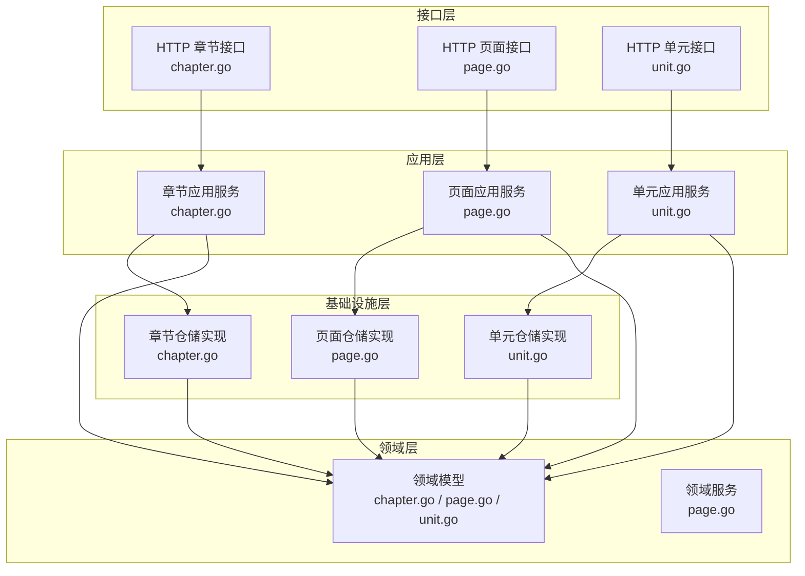
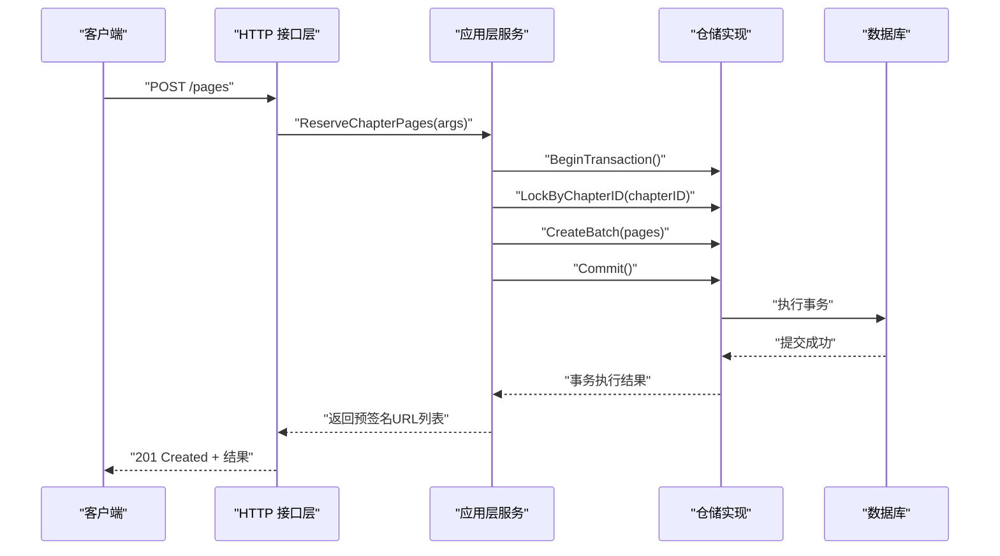
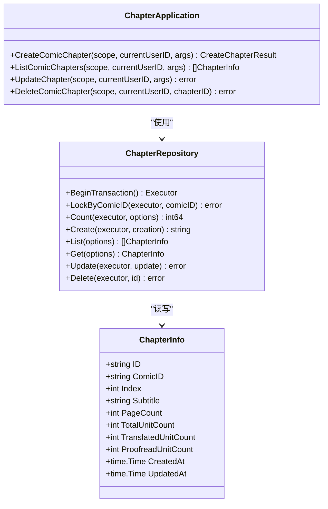
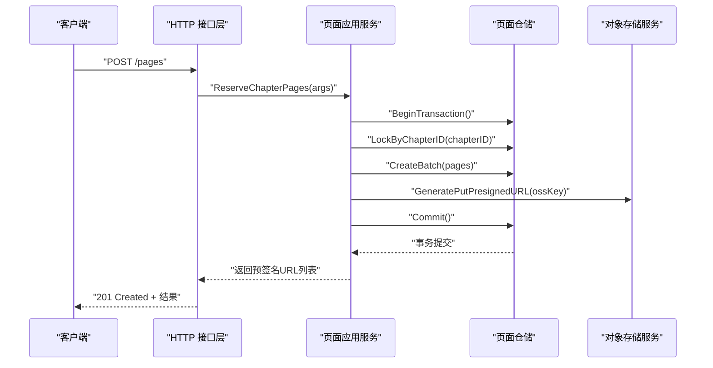
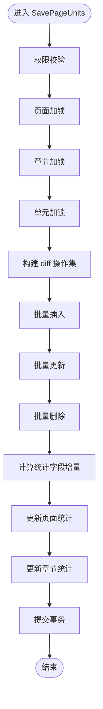
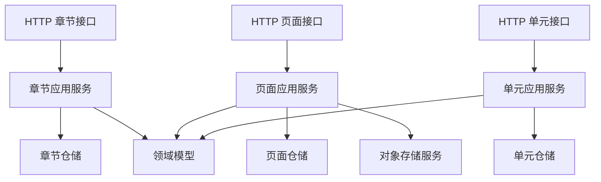

# 内容管理应用服务

<cite>
**本文档引用的文件**
- [main.go](file://main.go)
- [chapter.go](file://internal/application/chapter.go)
- [page.go](file://internal/application/page.go)
- [unit.go](file://internal/application/unit.go)
- [chapter.go](file://internal/domain/model/chapter.go)
- [page.go](file://internal/domain/model/page.go)
- [unit.go](file://internal/domain/model/unit.go)
- [chapter.go](file://internal/api/http/chapter.go)
- [page.go](file://internal/api/http/page.go)
- [unit.go](file://internal/api/http/unit.go)
- [page.go](file://internal/domain/service/page.go)
- [chapter.go](file://internal/infrastructure/repository/chapter.go)
- [page.go](file://internal/infrastructure/repository/page.go)
- [unit.go](file://internal/infrastructure/repository/unit.go)
- [chapter.go](file://internal/value/chapter.go)
- [page.go](file://internal/value/page.go)
- [unit.go](file://internal/value/unit.go)
</cite>

## 目录
1. [简介](#简介)
2. [项目结构](#项目结构)
3. [核心组件](#核心组件)
4. [架构总览](#架构总览)
5. [详细组件分析](#详细组件分析)
6. [依赖关系分析](#依赖关系分析)
7. [性能考虑](#性能考虑)
8. [故障排除指南](#故障排除指南)
9. [结论](#结论)
10. [附录](#附录)

## 简介
本项目是一个基于 Go 语言构建的内容管理应用服务，专注于漫画类内容的层级化组织与协作编辑流程。系统围绕章节（Chapter）、页面（Page）、单元（Unit）三层结构展开，提供内容创建、列表查询、更新、删除以及翻译与校对工作流状态管理能力。应用通过清晰的应用层（Application Layer）封装业务逻辑，结合仓储层（Repository Layer）与领域模型（Domain Model），确保数据一致性与可扩展性。

## 项目结构
项目采用分层架构与领域驱动设计（DDD）思想，主要分为以下层次：
- 应用层（Application）：负责编排业务流程、权限校验与事务控制
- 领域层（Domain）：定义模型、工作流状态与业务规则
- 基础设施层（Infrastructure）：实现仓储接口、数据库访问与外部服务集成
- 接口层（API HTTP）：提供 RESTful 接口，绑定应用层服务
- 值对象与参数（Value）：承载请求/响应参数与序列化结构

**图表来源**
- [chapter.go:1-185](file://internal/api/http/chapter.go#L1-L185)
- [page.go:1-189](file://internal/api/http/page.go#L1-L189)
- [unit.go:1-91](file://internal/api/http/unit.go#L1-L91)
- [chapter.go:1-330](file://internal/application/chapter.go#L1-L330)
- [page.go:1-402](file://internal/application/page.go#L1-L402)
- [unit.go:1-416](file://internal/application/unit.go#L1-L416)
- [chapter.go:1-260](file://internal/domain/model/chapter.go#L1-L260)
- [page.go:1-134](file://internal/domain/model/page.go#L1-L134)
- [unit.go:1-149](file://internal/domain/model/unit.go#L1-L149)
- [page.go:1-8](file://internal/domain/service/page.go#L1-L8)
- [chapter.go:1-190](file://internal/infrastructure/repository/chapter.go#L1-L190)
- [page.go:1-179](file://internal/infrastructure/repository/page.go#L1-L179)
- [unit.go:1-179](file://internal/infrastructure/repository/unit.go#L1-L179)

**章节来源**
- [main.go:25-145](file://main.go#L25-L145)

## 核心组件
- 章节应用服务（ChapterApplication）：提供章节的创建、列表、更新、删除能力，内置权限校验与事务控制，支持工作流状态更新与统计字段维护。
- 页面应用服务（PageApplication）：提供页面预留（批量创建并生成预签名上传 URL）、列表、更新、批量删除能力，支持与 OSS 的集成。
- 单元应用服务（UnitApplication）：提供页面单元的列表与 diff 保存（insert/patch/delete），在同一事务内更新页面与章节的统计字段，保证数据一致性。
- 领域模型：定义章节、页面、单元的数据结构与工作流状态转换规则，确保业务规则的一致性。
- 仓储实现：提供悲观锁、批量操作、统计字段读取与更新等底层能力，支撑应用层的业务逻辑。
- API 接口：暴露章节、页面、单元的 RESTful 接口，统一参数解析、鉴权与响应格式。

**章节来源**
- [chapter.go:20-41](file://internal/application/chapter.go#L20-L41)
- [page.go:21-42](file://internal/application/page.go#L21-L42)
- [unit.go:18-35](file://internal/application/unit.go#L18-L35)
- [chapter.go:5-35](file://internal/domain/model/chapter.go#L5-L35)
- [page.go:5-22](file://internal/domain/model/page.go#L5-L22)
- [unit.go:7-29](file://internal/domain/model/unit.go#L7-L29)

## 架构总览
系统通过应用层协调领域模型与仓储实现，API 层负责请求接入与响应输出。应用层在关键业务点使用事务与悲观锁，确保并发安全与数据一致性；同时通过工作流状态字段与统计字段，实现内容创作全流程的状态跟踪与进度统计。

**图表来源**
- [page.go:67-94](file://internal/api/http/page.go#L67-L94)
- [page.go:93-187](file://internal/application/page.go#L93-L187)
- [page.go:112-131](file://internal/infrastructure/repository/page.go#L112-L131)

**章节来源**
- [page.go:93-187](file://internal/application/page.go#L93-L187)
- [page.go:112-131](file://internal/infrastructure/repository/page.go#L112-L131)

## 详细组件分析

### 章节管理（Chapter）
章节管理负责漫画章节的生命周期管理，包括创建、列表、更新与删除。应用层在创建时进行参数校验与权限检查，使用事务与悲观锁确保并发安全；更新时支持工作流状态的细粒度变更，自动维护时间戳字段；删除采用软删除策略，保留历史数据。

**图表来源**
- [chapter.go:43-79](file://internal/application/chapter.go#L43-L79)
- [chapter.go:14-56](file://internal/infrastructure/repository/chapter.go#L14-L56)
- [chapter.go:5-35](file://internal/domain/model/chapter.go#L5-L35)

**章节来源**
- [chapter.go:82-165](file://internal/application/chapter.go#L82-L165)
- [chapter.go:167-221](file://internal/application/chapter.go#L167-L221)
- [chapter.go:223-329](file://internal/application/chapter.go#L223-L329)
- [chapter.go:131-147](file://internal/infrastructure/repository/chapter.go#L131-L147)

### 页面管理（Page）
页面管理提供页面预留与批量创建能力，结合 OSS 预签名 URL 实现客户端直传；支持页面列表、更新与批量删除。应用层在创建阶段先锁定章节记录，确保页面索引连续性；在删除阶段同时清理 OSS 资源与数据库记录，保证一致性。

**图表来源**
- [page.go:67-94](file://internal/api/http/page.go#L67-L94)
- [page.go:93-187](file://internal/application/page.go#L93-L187)
- [page.go:112-131](file://internal/infrastructure/repository/page.go#L112-L131)

**章节来源**
- [page.go:93-187](file://internal/application/page.go#L93-L187)
- [page.go:189-248](file://internal/application/page.go#L189-L248)
- [page.go:250-311](file://internal/application/page.go#L250-L311)
- [page.go:313-401](file://internal/application/page.go#L313-L401)
- [page.go:43-53](file://internal/infrastructure/repository/page.go#L43-L53)

### 单元内容管理（Unit）
单元内容管理提供页面单元的列表与 diff 保存能力，支持插入、部分更新与删除操作；应用层在同一事务内更新页面与章节的统计字段，确保总数与翻译/校对进度的准确性。仓储层通过悲观锁防止并发冲突，保障数据一致性。

**图表来源**
- [unit.go:125-415](file://internal/application/unit.go#L125-L415)
- [unit.go:65-92](file://internal/infrastructure/repository/unit.go#L65-L92)
- [unit.go:94-114](file://internal/infrastructure/repository/unit.go#L94-L114)
- [unit.go:166-178](file://internal/infrastructure/repository/unit.go#L166-L178)
- [page.go:133-144](file://internal/infrastructure/repository/page.go#L133-L144)
- [chapter.go:169-180](file://internal/infrastructure/repository/chapter.go#L169-L180)

**章节来源**
- [unit.go:81-123](file://internal/application/unit.go#L81-L123)
- [unit.go:125-415](file://internal/application/unit.go#L125-L415)
- [unit.go:44-79](file://internal/infrastructure/repository/unit.go#L44-L79)

### 工作流状态与统计字段
系统通过工作流状态字段与统计字段实现内容创作全流程的可视化与自动化推进。章节与页面均包含多阶段工作流状态字段，应用层在更新时根据状态变化自动维护时间戳；统计字段在单元保存时实时更新，确保页面与章节的总体进度准确。

**章节来源**
- [chapter.go:126-259](file://internal/domain/model/chapter.go#L126-L259)
- [page.go:101-133](file://internal/domain/model/page.go#L101-L133)
- [chapter.go:149-167](file://internal/infrastructure/repository/chapter.go#L149-L167)
- [page.go:146-160](file://internal/infrastructure/repository/page.go#L146-L160)

## 依赖关系分析
应用层服务通过依赖注入的方式组合仓储与外部服务，形成高内聚低耦合的结构。API 层仅依赖应用层接口，避免直接访问仓储实现，便于替换与测试。

**图表来源**
- [chapter.go:25-52](file://internal/api/http/chapter.go#L25-L52)
- [page.go:25-52](file://internal/api/http/page.go#L25-L52)
- [unit.go:22-49](file://internal/api/http/unit.go#L22-L49)
- [chapter.go:43-79](file://internal/application/chapter.go#L43-L79)
- [page.go:54-91](file://internal/application/page.go#L54-L91)
- [unit.go:46-79](file://internal/application/unit.go#L46-L79)

**章节来源**
- [main.go:56-122](file://main.go#L56-L122)

## 性能考虑
- 事务与锁：应用层在关键操作中使用事务与悲观锁，确保并发安全，但需注意锁范围与持有时间，避免长事务阻塞。
- 批量操作：页面预留与单元的批量插入/更新/删除显著提升吞吐量，建议合理设置批量大小以平衡内存与网络开销。
- 统计字段：在单元保存时同步更新页面与章节统计字段，减少后续查询成本，但需确保增量计算的正确性。
- 预签名上传：页面预留阶段生成预签名 URL，降低服务端带宽压力，提高上传效率。

## 故障排除指南
- 参数校验失败：检查请求参数是否符合值对象的验证规则，如章节副标题长度限制、页面数量必须大于 0 等。
- 权限不足：确认当前用户在目标漫画/章节/页面上的角色与权限，应用层会在关键操作前进行权限检查。
- 事务回滚：若事务执行过程中发生错误，应用层会尝试回滚，检查日志中的错误信息定位问题。
- 并发冲突：页面与单元保存时使用悲观锁，若出现锁等待超时，建议优化业务流程或调整锁粒度。
- OSS 上传失败：检查预签名 URL 生成与上传过程中的错误码，确认对象存储服务可用性与权限配置。

**章节来源**
- [chapter.go:89-92](file://internal/application/chapter.go#L89-L92)
- [page.go:100-103](file://internal/application/page.go#L100-L103)
- [unit.go:140-150](file://internal/application/unit.go#L140-L150)
- [page.go:167-174](file://internal/application/page.go#L167-L174)

## 结论
本内容管理应用服务通过清晰的分层架构与严格的业务规则，实现了漫画内容从章节到页面再到单元的完整管理流程。应用层在权限、事务与统计字段方面提供了稳健的保障，仓储层与领域模型共同确保了数据一致性与可扩展性。结合预签名上传与工作流状态管理，系统能够高效支撑多角色协作的内容创作场景。

## 附录
- API 接口定义概览
  - 章节接口：创建、列表、更新、删除
  - 页面接口：预留页面并生成上传 URL、列表、更新、批量删除
  - 单元接口：列表、diff 保存
- 参数与响应结构参考
  - 章节：创建参数、更新参数、列表参数
  - 页面：预留参数、更新参数、列表参数
  - 单元：diff 参数、单元信息结构

**章节来源**
- [chapter.go:41-148](file://internal/value/chapter.go#L41-L148)
- [page.go:7-95](file://internal/value/page.go#L7-L95)
- [unit.go:55-59](file://internal/value/unit.go#L55-L59)