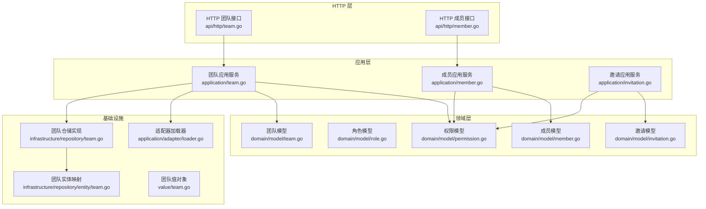
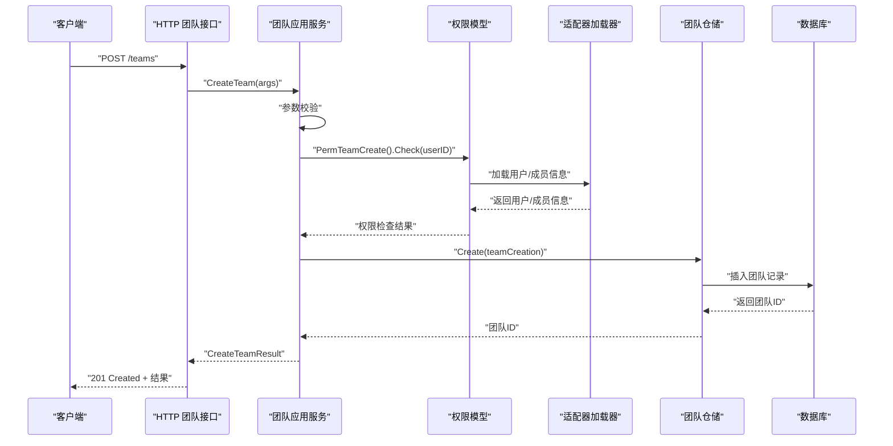
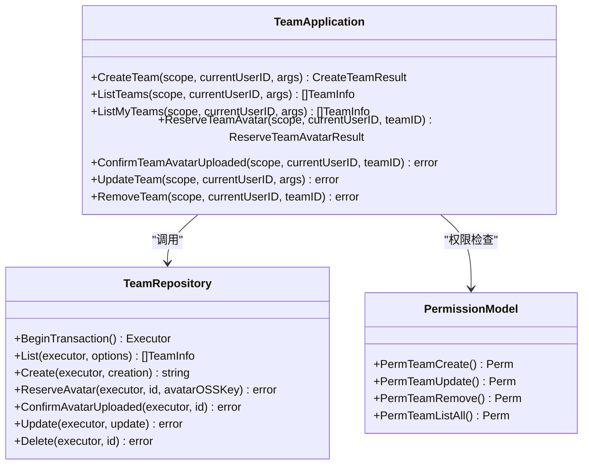
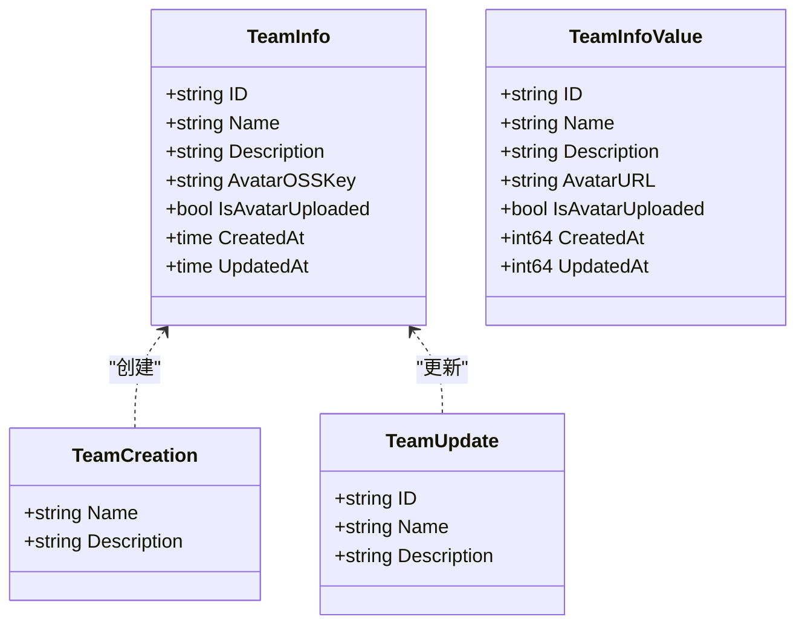
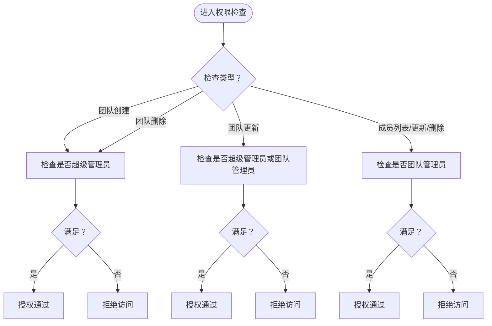
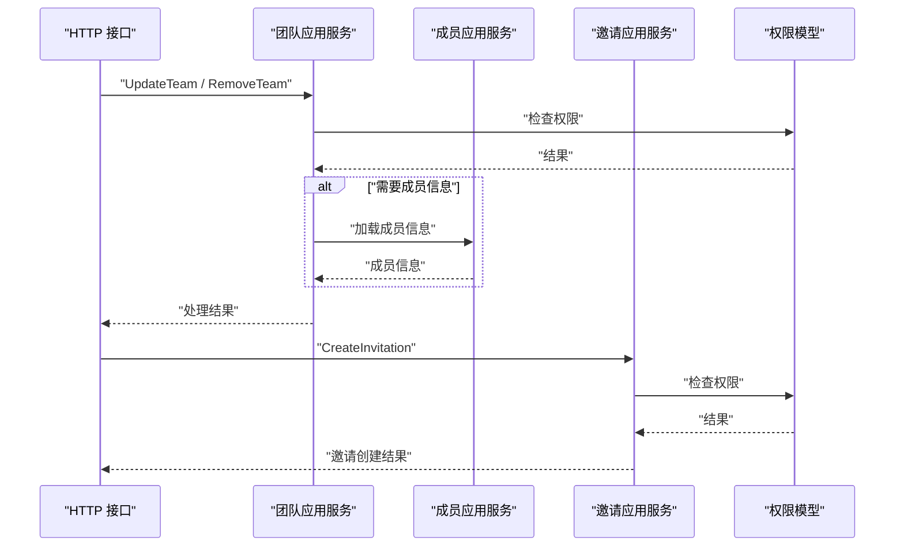
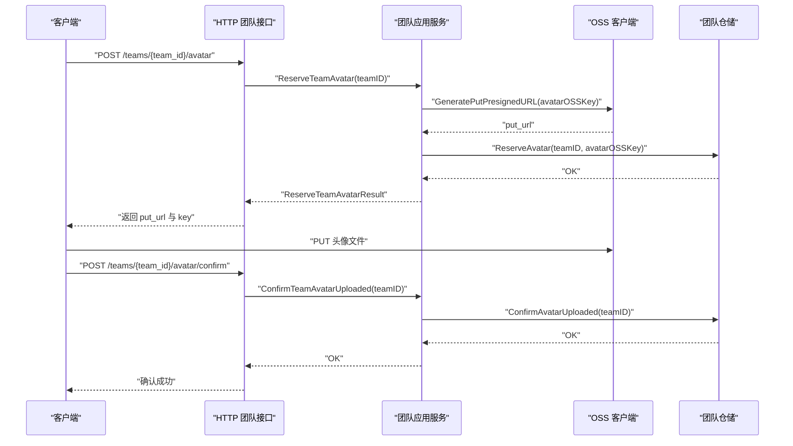
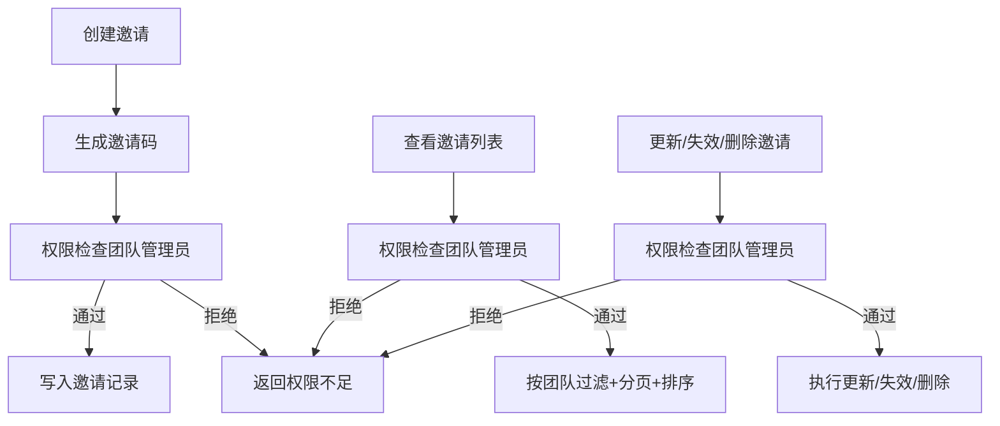
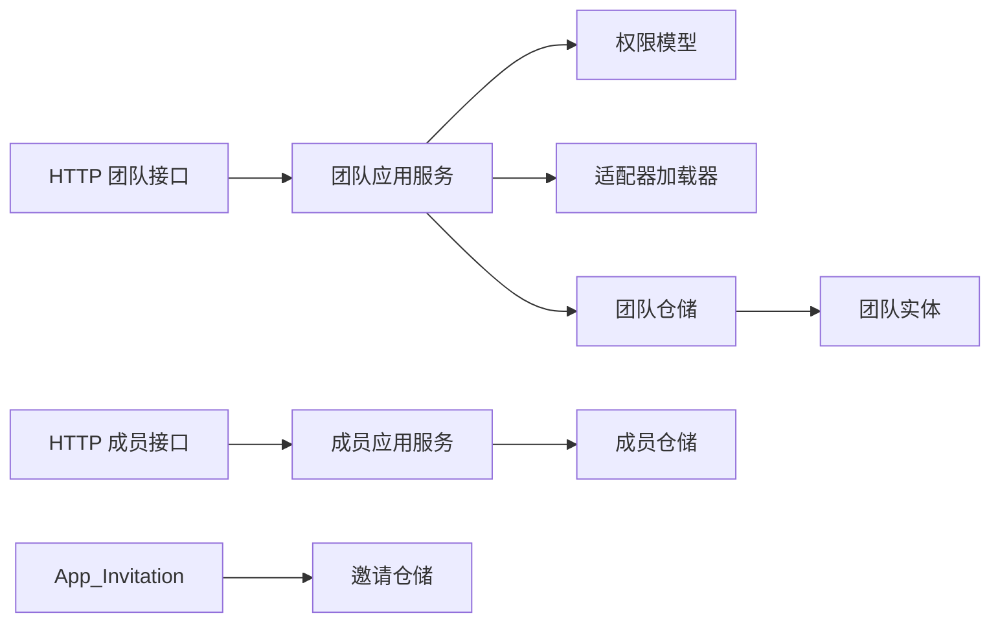

# 团队应用服务

<cite>
**本文档引用的文件**
- [application/team.go](file://internal/application/team.go)
- [domain/model/team.go](file://internal/domain/model/team.go)
- [api/http/team.go](file://internal/api/http/team.go)
- [domain/repository/team.go](file://internal/domain/repository/team.go)
- [application/assembler/team.go](file://internal/application/assembler/team.go)
- [domain/model/permission.go](file://internal/domain/model/permission.go)
- [domain/model/member.go](file://internal/domain/model/member.go)
- [application/adapter/loader.go](file://internal/application/adapter/loader.go)
- [infrastructure/repository/team.go](file://internal/infrastructure/repository/team.go)
- [value/team.go](file://internal/value/team.go)
- [domain/model/role.go](file://internal/domain/model/role.go)
- [infrastructure/repository/entity/team.go](file://internal/infrastructure/repository/entity/team.go)
- [application/member.go](file://internal/application/member.go)
- [application/invitation.go](file://internal/application/invitation.go)
- [api/http/member.go](file://internal/api/http/member.go)
- [domain/model/invitation.go](file://internal/domain/model/invitation.go)
- [infrastructure/repository/invitation.go](file://internal/infrastructure/repository/invitation.go)
- [domain/service/invitation.go](file://internal/domain/service/invitation.go)
</cite>

## 目录
1. [简介](#简介)
2. [项目结构](#项目结构)
3. [核心组件](#核心组件)
4. [架构总览](#架构总览)
5. [详细组件分析](#详细组件分析)
6. [依赖关系分析](#依赖关系分析)
7. [性能考虑](#性能考虑)
8. [故障排查指南](#故障排查指南)
9. [结论](#结论)
10. [附录](#附录)

## 简介
本文件面向“团队应用服务”，系统性阐述其设计目的、核心功能与实现细节，覆盖团队创建、团队信息管理、团队头像上传、团队成员管理、权限控制、角色管理、状态变更等业务逻辑。同时说明团队应用服务与成员应用服务、邀请应用服务之间的协作关系，并给出通过事务保证一致性、权限验证与成员邀请机制的关键实现路径。

## 项目结构
团队应用服务位于后端 Go 代码的分层架构中，遵循“HTTP 层 → 应用层 → 领域模型/服务 → 基础设施仓储”的分层组织方式。团队相关能力主要由以下模块协同完成：
- HTTP 层：对外暴露 REST 接口，解析请求参数、鉴权与响应封装
- 应用层：编排业务流程，执行权限校验与数据组装
- 领域模型：定义团队、成员、角色、权限等核心领域概念
- 基础设施仓储：数据库访问与事务控制
- 值对象：输入输出参数与结果的数据结构

图表来源
- [api/http/team.go:1-289](file://internal/api/http/team.go#L1-L289)
- [application/team.go:1-415](file://internal/application/team.go#L1-L415)
- [domain/model/permission.go:1-845](file://internal/domain/model/permission.go#L1-L845)
- [domain/model/team.go:1-63](file://internal/domain/model/team.go#L1-L63)
- [domain/model/member.go:1-205](file://internal/domain/model/member.go#L1-L205)
- [domain/model/role.go:1-56](file://internal/domain/model/role.go#L1-L56)
- [infrastructure/repository/team.go:1-110](file://internal/infrastructure/repository/team.go#L1-L110)
- [infrastructure/repository/entity/team.go:1-47](file://internal/infrastructure/repository/entity/team.go#L1-L47)
- [application/adapter/loader.go:1-71](file://internal/application/adapter/loader.go#L1-L71)
- [value/team.go:1-112](file://internal/value/team.go#L1-L112)
- [api/http/member.go:1-272](file://internal/api/http/member.go#L1-L272)
- [application/member.go:1-448](file://internal/application/member.go#L1-L448)
- [application/invitation.go:1-304](file://internal/application/invitation.go#L1-L304)
- [domain/model/invitation.go:73-157](file://internal/domain/model/invitation.go#L73-L157)
- [infrastructure/repository/invitation.go:88-123](file://internal/infrastructure/repository/invitation.go#L88-L123)
- [domain/service/invitation.go:1-16](file://internal/domain/service/invitation.go#L1-L16)

章节来源
- [api/http/team.go:1-289](file://internal/api/http/team.go#L1-L289)
- [application/team.go:1-415](file://internal/application/team.go#L1-L415)
- [domain/model/permission.go:1-845](file://internal/domain/model/permission.go#L1-L845)
- [domain/model/team.go:1-63](file://internal/domain/model/team.go#L1-L63)
- [infrastructure/repository/team.go:1-110](file://internal/infrastructure/repository/team.go#L1-L110)

## 核心组件
- HTTP 层接口：提供团队创建、团队列表、我的团队、更新团队、头像预留与确认、删除团队等 REST 接口，统一鉴权与响应封装。
- 应用层服务：实现团队业务流程，包括参数校验、权限检查、调用仓储与外部服务、装配结果。
- 领域模型：定义团队、成员、角色、权限等核心领域对象与权限判定规则。
- 基础设施仓储：封装数据库访问、事务控制与实体映射。
- 值对象：定义输入输出参数与结果的数据结构，含参数校验逻辑。

章节来源
- [api/http/team.go:1-289](file://internal/api/http/team.go#L1-L289)
- [application/team.go:1-415](file://internal/application/team.go#L1-L415)
- [domain/model/permission.go:1-845](file://internal/domain/model/permission.go#L1-L845)
- [domain/model/team.go:1-63](file://internal/domain/model/team.go#L1-L63)
- [infrastructure/repository/team.go:1-110](file://internal/infrastructure/repository/team.go#L1-L110)
- [value/team.go:1-112](file://internal/value/team.go#L1-L112)

## 架构总览
团队应用服务采用清晰的分层架构，围绕“团队”这一核心领域对象，通过应用层编排、领域层权限与角色模型、基础设施层仓储与事务，形成稳定的业务闭环。团队与成员、邀请等子系统通过权限模型与适配器解耦协作。

图表来源
- [api/http/team.go:23-47](file://internal/api/http/team.go#L23-L47)
- [application/team.go:92-130](file://internal/application/team.go#L92-L130)
- [domain/model/permission.go:302-326](file://internal/domain/model/permission.go#L302-L326)
- [application/adapter/loader.go:10-24](file://internal/application/adapter/loader.go#L10-L24)
- [infrastructure/repository/team.go:53-67](file://internal/infrastructure/repository/team.go#L53-L67)

## 详细组件分析

### 组件一：团队应用服务（TeamApplication）
职责与能力
- 团队创建：校验参数、权限检查（超级管理员）、创建团队并返回团队ID
- 团队列表：校验参数、权限检查（超级管理员）、分页查询团队并生成头像预签名URL
- 我的团队：基于当前用户成员记录过滤团队，分页查询并生成头像URL
- 更新团队：校验参数、权限检查（超级管理员或团队管理员）、更新团队信息
- 头像预留与确认：生成预签名PUT URL、预留OSS Key；客户端上传后确认头像已上传
- 删除团队：校验权限（超级管理员），软删除团队

关键实现要点
- 权限控制：通过权限模型与适配器加载用户/成员信息进行判定
- 事务与一致性：仓储实现支持 BeginTransaction 与带事务执行器，确保多步操作原子性
- 外部集成：通过 OSS 客户端生成预签名URL，头像上传与状态确认解耦

图表来源
- [application/team.go:20-56](file://internal/application/team.go#L20-L56)
- [domain/repository/team.go:5-13](file://internal/domain/repository/team.go#L5-L13)
- [domain/model/permission.go:302-349](file://internal/domain/model/permission.go#L302-L349)

章节来源
- [application/team.go:92-130](file://internal/application/team.go#L92-L130)
- [application/team.go:132-184](file://internal/application/team.go#L132-L184)
- [application/team.go:234-299](file://internal/application/team.go#L234-L299)
- [application/team.go:301-343](file://internal/application/team.go#L301-L343)
- [application/team.go:345-380](file://internal/application/team.go#L345-L380)
- [application/team.go:382-414](file://internal/application/team.go#L382-L414)

### 组件二：团队领域模型与值对象
- 团队信息模型：包含ID、名称、描述、头像OSS Key、上传状态、创建/更新时间
- 团队创建/更新模型：封装创建与更新所需的字段
- 团队值对象：输入参数（创建、更新、分页）与输出结果（团队信息、头像预留结果）

图表来源
- [domain/model/team.go:5-62](file://internal/domain/model/team.go#L5-L62)
- [value/team.go:8-45](file://internal/value/team.go#L8-L45)

章节来源
- [domain/model/team.go:1-63](file://internal/domain/model/team.go#L1-L63)
- [value/team.go:1-112](file://internal/value/team.go#L1-L112)

### 组件三：权限控制与成员角色
- 权限模型：定义“超级管理员”“团队管理员”等判定逻辑，支持按用户、团队、成员信息进行权限检查
- 角色模型：以位掩码形式表达成员分工角色（原稿、翻译、校对、排版、审阅、出版、管理员）
- 适配器加载器：将仓储接口转换为权限检查所需的回调函数

图表来源
- [domain/model/permission.go:302-349](file://internal/domain/model/permission.go#L302-L349)
- [domain/model/member.go:101-136](file://internal/domain/model/member.go#L101-L136)
- [application/adapter/loader.go:10-24](file://internal/application/adapter/loader.go#L10-L24)

章节来源
- [domain/model/permission.go:1-845](file://internal/domain/model/permission.go#L1-L845)
- [domain/model/member.go:1-205](file://internal/domain/model/member.go#L1-L205)
- [domain/model/role.go:1-56](file://internal/domain/model/role.go#L1-L56)
- [application/adapter/loader.go:1-71](file://internal/application/adapter/loader.go#L1-L71)

### 组件四：团队与成员、邀请的协作
- 团队应用服务与成员应用服务：团队应用服务在权限检查中依赖成员信息（如团队管理员），成员应用服务负责成员创建、角色更新、成员列表等
- 团队应用服务与邀请应用服务：团队应用服务通过权限模型判定是否允许更新/删除团队；邀请应用服务负责邀请创建、更新、失效与删除，避免重复加入

图表来源
- [application/team.go:321-329](file://internal/application/team.go#L321-L329)
- [application/team.go:397-405](file://internal/application/team.go#L397-L405)
- [application/member.go:161-169](file://internal/application/member.go#L161-L169)
- [application/invitation.go:153-161](file://internal/application/invitation.go#L153-L161)

章节来源
- [application/team.go:1-415](file://internal/application/team.go#L1-L415)
- [application/member.go:1-448](file://internal/application/member.go#L1-L448)
- [application/invitation.go:1-304](file://internal/application/invitation.go#L1-L304)

### 组件五：头像上传与状态管理
- 头像预留：生成预签名PUT URL与OSS Key，写入团队记录但未标记上传完成
- 头像确认：客户端上传完成后，调用确认接口，将上传状态置为完成
- 头像URL生成：通过装配器与OSS客户端生成头像访问URL

图表来源
- [application/team.go:186-232](file://internal/application/team.go#L186-L232)
- [application/team.go:345-380](file://internal/application/team.go#L345-L380)
- [application/assembler/team.go:10-31](file://internal/application/assembler/team.go#L10-L31)
- [infrastructure/repository/team.go:69-88](file://internal/infrastructure/repository/team.go#L69-L88)

章节来源
- [application/team.go:186-232](file://internal/application/team.go#L186-L232)
- [application/team.go:345-380](file://internal/application/team.go#L345-L380)
- [application/assembler/team.go:1-32](file://internal/application/assembler/team.go#L1-L32)
- [infrastructure/repository/team.go:1-110](file://internal/infrastructure/repository/team.go#L1-L110)

### 组件六：成员邀请机制与权限验证
- 邀请创建：生成唯一邀请码，写入邀请表，支持包含邀请人信息
- 邀请列表：按团队过滤、分页排序，支持包含邀请人信息
- 邀请更新/失效/删除：支持更新邀请的角色配置与失效
- 权限控制：仅团队管理员可创建/更新/删除/查看邀请

图表来源
- [application/invitation.go:133-200](file://internal/application/invitation.go#L133-L200)
- [application/invitation.go:71-131](file://internal/application/invitation.go#L71-L131)
- [domain/model/permission.go:207-246](file://internal/domain/model/permission.go#L207-L246)
- [domain/service/invitation.go:5-15](file://internal/domain/service/invitation.go#L5-L15)
- [infrastructure/repository/invitation.go:88-123](file://internal/infrastructure/repository/invitation.go#L88-L123)

章节来源
- [application/invitation.go:1-304](file://internal/application/invitation.go#L1-L304)
- [domain/model/invitation.go:73-157](file://internal/domain/model/invitation.go#L73-L157)
- [domain/model/permission.go:207-246](file://internal/domain/model/permission.go#L207-L246)
- [domain/service/invitation.go:1-16](file://internal/domain/service/invitation.go#L1-L16)
- [infrastructure/repository/invitation.go:88-123](file://internal/infrastructure/repository/invitation.go#L88-L123)

## 依赖关系分析
- 应用层依赖领域模型与适配器，通过权限模型与仓储接口实现业务编排
- 仓储层依赖实体映射与事务执行器，保证数据一致性
- HTTP 层依赖应用层，统一处理鉴权、参数校验与响应

图表来源
- [api/http/team.go:1-289](file://internal/api/http/team.go#L1-L289)
- [application/team.go:1-415](file://internal/application/team.go#L1-L415)
- [application/member.go:1-448](file://internal/application/member.go#L1-L448)
- [application/invitation.go:1-304](file://internal/application/invitation.go#L1-L304)
- [infrastructure/repository/team.go:1-110](file://internal/infrastructure/repository/team.go#L1-L110)
- [infrastructure/repository/entity/team.go:1-47](file://internal/infrastructure/repository/entity/team.go#L1-L47)

章节来源
- [application/team.go:1-415](file://internal/application/team.go#L1-L415)
- [application/member.go:1-448](file://internal/application/member.go#L1-L448)
- [application/invitation.go:1-304](file://internal/application/invitation.go#L1-L304)
- [infrastructure/repository/team.go:1-110](file://internal/infrastructure/repository/team.go#L1-L110)

## 性能考虑
- 列表查询：团队列表与我的团队列表均支持分页与排序，避免一次性加载大量数据
- 头像URL生成：通过预签名URL减少服务端转发压力，提升图片加载性能
- N+1 查询优化：我的团队查询先获取成员记录再批量查询团队信息，降低查询次数
- 事务边界：团队创建、头像预留/确认、更新/删除等关键流程在仓储层使用事务执行器，确保一致性

## 故障排查指南
常见问题与定位建议
- 权限不足：检查当前用户是否具备超级管理员或团队管理员权限；确认适配器加载的用户/成员信息是否正确
- 参数校验失败：核对请求体字段长度与必填项；关注值对象的 Validate 方法返回的错误信息
- 头像上传异常：确认预签名PUT URL是否有效、OSS Key是否正确预留、确认接口是否被调用
- 数据不一致：检查事务执行器是否正确传入仓储方法；确认数据库软删除与状态字段更新逻辑

章节来源
- [application/team.go:99-102](file://internal/application/team.go#L99-L102)
- [application/team.go:112-118](file://internal/application/team.go#L112-L118)
- [value/team.go:13-29](file://internal/value/team.go#L13-L29)
- [application/team.go:217-221](file://internal/application/team.go#L217-L221)
- [application/team.go:374-377](file://internal/application/team.go#L374-L377)

## 结论
团队应用服务通过清晰的分层设计与严格的权限控制，实现了团队全生命周期管理：从创建、信息维护到头像上传与状态管理，并与成员与邀请子系统协同，保障团队协作场景下的权限安全与数据一致性。应用层编排、领域模型判定与基础设施仓储事务的结合，使得系统具备良好的扩展性与可维护性。

## 附录
- 实际应用场景举例
  - 团队创建流程：超级管理员登录 → 调用创建接口 → 参数校验 → 权限检查 → 仓储创建 → 返回团队ID
  - 成员邀请机制：团队管理员登录 → 生成邀请码 → 写入邀请记录 → 被邀请人使用邀请码加入 → 系统校验并创建成员记录
  - 权限验证：不同操作（创建/更新/删除/查看）对应不同的权限判定逻辑，确保最小权限原则

- 代码示例路径（不展示具体代码内容）
  - 团队创建接口实现：[api/http/team.go:23-47](file://internal/api/http/team.go#L23-L47)
  - 团队创建应用层逻辑：[application/team.go:92-130](file://internal/application/team.go#L92-L130)
  - 团队列表应用层逻辑：[application/team.go:132-184](file://internal/application/team.go#L132-L184)
  - 我的团队应用层逻辑：[application/team.go:234-299](file://internal/application/team.go#L234-L299)
  - 更新团队应用层逻辑：[application/team.go:301-343](file://internal/application/team.go#L301-L343)
  - 头像预留与确认应用层逻辑：[application/team.go:186-232](file://internal/application/team.go#L186-L232), [application/team.go:345-380](file://internal/application/team.go#L345-L380)
  - 删除团队应用层逻辑：[application/team.go:382-414](file://internal/application/team.go#L382-L414)
  - 权限模型判定：[domain/model/permission.go:302-349](file://internal/domain/model/permission.go#L302-L349)
  - 角色模型与适配器：[domain/model/role.go:1-56](file://internal/domain/model/role.go#L1-L56), [application/adapter/loader.go:10-24](file://internal/application/adapter/loader.go#L10-L24)
  - 团队仓储与实体映射：[infrastructure/repository/team.go:53-109](file://internal/infrastructure/repository/team.go#L53-L109), [infrastructure/repository/entity/team.go:36-46](file://internal/infrastructure/repository/entity/team.go#L36-L46)
  - 成员应用服务（成员邀请协作）：[application/member.go:161-169](file://internal/application/member.go#L161-L169), [application/invitation.go:153-161](file://internal/application/invitation.go#L153-L161)