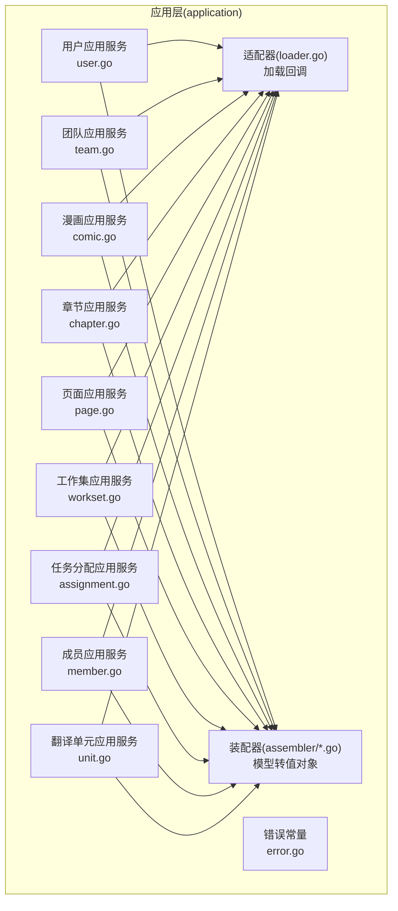
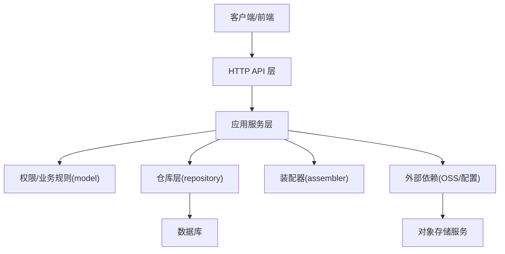
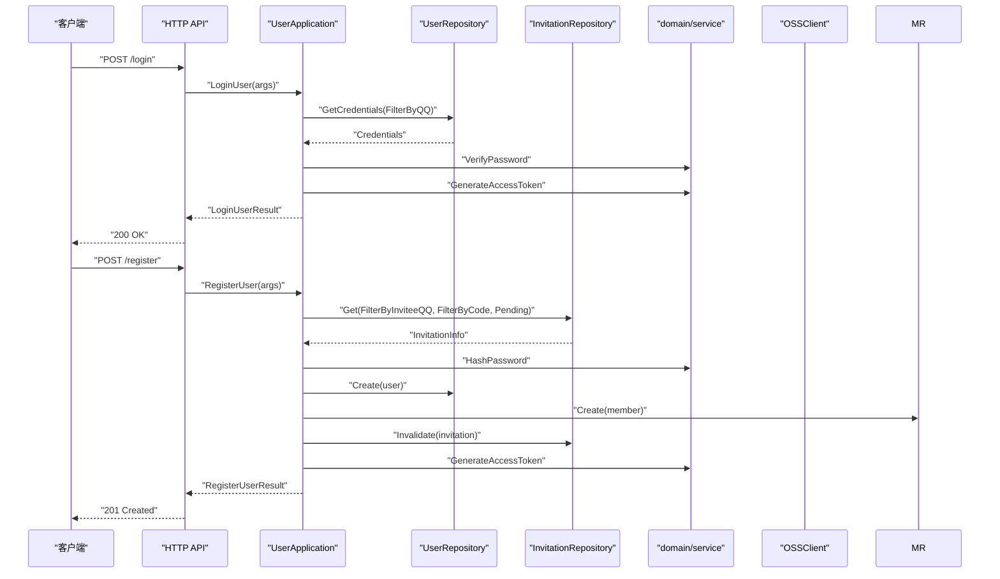
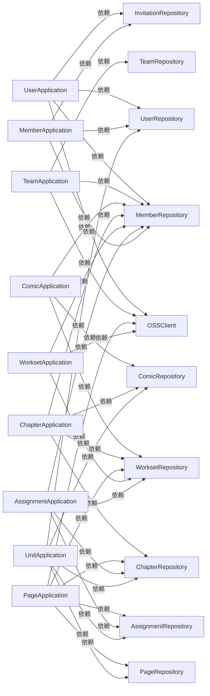

# 应用层服务

<cite>
**本文引用的文件**
- [internal/application/user.go](file://internal/application/user.go)
- [internal/application/team.go](file://internal/application/team.go)
- [internal/application/assignment.go](file://internal/application/assignment.go)
- [internal/application/comic.go](file://internal/application/comic.go)
- [internal/application/chapter.go](file://internal/application/chapter.go)
- [internal/application/member.go](file://internal/application/member.go)
- [internal/application/page.go](file://internal/application/page.go)
- [internal/application/workset.go](file://internal/application/workset.go)
- [internal/application/unit.go](file://internal/application/unit.go)
- [internal/application/error.go](file://internal/application/error.go)
- [internal/application/adapter/loader.go](file://internal/application/adapter/loader.go)
- [internal/application/assembler/user.go](file://internal/application/assembler/user.go)
- [internal/application/assembler/team.go](file://internal/application/assembler/team.go)
- [internal/application/assembler/assignment.go](file://internal/application/assembler/assignment.go)
- [internal/application/assembler/comic.go](file://internal/application/assembler/comic.go)
</cite>

## 目录
1. [简介](#简介)
2. [项目结构](#项目结构)
3. [核心组件](#核心组件)
4. [架构总览](#架构总览)
5. [详细组件分析](#详细组件分析)
6. [依赖分析](#依赖分析)
7. [性能考虑](#性能考虑)
8. [故障排查指南](#故障排查指南)
9. [结论](#结论)
10. [附录](#附录)

## 简介
本文件系统性梳理 poprako-web-ms 项目的应用层服务设计与实现，重点阐述以下方面：
- 应用服务层的设计目的与职责边界：封装业务用例、统一事务管理、执行业务规则与鉴权、屏蔽领域模型与基础设施差异。
- 各类应用服务的能力与边界：用户、团队、漫画、章节、页面、翻译单元、任务分配、成员与工作集等。
- 服务间依赖关系、调用流程与错误处理策略。
- 业务流程与用例图，展示应用服务如何协调领域模型与基础设施层。
- 扩展与自定义最佳实践。

## 项目结构
应用层位于 internal/application 目录，按“功能域”划分文件，每个域包含：
- 接口定义与实现：例如 userApplication 实现 UserApplication。
- 依赖注入构造函数：NewXxxApplication。
- 业务方法：对应具体用例。
- 适配器与装配器：adapter 负责将仓库层数据转换为领域模型回调参数；assembler 负责将领域模型转换为对外值对象。

图表来源
- [internal/application/user.go:21-104](file://internal/application/user.go#L21-L104)
- [internal/application/team.go:20-90](file://internal/application/team.go#L20-L90)
- [internal/application/comic.go:19-74](file://internal/application/comic.go#L19-L74)
- [internal/application/chapter.go:20-80](file://internal/application/chapter.go#L20-L80)
- [internal/application/page.go:21-90](file://internal/application/page.go#L21-L90)
- [internal/application/workset.go:20-70](file://internal/application/workset.go#L20-L70)
- [internal/application/assignment.go:20-90](file://internal/application/assignment.go#L20-L90)
- [internal/application/member.go:20-82](file://internal/application/member.go#L20-L82)
- [internal/application/unit.go:18-79](file://internal/application/unit.go#L18-L79)
- [internal/application/adapter/loader.go:10-70](file://internal/application/adapter/loader.go#L10-L70)
- [internal/application/assembler/user.go:10-33](file://internal/application/assembler/user.go#L10-L33)

章节来源
- [internal/application/user.go:1-594](file://internal/application/user.go#L1-L594)
- [internal/application/team.go:1-415](file://internal/application/team.go#L1-L415)
- [internal/application/comic.go:1-354](file://internal/application/comic.go#L1-L354)
- [internal/application/chapter.go:1-330](file://internal/application/chapter.go#L1-L330)
- [internal/application/page.go:1-402](file://internal/application/page.go#L1-L402)
- [internal/application/workset.go:1-310](file://internal/application/workset.go#L1-L310)
- [internal/application/assignment.go:1-358](file://internal/application/assignment.go#L1-L358)
- [internal/application/member.go:1-448](file://internal/application/member.go#L1-L448)
- [internal/application/unit.go:1-416](file://internal/application/unit.go#L1-L416)
- [internal/application/adapter/loader.go:1-71](file://internal/application/adapter/loader.go#L1-L71)
- [internal/application/assembler/user.go:1-34](file://internal/application/assembler/user.go#L1-L34)

## 核心组件
- 用户应用服务(UserApplication)：负责登录、注册、头像预留/确认、用户信息读取与更新、删除等。
- 团队应用服务(TeamApplication)：负责团队创建、列表、头像预留/确认、更新与删除。
- 漫画应用服务(ComicApplication)：负责漫画列表、创建、更新、删除，含并发安全与事务。
- 章节应用服务(ChapterApplication)：负责章节创建、列表、更新、删除，含并发安全与事务。
- 页面应用服务(PageApplication)：负责页面预留上传、列表、更新、批量删除，含 OSS 资源清理。
- 工作集应用服务(WorksetApplication)：负责工作集列表、创建、更新、删除，含并发安全与事务。
- 任务分配应用服务(AssignmentApplication)：负责章节分配列表、我的分配列表、创建、更新、删除。
- 成员应用服务(MemberApplication)：负责成员创建、列表、我的成员列表、角色更新、移除、加入团队。
- 翻译单元应用服务(UnitApplication)：负责页面单位列表、保存（diff 语义）、统计字段更新与并发控制。

章节来源
- [internal/application/user.go:21-64](file://internal/application/user.go#L21-L64)
- [internal/application/team.go:20-56](file://internal/application/team.go#L20-L56)
- [internal/application/comic.go:19-40](file://internal/application/comic.go#L19-L40)
- [internal/application/chapter.go:20-41](file://internal/application/chapter.go#L20-L41)
- [internal/application/page.go:21-42](file://internal/application/page.go#L21-L42)
- [internal/application/workset.go:20-41](file://internal/application/workset.go#L20-L41)
- [internal/application/assignment.go:20-46](file://internal/application/assignment.go#L20-L46)
- [internal/application/member.go:20-51](file://internal/application/member.go#L20-L51)
- [internal/application/unit.go:18-35](file://internal/application/unit.go#L18-L35)

## 架构总览
应用层通过“接口 + 结构体”的方式实现各域服务，统一遵循以下模式：
- 输入参数校验（value 层）。
- 鉴权与业务规则检查（model 权限模型）。
- 事务管理（BeginTransaction/Rollback/Commit）。
- 仓库层交互（repository）。
- 装配器输出（assembler → value 对象）。
- 外部依赖（OSS 客户端、配置等）。

图表来源
- [internal/application/user.go:106-154](file://internal/application/user.go#L106-L154)
- [internal/application/team.go:92-130](file://internal/application/team.go#L92-L130)
- [internal/application/comic.go:149-246](file://internal/application/comic.go#L149-L246)
- [internal/application/chapter.go:82-165](file://internal/application/chapter.go#L82-L165)
- [internal/application/page.go:93-187](file://internal/application/page.go#L93-L187)
- [internal/application/workset.go:128-213](file://internal/application/workset.go#L128-L213)
- [internal/application/assignment.go:214-265](file://internal/application/assignment.go#L214-L265)
- [internal/application/member.go:340-447](file://internal/application/member.go#L340-L447)
- [internal/application/unit.go:125-415](file://internal/application/unit.go#L125-L415)

## 详细组件分析

### 用户应用服务(UserApplication)
职责与能力
- 登录：参数校验 → 查询凭证 → 密码校验 → 生成访问令牌。
- 注册：参数校验 → 查找并校验邀请 → 哈希密码 → 事务内创建用户/成员/失效邀请 → 生成访问令牌。
- 获取用户信息：鉴权（本人或超管）→ 读取用户 → 装配头像 URL。
- 头像预留/确认：鉴权 → 生成 OSS 预签名 URL → 写入预留 Key/确认上传。
- 更新用户：鉴权 → 哈希密码 → 更新用户。
- 删除用户：鉴权（超管）→ 防止自删 → 删除用户。

事务与错误处理
- 注册与创建用户均使用 BeginTransaction/Rollback/Commit。
- 对 OSS URL 生成失败进行降级处理（记录日志，返回空 URL），避免阻塞主流程。

图表来源
- [internal/application/user.go:106-154](file://internal/application/user.go#L106-L154)
- [internal/application/user.go:156-278](file://internal/application/user.go#L156-L278)

章节来源
- [internal/application/user.go:21-594](file://internal/application/user.go#L21-L594)

### 团队应用服务(TeamApplication)
职责与能力
- 创建团队：鉴权 → 创建团队。
- 列表团队：鉴权 → 分页查询 → 装配头像 URL。
- 我的团队：查询成员记录 → 过滤团队 ID → 查询团队 → 装配头像 URL。
- 头像预留/确认：鉴权 → 生成预签名 URL → 写入预留 Key/确认上传。
- 更新/删除团队：鉴权 → 更新/删除。

章节来源
- [internal/application/team.go:20-415](file://internal/application/team.go#L20-L415)

### 漫画应用服务(ComicApplication)
职责与能力
- 列表漫画：鉴权（基于工作集所属团队）→ 查询漫画 → 装配结果。
- 创建漫画：鉴权 → 事务内悲观锁 → 计数 → 创建漫画 → 提交。
- 更新/删除漫画：鉴权 → 更新/删除。

事务与并发
- 使用 LockByWorksetID 防并发重复索引。
- 统一使用 BeginTransaction/Rollback/Commit。

章节来源
- [internal/application/comic.go:19-354](file://internal/application/comic.go#L19-L354)

### 章节应用服务(ChapterApplication)
职责与能力
- 创建章节：鉴权 → 事务内悲观锁 → 计数 → 创建章节 → 提交。
- 列表章节：鉴权 → 查询 → 装配头像 URL。
- 更新/删除章节：鉴权 → 更新/删除。

章节来源
- [internal/application/chapter.go:20-330](file://internal/application/chapter.go#L20-L330)

### 页面应用服务(PageApplication)
职责与能力
- 预留章节页面：鉴权 → 事务内悲观锁 → 批量创建页面记录 → 生成预签名 URL → 提交。
- 列表页面：鉴权 → 查询 → 装配头像 URL。
- 更新页面：鉴权 → 获取页面 → 构造更新 → 更新。
- 删除章节页面：鉴权 → 事务内锁定 → 查询页面 → 批量删除记录 → 删除 OSS 资源 → 提交。

章节来源
- [internal/application/page.go:21-402](file://internal/application/page.go#L21-L402)

### 工作集应用服务(WorksetApplication)
职责与能力
- 列表工作集：鉴权 → 查询 → 装配头像 URL。
- 创建工作集：鉴权 → 事务内悲观锁 → 计数 → 创建 → 提交。
- 更新/删除工作集：鉴权 → 更新/删除。

章节来源
- [internal/application/workset.go:20-310](file://internal/application/workset.go#L20-L310)

### 任务分配应用服务(AssignmentApplication)
职责与能力
- 列表章节分配：鉴权 → 查询 → 装配结果。
- 列表我的分配：鉴权 → 查询 → 装配结果。
- 创建章节分配：鉴权 → 检查重复 → 创建。
- 更新/删除分配：鉴权 → 获取 ChapterID → 更新/删除。

章节来源
- [internal/application/assignment.go:20-358](file://internal/application/assignment.go#L20-L358)

### 成员应用服务(MemberApplication)
职责与能力
- 创建成员：鉴权 → 检查重复 → 创建。
- 列表成员：鉴权 → 查询 → 装配结果。
- 我的成员：鉴权 → 查询 → 装配结果。
- 更新角色：鉴权（使用可信 TeamID）→ 构造更新 → 更新。
- 移除成员：鉴权（使用可信 TeamID）→ 删除。
- 加入团队：鉴权 → 查找邀请 → 事务内创建成员并失效邀请。

章节来源
- [internal/application/member.go:20-448](file://internal/application/member.go#L20-L448)

### 翻译单元应用服务(UnitApplication)
职责与能力
- 列出页面单位：鉴权 → 查询 → 装配结果。
- 保存页面单位：鉴权 → 事务内悲观锁 → diff 插入/更新/删除 → 更新页面/章节统计字段 → 提交。

并发与一致性
- 通过页面/章节/单位的锁保证并发安全。
- 统计字段增量计算，避免负值。

章节来源
- [internal/application/unit.go:18-416](file://internal/application/unit.go#L18-L416)

### 适配器与装配器
- 适配器(adapter)：将仓库层查询结果包装为领域模型所需的回调函数，用于权限检查与跨实体关联查询。
- 装配器(assembler)：将领域模型转换为对外值对象，处理头像 URL 生成与降级。

章节来源
- [internal/application/adapter/loader.go:10-70](file://internal/application/adapter/loader.go#L10-L70)
- [internal/application/assembler/user.go:10-33](file://internal/application/assembler/user.go#L10-L33)
- [internal/application/assembler/team.go:10-31](file://internal/application/assembler/team.go#L10-L31)
- [internal/application/assembler/assignment.go:11-38](file://internal/application/assembler/assignment.go#L11-L38)
- [internal/application/assembler/comic.go:8-34](file://internal/application/assembler/comic.go#L8-L34)

## 依赖分析
- 应用服务之间低耦合：通过适配器回调与装配器解耦，避免直接依赖彼此。
- 外部依赖集中：OSS 客户端、配置、领域服务等集中在应用层入口处注入。
- 事务边界清晰：涉及多表/多步骤的业务（注册、创建漫画/章节/工作集、页面批量操作、单位保存）均采用事务包裹。
- 权限检查统一：通过 model 权限模型与 adapter 回调，确保鉴权在应用层统一执行。

图表来源
- [internal/application/user.go:66-104](file://internal/application/user.go#L66-L104)
- [internal/application/team.go:58-90](file://internal/application/team.go#L58-L90)
- [internal/application/comic.go:42-74](file://internal/application/comic.go#L42-L74)
- [internal/application/chapter.go:43-80](file://internal/application/chapter.go#L43-L80)
- [internal/application/page.go:44-90](file://internal/application/page.go#L44-L90)
- [internal/application/workset.go:43-70](file://internal/application/workset.go#L43-L70)
- [internal/application/assignment.go:48-90](file://internal/application/assignment.go#L48-L90)
- [internal/application/member.go:53-82](file://internal/application/member.go#L53-L82)
- [internal/application/unit.go:37-79](file://internal/application/unit.go#L37-L79)

## 性能考虑
- 批量操作与预签名 URL：页面预留与创建时，先创建记录再批量生成预签名 URL，减少网络往返。
- 悲观锁与并发控制：漫画/章节/工作集/页面在创建时使用悲观锁，避免并发冲突与唯一约束竞争。
- 分页与条件查询：列表接口统一使用分页与过滤，避免一次性加载过多数据。
- 装配器降级：头像 URL 生成失败时记录日志并返回空 URL，不影响主流程。

## 故障排查指南
常见问题与定位
- 参数校验失败：检查调用方传参与 value 层 Validate。
- 权限不足：核对当前用户在目标实体上的角色与权限模型。
- 事务失败：关注 BeginTransaction/Rollback/Commit 的错误日志，定位具体步骤。
- OSS 资源异常：确认预签名 URL 生成与删除批处理是否成功。
- 并发冲突：观察悲观锁加锁失败与唯一约束冲突错误。

错误常量
- 内部逻辑错误码：internal_error，用于标识非业务错误但需要上送的内部错误。

章节来源
- [internal/application/error.go:3-7](file://internal/application/error.go#L3-L7)

## 结论
应用层通过清晰的接口、统一的事务管理、严格的权限检查与装配器/适配器解耦，有效封装了业务用例，隔离了领域模型与基础设施差异。各应用服务职责明确、边界清晰，具备良好的扩展性与可维护性。

## 附录
- 最佳实践
  - 新增用例时，优先在应用层编写用例方法，保持业务逻辑集中。
  - 涉及多步写入的用例一律使用事务，确保一致性。
  - 权限检查放在应用层，使用适配器回调加载上下文信息。
  - 对外部依赖（如 OSS）进行降级处理，避免单点故障影响主流程。
  - 列表接口统一支持分页与 Includes，减少不必要的关联查询。