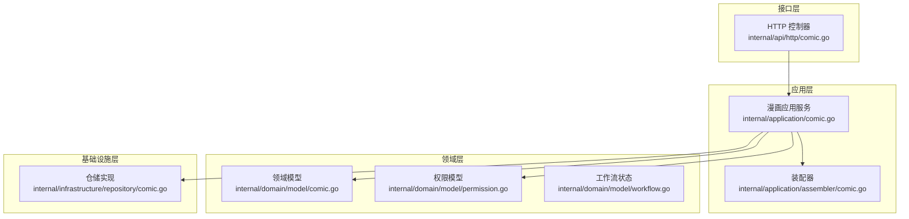
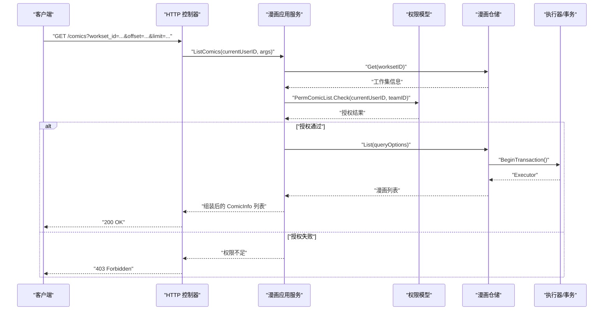
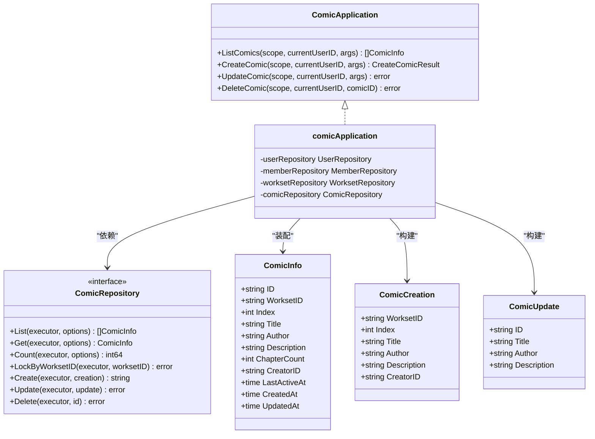
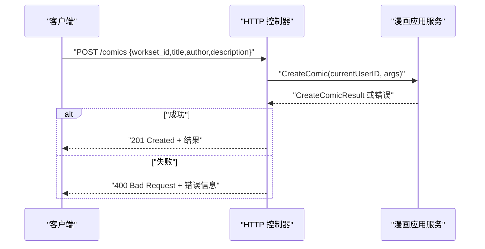
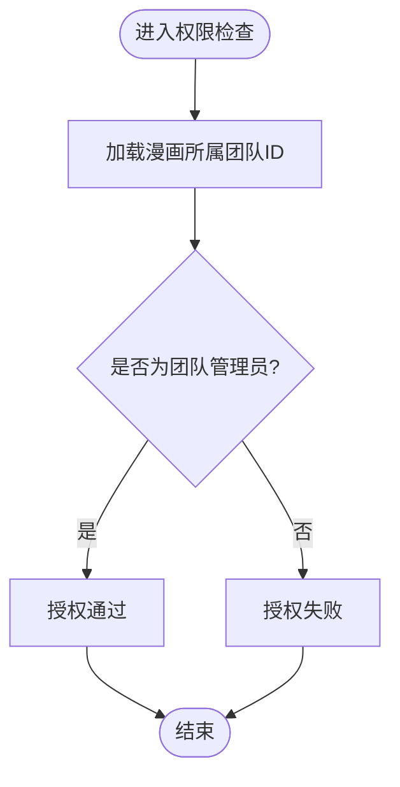
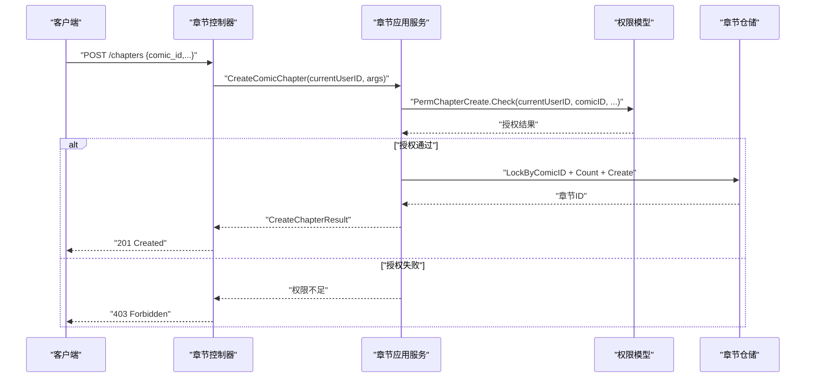
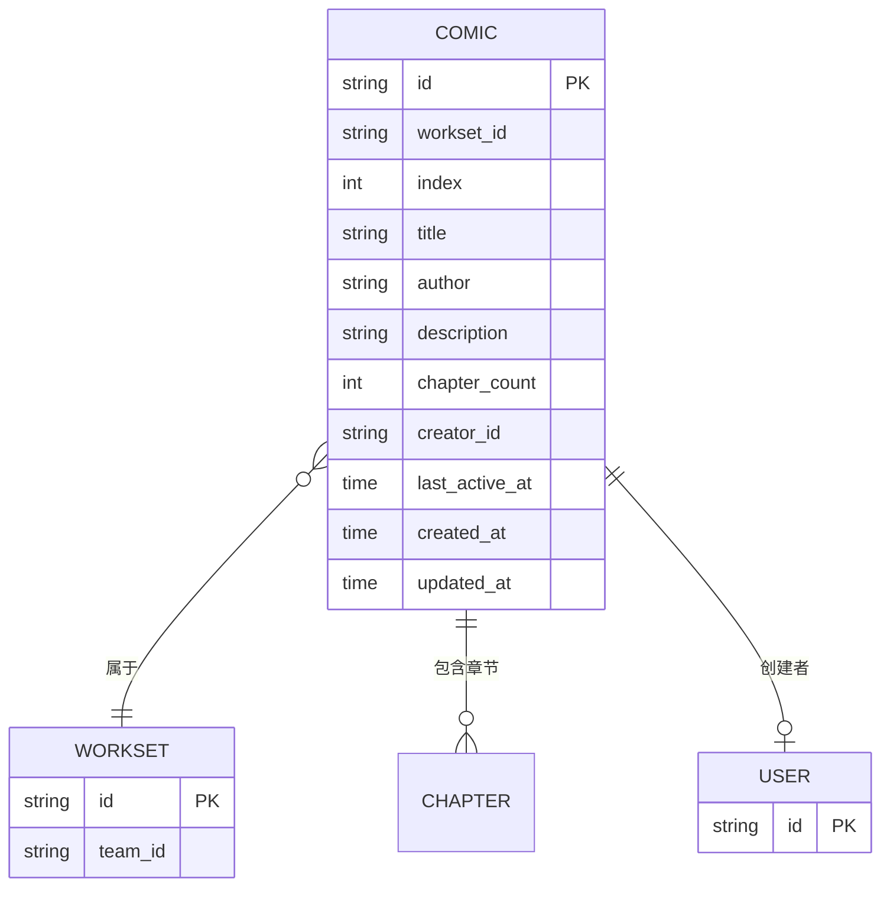
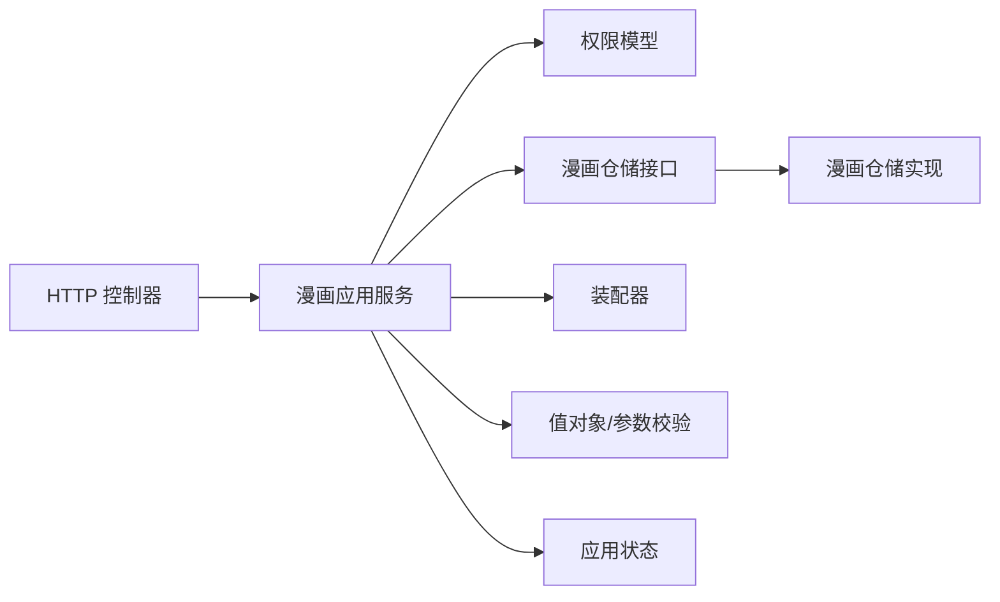

# 漫画应用服务

<cite>
**本文档引用的文件**
- [internal/application/comic.go](file://internal/application/comic.go)
- [internal/domain/model/comic.go](file://internal/domain/model/comic.go)
- [internal/domain/repository/comic.go](file://internal/domain/repository/comic.go)
- [internal/infrastructure/repository/comic.go](file://internal/infrastructure/repository/comic.go)
- [internal/application/assembler/comic.go](file://internal/application/assembler/comic.go)
- [internal/value/comic.go](file://internal/value/comic.go)
- [internal/domain/service/comic_include.go](file://internal/domain/service/comic_include.go)
- [internal/api/http/comic.go](file://internal/api/http/comic.go)
- [internal/domain/model/permission.go](file://internal/domain/model/permission.go)
- [internal/domain/model/workflow.go](file://internal/domain/model/workflow.go)
- [internal/application/chapter.go](file://internal/application/chapter.go)
- [internal/domain/model/chapter.go](file://internal/domain/model/chapter.go)
- [internal/infrastructure/repository/chapter.go](file://internal/infrastructure/repository/chapter.go)
- [internal/application/assembler/chapter.go](file://internal/application/assembler/chapter.go)
- [internal/state/app_state.go](file://internal/state/app_state.go)
- [internal/value/include.go](file://internal/value/include.go)
</cite>

## 目录
1. [简介](#简介)
2. [项目结构](#项目结构)
3. [核心组件](#核心组件)
4. [架构总览](#架构总览)
5. [详细组件分析](#详细组件分析)
6. [依赖关系分析](#依赖关系分析)
7. [性能考虑](#性能考虑)
8. [故障排查指南](#故障排查指南)
9. [结论](#结论)
10. [附录](#附录)

## 简介
本文件面向“漫画应用服务”，系统性阐述其架构设计与核心功能，重点覆盖漫画作品的全生命周期管理（创建、查询、更新、删除），以及与“章节应用服务”的协作机制。文档同时解释业务规则（如权限控制、索引顺序、软删除）与数据访问层的衔接方式，帮助开发者快速理解并正确使用漫画管理能力。

## 项目结构
漫画应用服务位于后端 Go 工程的分层结构中，遵循“接口-应用-领域-基础设施”分层模式：
- 接口层（HTTP）：暴露 REST API，解析请求参数并调用应用层服务。
- 应用层（Application）：编排业务流程，执行权限校验与事务控制，协调领域模型与数据访问层。
- 领域层（Domain）：定义实体、值对象、工作流状态与权限模型。
- 基础设施层（Infrastructure）：实现仓储接口，封装 SQL 查询与事务。

**图表来源**
- [internal/api/http/comic.go:25-52](file://internal/api/http/comic.go#L25-L52)
- [internal/application/comic.go:76-147](file://internal/application/comic.go#L76-L147)
- [internal/application/assembler/comic.go:8-34](file://internal/application/assembler/comic.go#L8-L34)
- [internal/domain/model/comic.go:5-58](file://internal/domain/model/comic.go#L5-L58)
- [internal/domain/model/permission.go:398-461](file://internal/domain/model/permission.go#L398-L461)
- [internal/domain/model/workflow.go:1-36](file://internal/domain/model/workflow.go#L1-L36)
- [internal/infrastructure/repository/comic.go:34-139](file://internal/infrastructure/repository/comic.go#L34-L139)

**章节来源**
- [internal/api/http/comic.go:1-189](file://internal/api/http/comic.go#L1-L189)
- [internal/application/comic.go:1-354](file://internal/application/comic.go#L1-L354)
- [internal/application/assembler/comic.go:1-35](file://internal/application/assembler/comic.go#L1-L35)
- [internal/domain/model/comic.go:1-107](file://internal/domain/model/comic.go#L1-L107)
- [internal/domain/model/permission.go:398-461](file://internal/domain/model/permission.go#L398-L461)
- [internal/domain/model/workflow.go:1-36](file://internal/domain/model/workflow.go#L1-L36)
- [internal/infrastructure/repository/comic.go:1-140](file://internal/infrastructure/repository/comic.go#L1-L140)

## 核心组件
- 漫画应用服务接口与实现：负责漫画列表查询、创建、更新、删除的业务编排与权限校验。
- 领域模型：定义漫画信息、创建与更新的数据结构。
- 数据访问层：提供仓储接口与具体实现，支持事务、加锁与分页查询。
- 装配器：将领域模型转换为对外值对象，处理时间戳等序列化细节。
- 权限模型：统一的权限检查入口，基于用户角色与团队关系判定。
- HTTP 接口：REST API 定义与参数解析，调用应用层并返回结果。

**章节来源**
- [internal/application/comic.go:19-40](file://internal/application/comic.go#L19-L40)
- [internal/domain/model/comic.go:5-107](file://internal/domain/model/comic.go#L5-L107)
- [internal/domain/repository/comic.go:5-14](file://internal/domain/repository/comic.go#L5-L14)
- [internal/infrastructure/repository/comic.go:14-139](file://internal/infrastructure/repository/comic.go#L14-L139)
- [internal/application/assembler/comic.go:8-34](file://internal/application/assembler/comic.go#L8-L34)
- [internal/domain/model/permission.go:398-461](file://internal/domain/model/permission.go#L398-L461)
- [internal/api/http/comic.go:25-189](file://internal/api/http/comic.go#L25-L189)

## 架构总览
漫画应用服务采用清晰的分层架构，接口层负责请求接入与响应封装；应用层承担业务编排与安全控制；领域层承载业务语义；基础设施层提供持久化能力。应用层通过适配器加载成员、漫画与工作集信息，结合权限模型完成细粒度授权；通过仓储接口与事务执行器保证一致性。

**图表来源**
- [internal/api/http/comic.go:25-52](file://internal/api/http/comic.go#L25-L52)
- [internal/application/comic.go:76-147](file://internal/application/comic.go#L76-L147)
- [internal/domain/model/permission.go:409-422](file://internal/domain/model/permission.go#L409-L422)
- [internal/infrastructure/repository/comic.go:34-54](file://internal/infrastructure/repository/comic.go#L34-L54)

## 详细组件分析

### 漫画应用服务（应用层）
- 职责边界
  - 列表查询：支持按工作集过滤、分页与关联包含（工作集、创建者）。
  - 创建漫画：基于工作集并发安全地计算索引，插入新记录。
  - 更新漫画：校验目标存在性与权限，更新标题、作者与描述。
  - 删除漫画：软删除，避免物理删除影响关联完整性。
- 权限控制
  - 列表：任意成员可见。
  - 创建：仅团队管理员可创建。
  - 更新/删除：基于漫画所属工作集的团队管理员权限。
- 事务与并发
  - 创建与更新均使用事务保障原子性。
  - 创建时对工作集内的漫画进行行级写锁，确保索引唯一性。
- 返回与装配
  - 使用装配器将领域模型转换为对外值对象，处理时间戳等序列化细节。

**图表来源**
- [internal/application/comic.go:19-74](file://internal/application/comic.go#L19-L74)
- [internal/domain/repository/comic.go:5-14](file://internal/domain/repository/comic.go#L5-L14)
- [internal/domain/model/comic.go:5-107](file://internal/domain/model/comic.go#L5-L107)

**章节来源**
- [internal/application/comic.go:76-353](file://internal/application/comic.go#L76-L353)
- [internal/domain/model/comic.go:5-107](file://internal/domain/model/comic.go#L5-L107)
- [internal/domain/repository/comic.go:5-14](file://internal/domain/repository/comic.go#L5-L14)

### HTTP 接口（REST API）
- 列表查询：GET /comics，支持 workset_id、offset、limit、includes[]。
- 创建漫画：POST /comics，请求体包含 workset_id、title、author、description。
- 更新漫画：PUT /comics/{comic_id}，请求体包含 comic_id 与更新字段。
- 删除漫画：DELETE /comics/{comic_id}。
- 参数校验与错误处理：接口层统一解析参数、校验格式并返回标准响应。

**图表来源**
- [internal/api/http/comic.go:67-95](file://internal/api/http/comic.go#L67-L95)
- [internal/application/comic.go:149-246](file://internal/application/comic.go#L149-L246)

**章节来源**
- [internal/api/http/comic.go:10-189](file://internal/api/http/comic.go#L10-L189)

### 权限模型与业务规则
- 权限检查
  - 列表：任意成员可见。
  - 创建：团队管理员。
  - 更新/删除：基于漫画所属工作集的团队管理员。
- 业务规则
  - 并发创建漫画时，通过数据库唯一约束与行级写锁保证索引唯一性。
  - 删除采用软删除，保留关联完整性。
  - includes 参数决定是否加载工作集与创建者信息，减少不必要的查询。

**图表来源**
- [internal/domain/model/permission.go:409-461](file://internal/domain/model/permission.go#L409-L461)

**章节来源**
- [internal/domain/model/permission.go:398-461](file://internal/domain/model/permission.go#L398-L461)
- [internal/application/comic.go:205-210](file://internal/application/comic.go#L205-L210)
- [internal/infrastructure/repository/comic.go:132-139](file://internal/infrastructure/repository/comic.go#L132-L139)

### 与章节应用服务的协作机制
- 协作点
  - 章节应用服务以漫画为单位组织章节，章节的创建、查询、更新、删除均需基于漫画 ID 进行权限校验。
  - 章节状态变更涉及多阶段工作流（上传、翻译、校对、排版、审核、发布），应用层根据状态变化自动维护时间戳。
- 数据一致性
  - 章节创建时同样使用行级写锁与事务，确保章节索引唯一性。
  - 章节统计字段（总单元数、已翻译单元数、已校对单元数）由应用层聚合更新。

**图表来源**
- [internal/application/chapter.go:82-165](file://internal/application/chapter.go#L82-L165)
- [internal/domain/model/permission.go:496-539](file://internal/domain/model/permission.go#L496-L539)
- [internal/infrastructure/repository/chapter.go:46-147](file://internal/infrastructure/repository/chapter.go#L46-L147)

**章节来源**
- [internal/application/chapter.go:20-80](file://internal/application/chapter.go#L20-L80)
- [internal/domain/model/chapter.go:126-260](file://internal/domain/model/chapter.go#L126-L260)
- [internal/infrastructure/repository/chapter.go:149-180](file://internal/infrastructure/repository/chapter.go#L149-L180)

### 数据模型与装配
- 领域模型
  - ComicInfo：漫画基本信息、索引、章节计数、创建者与时间戳。
  - ComicCreation/ComicUpdate：创建与更新的数据载体。
- 值对象与参数
  - ListComicArgs/CreateComicArgs/UpdateComicArgs：参数校验与分页。
  - includes[]：控制关联信息加载。
- 装配器
  - AssembleComicInfo：将领域模型转换为对外值对象，处理时间戳转换与可选关联。

**图表来源**
- [internal/domain/model/comic.go:5-58](file://internal/domain/model/comic.go#L5-L58)
- [internal/value/comic.go:30-124](file://internal/value/comic.go#L30-L124)
- [internal/application/assembler/comic.go:8-34](file://internal/application/assembler/comic.go#L8-L34)

**章节来源**
- [internal/domain/model/comic.go:5-107](file://internal/domain/model/comic.go#L5-L107)
- [internal/value/comic.go:8-124](file://internal/value/comic.go#L8-L124)
- [internal/application/assembler/comic.go:8-34](file://internal/application/assembler/comic.go#L8-L34)

## 依赖关系分析
- 应用层依赖
  - 用户仓储、成员仓储、工作集仓储、漫画仓储。
  - 权限模型与装配器。
- 领域层依赖
  - 领域模型与工作流状态常量。
- 基础设施层依赖
  - GORM 执行器与实体映射，提供事务、加锁与查询选项。
- 接口层依赖
  - 应用状态持有各应用服务实例，HTTP 控制器通过状态注入调用。

**图表来源**
- [internal/api/http/comic.go:25-52](file://internal/api/http/comic.go#L25-L52)
- [internal/application/comic.go:42-74](file://internal/application/comic.go#L42-L74)
- [internal/state/app_state.go:8-21](file://internal/state/app_state.go#L8-L21)

**章节来源**
- [internal/application/comic.go:42-74](file://internal/application/comic.go#L42-L74)
- [internal/state/app_state.go:23-49](file://internal/state/app_state.go#L23-L49)

## 性能考虑
- 查询优化
  - 列表查询支持 includes[] 按需加载关联信息，避免 N+1 查询。
  - 分页参数 offset/limit 控制结果规模。
- 并发与锁
  - 创建漫画时对工作集内漫画加行级写锁，确保索引唯一性。
  - 章节创建同样采用行级写锁与唯一约束，保证并发安全。
- 事务与回滚
  - 创建与更新均在事务中执行，异常时自动回滚，保证一致性。
- 时间戳与序列化
  - 装配器统一将时间转换为毫秒级 Unix 时间，便于前端处理。

[本节为通用性能建议，无需特定文件引用]

## 故障排查指南
- 常见错误与定位
  - 参数校验失败：检查请求体或查询参数格式与长度限制。
  - 权限不足：确认当前用户在目标团队/漫画上的角色是否满足要求。
  - 获取资源失败：确认资源 ID 是否存在且未被软删除。
  - 事务失败：关注日志中的开启/提交/回滚错误信息。
- 排查步骤
  - 查看接口层日志，确认请求参数解析是否成功。
  - 审视应用层日志，定位鉴权与仓储调用阶段。
  - 检查仓储实现的 SQL 生成与数据库约束冲突。
- 相关实现位置
  - 参数校验与错误返回：值对象与 HTTP 控制器。
  - 权限检查：权限模型。
  - 事务与加锁：应用层与仓储实现。

**章节来源**
- [internal/value/comic.go:37-123](file://internal/value/comic.go#L37-L123)
- [internal/api/http/comic.go:34-51](file://internal/api/http/comic.go#L34-L51)
- [internal/domain/model/permission.go:409-461](file://internal/domain/model/permission.go#L409-L461)
- [internal/application/comic.go:189-241](file://internal/application/comic.go#L189-L241)
- [internal/infrastructure/repository/comic.go:72-139](file://internal/infrastructure/repository/comic.go#L72-L139)

## 结论
漫画应用服务通过清晰的分层设计与严格的权限控制，提供了稳定可靠的漫画生命周期管理能力。配合章节应用服务，实现了从作品到章节的完整协作流程。应用层在事务、加锁与装配器的帮助下，兼顾了业务复杂性与性能需求。建议在扩展新功能时遵循现有分层与权限模型，确保一致性和可维护性。

[本节为总结性内容，无需特定文件引用]

## 附录

### 使用场景与最佳实践
- 增删改查
  - 列表：通过 includes[] 按需加载工作集与创建者，避免过度查询。
  - 创建：确保工作集 ID 有效且调用方具备团队管理员权限。
  - 更新：严格校验 ID 与请求体一致性，避免跨资源更新。
  - 删除：采用软删除策略，保留关联完整性。
- 状态变更
  - 章节状态变更遵循工作流规范，应用层自动维护各阶段时间戳。
- 权限控制
  - 严格基于团队管理员角色进行授权，避免越权操作。
- 最佳实践
  - 批量操作时复用事务执行器，减少连接开销。
  - 对高并发创建场景，依赖数据库唯一约束与行级锁，避免竞态条件。
  - 对外响应统一通过装配器转换，保持时间戳与字段命名一致性。

[本节为通用指导，无需特定文件引用]