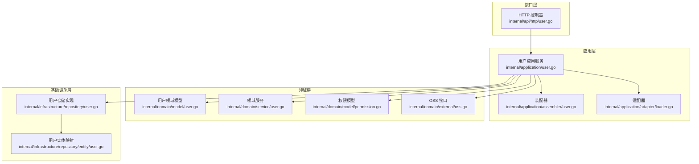
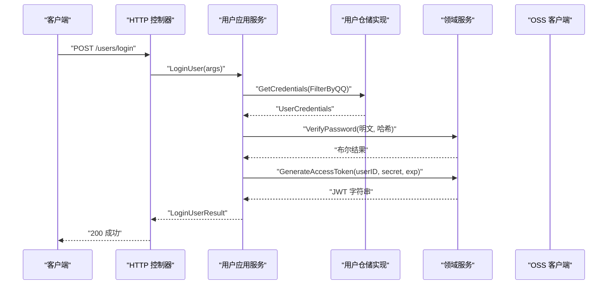
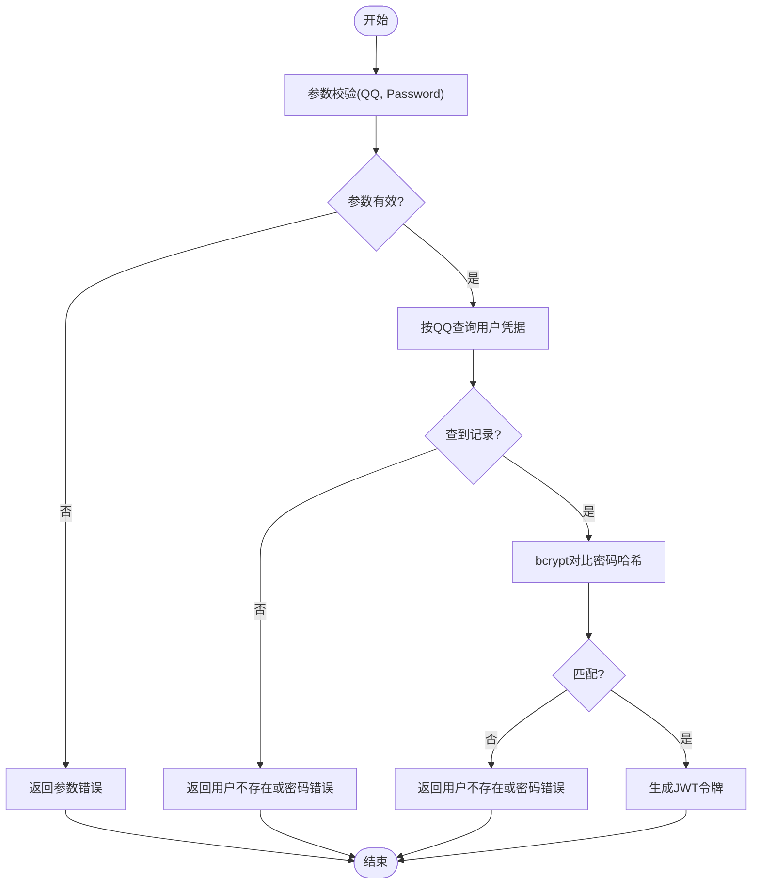
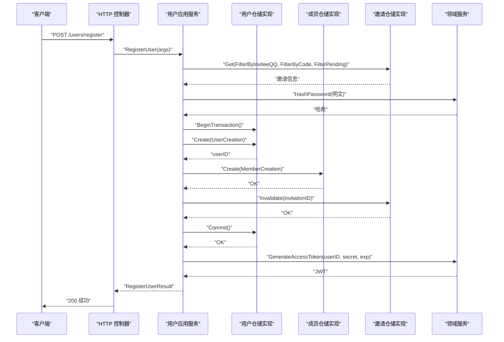
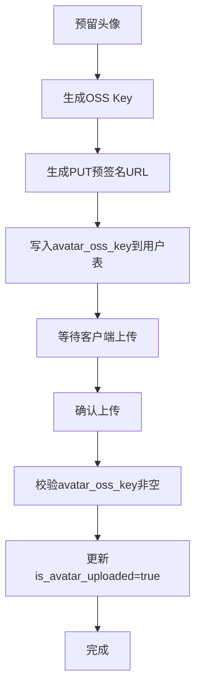
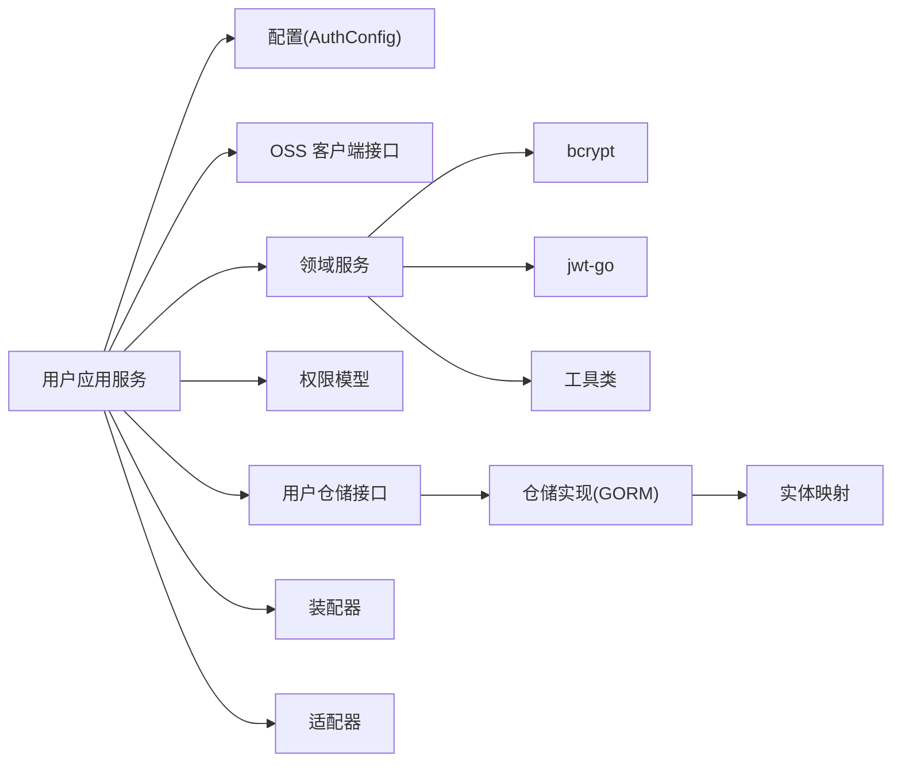

# 用户应用服务

<cite>
**本文档引用的文件**
- [internal/application/user.go](file://internal/application/user.go)
- [internal/domain/model/user.go](file://internal/domain/model/user.go)
- [internal/domain/repository/user.go](file://internal/domain/repository/user.go)
- [internal/api/http/user.go](file://internal/api/http/user.go)
- [internal/infrastructure/repository/user.go](file://internal/infrastructure/repository/user.go)
- [internal/domain/service/user.go](file://internal/domain/service/user.go)
- [internal/value/user.go](file://internal/value/user.go)
- [internal/application/assembler/user.go](file://internal/application/assembler/user.go)
- [internal/domain/external/oss.go](file://internal/domain/external/oss.go)
- [internal/domain/model/permission.go](file://internal/domain/model/permission.go)
- [internal/config/config.go](file://internal/config/config.go)
- [internal/infrastructure/repository/entity/user.go](file://internal/infrastructure/repository/entity/user.go)
- [internal/application/adapter/loader.go](file://internal/application/adapter/loader.go)
</cite>

## 目录
1. [简介](#简介)
2. [项目结构](#项目结构)
3. [核心组件](#核心组件)
4. [架构总览](#架构总览)
5. [详细组件分析](#详细组件分析)
6. [依赖关系分析](#依赖关系分析)
7. [性能考虑](#性能考虑)
8. [故障排除指南](#故障排除指南)
9. [结论](#结论)

## 简介
本文件面向“用户应用服务”，系统性阐述其在整体系统中的职责边界、核心功能与实现细节。用户应用服务负责：
- 用户登录认证（凭据校验、密码哈希比对、JWT 令牌签发）
- 用户注册（邀请码校验、密码哈希、事务化创建用户与成员、令牌签发）
- 用户信息管理（查看他人/我的信息、更新用户资料、删除用户）
- 头像上传流程（预留 OSS Key、生成预签名 URL、确认上传完成）

同时，文档详细解释业务规则落地方式：密码哈希策略、JWT 令牌生成与解析、权限验证机制；并梳理与仓储层、领域模型、外部 OSS 客户端的交互关系，给出参数验证、错误处理、事务管理的最佳实践路径。

## 项目结构
用户应用服务位于应用层，采用分层架构组织：
- 应用层：对外暴露用户相关接口，编排业务流程
- 领域层：定义用户模型、权限模型、领域服务（密码哈希、JWT、OSS Key 生成）
- 基础设施层：实现仓储接口，封装数据库访问与实体映射
- 接口层：HTTP 控制器绑定应用层接口，处理请求与响应

图表来源
- [internal/api/http/user.go:1-292](file://internal/api/http/user.go#L1-L292)
- [internal/application/user.go:1-594](file://internal/application/user.go#L1-L594)
- [internal/domain/model/user.go:1-100](file://internal/domain/model/user.go#L1-L100)
- [internal/domain/service/user.go:1-93](file://internal/domain/service/user.go#L1-L93)
- [internal/domain/model/permission.go:1-845](file://internal/domain/model/permission.go#L1-L845)
- [internal/domain/external/oss.go:1-9](file://internal/domain/external/oss.go#L1-L9)
- [internal/application/assembler/user.go:1-34](file://internal/application/assembler/user.go#L1-L34)
- [internal/application/adapter/loader.go:1-71](file://internal/application/adapter/loader.go#L1-L71)
- [internal/infrastructure/repository/user.go:1-150](file://internal/infrastructure/repository/user.go#L1-L150)
- [internal/infrastructure/repository/entity/user.go:1-58](file://internal/infrastructure/repository/entity/user.go#L1-L58)

章节来源
- [internal/application/user.go:1-594](file://internal/application/user.go#L1-L594)
- [internal/api/http/user.go:1-292](file://internal/api/http/user.go#L1-L292)

## 核心组件
- 用户应用服务接口：定义登录、注册、获取用户信息、更新用户、删除用户、头像预留与确认等能力
- 用户领域模型：UserInfo、UserCredentials、UserCreation、UserUpdate 等值对象
- 领域服务：密码哈希、JWT 令牌生成/解析、OSS Key 生成
- 权限模型：基于角色的权限检查（查看、更新、删除、列表等）
- 仓储接口与实现：抽象数据访问与具体 GORM 实现
- 装配器：将领域模型转换为应用层对外值对象，处理头像 URL 生成
- HTTP 控制器：路由到应用层接口，统一错误处理与响应包装

章节来源
- [internal/application/user.go:21-64](file://internal/application/user.go#L21-L64)
- [internal/domain/model/user.go:7-100](file://internal/domain/model/user.go#L7-L100)
- [internal/domain/service/user.go:15-93](file://internal/domain/service/user.go#L15-L93)
- [internal/domain/model/permission.go:255-300](file://internal/domain/model/permission.go#L255-L300)
- [internal/domain/repository/user.go:5-16](file://internal/domain/repository/user.go#L5-L16)
- [internal/infrastructure/repository/user.go:12-150](file://internal/infrastructure/repository/user.go#L12-L150)
- [internal/application/assembler/user.go:10-34](file://internal/application/assembler/user.go#L10-L34)
- [internal/api/http/user.go:22-292](file://internal/api/http/user.go#L22-L292)

## 架构总览
用户应用服务遵循整洁架构分层，应用层协调领域层与基础设施层，通过接口解耦，保证业务规则独立于技术实现。

图表来源
- [internal/api/http/user.go:22-49](file://internal/api/http/user.go#L22-L49)
- [internal/application/user.go:106-154](file://internal/application/user.go#L106-L154)
- [internal/infrastructure/repository/user.go:73-87](file://internal/infrastructure/repository/user.go#L73-L87)
- [internal/domain/service/user.go:15-41](file://internal/domain/service/user.go#L15-L41)

## 详细组件分析

### 登录认证流程
- 输入参数校验：QQ、密码均不能为空
- 凭据查询：按 QQ 查询用户凭据（仅含 ID 与密码哈希）
- 密码校验：使用 bcrypt 对比哈希
- 令牌签发：基于配置的密钥与过期时间生成 JWT
- 错误处理：参数非法、用户不存在或密码错误、令牌生成失败均返回明确错误

图表来源
- [internal/application/user.go:112-154](file://internal/application/user.go#L112-L154)
- [internal/infrastructure/repository/user.go:73-87](file://internal/infrastructure/repository/user.go#L73-L87)
- [internal/domain/service/user.go:70-84](file://internal/domain/service/user.go#L70-L84)

章节来源
- [internal/application/user.go:106-154](file://internal/application/user.go#L106-L154)
- [internal/domain/service/user.go:15-41](file://internal/domain/service/user.go#L15-L41)
- [internal/infrastructure/repository/user.go:73-87](file://internal/infrastructure/repository/user.go#L73-L87)

### 注册流程与事务管理
- 输入参数校验：QQ、密码、姓名、邀请码长度与格式校验
- 邀请码校验：按 QQ 与邀请码查询待使用邀请，支持多邀请场景
- 密码哈希：使用 bcrypt 生成哈希
- 事务化操作：创建用户、创建成员、标记邀请失效三步在一个事务内执行
- 令牌签发：注册成功后生成 JWT
- 错误处理：任一步失败均回滚事务并返回错误

图表来源
- [internal/api/http/user.go:22-49](file://internal/api/http/user.go#L22-L49)
- [internal/application/user.go:156-278](file://internal/application/user.go#L156-L278)
- [internal/domain/service/user.go:76-84](file://internal/domain/service/user.go#L76-L84)
- [internal/infrastructure/repository/user.go:89-106](file://internal/infrastructure/repository/user.go#L89-L106)

章节来源
- [internal/application/user.go:156-278](file://internal/application/user.go#L156-L278)
- [internal/domain/service/user.go:76-84](file://internal/domain/service/user.go#L76-L84)
- [internal/infrastructure/repository/user.go:89-106](file://internal/infrastructure/repository/user.go#L89-L106)

### 用户信息管理
- 查看他人信息：仅超级管理员可查看所有用户；普通用户仅可查看自己
- 查看我的信息：需提供当前用户 ID，权限校验同上
- 更新用户：支持修改姓名、QQ、密码（自动哈希），仅本人或超级管理员可更新
- 删除用户：仅超级管理员可删除，且不可删除自己
- 头像上传：预留 OSS Key 并生成预签名 PUT URL，确认上传完成后标记头像已上传

章节来源
- [internal/application/user.go:280-361](file://internal/application/user.go#L280-L361)
- [internal/application/user.go:470-519](file://internal/application/user.go#L470-L519)
- [internal/application/user.go:557-593](file://internal/application/user.go#L557-L593)
- [internal/application/user.go:426-468](file://internal/application/user.go#L426-L468)
- [internal/application/user.go:521-555](file://internal/application/user.go#L521-L555)

### 头像上传流程
- 预留头像：生成用户头像 OSS Key，生成预签名 PUT URL，写入用户表的 avatar_oss_key
- 确认上传：客户端上传完成后，调用确认接口，校验并标记 is_avatar_uploaded=true

图表来源
- [internal/application/user.go:426-468](file://internal/application/user.go#L426-L468)
- [internal/application/user.go:521-555](file://internal/application/user.go#L521-L555)
- [internal/domain/service/user.go:86-88](file://internal/domain/service/user.go#L86-L88)
- [internal/infrastructure/repository/user.go:108-127](file://internal/infrastructure/repository/user.go#L108-L127)

章节来源
- [internal/application/user.go:426-468](file://internal/application/user.go#L426-L468)
- [internal/application/user.go:521-555](file://internal/application/user.go#L521-L555)
- [internal/domain/service/user.go:86-88](file://internal/domain/service/user.go#L86-L88)
- [internal/infrastructure/repository/user.go:108-127](file://internal/infrastructure/repository/user.go#L108-L127)

### 权限验证机制
- 查看用户：普通用户仅可查看自己；超级管理员可查看所有
- 更新用户：本人可更新；超级管理员可更新任何人
- 删除用户：仅超级管理员可删除，且不可删除自己
- 权限检查通过适配器加载用户/成员信息并进行角色判断

章节来源
- [internal/domain/model/permission.go:255-300](file://internal/domain/model/permission.go#L255-L300)
- [internal/application/adapter/loader.go:10-14](file://internal/application/adapter/loader.go#L10-L14)
- [internal/application/user.go:294-301](file://internal/application/user.go#L294-L301)
- [internal/application/user.go:445-452](file://internal/application/user.go#L445-L452)
- [internal/application/user.go:572-580](file://internal/application/user.go#L572-L580)

### 数据模型与装配
- 领域模型：UserInfo、UserCredentials、UserCreation、UserUpdate
- 应用层值对象：UserInfo（含 AvatarURL）、LoginUserArgs/RegisterUserArgs/UpdateUserArgs
- 装配器：将 UserInfo 与 OSS 客户端结合，生成对外可用的头像 URL

章节来源
- [internal/domain/model/user.go:7-100](file://internal/domain/model/user.go#L7-L100)
- [internal/value/user.go:76-171](file://internal/value/user.go#L76-L171)
- [internal/application/assembler/user.go:10-34](file://internal/application/assembler/user.go#L10-L34)

### 与仓储层的交互
- 仓储接口：定义 List、Get、GetCredentials、Create、ReserveAvatar、ConfirmAvatarUploaded、Update、Delete 等
- 仓储实现：基于 GORM，封装查询构建、实体映射、软删除、事务执行
- 查询选项：通过过滤器组合构建复杂查询

章节来源
- [internal/domain/repository/user.go:5-16](file://internal/domain/repository/user.go#L5-L16)
- [internal/infrastructure/repository/user.go:32-149](file://internal/infrastructure/repository/user.go#L32-L149)
- [internal/infrastructure/repository/entity/user.go:11-58](file://internal/infrastructure/repository/entity/user.go#L11-L58)

## 依赖关系分析
- 应用层依赖：配置（JWT 密钥、过期时间）、外部 OSS 客户端、多个仓储接口
- 领域层依赖：Go 标准库、JWT 库、bcrypt 库
- 基础设施层依赖：GORM、数据库连接
- HTTP 层依赖：应用层接口、统一错误处理

图表来源
- [internal/application/user.go:66-104](file://internal/application/user.go#L66-L104)
- [internal/domain/service/user.go:15-93](file://internal/domain/service/user.go#L15-L93)
- [internal/infrastructure/repository/user.go:12-150](file://internal/infrastructure/repository/user.go#L12-L150)
- [internal/config/config.go:69-83](file://internal/config/config.go#L69-L83)

章节来源
- [internal/application/user.go:66-104](file://internal/application/user.go#L66-L104)
- [internal/domain/service/user.go:15-93](file://internal/domain/service/user.go#L15-L93)
- [internal/infrastructure/repository/user.go:12-150](file://internal/infrastructure/repository/user.go#L12-L150)
- [internal/config/config.go:69-83](file://internal/config/config.go#L69-L83)

## 性能考虑
- 密码哈希成本：bcrypt 默认成本较高，建议在高并发场景下评估 CPU 开销，必要时调整成本参数
- JWT 生成：HS256 签名开销较小，注意密钥安全存储与轮换
- 事务范围：注册流程将多步写入放入单事务，减少一致性风险，但需控制事务时长，避免锁竞争
- 查询优化：仓储实现统一添加 deleted_at IS NULL 过滤，避免全表扫描；建议在常用查询列建立索引
- 头像 URL 生成：装配器在加载头像 URL 失败时记录日志但不中断流程，降低对外部 OSS 的依赖影响

## 故障排除指南
- 登录失败
  - 症状：提示“用户不存在或密码错误”
  - 排查：确认 QQ 是否存在、密码是否正确（忽略真实差异以防止枚举攻击）、JWT 密钥是否配置
  - 参考路径：[internal/application/user.go:124-154](file://internal/application/user.go#L124-L154)，[internal/config/config.go:69-83](file://internal/config/config.go#L69-L83)
- 注册失败
  - 症状：提示“获取邀请信息失败”、“创建用户失败”、“生成访问令牌失败”
  - 排查：邀请码是否有效且未使用、密码哈希是否成功、事务是否正常提交
  - 参考路径：[internal/application/user.go:175-278](file://internal/application/user.go#L175-L278)
- 权限不足
  - 症状：提示“没有权限查看/更新/删除用户”
  - 排查：当前用户是否为超级管理员或满足目标用户权限要求
  - 参考路径：[internal/domain/model/permission.go:255-300](file://internal/domain/model/permission.go#L255-L300)
- 头像上传异常
  - 症状：预留失败、确认失败
  - 排查：OSS 客户端是否可用、预签名 URL 生成是否成功、确认时 avatar_oss_key 是否为空
  - 参考路径：[internal/application/user.go:426-468](file://internal/application/user.go#L426-L468)，[internal/application/user.go:521-555](file://internal/application/user.go#L521-L555)

章节来源
- [internal/application/user.go:124-154](file://internal/application/user.go#L124-L154)
- [internal/application/user.go:175-278](file://internal/application/user.go#L175-L278)
- [internal/domain/model/permission.go:255-300](file://internal/domain/model/permission.go#L255-L300)
- [internal/application/user.go:426-468](file://internal/application/user.go#L426-L468)
- [internal/application/user.go:521-555](file://internal/application/user.go#L521-L555)

## 结论
用户应用服务通过清晰的分层设计与严格的业务规则实现，提供了完整的用户生命周期管理能力。其在安全性方面采用 bcrypt 密码哈希、JWT 令牌签发与权限模型校验；在可靠性方面通过事务管理与错误处理保障数据一致性与用户体验。建议在生产环境中关注配置安全、性能调优与监控告警，持续优化用户体验与系统稳定性。