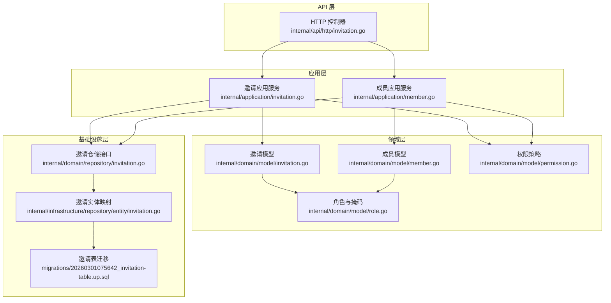
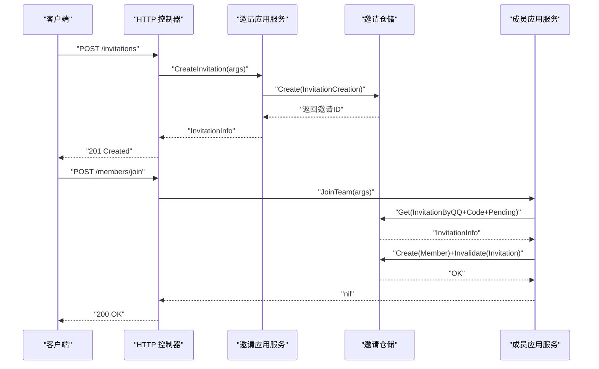
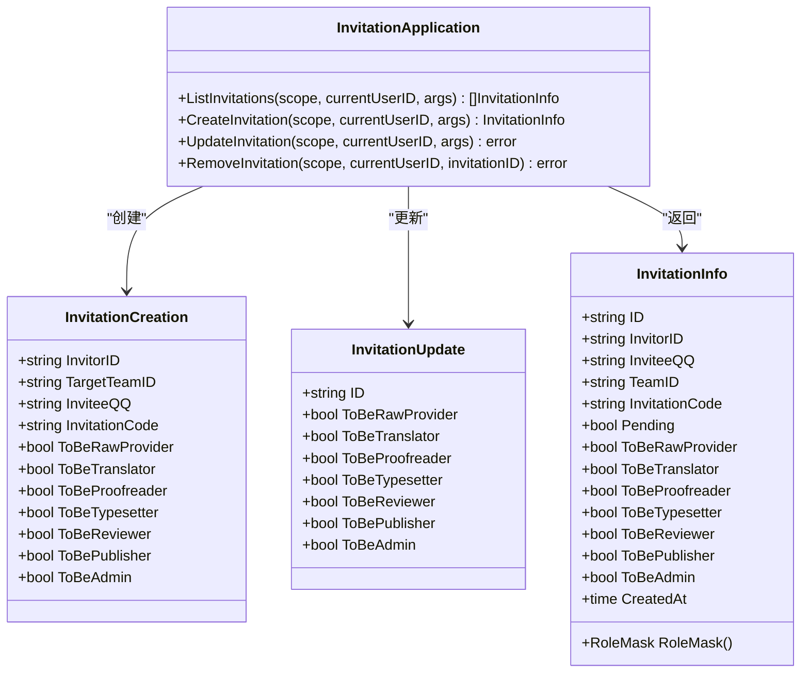
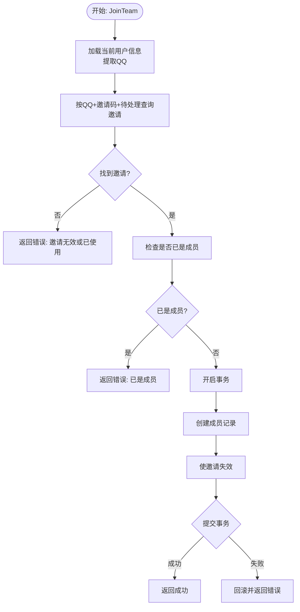
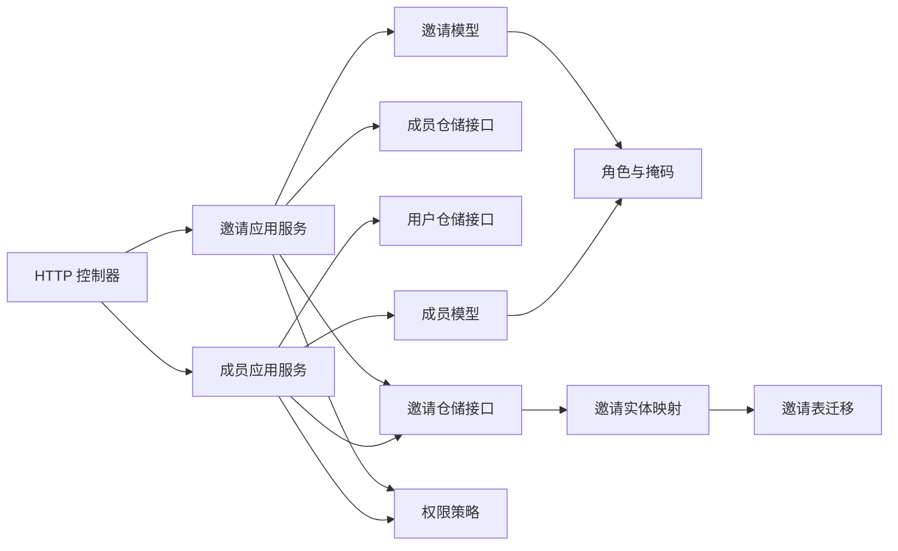

# 邀请成员应用服务

<cite>
**本文引用的文件**
- [internal/application/invitation.go](file://internal/application/invitation.go)
- [internal/domain/model/invitation.go](file://internal/domain/model/invitation.go)
- [internal/domain/repository/invitation.go](file://internal/domain/repository/invitation.go)
- [internal/api/http/invitation.go](file://internal/api/http/invitation.go)
- [internal/domain/service/invitation.go](file://internal/domain/service/invitation.go)
- [internal/application/member.go](file://internal/application/member.go)
- [internal/domain/model/member.go](file://internal/domain/model/member.go)
- [internal/infrastructure/repository/entity/invitation.go](file://internal/infrastructure/repository/entity/invitation.go)
- [internal/value/invitation.go](file://internal/value/invitation.go)
- [internal/domain/service/invitation_include.go](file://internal/domain/service/invitation_include.go)
- [internal/application/adapter/loader.go](file://internal/application/adapter/loader.go)
- [migrations/20260301075642_invitation-table.up.sql](file://migrations/20260301075642_invitation-table.up.sql)
- [internal/domain/model/permission.go](file://internal/domain/model/permission.go)
- [internal/domain/model/role.go](file://internal/domain/model/role.go)
- [internal/value/common.go](file://internal/value/common.go)
</cite>

## 目录
1. [引言](#引言)
2. [项目结构](#项目结构)
3. [核心组件](#核心组件)
4. [架构总览](#架构总览)
5. [详细组件分析](#详细组件分析)
6. [依赖分析](#依赖分析)
7. [性能考虑](#性能考虑)
8. [故障排查指南](#故障排查指南)
9. [结论](#结论)
10. [附录](#附录)

## 引言
本文件为“邀请成员应用服务”的技术文档，面向系统设计者、开发者与运维人员，全面阐述邀请成员应用服务的设计目标、核心功能与实现细节，覆盖邀请发送、邀请接受、成员加入的完整协作流程。文档重点说明邀请机制的安全保障（邀请码生成、状态管理、权限校验），以及邀请应用服务与成员应用服务的协同工作机制，并提供实际使用场景与关键实现要点的参考路径。

## 项目结构
邀请成员应用服务位于后端 Go 工程的分层架构中，遵循“HTTP 控制器 → 应用层 → 领域模型/服务 → 基础设施仓储”的分层组织方式。核心文件分布如下：
- 应用层：负责业务编排与权限校验，定义对外暴露的邀请操作接口
- 领域层：定义邀请与成员的数据模型、角色掩码与权限策略
- 基础设施层：提供邀请表实体映射与数据库访问能力
- API 层：提供 HTTP 接口，绑定应用层服务
- 迁移脚本：定义邀请表结构与索引

图表来源
- [internal/api/http/invitation.go:1-185](file://internal/api/http/invitation.go#L1-L185)
- [internal/application/invitation.go:1-304](file://internal/application/invitation.go#L1-L304)
- [internal/application/member.go:1-448](file://internal/application/member.go#L1-L448)
- [internal/domain/model/invitation.go:1-158](file://internal/domain/model/invitation.go#L1-L158)
- [internal/domain/model/member.go:1-205](file://internal/domain/model/member.go#L1-L205)
- [internal/domain/model/role.go:1-56](file://internal/domain/model/role.go#L1-L56)
- [internal/domain/model/permission.go:1-845](file://internal/domain/model/permission.go#L1-L845)
- [internal/domain/repository/invitation.go:1-14](file://internal/domain/repository/invitation.go#L1-L14)
- [internal/infrastructure/repository/entity/invitation.go:1-98](file://internal/infrastructure/repository/entity/invitation.go#L1-L98)
- [migrations/20260301075642_invitation-table.up.sql:1-27](file://migrations/20260301075642_invitation-table.up.sql#L1-L27)

章节来源
- [internal/api/http/invitation.go:1-185](file://internal/api/http/invitation.go#L1-L185)
- [internal/application/invitation.go:1-304](file://internal/application/invitation.go#L1-L304)
- [internal/application/member.go:1-448](file://internal/application/member.go#L1-L448)
- [internal/domain/model/invitation.go:1-158](file://internal/domain/model/invitation.go#L1-L158)
- [internal/domain/model/member.go:1-205](file://internal/domain/model/member.go#L1-L205)
- [internal/domain/model/role.go:1-56](file://internal/domain/model/role.go#L1-L56)
- [internal/domain/model/permission.go:1-845](file://internal/domain/model/permission.go#L1-L845)
- [internal/domain/repository/invitation.go:1-14](file://internal/domain/repository/invitation.go#L1-L14)
- [internal/infrastructure/repository/entity/invitation.go:1-98](file://internal/infrastructure/repository/entity/invitation.go#L1-L98)
- [migrations/20260301075642_invitation-table.up.sql:1-27](file://migrations/20260301075642_invitation-table.up.sql#L1-L27)

## 核心组件
- HTTP 控制器：提供邀请列表查询、创建邀请、更新邀请、删除邀请的 REST 接口，负责参数解析、鉴权上下文提取与响应封装。
- 邀请应用服务：实现邀请生命周期管理，包括创建邀请（含邀请码生成）、更新邀请、删除邀请、列出邀请；内置权限校验与参数校验。
- 成员应用服务：实现成员加入流程，基于邀请码与当前用户 QQ 定位待消耗邀请，在事务中创建成员并使邀请失效。
- 领域模型与服务：定义邀请/成员数据结构、角色掩码、权限策略；提供邀请码生成服务。
- 基础设施仓储：定义邀请仓储接口与实体映射，支持邀请列表、详情、创建、更新、失效与删除；迁移脚本定义邀请表结构与索引。
- 值对象与分页：定义邀请相关请求/响应值对象与分页参数校验。

章节来源
- [internal/api/http/invitation.go:1-185](file://internal/api/http/invitation.go#L1-L185)
- [internal/application/invitation.go:19-40](file://internal/application/invitation.go#L19-L40)
- [internal/application/member.go:20-51](file://internal/application/member.go#L20-L51)
- [internal/domain/model/invitation.go:7-158](file://internal/domain/model/invitation.go#L7-L158)
- [internal/domain/model/member.go:7-205](file://internal/domain/model/member.go#L7-L205)
- [internal/domain/service/invitation.go:1-16](file://internal/domain/service/invitation.go#L1-L16)
- [internal/domain/repository/invitation.go:5-13](file://internal/domain/repository/invitation.go#L5-L13)
- [internal/infrastructure/repository/entity/invitation.go:9-98](file://internal/infrastructure/repository/entity/invitation.go#L9-L98)
- [internal/value/invitation.go:9-93](file://internal/value/invitation.go#L9-L93)
- [internal/value/common.go:5-24](file://internal/value/common.go#L5-L24)

## 架构总览
邀请成员应用服务采用清晰的分层架构，HTTP 层负责请求接入与响应封装，应用层负责业务编排与权限校验，领域层承载数据模型与业务规则，基础设施层提供持久化与实体映射。邀请与成员两大应用服务协同完成“邀请发送—邀请接受—成员加入”的闭环。

图表来源
- [internal/api/http/invitation.go:68-97](file://internal/api/http/invitation.go#L68-L97)
- [internal/application/invitation.go:133-213](file://internal/application/invitation.go#L133-L213)
- [internal/application/member.go:340-447](file://internal/application/member.go#L340-L447)
- [internal/domain/repository/invitation.go:5-13](file://internal/domain/repository/invitation.go#L5-L13)

## 详细组件分析

### 组件一：邀请应用服务（邀请发送）
- 职责
  - 列出团队邀请：鉴权校验（仅管理员）、支持 includes（如包含邀请人信息）、分页与排序。
  - 创建邀请：鉴权校验（仅管理员）、参数校验（被邀请人 QQ、角色掩码）、去重检查（同一 QQ 已为成员则拒绝）、生成唯一邀请码、创建邀请记录。
  - 更新邀请：鉴权校验（仅管理员）、参数校验（邀请 ID、团队 ID、角色掩码）。
  - 删除邀请：鉴权校验（仅管理员）、读取邀请并校验归属团队。
- 安全与可靠性
  - 权限校验：通过权限策略统一判定管理员身份。
  - 参数校验：请求参数与分页参数均进行严格校验。
  - 去重保护：创建前检查目标 QQ 是否已是成员，避免重复邀请。
  - 邀请码生成：使用 UUID v7 并截取末尾片段，保证短码唯一性与不可预测性。
- 数据模型
  - 邀请创建/更新模型与邀请信息模型，包含角色掩码与待分配角色标记。
- 协作关系
  - 依赖成员仓储加载成员信息以执行权限校验。
  - 依赖邀请仓储进行 CRUD 操作。

图表来源
- [internal/application/invitation.go:19-69](file://internal/application/invitation.go#L19-L69)
- [internal/domain/model/invitation.go:7-158](file://internal/domain/model/invitation.go#L7-L158)

章节来源
- [internal/application/invitation.go:71-131](file://internal/application/invitation.go#L71-L131)
- [internal/application/invitation.go:133-213](file://internal/application/invitation.go#L133-L213)
- [internal/application/invitation.go:215-259](file://internal/application/invitation.go#L215-L259)
- [internal/application/invitation.go:261-303](file://internal/application/invitation.go#L261-L303)
- [internal/domain/model/invitation.go:7-158](file://internal/domain/model/invitation.go#L7-L158)
- [internal/domain/service/invitation.go:5-15](file://internal/domain/service/invitation.go#L5-L15)
- [internal/application/adapter/loader.go:16-24](file://internal/application/adapter/loader.go#L16-L24)

### 组件二：成员应用服务（邀请接受与成员加入）
- 职责
  - 加入团队：根据当前用户 QQ 与邀请码定位待消耗邀请，校验是否已是成员，事务内创建成员并使邀请失效。
- 安全与可靠性
  - 事务一致性：成员创建与邀请失效在单事务中完成，保证原子性。
  - 邀请状态约束：仅允许消耗“待处理”邀请，避免重复使用。
  - 用户身份绑定：通过当前用户信息提取 QQ，防止跨用户冒用。
- 数据模型
  - 成员创建模型与成员信息模型，包含角色分配时间戳与角色集合。

图表来源
- [internal/application/member.go:340-447](file://internal/application/member.go#L340-L447)
- [internal/domain/repository/invitation.go:5-13](file://internal/domain/repository/invitation.go#L5-L13)

章节来源
- [internal/application/member.go:340-447](file://internal/application/member.go#L340-L447)
- [internal/domain/model/member.go:7-205](file://internal/domain/model/member.go#L7-L205)

### 组件三：HTTP 接口与值对象
- HTTP 控制器
  - GET /invitations：列表查询，支持 includes 与分页。
  - POST /invitations：创建邀请。
  - PUT /invitations/{invitation_id}：更新邀请。
  - DELETE /invitations/{invitation_id}：删除邀请。
- 值对象
  - 列表参数：团队 ID、includes、分页参数。
  - 创建参数：团队 ID、被邀请人 QQ、角色掩码。
  - 更新参数：邀请 ID、团队 ID、角色掩码。
  - 响应值对象：包含邀请 ID、邀请人/被邀请人信息、邀请码、状态与创建时间。

章节来源
- [internal/api/http/invitation.go:10-185](file://internal/api/http/invitation.go#L10-L185)
- [internal/value/invitation.go:9-93](file://internal/value/invitation.go#L9-L93)
- [internal/value/common.go:5-24](file://internal/value/common.go#L5-L24)

### 组件四：权限与角色模型
- 权限策略
  - 邀请列表/创建/更新/删除：仅管理员可操作。
- 角色与掩码
  - 定义角色标志与掩码，支持角色集合的打包与解包。

章节来源
- [internal/domain/model/permission.go:200-246](file://internal/domain/model/permission.go#L200-L246)
- [internal/domain/model/role.go:9-56](file://internal/domain/model/role.go#L9-L56)

### 组件五：邀请表结构与实体映射
- 表结构
  - 包含邀请主键、邀请人、团队、被邀请人 QQ、唯一邀请码、待分配角色布尔位、待处理状态、时间戳。
  - 索引：按团队与创建时间降序，仅包含已失效记录（便于统计与清理）。
- 实体映射
  - 列名与模型字段映射，支持包含邀请人信息的查询结果组装。

章节来源
- [migrations/20260301075642_invitation-table.up.sql:1-27](file://migrations/20260301075642_invitation-table.up.sql#L1-L27)
- [internal/infrastructure/repository/entity/invitation.go:9-98](file://internal/infrastructure/repository/entity/invitation.go#L9-L98)

## 依赖分析
- 应用层依赖
  - 邀请应用服务依赖成员仓储与邀请仓储，用于权限校验与数据持久化。
  - 成员应用服务依赖用户仓储、成员仓储与邀请仓储，用于用户信息、成员状态与邀请状态的读取与更新。
- 领域层依赖
  - 邀请/成员模型依赖角色掩码与权限策略，形成稳定的业务规则边界。
- 基础设施层依赖
  - 邀请仓储接口与实体映射分离，便于替换存储实现。
- 外部依赖
  - 邀请码生成依赖 UUID v7 库，确保唯一性与高熵。

图表来源
- [internal/api/http/invitation.go:1-185](file://internal/api/http/invitation.go#L1-L185)
- [internal/application/invitation.go:19-69](file://internal/application/invitation.go#L19-L69)
- [internal/application/member.go:53-82](file://internal/application/member.go#L53-L82)
- [internal/domain/model/invitation.go:7-158](file://internal/domain/model/invitation.go#L7-L158)
- [internal/domain/model/member.go:7-205](file://internal/domain/model/member.go#L7-L205)
- [internal/domain/model/role.go:1-56](file://internal/domain/model/role.go#L1-L56)
- [internal/domain/model/permission.go:1-845](file://internal/domain/model/permission.go#L1-L845)
- [internal/domain/repository/invitation.go:5-13](file://internal/domain/repository/invitation.go#L5-L13)
- [internal/infrastructure/repository/entity/invitation.go:9-98](file://internal/infrastructure/repository/entity/invitation.go#L9-L98)
- [migrations/20260301075642_invitation-table.up.sql:1-27](file://migrations/20260301075642_invitation-table.up.sql#L1-L27)

章节来源
- [internal/application/invitation.go:19-69](file://internal/application/invitation.go#L19-L69)
- [internal/application/member.go:53-82](file://internal/application/member.go#L53-L82)
- [internal/domain/repository/invitation.go:5-13](file://internal/domain/repository/invitation.go#L5-L13)

## 性能考虑
- 查询优化
  - 邀请列表按团队与创建时间降序索引，支持高效分页与筛选。
  - 支持 includes 选项按需加载邀请人信息，减少不必要的关联查询。
- 写入优化
  - 邀请创建采用单条插入，避免复杂事务开销；更新邀请采用乐观更新策略。
- 事务边界
  - 成员加入采用最小事务范围，仅包含成员创建与邀请失效，降低锁竞争与回滚风险。
- 邀请码生成
  - 使用 UUID v7 截断生成短码，兼顾唯一性与长度可控，减少存储与传输成本。

## 故障排查指南
- 权限相关
  - 若提示“没有权限”，确认当前用户在目标团队是否具备管理员角色。
- 参数相关
  - 若提示“参数错误”，检查团队 ID、邀请码、角色掩码与分页参数是否符合要求。
- 邀请状态相关
  - 若提示“邀请无效或已被使用”，确认邀请是否仍处于“待处理”状态且未被他人使用。
- 事务相关
  - 若加入失败，检查事务提交阶段日志，确认成员创建与邀请失效是否同时成功。
- 数据一致性
  - 若出现重复成员，检查成员去重逻辑与事务隔离级别。

章节来源
- [internal/application/invitation.go:78-81](file://internal/application/invitation.go#L78-L81)
- [internal/application/invitation.go:154-161](file://internal/application/invitation.go#L154-L161)
- [internal/application/member.go:370-385](file://internal/application/member.go#L370-L385)
- [internal/application/member.go:402-444](file://internal/application/member.go#L402-L444)

## 结论
邀请成员应用服务通过清晰的分层设计与严格的权限校验，实现了从邀请发送到成员加入的完整闭环。邀请码生成、状态管理与事务一致性共同保障了邀请机制的安全与可靠；邀请应用服务与成员应用服务的职责分离与协作，进一步提升了系统的可维护性与可扩展性。结合迁移脚本与实体映射，系统在数据层面也具备良好的演进能力。

## 附录
- 实际使用场景与关键实现要点
  - 邀请流程设计：管理员创建邀请 → 被邀请人收到邀请码 → 被邀请人登录系统并使用邀请码加入 → 系统在事务中创建成员并使邀请失效。
  - 权限验证：所有邀请操作均需管理员身份；成员加入时需与当前用户 QQ 匹配。
  - 状态同步：邀请创建后进入“待处理”状态；成员加入后邀请变为“已使用/失效”。