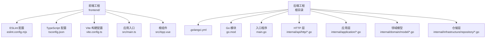
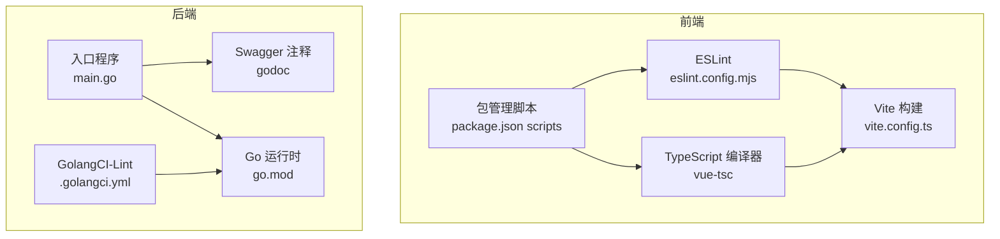
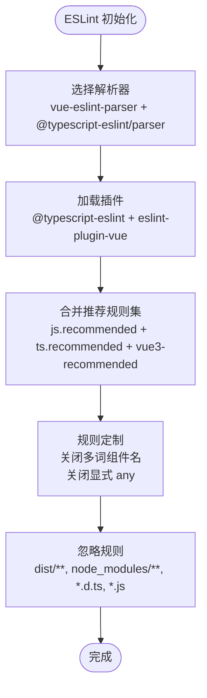
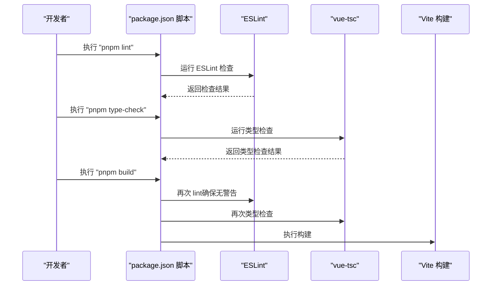
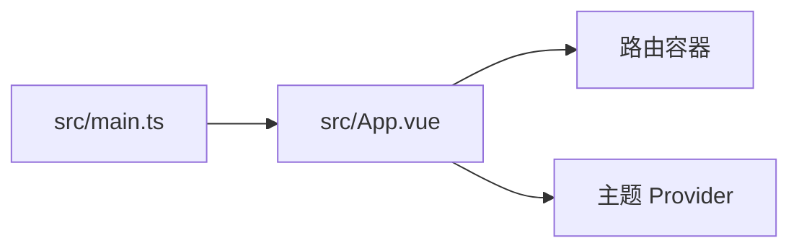
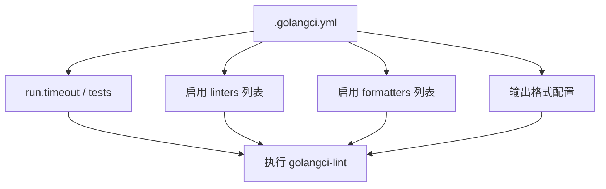
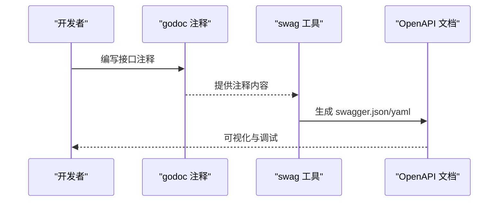
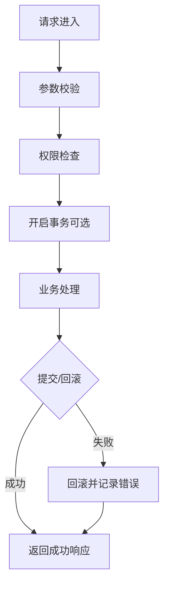
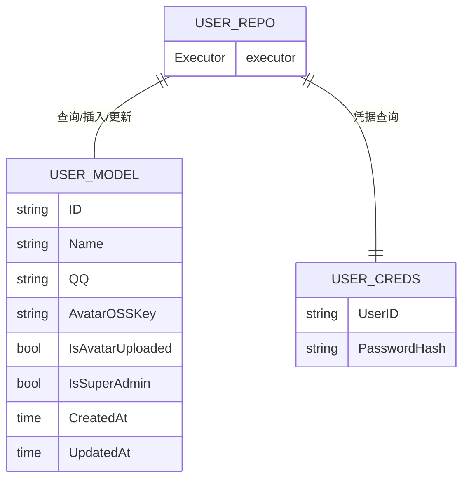
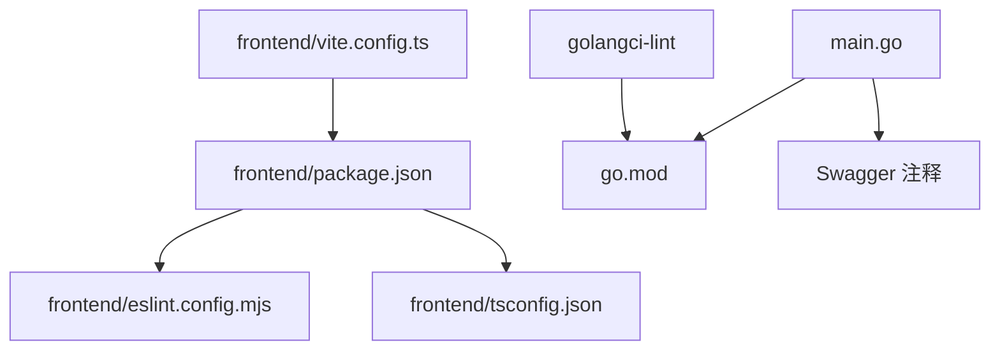

# 代码质量工具

<cite>
**本文引用的文件**
- [.golangci.yml](file://.golangci.yml)
- [frontend/package.json](file://frontend/package.json)
- [frontend/eslint.config.mjs](file://frontend/eslint.config.mjs)
- [frontend/tsconfig.json](file://frontend/tsconfig.json)
- [frontend/vite.config.ts](file://frontend/vite.config.ts)
- [frontend/src/main.ts](file://frontend/src/main.ts)
- [frontend/src/App.vue](file://frontend/src/App.vue)
- [go.mod](file://go.mod)
- [main.go](file://main.go)
- [docs/docs-comment-format.md](file://docs/docs-comment-format.md)
- [docs/docs.go](file://docs/docs.go)
- [internal/api/http/auth.go](file://internal/api/http/auth.go)
- [internal/api/http/team.go](file://internal/api/http/team.go)
- [internal/application/user.go](file://internal/application/user.go)
- [internal/domain/model/user.go](file://internal/domain/model/user.go)
- [internal/infrastructure/repository/user.go](file://internal/infrastructure/repository/user.go)
</cite>

## 目录
1. [简介](#简介)
2. [项目结构](#项目结构)
3. [核心组件](#核心组件)
4. [架构总览](#架构总览)
5. [详细组件分析](#详细组件分析)
6. [依赖关系分析](#依赖关系分析)
7. [性能考量](#性能考量)
8. [故障排查指南](#故障排查指南)
9. [结论](#结论)
10. [附录](#附录)

## 简介
本指南面向前端与后端团队，系统性讲解如何在本仓库中落地代码质量工具链，覆盖以下要点：
- 前端 ESLint 配置与规则：TypeScript 类型检查、Vue 单文件组件校验、代码风格规范
- Go 后端 GolangCI-Lint 配置：静态分析、代码格式化、复杂度检查等
- 代码质量检查流程：本地预检、CI 集成与自动化检查机制
- 代码规范最佳实践：命名约定、注释标准、错误处理模式
- IDE 集成与实时反馈：如何在编辑器中获得即时质量提示
- 常见问题与修复建议：如何定位与解决典型代码质量问题

## 项目结构
本仓库采用前后端分离的模块化组织方式：
- 前端位于 frontend 目录，基于 Vite + Vue 3 + TypeScript，使用 ESLint 与 TypeScript 编译器进行类型与风格检查
- 后端位于项目根目录，基于 Go 1.25，使用 GolangCI-Lint 进行静态分析与格式化，Swagger 文档通过注释自动生成

图表来源
- [frontend/eslint.config.mjs:1-40](file://frontend/eslint.config.mjs#L1-L40)
- [frontend/tsconfig.json:1-12](file://frontend/tsconfig.json#L1-L12)
- [frontend/vite.config.ts:1-20](file://frontend/vite.config.ts#L1-L20)
- [frontend/src/main.ts:1-26](file://frontend/src/main.ts#L1-L26)
- [frontend/src/App.vue:1-45](file://frontend/src/App.vue#L1-L45)
- [.golangci.yml:1-31](file://.golangci.yml#L1-L31)
- [go.mod:1-113](file://go.mod#L1-L113)
- [main.go:1-146](file://main.go#L1-L146)
- [internal/api/http/auth.go:1-73](file://internal/api/http/auth.go#L1-L73)
- [internal/application/user.go:1-594](file://internal/application/user.go#L1-L594)
- [internal/domain/model/user.go:1-100](file://internal/domain/model/user.go#L1-L100)
- [internal/infrastructure/repository/user.go:1-150](file://internal/infrastructure/repository/user.go#L1-L150)

章节来源
- [frontend/package.json:1-36](file://frontend/package.json#L1-L36)
- [frontend/eslint.config.mjs:1-40](file://frontend/eslint.config.mjs#L1-L40)
- [frontend/tsconfig.json:1-12](file://frontend/tsconfig.json#L1-L12)
- [frontend/vite.config.ts:1-20](file://frontend/vite.config.ts#L1-L20)
- [frontend/src/main.ts:1-26](file://frontend/src/main.ts#L1-L26)
- [frontend/src/App.vue:1-45](file://frontend/src/App.vue#L1-L45)
- [.golangci.yml:1-31](file://.golangci.yml#L1-L31)
- [go.mod:1-113](file://go.mod#L1-L113)
- [main.go:1-146](file://main.go#L1-L146)

## 核心组件
- 前端质量工具链
  - ESLint：统一解析器与插件，启用推荐规则，关闭部分 Vue 组件名强制多词规则与显式 any 规则
  - TypeScript：通过 vue-tsc 进行类型检查，配合 tsconfig 多引用配置
  - Vite：注册 Vue 插件与路径别名，保证开发体验与构建一致性
  - 包脚本：提供 dev、lint、type-check、build、preview 等标准化命令
- 后端质量工具链
  - GolangCI-Lint：启用 vet、staticcheck、errcheck、ineffassign、unused、gosec、gocritic、misspell 等 linters；启用 gofmt 与 goimports 格式化器；限制最大相同问题数
  - Swagger 注释：通过 godoc 注解生成 OpenAPI 文档，要求严格遵循注释格式

章节来源
- [frontend/package.json:6-12](file://frontend/package.json#L6-L12)
- [frontend/eslint.config.mjs:7-40](file://frontend/eslint.config.mjs#L7-L40)
- [frontend/tsconfig.json:1-12](file://frontend/tsconfig.json#L1-L12)
- [frontend/vite.config.ts:12-19](file://frontend/vite.config.ts#L12-L19)
- [.golangci.yml:3-31](file://.golangci.yml#L3-L31)
- [docs/docs-comment-format.md:1-29](file://docs/docs-comment-format.md#L1-L29)

## 架构总览
下图展示了前后端代码质量工具在项目中的位置与交互关系。

图表来源
- [frontend/eslint.config.mjs:1-40](file://frontend/eslint.config.mjs#L1-L40)
- [frontend/package.json:6-12](file://frontend/package.json#L6-L12)
- [frontend/vite.config.ts:1-20](file://frontend/vite.config.ts#L1-L20)
- [.golangci.yml:1-31](file://.golangci.yml#L1-L31)
- [go.mod:1-113](file://go.mod#L1-L113)
- [main.go:1-146](file://main.go#L1-L146)
- [docs/docs-comment-format.md:1-29](file://docs/docs-comment-format.md#L1-L29)

## 详细组件分析

### 前端：ESLint 配置与规则
- 解析器与插件
  - 使用 @typescript-eslint/parser 与 vue-eslint-parser，统一解析 TypeScript 与 Vue 单文件组件
  - 启用 @typescript-eslint/eslint-plugin 与 eslint-plugin-vue 的推荐规则集
- 全局环境
  - 定义浏览器全局只读变量，避免误报
- 规则定制
  - 关闭 Vue 组件名必须为多词的规则，降低迁移成本
  - 关闭显式 any 规则，鼓励更严格的类型约束但允许过渡期存在
- 忽略规则
  - 忽略 dist、node_modules、.d.ts 与 .js 文件，聚焦源码质量

图表来源
- [frontend/eslint.config.mjs:10-39](file://frontend/eslint.config.mjs#L10-L39)

章节来源
- [frontend/eslint.config.mjs:1-40](file://frontend/eslint.config.mjs#L1-L40)

### 前端：TypeScript 与类型检查
- 多引用 tsconfig
  - 通过 references 将 app 与 node 环境分开管理，提升类型检查效率与准确性
- 类型检查脚本
  - 通过 vue-tsc 在构建前进行类型检查，避免运行时类型错误

图表来源
- [frontend/package.json:6-12](file://frontend/package.json#L6-L12)
- [frontend/tsconfig.json:1-12](file://frontend/tsconfig.json#L1-L12)

章节来源
- [frontend/package.json:6-12](file://frontend/package.json#L6-L12)
- [frontend/tsconfig.json:1-12](file://frontend/tsconfig.json#L1-L12)

### 前端：Vue 组件与入口
- 入口文件负责初始化应用、路由、状态管理与 UI 组件库
- 根组件提供主题 Provider 与路由容器，便于统一主题与布局

图表来源
- [frontend/src/main.ts:1-26](file://frontend/src/main.ts#L1-L26)
- [frontend/src/App.vue:1-45](file://frontend/src/App.vue#L1-L45)

章节来源
- [frontend/src/main.ts:1-26](file://frontend/src/main.ts#L1-L26)
- [frontend/src/App.vue:1-45](file://frontend/src/App.vue#L1-L45)

### 后端：GolangCI-Lint 配置
- 运行参数
  - 超时时间、是否包含测试文件
- 启用的 Linters
  - vet、staticcheck、errcheck、ineffassign、unused、gosec、gocritic、misspell
- 格式化器
  - gofmt、goimports
- 输出
  - 彩色带行号输出，便于 IDE 识别

图表来源
- [.golangci.yml:3-31](file://.golangci.yml#L3-L31)

章节来源
- [.golangci.yml:1-31](file://.golangci.yml#L1-L31)

### 后端：Swagger 注释与文档生成
- 注释格式
  - 严格遵循 godoc 注释模板，包含 Summary、Description、Tags、Accept、Produce、Params、Success、Router 等字段
- 文档生成
  - 通过 swag 命令从注释生成 OpenAPI 文档，确保接口文档与实现一致

图表来源
- [docs/docs-comment-format.md:1-29](file://docs/docs-comment-format.md#L1-L29)
- [docs/docs.go:1-800](file://docs/docs.go#L1-L800)
- [internal/api/http/auth.go:10-22](file://internal/api/http/auth.go#L10-L22)
- [internal/api/http/team.go:10-23](file://internal/api/http/team.go#L10-L23)

章节来源
- [docs/docs-comment-format.md:1-29](file://docs/docs-comment-format.md#L1-L29)
- [docs/docs.go:1-800](file://docs/docs.go#L1-L800)
- [internal/api/http/auth.go:10-22](file://internal/api/http/auth.go#L10-L22)
- [internal/api/http/team.go:10-23](file://internal/api/http/team.go#L10-L23)

### 后端：应用层与错误处理模式
- 应用层职责
  - 负责业务编排、鉴权检查、事务控制与错误聚合
- 错误处理
  - 对外返回统一错误消息，内部记录日志与追踪上下文
  - 事务回滚失败时记录详细错误，避免静默失败

图表来源
- [internal/application/user.go:106-154](file://internal/application/user.go#L106-L154)
- [internal/application/user.go:156-278](file://internal/application/user.go#L156-L278)

章节来源
- [internal/application/user.go:106-154](file://internal/application/user.go#L106-L154)
- [internal/application/user.go:156-278](file://internal/application/user.go#L156-L278)

### 后端：仓储层与数据模型
- 仓储层
  - 统一封装数据库操作，支持事务与查询选项
- 领域模型
  - 明确用户信息、凭据、创建与更新结构，避免跨层泄露敏感信息
- 实体映射
  - 通过实体层在数据库行与领域模型之间转换

图表来源
- [internal/domain/model/user.go:7-41](file://internal/domain/model/user.go#L7-L41)
- [internal/domain/model/user.go:44-54](file://internal/domain/model/user.go#L44-L54)
- [internal/infrastructure/repository/user.go:89-106](file://internal/infrastructure/repository/user.go#L89-L106)
- [internal/infrastructure/repository/user.go:108-127](file://internal/infrastructure/repository/user.go#L108-L127)

章节来源
- [internal/domain/model/user.go:1-100](file://internal/domain/model/user.go#L1-L100)
- [internal/infrastructure/repository/user.go:1-150](file://internal/infrastructure/repository/user.go#L1-L150)

## 依赖关系分析
- 前端
  - package.json 定义了 lint、type-check、build 等脚本，串联 ESLint 与 TypeScript 检查
  - Vite 配置注册 Vue 插件与路径别名，保证开发与构建一致性
- 后端
  - go.mod 管理第三方依赖，golangci-lint 作为外部质量工具运行
  - main.go 作为入口，初始化配置、仓储与应用层，启动 HTTP 服务

图表来源
- [frontend/package.json:6-12](file://frontend/package.json#L6-L12)
- [frontend/eslint.config.mjs:1-40](file://frontend/eslint.config.mjs#L1-L40)
- [frontend/tsconfig.json:1-12](file://frontend/tsconfig.json#L1-L12)
- [frontend/vite.config.ts:1-20](file://frontend/vite.config.ts#L1-L20)
- [main.go:1-146](file://main.go#L1-L146)
- [go.mod:1-113](file://go.mod#L1-L113)
- [.golangci.yml:1-31](file://.golangci.yml#L1-L31)

章节来源
- [frontend/package.json:1-36](file://frontend/package.json#L1-L36)
- [frontend/vite.config.ts:1-20](file://frontend/vite.config.ts#L1-L20)
- [main.go:1-146](file://main.go#L1-L146)
- [go.mod:1-113](file://go.mod#L1-L113)

## 性能考量
- 前端
  - ESLint 与 TypeScript 并行检查可显著缩短本地等待时间
  - Vite 的快速热更新与按需编译减少开发时的构建开销
- 后端
  - golangci-lint 的超时与并发策略应结合 CI 资源合理配置
  - 仅启用必要的 linters，避免过度检查导致 CI 时间过长

## 故障排查指南
- 前端常见问题
  - ESLint 报告大量“显式 any”：根据项目阶段逐步收紧规则，或在特定文件使用类型断言替代 any
  - Vue 组件名不符合多词：若为过渡期，保持关闭状态；否则统一命名
  - 类型检查失败：优先修复基础类型错误，再处理泛型与接口兼容性
- 后端常见问题
  - golangci-lint 报错过多：先启用默认规则集，再逐项开启高敏 linter；必要时使用行内注释抑制
  - Swagger 注释不生效：检查注释格式是否符合模板，确保 @Router 与 @Success 字段齐全
  - 事务回滚失败：检查回滚错误日志，确保回滚逻辑幂等且资源释放正确

章节来源
- [frontend/eslint.config.mjs:32-39](file://frontend/eslint.config.mjs#L32-L39)
- [frontend/package.json:6-12](file://frontend/package.json#L6-L12)
- [.golangci.yml:7-19](file://.golangci.yml#L7-L19)
- [docs/docs-comment-format.md:1-29](file://docs/docs-comment-format.md#L1-L29)
- [internal/application/user.go:204-214](file://internal/application/user.go#L204-L214)

## 结论
本项目在前端与后端分别建立了完善的代码质量工具链：前端通过 ESLint 与 TypeScript 实现强类型与风格约束，后端通过 GolangCI-Lint 与 Swagger 注释保障静态分析与文档一致性。建议在团队内推广统一的命名与注释规范，持续优化 linters 与规则集，结合 IDE 插件实现“边写边改”，在 CI 中严格执行质量门禁，从而长期维持高质量的交付能力。

## 附录
- 术语
  - Linters：静态分析工具集合
  - formatters：代码格式化工具集合
  - Swagger 注释：通过 godoc 注释生成 OpenAPI 文档
- 参考文件
  - 前端配置与脚本：[frontend/package.json:6-12](file://frontend/package.json#L6-L12)、[frontend/eslint.config.mjs:1-40](file://frontend/eslint.config.mjs#L1-L40)、[frontend/tsconfig.json:1-12](file://frontend/tsconfig.json#L1-L12)、[frontend/vite.config.ts:1-20](file://frontend/vite.config.ts#L1-L20)
  - 后端配置与脚本：[.golangci.yml:1-31](file://.golangci.yml#L1-L31)、[go.mod:1-113](file://go.mod#L1-L113)、[main.go:1-146](file://main.go#L1-L146)
  - 文档与注释：[docs/docs-comment-format.md:1-29](file://docs/docs-comment-format.md#L1-L29)、[docs/docs.go:1-800](file://docs/docs.go#L1-L800)
  - 示例实现：[internal/api/http/auth.go:10-22](file://internal/api/http/auth.go#L10-L22)、[internal/api/http/team.go:10-23](file://internal/api/http/team.go#L10-L23)、[internal/application/user.go:106-154](file://internal/application/user.go#L106-L154)、[internal/domain/model/user.go:1-100](file://internal/domain/model/user.go#L1-L100)、[internal/infrastructure/repository/user.go:1-150](file://internal/infrastructure/repository/user.go#L1-L150)