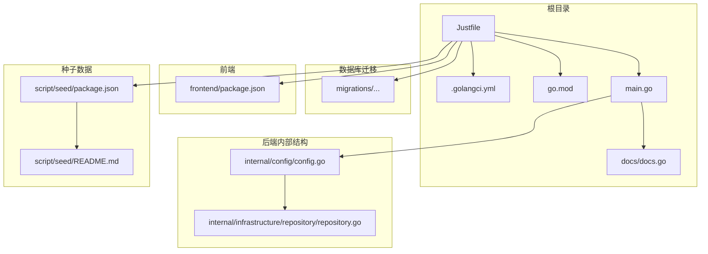
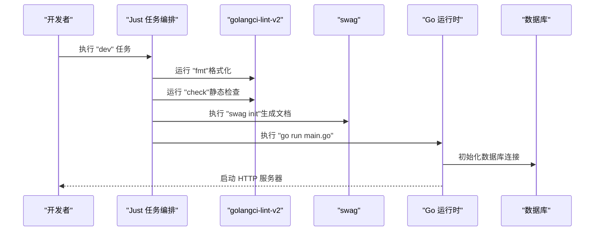
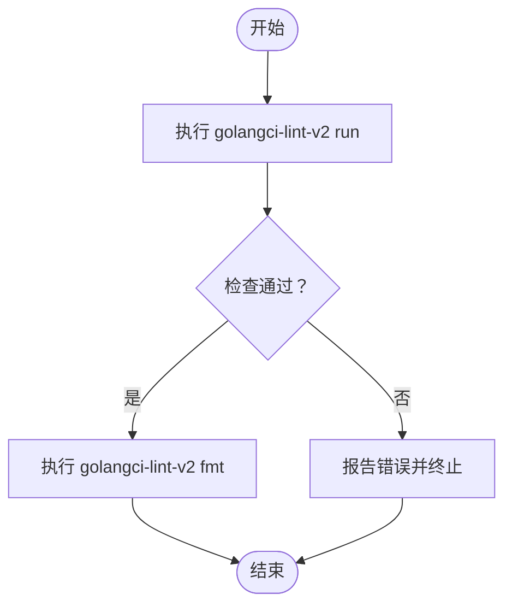
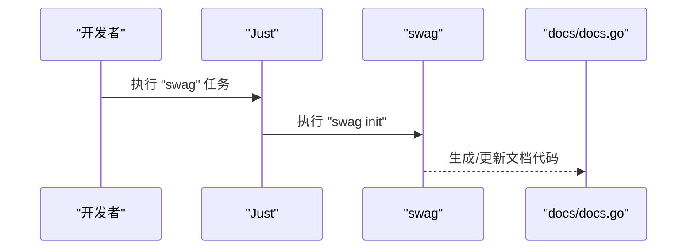
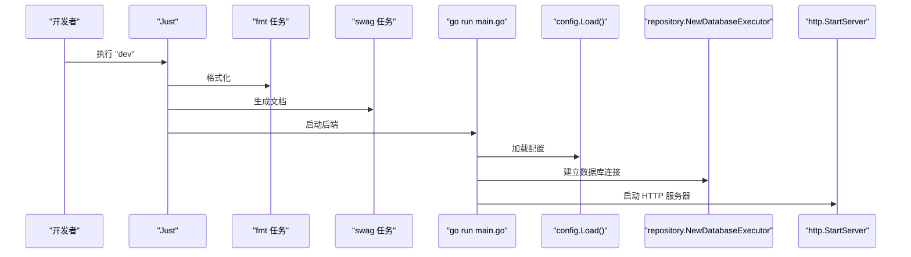
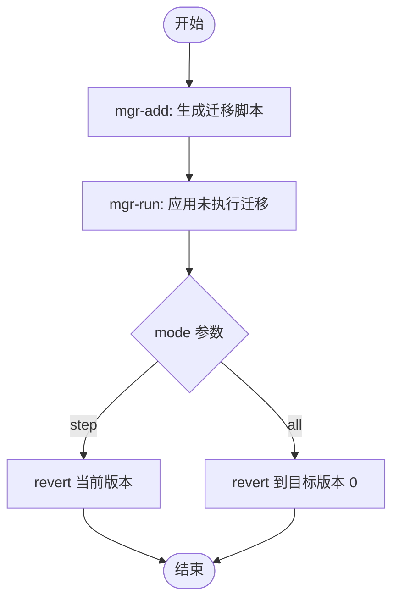
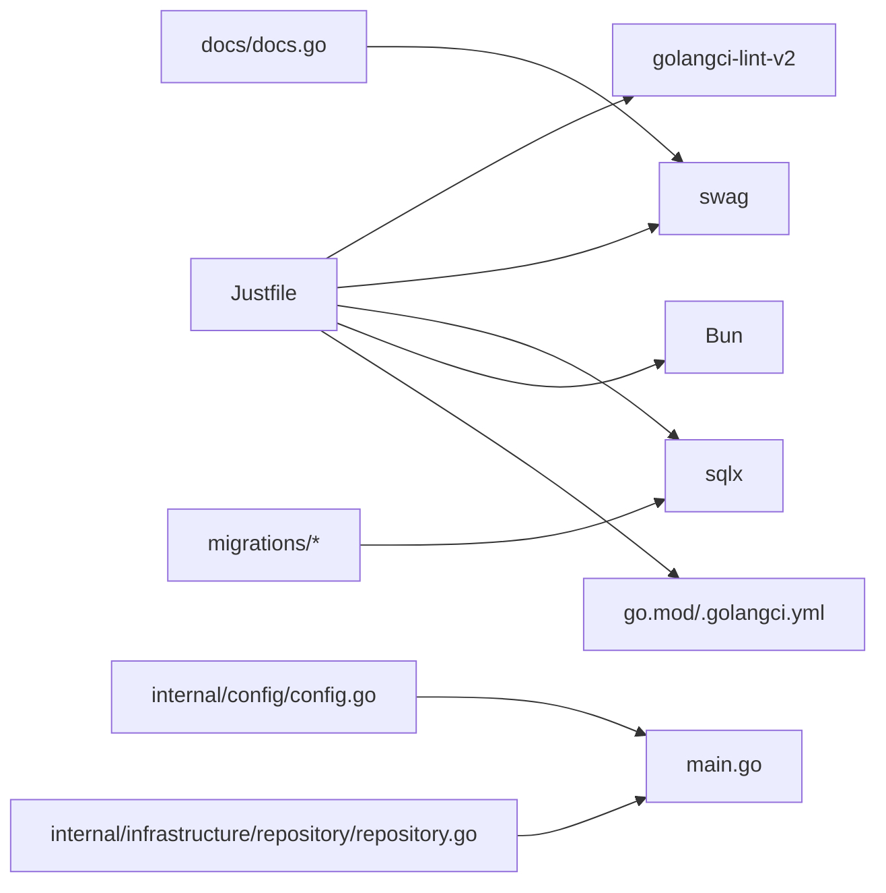

# 任务编排工具

<cite>
**本文引用的文件**
- [justfile](file://justfile)
- [.golangci.yml](file://.golangci.yml)
- [go.mod](file://go.mod)
- [main.go](file://main.go)
- [docs.go](file://docs/docs.go)
- [config.go](file://internal/config/config.go)
- [repository.go](file://internal/infrastructure/repository/repository.go)
- [package.json](file://frontend/package.json)
- [package.json](file://script/seed/package.json)
- [README.md](file://script/seed/README.md)
- [20260301065010_features-enable.up.sql](file://migrations/20260301065010_features-enable.up.sql)
- [20260301065012_team-table.up.sql](file://migrations/20260301065012_team-table.up.sql)
</cite>

## 目录
1. [简介](#简介)
2. [项目结构](#项目结构)
3. [核心组件](#核心组件)
4. [架构总览](#架构总览)
5. [详细组件分析](#详细组件分析)
6. [依赖分析](#依赖分析)
7. [性能考虑](#性能考虑)
8. [故障排查指南](#故障排查指南)
9. [结论](#结论)
10. [附录](#附录)

## 简介
本指南围绕 Just 任务编排工具在本项目中的使用展开，系统性说明以下内容：
- Justfile 中定义的核心开发任务：代码检查（golangci-lint）、格式化（gofmt）、Swagger 文档生成（swag）、开发启动（dev）、构建（build）、数据库迁移（mgr-add、mgr-run、mgr-rvt）、种子数据（seed-base）等。
- 任务间的依赖关系与执行顺序，例如 dev 任务如何先执行 fmt 与 swag 再启动后端服务。
- 数据库迁移任务的使用方法与最佳实践，涵盖新增脚本、执行迁移、回滚策略。
- 常见开发场景的任务组合示例：一键清理、一键构建、一键迁移等。
- 任务参数传递、条件执行与错误处理机制的说明。

## 项目结构
本项目采用多模块结构，后端使用 Go 语言，前端使用 Vue + Vite，数据库迁移脚本位于 migrations 目录，任务编排通过 Justfile 统一管理。关键目录与文件如下：
- 根目录：Justfile（任务编排）、.golangci.yml（代码检查配置）、go.mod（Go 模块）、main.go（入口程序）、docs/docs.go（Swagger 文档生成产物）。
- internal：后端业务层，包含 API、应用、领域、基础设施等子包。
- migrations：数据库迁移脚本，按时间戳命名，包含 up/down 脚本。
- frontend：前端工程，使用 Vite + Vue。
- script/seed：种子数据脚本，基于 Bun 运行。

**图表来源**
- [justfile](file://justfile)
- [.golangci.yml](file://.golangci.yml)
- [go.mod](file://go.mod)
- [main.go](file://main.go)
- [docs.go](file://docs/docs.go)
- [config.go](file://internal/config/config.go)
- [repository.go](file://internal/infrastructure/repository/repository.go)
- [package.json](file://frontend/package.json)
- [package.json](file://script/seed/package.json)
- [README.md](file://script/seed/README.md)

**章节来源**
- [justfile](file://justfile)
- [go.mod](file://go.mod)

## 核心组件
本节聚焦 Justfile 中定义的关键任务及其职责：
- 默认任务：列出所有可用任务。
- 代码检查（check）：调用 golangci-lint-v2 对指定路径进行静态检查。
- 格式化（fmt）：调用 golangci-lint-v2 的格式化功能对代码进行格式化。
- Swagger 文档生成（swag）：执行 swag 初始化，生成 API 文档。
- 开发启动（dev）：依赖 fmt 与 swag，随后运行后端主程序。
- 构建（build）：设置 GOOS 与 GOARCH，编译生成二进制输出。
- 数据库迁移（mgr-add、mgr-run、mgr-rvt）：新增迁移脚本、执行迁移、按模式回滚。
- 种子数据（seed-base）：使用 Bun 运行种子脚本。

此外，.golangci.yml 配置了启用的 linter 与 formatter，确保 check 与 fmt 任务的行为一致。

**章节来源**
- [justfile](file://justfile)
- [.golangci.yml](file://.golangci.yml)

## 架构总览
下图展示了 Just 任务编排与后端启动的整体流程，突出任务依赖与外部工具集成：

**图表来源**
- [justfile](file://justfile)
- [main.go](file://main.go)
- [config.go](file://internal/config/config.go)
- [repository.go](file://internal/infrastructure/repository/repository.go)

## 详细组件分析

### 代码检查与格式化任务
- 任务名称：check、fmt
- 依赖关系：无直接依赖，独立执行。
- 参数传递：check 支持通过路径参数传入待检查范围，默认为全部路径。
- 执行行为：check 调用 golangci-lint-v2 的 run 子命令；fmt 调用其格式化功能。
- 错误处理：golangci-lint-v2 返回非零退出码时，Just 将中断后续任务。

**图表来源**
- [justfile](file://justfile)
- [.golangci.yml](file://.golangci.yml)

**章节来源**
- [justfile](file://justfile)
- [.golangci.yml](file://.golangci.yml)

### Swagger 文档生成任务
- 任务名称：swag
- 依赖关系：无直接依赖。
- 执行行为：调用 swag 初始化，扫描注释生成 API 文档。
- 与后端集成：后端 main.go 包注释中声明了标题、版本、基础路径等信息，swag 会据此生成文档。

**图表来源**
- [justfile](file://justfile)
- [docs.go](file://docs/docs.go)
- [main.go](file://main.go)

**章节来源**
- [justfile](file://justfile)
- [docs.go](file://docs/docs.go)
- [main.go](file://main.go)

### 开发启动任务
- 任务名称：dev
- 依赖关系：fmt → swag → go run main.go
- 执行顺序：先格式化与检查，再生成文档，最后启动后端服务。
- 后端启动流程：main.go 加载 .env、读取 app_config.json、初始化日志、建立数据库连接、组装应用层并启动 HTTP 服务器。

**图表来源**
- [justfile](file://justfile)
- [main.go](file://main.go)
- [config.go](file://internal/config/config.go)
- [repository.go](file://internal/infrastructure/repository/repository.go)

**章节来源**
- [justfile](file://justfile)
- [main.go](file://main.go)
- [config.go](file://internal/config/config.go)
- [repository.go](file://internal/infrastructure/repository/repository.go)

### 构建任务
- 任务名称：build
- 依赖关系：无直接依赖。
- 执行行为：设置 GOOS 与 GOARCH，调用 go build 输出二进制文件至 output/labelplus-next-server。
- 适用场景：CI/CD 或本地打包发布。

**章节来源**
- [justfile](file://justfile)

### 数据库迁移任务
- 任务名称：mgr-add、mgr-run、mgr-rvt
- 参数传递：
  - mgr-add：接收 script-name，用于生成新的迁移脚本文件名。
  - mgr-rvt：接收 mode 参数，支持 "step" 与 "all"，决定回滚粒度。
- 条件执行：mgr-rvt 根据 mode 参数选择不同的回滚命令。
- 执行行为：
  - mgr-add：调用 sqlx migrate add -r 生成 up/down 脚本。
  - mgr-run：调用 sqlx migrate run 应用未执行的迁移。
  - mgr-rvt：根据 mode 选择 sqlx migrate revert 或 revert --target-version 0。

**图表来源**
- [justfile](file://justfile)

**章节来源**
- [justfile](file://justfile)

### 种子数据任务
- 任务名称：seed-base
- 依赖关系：无直接依赖。
- 执行行为：使用 Bun 运行 script/seed/seedBase.ts。
- 依赖安装：首次运行需执行 bun install。

**章节来源**
- [justfile](file://justfile)
- [package.json](file://script/seed/package.json)
- [README.md](file://script/seed/README.md)

## 依赖分析
- 任务耦合关系：
  - dev 依赖 fmt 与 swag，形成串行依赖链。
  - mgr-rvt 具有条件分支，影响后续回滚行为。
- 外部依赖：
  - golangci-lint-v2：代码检查与格式化。
  - swag：API 文档生成。
  - sqlx：数据库迁移工具。
  - Bun：种子数据脚本运行。
- 配置文件：
  - .golangci.yml：控制 linter 与 formatter 行为。
  - go.mod：声明后端依赖，间接影响 swag、gorm、iris 等工具链。
  - app_config.json：后端运行时配置（由 config.Load() 读取）。

**图表来源**
- [justfile](file://justfile)
- [.golangci.yml](file://.golangci.yml)
- [go.mod](file://go.mod)
- [docs.go](file://docs/docs.go)
- [config.go](file://internal/config/config.go)
- [repository.go](file://internal/infrastructure/repository/repository.go)

**章节来源**
- [justfile](file://justfile)
- [.golangci.yml](file://.golangci.yml)
- [go.mod](file://go.mod)

## 性能考虑
- 代码检查与格式化：建议在本地开发阶段仅针对变更文件运行 check/fmt，减少等待时间。
- Swagger 生成：仅在 API 注释发生变更时执行 swag，避免重复生成。
- 构建任务：在 CI 环境中缓存 Go 构建产物与依赖，提升构建速度。
- 数据库迁移：优先使用 mgr-run 应用增量迁移，避免大规模回滚导致的长时间锁表。

## 故障排查指南
- 环境变量缺失：
  - DATABASE_URL 未设置：config.Load() 会报错，导致启动失败。
  - JWT_SECRET_KEY 未设置：认证配置加载失败。
  - APP_ENVIRONMENT 未设置：环境变量校验失败。
- 依赖安装问题：
  - golangci-lint-v2 未安装：执行 check/fmt 会失败。
  - swag 未安装：执行 swag 会失败。
  - sqlx 未安装：执行迁移任务会失败。
  - Bun 未安装：执行 seed-base 会失败。
- 迁移脚本问题：
  - 新增脚本命名不规范：可能导致 sqlx 无法识别版本。
  - up/down 脚本非幂等：可能导致重复执行失败。
- 前端依赖：
  - frontend/package.json 中的脚本依赖需正确安装，否则 dev/lint/build 可能失败。

**章节来源**
- [config.go](file://internal/config/config.go)
- [justfile](file://justfile)

## 结论
通过 Justfile，本项目实现了从代码质量、文档生成、开发启动到数据库迁移与种子数据的全流程自动化。合理利用任务参数与条件执行，可在不同开发场景下快速组合出高效的工作流。建议在团队内统一 Just 任务的使用规范，并结合 CI/CD 实现持续集成与部署。

## 附录

### 常用开发场景与任务组合示例
- 一键清理与准备：先执行 fmt 与 check，再执行 swag，最后启动 dev。
- 一键构建：执行 build，生成 Linux 平台二进制。
- 一键迁移：
  - 新增迁移：执行 mgr-add <script-name>，编写 up/down 脚本。
  - 应用迁移：执行 mgr-run。
  - 回滚迁移：执行 mgr-rvt mode=step 或 mgr-rvt mode=all。
- 一键种子数据：执行 seed-base（首次需先执行 bun install）。

### 数据库迁移最佳实践
- 命名规范：使用时间戳前缀加资源名，如 YYYYMMDDHHMMSS_resource-table.up.sql。
- 幂等性：确保 up/down 脚本可重复执行且结果一致。
- 索引与约束：在 up 脚本中定义必要的索引与约束，保证查询性能。
- 示例脚本：可参考 migrations 目录中的现有 up/down 脚本。

**章节来源**
- [justfile](file://justfile)
- [20260301065010_features-enable.up.sql](file://migrations/20260301065010_features-enable.up.sql)
- [20260301065012_team-table.up.sql](file://migrations/20260301065012_team-table.up.sql)