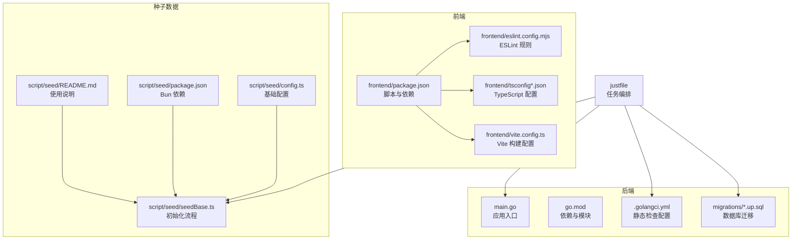
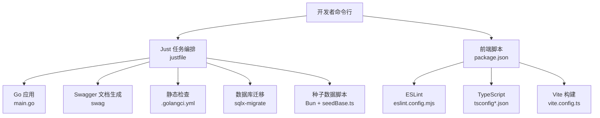
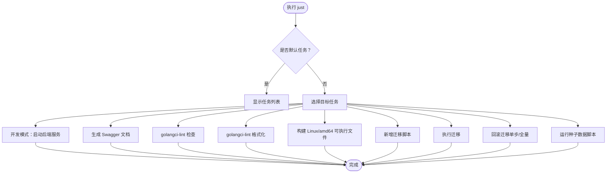
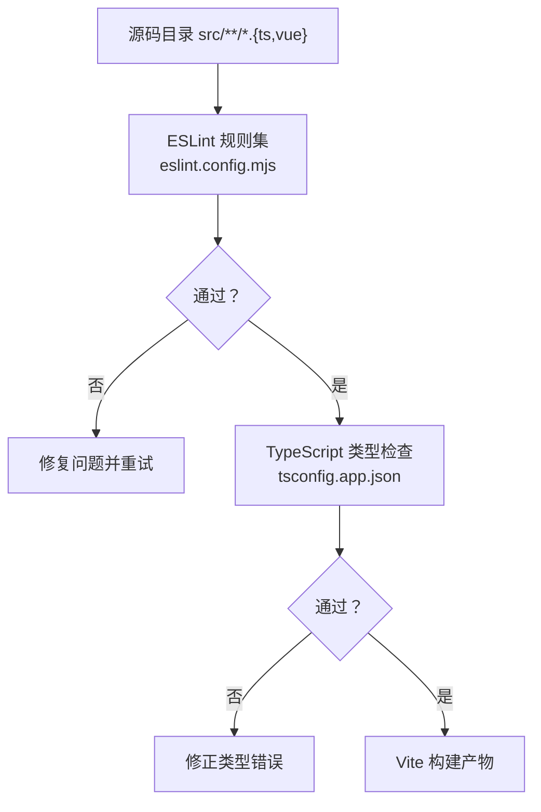
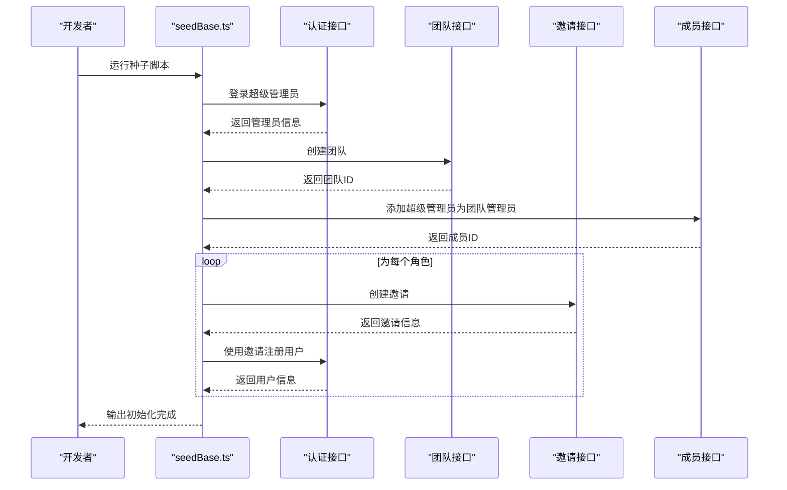
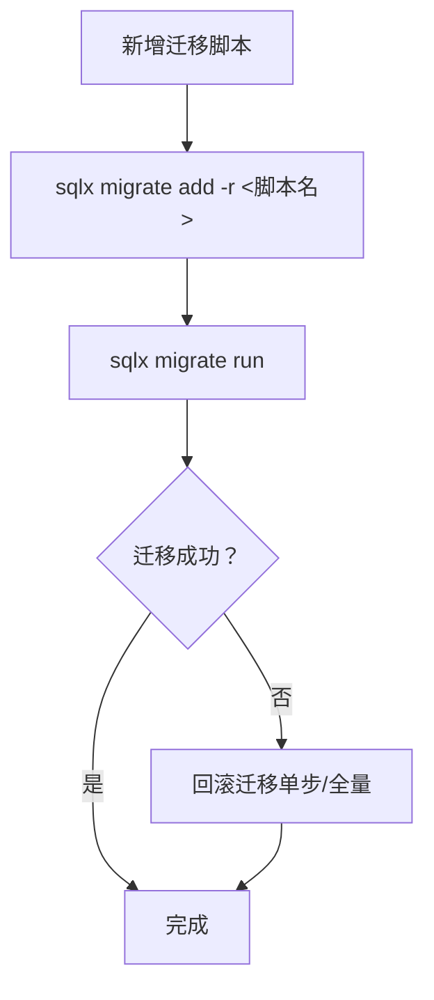
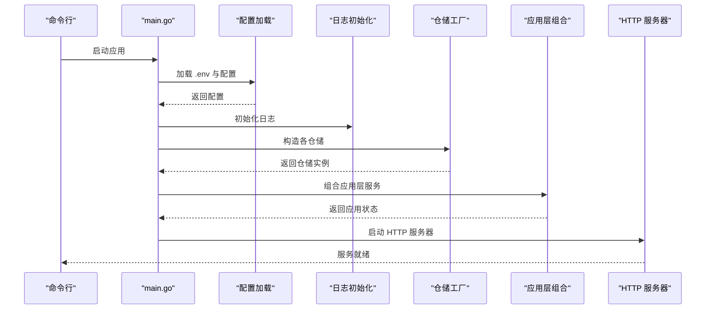
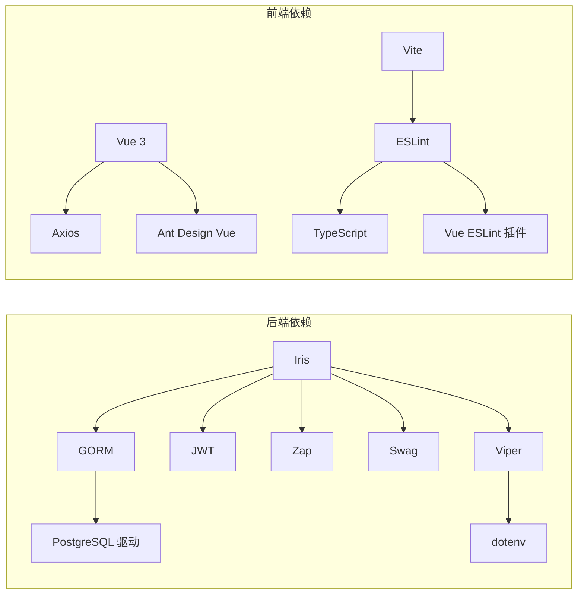

# 开发工具和脚本

<cite>
**本文引用的文件**
- [justfile](file://justfile)
- [.golangci.yml](file://.golangci.yml)
- [go.mod](file://go.mod)
- [main.go](file://main.go)
- [frontend/package.json](file://frontend/package.json)
- [frontend/eslint.config.mjs](file://frontend/eslint.config.mjs)
- [frontend/tsconfig.json](file://frontend/tsconfig.json)
- [frontend/tsconfig.app.json](file://frontend/tsconfig.app.json)
- [frontend/vite.config.ts](file://frontend/vite.config.ts)
- [script/seed/README.md](file://script/seed/README.md)
- [script/seed/package.json](file://script/seed/package.json)
- [script/seed/config.ts](file://script/seed/config.ts)
- [script/seed/seedBase.ts](file://script/seed/seedBase.ts)
- [migrations/20260301065010_features-enable.up.sql](file://migrations/20260301065010_features-enable.up.sql)
- [migrations/20260301065012_team-table.up.sql](file://migrations/20260301065012_team-table.up.sql)
- [migrations/20260301065022_user-table.up.sql](file://migrations/20260301065022_user-table.up.sql)
- [migrations/20260301075641_member-table.up.sql](file://migrations/20260301075641_member-table.up.sql)
- [migrations/20260301075642_invitation-table.up.sql](file://migrations/20260301075642_invitation-table.up.sql)
- [migrations/20260306101211_workset-table.up.sql](file://migrations/20260306101211_workset-table.up.sql)
- [migrations/20260306101212_comic-table.up.sql](file://migrations/20260306101212_comic-table.up.sql)
- [migrations/20260306101213_chapter-table.up.sql](file://migrations/20260306101213_chapter-table.up.sql)
- [migrations/20260306101214_page-table.up.sql](file://migrations/20260306101214_page-table.up.sql)
- [migrations/20260306101215_assignment-table.up.sql](file://migrations/20260306101215_assignment-table.up.sql)
- [migrations/20260306101216_unit-table.up.sql](file://migrations/20260306101216_unit-table.up.sql)
</cite>

## 目录
1. [简介](#简介)
2. [项目结构](#项目结构)
3. [核心组件](#核心组件)
4. [架构总览](#架构总览)
5. [详细组件分析](#详细组件分析)
6. [依赖关系分析](#依赖关系分析)
7. [性能考虑](#性能考虑)
8. [故障排查指南](#故障排查指南)
9. [结论](#结论)
10. [附录](#附录)

## 简介
本指南面向参与漫画翻译协作平台开发的工程师，系统讲解后端与前端工具链、数据库迁移与种子数据脚本、以及开发与构建流程的最佳实践。重点覆盖以下方面：
- Just 任务编排工具的使用与常用任务
- ESLint 代码规范与 TypeScript 编译配置
- Vite 构建优化与前端开发体验
- 种子数据脚本的数据初始化流程与测试环境准备
- 数据库迁移脚本的版本化管理与回滚策略
- 开发调试技巧、性能分析与代码质量检查流程
- 通过工具链提升开发效率、保证代码质量与加速迭代

## 项目结构
该项目采用前后端分离与模块化组织方式：
- 后端为 Go 语言实现，使用 Iris 框架与 GORM 访问 PostgreSQL，配置通过 Viper 与 dotenv 加载
- 前端基于 Vue 3 + TypeScript + Vite，使用 ESLint + TypeScript 类型检查保障质量
- 数据库迁移采用 sqlx-migrate，按时间戳版本化管理
- 种子数据脚本使用 Bun 快速运行，用于本地测试环境初始化

**图表来源**
- [main.go:1-146](file://main.go#L1-L146)
- [go.mod:1-113](file://go.mod#L1-L113)
- [.golangci.yml:1-31](file://.golangci.yml#L1-L31)
- [migrations/20260301065010_features-enable.up.sql](file://migrations/20260301065010_features-enable.up.sql)
- [frontend/package.json:1-35](file://frontend/package.json#L1-L35)
- [frontend/eslint.config.mjs:1-40](file://frontend/eslint.config.mjs#L1-L40)
- [frontend/tsconfig.app.json:1-9](file://frontend/tsconfig.app.json#L1-L9)
- [frontend/vite.config.ts:1-20](file://frontend/vite.config.ts#L1-L20)
- [script/seed/README.md:1-16](file://script/seed/README.md#L1-L16)
- [script/seed/package.json:1-11](file://script/seed/package.json#L1-L11)
- [script/seed/config.ts:1-16](file://script/seed/config.ts#L1-L16)
- [script/seed/seedBase.ts:1-85](file://script/seed/seedBase.ts#L1-L85)

**章节来源**
- [main.go:1-146](file://main.go#L1-L146)
- [frontend/package.json:1-35](file://frontend/package.json#L1-L35)
- [frontend/eslint.config.mjs:1-40](file://frontend/eslint.config.mjs#L1-L40)
- [frontend/tsconfig.app.json:1-9](file://frontend/tsconfig.app.json#L1-L9)
- [frontend/vite.config.ts:1-20](file://frontend/vite.config.ts#L1-L20)
- [script/seed/README.md:1-16](file://script/seed/README.md#L1-L16)
- [script/seed/package.json:1-11](file://script/seed/package.json#L1-L11)
- [script/seed/config.ts:1-16](file://script/seed/config.ts#L1-L16)
- [script/seed/seedBase.ts:1-85](file://script/seed/seedBase.ts#L1-L85)
- [justfile:1-39](file://justfile#L1-L39)
- [.golangci.yml:1-31](file://.golangci.yml#L1-L31)
- [go.mod:1-113](file://go.mod#L1-L113)

## 核心组件
- Just 任务编排：集中管理后端开发、构建、数据库迁移与种子数据等常用任务
- ESLint + TypeScript：前端代码质量与类型安全保障
- Vite：快速开发与生产构建
- 种子数据脚本：一键初始化测试团队、邀请与成员
- 数据库迁移：版本化管理表结构演进

**章节来源**
- [justfile:1-39](file://justfile#L1-L39)
- [frontend/package.json:1-35](file://frontend/package.json#L1-L35)
- [frontend/eslint.config.mjs:1-40](file://frontend/eslint.config.mjs#L1-L40)
- [frontend/tsconfig.app.json:1-9](file://frontend/tsconfig.app.json#L1-L9)
- [frontend/vite.config.ts:1-20](file://frontend/vite.config.ts#L1-L20)
- [script/seed/README.md:1-16](file://script/seed/README.md#L1-L16)
- [script/seed/seedBase.ts:1-85](file://script/seed/seedBase.ts#L1-L85)

## 架构总览
下图展示了从开发到构建的关键流程与工具交互：

**图表来源**
- [justfile:1-39](file://justfile#L1-L39)
- [main.go:1-146](file://main.go#L1-L146)
- [.golangci.yml:1-31](file://.golangci.yml#L1-L31)
- [frontend/package.json:1-35](file://frontend/package.json#L1-L35)
- [frontend/eslint.config.mjs:1-40](file://frontend/eslint.config.mjs#L1-L40)
- [frontend/tsconfig.app.json:1-9](file://frontend/tsconfig.app.json#L1-L9)
- [frontend/vite.config.ts:1-20](file://frontend/vite.config.ts#L1-L20)
- [script/seed/seedBase.ts:1-85](file://script/seed/seedBase.ts#L1-L85)

## 详细组件分析

### Just 任务编排工具
Justfile 提供统一的任务入口，涵盖开发、构建、文档生成、静态检查、数据库迁移与种子数据等常用操作。

- 默认任务：列出所有可用任务
- 文档生成：调用 swag 初始化 API 文档
- 代码检查：golangci-lint 执行与格式化
- 开发模式：先格式化与生成文档，再启动后端服务
- 构建：交叉编译 Linux/amd64 可执行文件
- 迁移：新增迁移脚本、执行迁移、支持按步或全量回滚
- 种子数据：通过 Bun 运行种子脚本

**图表来源**
- [justfile:1-39](file://justfile#L1-L39)

**章节来源**
- [justfile:1-39](file://justfile#L1-L39)

### ESLint 代码规范与 TypeScript 编译
- ESLint 配置：使用 Vue 3 推荐规则，关闭多词组件名强制，放宽 any 使用限制；对 TS/Vue 文件启用解析器与插件
- TypeScript 配置：分层 tsconfig，应用层扩展节点层并声明 DOM/Iterable 类库与 Vite 类型
- 前端脚本：提供 dev、lint、type-check、build、preview 等命令，构建前串联 lint 与类型检查

**图表来源**
- [frontend/eslint.config.mjs:1-40](file://frontend/eslint.config.mjs#L1-L40)
- [frontend/tsconfig.app.json:1-9](file://frontend/tsconfig.app.json#L1-L9)
- [frontend/package.json:1-35](file://frontend/package.json#L1-L35)

**章节来源**
- [frontend/eslint.config.mjs:1-40](file://frontend/eslint.config.mjs#L1-L40)
- [frontend/tsconfig.json:1-12](file://frontend/tsconfig.json#L1-L12)
- [frontend/tsconfig.app.json:1-9](file://frontend/tsconfig.app.json#L1-L9)
- [frontend/package.json:1-35](file://frontend/package.json#L1-L35)

### Vite 构建优化
- 插件：Vue 插件注册，确保模板与类型支持
- 路径别名：统一 @ 指向 src，便于导入
- 开发预览：提供本地预览命令

**章节来源**
- [frontend/vite.config.ts:1-20](file://frontend/vite.config.ts#L1-L20)
- [frontend/package.json:1-35](file://frontend/package.json#L1-L35)

### 种子数据脚本
种子脚本用于快速搭建测试环境，包含用户注册、团队创建、邀请与成员加入等流程。

- 依赖安装：使用 Bun 安装依赖
- 运行方式：Bun 运行 seedBase.ts
- 配置项：API 基础地址、超级管理员账号、默认密码、团队信息
- 初始化流程：登录超级管理员 → 创建团队 → 将超级管理员设为团队管理员 → 生成角色邀请 → 注册用户并输出结果

**图表来源**
- [script/seed/seedBase.ts:1-85](file://script/seed/seedBase.ts#L1-L85)
- [script/seed/config.ts:1-16](file://script/seed/config.ts#L1-L16)

**章节来源**
- [script/seed/README.md:1-16](file://script/seed/README.md#L1-L16)
- [script/seed/package.json:1-11](file://script/seed/package.json#L1-L11)
- [script/seed/config.ts:1-16](file://script/seed/config.ts#L1-L16)
- [script/seed/seedBase.ts:1-85](file://script/seed/seedBase.ts#L1-L85)

### 数据库迁移脚本
数据库迁移采用时间戳命名的 up/down 脚本，覆盖功能开关、团队、用户、成员、邀请、工作集、漫画、章节、页面、任务与单元等表。

- 新增迁移：通过 Just 任务调用 sqlx-migrate add
- 执行迁移：just mgr-run
- 回滚迁移：支持单步回滚或全量回滚至版本 0

**图表来源**
- [justfile:24-35](file://justfile#L24-L35)
- [migrations/20260301065010_features-enable.up.sql](file://migrations/20260301065010_features-enable.up.sql)
- [migrations/20260301065012_team-table.up.sql](file://migrations/20260301065012_team-table.up.sql)
- [migrations/20260301065022_user-table.up.sql](file://migrations/20260301065022_user-table.up.sql)
- [migrations/20260301075641_member-table.up.sql](file://migrations/20260301075641_member-table.up.sql)
- [migrations/20260301075642_invitation-table.up.sql](file://migrations/20260301075642_invitation-table.up.sql)
- [migrations/20260306101211_workset-table.up.sql](file://migrations/20260306101211_workset-table.up.sql)
- [migrations/20260306101212_comic-table.up.sql](file://migrations/20260306101212_comic-table.up.sql)
- [migrations/20260306101213_chapter-table.up.sql](file://migrations/20260306101213_chapter-table.up.sql)
- [migrations/20260306101214_page-table.up.sql](file://migrations/20260306101214_page-table.up.sql)
- [migrations/20260306101215_assignment-table.up.sql](file://migrations/20260306101215_assignment-table.up.sql)
- [migrations/20260306101216_unit-table.up.sql](file://migrations/20260306101216_unit-table.up.sql)

**章节来源**
- [justfile:24-35](file://justfile#L24-L35)
- [migrations/20260301065010_features-enable.up.sql](file://migrations/20260301065010_features-enable.up.sql)
- [migrations/20260301065012_team-table.up.sql](file://migrations/20260301065012_team-table.up.sql)
- [migrations/20260301065022_user-table.up.sql](file://migrations/20260301065022_user-table.up.sql)
- [migrations/20260301075641_member-table.up.sql](file://migrations/20260301075641_member-table.up.sql)
- [migrations/20260301075642_invitation-table.up.sql](file://migrations/20260301075642_invitation-table.up.sql)
- [migrations/20260306101211_workset-table.up.sql](file://migrations/20260306101211_workset-table.up.sql)
- [migrations/20260306101212_comic-table.up.sql](file://migrations/20260306101212_comic-table.up.sql)
- [migrations/20260306101213_chapter-table.up.sql](file://migrations/20260306101213_chapter-table.up.sql)
- [migrations/20260306101214_page-table.up.sql](file://migrations/20260306101214_page-table.up.sql)
- [migrations/20260306101215_assignment-table.up.sql](file://migrations/20260306101215_assignment-table.up.sql)
- [migrations/20260306101216_unit-table.up.sql](file://migrations/20260306101216_unit-table.up.sql)

### 后端应用启动与依赖
- 应用入口：加载 .env、读取配置、初始化日志、构造仓储与应用层、启动 HTTP 服务器
- 依赖管理：模块化引入各领域应用与基础设施组件，集中注入到应用状态中

**图表来源**
- [main.go:1-146](file://main.go#L1-L146)

**章节来源**
- [main.go:1-146](file://main.go#L1-L146)
- [go.mod:1-113](file://go.mod#L1-L113)

## 依赖关系分析
- 后端依赖：Iris、GORM、PostgreSQL 驱动、JWT、Zap 日志、Swag 文档、Viper 配置、dotenv 环境变量
- 前端依赖：Vue 3、Ant Design Vue、Axios、Vite、ESLint、TypeScript、Vue ESLint 插件
- 工具链：Just 作为任务编排，golangci-lint 与 ESLint 负责静态检查，sqlx-migrate 管理数据库迁移，Bun 运行种子脚本

**图表来源**
- [go.mod:1-113](file://go.mod#L1-L113)
- [frontend/package.json:1-35](file://frontend/package.json#L1-L35)

**章节来源**
- [go.mod:1-113](file://go.mod#L1-L113)
- [frontend/package.json:1-35](file://frontend/package.json#L1-L35)

## 性能考虑
- 前端开发：利用 Vite 的热更新与按需编译，减少等待时间；在构建阶段前置 ESLint 与类型检查，提前发现性能与质量隐患
- 后端开发：通过 Just 的开发任务自动执行格式化与文档生成，避免手动遗漏
- 数据库迁移：采用小步快跑的版本化迁移，配合回滚策略降低风险
- 种子数据：在本地快速初始化测试数据，缩短联调时间

[本节为通用建议，无需特定文件来源]

## 故障排查指南
- 静态检查失败
  - 后端：检查 golangci-lint 配置与超时设置，确认任务路径参数正确
  - 前端：查看 ESLint 报错详情，优先修复推荐规则问题
- 构建失败
  - 确认 TypeScript 类型检查通过后再执行构建
  - 检查 Vite 别名与插件配置
- 数据库迁移失败
  - 使用 Just 任务查看迁移状态，必要时执行回滚
- 种子数据异常
  - 确认 API 基础地址与超级管理员凭据正确
  - 检查网络连通性与后端服务状态

**章节来源**
- [.golangci.yml:1-31](file://.golangci.yml#L1-L31)
- [frontend/eslint.config.mjs:1-40](file://frontend/eslint.config.mjs#L1-L40)
- [frontend/tsconfig.app.json:1-9](file://frontend/tsconfig.app.json#L1-L9)
- [frontend/vite.config.ts:1-20](file://frontend/vite.config.ts#L1-L20)
- [justfile:24-35](file://justfile#L24-L35)
- [script/seed/config.ts:1-16](file://script/seed/config.ts#L1-L16)

## 结论
通过 Just 任务编排统一管理开发与构建流程，结合 ESLint + TypeScript + Vite 的前端质量体系，以及 sqlx-migrate 的数据库版本化管理与 Bun 种子脚本，能够显著提升开发效率、保证代码质量并加速迭代周期。建议在团队内推广使用这些工具链，并持续完善任务与规则以适配业务发展。

[本节为总结，无需特定文件来源]

## 附录
- 常用命令速查
  - 后端：just dev、just check、just fmt、just build、just swag
  - 数据库：just mgr-add、just mgr-run、just mgr-rvt
  - 前端：pnpm dev、pnpm lint、pnpm type-check、pnpm build、pnpm preview
  - 种子数据：bun install、bun run script/seed/seedBase.ts

[本节为补充信息，无需特定文件来源]