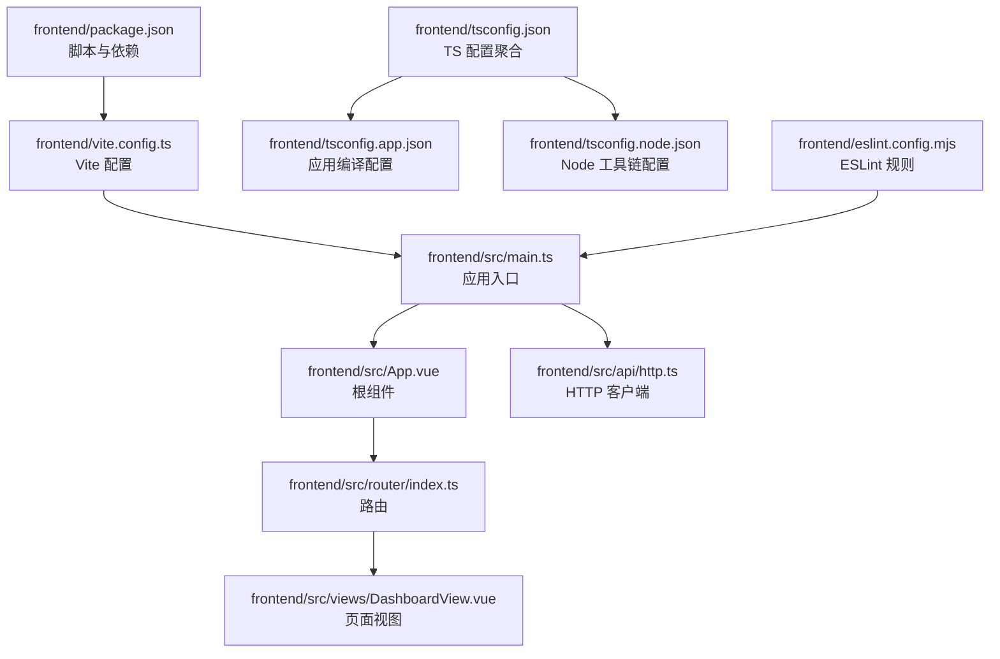
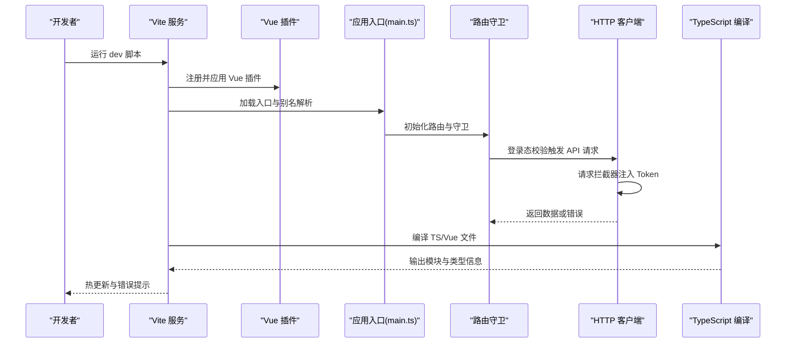
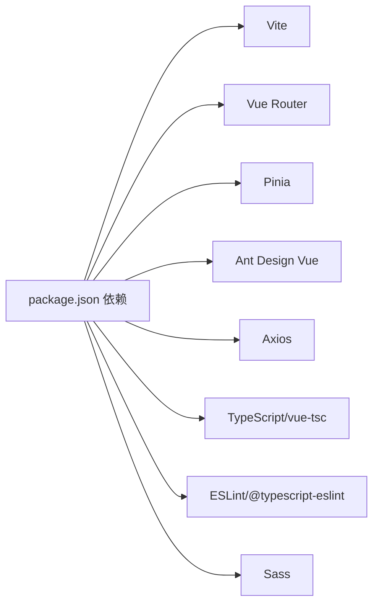

# 构建配置

<cite>
**本文引用的文件**
- [vite.config.ts](file://frontend/vite.config.ts)
- [tsconfig.json](file://frontend/tsconfig.json)
- [tsconfig.app.json](file://frontend/tsconfig.app.json)
- [tsconfig.node.json](file://frontend/tsconfig.node.json)
- [package.json](file://frontend/package.json)
- [eslint.config.mjs](file://frontend/eslint.config.mjs)
- [src/main.ts](file://frontend/src/main.ts)
- [src/env.d.ts](file://frontend/src/env.d.ts)
- [src/App.vue](file://frontend/src/App.vue)
- [src/router/index.ts](file://frontend/src/router/index.ts)
- [src/views/DashboardView.vue](file://frontend/src/views/DashboardView.vue)
- [src/api/http.ts](file://frontend/src/api/http.ts)
- [src/types/common.ts](file://frontend/src/types/common.ts)
- [src/stores/auth.ts](file://frontend/src/stores/auth.ts)
</cite>

## 目录
1. [简介](#简介)
2. [项目结构](#项目结构)
3. [核心组件](#核心组件)
4. [架构总览](#架构总览)
5. [详细组件分析](#详细组件分析)
6. [依赖分析](#依赖分析)
7. [性能考虑](#性能考虑)
8. [故障排查指南](#故障排查指南)
9. [结论](#结论)
10. [附录](#附录)

## 简介
本文件面向前端构建配置，系统梳理 Vite 与 TypeScript 在本项目的配置方式与最佳实践，覆盖开发服务器与代理、插件管理、构建优化、多环境参数、性能优化（代码分割、懒加载、资源压缩、缓存）、热重载与 Source Map、调试工具集成、第三方库与 UI 组件接入，以及构建产物分析与性能监控建议。内容以仓库现有配置为依据，避免臆测，便于开发者快速理解与落地。

## 项目结构
前端位于 frontend 目录，采用 Vite + Vue 3 + TypeScript 技术栈，使用 pnpm 管理依赖。关键目录与文件：
- 构建与类型配置：vite.config.*、tsconfig.*、package.json
- 应用入口与运行时：src/main.ts、src/App.vue、src/router、src/stores
- 类型与 API 层：src/types、src/api
- 质量保障：eslint.config.mjs

图表来源
- [package.json:1-36](file://frontend/package.json#L1-L36)
- [vite.config.ts:1-20](file://frontend/vite.config.ts#L1-L20)
- [src/main.ts:1-26](file://frontend/src/main.ts#L1-L26)
- [src/App.vue:1-45](file://frontend/src/App.vue#L1-L45)
- [src/router/index.ts:1-54](file://frontend/src/router/index.ts#L1-L54)
- [src/views/DashboardView.vue:1-348](file://frontend/src/views/DashboardView.vue#L1-L348)
- [src/api/http.ts:1-174](file://frontend/src/api/http.ts#L1-L174)
- [tsconfig.json:1-12](file://frontend/tsconfig.json#L1-L12)
- [tsconfig.app.json:1-9](file://frontend/tsconfig.app.json#L1-L9)
- [tsconfig.node.json:1-20](file://frontend/tsconfig.node.json#L1-L20)
- [eslint.config.mjs:1-40](file://frontend/eslint.config.mjs#L1-L40)

章节来源
- [package.json:1-36](file://frontend/package.json#L1-L36)
- [vite.config.ts:1-20](file://frontend/vite.config.ts#L1-L20)
- [tsconfig.json:1-12](file://frontend/tsconfig.json#L1-L12)

## 核心组件
- Vite 配置：启用 Vue 插件与路径别名，满足工程化与开发体验需求。
- TypeScript 配置：分层配置（应用与 Node 工具链），统一编译目标与模块解析策略。
- 脚本与依赖：通过 pnpm 脚本串联 Lint、类型检查与构建流程。
- 质量保障：ESLint 集成 TS 与 Vue 解析器，统一规则集与忽略项。
- 运行时：应用入口统一注册 Pinia、路由与 Ant Design Vue；路由守卫实现登录态校验；API 层集中处理鉴权与错误。

章节来源
- [vite.config.ts:12-19](file://frontend/vite.config.ts#L12-L19)
- [tsconfig.app.json:1-9](file://frontend/tsconfig.app.json#L1-L9)
- [tsconfig.node.json:1-20](file://frontend/tsconfig.node.json#L1-L20)
- [package.json:6-11](file://frontend/package.json#L6-L11)
- [eslint.config.mjs:1-40](file://frontend/eslint.config.mjs#L1-L40)
- [src/main.ts:1-26](file://frontend/src/main.ts#L1-L26)
- [src/router/index.ts:42-51](file://frontend/src/router/index.ts#L42-L51)
- [src/api/http.ts:28-33](file://frontend/src/api/http.ts#L28-L33)

## 架构总览
下图展示了从开发到构建的关键流程：Vite 启动、插件与别名生效、入口挂载、路由守卫、API 请求与拦截器、TypeScript 编译与 ESLint 校验。

图表来源
- [package.json:7-11](file://frontend/package.json#L7-L11)
- [vite.config.ts:12-19](file://frontend/vite.config.ts#L12-L19)
- [src/main.ts:16-23](file://frontend/src/main.ts#L16-L23)
- [src/router/index.ts:42-51](file://frontend/src/router/index.ts#L42-L51)
- [src/api/http.ts:38-46](file://frontend/src/api/http.ts#L38-L46)
- [tsconfig.app.json:3-6](file://frontend/tsconfig.app.json#L3-L6)

## 详细组件分析

### Vite 构建配置
- 插件管理：启用 Vue 插件，支持 .vue 单文件组件与组合式 API 开发体验。
- 路径别名：将 @ 映射到 src，提升导入可读性与迁移稳定性。
- 开发服务器：当前未显式配置 devServer，遵循 Vite 默认行为；如需代理后端接口，可在 defineConfig 内添加 devServer.proxy 字段。
- 构建优化：当前未配置 rollupOptions 或预构建依赖；如需进一步优化可在此处扩展。

章节来源
- [vite.config.ts:12-19](file://frontend/vite.config.ts#L12-L19)

### TypeScript 编译配置
- 配置聚合：顶层 tsconfig.json 通过 references 引入应用与 Node 工具链配置，形成分层编译体系。
- 应用配置（tsconfig.app.json）：继承 Node 配置，扩展浏览器/DOM 类库与 Vite 客户端类型，限定 include 范围。
- Node 工具链配置（tsconfig.node.json）：启用 composite、Bundler 模块解析、严格模式、ESNext 模块等，确保 Vite 与工具链稳定运行。
- 环境类型声明：src/env.d.ts 引入 Vite 客户端类型，提供 import.meta 的类型提示。

章节来源
- [tsconfig.json:3-10](file://frontend/tsconfig.json#L3-L10)
- [tsconfig.app.json:1-9](file://frontend/tsconfig.app.json#L1-L9)
- [tsconfig.node.json:1-20](file://frontend/tsconfig.node.json#L1-L20)
- [src/env.d.ts:1-5](file://frontend/src/env.d.ts#L1-L5)

### 多环境配置管理
- 环境变量：当前未见明确的 .env.* 文件与 Vite 环境变量前缀配置。若需区分开发/测试/生产参数，可在根目录新增 .env.development/.env.test/.env.production，并使用 Vite 的 import.meta.env 前缀读取。
- 构建脚本：package.json 的 build 脚本串联 Lint 与类型检查后再执行 vite build，确保质量门槛；如需按环境切换参数，可在 vite.config.ts 中根据模式动态返回不同配置对象。

章节来源
- [package.json:6-11](file://frontend/package.json#L6-L11)
- [vite.config.ts:12-19](file://frontend/vite.config.ts#L12-L19)

### 插件与第三方库集成
- Vue 插件：在入口统一注册 Pinia、路由与 Ant Design Vue，形成一致的 UI 与状态管理模式。
- UI 组件库：Ant Design Vue 已在入口引入，样式通过全局 reset 与按需样式结合；组件使用于页面视图中。
- 路由与懒加载：路由对视图组件采用动态导入，实现按需加载与代码分割。

章节来源
- [src/main.ts:16-23](file://frontend/src/main.ts#L16-L23)
- [src/router/index.ts:20-28](file://frontend/src/router/index.ts#L20-L28)
- [src/views/DashboardView.vue:1-348](file://frontend/src/views/DashboardView.vue#L1-L348)

### API 层与鉴权
- 统一客户端：基于 Axios 封装 ApiHttpClient，集中处理 baseURL、超时、请求头注入与错误处理。
- 鉴权流程：请求拦截器自动附加 Bearer Token；响应拦截器处理 401 并跳转登录。
- 查询参数序列化：兼容 includes[] 数组格式，提升与后端接口的兼容性。

章节来源
- [src/api/http.ts:28-33](file://frontend/src/api/http.ts#L28-L33)
- [src/api/http.ts:51-62](file://frontend/src/api/http.ts#L51-L62)
- [src/api/http.ts:67-82](file://frontend/src/api/http.ts#L67-L82)
- [src/api/http.ts:150-167](file://frontend/src/api/http.ts#L150-L167)

### 路由与登录态守卫
- 路由表：定义首页重定向、登录页与仪表盘页，使用动态导入实现懒加载。
- 登录态守卫：在进入非登录路由前检查登录状态，未登录则重定向至登录页；已登录访问登录页则重定向至仪表盘。

章节来源
- [src/router/index.ts:14-29](file://frontend/src/router/index.ts#L14-L29)
- [src/router/index.ts:42-51](file://frontend/src/router/index.ts#L42-L51)

### 调试与开发体验
- 热重载：Vite 默认启用，无需额外配置；修改源码后自动刷新。
- Source Map：默认开启，便于断点调试；如需调整可在 defineConfig 中设置 sourcemap。
- 调试工具：可在浏览器开发者工具中查看网络请求、Vuex/Pinia 状态与组件树。

章节来源
- [vite.config.ts:12-19](file://frontend/vite.config.ts#L12-L19)

### 质量保障（ESLint）
- 解析器：同时集成 TS 与 Vue 解析器，支持 .vue 文件与 TS 语法。
- 规则：基于推荐规则集，关闭部分强制约束以适配项目风格。
- 忽略项：忽略 dist、node_modules、纯声明文件与 JS 文件，聚焦源码质量。

章节来源
- [eslint.config.mjs:10-40](file://frontend/eslint.config.mjs#L10-L40)

## 依赖分析
- 构建与运行时：Vite、Vue 3、Vue Router、Pinia、Ant Design Vue、Axios。
- 类型与校验：TypeScript、vue-tsc、@typescript-eslint/*、ESLint、eslint-plugin-vue。
- 开发工具：sass（样式预处理）。

图表来源
- [package.json:13-34](file://frontend/package.json#L13-L34)

章节来源
- [package.json:13-34](file://frontend/package.json#L13-L34)

## 性能考虑
- 代码分割与懒加载
  - 路由视图采用动态导入，实现按需加载与初始包体积优化。
  - 可在大型页面或组件中继续拆分异步组件，减少首屏依赖。
- 构建优化
  - 可在 vite.config.ts 中配置 rollupOptions.output.manualChunks 与 external，分离第三方库与公共代码。
  - 使用预构建依赖（optimizeDeps）减少冷启动时间。
- 资源压缩与缓存
  - 生产构建默认启用压缩；可进一步配置压缩算法与资源哈希策略。
  - 通过 HTML/CSS/JS 缓存头与 CDN 配置提升二次加载性能。
- 图片与字体
  - 对大图进行 WebP/AVIF 转换与尺寸裁剪；字体使用子集化与可变字体策略。
- 性能监控
  - 使用浏览器性能面板与 Lighthouse 进行基准测试。
  - 集成 Web Vitals 采集与上报，持续观测用户体验指标。

## 故障排查指南
- 热重载不生效
  - 检查 Vite 默认行为与浏览器缓存；尝试禁用缓存或更换端口。
- 类型错误阻塞构建
  - 先执行类型检查脚本定位问题，再修复 tsconfig 或具体文件类型标注。
- ESLint 报错
  - 根据规则集调整代码风格或在规则层面放宽特定场景。
- 路由跳转异常
  - 核对路由守卫逻辑与登录状态 Store 的读写一致性。
- API 请求失败
  - 检查 baseURL、Token 注入与后端接口变更；关注 401 自动跳转逻辑。

章节来源
- [src/router/index.ts:42-51](file://frontend/src/router/index.ts#L42-L51)
- [src/api/http.ts:51-62](file://frontend/src/api/http.ts#L51-L62)
- [src/api/http.ts:74-79](file://frontend/src/api/http.ts#L74-L79)
- [eslint.config.mjs:32-38](file://frontend/eslint.config.mjs#L32-L38)

## 结论
本项目以简洁稳定的配置实现了现代化前端工程：Vite 提供高效开发体验，Vue 与 Pinia 构建状态与视图，Ant Design Vue 提升交互效率，Axios 统一 API 层。通过分层 TypeScript 配置与 ESLint 规范，保障了代码质量与可维护性。建议后续在多环境参数、代理配置、构建优化与性能监控方面逐步完善，以支撑更大规模的迭代与发布。

## 附录
- 术语
  - 代码分割：将打包产物拆分为多个 chunk，按需加载。
  - 懒加载：运行时动态加载模块，降低首屏负担。
  - Source Map：映射压缩/转换后的代码到源码位置，便于调试。
- 最佳实践清单
  - 明确 .env.* 与 import.meta.env 前缀规范。
  - 在 vite.config.ts 中补充 devServer.proxy 与 rollupOptions。
  - 使用 vue-tsc 与 ESLint 双保险，确保类型与风格一致。
  - 以路由与组件维度推进懒加载，配合 manualChunks 策略。
  - 建立构建产物分析（Bundle Analyzer）与 Web Vitals 监控。