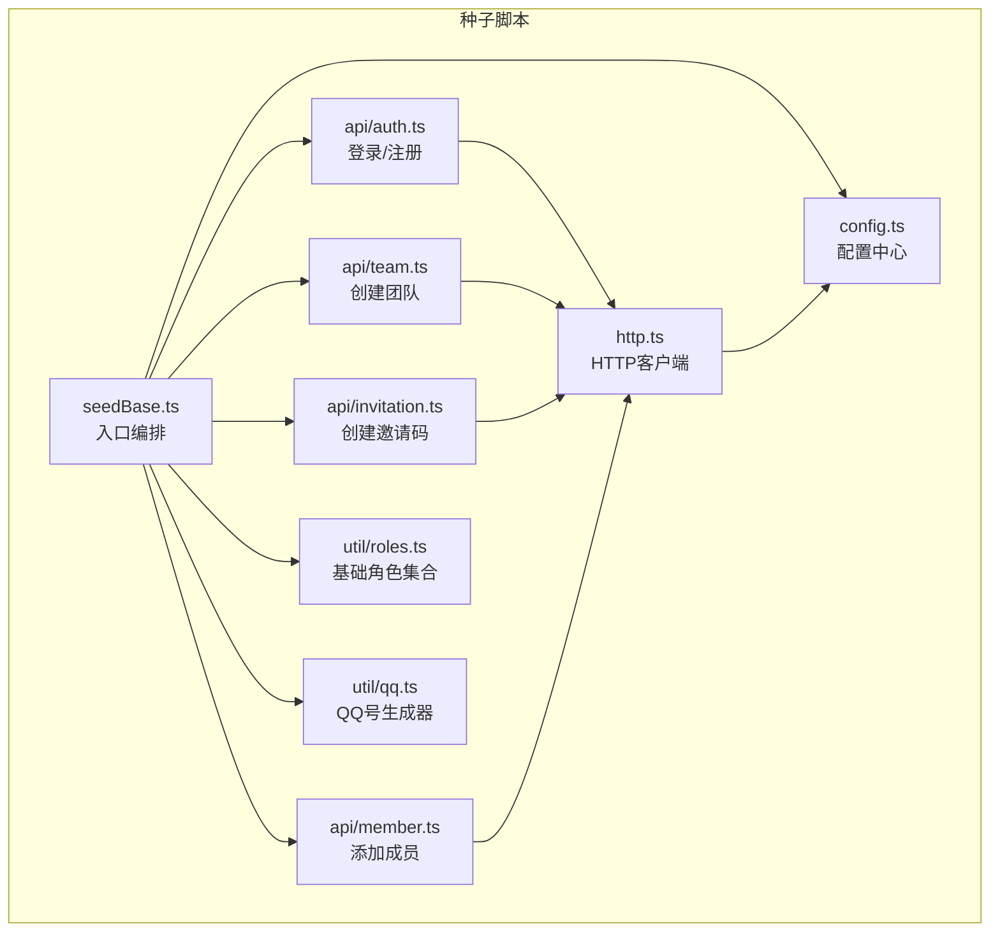
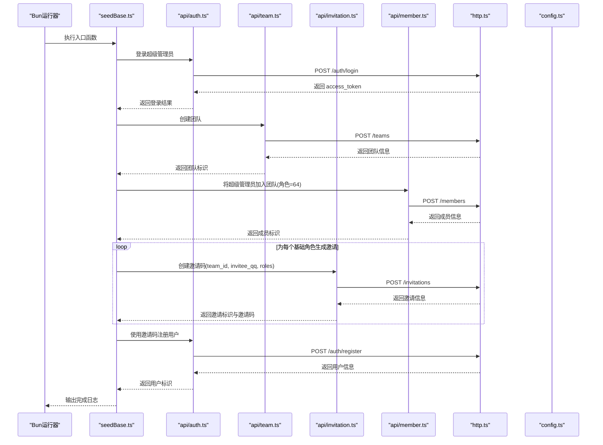
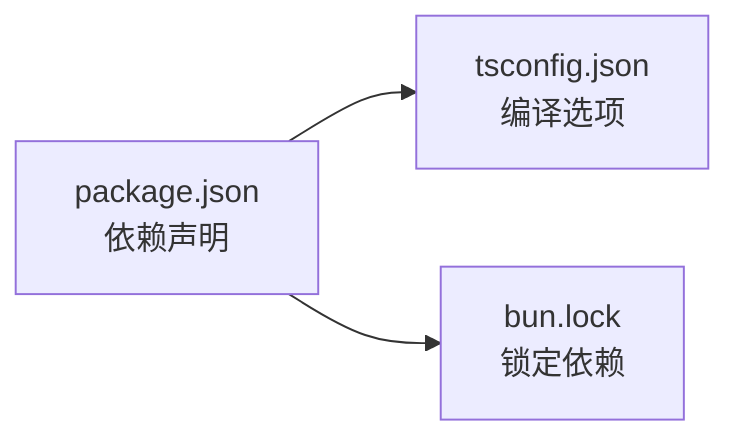

# 种子数据脚本

<cite>
**本文引用的文件**
- [seedBase.ts](file://script/seed/seedBase.ts)
- [config.ts](file://script/seed/config.ts)
- [http.ts](file://script/seed/http.ts)
- [auth.ts](file://script/seed/api/auth.ts)
- [team.ts](file://script/seed/api/team.ts)
- [invitation.ts](file://script/seed/api/invitation.ts)
- [member.ts](file://script/seed/api/member.ts)
- [roles.ts](file://script/seed/util/roles.ts)
- [qq.ts](file://script/seed/util/qq.ts)
- [package.json](file://script/seed/package.json)
- [tsconfig.json](file://script/seed/tsconfig.json)
- [README.md](file://script/seed/README.md)
- [bun.lock](file://script/seed/bun.lock)
</cite>

## 目录
1. [简介](#简介)
2. [项目结构](#项目结构)
3. [核心组件](#核心组件)
4. [架构总览](#架构总览)
5. [详细组件分析](#详细组件分析)
6. [依赖关系分析](#依赖关系分析)
7. [性能考虑](#性能考虑)
8. [故障排查指南](#故障排查指南)
9. [结论](#结论)
10. [附录](#附录)

## 简介
本指南面向测试与开发环境，系统性讲解种子数据脚本的架构设计与运行机制，涵盖以下内容：
- Bun 运行时环境的配置与依赖管理
- seedBase.ts 主脚本的执行流程与配置项
- 各业务实体（用户、团队、邀请码、成员）的初始化逻辑
- 测试环境数据准备最佳实践：清理、重置与批量生成
- 自定义种子数据与扩展新数据生成器的方法

该脚本通过 HTTP 客户端调用后端 API，完成超级管理员登录、团队创建、成员加入、邀请码生成与注册等步骤，形成可直接用于测试的最小可用数据集。

## 项目结构
种子脚本位于 script/seed 目录，采用“功能分层”的组织方式：
- 配置层：集中管理 API 基地址、默认密码、超级管理员账号与团队信息
- HTTP 层：封装统一请求与响应解析，支持 Bearer Token 认证
- API 层：按业务域拆分，分别处理认证、团队、邀请码、成员等接口
- 工具层：提供角色集合与 QQ 号生成器
- 入口脚本：seedBase.ts 负责编排整个种子流程

图表来源
- [seedBase.ts:11-79](file://script/seed/seedBase.ts#L11-L79)
- [config.ts:1-16](file://script/seed/config.ts#L1-L16)
- [http.ts:9-60](file://script/seed/http.ts#L9-L60)
- [auth.ts:3-22](file://script/seed/api/auth.ts#L3-L22)
- [team.ts:3-8](file://script/seed/api/team.ts#L3-L8)
- [invitation.ts:3-9](file://script/seed/api/invitation.ts#L3-L9)
- [member.ts:3-13](file://script/seed/api/member.ts#L3-L13)
- [roles.ts:1-4](file://script/seed/util/roles.ts#L1-L4)
- [qq.ts:1-4](file://script/seed/util/qq.ts#L1-L4)

章节来源
- [seedBase.ts:11-79](file://script/seed/seedBase.ts#L11-L79)
- [config.ts:1-16](file://script/seed/config.ts#L1-L16)
- [http.ts:9-60](file://script/seed/http.ts#L9-L60)
- [auth.ts:3-22](file://script/seed/api/auth.ts#L3-L22)
- [team.ts:3-8](file://script/seed/api/team.ts#L3-L8)
- [invitation.ts:3-9](file://script/seed/api/invitation.ts#L3-L9)
- [member.ts:3-13](file://script/seed/api/member.ts#L3-L13)
- [roles.ts:1-4](file://script/seed/util/roles.ts#L1-L4)
- [qq.ts:1-4](file://script/seed/util/qq.ts#L1-L4)

## 核心组件
- 配置中心（config.ts）
  - 统一管理 API 基地址、超级管理员账号、默认密码、团队名称与描述
  - 便于在不同环境（本地、CI、预发）切换
- HTTP 客户端（http.ts）
  - 封装 fetch 请求，自动设置 Content-Type 与 Authorization 头
  - 统一解析服务端包装格式 { code, message, data }，并在失败时抛出错误
  - 支持 204 无内容与空响应处理
- 认证与用户（api/auth.ts）
  - 登录：接收 qq 与 password，成功后保存 access_token 以便后续请求
  - 注册：使用邀请码、qq、name、password 完成注册
- 团队（api/team.ts）
  - 创建团队，返回团队标识
- 成员（api/member.ts）
  - 将用户加入团队，并赋予角色位掩码
- 邀请码（api/invitation.ts）
  - 为团队生成邀请码，携带被邀请者 QQ 与角色位
- 角色与 QQ 生成器（util/roles.ts、util/qq.ts）
  - 提供基础角色位集合（1,2,4,8,16,32,64）
  - 生成递增的 QQ 号作为被邀请者的标识

章节来源
- [config.ts:1-16](file://script/seed/config.ts#L1-L16)
- [http.ts:9-60](file://script/seed/http.ts#L9-L60)
- [auth.ts:3-22](file://script/seed/api/auth.ts#L3-L22)
- [team.ts:3-8](file://script/seed/api/team.ts#L3-L8)
- [member.ts:3-13](file://script/seed/api/member.ts#L3-L13)
- [invitation.ts:3-9](file://script/seed/api/invitation.ts#L3-L9)
- [roles.ts:1-4](file://script/seed/util/roles.ts#L1-L4)
- [qq.ts:1-4](file://script/seed/util/qq.ts#L1-L4)

## 架构总览
下图展示了从入口脚本到各业务 API 的调用链路与数据流：

图表来源
- [seedBase.ts:11-79](file://script/seed/seedBase.ts#L11-L79)
- [auth.ts:3-22](file://script/seed/api/auth.ts#L3-L22)
- [team.ts:3-8](file://script/seed/api/team.ts#L3-L8)
- [invitation.ts:3-9](file://script/seed/api/invitation.ts#L3-L9)
- [member.ts:3-13](file://script/seed/api/member.ts#L3-L13)
- [http.ts:9-60](file://script/seed/http.ts#L9-L60)
- [config.ts:1-16](file://script/seed/config.ts#L1-L16)

## 详细组件分析

### 入口脚本：seedBase.ts
- 功能概述
  - 登录超级管理员
  - 创建团队并记录团队标识
  - 将超级管理员加入团队并赋予最高角色位
  - 为每个基础角色生成邀请码，并收集邀请信息
  - 使用邀请码注册用户，完成种子数据初始化
- 关键流程要点
  - 统一异常处理：捕获错误并退出进程
  - 日志输出：每一步骤均打印关键信息，便于调试
  - 数据一致性：先创建团队与成员，再生成邀请与注册用户
- 可扩展点
  - 在循环外增加更多角色或自定义角色集合
  - 在邀请生成后追加更多用户注册步骤
  - 在注册完成后进行额外的数据初始化（如作品、章节等）

章节来源
- [seedBase.ts:11-79](file://script/seed/seedBase.ts#L11-L79)

### HTTP 客户端：http.ts
- 设计要点
  - 统一请求头：固定 Content-Type 与条件化 Authorization
  - 统一错误处理：非 2xx 或服务端 code 非 0 抛出错误
  - 统一响应解析：识别包装格式 { code, message, data } 并解包
  - 特殊状态：204 与空响应返回 null
- 性能与健壮性
  - 使用 Bun 内建 fetch，避免额外网络库依赖
  - 文本回退：无法解析 JSON 时返回原始文本，便于定位问题

章节来源
- [http.ts:9-60](file://script/seed/http.ts#L9-L60)

### 认证与用户：api/auth.ts
- 登录流程
  - 发送 qq 与 password
  - 成功后保存 access_token，后续请求自动带上 Authorization
- 注册流程
  - 使用邀请码、qq、name、password 完成注册
  - 返回用户标识，供后续流程使用

章节来源
- [auth.ts:3-22](file://script/seed/api/auth.ts#L3-L22)

### 团队：api/team.ts
- 创建团队
  - 接收 name 与 description
  - 返回团队标识，供后续成员加入与邀请生成使用

章节来源
- [team.ts:3-8](file://script/seed/api/team.ts#L3-L8)

### 成员：api/member.ts
- 添加成员
  - 指定 team_id、user_id、roles
  - 返回成员标识

章节来源
- [member.ts:3-13](file://script/seed/api/member.ts#L3-L13)

### 邀请码：api/invitation.ts
- 创建邀请码
  - 携带 team_id、invitee_qq、roles
  - 返回邀请标识与邀请码，供注册使用

章节来源
- [invitation.ts:3-9](file://script/seed/api/invitation.ts#L3-L9)

### 工具：角色与 QQ 生成器
- 角色集合
  - 提供基础角色位数组，便于批量生成邀请与注册
- QQ 生成器
  - 生成递增的 QQ 号，保证唯一性与可读性

章节来源
- [roles.ts:1-4](file://script/seed/util/roles.ts#L1-L4)
- [qq.ts:1-4](file://script/seed/util/qq.ts#L1-L4)

### 配置中心：config.ts
- 环境相关配置
  - apiBase：后端 API 基地址
  - superAdmin.qq/password：超级管理员登录凭据
  - defaultPassword：默认用户密码
  - team.name/description：团队初始信息
- 使用建议
  - 在 CI 中通过环境变量注入配置，避免硬编码

章节来源
- [config.ts:1-16](file://script/seed/config.ts#L1-L16)

## 依赖关系分析
- 运行时与类型
  - Bun 作为 JS/TS 运行时，无需打包即可直接执行
  - @types/bun 提供 Bun 类型声明，确保开发体验
  - TypeScript 5.x 作为 peer 依赖，确保类型检查与编译
- 锁定文件
  - bun.lock 记录了依赖树与校验和，确保可复现安装

图表来源
- [package.json:1-11](file://script/seed/package.json#L1-L11)
- [tsconfig.json:1-6](file://script/seed/tsconfig.json#L1-L6)
- [bun.lock:1-27](file://script/seed/bun.lock#L1-L27)

章节来源
- [package.json:1-11](file://script/seed/package.json#L1-L11)
- [tsconfig.json:1-6](file://script/seed/tsconfig.json#L1-L6)
- [bun.lock:1-27](file://script/seed/bun.lock#L1-L27)

## 性能考虑
- 并发策略
  - 当前实现为串行顺序执行，适合小规模种子数据
  - 若需提升性能，可在不破坏数据一致性的前提下对独立邀请/用户的注册进行并发优化
- 网络与超时
  - 建议在 http.ts 中增加超时控制与重试策略，以应对网络抖动
- 日志与可观测性
  - 建议在关键步骤输出耗时统计，便于定位瓶颈

## 故障排查指南
- 常见错误与定位
  - 登录失败：检查 apiBase 与超级管理员凭据是否正确
  - 团队创建失败：确认后端服务已启动且权限允许
  - 邀请码创建失败：核对 team_id 与角色位是否有效
  - 注册失败：确认邀请码未过期且未被使用
- 错误处理机制
  - HTTP 层会根据服务端包装格式抛出明确错误
  - 入口脚本捕获异常并退出进程，避免半成品数据

章节来源
- [http.ts:19-57](file://script/seed/http.ts#L19-L57)
- [seedBase.ts:81-84](file://script/seed/seedBase.ts#L81-L84)

## 结论
该种子数据脚本以简洁清晰的分层设计，实现了从超级管理员到团队、成员、邀请码与用户的全链路初始化。通过 Bun 运行时与 TypeScript 的组合，具备良好的开发体验与可维护性。建议在生产或大规模测试中结合并发与重试策略，并完善日志与监控，以进一步提升稳定性与可观测性。

## 附录

### 快速开始
- 安装依赖
  - 使用 Bun 安装依赖
- 运行脚本
  - 直接运行入口脚本
- 配置调整
  - 修改配置文件中的 API 地址、管理员凭据与团队信息

章节来源
- [README.md:3-15](file://script/seed/README.md#L3-L15)
- [config.ts:1-16](file://script/seed/config.ts#L1-L16)

### 测试环境数据准备最佳实践
- 数据清理与重置
  - 在执行种子脚本前，建议清空相关表或使用事务回滚
  - 对于幂等性不足的场景，可在脚本中增加“删除旧数据”步骤
- 批量生成
  - 通过扩展角色集合与 QQ 生成器，批量创建多用户与多角色
  - 注意控制并发度，避免触发后端限流或重复约束
- 环境隔离
  - 为不同环境（本地、CI、预发）维护独立配置文件
  - 使用环境变量覆盖默认配置

### 自定义与扩展
- 新增角色
  - 在角色集合中添加新的角色位，扩展邀请与注册流程
- 新增业务实体
  - 在 API 层新增对应模块，并在入口脚本中编排调用
- 数据生成器扩展
  - 通过工具层扩展 QQ 生成器或其他标识生成器
- 配置扩展
  - 在配置中心新增字段，支持更多种子场景