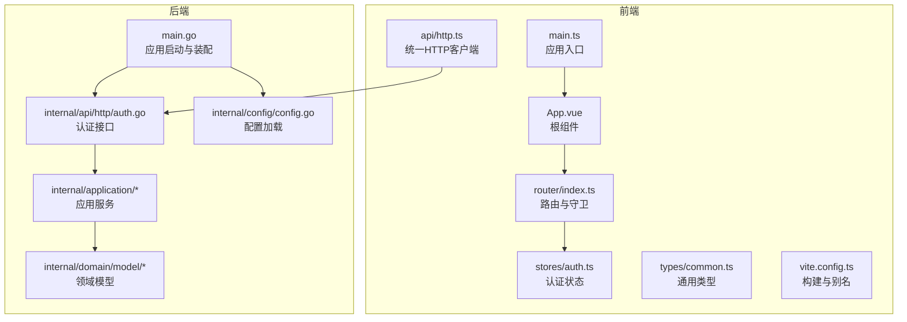
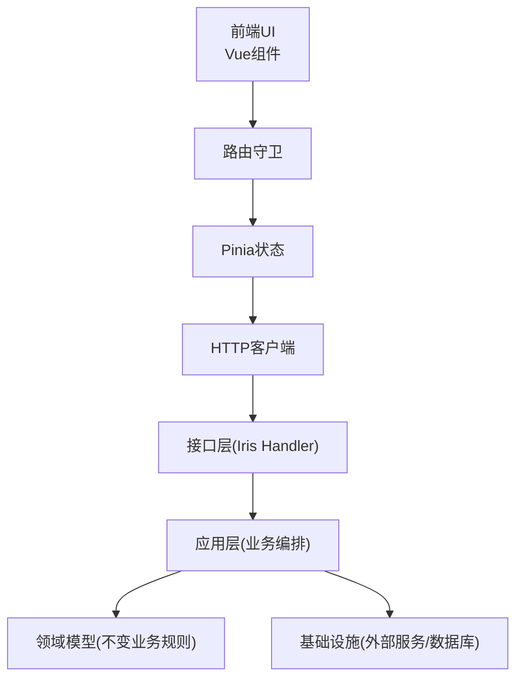
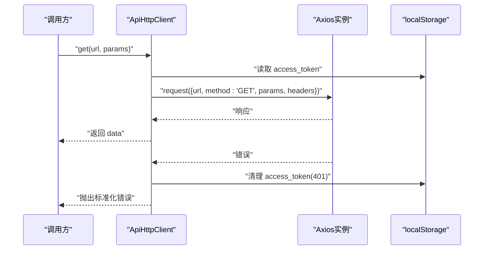
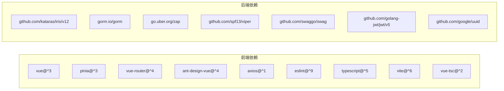

# 代码规范

<cite>
**本文引用的文件**
- [eslint.config.mjs](file://frontend/eslint.config.mjs)
- [tsconfig.json](file://frontend/tsconfig.json)
- [tsconfig.app.json](file://frontend/tsconfig.app.json)
- [tsconfig.node.json](file://frontend/tsconfig.node.json)
- [package.json](file://frontend/package.json)
- [vite.config.ts](file://frontend/vite.config.ts)
- [main.ts](file://frontend/src/main.ts)
- [App.vue](file://frontend/src/App.vue)
- [router/index.ts](file://frontend/src/router/index.ts)
- [stores/auth.ts](file://frontend/src/stores/auth.ts)
- [api/http.ts](file://frontend/src/api/http.ts)
- [types/common.ts](file://frontend/src/types/common.ts)
- [.golangci.yml](file://.golangci.yml)
- [go.mod](file://go.mod)
- [main.go](file://main.go)
- [internal/api/http/auth.go](file://internal/api/http/auth.go)
- [internal/application/error.go](file://internal/application/error.go)
- [internal/domain/model/user.go](file://internal/domain/model/user.go)
- [internal/config/config.go](file://internal/config/config.go)
</cite>

## 目录
1. [简介](#简介)
2. [项目结构](#项目结构)
3. [核心组件](#核心组件)
4. [架构总览](#架构总览)
5. [详细组件分析](#详细组件分析)
6. [依赖分析](#依赖分析)
7. [性能考虑](#性能考虑)
8. [故障排查指南](#故障排查指南)
9. [结论](#结论)
10. [附录](#附录)

## 简介
本文件为 poprako-web-ms 项目的代码规范文档，覆盖前端 TypeScript/Vue 与后端 Go 语言的编码标准、命名约定、最佳实践、ESLint 规则、类型检查、Go 格式化与安全扫描、注释规范、错误处理模式、API 调用模式、状态管理约定以及性能优化建议。目标是帮助团队编写一致、可维护、高质量的代码。

## 项目结构
项目采用前后端分离架构：
- 前端使用 Vue 3 + TypeScript + Vite，通过 Pinia 管理状态，Axios 封装统一 HTTP 客户端，路由守卫保障登录态。
- 后端使用 Iris 框架，按领域模型/应用层/基础设施层分层组织，配合 Swagger 文档与 GORM 数据访问。

图表来源
- [main.ts:1-26](file://frontend/src/main.ts#L1-L26)
- [App.vue:1-45](file://frontend/src/App.vue#L1-L45)
- [router/index.ts:1-54](file://frontend/src/router/index.ts#L1-L54)
- [stores/auth.ts:1-51](file://frontend/src/stores/auth.ts#L1-L51)
- [api/http.ts:1-174](file://frontend/src/api/http.ts#L1-L174)
- [types/common.ts:1-41](file://frontend/src/types/common.ts#L1-L41)
- [vite.config.ts:1-20](file://frontend/vite.config.ts#L1-L20)
- [main.go:1-146](file://main.go#L1-L146)
- [internal/api/http/auth.go:1-73](file://internal/api/http/auth.go#L1-L73)
- [internal/application/error.go:1-8](file://internal/application/error.go#L1-L8)
- [internal/domain/model/user.go:1-100](file://internal/domain/model/user.go#L1-L100)
- [internal/config/config.go:1-101](file://internal/config/config.go#L1-L101)

章节来源
- [main.go:25-145](file://main.go#L25-L145)
- [frontend/vite.config.ts:12-19](file://frontend/vite.config.ts#L12-L19)

## 核心组件
- 前端应用入口负责初始化 Vue、Pinia、路由与 Ant Design Vue，并挂载根组件。
- 根组件通过主题 Provider 提供全局主题能力，并提供主题切换交互。
- 路由模块定义页面入口与前置守卫，强制登录态校验。
- 认证状态使用 Pinia 管理访问令牌与登录态，持久化到 localStorage。
- HTTP 客户端统一封装请求头注入、错误处理与通用方法，支持查询参数序列化。
- 后端入口负责加载环境变量与配置、装配各应用层服务并启动 HTTP 服务器。
- 认证接口处理登录/注册，返回统一结果或错误。
- 应用层错误常量统一内部错误码。
- 领域模型定义用户信息、凭据与创建/更新结构。
- 配置模块负责 JSON 配置文件加载与环境变量校验。

章节来源
- [frontend/src/main.ts:16-26](file://frontend/src/main.ts#L16-L26)
- [frontend/src/App.vue:19-28](file://frontend/src/App.vue#L19-L28)
- [frontend/src/router/index.ts:42-51](file://frontend/src/router/index.ts#L42-L51)
- [frontend/src/stores/auth.ts:15-50](file://frontend/src/stores/auth.ts#L15-L50)
- [frontend/src/api/http.ts:27-82](file://frontend/src/api/http.ts#L27-L82)
- [main.go:25-145](file://main.go#L25-L145)
- [internal/api/http/auth.go:22-40](file://internal/api/http/auth.go#L22-L40)
- [internal/application/error.go:3-7](file://internal/application/error.go#L3-L7)
- [internal/domain/model/user.go:7-41](file://internal/domain/model/user.go#L7-L41)
- [internal/config/config.go:11-59](file://internal/config/config.go#L11-L59)

## 架构总览
系统遵循“表现层-应用层-领域层-基础设施层”的分层架构，接口层通过 Swagger 注解生成文档，应用层编排业务流程，领域层承载不变的业务规则，基础设施层负责外部集成与数据持久化。

图表来源
- [frontend/src/App.vue:19-28](file://frontend/src/App.vue#L19-L28)
- [frontend/src/router/index.ts:42-51](file://frontend/src/router/index.ts#L42-L51)
- [frontend/src/stores/auth.ts:15-50](file://frontend/src/stores/auth.ts#L15-L50)
- [frontend/src/api/http.ts:27-82](file://frontend/src/api/http.ts#L27-L82)
- [internal/api/http/auth.go:22-40](file://internal/api/http/auth.go#L22-L40)
- [internal/application/error.go:3-7](file://internal/application/error.go#L3-L7)
- [internal/domain/model/user.go:7-41](file://internal/domain/model/user.go#L7-L41)

## 详细组件分析

### 前端：应用入口与根组件
- 入口文件负责创建应用实例、安装插件与挂载根组件。
- 根组件提供全局主题 Provider 与主题切换交互，样式采用 SCSS 并使用 CSS 变量。

章节来源
- [frontend/src/main.ts:16-26](file://frontend/src/main.ts#L16-L26)
- [frontend/src/App.vue:19-28](file://frontend/src/App.vue#L19-L28)

### 前端：路由与守卫
- 定义登录、仪表盘等路由，并在前置守卫中校验登录态，未登录跳转登录页，已登录访问登录页重定向仪表盘。

章节来源
- [frontend/src/router/index.ts:14-29](file://frontend/src/router/index.ts#L14-L29)
- [frontend/src/router/index.ts:42-51](file://frontend/src/router/index.ts#L42-L51)

### 前端：状态管理（Pinia）
- 使用 defineStore 定义认证 Store，维护访问令牌与登录态，提供设置与清除方法，并持久化到 localStorage。

章节来源
- [frontend/src/stores/auth.ts:15-50](file://frontend/src/stores/auth.ts#L15-L50)

### 前端：HTTP 客户端
- 统一创建 Axios 实例，设置基础路径与超时；安装请求拦截器自动注入 Bearer Token；安装响应拦截器标准化错误并处理 401 场景；提供通用请求与常用 HTTP 方法；对 includes[] 等查询参数进行序列化。

图表来源
- [frontend/src/api/http.ts:87-102](file://frontend/src/api/http.ts#L87-L102)
- [frontend/src/api/http.ts:38-82](file://frontend/src/api/http.ts#L38-L82)

章节来源
- [frontend/src/api/http.ts:18-174](file://frontend/src/api/http.ts#L18-L174)
- [frontend/src/types/common.ts:31-40](file://frontend/src/types/common.ts#L31-L40)

### 前端：类型与配置
- 通用类型包括分页参数、包含字段查询与统一错误结构。
- TypeScript 采用复合 tsconfig 引用模式，分别针对应用与 Node 工具链。
- ESLint 配置启用 Vue3 推荐规则，关闭多单词组件名强制与显式 any 警告，支持 Vue 单文件与 TS 解析。

章节来源
- [frontend/src/types/common.ts:7-16](file://frontend/src/types/common.ts#L7-L16)
- [frontend/src/types/common.ts:21-26](file://frontend/src/types/common.ts#L21-L26)
- [frontend/src/types/common.ts:31-40](file://frontend/src/types/common.ts#L31-L40)
- [frontend/tsconfig.json:1-12](file://frontend/tsconfig.json#L1-L12)
- [frontend/tsconfig.app.json](file://frontend/tsconfig.app.json)
- [frontend/tsconfig.node.json](file://frontend/tsconfig.node.json)
- [frontend/eslint.config.mjs:7-40](file://frontend/eslint.config.mjs#L7-L40)
- [frontend/package.json:6-12](file://frontend/package.json#L6-L12)

### 后端：应用启动与装配
- 加载 .env，读取 JSON 配置文件，初始化日志与数据库执行器，装配各应用层服务，最终启动 HTTP 服务器。

章节来源
- [main.go:25-145](file://main.go#L25-L145)

### 后端：认证接口
- 登录/注册接口接收 JSON 参数，读取失败返回 400，业务错误返回 401/400，成功返回统一结果。

章节来源
- [internal/api/http/auth.go:22-40](file://internal/api/http/auth.go#L22-L40)
- [internal/api/http/auth.go:54-72](file://internal/api/http/auth.go#L54-L72)

### 后端：应用层错误常量
- 内部错误统一使用固定错误码，便于前端识别与处理。

章节来源
- [internal/application/error.go:3-7](file://internal/application/error.go#L3-L7)

### 后端：领域模型（用户）
- 用户信息、凭据与创建/更新结构清晰分离，避免在登录时暴露完整用户信息。

章节来源
- [internal/domain/model/user.go:7-41](file://internal/domain/model/user.go#L7-L41)
- [internal/domain/model/user.go:44-54](file://internal/domain/model/user.go#L44-L54)
- [internal/domain/model/user.go:56-78](file://internal/domain/model/user.go#L56-L78)
- [internal/domain/model/user.go:80-99](file://internal/domain/model/user.go#L80-L99)

### 后端：配置加载
- 通过 Viper 读取 JSON 配置文件并映射到结构体，同时校验关键环境变量是否存在。

章节来源
- [internal/config/config.go:11-59](file://internal/config/config.go#L11-L59)
- [internal/config/config.go:69-83](file://internal/config/config.go#L69-L83)
- [internal/config/config.go:85-100](file://internal/config/config.go#L85-L100)

## 依赖分析
- 前端依赖：Vue 3、Pinia、Vue Router、Ant Design Vue、Axios、ESLint、TypeScript、Vite、Vue TSC。
- 后端依赖：Iris、GORM、Zap 日志、Viper 配置、Swag/Swagger 文档、JWT、UUID 等。

图表来源
- [frontend/package.json:13-34](file://frontend/package.json#L13-L34)
- [go.mod:5-18](file://go.mod#L5-L18)

章节来源
- [frontend/package.json:13-34](file://frontend/package.json#L13-L34)
- [go.mod:5-18](file://go.mod#L5-L18)

## 性能考虑
- 前端
  - 使用 Vite 构建，启用按需加载与动态导入，减少首屏体积。
  - Pinia 状态粒度合理，避免不必要的响应式开销。
  - Axios 超时设置适中，避免长时间阻塞。
- 后端
  - 使用 GORM 与连接池配置，结合最小空闲与最大打开连接数限制。
  - 启动阶段一次性装配应用层服务，运行期避免重复初始化。
  - Swagger 文档自动生成，减少手写文档成本与不一致风险。

章节来源
- [frontend/vite.config.ts:12-19](file://frontend/vite.config.ts#L12-L19)
- [frontend/src/api/http.ts:29-31](file://frontend/src/api/http.ts#L29-L31)
- [internal/config/config.go:85-99](file://internal/config/config.go#L85-L99)
- [main.go:124-136](file://main.go#L124-L136)

## 故障排查指南
- 前端
  - ESLint 报错：检查规则配置与文件扩展名忽略策略，确保 .vue 与 .ts 正确解析。
  - 类型检查失败：使用 vue-tsc 指定 tsconfig.app.json 进行类型检查。
  - HTTP 401：客户端会自动清理本地令牌并跳转登录页，确认后端 JWT 签发与前端存储一致。
- 后端
  - 配置加载失败：检查 app_config.json 与环境变量是否齐全，关注 Viper 映射错误。
  - Swagger 文档异常：确认接口注释与路由路径一致，确保 Swag 工具可用。

章节来源
- [frontend/eslint.config.mjs:7-40](file://frontend/eslint.config.mjs#L7-L40)
- [frontend/package.json:8-10](file://frontend/package.json#L8-L10)
- [frontend/src/api/http.ts:74-82](file://frontend/src/api/http.ts#L74-L82)
- [internal/config/config.go:36-42](file://internal/config/config.go#L36-L42)
- [internal/config/config.go:44-47](file://internal/config/config.go#L44-L47)

## 结论
本规范明确了前后端的编码风格、工具链配置与最佳实践，建议在日常开发中严格遵循命名约定、注释规范、错误处理与性能优化建议，以保证代码质量与可维护性。

## 附录

### 命名约定与注释规范
- 前端
  - 组件与模块：帕斯卡命名（如 Http.ts），文件夹采用小驼峰或功能域命名。
  - 类型与接口：首字母大写，语义明确（如 PaginationQuery）。
  - 常量：全大写下划线（如 ACCESS_TOKEN_STORAGE_KEY）。
  - 注释：函数/类上方使用三斜杠注释，简述职责与参数/返回值。
- 后端
  - 包与导出类型：首字母大写，语义清晰（如 AppState、UserInfo）。
  - 函数：首字母小写（如 load），导出函数首字母大写。
  - 注释：GoDoc 风格，描述用途、参数、返回与路由信息。

章节来源
- [frontend/src/stores/auth.ts:10](file://frontend/src/stores/auth.ts#L10)
- [frontend/src/types/common.ts:7-16](file://frontend/src/types/common.ts#L7-L16)
- [internal/domain/model/user.go:7-41](file://internal/domain/model/user.go#L7-L41)
- [internal/api/http/auth.go:10-21](file://internal/api/http/auth.go#L10-L21)

### ESLint 配置要点
- 语言选项：Vue 解析器与 TS 解析器组合，支持 .vue 单文件与最新 ECMAScript。
- 插件：TypeScript ESLint 与 Vue 插件，启用推荐规则集。
- 规则：关闭多单词组件名强制与显式 any 警告，保留推荐规则。

章节来源
- [frontend/eslint.config.mjs:12-39](file://frontend/eslint.config.mjs#L12-L39)

### TypeScript 类型检查与构建
- 使用复合 tsconfig 引用，分别指向应用与 Node 工具链配置。
- 构建脚本串联 Lint、类型检查与打包，确保质量门禁。

章节来源
- [frontend/tsconfig.json:3-10](file://frontend/tsconfig.json#L3-L10)
- [frontend/package.json:8-11](file://frontend/package.json#L8-L11)

### Go 语言格式化与安全扫描
- 格式化：启用 gofmt 与 goimports。
- 安全与静态分析：启用 vet、staticcheck、errcheck、ineffassign、unused、gosec、gocritic、misspell 等。

章节来源
- [.golangci.yml:20-31](file://.golangci.yml#L20-L31)
- [.golangci.yml:7-19](file://.golangci.yml#L7-L19)

### 错误处理模式
- 前端：统一错误结构与 401 自动登出，Promise 拒绝携带标准化错误消息。
- 后端：接口层根据读取/业务错误返回不同状态码，应用层使用统一内部错误码。

章节来源
- [frontend/src/types/common.ts:31-40](file://frontend/src/types/common.ts#L31-L40)
- [frontend/src/api/http.ts:67-82](file://frontend/src/api/http.ts#L67-L82)
- [internal/api/http/auth.go:27-36](file://internal/api/http/auth.go#L27-L36)
- [internal/application/error.go:3-7](file://internal/application/error.go#L3-L7)

### API 调用模式与状态管理约定
- API 调用：通过统一 HTTP 客户端发起请求，自动注入令牌，错误统一处理。
- 状态管理：Pinia Store 维护访问令牌与登录态，持久化到 localStorage，路由守卫基于 Store 判断跳转。

章节来源
- [frontend/src/api/http.ts:49-62](file://frontend/src/api/http.ts#L49-L62)
- [frontend/src/stores/auth.ts:19-42](file://frontend/src/stores/auth.ts#L19-L42)
- [frontend/src/router/index.ts:42-51](file://frontend/src/router/index.ts#L42-L51)