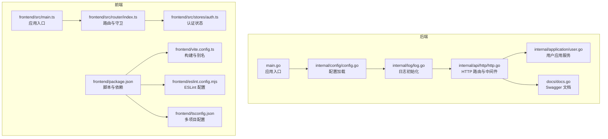
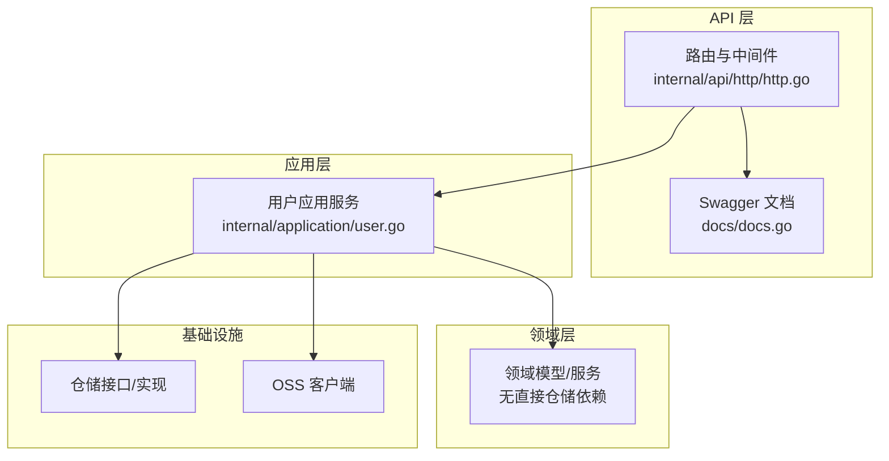
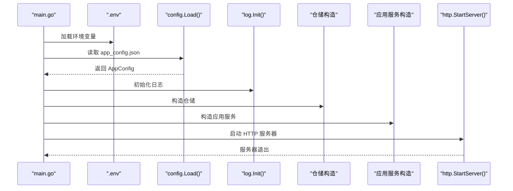
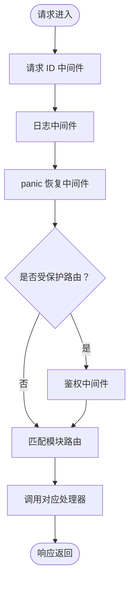
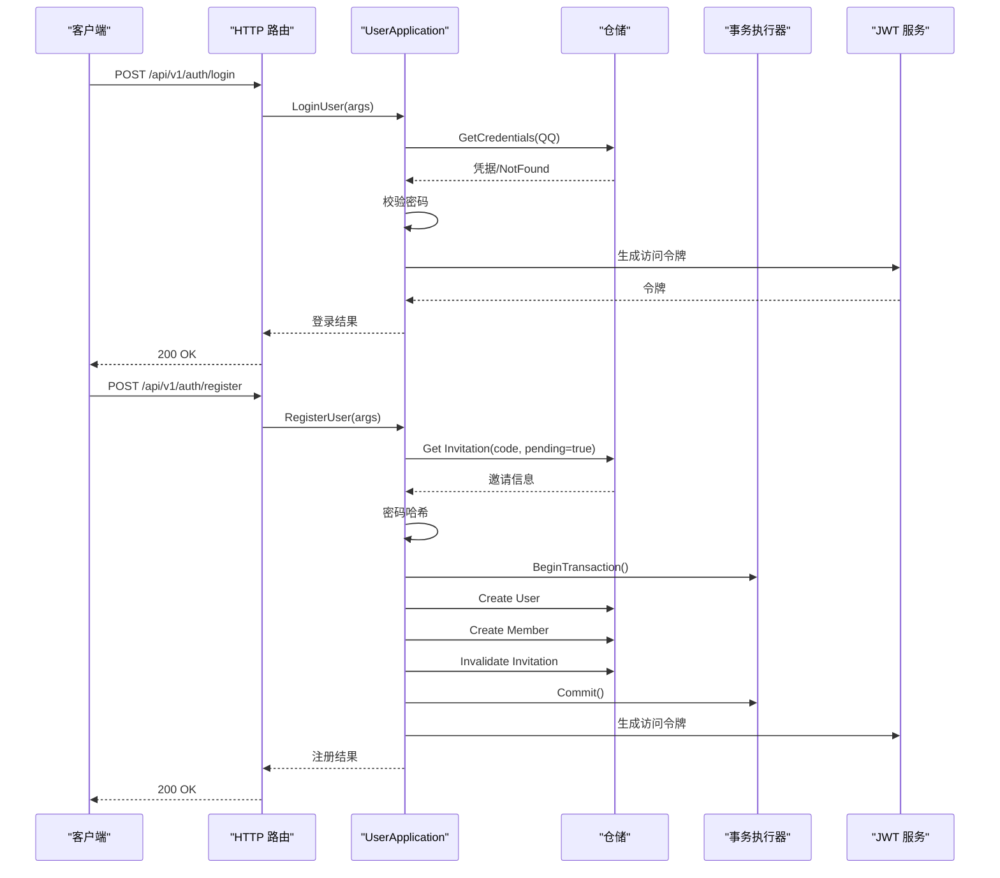
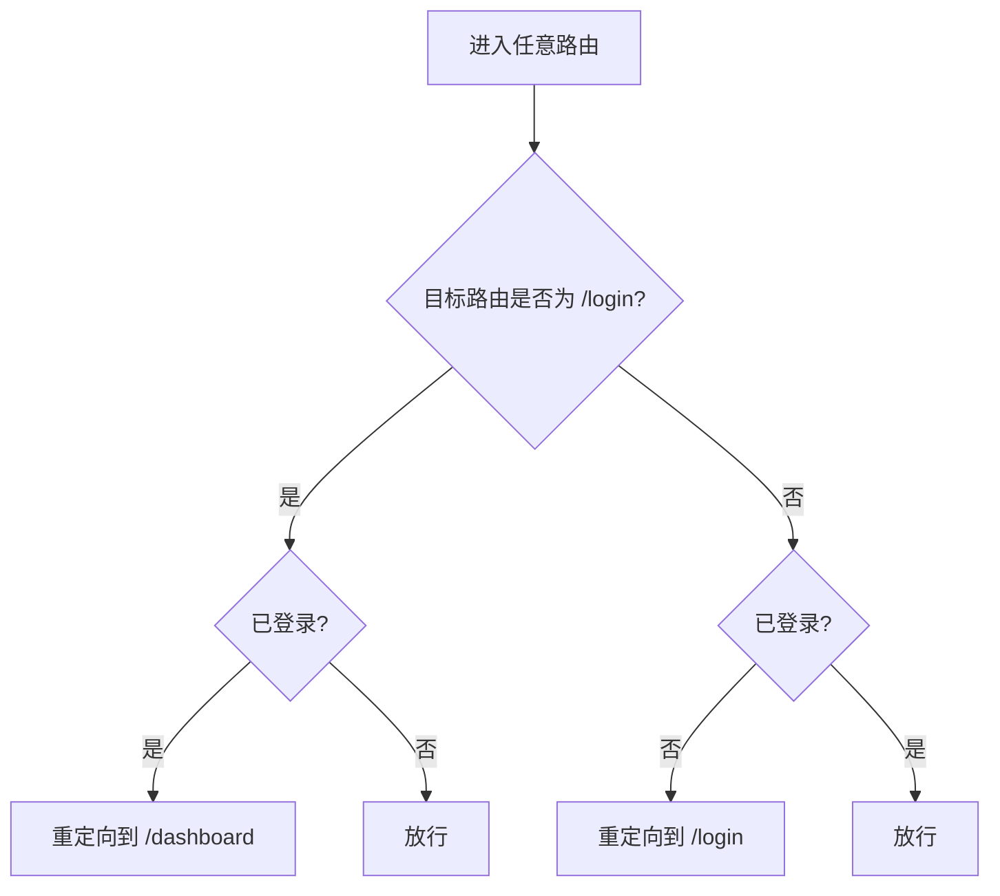
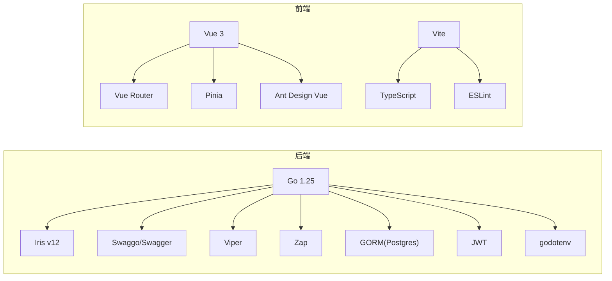

# 开发指南

<cite>
**本文引用的文件**
- [main.go](file://main.go)
- [go.mod](file://go.mod)
- [.golangci.yml](file://.golangci.yml)
- [justfile](file://justfile)
- [docs.go](file://docs/docs.go)
- [internal/config/config.go](file://internal/config/config.go)
- [internal/log/log.go](file://internal/log/log.go)
- [internal/api/http/http.go](file://internal/api/http/http.go)
- [internal/application/user.go](file://internal/application/user.go)
- [frontend/package.json](file://frontend/package.json)
- [frontend/vite.config.ts](file://frontend/vite.config.ts)
- [frontend/tsconfig.json](file://frontend/tsconfig.json)
- [frontend/eslint.config.mjs](file://frontend/eslint.config.mjs)
- [frontend/src/main.ts](file://frontend/src/main.ts)
- [frontend/src/router/index.ts](file://frontend/src/router/index.ts)
- [frontend/src/stores/auth.ts](file://frontend/src/stores/auth.ts)
- [docs/ARCHETECT.md](file://docs/ARCHETECT.md)
</cite>

## 目录
1. [简介](#简介)
2. [项目结构](#项目结构)
3. [核心组件](#核心组件)
4. [架构总览](#架构总览)
5. [详细组件分析](#详细组件分析)
6. [依赖分析](#依赖分析)
7. [性能考虑](#性能考虑)
8. [故障排查指南](#故障排查指南)
9. [结论](#结论)
10. [附录](#附录)

## 简介
本开发指南面向 poprako-web-ms 项目的后端 Go 与前端 TypeScript/Vue 团队，提供从环境搭建、代码规范、调试与测试策略到发布流程的完整指引。内容覆盖：
- Go 与 TypeScript 编码规范、命名约定与最佳实践
- 开发工具链与 IDE 推荐
- 单元测试、集成测试与端到端测试编写方法
- 代码审查清单、性能分析与调试技巧
- 贡献指南、分支管理与发布流程

## 项目结构
项目采用前后端分离与模块化组织，后端基于 Iris 框架与 Swagger 文档生成，前端基于 Vue 3 + Vite + TypeScript + ESLint + Pinia + Vue Router。

**图表来源**
- [main.go:25-145](file://main.go#L25-L145)
- [internal/config/config.go:11-59](file://internal/config/config.go#L11-L59)
- [internal/log/log.go:13-83](file://internal/log/log.go#L13-L83)
- [internal/api/http/http.go:16-166](file://internal/api/http/http.go#L16-L166)
- [internal/application/user.go:106-278](file://internal/application/user.go#L106-L278)
- [docs/docs.go:1-200](file://docs/docs.go#L1-L200)
- [frontend/package.json:6-12](file://frontend/package.json#L6-L12)
- [frontend/vite.config.ts:12-19](file://frontend/vite.config.ts#L12-L19)
- [frontend/tsconfig.json:1-12](file://frontend/tsconfig.json#L1-L12)
- [frontend/eslint.config.mjs:7-40](file://frontend/eslint.config.mjs#L7-L40)
- [frontend/src/main.ts:16-26](file://frontend/src/main.ts#L16-L26)
- [frontend/src/router/index.ts:42-51](file://frontend/src/router/index.ts#L42-L51)
- [frontend/src/stores/auth.ts:15-50](file://frontend/src/stores/auth.ts#L15-L50)

**章节来源**
- [main.go:25-145](file://main.go#L25-L145)
- [frontend/package.json:6-12](file://frontend/package.json#L6-L12)

## 核心组件
- 应用入口与生命周期
  - 加载 .env 环境变量
  - 读取 app_config.json 并解析为运行时配置
  - 初始化日志系统（开发/生产差异化）
  - 构造仓储与应用服务实例
  - 启动 HTTP 服务器并监听

- 配置与日志
  - 配置加载：Viper 读取 JSON 配置，结合环境变量注入敏感参数
  - 日志：开发环境彩色控制台输出；生产环境 JSON + 文件轮转，级别提升

- HTTP 服务与中间件
  - Iris 默认应用，内置请求 ID、panic 恢复、日志中间件
  - Swagger UI 在非生产环境启用
  - 路由按模块划分（认证、用户、团队、成员、邀请、漫画、工作集、章节、页面、分配、单元）

- 应用服务（示例：用户）
  - 登录/注册参数校验
  - 密码哈希与 JWT 令牌签发
  - 事务一致性保障（注册场景）
  - 权限检查与鉴权

- 前端入口与状态
  - Vue 应用初始化、Pinia、Ant Design Vue 注册
  - 路由守卫：未登录禁止访问受保护路由，已登录禁止访问登录页
  - 认证状态：本地存储访问令牌，计算是否登录

**章节来源**
- [main.go:25-145](file://main.go#L25-L145)
- [internal/config/config.go:11-101](file://internal/config/config.go#L11-L101)
- [internal/log/log.go:13-83](file://internal/log/log.go#L13-L83)
- [internal/api/http/http.go:16-166](file://internal/api/http/http.go#L16-L166)
- [internal/application/user.go:106-278](file://internal/application/user.go#L106-L278)
- [frontend/src/main.ts:16-26](file://frontend/src/main.ts#L16-L26)
- [frontend/src/router/index.ts:42-51](file://frontend/src/router/index.ts#L42-L51)
- [frontend/src/stores/auth.ts:15-50](file://frontend/src/stores/auth.ts#L15-L50)

## 架构总览
项目采用“部分 DDD 的三层架构”思路：
- Domain 层：领域模型与服务（不含依赖具体仓储的领域服务，事务与仓储操作上提至 Application 层）
- Application 层：应用服务编排业务流程、事务与鉴权
- Infrastructure/Repository：仓储实现与外部依赖（如 OSS 客户端）
- API 层：HTTP 路由与 Swagger 文档

**图表来源**
- [internal/api/http/http.go:16-166](file://internal/api/http/http.go#L16-L166)
- [docs/docs.go:1-200](file://docs/docs.go#L1-L200)
- [internal/application/user.go:106-278](file://internal/application/user.go#L106-L278)
- [docs/ARCHETECT.md:1-36](file://docs/ARCHETECT.md#L1-L36)

**章节来源**
- [docs/ARCHETECT.md:1-36](file://docs/ARCHETECT.md#L1-L36)

## 详细组件分析

### 后端：应用入口与配置加载
- 入口职责
  - 加载 .env
  - 读取 app_config.json 并解析
  - 初始化日志
  - 构造仓储与应用服务
  - 启动 HTTP 服务器

- 配置加载要点
  - 使用 Viper 读取 JSON 配置文件
  - 通过环境变量注入敏感参数（JWT 秘钥、数据库连接、环境）
  - 提供开发/生产环境判断

- 日志初始化
  - 开发：彩色控制台输出，Debug 级别
  - 生产：JSON 输出 + 文件轮转，Warn 级别

**图表来源**
- [main.go:25-145](file://main.go#L25-L145)
- [internal/config/config.go:11-59](file://internal/config/config.go#L11-L59)
- [internal/log/log.go:13-83](file://internal/log/log.go#L13-L83)

**章节来源**
- [main.go:25-145](file://main.go#L25-L145)
- [internal/config/config.go:11-101](file://internal/config/config.go#L11-L101)
- [internal/log/log.go:13-83](file://internal/log/log.go#L13-L83)

### 后端：HTTP 路由与中间件
- 中间件
  - 请求 ID、日志、panic 恢复
  - 鉴权中间件（受保护路由）
- 路由分组
  - /api/v1 下按模块划分（认证、用户、团队、成员、邀请、漫画、工作集、章节、页面、分配、单元）
- Swagger UI
  - 非生产环境自动启用

**图表来源**
- [internal/api/http/http.go:26-166](file://internal/api/http/http.go#L26-L166)

**章节来源**
- [internal/api/http/http.go:16-166](file://internal/api/http/http.go#L16-L166)

### 后端：用户应用服务（登录/注册）
- 登录
  - 参数校验
  - 查询用户凭据（QQ）
  - 密码校验
  - 生成 JWT 访问令牌
- 注册
  - 参数校验
  - 校验邀请码与状态
  - 密码哈希
  - 事务：创建用户 -> 创建成员 -> 标记邀请为已使用
  - 生成 JWT 访问令牌

**图表来源**
- [internal/application/user.go:106-278](file://internal/application/user.go#L106-L278)

**章节来源**
- [internal/application/user.go:106-278](file://internal/application/user.go#L106-L278)

### 前端：应用入口与路由守卫
- 入口
  - 创建 Vue 应用，注册 Pinia、Router、Ant Design Vue
  - 挂载 #app
- 路由守卫
  - 未登录禁止访问受保护路由，自动跳转登录
  - 已登录禁止访问登录页，自动跳转仪表盘
- 认证状态
  - 本地存储访问令牌
  - 计算属性判断登录态

**图表来源**
- [frontend/src/router/index.ts:42-51](file://frontend/src/router/index.ts#L42-L51)
- [frontend/src/stores/auth.ts:15-50](file://frontend/src/stores/auth.ts#L15-L50)

**章节来源**
- [frontend/src/main.ts:16-26](file://frontend/src/main.ts#L16-L26)
- [frontend/src/router/index.ts:42-51](file://frontend/src/router/index.ts#L42-L51)
- [frontend/src/stores/auth.ts:15-50](file://frontend/src/stores/auth.ts#L15-L50)

## 依赖分析
- 后端依赖
  - Web 框架：Iris v12
  - 文档：Swaggo + Swagger UI
  - 配置：Viper
  - 日志：Zap + Lumberjack
  - 数据库：GORM + Postgres
  - 安全：JWT
  - 工具：godotenv

- 前端依赖
  - 框架：Vue 3
  - 路由：Vue Router
  - 状态：Pinia
  - UI：Ant Design Vue
  - 构建：Vite
  - 类型与校验：TypeScript + ESLint + Vue ESLint Parser

**图表来源**
- [go.mod:5-18](file://go.mod#L5-L18)
- [frontend/package.json:13-34](file://frontend/package.json#L13-L34)

**章节来源**
- [go.mod:5-18](file://go.mod#L5-L18)
- [frontend/package.json:13-34](file://frontend/package.json#L13-L34)

## 性能考虑
- 日志级别与输出
  - 开发：Debug 级别，彩色控制台，便于快速定位问题
  - 生产：Warn 级别 + JSON + 文件轮转，降低 I/O 压力
- 数据库连接池
  - 通过配置项设置最小空闲与最大打开连接数，避免连接争用
- 中间件开销
  - 请求 ID、日志与恢复中间件为通用能力，建议保持开启以提升可观测性
- 前端构建
  - Vite 快速冷启动与热更新；生产构建开启类型检查与 ESLint，保证质量

[本节为通用指导，无需列出章节来源]

## 故障排查指南
- 启动失败
  - 检查 .env 与 app_config.json 是否存在且格式正确
  - 确认环境变量（APP_ENVIRONMENT、JWT_SECRET_KEY、DATABASE_URL）是否设置
- HTTP 服务异常
  - 查看日志输出（控制台或 logs/main-service.log）
  - 确认 Swagger UI 在非生产环境可用
- 登录/注册失败
  - 核对参数校验与邀请码状态
  - 检查事务是否成功提交（注册场景）
- 前端路由跳转异常
  - 检查认证状态与本地存储访问令牌
  - 确认路由守卫逻辑与登录/仪表盘路径映射

**章节来源**
- [internal/config/config.go:29-59](file://internal/config/config.go#L29-L59)
- [internal/log/log.go:13-83](file://internal/log/log.go#L13-L83)
- [internal/api/http/http.go:153-166](file://internal/api/http/http.go#L153-L166)
- [internal/application/user.go:106-278](file://internal/application/user.go#L106-L278)
- [frontend/src/router/index.ts:42-51](file://frontend/src/router/index.ts#L42-L51)
- [frontend/src/stores/auth.ts:15-50](file://frontend/src/stores/auth.ts#L15-L50)

## 结论
本指南提供了 poprako-web-ms 项目的开发与维护路径：从环境与工具配置，到代码规范与测试策略，再到调试与发布流程。建议团队在日常开发中遵循本文档的规范与流程，持续提升代码质量与交付效率。

[本节为总结性内容，无需列出章节来源]

## 附录

### A. Go 代码规范与最佳实践
- 命名约定
  - 包名小写、简短、描述性强
  - 类型与接口使用名词，方法尽量动词开头
  - 错误变量使用 err，避免忽略错误
- 结构与职责
  - 严格分层：API -> Application -> Domain/Infrastructure
  - 应用服务负责事务与鉴权，领域服务保持纯函数
- 错误处理
  - 明确错误传播与包装，保留上下文
  - 对外暴露稳定错误消息，内部记录详细日志
- 日志
  - 使用 Zap，开发/生产差异化配置
  - 为每个函数记录 TraceScope 与关键字段

**章节来源**
- [internal/application/user.go:106-278](file://internal/application/user.go#L106-L278)
- [internal/log/log.go:13-83](file://internal/log/log.go#L13-L83)

### B. TypeScript/前端代码规范与最佳实践
- 命名约定
  - 组件文件使用 PascalCase，store 使用 useXxx 命名
  - 路由守卫逻辑清晰，避免硬编码路径
- 类型安全
  - 使用 TypeScript 严格模式，禁用 any
  - ESLint 规则覆盖 Vue 3 与 TS
- 构建与质量
  - 生产构建前执行 ESLint 与类型检查
  - Vite 别名统一，路径解析清晰

**章节来源**
- [frontend/eslint.config.mjs:7-40](file://frontend/eslint.config.mjs#L7-L40)
- [frontend/tsconfig.json:1-12](file://frontend/tsconfig.json#L1-L12)
- [frontend/vite.config.ts:12-19](file://frontend/vite.config.ts#L12-L19)
- [frontend/src/router/index.ts:42-51](file://frontend/src/router/index.ts#L42-L51)
- [frontend/src/stores/auth.ts:15-50](file://frontend/src/stores/auth.ts#L15-L50)

### C. 开发工具与 IDE 设置
- Go
  - 使用 golangci-lint（配置见 .golangci.yml）
  - VS Code 插件：Go、Swagger、YAML
- TypeScript/Vue
  - VS Code 插件：ESLint、Vue Language Features、Volar
  - 使用 pnpm 作为包管理器
- 任务编排
  - Justfile 提供常用任务：代码检查、格式化、Swagger 生成、迁移、种子数据

**章节来源**
- [.golangci.yml:1-31](file://.golangci.yml#L1-L31)
- [frontend/package.json:6-12](file://frontend/package.json#L6-L12)
- [justfile:6-39](file://justfile#L6-L39)

### D. 测试策略
- 单元测试
  - 后端：针对应用服务与领域逻辑，使用仓库接口的模拟实现
  - 前端：针对 store 与工具函数，使用 Jest 或 Vitest（建议）
- 集成测试
  - 后端：使用测试数据库，验证路由、鉴权、事务与错误处理
  - 前端：使用 Vue Test Utils，覆盖路由守卫与组件交互
- 端到端测试
  - 使用 Playwright/Cypress，覆盖登录、导航与关键业务流程

[本节为通用指导，无需列出章节来源]

### E. 代码审查清单
- 后端
  - 配置加载与环境变量检查
  - 日志级别与字段完整性
  - 事务边界与回滚处理
  - 鉴权与权限检查
  - 错误消息对外友好，内部详细
- 前端
  - 路由守卫逻辑正确性
  - 认证状态同步与本地存储
  - ESLint 与类型检查通过
  - 构建产物质量（lint + type-check）

[本节为通用指导，无需列出章节来源]

### F. 性能分析与调试技巧
- 后端
  - 使用 Zap 记录关键路径耗时与错误
  - 生产环境启用 JSON 日志与文件轮转
  - 使用 Swagger UI 快速验证接口行为
- 前端
  - 使用浏览器 DevTools 分析网络与渲染
  - Vite 热更新加速迭代
  - ESLint 与类型检查提前发现潜在问题

**章节来源**
- [internal/log/log.go:13-83](file://internal/log/log.go#L13-L83)
- [internal/api/http/http.go:153-166](file://internal/api/http/http.go#L153-L166)
- [frontend/package.json:6-12](file://frontend/package.json#L6-L12)

### G. 贡献指南、分支管理与发布流程
- 分支管理
  - 主干保护：master/main 保护，变更通过 Pull Request
  - 功能分支：feature/xxx，修复分支：fix/xxx
- 提交规范
  - 标准化提交信息，配合变更日志
- 代码审查
  - 至少一名维护者批准
  - 通过 CI（lint、测试）
- 发布流程
  - 版本标签：语义化版本
  - 生成 Swagger 文档与构建产物
  - 迁移脚本与种子数据（如有）

[本节为通用指导，无需列出章节来源]