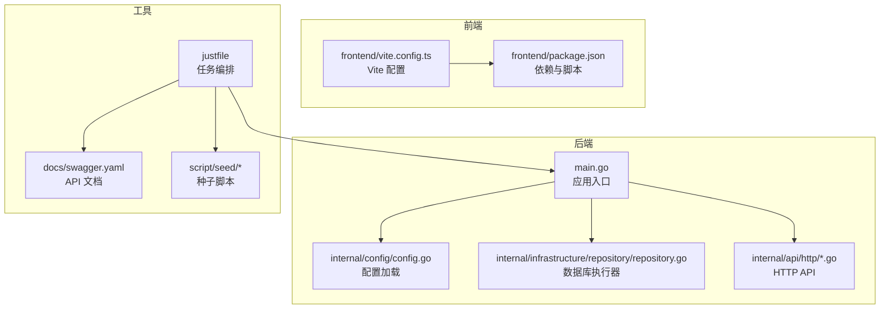
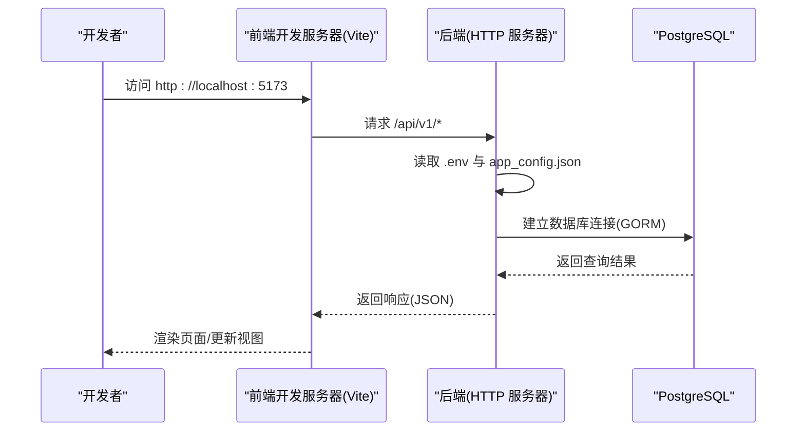
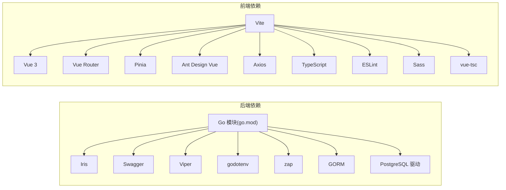

# 开发环境配置

<cite>
**本文引用的文件**
- [go.mod](file://go.mod)
- [main.go](file://main.go)
- [justfile](file://justfile)
- [app_config.json](file://app_config.json)
- [internal/config/config.go](file://internal/config/config.go)
- [internal/infrastructure/repository/repository.go](file://internal/infrastructure/repository/repository.go)
- [frontend/package.json](file://frontend/package.json)
- [frontend/vite.config.ts](file://frontend/vite.config.ts)
- [frontend/src/env.d.ts](file://frontend/src/env.d.ts)
- [docs/swagger.yaml](file://docs/swagger.yaml)
- [script/seed/README.md](file://script/seed/README.md)
- [script/seed/config.ts](file://script/seed/config.ts)
</cite>

## 目录
1. [简介](#简介)
2. [项目结构](#项目结构)
3. [核心组件](#核心组件)
4. [架构总览](#架构总览)
5. [详细组件分析](#详细组件分析)
6. [依赖分析](#依赖分析)
7. [性能考虑](#性能考虑)
8. [故障排除指南](#故障排除指南)
9. [结论](#结论)
10. [附录](#附录)

## 简介
本指南面向 poprako-web-ms 项目的开发者，提供从零开始搭建本地开发环境的完整步骤，涵盖后端 Go 环境、前端 Node.js 环境、数据库配置、依赖安装、环境变量与配置文件设置、IDE 建议、调试配置、开发服务器启动与热重载、代理设置、数据库初始化与迁移、种子数据加载，以及常见问题排查。

## 项目结构
该项目采用前后端分离架构：
- 后端：Go 语言，基于 Iris 框架，使用 GORM 进行数据库访问，通过 Viper 读取 JSON 配置，通过 godotenv 加载 .env 环境变量。
- 前端：Vue 3 + TypeScript + Vite，使用 Pinia、Vue Router、Ant Design Vue。
- 数据库：PostgreSQL（通过 GORM PostgreSQL 驱动连接）。
- 工具链：Justfile 提供常用任务（如生成 Swagger 文档、代码检查、迁移、种子数据等）；Bun 用于种子脚本运行。

图表来源
- [main.go:25-145](file://main.go#L25-L145)
- [internal/config/config.go:11-59](file://internal/config/config.go#L11-L59)
- [internal/infrastructure/repository/repository.go:11-29](file://internal/infrastructure/repository/repository.go#L11-L29)
- [frontend/vite.config.ts:12-19](file://frontend/vite.config.ts#L12-L19)
- [frontend/package.json:6-12](file://frontend/package.json#L6-L12)
- [justfile:6-38](file://justfile#L6-L38)
- [docs/swagger.yaml:1-200](file://docs/swagger.yaml#L1-L200)
- [script/seed/README.md:3-15](file://script/seed/README.md#L3-L15)

章节来源
- [go.mod:1-114](file://go.mod#L1-L114)
- [main.go:25-145](file://main.go#L25-L145)
- [frontend/package.json:1-36](file://frontend/package.json#L1-L36)
- [frontend/vite.config.ts:1-20](file://frontend/vite.config.ts#L1-L20)
- [justfile:1-39](file://justfile#L1-L39)

## 核心组件
- 应用入口与生命周期
  - 应用入口加载 .env 环境变量，读取 JSON 配置，初始化日志、数据库连接，组装各应用层服务，最后启动 HTTP 服务器。
- 配置系统
  - 通过 Viper 读取 app_config.json，结合环境变量 APP_ENVIRONMENT、JWT_SECRET_KEY、DATABASE_URL 完成配置注入。
- 数据库连接
  - 使用 GORM PostgreSQL 驱动，根据配置设置最大空闲连接数与最大打开连接数。
- 前端构建与开发
  - Vite 提供开发服务器与热重载，Vue 插件自动注册，路径别名 @ 指向 src。
- 工具链与任务
  - Justfile 提供 swag、check、fmt、dev、build、mgr-*、seed-* 等任务；Bun 用于种子脚本运行。

章节来源
- [main.go:25-145](file://main.go#L25-L145)
- [internal/config/config.go:11-100](file://internal/config/config.go#L11-L100)
- [internal/infrastructure/repository/repository.go:11-29](file://internal/infrastructure/repository/repository.go#L11-L29)
- [frontend/vite.config.ts:12-19](file://frontend/vite.config.ts#L12-L19)
- [justfile:6-38](file://justfile#L6-L38)

## 架构总览
下图展示了开发环境中的关键交互：前端通过 Vite 开发服务器访问后端 API；后端从 .env 与 app_config.json 读取配置，连接 PostgreSQL 数据库；Justfile 提供迁移与种子脚本执行能力。

图表来源
- [main.go:25-145](file://main.go#L25-L145)
- [internal/config/config.go:29-59](file://internal/config/config.go#L29-L59)
- [internal/infrastructure/repository/repository.go:11-29](file://internal/infrastructure/repository/repository.go#L11-L29)
- [frontend/vite.config.ts:12-19](file://frontend/vite.config.ts#L12-L19)

## 详细组件分析

### 后端开发环境搭建（Go）
- 环境要求
  - Go 版本：见模块文件中的版本声明。
- 依赖安装
  - 使用模块管理器进行依赖安装与更新。
- 环境变量
  - APP_ENVIRONMENT：指定运行环境（如 development）。
  - JWT_SECRET_KEY：JWT 密钥。
  - DATABASE_URL：PostgreSQL 连接字符串。
  - .env 文件：由入口程序加载，便于本地覆盖。
- 配置文件
  - app_config.json：包含 server_address、auth.expiration_hours、database.min_idle_connections、database.max_open_connections。
- 启动方式
  - 使用 Justfile 的 dev 任务或直接运行入口文件启动后端服务。

章节来源
- [go.mod:3](file://go.mod#L3)
- [main.go:25-28](file://main.go#L25-L28)
- [internal/config/config.go:44-47](file://internal/config/config.go#L44-L47)
- [internal/config/config.go:74-82](file://internal/config/config.go#L74-L82)
- [internal/config/config.go:91-99](file://internal/config/config.go#L91-L99)
- [app_config.json:1-11](file://app_config.json#L1-L11)
- [justfile:18-19](file://justfile#L18-L19)

### 前端开发环境搭建（Node.js/Vue）
- 环境要求
  - Node.js 与包管理器（推荐 pnpm）。
- 依赖安装
  - 在前端目录安装依赖。
- 开发服务器与热重载
  - 使用 Vite 提供的开发服务器与热重载功能。
- 路径别名与类型声明
  - 配置 @ 到 src；类型声明文件提供 import.meta 类型提示。

章节来源
- [frontend/package.json:1-36](file://frontend/package.json#L1-L36)
- [frontend/vite.config.ts:12-19](file://frontend/vite.config.ts#L12-L19)
- [frontend/src/env.d.ts:1-5](file://frontend/src/env.d.ts#L1-L5)

### 数据库配置与初始化
- 连接配置
  - DATABASE_URL 环境变量用于连接 PostgreSQL。
  - 最大空闲连接数与最大打开连接数来自 app_config.json 并在连接建立时设置。
- 初始化与迁移
  - 使用 Justfile 的 mgr-run 执行迁移；mgr-add 可新增迁移脚本；mgr-rvt 支持回滚。
- 种子数据
  - 使用 Bun 运行种子脚本，提供默认团队、超级管理员等基础数据。

章节来源
- [internal/config/config.go:91-99](file://internal/config/config.go#L91-L99)
- [internal/infrastructure/repository/repository.go:11-29](file://internal/infrastructure/repository/repository.go#L11-L29)
- [app_config.json:6-9](file://app_config.json#L6-L9)
- [justfile:24-35](file://justfile#L24-L35)
- [script/seed/README.md:3-15](file://script/seed/README.md#L3-L15)
- [script/seed/config.ts:1-16](file://script/seed/config.ts#L1-L16)

### 开发服务器启动与代理设置
- 后端
  - 通过入口程序启动 HTTP 服务器，监听地址来自 app_config.json。
- 前端
  - Vite 默认开发服务器端口通常为 5173；如需代理，请在 Vite 配置中添加代理规则，将 /api/v1 前缀转发至后端地址。
- API 文档
  - Swagger 文档位于 docs/swagger.yaml，可通过 Swagger UI 访问。

章节来源
- [app_config.json:2](file://app_config.json#L2)
- [docs/swagger.yaml:1](file://docs/swagger.yaml#L1)

### IDE 设置与调试建议
- Go
  - 使用具备 Go 支持的 IDE（如 GoLand、VS Code），启用导入自动整理、格式化与静态检查。
  - 配置运行参数：设置环境变量（APP_ENVIRONMENT、JWT_SECRET_KEY、DATABASE_URL）与工作目录为主目录。
- Vue
  - VS Code 推荐插件：ESLint、TypeScript Vue Plugin、Volar、Vue Language Features。
  - 调试：可在浏览器中调试前端；后端可在 IDE 中设置断点调试。
- 代理
  - 在 Vite 配置中添加代理，将 /api/v1 转发到后端地址，避免跨域问题。

章节来源
- [frontend/vite.config.ts:12-19](file://frontend/vite.config.ts#L12-L19)
- [docs/swagger.yaml:1](file://docs/swagger.yaml#L1)

## 依赖分析
- 后端依赖
  - Web 框架与工具：Iris、Swagger、Viper、godotenv、zap。
  - ORM 与数据库：GORM、PostgreSQL 驱动。
  - 其他：JWT、UUID、加密等。
- 前端依赖
  - 框架与生态：Vue 3、Vue Router、Pinia、Ant Design Vue、Axios。
  - 构建与开发：Vite、TypeScript、ESLint、Sass、vue-tsc。
- 工具链
  - Justfile：任务编排（swag、check、fmt、dev、build、mgr-*、seed-*）。
  - Bun：种子脚本运行。

图表来源
- [go.mod:5-18](file://go.mod#L5-L18)
- [frontend/package.json:13-34](file://frontend/package.json#L13-L34)

章节来源
- [go.mod:1-114](file://go.mod#L1-L114)
- [frontend/package.json:1-36](file://frontend/package.json#L1-L36)

## 性能考虑
- 数据库连接池
  - 通过 app_config.json 设置最小空闲连接与最大打开连接，避免频繁创建/销毁连接。
- 日志与监控
  - 使用 zap 输出结构化日志，便于定位性能瓶颈。
- 前端构建
  - 生产构建开启类型检查与 ESLint 校验，减少运行时错误。

章节来源
- [app_config.json:6-9](file://app_config.json#L6-L9)
- [internal/infrastructure/repository/repository.go:25-26](file://internal/infrastructure/repository/repository.go#L25-L26)

## 故障排除指南
- 启动失败：加载 .env 或配置失败
  - 确认 .env 文件存在且包含必需环境变量；检查 app_config.json 格式与字段。
- 数据库连接失败
  - 检查 DATABASE_URL 是否正确；确认数据库服务可用；查看连接池参数是否合理。
- JWT 相关错误
  - 确认 JWT_SECRET_KEY 已设置且与后端一致。
- 迁移与种子脚本
  - 使用 Justfile 的 mgr-* 任务执行迁移；使用 seed-* 任务运行种子脚本。
- 前端代理与跨域
  - 在 Vite 配置中添加代理，将 /api/v1 转发到后端地址。

章节来源
- [main.go:25-28](file://main.go#L25-L28)
- [internal/config/config.go:44-47](file://internal/config/config.go#L44-L47)
- [internal/config/config.go:74-82](file://internal/config/config.go#L74-L82)
- [internal/config/config.go:91-99](file://internal/config/config.go#L91-L99)
- [justfile:24-35](file://justfile#L24-L35)
- [script/seed/README.md:3-15](file://script/seed/README.md#L3-L15)

## 结论
通过本指南，您可以在本地快速搭建 poprako-web-ms 的开发环境：准备 Go 与 Node.js 环境，配置数据库与环境变量，安装依赖，启动前后端服务，并使用 Justfile 与种子脚本完成数据库初始化。遇到问题时，可依据故障排除指南逐项排查。

## 附录

### 环境变量清单
- APP_ENVIRONMENT：运行环境（如 development）
- JWT_SECRET_KEY：JWT 密钥
- DATABASE_URL：PostgreSQL 连接字符串
- .env：本地覆盖项（由入口程序加载）

章节来源
- [internal/config/config.go:44-47](file://internal/config/config.go#L44-L47)
- [internal/config/config.go:74-82](file://internal/config/config.go#L74-L82)
- [internal/config/config.go:91-99](file://internal/config/config.go#L91-L99)
- [main.go:25-28](file://main.go#L25-L28)

### 配置文件位置与作用
- app_config.json：应用配置（服务器地址、认证过期时间、数据库连接池参数）
- docs/swagger.yaml：API 文档定义
- frontend/vite.config.ts：前端开发服务器与构建配置
- frontend/package.json：前端依赖与脚本命令
- justfile：任务编排（迁移、种子、构建等）

章节来源
- [app_config.json:1-11](file://app_config.json#L1-L11)
- [docs/swagger.yaml:1](file://docs/swagger.yaml#L1)
- [frontend/vite.config.ts:12-19](file://frontend/vite.config.ts#L12-L19)
- [frontend/package.json:6-12](file://frontend/package.json#L6-L12)
- [justfile:6-38](file://justfile#L6-L38)