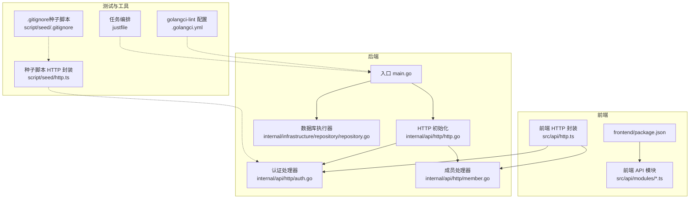
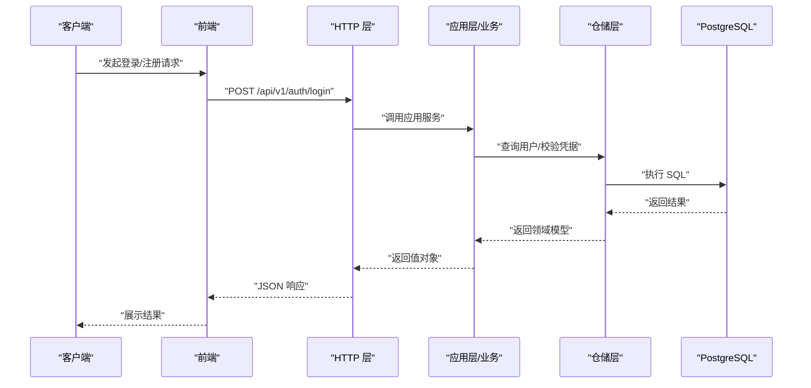
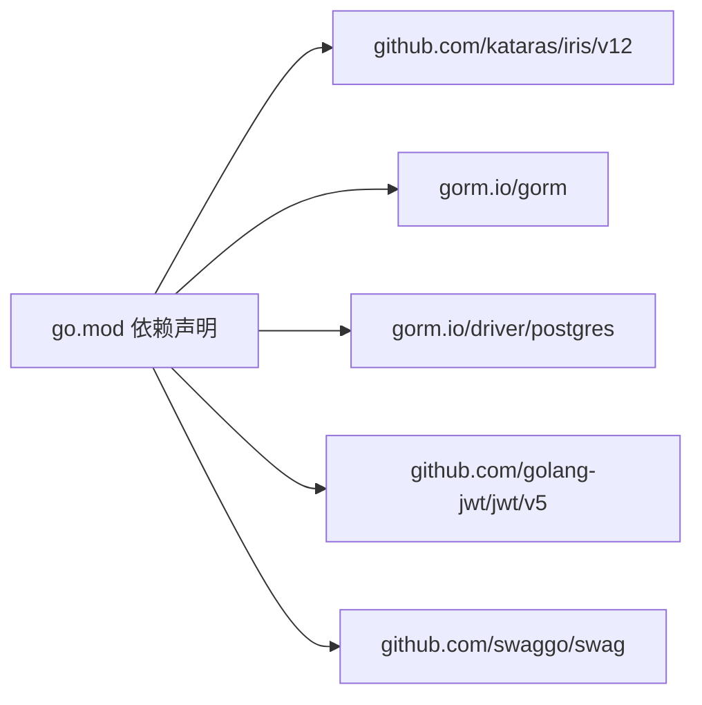

# 测试策略

<cite>
**本文引用的文件**
- [go.mod](file://go.mod)
- [main.go](file://main.go)
- [.golangci.yml](file://.golangci.yml)
- [justfile](file://justfile)
- [internal/api/http/http.go](file://internal/api/http/http.go)
- [internal/api/http/auth.go](file://internal/api/http/auth.go)
- [internal/api/http/member.go](file://internal/api/http/member.go)
- [internal/infrastructure/repository/repository.go](file://internal/infrastructure/repository/repository.go)
- [frontend/package.json](file://frontend/package.json)
- [script/seed/http.ts](file://script/seed/http.ts)
- [script/seed/.gitignore](file://script/seed/.gitignore)
- [.github/copilot-instructions.md](file://.github/copilot-instructions.md)
</cite>

## 目录
1. [简介](#简介)
2. [项目结构](#项目结构)
3. [核心组件](#核心组件)
4. [架构总览](#架构总览)
5. [详细组件分析](#详细组件分析)
6. [依赖分析](#依赖分析)
7. [性能考虑](#性能考虑)
8. [故障排查指南](#故障排查指南)
9. [结论](#结论)
10. [附录](#附录)

## 简介
本测试策略文档面向 poprako-web-ms 项目的后端与前端，系统化阐述单元测试、集成测试与端到端测试的编写方法与最佳实践，覆盖 Go 语言测试框架使用、模拟对象与测试数据准备、前端组件与 API 测试、数据库测试、覆盖率要求、用例设计原则、持续集成配置，以及性能、安全与兼容性测试的实施策略。本文所有技术建议均基于仓库现有代码结构与工具链进行提炼与落地。

## 项目结构
项目采用分层架构：前端使用 Vue 3 + Vite，后端使用 Iris 框架，数据访问通过 GORM 连接 PostgreSQL，测试贯穿各层并结合迁移脚本与种子脚本进行端到端验证。

图表来源
- [main.go:1-146](file://main.go#L1-L146)
- [internal/api/http/http.go:1-167](file://internal/api/http/http.go#L1-L167)
- [internal/api/http/auth.go:1-55](file://internal/api/http/auth.go#L1-L55)
- [internal/api/http/member.go:1-51](file://internal/api/http/member.go#L1-L51)
- [internal/infrastructure/repository/repository.go:1-29](file://internal/infrastructure/repository/repository.go#L1-L29)
- [.golangci.yml:1-31](file://.golangci.yml#L1-L31)
- [justfile:1-39](file://justfile#L1-L39)
- [script/seed/http.ts:1-60](file://script/seed/http.ts#L1-L60)
- [script/seed/.gitignore:1-34](file://script/seed/.gitignore#L1-L34)

章节来源
- [main.go:1-146](file://main.go#L1-L146)
- [internal/api/http/http.go:1-167](file://internal/api/http/http.go#L1-L167)
- [.golangci.yml:1-31](file://.golangci.yml#L1-L31)
- [justfile:1-39](file://justfile#L1-L39)
- [script/seed/http.ts:1-60](file://script/seed/http.ts#L1-L60)

## 核心组件
- 入口与应用装配：入口负责加载环境变量、配置、日志、数据库执行器与各仓储实例，并注入到应用层；随后启动 HTTP 服务器。
- HTTP 层：集中初始化路由与中间件，按模块划分路由前缀，暴露认证、用户、团队、成员、邀请、漫画、工作集、章节、页面、分配与单元等接口。
- 数据访问层：通过 GORM 打开 PostgreSQL 连接，设置连接池参数，作为仓储层的执行器。
- 前端：Vue 3 + Vite，使用 axios 发起 HTTP 请求，API 模块与 HTTP 封装位于前端 src 目录。

章节来源
- [main.go:25-145](file://main.go#L25-L145)
- [internal/api/http/http.go:26-151](file://internal/api/http/http.go#L26-L151)
- [internal/infrastructure/repository/repository.go:11-29](file://internal/infrastructure/repository/repository.go#L11-L29)
- [frontend/package.json:1-36](file://frontend/package.json#L1-L36)

## 架构总览
下图展示从客户端到后端、再到数据库的典型请求路径，以及测试关注点分布：

图表来源
- [internal/api/http/http.go:38-45](file://internal/api/http/http.go#L38-L45)
- [internal/api/http/auth.go:22-40](file://internal/api/http/auth.go#L22-L40)
- [internal/infrastructure/repository/repository.go:11-29](file://internal/infrastructure/repository/repository.go#L11-L29)

## 详细组件分析

### 单元测试（Go 语言）
- 测试框架与覆盖率
  - 使用标准库 testing 包进行单元测试，结合覆盖率收集与报告生成。
  - 建议在 CI 中开启覆盖率统计，确保关键路径被覆盖。
- 模拟对象与依赖注入
  - 对仓储接口进行模拟，避免真实数据库依赖，提升测试稳定性与速度。
  - 利用接口隔离与构造函数注入，便于替换为模拟实现。
- 用例设计原则
  - 针对领域模型不变量与边界条件编写测试。
  - 针对应用服务函数进行纯业务逻辑验证，不涉及外部系统。
- 示例路径
  - 认证处理器测试：[internal/api/http/auth.go:22-40](file://internal/api/http/auth.go#L22-L40)
  - 成员创建处理器测试：[internal/api/http/member.go:23-50](file://internal/api/http/member.go#L23-L50)
  - 数据库执行器测试：[internal/infrastructure/repository/repository.go:11-29](file://internal/infrastructure/repository/repository.go#L11-L29)

章节来源
- [internal/api/http/auth.go:1-55](file://internal/api/http/auth.go#L1-L55)
- [internal/api/http/member.go:1-51](file://internal/api/http/member.go#L1-L51)
- [internal/infrastructure/repository/repository.go:1-29](file://internal/infrastructure/repository/repository.go#L1-L29)

### 集成测试（Go 语言）
- 目标
  - 验证仓储实现与数据库交互的正确性，确保 SQL 与事务行为符合预期。
- 方法
  - 使用 SQLite 内存数据库或 Docker Postgres 进行集成测试。
  - 在事务中运行测试，每个测试结束后回滚，保证测试隔离。
- 迁移与种子
  - 使用迁移脚本初始化测试数据库结构。
  - 使用种子脚本准备测试数据，确保测试可重复。
- 示例路径
  - 迁移脚本目录：[migrations/](file://migrations/)
  - 种子脚本 HTTP 封装：[script/seed/http.ts:1-60](file://script/seed/http.ts#L1-L60)
  - 种子脚本忽略规则：[script/seed/.gitignore:1-34](file://script/seed/.gitignore#L1-L34)

章节来源
- [script/seed/http.ts:1-60](file://script/seed/http.ts#L1-L60)
- [script/seed/.gitignore:1-34](file://script/seed/.gitignore#L1-L34)

### 端到端测试（Go 语言）
- 目标
  - 通过 httptest 或真实 HTTP 服务器验证完整请求链路。
- 方法
  - 使用 iris 的测试能力或 net/http 的 httptest 创建轻量服务器。
  - 覆盖认证、授权、错误处理与响应格式。
- 示例路径
  - HTTP 初始化与路由注册：[internal/api/http/http.go:26-151](file://internal/api/http/http.go#L26-L151)
  - 入口装配与服务器启动：[main.go:25-145](file://main.go#L25-L145)

章节来源
- [internal/api/http/http.go:26-151](file://internal/api/http/http.go#L26-L151)
- [main.go:25-145](file://main.go#L25-L145)

### 前端组件测试
- 目标
  - 验证组件渲染、用户交互与 API 调用行为。
- 方法
  - 使用 Vitest + @vue/test-utils 进行组件级测试。
  - 使用 Mock Adapter 将 HTTP 请求拦截并返回预设响应。
- 示例路径
  - 前端依赖与脚本：[frontend/package.json:1-36](file://frontend/package.json#L1-L36)

章节来源
- [frontend/package.json:1-36](file://frontend/package.json#L1-L36)

### API 测试
- 目标
  - 验证接口契约、鉴权、错误码与响应结构。
- 方法
  - 使用 httpexpect 或自定义封装（参考种子脚本中的 HTTP 封装）进行断言。
  - 覆盖 2xx 成功场景与 4xx/5xx 错误场景。
- 示例路径
  - 种子脚本 HTTP 封装：[script/seed/http.ts:1-60](file://script/seed/http.ts#L1-L60)

章节来源
- [script/seed/http.ts:1-60](file://script/seed/http.ts#L1-L60)

### 数据库测试
- 目标
  - 验证迁移脚本、SQL 语句与事务一致性。
- 方法
  - 在测试数据库上应用 up/down 脚本，验证表结构与约束。
  - 使用事务回滚确保测试隔离。
- 示例路径
  - 迁移脚本示例：[migrations/20260306101212_comic-table.up.sql](file://migrations/20260306101212_comic-table.up.sql)
  - 数据库执行器：[internal/infrastructure/repository/repository.go:11-29](file://internal/infrastructure/repository/repository.go#L11-L29)

章节来源
- [internal/infrastructure/repository/repository.go:11-29](file://internal/infrastructure/repository/repository.go#L11-L29)

### 测试覆盖率要求
- 覆盖率目标
  - 业务核心函数与关键分支覆盖率不低于 80%。
  - 仓储层与应用层覆盖率不低于 70%。
- 工具与配置
  - 使用标准库 testing 的 -cover 选项与 HTML 报告生成。
  - 在 CI 中输出 lcov 报告并与平台集成。

章节来源
- [.golangci.yml:1-31](file://.golangci.yml#L1-L31)

### 测试用例设计原则
- 完整性：覆盖正常路径、异常路径与边界条件。
- 独立性：每个测试仅验证单一职责，避免相互依赖。
- 可重复性：使用固定种子数据与可控时间戳。
- 可维护性：测试命名清晰，断言明确，便于回归。

### 持续集成配置
- 任务编排
  - 使用 justfile 管理常用任务，避免在 CI 中直接拼装复杂命令。
- 代码质量
  - golangci-lint 配置启用测试扫描与多类静态检查。
- 建议流水线阶段
  - 代码检查（golangci-lint）
  - 单元测试与覆盖率
  - 集成测试（含迁移 up/down）
  - 前端构建与类型检查
  - API 端到端测试（可选）

章节来源
- [justfile:1-39](file://justfile#L1-L39)
- [.golangci.yml:1-31](file://.golangci.yml#L1-L31)
- [.github/copilot-instructions.md:21-23](file://.github/copilot-instructions.md#L21-L23)

## 依赖分析
- 外部依赖与测试相关的关键包
  - Iris：HTTP 框架，用于路由与中间件。
  - GORM + PostgreSQL：数据持久化，需在测试中替换为内存数据库或容器化实例。
  - golangci-lint：静态检查与格式化，保障测试代码质量。
- 依赖关系图

图表来源
- [go.mod:5-18](file://go.mod#L5-L18)

章节来源
- [go.mod:1-114](file://go.mod#L1-L114)

## 性能考虑
- 单元测试
  - 使用内存数据库或模拟对象，避免网络与磁盘 IO。
- 集成测试
  - 使用连接池最小化连接数，测试结束后释放资源。
- 端到端测试
  - 并发度控制与超时设置，避免测试相互干扰。
- 前端测试
  - 使用虚拟 DOM 与异步断言，减少真实网络请求。

## 故障排查指南
- 常见问题
  - 环境变量未加载导致配置失败：确认 .env 加载顺序与权限。
  - 数据库连接失败：检查连接字符串与容器健康状态。
  - 路由未生效：核对路由注册顺序与中间件链。
- 排查步骤
  - 启用详细日志，定位错误发生位置。
  - 使用最小化用例复现问题，逐步缩小范围。
  - 在 CI 中单独运行失败的测试套件，观察失败模式。

章节来源
- [main.go:25-42](file://main.go#L25-L42)
- [internal/api/http/http.go:26-35](file://internal/api/http/http.go#L26-L35)

## 结论
本测试策略围绕“单元—集成—端到端”三层测试体系，结合仓库现有的 Iris、GORM、golangci-lint 与 justfile，形成可落地的测试实践。通过模拟对象、迁移脚本与种子脚本，既能保证测试效率，又能覆盖真实业务场景。建议在 CI 中强制执行覆盖率门槛与静态检查，持续优化测试质量与稳定性。

## 附录
- 快速清单
  - 为每个应用服务函数编写单元测试。
  - 为仓储接口编写模拟实现并进行集成测试。
  - 使用迁移脚本初始化测试数据库，配合种子脚本准备数据。
  - 前端组件测试覆盖主要交互与错误分支。
  - 在 CI 中启用 golangci-lint 与覆盖率统计。
  - 为关键 API 编写端到端测试，覆盖鉴权与错误路径。