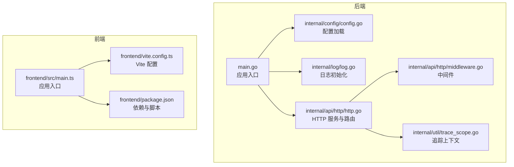
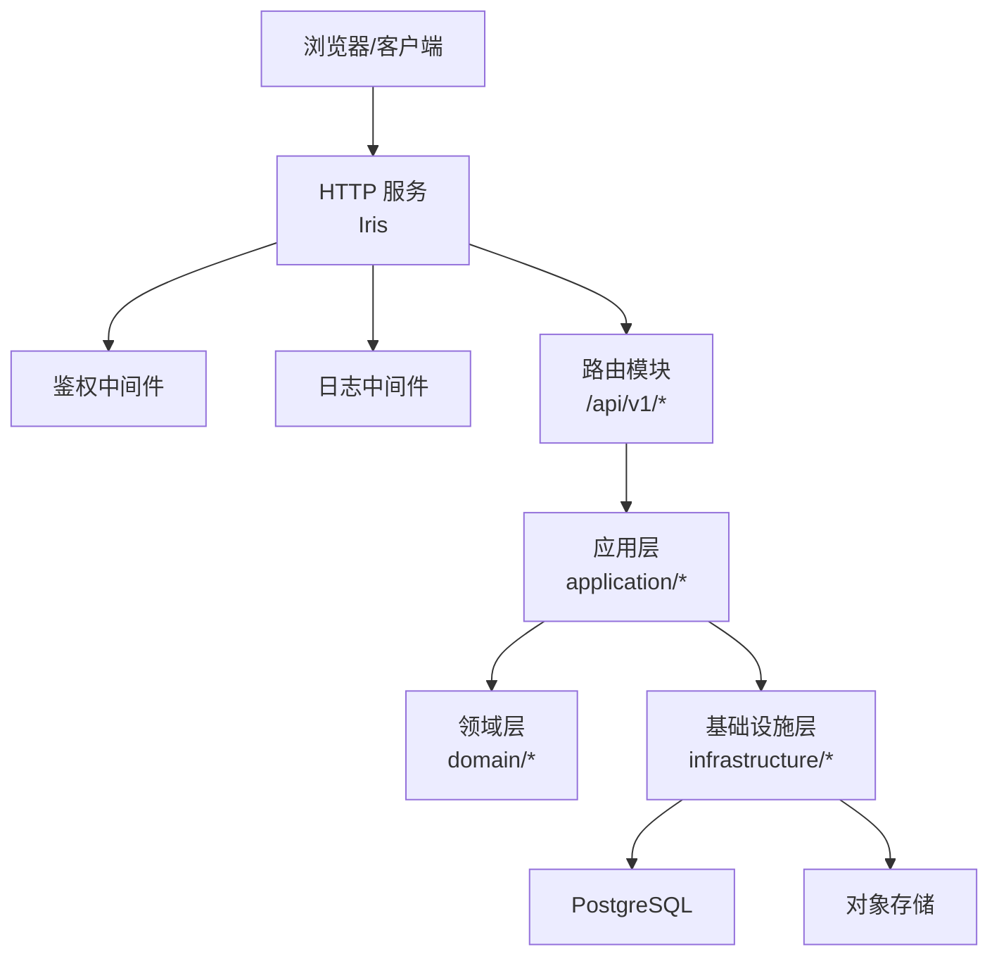
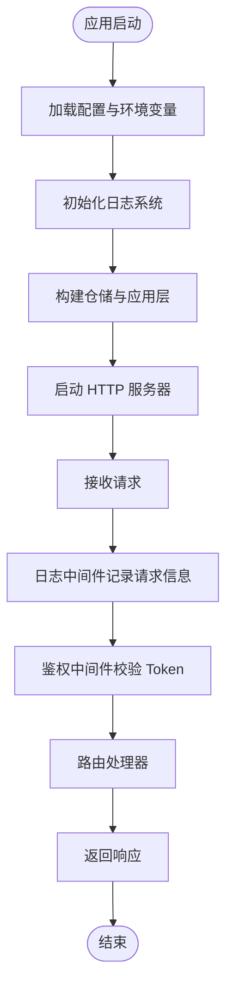
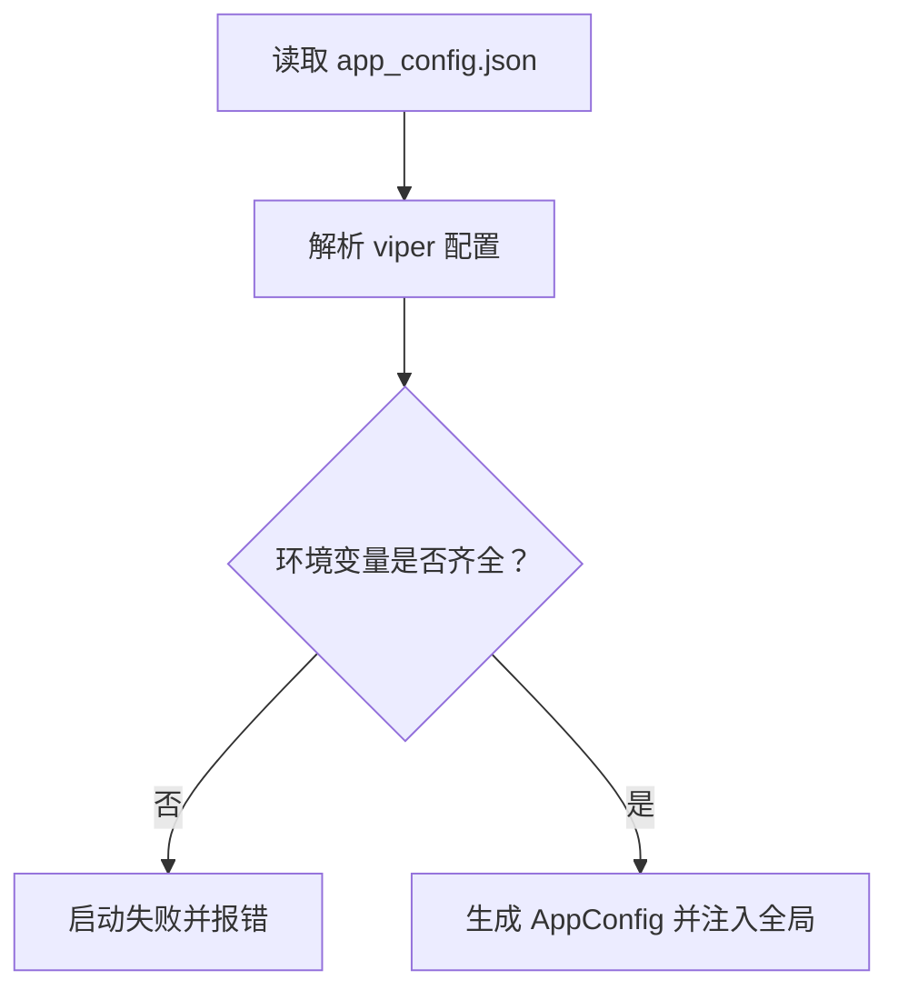
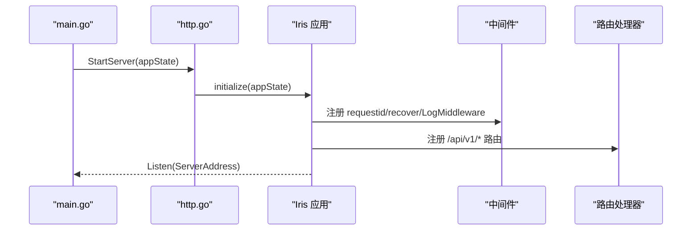
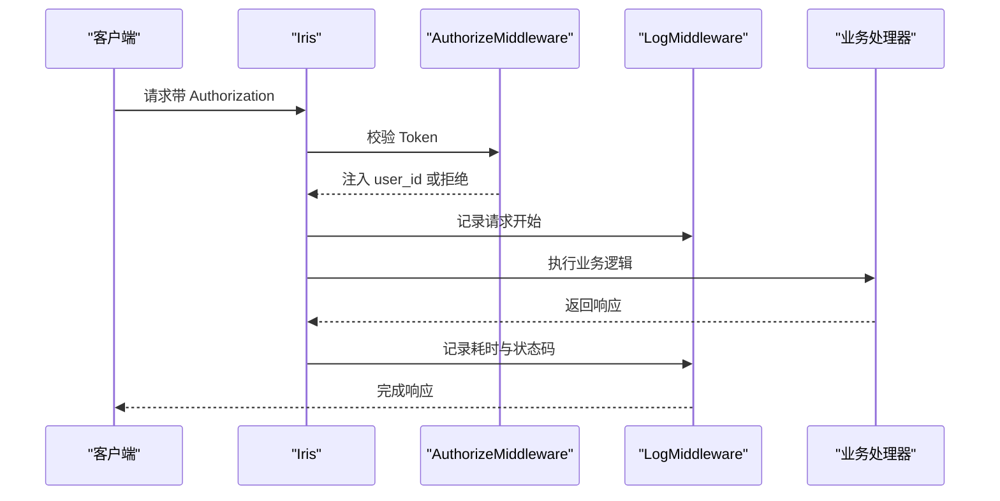
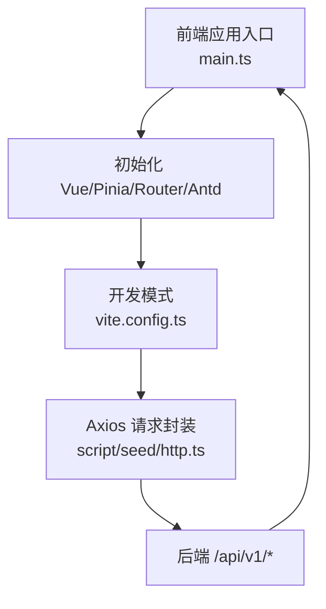
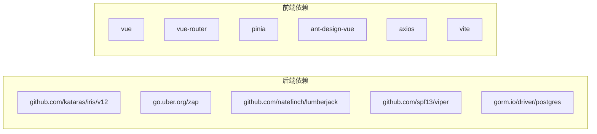

# 调试与性能分析

<cite>
**本文引用的文件**
- [main.go](file://main.go)
- [log.go](file://internal/log/log.go)
- [config.go](file://internal/config/config.go)
- [http.go](file://internal/api/http/http.go)
- [middleware.go](file://internal/api/http/middleware.go)
- [trace_scope.go](file://internal/util/trace_scope.go)
- [.golangci.yml](file://.golangci.yml)
- [vite.config.ts](file://frontend/vite.config.ts)
- [main.ts](file://frontend/src/main.ts)
- [package.json](file://frontend/package.json)
- [app_config.json](file://app_config.json)
- [http.ts](file://script/seed/http.ts)
</cite>

## 目录
1. [简介](#简介)
2. [项目结构](#项目结构)
3. [核心组件](#核心组件)
4. [架构总览](#架构总览)
5. [详细组件分析](#详细组件分析)
6. [依赖分析](#依赖分析)
7. [性能考虑](#性能考虑)
8. [故障排查指南](#故障排查指南)
9. [结论](#结论)
10. [附录](#附录)

## 简介
本指南面向 poprako-web-ms 项目的开发与运维团队，系统性地介绍后端与前端的调试与性能分析方法。内容覆盖：
- Go 后端调试器使用、日志记录配置与性能分析工具
- 前端调试工具、浏览器开发者工具与网络请求分析
- 常见问题诊断、错误追踪与性能瓶颈识别
- 内存泄漏检测、CPU 使用率分析与数据库查询优化
- 生产环境问题排查与监控告警配置建议

## 项目结构
该项目采用前后端分离架构：
- 后端：Go 语言实现，基于 Iris 框架，模块化组织于 internal 下，包含配置、日志、API、应用层、领域模型、基础设施等层次。
- 前端：Vue 3 + TypeScript + Vite，使用 Pinia 状态管理与 Ant Design Vue 组件库。

图表来源
- [main.go:25-145](file://main.go#L25-L145)
- [config.go:11-59](file://internal/config/config.go#L11-L59)
- [log.go:13-30](file://internal/log/log.go#L13-L30)
- [http.go:16-24](file://internal/api/http/http.go#L16-L24)
- [middleware.go:15-45](file://internal/api/http/middleware.go#L15-L45)
- [trace_scope.go:7-31](file://internal/util/trace_scope.go#L7-L31)
- [vite.config.ts:12-19](file://frontend/vite.config.ts#L12-L19)
- [main.ts:16-26](file://frontend/src/main.ts#L16-L26)
- [package.json:6-12](file://frontend/package.json#L6-L12)

章节来源
- [main.go:25-145](file://main.go#L25-L145)
- [config.go:11-59](file://internal/config/config.go#L11-L59)
- [log.go:13-30](file://internal/log/log.go#L13-L30)
- [http.go:16-24](file://internal/api/http/http.go#L16-L24)
- [middleware.go:15-45](file://internal/api/http/middleware.go#L15-L45)
- [trace_scope.go:7-31](file://internal/util/trace_scope.go#L7-L31)
- [vite.config.ts:12-19](file://frontend/vite.config.ts#L12-L19)
- [main.ts:16-26](file://frontend/src/main.ts#L16-L26)
- [package.json:6-12](file://frontend/package.json#L6-L12)

## 核心组件
- 应用入口与生命周期：负责加载环境变量、读取配置、初始化日志、构建仓储与应用层、启动 HTTP 服务器。
- 配置系统：通过 viper 读取 JSON 配置文件与环境变量，支持开发/生产环境切换。
- 日志系统：基于 zap，开发环境彩色控制台输出，生产环境 JSON 输出并落盘轮转。
- HTTP 服务与中间件：Iris 框架，内置请求 ID、恢复、日志与鉴权中间件；路由按模块划分。
- 追踪上下文：轻量级 TraceScope 封装，便于在调用链中附加字段进行日志追踪。

章节来源
- [main.go:25-145](file://main.go#L25-L145)
- [config.go:11-59](file://internal/config/config.go#L11-L59)
- [log.go:13-83](file://internal/log/log.go#L13-L83)
- [http.go:16-151](file://internal/api/http/http.go#L16-L151)
- [middleware.go:15-79](file://internal/api/http/middleware.go#L15-L79)
- [trace_scope.go:7-31](file://internal/util/trace_scope.go#L7-L31)

## 架构总览
后端采用分层架构：表示层（HTTP）、应用层（业务编排）、领域层（模型与服务）、基础设施层（仓储与外部集成）。前端通过 Axios 发起请求，遵循统一的鉴权头与响应包装约定。

图表来源
- [http.go:37-149](file://internal/api/http/http.go#L37-L149)
- [middleware.go:47-79](file://internal/api/http/middleware.go#L47-L79)
- [main.go:44-122](file://main.go#L44-L122)

## 详细组件分析

### 后端调试与日志
- 开发/生产日志差异
  - 开发环境：控制台彩色输出，时间格式本地化，日志级别 Debug。
  - 生产环境：JSON 输出，时间格式 ISO8601，日志级别 Warn，同时写入 stdout 与轮转文件 logs/main-service.log。
- 关键字段
  - 请求耗时、请求 ID、方法、路径、状态码、远端地址等，便于快速定位慢请求与异常。
- 建议
  - 在关键业务点使用 TraceScope.WithFields 注入用户 ID、资源 ID 等上下文，形成可追踪的日志链路。

图表来源
- [log.go:13-83](file://internal/log/log.go#L13-L83)
- [middleware.go:15-45](file://internal/api/http/middleware.go#L15-L45)
- [middleware.go:47-79](file://internal/api/http/middleware.go#L47-L79)
- [http.go:16-24](file://internal/api/http/http.go#L16-L24)

章节来源
- [log.go:13-83](file://internal/log/log.go#L13-L83)
- [middleware.go:15-45](file://internal/api/http/middleware.go#L15-L45)
- [middleware.go:47-79](file://internal/api/http/middleware.go#L47-L79)
- [http.go:16-24](file://internal/api/http/http.go#L16-L24)

### 配置与环境变量
- 配置来源
  - JSON 文件 app_config.json 与环境变量 APP_ENVIRONMENT、JWT_SECRET_KEY、DATABASE_URL。
- 关键点
  - 缺失任一环境变量会导致启动失败，需在部署前检查。
  - 环境变量用于区分开发/生产，影响日志级别与 Swagger 可见性。

图表来源
- [config.go:11-59](file://internal/config/config.go#L11-L59)

章节来源
- [config.go:11-59](file://internal/config/config.go#L11-L59)
- [app_config.json](file://app_config.json)

### HTTP 服务与路由
- 服务器启动
  - 通过 iris.Default 初始化，注册中间件与路由，监听 ServerAddress。
- 路由组织
  - /api/v1 下按模块划分：认证、用户、团队、成员、邀请、漫画、工作集、章节、页面、分配、单元。
- Swagger
  - 非生产环境自动暴露 Swagger UI，便于接口联调与文档验证。

图表来源
- [main.go:140-142](file://main.go#L140-L142)
- [http.go:16-151](file://internal/api/http/http.go#L16-L151)

章节来源
- [main.go:140-142](file://main.go#L140-L142)
- [http.go:16-151](file://internal/api/http/http.go#L16-L151)

### 鉴权中间件与请求追踪
- 鉴权流程
  - 从 Authorization 头提取 Bearer Token，解析 JWT 获取用户信息，注入到上下文。
- 请求追踪
  - requestid 中间件生成请求 ID，日志中间件记录耗时与上下文信息，结合 TraceScope 可形成完整链路。

图表来源
- [middleware.go:47-79](file://internal/api/http/middleware.go#L47-L79)
- [middleware.go:15-45](file://internal/api/http/middleware.go#L15-L45)

章节来源
- [middleware.go:47-79](file://internal/api/http/middleware.go#L47-L79)
- [middleware.go:15-45](file://internal/api/http/middleware.go#L15-L45)

### 前端调试与网络分析
- 构建与开发
  - Vite 提供热更新与类型检查；Vue 3 + TypeScript + Pinia + Ant Design Vue。
- 网络请求
  - 统一通过 Axios 发送请求，遵循 Bearer Token 鉴权；服务端响应采用 { code, message, data } 包装，前端按 code 判断成功与否。
- 调试建议
  - 使用浏览器 Network 面板观察请求/响应、耗时、状态码与鉴权头；结合后端日志中的请求 ID 进行跨端关联。

图表来源
- [main.ts:16-26](file://frontend/src/main.ts#L16-L26)
- [vite.config.ts:12-19](file://frontend/vite.config.ts#L12-L19)
- [http.ts:9-60](file://script/seed/http.ts#L9-L60)

章节来源
- [main.ts:16-26](file://frontend/src/main.ts#L16-L26)
- [vite.config.ts:12-19](file://frontend/vite.config.ts#L12-L19)
- [package.json:6-12](file://frontend/package.json#L6-L12)
- [http.ts:9-60](file://script/seed/http.ts#L9-L60)

## 依赖分析
- 后端依赖
  - Iris 框架、zap 日志、lumberjack 轮转、viper 配置、gorm PostgreSQL 驱动等。
- 前端依赖
  - Vue 3、Vue Router、Pinia、Ant Design Vue、Axios、Vite、ESLint、TypeScript。

图表来源
- [go.mod:5-18](file://go.mod#L5-L18)
- [package.json:13-34](file://frontend/package.json#L13-L34)

章节来源
- [go.mod:5-18](file://go.mod#L5-L18)
- [package.json:13-34](file://frontend/package.json#L13-L34)

## 性能考虑
- 日志性能
  - 生产环境使用 JSON 与多写同步器，避免高频字符串拼接；仅在 Debug/Warn 级别输出详细字段。
- 中间件开销
  - requestid/recover/log 中间件成本低，但应避免在日志中频繁构造大对象。
- 数据库连接池
  - 通过配置最小空闲与最大连接数控制并发与连接复用，减少连接建立开销。
- 前端渲染与网络
  - 合理拆分组件与懒加载；避免重复请求；利用浏览器缓存与 CDN。
- 监控与采样
  - 建议引入 pprof、expvar 或第三方 APM；对热点接口开启采样统计。

## 故障排查指南
- 启动失败
  - 检查环境变量：APP_ENVIRONMENT、JWT_SECRET_KEY、DATABASE_URL 是否设置。
  - 查看配置文件 app_config.json 是否存在且可解析。
- 鉴权失败
  - 确认 Authorization 头格式为 Bearer <token>；核对 JWT 密钥与过期时间。
- 慢请求定位
  - 结合日志中间件记录的 duration、request_id 与后端 TraceScope 字段，定位耗时环节。
- 数据库问题
  - 检查连接池参数与 SQL 执行计划；关注慢查询日志与锁等待。
- 前端网络问题
  - 使用浏览器 Network 面板确认请求头、响应体与状态码；核对服务端返回的 code/message。

章节来源
- [config.go:44-56](file://internal/config/config.go#L44-L56)
- [middleware.go:47-79](file://internal/api/http/middleware.go#L47-L79)
- [log.go:13-83](file://internal/log/log.go#L13-L83)
- [http.ts:9-60](file://script/seed/http.ts#L9-L60)

## 结论
通过规范的配置与日志体系、完善的中间件与路由设计，以及前后端协同的调试与网络分析手段，可以高效定位问题并持续优化性能。建议在生产环境引入更细粒度的监控与告警，配合日志与追踪链路，形成闭环的质量保障体系。

## 附录
- 开发环境建议
  - 使用 .env 加载环境变量，确保与 app_config.json 的一致性。
  - 启用 golangci-lint 规则，保持代码质量。
- 生产环境建议
  - 严格控制日志级别与输出目标；开启日志轮转；对敏感配置使用密钥管理。
  - 对外暴露的接口开启限流与安全扫描；定期审计依赖版本。