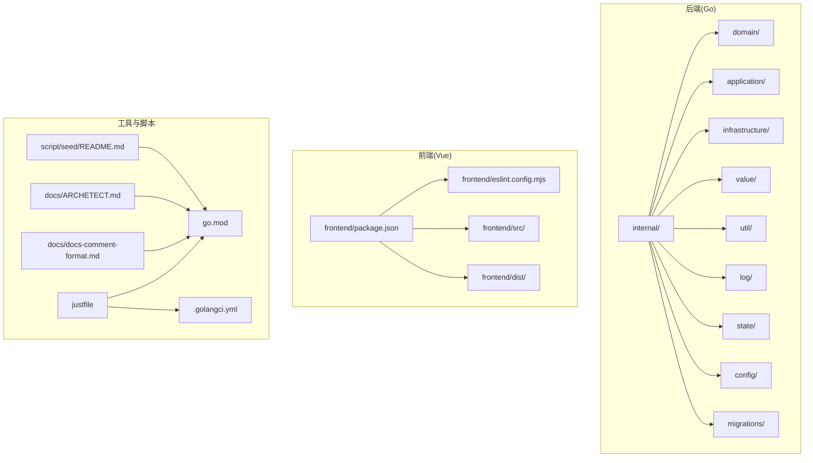
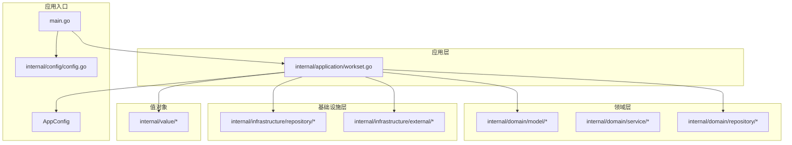
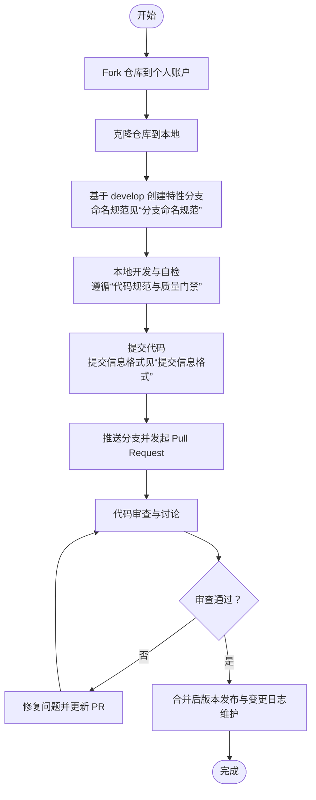
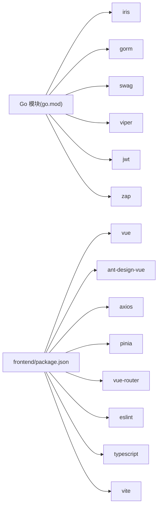
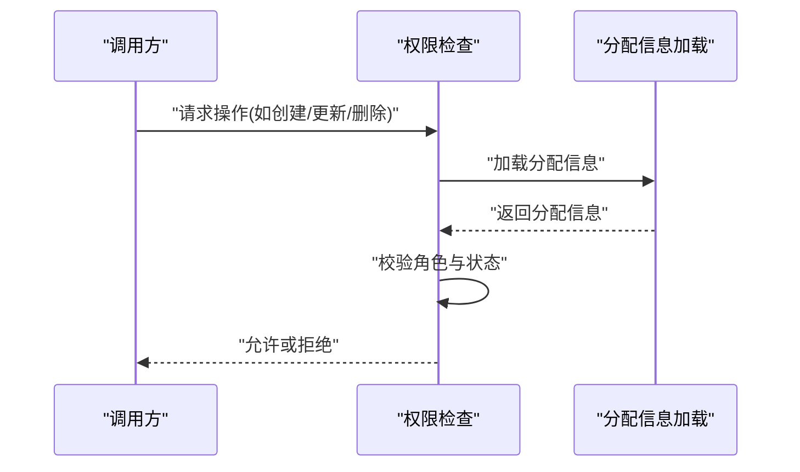
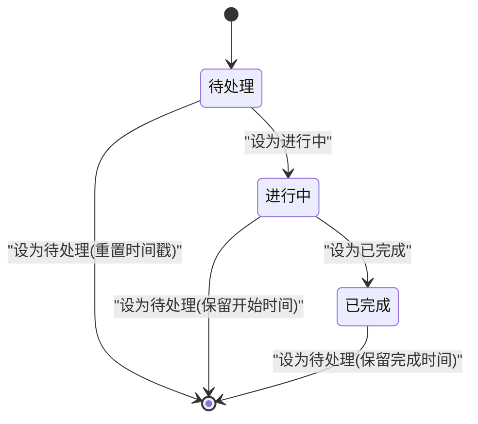
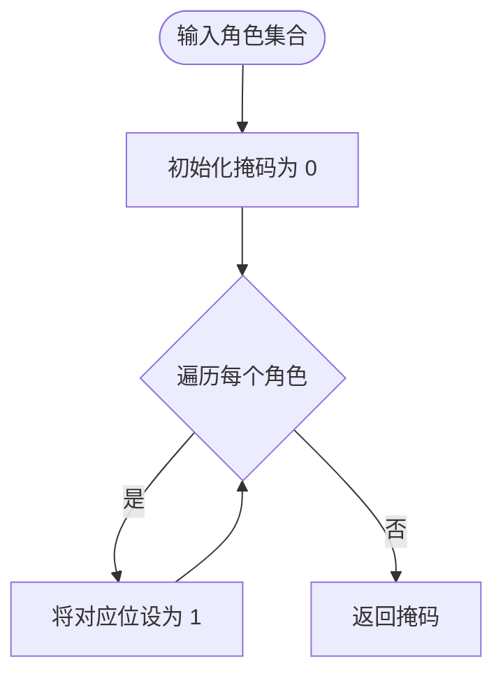
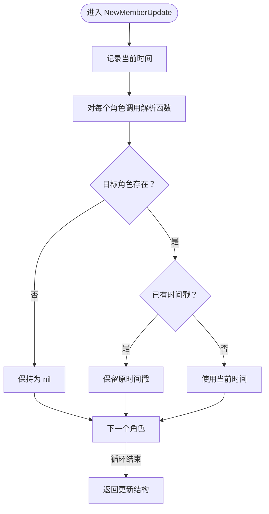

# 贡献流程

<cite>
**本文引用的文件**
- [README.md](file://README.md)
- [.github/copilot-instructions.md](file://.github/copilot-instructions.md)
- [justfile](file://justfile)
- [.golangci.yml](file://.golangci.yml)
- [go.mod](file://go.mod)
- [frontend/package.json](file://frontend/package.json)
- [frontend/eslint.config.mjs](file://frontend/eslint.config.mjs)
- [docs/docs-comment-format.md](file://docs/docs-comment-format.md)
- [docs/ARCHETECT.md](file://docs/ARCHETECT.md)
- [script/seed/README.md](file://script/seed/README.md)
- [internal/config/config.go](file://internal/config/config.go)
- [main.go](file://main.go)
- [app_config.json](file://app_config.json)
- [internal/domain/model/permission.go](file://internal/domain/model/permission.go)
- [internal/domain/model/assignment.go](file://internal/domain/model/assignment.go)
- [internal/domain/model/member.go](file://internal/domain/model/member.go)
- [internal/domain/model/chapter.go](file://internal/domain/model/chapter.go)
- [internal/domain/model/invitation.go](file://internal/domain/model/invitation.go)
- [internal/application/workset.go](file://internal/application/workset.go)
</cite>

## 目录
1. [简介](#简介)
2. [项目结构](#项目结构)
3. [核心组件](#核心组件)
4. [架构总览](#架构总览)
5. [详细组件分析](#详细组件分析)
6. [依赖分析](#依赖分析)
7. [性能考虑](#性能考虑)
8. [故障排查指南](#故障排查指南)
9. [结论](#结论)
10. [附录](#附录)

## 简介
本文件面向首次参与 poprako-web-ms 项目的贡献者，系统化说明从 Fork 到合并的完整贡献流程，覆盖分支命名、提交信息格式、代码审查与合并策略、版本发布建议、变更日志维护方法，以及社区行为准则、问题报告模板与功能请求流程。同时提供文档、翻译与测试贡献的具体方法，帮助新贡献者快速融入开发社区。

## 项目结构
该项目采用前后端分离与多模块 Go 后端的组织方式：
- 后端（Go）位于 internal/ 目录，按领域驱动设计（DDD）风格划分 domain、application、infrastructure、value、util 等层次。
- 前端（Vue 3 + TypeScript）位于 frontend/ 目录，使用 Vite 构建。
- 文档与架构说明位于 docs/ 目录。
- 数据库迁移脚本位于 migrations/ 目录。
- 工具与种子数据脚本位于 script/seed/ 目录。
- 项目根目录包含 Justfile、GolangCI 配置、Go 模块与依赖、示例配置等。

图表来源
- [justfile:1-39](file://justfile#L1-L39)
- [frontend/package.json:1-36](file://frontend/package.json#L1-L36)
- [frontend/eslint.config.mjs:1-40](file://frontend/eslint.config.mjs#L1-L40)
- [docs/docs-comment-format.md:1-29](file://docs/docs-comment-format.md#L1-L29)
- [docs/ARCHETECT.md:1-36](file://docs/ARCHETECT.md#L1-L36)
- [script/seed/README.md:1-16](file://script/seed/README.md#L1-L16)

章节来源
- [justfile:1-39](file://justfile#L1-L39)
- [frontend/package.json:1-36](file://frontend/package.json#L1-L36)
- [frontend/eslint.config.mjs:1-40](file://frontend/eslint.config.mjs#L1-L40)
- [docs/docs-comment-format.md:1-29](file://docs/docs-comment-format.md#L1-L29)
- [docs/ARCHETECT.md:1-36](file://docs/ARCHETECT.md#L1-L36)
- [script/seed/README.md:1-16](file://script/seed/README.md#L1-L16)

## 核心组件
- 代码质量与规范
  - 使用 GolangCI-Lint 作为静态检查与格式化工具，启用 vet、staticcheck、errcheck、ineffassign、unused、gosec、gocritic、misspell 等规则，并通过 Justfile 统一入口执行。
  - 前端使用 ESLint + TypeScript + Vue 插件进行类型与风格约束，构建脚本包含 lint 与类型检查。
- 文档与注释
  - OpenAPI 注释遵循 docs-comment-format.md 的格式，确保 swag 生成文档的准确性。
- 配置与运行
  - 应用配置通过 viper 读取 JSON 文件与环境变量，支持开发/生产环境切换。
- 权限与角色
  - 权限校验围绕角色掩码与分配状态进行，确保最小权限原则与职责分离。

章节来源
- [.golangci.yml:1-31](file://.golangci.yml#L1-L31)
- [justfile:9-13](file://justfile#L9-L13)
- [frontend/package.json:6-12](file://frontend/package.json#L6-L12)
- [frontend/eslint.config.mjs:32-38](file://frontend/eslint.config.mjs#L32-L38)
- [docs/docs-comment-format.md:1-29](file://docs/docs-comment-format.md#L1-L29)
- [internal/config/config.go:11-59](file://internal/config/config.go#L11-L59)
- [app_config.json:1-10](file://app_config.json#L1-L10)

## 架构总览
项目采用受 DDD 启发的分层架构：
- Domain 层：领域模型与服务，强调充血模型与纯函数聚合。
- Application 层：应用服务，负责编排与事务控制。
- Infrastructure 层：外部集成与仓储实现。
- Value 层：API 与应用层之间的数据传输对象。
- 配置与日志：集中式配置加载与日志初始化。

图表来源
- [main.go:1-42](file://main.go#L1-L42)
- [internal/config/config.go:11-59](file://internal/config/config.go#L11-L59)
- [internal/application/workset.go:20-47](file://internal/application/workset.go#L20-L47)
- [docs/ARCHETECT.md:1-36](file://docs/ARCHETECT.md#L1-L36)

章节来源
- [main.go:1-42](file://main.go#L1-L42)
- [docs/ARCHETECT.md:1-36](file://docs/ARCHETECT.md#L1-L36)
- [internal/application/workset.go:20-47](file://internal/application/workset.go#L20-L47)

## 详细组件分析

### 贡献流程总览
以下流程适用于所有类型的贡献（代码、文档、翻译、测试），请根据具体类型选择相应步骤。

### 分支命名规范
- 功能分支：feature/主题描述
- 修复分支：fix/问题描述
- 文档分支：docs/主题描述
- 发布分支：release/版本号
- 热修复分支：hotfix/紧急修复描述
- 规范性分支：chore/工具链或配置调整

### 提交信息格式
- 标题行：类型(作用域): 简洁描述
- 正文：详细说明动机与影响，必要时引用 Issue 编号
- 底部：Breaking Change 或相关变更说明
- 示例类型：feat、fix、docs、style、refactor、perf、test、chore

### 代码审查流程
- 自检：本地运行静态检查与格式化，确保无告警。
- PR 描述：清晰说明变更目的、范围、风险与测试情况。
- 审查要点：代码正确性、可读性、性能、安全性、兼容性与文档一致性。
- 修改与复审：根据审查意见迭代，直至通过。

### 合并策略
- 快进合并（fast-forward）优先，确保历史线性清晰。
- 合并前需满足：通过 CI、审查通过、无冲突、文档与注释更新。
- 合并后清理分支，避免遗留无用分支。

### 版本发布流程（建议）
- 标签：基于语义化版本打标签（vX.Y.Z）。
- 变更日志：在变更日志中记录重大改动、修复与已知问题。
- 发布说明：简述本次发布的主要内容与升级指引。
- 回归测试：确保关键路径通过回归测试。

### 变更日志维护方法
- 采用 Keep a Changelog 格式，按版本分节。
- 记录：added、changed、deprecated、removed、fixed、security。
- 内容来源：从 PR 的提交信息与变更摘要中提取。

### 社区行为准则
- 尊重与包容：尊重不同观点与背景，营造开放协作氛围。
- 明确沟通：使用清晰、简洁的语言，避免歧义。
- 积极反馈：建设性地提出意见与建议。
- 遵守法律与道德：不传播非法或不当内容。

### 问题报告模板
- 标题：简洁描述问题
- 环境信息：操作系统、浏览器、Go/Vue 版本、依赖版本
- 复现步骤：最小可复现步骤
- 预期行为：期望结果
- 实际行为：实际结果
- 日志与截图：便于定位问题

### 功能请求流程
- 在 Issue 中描述需求背景、目标与验收标准。
- 提供原型图或伪代码，明确交互与边界。
- 讨论技术方案与实现成本，达成共识后再开发。

### 文档贡献
- 文档位置：docs/ 目录下的 Markdown 文件。
- 更新范围：架构说明、注释格式、工作流与最佳实践。
- 一致性：遵循现有风格与术语，避免重复与矛盾。

### 翻译贡献
- 翻译范围：前端文案、注释与文档。
- 一致性：保持术语统一，避免直译导致的歧义。
- 审核：多人交叉校对，确保语言通顺与准确。

### 测试贡献
- 单元测试：覆盖关键业务逻辑与边界条件。
- 集成测试：验证模块间协作与外部依赖。
- 端到端测试：使用真实或模拟环境验证完整流程。
- 覆盖率：尽量提升关键路径覆盖率。

章节来源
- [.github/copilot-instructions.md:1-23](file://.github/copilot-instructions.md#L1-L23)
- [docs/docs-comment-format.md:1-29](file://docs/docs-comment-format.md#L1-L29)
- [docs/ARCHETECT.md:1-36](file://docs/ARCHETECT.md#L1-L36)
- [frontend/eslint.config.mjs:32-38](file://frontend/eslint.config.mjs#L32-L38)
- [frontend/package.json:6-12](file://frontend/package.json#L6-L12)
- [.golangci.yml:7-18](file://.golangci.yml#L7-L18)
- [justfile:9-13](file://justfile#L9-L13)

## 依赖分析
- 后端依赖：Iris Web 框架、GORM ORM、Swagger 文档、Viper 配置、Zap 日志、JWT 签名等。
- 前端依赖：Vue 3、Ant Design Vue、Axios、Pinia、Vue Router、ESLint、TypeScript、Vite 等。
- 工具链：Justfile 统一任务入口，GolangCI-Lint 保证代码质量，swag 生成 OpenAPI 文档。

图表来源
- [go.mod:5-18](file://go.mod#L5-L18)
- [frontend/package.json:13-34](file://frontend/package.json#L13-L34)

章节来源
- [go.mod:1-114](file://go.mod#L1-L114)
- [frontend/package.json:1-36](file://frontend/package.json#L1-L36)

## 性能考虑
- 后端
  - 使用连接池与最小/最大连接数配置，避免资源争用。
  - 控制查询复杂度与 N+1 问题，合理使用预加载与分页。
  - 关注鉴权与日志开销，避免在高频路径中产生额外负载。
- 前端
  - 组件拆分与懒加载，减少首屏体积。
  - 合理缓存策略与请求去重，降低网络压力。
  - 类型检查与 ESLint 规则有助于早期发现潜在性能问题。

## 故障排查指南
- 本地启动失败
  - 检查环境变量与配置文件是否齐全，确认 DATABASE_URL、JWT_SECRET_KEY、APP_ENVIRONMENT 是否设置。
  - 查看日志初始化与数据库连接是否成功。
- 代码检查失败
  - 使用 Justfile 中的 check 与 fmt 任务统一修复格式与规则问题。
  - 针对特定规则逐项修正，避免忽略告警。
- 文档生成异常
  - 确保 handler 注释遵循 OpenAPI 注释格式，避免遗漏关键字段。
- 权限与角色问题
  - 核对角色掩码与分配状态，确保权限判断逻辑正确。

章节来源
- [internal/config/config.go:29-59](file://internal/config/config.go#L29-L59)
- [app_config.json:1-10](file://app_config.json#L1-L10)
- [justfile:9-13](file://justfile#L9-L13)
- [docs/docs-comment-format.md:1-29](file://docs/docs-comment-format.md#L1-L29)
- [internal/domain/model/permission.go:581-621](file://internal/domain/model/permission.go#L581-L621)
- [internal/domain/model/assignment.go:57-111](file://internal/domain/model/assignment.go#L57-L111)

## 结论
本贡献流程文档提供了从准备到发布的全流程规范，结合项目现有的工具链与架构约定，确保贡献过程高效、可追溯且高质量。请在实践中持续完善文档与流程，推动社区协作与项目演进。

## 附录

### 权限与角色校验流程

图表来源
- [internal/domain/model/permission.go:581-621](file://internal/domain/model/permission.go#L581-L621)
- [internal/domain/model/assignment.go:57-111](file://internal/domain/model/assignment.go#L57-L111)

### 角色分配状态机（章节级）

图表来源
- [internal/domain/model/chapter.go:200-259](file://internal/domain/model/chapter.go#L200-L259)

### 邀请角色掩码计算

图表来源
- [internal/domain/model/invitation.go:86-112](file://internal/domain/model/invitation.go#L86-L112)

### 成员更新时间戳解析

图表来源
- [internal/domain/model/member.go:177-204](file://internal/domain/model/member.go#L177-L204)