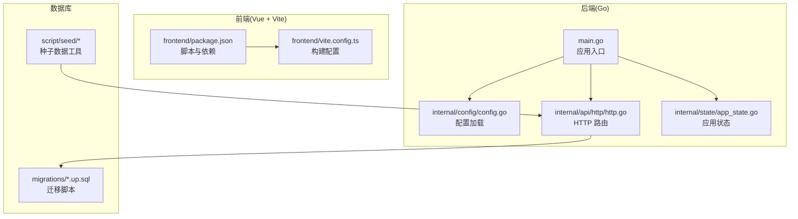
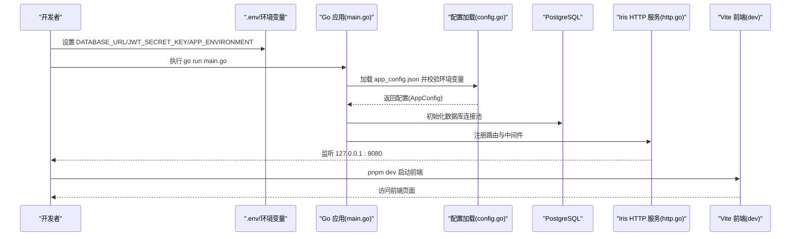
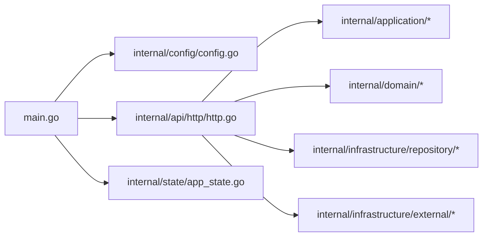

# 快速开始

<cite>
**本文引用的文件**
- [main.go](file://main.go)
- [go.mod](file://go.mod)
- [justfile](file://justfile)
- [app_config.json](file://app_config.json)
- [internal/config/config.go](file://internal/config/config.go)
- [internal/api/http/http.go](file://internal/api/http/http.go)
- [internal/api/http/auth.go](file://internal/api/http/auth.go)
- [frontend/package.json](file://frontend/package.json)
- [frontend/vite.config.ts](file://frontend/vite.config.ts)
- [migrations/20260301065010_features-enable.up.sql](file://migrations/20260301065010_features-enable.up.sql)
- [migrations/20260306101212_user-table.up.sql](file://migrations/20260306101212_user-table.up.sql)
- [migrations/20260306101216_unit-table.up.sql](file://migrations/20260306101216_unit-table.up.sql)
- [script/seed/README.md](file://script/seed/README.md)
- [script/seed/config.ts](file://script/seed/config.ts)
</cite>

## 目录
1. [简介](#简介)
2. [项目结构](#项目结构)
3. [核心组件](#核心组件)
4. [架构总览](#架构总览)
5. [详细组件分析](#详细组件分析)
6. [依赖分析](#依赖分析)
7. [性能考虑](#性能考虑)
8. [故障排除指南](#故障排除指南)
9. [结论](#结论)
10. [附录](#附录)

## 简介
本指南旨在帮助新开发者在约 30 分钟内完成漫画翻译协作平台的本地开发环境搭建与首次运行。内容覆盖环境要求、安装与配置、数据库初始化、种子数据导入、前后端启动命令与验证步骤，并提供常见问题排查建议。

## 项目结构
该仓库采用前后端分离的多模块组织方式：
- 后端（Go）：位于根目录，包含主程序入口、配置加载、HTTP 路由、应用层与基础设施层。
- 前端（Vue 3 + TypeScript + Vite）：位于 frontend 目录，包含构建脚本、路由与类型定义。
- 数据库迁移：位于 migrations 目录，按时间戳命名的 up/down 脚本。
- 种子数据工具：位于 script/seed，使用 Bun 运行，提供基础数据初始化能力。
- 开发辅助：justfile 提供常用任务（如生成文档、迁移、构建、种子导入等）。

图表来源
- [main.go:1-146](file://main.go#L1-L146)
- [internal/config/config.go:1-101](file://internal/config/config.go#L1-L101)
- [internal/api/http/http.go:1-167](file://internal/api/http/http.go#L1-L167)
- [frontend/package.json:1-34](file://frontend/package.json#L1-L34)
- [frontend/vite.config.ts:1-20](file://frontend/vite.config.ts#L1-L20)
- [migrations/20260301065010_features-enable.up.sql:1-2](file://migrations/20260301065010_features-enable.up.sql#L1-L2)
- [script/seed/README.md:1-16](file://script/seed/README.md#L1-L16)

章节来源
- [main.go:1-146](file://main.go#L1-L146)
- [frontend/package.json:1-34](file://frontend/package.json#L1-L34)
- [frontend/vite.config.ts:1-20](file://frontend/vite.config.ts#L1-L20)
- [migrations/20260301065010_features-enable.up.sql:1-2](file://migrations/20260301065010_features-enable.up.sql#L1-L2)
- [script/seed/README.md:1-16](file://script/seed/README.md#L1-L16)

## 核心组件
- 应用入口与生命周期
  - 主程序负责加载 .env、读取 app_config.json、初始化日志、数据库连接、各应用层实例，并启动 HTTP 服务器。
- 配置系统
  - 通过 JSON 文件加载基础配置，结合环境变量注入敏感或运行时参数（如数据库连接、JWT 密钥、运行环境）。
- HTTP 服务
  - 基于 Iris 框架，提供认证、团队、成员、邀请、漫画、工作集、章节、页面、分配与单元等 REST 路由。
- 前端构建
  - 使用 Vite + Vue 3 + TypeScript，提供开发、构建、预览与类型检查脚本。
- 数据库与迁移
  - 使用 GORM + PostgreSQL，迁移脚本按时间戳命名，包含扩展启用与表结构定义。
- 种子数据
  - 使用 Bun 运行种子脚本，提供超级管理员账号、默认团队与初始数据。

章节来源
- [main.go:25-145](file://main.go#L25-L145)
- [internal/config/config.go:11-100](file://internal/config/config.go#L11-L100)
- [internal/api/http/http.go:16-167](file://internal/api/http/http.go#L16-L167)
- [frontend/package.json:6-12](file://frontend/package.json#L6-L12)
- [frontend/vite.config.ts:12-19](file://frontend/vite.config.ts#L12-L19)
- [migrations/20260301065010_features-enable.up.sql:1-2](file://migrations/20260301065010_features-enable.up.sql#L1-L2)
- [script/seed/README.md:3-15](file://script/seed/README.md#L3-L15)

## 架构总览
下图展示了本地开发环境的启动流程与关键组件交互：

图表来源
- [main.go:25-145](file://main.go#L25-L145)
- [internal/config/config.go:29-59](file://internal/config/config.go#L29-L59)
- [internal/api/http/http.go:16-24](file://internal/api/http/http.go#L16-L24)
- [frontend/package.json:7](file://frontend/package.json#L7)

章节来源
- [main.go:25-145](file://main.go#L25-L145)
- [internal/config/config.go:29-59](file://internal/config/config.go#L29-L59)
- [internal/api/http/http.go:16-24](file://internal/api/http/http.go#L16-L24)
- [frontend/package.json:7](file://frontend/package.json#L7)

## 详细组件分析

### 环境与依赖要求
- Go 版本
  - 项目使用 Go 1.25.0，请确保本地安装对应版本。
- 数据库
  - 使用 PostgreSQL，需提前安装并运行数据库服务。
- 前端
  - 使用 pnpm 作为包管理器，Node.js 版本建议与项目依赖兼容。
- 其他工具
  - Just（任务编排）、Swag（生成 API 文档）、SQLx（迁移工具）、Bun（种子脚本运行）。

章节来源
- [go.mod:3](file://go.mod#L3)
- [frontend/package.json:13-32](file://frontend/package.json#L13-L32)
- [justfile:6-7](file://justfile#L6-L7)
- [justfile:24-28](file://justfile#L24-L28)
- [justfile:37-38](file://justfile#L37-L38)

### 环境变量与配置文件
- 关键环境变量
  - APP_ENVIRONMENT：运行环境（development/production）
  - DATABASE_URL：PostgreSQL 连接字符串
  - JWT_SECRET_KEY：JWT 签名密钥
- 配置文件
  - app_config.json：包含服务器地址、认证过期小时数、数据库连接池参数等。

章节来源
- [internal/config/config.go:44-47](file://internal/config/config.go#L44-L47)
- [internal/config/config.go:91-95](file://internal/config/config.go#L91-L95)
- [internal/config/config.go:74-78](file://internal/config/config.go#L74-L78)
- [app_config.json:1-11](file://app_config.json#L1-L11)

### 数据库初始化与迁移
- 迁移工具
  - 使用 sqlx 进行迁移，提供添加与执行迁移的任务。
- 迁移脚本
  - 包含启用扩展与多张核心表的 up 脚本，确保数据库结构完整。
- 初始化步骤
  - 在数据库中创建目标库后，执行迁移以生成所需表结构。

章节来源
- [justfile:24-28](file://justfile#L24-L28)
- [migrations/20260301065010_features-enable.up.sql:1-2](file://migrations/20260301065010_features-enable.up.sql#L1-L2)
- [migrations/20260306101212_user-table.up.sql](file://migrations/20260306101212_user-table.up.sql)
- [migrations/20260306101216_unit-table.up.sql](file://migrations/20260306101216_unit-table.up.sql)

### 种子数据导入
- 工具链
  - 使用 Bun 运行种子脚本，提供超级管理员账号、默认团队与初始数据。
- 命令
  - 通过 just 任务一键运行种子脚本。
- 配置
  - 种子脚本使用本地 API 地址与默认凭据进行初始化。

章节来源
- [script/seed/README.md:3-15](file://script/seed/README.md#L3-L15)
- [script/seed/config.ts:1-16](file://script/seed/config.ts#L1-L16)
- [justfile:37-38](file://justfile#L37-L38)

### 启动与验证步骤
- 后端服务
  - 设置环境变量后，直接运行后端主程序即可启动 HTTP 服务器。
  - 默认监听地址来自配置文件，可在非生产环境查看 Swagger 文档。
- 前端服务
  - 在 frontend 目录执行开发服务器命令，打开浏览器访问前端页面。
- 首次验证
  - 登录接口用于验证后端是否正常运行与认证流程是否可用。

章节来源
- [main.go:25-145](file://main.go#L25-L145)
- [internal/api/http/http.go:16-24](file://internal/api/http/http.go#L16-L24)
- [internal/api/http/http.go:147-166](file://internal/api/http/http.go#L147-L166)
- [internal/api/http/auth.go:22-40](file://internal/api/http/auth.go#L22-L40)
- [frontend/package.json:7](file://frontend/package.json#L7)

## 依赖分析
后端依赖主要围绕 Web 框架、配置管理、数据库 ORM、日志与文档生成等模块，整体耦合度较低，职责清晰。

图表来源
- [main.go:12-23](file://main.go#L12-L23)
- [internal/api/http/http.go:1-14](file://internal/api/http/http.go#L1-L14)

章节来源
- [main.go:12-23](file://main.go#L12-L23)
- [internal/api/http/http.go:1-14](file://internal/api/http/http.go#L1-L14)

## 性能考虑
- 连接池参数
  - 通过配置文件设置最小空闲连接与最大打开连接数，避免连接争用与资源浪费。
- 中间件
  - 请求 ID 与恢复中间件有助于定位问题，但需注意日志开销。
- Swagger
  - 仅在非生产环境启用，避免影响线上性能。

章节来源
- [app_config.json:6-9](file://app_config.json#L6-L9)
- [internal/api/http/http.go:29-36](file://internal/api/http/http.go#L29-L36)
- [internal/config/config.go:61-67](file://internal/config/config.go#L61-L67)

## 故障排除指南
- 环境变量缺失
  - 若提示未设置运行环境或数据库/密钥变量，请补充相应环境变量后再启动。
- 数据库连接失败
  - 检查 DATABASE_URL 是否正确指向本地或远程数据库，确认网络连通性与权限。
- Swagger 无法访问
  - 确认当前运行环境不是 production，否则不会启用 Swagger。
- 前端无法访问后端接口
  - 确认后端监听地址与前端代理配置一致，必要时调整 CORS 或代理规则。
- 种子脚本报错
  - 确认已安装 Bun 并执行依赖安装，再运行种子脚本。

章节来源
- [internal/config/config.go:44-47](file://internal/config/config.go#L44-L47)
- [internal/config/config.go:91-95](file://internal/config/config.go#L91-L95)
- [internal/config/config.go:74-78](file://internal/config/config.go#L74-L78)
- [internal/config/config.go:61-67](file://internal/config/config.go#L61-L67)
- [script/seed/README.md:3-15](file://script/seed/README.md#L3-L15)

## 结论
按照本指南完成环境准备、数据库初始化、配置注入与前后端启动后，您可以在本地快速运行完整的漫画翻译协作平台。遇到问题时，优先检查环境变量与数据库连接，其次核对迁移与种子脚本执行情况。

## 附录

### 快速命令清单
- 后端开发启动
  - 运行后端主程序：[main.go:19](file://justfile#L19)
- 前端开发启动
  - 在 frontend 目录执行开发命令：[frontend/package.json:7](file://frontend/package.json#L7)
- 生成 API 文档
  - 使用 swag 初始化：[justfile:7](file://justfile#L7)
- 数据库迁移
  - 添加迁移：[justfile:25](file://justfile#L25)
  - 执行迁移：[justfile:28](file://justfile#L28)
- 种子数据导入
  - 运行种子脚本：[justfile:38](file://justfile#L38)

### 首次运行验证清单
- 后端服务
  - 服务器监听地址：[app_config.json:2](file://app_config.json#L2)
  - Swagger 文档（非生产环境）：[internal/api/http/http.go:147-166](file://internal/api/http/http.go#L147-L166)
- 前端服务
  - 开发服务器端口：[frontend/package.json:7](file://frontend/package.json#L7)
- 认证接口
  - 登录接口：[internal/api/http/auth.go:22-40](file://internal/api/http/auth.go#L22-L40)
  - 注册接口：[internal/api/http/auth.go:54-72](file://internal/api/http/auth.go#L54-L72)