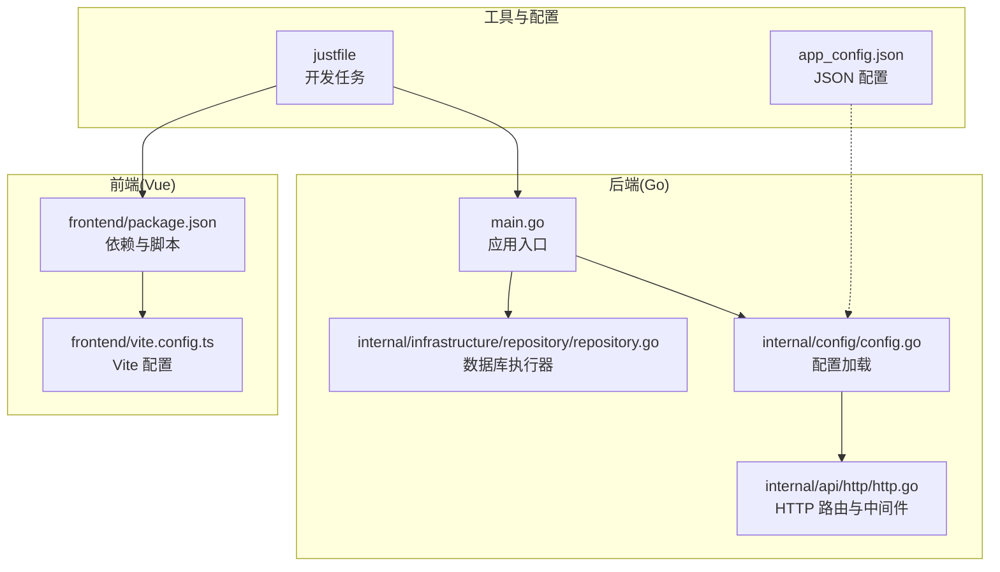
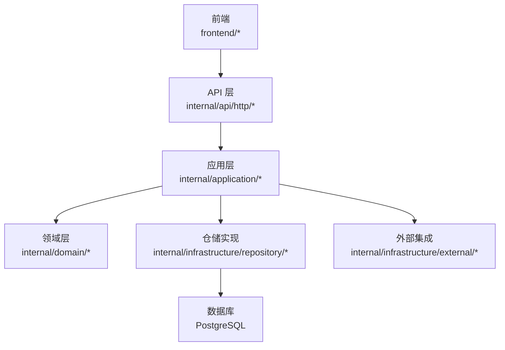
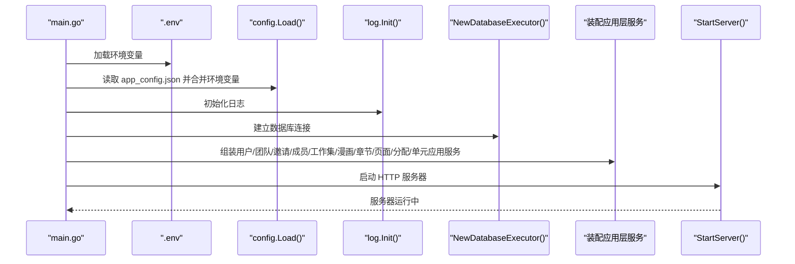
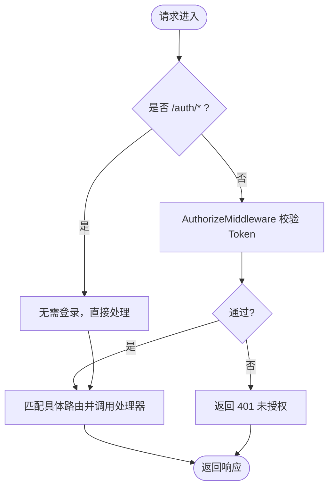
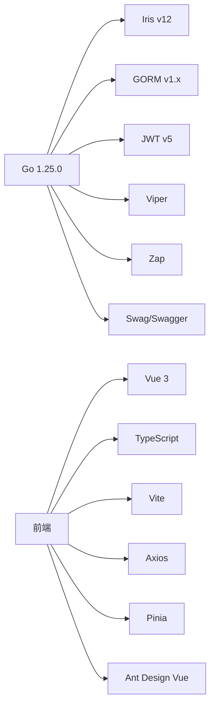

# 快速开始

<cite>
**本文引用的文件**
- [main.go](file://main.go)
- [go.mod](file://go.mod)
- [app_config.json](file://app_config.json)
- [internal/config/config.go](file://internal/config/config.go)
- [internal/api/http/http.go](file://internal/api/http/http.go)
- [frontend/package.json](file://frontend/package.json)
- [frontend/vite.config.ts](file://frontend/vite.config.ts)
- [justfile](file://justfile)
- [internal/infrastructure/repository/repository.go](file://internal/infrastructure/repository/repository.go)
- [docs/swagger.yaml](file://docs/swagger.yaml)
- [docs/ARCHETECT.md](file://docs/ARCHETECT.md)
- [script/seed/README.md](file://script/seed/README.md)
</cite>

## 目录
1. [简介](#简介)
2. [项目结构](#项目结构)
3. [核心组件](#核心组件)
4. [架构总览](#架构总览)
5. [详细组件分析](#详细组件分析)
6. [依赖分析](#依赖分析)
7. [性能考虑](#性能考虑)
8. [故障排除指南](#故障排除指南)
9. [结论](#结论)
10. [附录](#附录)

## 简介
本指南帮助你在 30 分钟内成功运行 poprako-web-ms 项目。你将完成环境准备（Go、Node.js、PostgreSQL）、项目克隆、依赖安装、数据库初始化、环境变量配置、本地开发服务器启动、前端构建与 API 测试等步骤。同时提供常见问题与故障排除建议。

## 项目结构
该项目采用前后端分离的多模块结构：
- 后端（Go）：基于 Iris 框架，采用部分 DDD 分层架构，包含 API 层、应用层、领域层、基础设施层。
- 前端（Vue 3 + TypeScript + Vite）：使用 Ant Design Vue 作为 UI 组件库，通过 axios 与后端 API 通信。
- 配置：后端通过 JSON 配置文件与环境变量组合加载，前端通过 Vite 配置与包管理工具管理依赖。
- 开发辅助：提供 Justfile 任务脚本，便于一键生成文档、格式化、迁移与种子数据导入。

图表来源
- [main.go:1-146](file://main.go#L1-L146)
- [internal/config/config.go:1-101](file://internal/config/config.go#L1-L101)
- [internal/api/http/http.go:1-167](file://internal/api/http/http.go#L1-L167)
- [internal/infrastructure/repository/repository.go:1-29](file://internal/infrastructure/repository/repository.go#L1-L29)
- [frontend/package.json:1-36](file://frontend/package.json#L1-L36)
- [frontend/vite.config.ts:1-20](file://frontend/vite.config.ts#L1-L20)
- [justfile:1-39](file://justfile#L1-L39)
- [app_config.json:1-11](file://app_config.json#L1-L11)

章节来源
- [main.go:1-146](file://main.go#L1-L146)
- [docs/ARCHETECT.md:1-36](file://docs/ARCHETECT.md#L1-L36)

## 核心组件
- 应用入口与生命周期：后端入口负责加载环境变量、读取配置、初始化日志、数据库连接、装配应用层服务，并启动 HTTP 服务器。
- 配置系统：后端通过 JSON 配置文件与环境变量组合加载，支持开发/生产环境切换。
- HTTP 路由：基于 Iris 框架，提供认证、用户、团队、成员、邀请、漫画、工作集、章节、页面、分配、单元等资源的 REST 接口。
- 前端构建：Vite + Vue 3 + TypeScript，提供开发、构建、预览与类型检查脚本。
- 数据库：使用 GORM + PostgreSQL，通过环境变量 DATABASE_URL 连接数据库。

章节来源
- [main.go:25-145](file://main.go#L25-L145)
- [internal/config/config.go:11-59](file://internal/config/config.go#L11-L59)
- [internal/api/http/http.go:16-151](file://internal/api/http/http.go#L16-L151)
- [frontend/package.json:6-12](file://frontend/package.json#L6-L12)
- [frontend/vite.config.ts:12-19](file://frontend/vite.config.ts#L12-L19)
- [internal/infrastructure/repository/repository.go:11-29](file://internal/infrastructure/repository/repository.go#L11-L29)

## 架构总览
后端采用部分 DDD 分层架构，Domain 层定义模型与领域服务，Application 层编排业务流程与事务，Infrastructure 层提供仓储与外部集成，API 层负责 HTTP 请求处理与响应。

图表来源
- [docs/ARCHETECT.md:1-36](file://docs/ARCHETECT.md#L1-L36)
- [internal/api/http/http.go:16-151](file://internal/api/http/http.go#L16-L151)

## 详细组件分析

### 后端启动流程
后端启动时会按顺序执行：加载 .env、读取 app_config.json、初始化日志、建立数据库连接、装配各应用服务、启动 HTTP 服务器。

图表来源
- [main.go:25-145](file://main.go#L25-L145)
- [internal/config/config.go:11-59](file://internal/config/config.go#L11-L59)
- [internal/infrastructure/repository/repository.go:11-29](file://internal/infrastructure/repository/repository.go#L11-L29)

章节来源
- [main.go:25-145](file://main.go#L25-L145)

### HTTP 路由与中间件
- 路由前缀：/api/v1
- 认证相关：无需登录即可访问 /auth/login 与 /auth/register
- 授权中间件：/api/v1 下除认证外的其他路由均需登录
- Swagger UI：在非生产环境自动暴露 /swagger/{any:path}

图表来源
- [internal/api/http/http.go:38-151](file://internal/api/http/http.go#L38-L151)

章节来源
- [internal/api/http/http.go:16-167](file://internal/api/http/http.go#L16-L167)

### 前端构建与开发
- 开发：vite dev
- 构建：先 ESLint 与类型检查，再执行 vite build
- 预览：vite preview
- 路径别名：@ 指向 src 目录

章节来源
- [frontend/package.json:6-12](file://frontend/package.json#L6-L12)
- [frontend/vite.config.ts:12-19](file://frontend/vite.config.ts#L12-L19)

### 数据库连接与迁移
- 连接方式：GORM + PostgreSQL，通过 DATABASE_URL 环境变量
- 连接池：最小空闲连接数与最大打开连接数由 app_config.json 配置
- 迁移：提供 Justfile 任务用于添加与执行迁移脚本

章节来源
- [internal/infrastructure/repository/repository.go:11-29](file://internal/infrastructure/repository/repository.go#L11-L29)
- [app_config.json:6-9](file://app_config.json#L6-L9)
- [justfile:24-28](file://justfile#L24-L28)

## 依赖分析
- 后端语言与版本：Go 1.25.0（go.mod）
- 主要依赖：Iris Web 框架、GORM + PostgreSQL、JWT、Viper 配置、Zap 日志、Swag/Swagger 文档
- 前端依赖：Vue 3、Ant Design Vue、Axios、Pinia、Vue Router、Vite、TypeScript

图表来源
- [go.mod:1-18](file://go.mod#L1-L18)
- [frontend/package.json:13-34](file://frontend/package.json#L13-L34)

章节来源
- [go.mod:1-114](file://go.mod#L1-L114)
- [frontend/package.json:1-36](file://frontend/package.json#L1-L36)

## 性能考虑
- 连接池配置：通过 app_config.json 调整最小空闲连接与最大打开连接，避免连接不足或过多导致的性能问题。
- 中间件：启用请求 ID、恢复中间件与日志中间件，有助于定位性能瓶颈与异常。
- Swagger：仅在非生产环境启用，减少生产环境开销。
- 前端构建：先做静态检查与类型检查，降低运行时错误概率，提升整体稳定性。

章节来源
- [app_config.json:6-9](file://app_config.json#L6-L9)
- [internal/api/http/http.go:26-36](file://internal/api/http/http.go#L26-L36)
- [frontend/package.json:8-10](file://frontend/package.json#L8-L10)

## 故障排除指南
- 环境变量缺失
  - 症状：启动时报错提示未设置 APP_ENVIRONMENT、JWT_SECRET_KEY 或 DATABASE_URL
  - 处理：确保 .env 文件存在并包含上述变量，或在系统环境变量中设置
  - 参考：[internal/config/config.go:44-47](file://internal/config/config.go#L44-L47)、[internal/config/config.go:75-78](file://internal/config/config.go#L75-L78)、[internal/config/config.go:92-95](file://internal/config/config.go#L92-L95)
- 配置文件加载失败
  - 症状：读取 app_config.json 失败或解析失败
  - 处理：确认 app_config.json 存在且 JSON 格式正确
  - 参考：[internal/config/config.go:36-42](file://internal/config/config.go#L36-L42)
- 数据库连接失败
  - 症状：创建数据库执行器失败
  - 处理：检查 DATABASE_URL 是否正确，数据库服务是否可用
  - 参考：[internal/infrastructure/repository/repository.go:11-18](file://internal/infrastructure/repository/repository.go#L11-L18)
- Swagger 文档不可用
  - 症状：非生产环境下无法访问 /swagger
  - 处理：确认非生产环境变量已设置，且 Swagger 初始化逻辑生效
  - 参考：[internal/api/http/http.go:153-166](file://internal/api/http/http.go#L153-L166)
- 前端构建失败
  - 症状：ESLint 或类型检查报错
  - 处理：先修复 ESLint 与类型检查问题，再执行构建
  - 参考：[frontend/package.json:8-10](file://frontend/package.json#L8-L10)
- 种子数据导入
  - 症状：seed 任务无法运行
  - 处理：安装 Bun 并执行 seed 任务
  - 参考：[script/seed/README.md:5-13](file://script/seed/README.md#L5-L13)

章节来源
- [internal/config/config.go:36-42](file://internal/config/config.go#L36-L42)
- [internal/config/config.go:44-47](file://internal/config/config.go#L44-L47)
- [internal/config/config.go:75-78](file://internal/config/config.go#L75-L78)
- [internal/config/config.go:92-95](file://internal/config/config.go#L92-L95)
- [internal/infrastructure/repository/repository.go:11-18](file://internal/infrastructure/repository/repository.go#L11-L18)
- [internal/api/http/http.go:153-166](file://internal/api/http/http.go#L153-L166)
- [frontend/package.json:8-10](file://frontend/package.json#L8-L10)
- [script/seed/README.md:5-13](file://script/seed/README.md#L5-L13)

## 结论
按照本指南完成环境准备、项目克隆、依赖安装、数据库初始化与环境变量配置后，你可以在 30 分钟内成功启动后端与前端，并通过 Swagger 或前端界面进行基本功能验证。遇到问题时，可依据“故障排除指南”逐项排查。

## 附录

### 环境准备与安装步骤
- Go 1.21+（推荐 1.25.0）
  - 参考：[go.mod:3](file://go.mod#L3)
- Node.js 与包管理器
  - 前端使用 pnpm，可在安装 Node.js 后使用 pnpm 管理依赖
  - 参考：[frontend/package.json:1-36](file://frontend/package.json#L1-L36)
- PostgreSQL
  - 使用 GORM + PostgreSQL 连接数据库
  - 参考：[internal/infrastructure/repository/repository.go:12-14](file://internal/infrastructure/repository/repository.go#L12-L14)

### 项目克隆与依赖安装
- 克隆项目后，安装后端依赖（Go Modules）
  - 参考：[go.mod:1-18](file://go.mod#L1-L18)
- 安装前端依赖（pnpm）
  - 参考：[frontend/package.json:1-36](file://frontend/package.json#L1-L36)
- 安装 Bun（如需使用种子数据）
  - 参考：[script/seed/README.md:5-7](file://script/seed/README.md#L5-L7)

### 数据库初始化与迁移
- 设置 DATABASE_URL 环境变量
  - 参考：[internal/config/config.go:92-95](file://internal/config/config.go#L92-L95)
- 执行迁移
  - 参考：[justfile:24-28](file://justfile#L24-L28)

### 环境变量配置
- 必填变量
  - APP_ENVIRONMENT：development 或 production
  - JWT_SECRET_KEY：JWT 密钥
  - DATABASE_URL：PostgreSQL 连接字符串
- 参考：
  - [internal/config/config.go:44-47](file://internal/config/config.go#L44-L47)
  - [internal/config/config.go:75-78](file://internal/config/config.go#L75-L78)
  - [internal/config/config.go:92-95](file://internal/config/config.go#L92-L95)

### 本地开发服务器启动
- 后端
  - 方式一：Justfile 任务
    - 参考：[justfile:18-19](file://justfile#L18-L19)
  - 方式二：直接运行
    - 参考：[main.go:25-145](file://main.go#L25-L145)
- 前端
  - 开发：pnpm dev
  - 构建：pnpm build
  - 预览：pnpm preview
  - 参考：[frontend/package.json:6-12](file://frontend/package.json#L6-L12)

### API 测试与文档
- Swagger 文档
  - 非生产环境访问 /swagger
  - 参考：[internal/api/http/http.go:153-166](file://internal/api/http/http.go#L153-L166)
- API 定义
  - 参考：[docs/swagger.yaml:645-800](file://docs/swagger.yaml#L645-L800)

### 常见问题与最佳实践
- 优先在开发环境验证 API，再切换到生产环境
- 前端构建前先执行 ESLint 与类型检查，避免运行时错误
- 数据库迁移脚本需幂等，确保 up/down 可重复执行
- 使用 Justfile 统一开发任务，减少手工命令出错