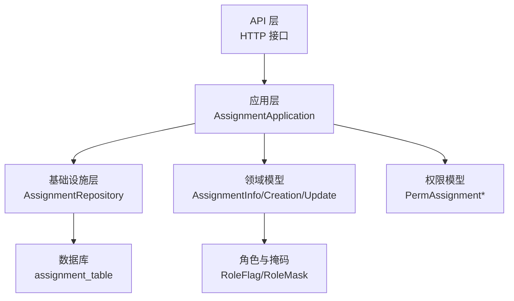
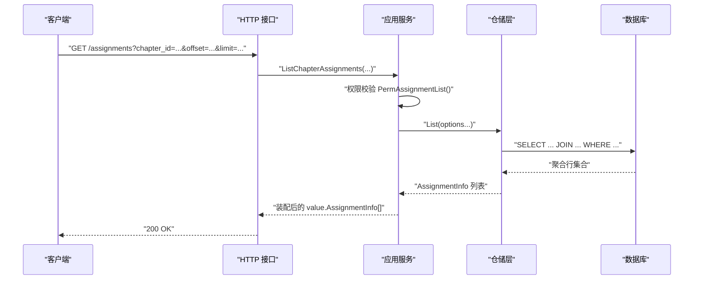
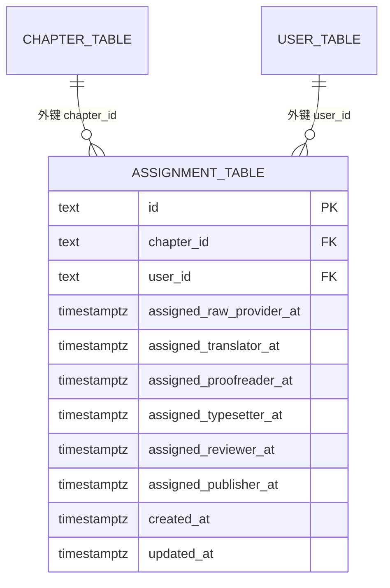
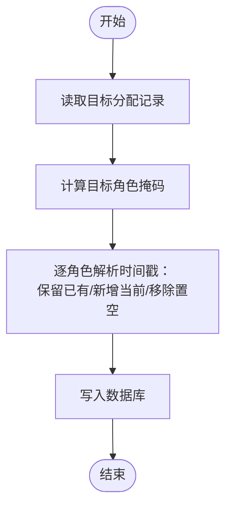
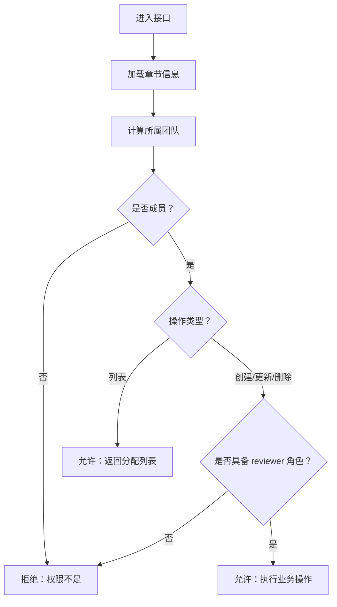
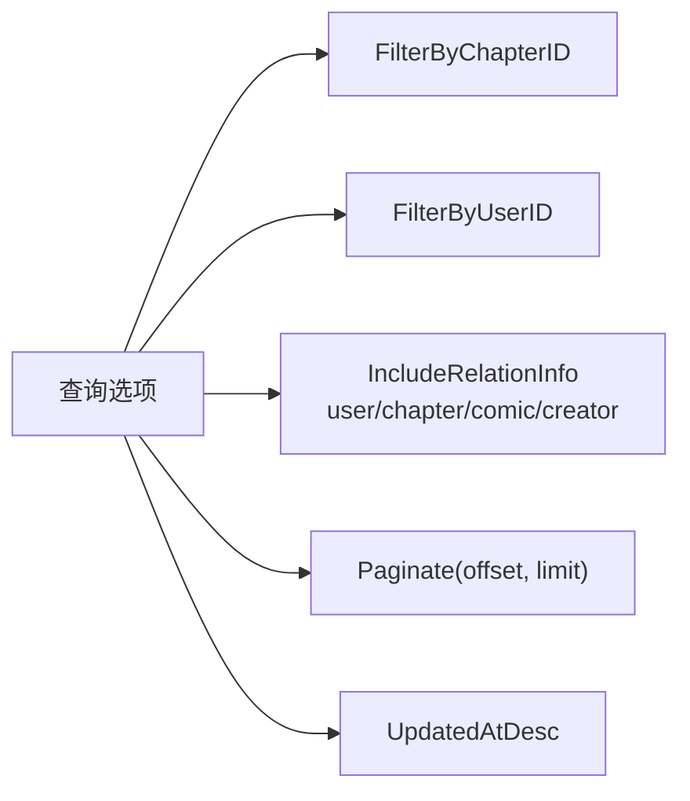
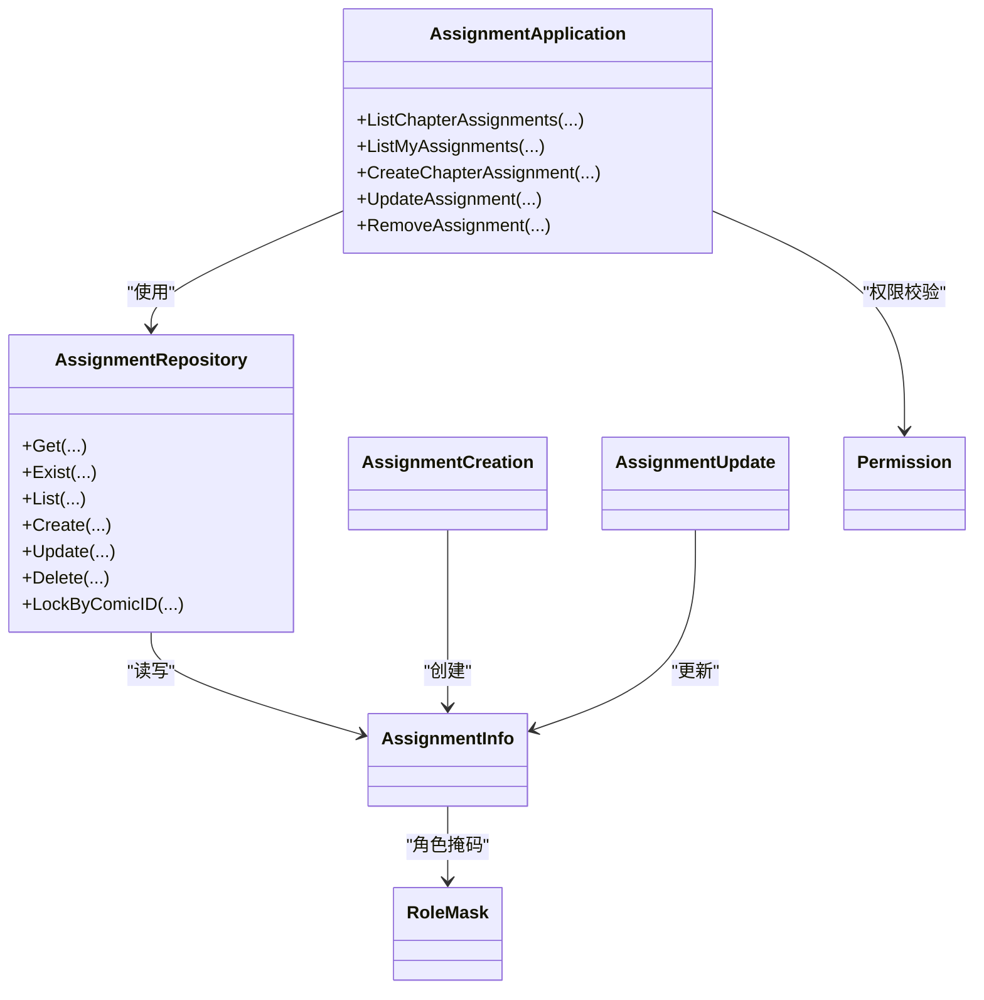

# 任务分配表设计

<cite>
**本文档引用的文件**
- [assignment.go](file://internal/domain/model/assignment.go)
- [assignment.go](file://internal/infrastructure/repository/entity/assignment.go)
- [assignment.go](file://internal/application/assembler/assignment.go)
- [assignment.go](file://internal/infrastructure/repository/assignment.go)
- [assignment.go](file://internal/application/assignment.go)
- [assignment.go](file://internal/api/http/assignment.go)
- [assignment.go](file://internal/infrastructure/repository/query_option/assignment.go)
- [role.go](file://internal/domain/model/role.go)
- [permission.go](file://internal/domain/model/permission.go)
- [assignment.go](file://internal/value/assignment.go)
- [assignment-table.up.sql](file://migrations/20260306101215_assignment-table.up.sql)
- [workflow.go](file://internal/domain/model/workflow.go)
</cite>

## 目录
1. [简介](#简介)
2. [项目结构](#项目结构)
3. [核心组件](#核心组件)
4. [架构总览](#架构总览)
5. [详细组件分析](#详细组件分析)
6. [依赖关系分析](#依赖关系分析)
7. [性能考虑](#性能考虑)
8. [故障排除指南](#故障排除指南)
9. [结论](#结论)
10. [附录](#附录)

## 简介
本设计文档围绕 poprako-web-ms 项目的任务分配表（assignment_table）进行系统化梳理，重点阐述：
- 表结构设计与字段含义（任务状态、负责人、时间戳等）
- 与用户、工作集、漫画、章节的关系与约束
- 角色掩码与状态机设计（基于时间戳的职责状态）
- 权限控制与可见性管理
- 查询与统计优化策略
- 审计追踪与变更历史记录建议

## 项目结构
任务分配功能横跨领域层、应用层、基础设施层与 API 层，形成清晰的分层架构：
- 领域层：定义 AssignmentInfo、AssignmentCreation、AssignmentUpdate 等模型与角色掩码
- 应用层：封装业务逻辑，执行权限校验与装配
- 基础设施层：数据库实体映射、仓储实现与查询选项
- API 层：HTTP 接口定义与参数解析

图表来源
- [assignment.go:10-228](file://internal/api/http/assignment.go#L10-L228)
- [assignment.go:20-90](file://internal/application/assignment.go#L20-L90)
- [assignment.go:10-143](file://internal/infrastructure/repository/assignment.go#L10-L143)
- [assignment.go:5-190](file://internal/domain/model/assignment.go#L5-L190)
- [role.go:3-56](file://internal/domain/model/role.go#L3-L56)
- [permission.go:541-621](file://internal/domain/model/permission.go#L541-L621)

章节来源
- [assignment.go:10-228](file://internal/api/http/assignment.go#L10-L228)
- [assignment.go:20-90](file://internal/application/assignment.go#L20-L90)
- [assignment.go:10-143](file://internal/infrastructure/repository/assignment.go#L10-L143)
- [assignment.go:5-190](file://internal/domain/model/assignment.go#L5-L190)
- [role.go:3-56](file://internal/domain/model/role.go#L3-L56)
- [permission.go:541-621](file://internal/domain/model/permission.go#L541-L621)

## 核心组件
- 数据模型
  - AssignmentInfo：包含章节 ID、用户 ID、各角色的分配时间戳、创建与更新时间
  - AssignmentCreation：创建时按角色掩码生成对应时间戳
  - AssignmentUpdate：PUT 语义的全量替换，保留已有角色时间戳
- 角色与掩码
  - RoleFlag/RoleMask：定义原始提供者、翻译、校对、排版、复审、发布等角色
- 实体与仓储
  - AssignmentInfoRow/AssignmentIncludeRow：ORM 映射与聚合查询结果
  - AssignmentRepository：提供增删改查、存在性检查、事务与索引支持
- 应用服务
  - AssignmentApplication：封装列表、创建、更新、删除，并执行权限校验
- API 层
  - 提供 /assignments、/assignments/mine、/assignments/{id} 等接口
- 查询选项
  - 支持按章节/用户过滤与多维关联包含（用户、章节、漫画、章节创建者）

章节来源
- [assignment.go:5-190](file://internal/domain/model/assignment.go#L5-L190)
- [assignment.go:11-191](file://internal/infrastructure/repository/entity/assignment.go#L11-L191)
- [assignment.go:82-143](file://internal/infrastructure/repository/assignment.go#L82-L143)
- [assignment.go:92-358](file://internal/application/assignment.go#L92-L358)
- [assignment.go:25-228](file://internal/api/http/assignment.go#L25-L228)
- [assignment.go:15-112](file://internal/infrastructure/repository/query_option/assignment.go#L15-L112)
- [role.go:9-17](file://internal/domain/model/role.go#L9-L17)

## 架构总览
任务分配的端到端流程如下：

图表来源
- [assignment.go:25-52](file://internal/api/http/assignment.go#L25-L52)
- [assignment.go:92-157](file://internal/application/assignment.go#L92-L157)
- [assignment.go:61-80](file://internal/infrastructure/repository/assignment.go#L61-L80)
- [assignment.go:15-101](file://internal/infrastructure/repository/query_option/assignment.go#L15-L101)

章节来源
- [assignment.go:25-52](file://internal/api/http/assignment.go#L25-L52)
- [assignment.go:92-157](file://internal/application/assignment.go#L92-L157)
- [assignment.go:61-80](file://internal/infrastructure/repository/assignment.go#L61-L80)
- [assignment.go:15-101](file://internal/infrastructure/repository/query_option/assignment.go#L15-L101)

## 详细组件分析

### 表结构与字段设计
- 主键与外键
  - id：主键
  - chapter_id：指向 chapter_table 的外键，级联删除
  - user_id：指向 user_table 的外键，级联删除
  - 唯一约束：(chapter_id, user_id)，防止同一章节重复分配给同一用户
- 角色时间戳字段
  - assigned_raw_provider_at、assigned_translator_at、assigned_proofreader_at、assigned_typesetter_at、assigned_reviewer_at、assigned_publisher_at
  - 采用带时区的时间戳，非空表示该角色已被分配；为空表示未分配
- 通用字段
  - created_at、updated_at：默认当前时间，便于审计与排序

图表来源
- [assignment-table.up.sql:1-26](file://migrations/20260306101215_assignment-table.up.sql#L1-L26)

章节来源
- [assignment-table.up.sql:1-26](file://migrations/20260306101215_assignment-table.up.sql#L1-L26)

### 角色与状态机设计
- 角色定义
  - 原始提供者、翻译、校对、排版、复审、发布、管理员
- 状态机
  - 以各角色时间戳的存在与否作为“已分配/未分配”的状态
  - 新增时按角色掩码设置当前时间戳
  - 更新时采用 PUT 语义：保留已有时间戳，新增角色写入当前时间，移除角色置空
- 角色掩码工具
  - 支持掩码计算、解包，便于前端/调用方表达多角色

图表来源
- [assignment.go:164-189](file://internal/domain/model/assignment.go#L164-L189)
- [assignment.go:105-122](file://internal/infrastructure/repository/assignment.go#L105-L122)

章节来源
- [assignment.go:57-111](file://internal/domain/model/assignment.go#L57-L111)
- [assignment.go:113-189](file://internal/domain/model/assignment.go#L113-L189)
- [assignment.go:105-122](file://internal/infrastructure/repository/assignment.go#L105-L122)
- [role.go:9-17](file://internal/domain/model/role.go#L9-L17)

### 权限控制与可见性管理
- 权限模型
  - 列表：要求用户为汉化组成员（通过章节所属漫画的团队判定）
  - 创建/更新/删除：要求用户具备 reviewer 角色
- 权限检查流程
  - 加载章节信息 → 计算所属团队 → 成员校验 → 角色校验
- 可见性
  - 列表接口仅对汉化组成员开放
  - 用户视角的“我的分配”接口仅返回当前用户的分配记录

图表来源
- [permission.go:553-621](file://internal/domain/model/permission.go#L553-L621)
- [assignment.go:112-122](file://internal/application/assignment.go#L112-L122)
- [assignment.go:297-304](file://internal/application/assignment.go#L297-L304)

章节来源
- [permission.go:553-621](file://internal/domain/model/permission.go#L553-L621)
- [assignment.go:92-157](file://internal/application/assignment.go#L92-L157)
- [assignment.go:214-265](file://internal/application/assignment.go#L214-L265)
- [assignment.go:267-315](file://internal/application/assignment.go#L267-L315)
- [assignment.go:317-357](file://internal/application/assignment.go#L317-L357)

### 查询与统计优化
- 查询选项
  - FilterByChapterID/FilterByUserID：快速定位
  - IncludeRelationInfo：按需 JOIN 用户、章节、漫画、章节创建者，避免 N+1
- 分页与排序
  - 默认按 updated_at 降序，结合分页参数
- 索引
  - chapter_id、user_id 上建立索引，提升过滤与连接性能
- 统计建议
  - 可基于角色时间戳统计“已分配人数”、“各角色完成率”
  - 结合章节/漫画维度进行聚合统计

图表来源
- [assignment.go:15-112](file://internal/infrastructure/repository/query_option/assignment.go#L15-L112)
- [assignment.go:61-80](file://internal/infrastructure/repository/assignment.go#L61-L80)

章节来源
- [assignment.go:15-112](file://internal/infrastructure/repository/query_option/assignment.go#L15-L112)
- [assignment.go:61-80](file://internal/infrastructure/repository/assignment.go#L61-L80)
- [assignment-table.up.sql:21-25](file://migrations/20260306101215_assignment-table.up.sql#L21-L25)

### 审计追踪与变更历史
- 现状
  - created_at/updated_at 记录创建与最后更新时间
  - 各角色时间戳记录“何时分配某角色”
- 建议
  - 引入独立的审计日志表，记录每次分配的变更（操作人、角色变更前后、时间）
  - 对敏感操作（创建/更新/删除）增加操作流水号与事务绑定
  - 提供变更历史查询接口，支持按章节/用户/角色维度检索

章节来源
- [assignment.go:23-25](file://internal/domain/model/assignment.go#L23-L25)
- [assignment.go:25-26](file://internal/infrastructure/repository/entity/assignment.go#L25-L26)
- [assignment.go:82-103](file://internal/infrastructure/repository/assignment.go#L82-L103)
- [assignment.go:105-122](file://internal/infrastructure/repository/assignment.go#L105-L122)

## 依赖关系分析
- 组件耦合
  - 应用层依赖仓储接口与权限模型，保持业务逻辑与数据访问分离
  - 仓储层依赖 ORM 映射与查询选项，保证 SQL 构造的可维护性
- 外部依赖
  - HTTP 层依赖应用服务与状态管理
  - 权限模型依赖成员、漫画、工作集、章节等加载器

图表来源
- [assignment.go:48-90](file://internal/application/assignment.go#L48-L90)
- [assignment.go:10-27](file://internal/infrastructure/repository/assignment.go#L10-L27)
- [assignment.go:5-190](file://internal/domain/model/assignment.go#L5-L190)
- [role.go:3-56](file://internal/domain/model/role.go#L3-L56)
- [permission.go:541-621](file://internal/domain/model/permission.go#L541-L621)

章节来源
- [assignment.go:48-90](file://internal/application/assignment.go#L48-L90)
- [assignment.go:10-27](file://internal/infrastructure/repository/assignment.go#L10-L27)
- [assignment.go:5-190](file://internal/domain/model/assignment.go#L5-L190)
- [role.go:3-56](file://internal/domain/model/role.go#L3-L56)
- [permission.go:541-621](file://internal/domain/model/permission.go#L541-L621)

## 性能考虑
- 索引策略
  - 为 chapter_id、user_id 建立索引，加速过滤与 JOIN
- 查询优化
  - 使用 IncludeRelationInfo 按需加载关联，避免不必要的 JOIN
  - 分页参数限制单次返回量，降低内存压力
- 写入优化
  - 批量创建/更新时复用事务，减少往返开销
- 缓存建议
  - 对热门章节的分配列表进行短期缓存，结合更新事件失效

章节来源
- [assignment-table.up.sql:21-25](file://migrations/20260306101215_assignment-table.up.sql#L21-L25)
- [assignment.go:29-101](file://internal/infrastructure/repository/query_option/assignment.go#L29-L101)
- [assignment.go:124-144](file://internal/application/assignment.go#L124-L144)

## 故障排除指南
- 权限不足
  - 确认用户是否为汉化组成员，以及是否具备 reviewer 角色
- 参数错误
  - 检查章节 ID、用户 ID、角色掩码与分页参数
- 重复分配
  - 唯一约束会阻止同一章节对同一用户的重复分配
- 时间戳异常
  - 更新采用 PUT 语义，确认角色掩码与现有时间戳的预期行为

章节来源
- [assignment.go:99-102](file://internal/application/assignment.go#L99-L102)
- [assignment.go:243-254](file://internal/application/assignment.go#L243-L254)
- [assignment.go:274-277](file://internal/application/assignment.go#L274-L277)
- [assignment.go:332-339](file://internal/application/assignment.go#L332-L339)

## 结论
任务分配表通过“角色时间戳”实现了灵活的状态机设计，配合完善的权限模型与查询选项，满足多维关联展示与高效检索需求。建议后续引入独立审计日志与变更历史接口，进一步完善合规与可追溯性。

## 附录
- API 定义概览
  - GET /assignments：按章节列出分配（需成员权限）
  - GET /assignments/mine：列出当前用户分配（无需特殊角色）
  - POST /assignments：创建分配（需 reviewer 角色）
  - PUT /assignments/{id}：更新分配（全量替换，需 reviewer 角色）
  - DELETE /assignments/{id}：删除分配（需 reviewer 角色）

章节来源
- [assignment.go:10-228](file://internal/api/http/assignment.go#L10-L228)
- [assignment.go:33-131](file://internal/value/assignment.go#L33-L131)